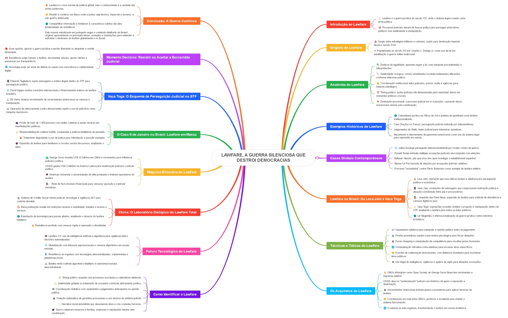

# LAWFARE, A GUERRA SILENCIOSA QUE DESTRÓI DEMOCRACIAS ✨

## Introdução ao Lawfare
- ⚖️ Lawfare é a guerra jurídica do século XXI, onde o sistema legal é usado como arma política.
- 🎯 Processos judiciais deixam de buscar justiça para perseguir adversários políticos com seletividade e manipulação.

## Origens do Lawfare
- 🏰 Surgiu entre estratégias militares e coloniais, usado para dominação imperial desde o século XVIII.
- ✈️ Popularizado no século XXI por Charles J. Dunlap Jr. como uso da lei em substituição à guerra militar tradicional.

## Anatomia do Lawfare
- 🎭 Disfarce de legalidade: aparenta seguir a lei, mas manipula procedimentos e interpretações.
- 🔪 Seletividade cirúrgica: crimes semelhantes recebem tratamentos diferentes conforme interesse político.
- 🤝 Coordenação institucional entre judiciário, polícia, mídia e agências para impacto estratégico.
- ⏰ Timing político: ações judiciais são temporizadas para maximizar danos em momentos políticos cruciais.
- 💥 Destruição processual: o processo judicial em si é punição, causando danos irreversíveis mesmo sem condenação.

## Exemplos Históricos de Lawfare
- 🌍 Colonialismo jurídico na África do Sul e sistema de apartheid como lawfare institucionalizado.
- 🇫🇷 Caso Dreyfus na França, perseguição judicial motivada por antissemitismo.
- 🇷🇺 Julgamentos de Stalin, teatro judicial para exterminar opositores.
- 🇺🇸 Macartismo e internamento de japoneses-americanos como uso do sistema legal para repressão em massa.

## Casos Globais Contemporâneos
- 🌐 Julian Assange perseguido internacionalmente por revelar crimes de guerra.
- 🇺🇸 Donald Trump enfrenta múltiplas acusações judiciais sincronizadas com eleições.
- 🇪🇸 Baltasar Garzón, juiz que virou alvo após investigar o establishment espanhol.
- 🇫🇷 Marine Le Pen barrada de eleições por acusações judiciais seletivas.
- 🇧🇷 Processo "rachadinha" contra Flávio Bolsonaro como exemplo de lawfare seletivo.

## Lawfare no Brasil: Da Lava Jato à Vaza Toga
- 🚨 Lava Jato: operação que usou táticas brutais e seletivas para perseguição política e econômica.
- 📱 Vaza Jato: revelações de mensagens que comprovaram motivação política e atuação coordenada entre juiz e procuradores.
- 🕵️‍♂️ Inquérito das Fake News: expansão do lawfare para controle da dissidência e censura digital no país.
- ⚖️ Vaza Toga: exposições recentes revelam corrupção e manipulação dentro do STF, ampliando o lawfare para todos os lados políticos.
- 🌍 Lei Magnitsky e internacionalização da guerra jurídica contra ministros brasileiros.

## Técnicas e Táticas do Lawfare
- 📰 Vazamentos seletivos para manipular a opinião pública antes do julgamento.
- 🚔 Prisões preventivas usadas como tortura psicológica para forçar delações.
- 🏛️ Forum shopping e manipulação de competência para escolher juízes favoráveis.
- 🔄 Criminalização retroativa e leis elásticas para encaixar alvos específicos.
- 🤝 Acordos de colaboração direcionados, com delatores orientados para incriminar alvos políticos.
- 👁️ Uso ilegal de inteligência, vigilância e quebra de sigilo para alimentar acusações.

## Os Arquitetos do Lawfare
- 💰 ONG’s bilionárias como Open Society de George Soros financiam movimentos e imprensa seletiva.
- 🇺🇸 USAID atua na "modernização" judicial com histórico de apoio a repressão e doutrinação.
- 🏛️ Universidades americanas treinam juízes e promotores para aplicar técnicas de lawfare.
- 🤝 Coordenação em rede entre ONG’s, governos e academia para manter o sistema funcionando.
- 🔄 O sistema se auto-organiza, transformando o lawfare em norma endêmica.

## Como Identificar o Lawfare
- ⏳ Timing político suspeito com processos acordados a calendários eleitorais.
- ⚖️ Seletividade gritante no tratamento de acusados conforme alinhamento político.
- 📺 Coordenação midiática com vazamentos e julgamentos antecipados na opinião pública.
- 🏛️ Violação sistemática de garantias processuais e uso abusivo do sistema judicial.
- 💬 Narrativa moral absolutista que desumaniza alvos e cria cruzadas heroicas.
- 💣 Danos colaterais massivos a famílias, empresas e reputações mesmo sem condenação.

## Futuro Tecnológico do Lawfare
- 🤖 Lawfare 3.0: uso de inteligência artificial e algoritmos para vigilância total e decisões automatizadas.
- 🌐 Globalização com tribunais supranacionais e censura algorítmica em escala mundial.
- 🛡️ Resistência se organiza com tecnologias descentralizadas, criptomoedas e plataformas livres.
- ⚔️ Batalha entre controle algorítmico totalitário e autonomia humana descentralizada.

## China: O Laboratório Distópico do Lawfare Total
- 📹 Sistema de Crédito Social chinês junta lei, tecnologia e vigilância 24/7 para controle absoluto.
- 🚫 Baixa pontuação resulta em restrições severas à mobilidade, trabalho e acesso a serviços.
- 🌍 Exportação da tecnologia para países aliados, ampliando o alcance do lawfare totalitário.
- 🔒 Resistência proibida com censura rígida e repressão a dissidentes.

## Máquina Bilionária do Lawfare
- 💵 George Soros investiu US$ 32 bilhões em ONGs e movimentos para influência judicial e política.
- 🇺🇸 USAID gastou US$ 2 bilhões na América Latina para doutrinação judicial e controle político.
- 🎓 American University e universidades de elite produzem e treinam operadores do lawfare.
- 🕵️‍♂️ Rede de fact-checkers financiada para censurar oposição e controlar narrativas.

## O Caso 8 de Janeiro no Brasil: Lawfare em Massa
- 👥 Prisão de mais de 1.400 pessoas com multas coletivas e penas severas por manifestações políticas.
- ⚖️ Responsabilização coletiva inédita, comparada a práticas totalitárias do passado.
- 🏚️ Tratamento degradante e uso da justiça para intimidação e punição exemplar.
- 💣 Expansão do lawfare para familiares e círculos sociais dos presos, ampliando o dano.

## Vaza Toga: O Esquema de Perseguição Judicial no STF
- 📲 Eduardo Tagliaferro expôs mensagens e ordens ilegais dentro do STF para perseguição política.
- 🌐 David Ágape revelou conexões internacionais e financiamento externo do lawfare brasileiro.
- 🔬 Eli Vieira mostrou envolvimento de universidades americanas na censura e manipulação.
- ⚔️ Operação de silenciamento contra denunciantes expõe o uso do judiciário como máquina repressora.

## Momento Decisivo: Resistir ou Aceitar a Escravidão Judicial
- 🛑 Duas opções: ignorar a guerra jurídica e perder liberdade ou despertar e resistir ativamente.
- 📢 Resistência exige nomear o lawfare, documentar abusos, apoiar vítimas e pressionar por transparência.
- 💻 Tecnologia pode ser arma de defesa se usada com consciência e solidariedade digital.

## Conclusão: A Guerra Continua
- 🔥 Lawfare é o novo normal da política global, mas o conhecimento e a verdade são armas poderosas.
- 🤝 Resistir é construir um futuro onde a justiça seja técnica, imparcial e humana, e não guerra disfarçada.
- 🌍 Compartilhar informação e fortalecer a consciência coletiva são atos fundamentais de resistência.

---

Este resumo estruturado em português segue o conteúdo detalhado da thread original, apresentando os principais temas, exemplos e orientações para entender e enfrentar o fenômeno do lawfare globalmente e no Brasil.

LAWFARE: [A GUERRA SILENCIOSA QUE DESTRÓI DEMOCRACIAS](https://twitter-thread.com/t/1954356565856637340)
