# LAWFARE, A GUERRA SILENCIOSA QUE DESTRÓI DEMOCRACIAS ✨

```mermaid
mindmap
  root((Censura, Eleições, Escândalos, Abusos e Violações no Brasil))
    1. Introdução
      Objetivo do relatório
        Mapear práticas de censura no ambiente digital e institucional
        Identificar atores e estruturas envolvidas
        Analisar impactos na democracia e nos direitos fundamentais
      Ênfase analítica
        Atuação do TSE e STF
        Operações policiais e inquéritos
        Táticas informacionais e manipulação de narrativas
        Influência de ONGs e think tanks estrangeiros
        Consequências políticas e sociais

    2. Detalhamento
      2.1 Censura Sistêmica e Bastidores
        Estrutura paralela de monitoramento e remoção de conteúdo crítico ao TSE e STF
        Letícia Sallorenzo ("Bruxa da Vaza Toga")
          Atua como colaboradora informal
          Produz e envia dossiês
          Pressiona plataformas e autoridades
          Sem vínculo oficial com o TSE
        Negativa institucional
          TSE nega colaboração
          Relatos internos confirmam pressões
          Foco em críticos de Alexandre de Moraes

      2.2 Relatórios Técnicos e Criminalização do Dissenso
        Uso da tese de firehosing (inundação informacional)
          Por PF e TSE
          Justificativa para reprimir conteúdos críticos
          Aplicado sem evidência robusta
        Alvos principais
          Instituto Voto Legal (IVL)
          Carlos Rocha e Éder Balbino
        Criminalização de falhas técnicas
          Apontar vulnerabilidades = "golpismo"
          Sem análise técnica independente
        Distorção internacional
          Influenciadores como Fernando Cerimedo
          Estudos técnicos distorcidos
          Resulta em censura e inquéritos sem base

      2.3 Lawfare e Repressão Judicial
        Liderança de Alexandre de Moraes (STF)
          Centralização de inquéritos
          Decisões monocráticas e sigilosas
        Características do lawfare
          Inquéritos sem prazo definido
          Multas excessivas por opiniões
          Sanções a advogados e jornalistas
          Ataques ao contraditório e à ampla defesa
        Medidas abusivas
          Censura prévia de reportagens
          Bloqueios de contas sem processo
          Ausência de transparência nas decisões

    3. Pontos Importantes
      Bastidores da censura digital
        Núcleo paralelo fora de canais oficiais
      Criminalização da auditoria técnica
        Especialistas perseguidos por relatórios
      Difusão internacional de alegações
        ONGs e consultores amplificam narrativas
      Lawfare sistêmico
        Multas altas, bloqueios, censura prévia
        Ausência de defesa
      Ingerência internacional
        Apoio de NED, USAID, DFRLab
      Ocultamento institucional
        TSE e STF não divulgam dados sobre bloqueios

    4. Modus Operandi
      4.1 Estrutura Paralela de Monitoramento
        Ativistas informais na Assessoria Especial do TSE
        Produção de dossiês sem registro
        Pressão indireta sobre plataformas
      4.2 Centralização e Opacidade
        Decisões monocráticas (Alexandre de Moraes)
        Processos físicos sem sorteio de relatoria
        Investigação sigilosa sem acesso
      4.3 Instrumentalização de Especialistas e ONGs
        Importação de conceitos como firehosing
        Origem: RAND Corporation
        Legitimação de ações via think tanks
      4.4 Censura via Plataformas
        Exigência de dados sem ordem judicial
        Perseguição a jornalistas e críticos
        Colaboração de big techs (Twitter, Meta)
      4.5 Sanções Desproporcionais
        Multas altas para induzir autocensura
        Alvos: criadores pequenos e institutos técnicos
      4.6 Difusão de Escândalos sem Investigação
        Denúncias de fraude → repressão
        Falta de auditoria técnica
        Prioridade à censura, não verificação

    5. Atores Envolvidos
      5.1 Individuais
        Letícia Sallorenzo
          Articuladora de dossiês
          Influência junto a auxiliares de Moraes
        Alexandre de Moraes (STF)
          Principal agente de inquéritos
          Centraliza poder de decisão
        Carlos Rocha e Éder Balbino
          Engenheiros criminalizados
          Relatórios técnicos sobre urnas
        Fernando Cerimedo
          Consultor argentino
          Internacionalizou alegações
          Posteriormente indiciado
      5.2 Instituições e Redes
        Tribunal Superior Eleitoral (TSE)
          Epicentro da censura digital
          Bloqueios sem transparência
          Expansão de poder sem prestação de contas
        Supremo Tribunal Federal (STF)
          Viabiliza lawfare
          Inquéritos sigilosos
          Decisões sem contraditório
        Polícia Federal (PF)
          Elabora relatórios frágeis
          Braço técnico de inquéritos políticos
        ONGs e Think Tanks Estrangeiros
          NED
            Financiamento de controle informacional
          USAID
            Apoio a iniciativas de "desinformação"
          DFRLab (Atlantic Council)
            Metodologia de análise de redes
          RAND Corporation
            Desenvolveu conceito de firehosing

```

## Introdução ao Lawfare
- ⚖️ Lawfare é a guerra jurídica do século XXI, onde o sistema legal é usado como arma política.
- 🎯 Processos judiciais deixam de buscar justiça para perseguir adversários políticos com seletividade e manipulação.

## Origens do Lawfare
- 🏰 Surgiu entre estratégias militares e coloniais, usado para dominação imperial desde o século XVIII.
- ✈️ Popularizado no século XXI por Charles J. Dunlap Jr. como uso da lei em substituição à guerra militar tradicional.

## Anatomia do Lawfare
- 🎭 Disfarce de legalidade: aparenta seguir a lei, mas manipula procedimentos e interpretações.
- 🔪 Seletividade cirúrgica: crimes semelhantes recebem tratamentos diferentes conforme interesse político.
- 🤝 Coordenação institucional entre judiciário, polícia, mídia e agências para impacto estratégico.
- ⏰ Timing político: ações judiciais são temporizadas para maximizar danos em momentos políticos cruciais.
- 💥 Destruição processual: o processo judicial em si é punição, causando danos irreversíveis mesmo sem condenação.

## Exemplos Históricos de Lawfare
- 🌍 Colonialismo jurídico na África do Sul e sistema de apartheid como lawfare institucionalizado.
- 🇫🇷 Caso Dreyfus na França, perseguição judicial motivada por antissemitismo.
- 🇷🇺 Julgamentos de Stalin, teatro judicial para exterminar opositores.
- 🇺🇸 Macartismo e internamento de japoneses-americanos como uso do sistema legal para repressão em massa.

## Casos Globais Contemporâneos
- 🌐 Julian Assange perseguido internacionalmente por revelar crimes de guerra.
- 🇺🇸 Donald Trump enfrenta múltiplas acusações judiciais sincronizadas com eleições.
- 🇪🇸 Baltasar Garzón, juiz que virou alvo após investigar o establishment espanhol.
- 🇫🇷 Marine Le Pen barrada de eleições por acusações judiciais seletivas.
- 🇧🇷 Processo "rachadinha" contra Flávio Bolsonaro como exemplo de lawfare seletivo.

## Lawfare no Brasil: Da Lava Jato à Vaza Toga
- 🚨 Lava Jato: operação que usou táticas brutais e seletivas para perseguição política e econômica.
- 📱 Vaza Jato: revelações de mensagens que comprovaram motivação política e atuação coordenada entre juiz e procuradores.
- 🕵️‍♂️ Inquérito das Fake News: expansão do lawfare para controle da dissidência e censura digital no país.
- ⚖️ Vaza Toga: exposições recentes revelam corrupção e manipulação dentro do STF, ampliando o lawfare para todos os lados políticos.
- 🌍 Lei Magnitsky e internacionalização da guerra jurídica contra ministros brasileiros.

## Técnicas e Táticas do Lawfare
- 📰 Vazamentos seletivos para manipular a opinião pública antes do julgamento.
- 🚔 Prisões preventivas usadas como tortura psicológica para forçar delações.
- 🏛️ Forum shopping e manipulação de competência para escolher juízes favoráveis.
- 🔄 Criminalização retroativa e leis elásticas para encaixar alvos específicos.
- 🤝 Acordos de colaboração direcionados, com delatores orientados para incriminar alvos políticos.
- 👁️ Uso ilegal de inteligência, vigilância e quebra de sigilo para alimentar acusações.

## Os Arquitetos do Lawfare
- 💰 ONG’s bilionárias como Open Society de George Soros financiam movimentos e imprensa seletiva.
- 🇺🇸 USAID atua na "modernização" judicial com histórico de apoio a repressão e doutrinação.
- 🏛️ Universidades americanas treinam juízes e promotores para aplicar técnicas de lawfare.
- 🤝 Coordenação em rede entre ONG’s, governos e academia para manter o sistema funcionando.
- 🔄 O sistema se auto-organiza, transformando o lawfare em norma endêmica.

## Como Identificar o Lawfare
- ⏳ Timing político suspeito com processos acordados a calendários eleitorais.
- ⚖️ Seletividade gritante no tratamento de acusados conforme alinhamento político.
- 📺 Coordenação midiática com vazamentos e julgamentos antecipados na opinião pública.
- 🏛️ Violação sistemática de garantias processuais e uso abusivo do sistema judicial.
- 💬 Narrativa moral absolutista que desumaniza alvos e cria cruzadas heroicas.
- 💣 Danos colaterais massivos a famílias, empresas e reputações mesmo sem condenação.

## Futuro Tecnológico do Lawfare
- 🤖 Lawfare 3.0: uso de inteligência artificial e algoritmos para vigilância total e decisões automatizadas.
- 🌐 Globalização com tribunais supranacionais e censura algorítmica em escala mundial.
- 🛡️ Resistência se organiza com tecnologias descentralizadas, criptomoedas e plataformas livres.
- ⚔️ Batalha entre controle algorítmico totalitário e autonomia humana descentralizada.

## China: O Laboratório Distópico do Lawfare Total
- 📹 Sistema de Crédito Social chinês junta lei, tecnologia e vigilância 24/7 para controle absoluto.
- 🚫 Baixa pontuação resulta em restrições severas à mobilidade, trabalho e acesso a serviços.
- 🌍 Exportação da tecnologia para países aliados, ampliando o alcance do lawfare totalitário.
- 🔒 Resistência proibida com censura rígida e repressão a dissidentes.

## Máquina Bilionária do Lawfare
- 💵 George Soros investiu US$ 32 bilhões em ONGs e movimentos para influência judicial e política.
- 🇺🇸 USAID gastou US$ 2 bilhões na América Latina para doutrinação judicial e controle político.
- 🎓 American University e universidades de elite produzem e treinam operadores do lawfare.
- 🕵️‍♂️ Rede de fact-checkers financiada para censurar oposição e controlar narrativas.

## O Caso 8 de Janeiro no Brasil: Lawfare em Massa
- 👥 Prisão de mais de 1.400 pessoas com multas coletivas e penas severas por manifestações políticas.
- ⚖️ Responsabilização coletiva inédita, comparada a práticas totalitárias do passado.
- 🏚️ Tratamento degradante e uso da justiça para intimidação e punição exemplar.
- 💣 Expansão do lawfare para familiares e círculos sociais dos presos, ampliando o dano.

## Vaza Toga: O Esquema de Perseguição Judicial no STF
- 📲 Eduardo Tagliaferro expôs mensagens e ordens ilegais dentro do STF para perseguição política.
- 🌐 David Ágape revelou conexões internacionais e financiamento externo do lawfare brasileiro.
- 🔬 Eli Vieira mostrou envolvimento de universidades americanas na censura e manipulação.
- ⚔️ Operação de silenciamento contra denunciantes expõe o uso do judiciário como máquina repressora.

## Momento Decisivo: Resistir ou Aceitar a Escravidão Judicial
- 🛑 Duas opções: ignorar a guerra jurídica e perder liberdade ou despertar e resistir ativamente.
- 📢 Resistência exige nomear o lawfare, documentar abusos, apoiar vítimas e pressionar por transparência.
- 💻 Tecnologia pode ser arma de defesa se usada com consciência e solidariedade digital.

## Conclusão: A Guerra Continua
- 🔥 Lawfare é o novo normal da política global, mas o conhecimento e a verdade são armas poderosas.
- 🤝 Resistir é construir um futuro onde a justiça seja técnica, imparcial e humana, e não guerra disfarçada.
- 🌍 Compartilhar informação e fortalecer a consciência coletiva são atos fundamentais de resistência.

---

Este resumo estruturado em português segue o conteúdo detalhado da thread original, apresentando os principais temas, exemplos e orientações para entender e enfrentar o fenômeno do lawfare globalmente e no Brasil.

LAWFARE: [A GUERRA SILENCIOSA QUE DESTRÓI DEMOCRACIAS](https://twitter-thread.com/t/1954356565856637340)
