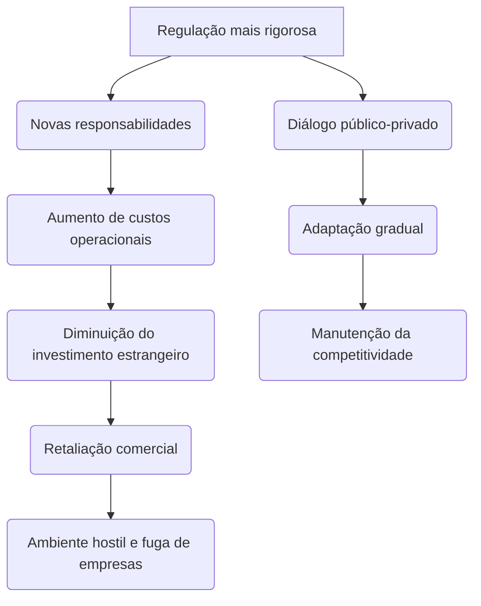
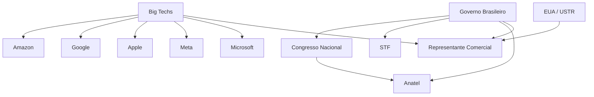
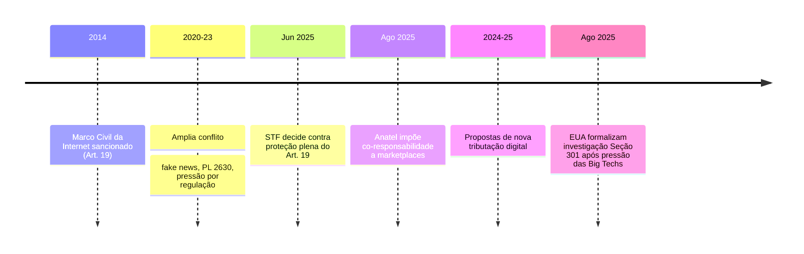

- &nbsp;
{:toc .large-only}

# **“Brasil, Big Techs e Seção 301: Choque Regulatório e o Futuro do Ambiente Digital”**  

## 📄 Relatório Especial  

**Descrição:**  
Relatório técnico detalha o embate Brasil–big techs diante da Seção 301 dos EUA, cobrindo pontos factuais, análise regulatória, riscos e oportunidades, estratégias de outros países e recomendações para o ambiente digital nacional.

**Resumo Geral:**  
O Brasil enfrenta uma pressão internacional sem precedentes após gigantes digitais norte-americanas denunciarem às autoridades comerciais dos EUA práticas que consideram restritivas e hostis ao setor. As críticas envolvem decisões do STF sobre responsabilidade de plataformas (Marco Civil, Art. 19), normas da Anatel que transferem a marketplaces parte da responsabilização por irregularidades e projetos de tributação do governo federal. Este cenário opõe o direito soberano do país de regular sua economia digital aos interesses globais das big techs, gerando riscos de sanções comerciais pela Seção 301. O debate central gira em torno da busca de equilíbrio entre inovação, responsabilidade e inclusão, enfrentando exigências de harmonização internacional e pressão pelo desenvolvimento de políticas robustas, porém atraentes ao capital e tecnologia estrangeiros.[1][2][3]

***

## 🔒 Classificações de Segurança  
- **Risco regulatório digital**
- **Risco comercial internacional**
- **Conflito jurídico**
- **Segurança de dados**
- **Risco de censura**

**Palavras-chave de Força:**  
- Soberania
- Big Techs
- Seção 301
- Responsabilidade civil
- Tributação digital
- Marco Civil
- Ambientes hostis
- Compliance
- Investimento estrangeiro
- Liberdade de expressão

***

## 📋 Sumário Executivo

O relatório aponta que o Brasil entrou no radar da Seção 301 dos EUA devido à evolução de sua regulação digital. Plataformas como Amazon, Google e Apple enviaram documento ao USTR alegando ambiente hostil: responsabilidades legais amplificadas (especialmente após queda do art. 19 do Marco Civil), novas exigências da Anatel e debate sobre tributação via CSD. Críticas se estendem ao PL de IA e restrições ao uso de dados. O governo argumenta transparência e alinhamento com padrões internacionais.

O principal risco: retaliação comercial norte-americana pode recair sobre exportações brasileiras, trazendo instabilidade e dificultando investimentos estrangeiros no país. Referências globais mostram que outros mercados, como Europa e Reino Unido, também avançaram em regulação, mas com robusto diálogo público-privado e prazos para adaptação. O relatório recomenda revisão regulatória, reforço institucional, maior harmonização internacional e proatividade diplomática para evitar isolamento.[2][4][5][6][7][8][9]

***

## 🏁 Introdução

O presente documento explora o embate entre regulação digital brasileira e as reações das big techs internacionais, no contexto de uma investigação da Seção 301 pelos EUA. Analisa causas, impactos e alternativas estratégicas para a manutenção da competitividade, segurança jurídica e respeito à soberania nacional, em sintonia com a evolução normativa global.

***

## 🧩 Análise do Problema (Diagnóstico)

- 🎯 **Documento internacional:** Amazon, Google, Apple, Microsoft, Meta, Visa e outras criticam o Brasil junto ao USTR por práticas consideradas abusivas no setor digital.[10][11]
- 🏛️ **STF e Marco Civil (Art. 19):** STF afrouxou a exigência de decisão judicial para remoção de conteúdo, podendo responsabilizar plataformas mesmo extrajudicialmente, o que amplia custos e incerteza para redes sociais e market places.[4][6]
- 🏪 **Normas da Anatel:** Anatel impôs co-responsabilidade a marketplaces por produtos ilícitos, exigindo compliance rigoroso e potencialmente gerando sanções, inclusive bloqueios e multas pesadas.[5][12]
- 💸 **Tributação Digital (CSD):** Proposta de Contribuição Social sobre Serviços Digitais amplia a carga tributária do setor de tech, o que é visto como ameaça a modelos de negócios baseados em dados e publicidade.[10]
- 🤖 **PL da IA 2338/2023:** Previsão de regulamentação rígida, acusada de sufocar inovação e dificultar prestação de novos serviços digitais.[7]
- 🌐 **Alegações dos EUA:** Processo da Seção 301 pode culminar em tarifas punitivas sobre exportações brasileiras, dificultando comércio bilateral e elevando insegurança sobre o ambiente digital.[2]
- 📊 **Oposição editorial:** Setor privado denuncia insegurança jurídica e risco de retirada de investimentos estrangeiros.[11]

***

## 📊 Achados & Dados

| Tema                        | Evidência / Detalhe                                                                | Fonte                |
|-----------------------------|------------------------------------------------------------------------------------|----------------------|
| Documento ao USTR           | Big techs denunciam ambiente hostil no Brasil                                      | [10][11]      |
| Decisão STF Art. 19         | Responsabilização civil extrajudicial, ampliando risco de censura prévia           | [4][6]       |
| Anatel e Marketplaces       | Obrigações de compliance com risco de sanções severas                              | [5][12]      |
| Tributação e PL IA          | Preocupações com sufocamento inovativo e aumento da carga fiscal                   | [10][7]      |
| Movimento internacional     | Outros mercados enfrentaram desafios similares: UE, Reino Unido                    | [7][8][9] |

***

## 📑 Relatório Especial: Impacto das Mudanças Regulatórias Digitais Brasileiras e Repercussão Internacional

***

### 🔍 Quais pontos específicos do Marco Civil motivaram a crítica das big techs ao USTR

- As big techs criticaram principalmente a mudança no **Artigo 19 do Marco Civil da Internet**, que antes estabelecia que as plataformas só poderiam ser responsabilizadas por danos causados por conteúdo de terceiros com ordem judicial para remoção e descumprimento pela empresa.  
- A decisão do STF considerou o artigo parcialmente inconstitucional para plataformas abertas, permitindo responsabilização sem ordem judicial e ampliando obrigações de remoção e monitoramento, aproximando o Brasil de regimes de responsabilidade mais rígidos.  
- Além disso, houve críticas quanto à ampliação do dever de diligência e instrumentos de presunção de responsabilidade nos casos de conteúdo impulsionado por pagamento ou disseminados artificialmente, o que gera insegurança jurídica por tornar a responsabilização mais ampla e subjetiva.[1]

***

### ⚖️ Como a decisão do STF sobre o Art. 19 altera a responsabilidade prática das plataformas

- A decisão do STF restringiu a proteção antes concedida: plataformas de redes sociais, fóruns públicos e mecanismos de busca **podem ser responsabilizadas mesmo sem decisão judicial**, desde que haja omissão comprovada na remoção de conteúdo ilícito notificado extrajudicialmente.  
- Introduziu hipóteses de **presunção de responsabilidade**, especialmente para:
  - Conteúdos impulsionados por pagamento;
  - Conteúdos disseminados artificialmente (robôs/bots);
- As plataformas agora precisam adotar mecanismos proativos de monitoramento e resposta rápida, sob risco de responsabilização solidária e multas.  
- Houve ainda obrigação de manutenção de representação legal com poderes amplos no Brasil, facilitando ação judicial e administrativa das autoridades nacionais contra gigantes globais.[1]

***

### 🏪 Que medidas da Anatel geram risco de responsabilização por anúncios de terceiros

- A Anatel passou a exigir que **marketplaces (ex: Amazon, Shopee, Mercado Livre)** operem com maior compliance sobre produtos e anúncios de terceiros em suas plataformas.
- As plataformas podem ser responsabilizadas e até alvo de sanções administrativas caso permitam a venda de produtos ilícitos (ex: celulares sem homologação, medicamentos sem registro) por meio de seus serviços.[^12]
- Isso obriga plataformas a implementar sistemas de fiscalização, controle prévio e mecanismos permanentes de denúncia e resposta para evitar responsabilidade solidária.
- A supervisão passa a ser direta pelo órgão regulador, ampliando o risco e criando exigências pesadas de compliance digital.[^12]

***

### 💣 Quais cenários de retaliação via Seção 301 podem afetar exportações brasileiras

- Caso os EUA concluam pela procedência da denúncia das big techs sob a Seção 301, os cenários de retaliação mais prováveis incluem:
  - **Imposição de tarifas adicionais (sanções) sobre produtos brasileiros** exportados aos EUA, afetando desde commodities a manufaturados com grande valor agregado;
  - **Restrições à importação de bens específicos** ou bloqueio temporário de acordos setoriais, impactando setores como aço, alumínio, carne, café, etanol e até manufaturados têxteis;[^13][^14]
  - Pressão para mudança legislativa, inclusive condicionando acordos bilaterais de livre comércio ou preferências tarifárias à reversão de dispositivos legais considerados restritivos.[^13]
- Já houve precedentes globais envolvendo China, UE, Índia e Indonésia, especialmente em áreas digitais, de propriedade intelectual ou serviços financeiros.[^14][^13]

***

### 🌍 Que estratégias outras jurisdições usaram para evitar sanções comerciais dos EUA

- **Diálogo regulatório e adaptação gradual:** Europa e Reino Unido negociaram cronogramas mais flexíveis de implementação de novas regras para possibilitar adaptação do setor privado e evitar disputas formais.[^15][^16][^17]
- **Negociação multilateral**: Realização de consultas na OMC (Organização Mundial do Comércio), levando divergências para fóruns multilaterais antes da escalada da disputa.
- **Transparência e consulta pública:** Consulta ampliada ao setor privado internacional e ajustes nas normas com base em feedback de empresas afetadas, reduzindo repercussão negativa.
- **Faseamento e mitigação de riscos:** Implementação parcial ou por etapas das novas obrigações, priorizando setores e temas mais sensíveis para ofertar previsibilidade ao setor internacional.

***

### 📈 Gráfico Ilustrativo: Tendência Internacional do Conflito Regulação x Big Techs

***

## 🔎 Análise de Causas

- 🇧🇷 **Soberania regulatória:** Brasil busca maior controle sobre dados, conteúdo e receitas digitais em território nacional.
- 🇺🇸 **Interesses corporativos globais:** Big techs buscam segurança jurídica, uniformidade normativa e baixa carga fiscal.
- ⚖️ **Tensão jurídica:** Alterações no Marco Civil e posicionamento de agências autônomas (como Anatel) criam incerteza sobre deveres e limites de responsabilidade.
- 💬 **Diálogo público-privado insuficiente:** Falta de canais estáveis de negociação e consulta agravou o conflito.
- 🌍 **Harmonização internacional ausente:** Ausência de coordenação efetiva com modelos regulatórios estrangeiros dificulta convergência e reciprocidade.

***

## ⚠️ Análise de Riscos

- **Comercial:** Possibilidade real de tarifas sobre exportações brasileiras devido à Seção 301.
- **Jurídico:** Aumento da litigiosidade, com instabilidades no ambiente de negócios digitais.
- **Tecnológico:** Risco de retirada de serviços, menos acesso a inovação e fuga de talentos.
- **Político:** Tensão diplomática Brasil–EUA, com possível escalada para outros setores estratégicos.

***

## 🏁 Conclusão

O conflito destaca o desafio em equilibrar soberania, responsabilidade digital e atração de investimentos. O Brasil avança em regular o setor, mas a falta de amplo diálogo e previsibilidade pode agravar riscos econômicos e geopolíticos. A experiência internacional aponta que uma transição negociada e transparente é o caminho menos lesivo ao desenvolvimento do ecossistema digital.

***

## 🧠 Mapa Mental de Entidades e Atores

***

## 🛠️ Plano de Ação Detalhado

***

## 📌 O que é a **Seção 301**?
A **Seção 301 do Trade Act de 1974** é um instrumento legal dos EUA que permite ao **USTR** (Escritório do Representante Comercial dos EUA) investigar práticas comerciais de outros países consideradas **injustas, discriminatórias ou que restrinjam o comércio americano**.  
- Se confirmadas irregularidades, os EUA podem **impor sanções unilaterais**, como tarifas, restrições ou retaliações contra produtos do país-alvo.  
- Exemplos históricos: já foi usada contra **China**, **Índia**, **União Europeia** e outros, em disputas sobre subsídios, propriedade intelectual e barreiras digitais.

***

## 📌 Como isso chega ao Brasil?
Segundo o que você resumiu, **Big Techs** (Amazon, Google, Apple, Microsoft, Meta, etc.) enviaram posição formal ao **USTR**, pedindo que a política digital brasileira seja alvo de investigação no âmbito da **Seção 301**.  
Os pontos de tensão (de acordo com o documento das empresas) são:

1. **STF e Marco Civil da Internet**  
   - O Supremo declarou inconstitucional o antigo “porto seguro” do **Artigo 19**, que limitava a responsabilidade de plataformas por conteúdos de usuários.  
   - Agora, empresas podem ser responsabilizadas mais facilmente — o que as Big Techs chamam de “risco de censura preventiva” e “insegurança jurídica”.

2. **Anatel e Marketplaces**  
   - Resolução transfere responsabilidade por anúncios irregulares a plataformas como Amazon, Shopee e Mercado Livre.  
   - Elas alegam que isso cria custos extras e obrigações impossíveis de cumprir em larga escala.

3. **Planos do governo Lula**  
   - Propostas de **tributação sobre serviços digitais** e a **Contribuição Social Digital (CSD)** sobre publicidade online.  
   - Projeto de **regulação da inteligência artificial (PL 2338/2023)**, considerado muito restritivo pelas empresas.

***

## 📌 O argumento das Big Techs
- Dizem que o Brasil se tornou um **ambiente hostil ao setor digital**, com:
  - **Censura disfarçada de regulação** (decisões judiciais e exigências excessivas de remoção de conteúdo);  
  - **Tributação agressiva** (novos impostos sobre publicidade e receita digital);  
  - **Burocracia sufocante** (novas regras da Anatel, STF e Congresso).  

- Alegam que isso:  
  - Aumenta custos;  
  - Gera insegurança jurídica;  
  - Desestimula investimentos e inovação.  

***

## 📌 O risco de retaliação via Seção 301
- Se o USTR aceitar a pressão das empresas e considerar que o **Brasil cria barreiras comerciais abusivas no setor digital**, os EUA podem:
  - Impor **tarifas punitivas** sobre exportações brasileiras;  
  - Restringir a atuação de empresas brasileiras nos EUA;  
  - Criar precedentes contra a regulação digital do país.

- Ou seja, pode virar um **conflito comercial aberto** — com impacto direto sobre exportações (soja, carne, minério, aço etc.), se os EUA decidirem retaliar.

***

## 📌 Narrativa política por trás
- Críticos do governo e do STF apontam que isso seria uma tentativa de **“controle político da internet”** somada a nova carga tributária.  
- Já os defensores argumentam que é fundamental **responsabilizar Big Techs** pelas externalidades que elas causam (fake news, conteúdo ilegal, evasão fiscal).  
- Há tensão entre uma agenda de **soberania digital brasileira** vs. a **pressão internacional das big techs** com respaldo do governo americano.

***

✅ **Resumindo**:  
O caso é sério porque a **Seção 301** é uma arma legal real que os EUA já usaram contra outros países quando sentiram que suas empresas eram prejudicadas. Se o Brasil se mantiver nessa linha regulatória e tributária, o risco de **conflito comercial com Washington** existe, e pode respingar em setores muito além da tecnologia.  

*** 

## 📆 Linha do Tempo: Disputa entre Big Techs, STF e Governo Brasileiro

***

### **2014: Marco Civil da Internet**
- 🏛️ O Marco Civil da Internet (Lei 12.965/2014) é sancionado, estabelecendo o artigo 19, que determina que provedores só podem ser responsabilizados civilmente por conteúdos de terceiros após descumprirem ordem judicial específica de remoção.[1]

***

### **2020–2023: Intensificação das Disputas**
- 💬 Crescem demandas judiciais e debates públicos sobre fake news, discurso de ódio e segurança em plataformas digitais.  
- 📜 Proposta de projetos como o "PL das Fake News" (PL 2630) mobiliza grandes empresas e o Congresso para revisão das regras de responsabilização e moderação de conteúdo.

***

### **Junho de 2025: Decisão do STF sobre o Artigo 19**
- ⚖️ STF declara parcialmente inconstitucional o artigo 19 do Marco Civil, permitindo responsabilização extrajudicial de plataformas por conteúdos ilícitos caso não retirem publicações após notificação da vítima.[2][3]
- 📣 Big techs reagem negativamente, afirmando que a decisão amplia riscos jurídicos e reduz garantias de liberdade de expressão.

***

### **Agosto de 2025: Novas Regras da Anatel para Marketplaces**
- 🛒 Anatel publica a Resolução nº 780/2025, tornando marketplaces corresponsáveis pela comercialização de produtos irregulares e obrigando compliance rigoroso sobre anúncios de terceiros.[4][5][6]
- 🔍 Exigência de código de homologação e fiscalização ativa transforma plataformas em fornecedores, não apenas intermediários.

***

### **2024–2025: Propostas Tributárias e Pressão ao Setor Digital**
- 💰 Governo e Congresso discutem novas formas de tributação do setor digital, como a Contribuição Social sobre Serviços Digitais (CSD) e regras no bojo da reforma tributária.[7]
- 🌐 Big techs denunciam “ambiente hostil” e recorrem ao USTR (Seção 301), pedindo investigação das práticas brasileiras e ameaçando transferir investimentos para outros países.[8][9]

***

### **Agosto de 2025: Início Formal da Investigação Seção 301**
- 🇺🇸 USTR dos EUA abre investigação oficial após memorial das big techs; entidades americanas questionam decisões do STF, normas da Anatel e os planos tributários brasileiros.[8]
- 📉 Risco de sanções comerciais coloca setores exportadores brasileiros em alerta máximo.

***

## **Resumo Visual – Mermaid**

***

## 🌍 Casos de Sucesso & Estratégias Adotadas

### 1. União Europeia (UE)
- Regulamentou via DSA/DMA, focando transparência, moderação proporcional e prazo de adaptação; diálogo constante com o setor.[9][7]

### 2. Reino Unido
- Online Safety Bill trouxe obrigações rígidas, mas permitiu ajustes em consulta pública e fases de implementação.[8]

### 3. Estados Unidos (nível estadual)
- Leis como a Califórnia Consumer Privacy Act (CCPA) demonstram viabilidade de consenso em proteção de dados sem sufocar inovação.[8]

### 4. Austrália
- Negociação mandatória entre plataformas e veículos de mídia para remuneração por conteúdo, após ampla consulta pública.

### 5. Canadá
- Lei de responsabilidade digital implementada em cochordância com players globais e prazos negociados junto a empresas.

***

## 📚 Referências 

1. BRASIL. Ministério das Relações Exteriores. Comentários escritos do Brasil ao USTR no âmbito da Seção 301. Disponível em: https://www.gov.br/mre/pt-br/canais_atendimento/imprensa/notas-a-imprensa/comentarios-escritos-do-brasil-ao-ustr-no-ambito-da-secao-301. Acesso em: 25 ago. 2025.  
2. “Big Techs acusam Brasil de criar ambiente hostil”. Teletime, 21 ago. 2025.  
3. EUA iniciam investigação em face do Brasil com base na Seção 301. Trench Rossi Watanabe, julho/2025.  
4. “Investigação dos EUA contra o Brasil cita Marco Civil”. Teletime, 15 jul. 2025.  
5. MARTINELLI Advogados. STF redefine responsabilidades das plataformas digitais: impactos e novas obrigações. 2025.  
6. EXPOECOMM. “Anatel passa a responsabilizar marketplaces por produtos irregulares”. 2025.  
7. Forbes Tech. “Google avalia impacto da mudança no Artigo 19 do Marco Civil da Internet”. jun. 2025.  
8. BBC Brasil. “Acusações de Trump em investigação comercial contra o Brasil”. jul. 2025.  
9. Economia UOL. “O que é Seção 301?”. 17 ago. 2025.  
10. Mobile Time. “Big Techs acusam Brasil de criar ‘ambiente hostil’ para empresas dos EUA”. 21 ago. 2025.  
11. G1. “Big techs são alvo de multas e processos na Europa; veja casos”. 15 maio 2025.  
12. IPEA. “União Europeia contra as big techs”. 2025.  
13. G1. “Marco civil da internet: como EUA e Europa tratam as ‘big techs’”. 13 jun. 2025.  
14. Amcham Brasil apresenta contribuições à consulta pública da Seção 301 dos Estados Unidos.  
15. GRANERO, F.L.B. Análise tática e estratégica de negociação internacional no segmento de tecnologia: estudo de caso – UFU, 2023.  
16. UNINTER. Estratégias de negociação internacional para empresas de pequeno e médio porte.  
17. REPOSITÓRIO UFU. Análise estratégica de negociação internacional no segmento de tecnologia.  
18. Ministério do Desenvolvimento, Indústria, Comércio e Serviços. Empresas dos EUA declaram apoio ao Brasil para reverter tarifas de Trump. jul. 2025.  
19. Mobile Time. “NetChoice acusa Brasil de práticas injustas”. ago. 2025.  
20. “Brasil defende STF e Pix em resposta à investigação comercial dos EUA”. UOL, 17 ago. 2025.

[1](https://mercadoeconsumo.com.br/17/07/2025/noticias/eua-sinalizam-publicacao-de-documento-da-secao-301-sobre-brasil-no-diario-oficial-desta-sexta/)
[2](https://www.trenchrossi.com/alertas-legais/eua-iniciam-investigacao-em-face-do-brasil-com-base-na-secao-301/)
[3](https://teletime.com.br/16/07/2025/investigacao-dos-eua-conta-o-brasil-cita-marco-civil-postagens-pix-e-pirataria/)
[4](https://www.martinelli.adv.br/stf-redefine-responsabilidades-das-plataformas-digitais-impactos-e-novas-obrigacoes/)
[5](https://www.expoecomm.com.br/anatel-passa-a-responsabilizar-marketplaces-por-produtos-irregulares-o-que-isso-significa-para-o-e-commerce)
[6](https://forbes.com.br/forbes-tech/2025/06/google-avalia-impacto-da-mudanca-no-artigo-19-do-marco-civil-da-internet/)
[7](https://g1.globo.com/tecnologia/noticia/2025/05/16/europa-fecha-o-cerco-contra-big-techs-com-multas-e-investigacoes-veja-casos.ghtml)
[8](https://www.bbc.com/portuguese/articles/c17rvkd2qxgo)
[9](https://www.ipea.gov.br/cts/en/topics/417-uniao-europeia-contra-big-techs)
[10](https://teletime.com.br/21/08/2025/big-teches-acusam-brasil-eua/)
[11](https://www.mobiletime.com.br/noticias/22/08/2025/big-techs-acusam-brasil-de-criar-ambiente-hostil-para-empresas-dos-eua/)
[12](https://teletime.com.br/12/06/2025/anatel-critica-marketplaces-e-mantem-medidas-contra-celulares-irregulares/)
[13](https://www.gov.br/mre/pt-br/canais_atendimento/imprensa/notas-a-imprensa/comentarios-escritos-do-brasil-ao-ustr-no-ambito-da-secao-301)
[14](https://www.bbc.com/portuguese/articles/ckg6v5p29vko)
[15](https://economia.uol.com.br/noticias/redacao/2025/08/18/o-que-e-secao-301-entenda-investigacao-de-trump-e-como-fica-o-brasil.htm)
[16](https://www.gov.br/mdic/pt-br/assuntos/noticias/2025/julho/empresas-dos-eua-declaram-apoio-ao-brasil-para-reverter-tarifas-de-trump)
[17](https://noticias.uol.com.br/internacional/ultimas-noticias/2025/08/18/resposta-brasil-investigacao-eua-agosto.htm)
[18](https://repositorio.ufu.br/bitstream/123456789/38679/1/Ana%CC%81liseTa%CC%81ticaEstrate%CC%81gica.pdf)
[19](https://www.amcham.com.br/noticias/amcham-brasil-apresenta-contribuicoes-a-consulta-publica-da-secao-301-dos-estados-unidos)
[20](https://www.uninter.com/noticias/estrategias-de-negociacao-internacional-para-empresas-de-pequeno-e-medio-portes)

## 📚 Referências Adicionais Marco Civil

- Comentários Escritos do Brasil ao USTR no âmbito da Seção 301. Ministério das Relações Exteriores, 2025.[18]
- MARTINELLI Advogados. STF redefine responsabilidades das plataformas digitais: impactos e novas obrigações, 2025.[11]
- EXPOECOMM. “Anatel passa a responsabilizar marketplaces por produtos irregulares”, 2025.[12]
- EUA iniciam investigação em face do Brasil com base na Seção 301. Trench Rossi Watanabe, 2025.[14]
- Big techs são alvo de multas e processos na Europa; veja casos. G1, 2025.[15]
- Marco civil da internet: como EUA e Europa tratam as 'big techs'. BBC, 2025.[16]
- União Europeia contra as big techs. IPEA, 2025.[17]

[^11]: [11](https://forbes.com.br/forbes-tech/2025/06/google-avalia-impacto-da-mudanca-no-artigo-19-do-marco-civil-da-internet/)
[^12]: [12](https://www.expoecomm.com.br/anatel-passa-a-responsabilizar-marketplaces-por-produtos-irregulares-o-que-isso-significa-para-o-e-commerce)
[^13]: [13](https://mercadoeconsumo.com.br/17/07/2025/noticias/eua-sinalizam-publicacao-de-documento-da-secao-301-sobre-brasil-no-diario-oficial-desta-sexta/)
[^14]: [14](https://www.trenchrossi.com/alertas-legais/eua-iniciam-investigacao-em-face-do-brasil-com-base-na-secao-301/)
[^15]: [15](https://g1.globo.com/tecnologia/noticia/2025/05/16/europa-fecha-o-cerco-contra-big-techs-com-multas-e-investigacoes-veja-casos.ghtml)
[^16]: [16](https://www.bbc.com/portuguese/articles/c17rvkd2qxgo)
[^17]: [17](https://www.ipea.gov.br/cts/en/topics/417-uniao-europeia-contra-big-techs)
[^18]: [18](https://www.gov.br/mre/pt-br/canais_atendimento/imprensa/notas-a-imprensa/comentarios-escritos-do-brasil-ao-ustr-no-ambito-da-secao-301)
