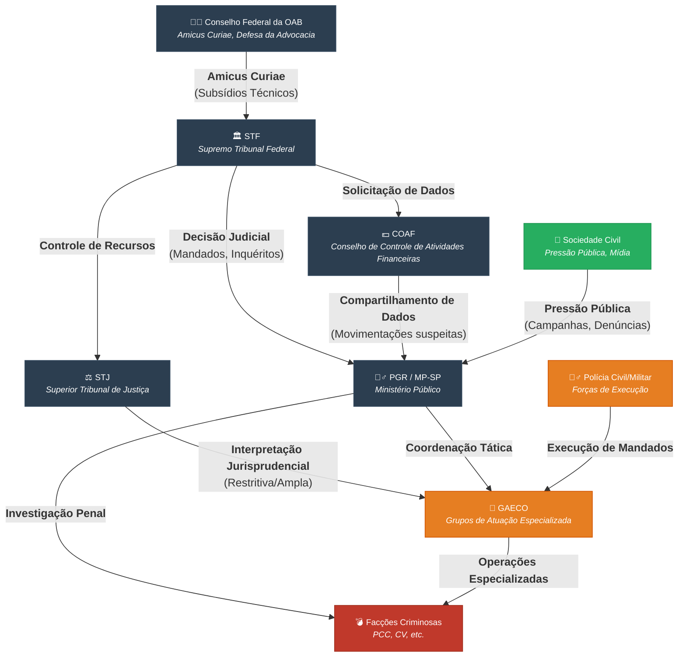

## TODOs

- drone.svg > plane-departure
- reflect.svg > sun
- thermometer-low.svg > thermometer-half
- laser-pointer.svg >  bolt-lightning 

----

## Aplicações

-🤐🕵️‍♂️ Censura no Brasil (2019-2025) 🌐
🔗 https://tinyurl.com/abusosupremo

Brasil e Big Techs: Impacto da Seção 301
🔗 https://tinyurl.com/brasil-x-bigtechs

- COAF e Ação de Moraes: Desafios nas Investigações Criminais
🔗 https://tinyurl.com/coaf-investigacoes

- https://tinyurl.com/abusosupremo
- https://tinyurl.com/lawfare-5w
- https://tinyurl.com/guiana-crime-transnacional
- https://tinyurl.com/crime-transnacionalNC
- https://tinyurl.com/crime-transnacional
- https://tinyurl.com/usaid-felipe-neto-mapa
- https://tinyurl.com/usaid-felipe-neto
- https://tinyurl.com/crise-diplomatica-stf-x-eua
- https://tinyurl.com/crise-diplomatica-resumo
- https://tinyurl.com/governanca-criminal
- https://tinyurl.com/vazatoga-mapa
- https://tinyurl.com/vazatoga2
- https://tinyurl.com/linhadetempo-impunes
- https://tinyurl.com/linhadetempo-jus
- https://tinyurl.com/linhadetempo-fin
- https://tinyurl.com/linhadetempo-gov
- https://tinyurl.com/linhadetempo-dossie
- https://tinyurl.com/linhadetempo-violador
- https://tinyurl.com/linhadetempo-tse
- https://tinyurl.com/linhadetempo-stf
- https://tinyurl.com/linhadetempo-lawfare
- https://tinyurl.com/crise-diplomatica
- https://tinyurl.com/supersalarios-ia
- https://tinyurl.com/privilegio-ia

## Lawfare

-🏛️ Lawfare - O Quê, Porquê, Quem, Onde, Quando
🔗 https://tinyurl.com/lawfare-5w

- 💥 Governança Criminal, 26% do BR vive sob regras de facções
🔗 https://tinyurl.com/governanca-criminal

## Linhas de Tempo Montadas:

-🏛️ Resumo Crise diplomática Brasil-EUA 📜
🔗 https://tinyurl.com/crise-diplomatica-stf-x-eua

-🧭 Linha do Tempo Crise diplomática Brasil-EUA 
🔗 https://tinyurl.com/crise-diplomatica

-📜 Interferências Judiciais Sistêmicas no Brasil
🔗 https://tinyurl.com/linhadetempo-lawfare

-✒️ STF no Contexto Político Brasileiro (2018-2025) ⚖️
🔗 https://tinyurl.com/linhadetempo-stf

-🌐 Parceria entre o Tribunal Superior Eleitoral (TSE) e USAID ⚖️
🔗 https://tinyurl.com/linhadetempo-tse

-📝 Ações do Violador de Direitos Humanos 💥
🔗 https://tinyurl.com/linhadetempo-dossie

-💰 Escândalos Políticos no Brasil
🔗 https://tinyurl.com/linhadetempo-gov

-🏛️ Escândalos Financeiros no Brasil (1995-2025)
🔗 https://tinyurl.com/linhadetempo-fin

-⚖️ Casos de Corrupção no Sistema Judiciário Brasileiro
🔗 https://tinyurl.com/linhadetempo-jus

-⛓️ Decisões Judiciais Beneficiando Criminosos no Brasil 💥
🔗 https://tinyurl.com/linhadetempo-impunes

- 🎭 Felipe Neto e Instituto Vero com ONGs estrangeiras (Open Society, Ford, EUA)
👉 https://tinyurl.com/usaid-felipe-neto
🔗 https://tinyurl.com/usaid-felipe-neto-mapa

Mapa Mental

https://mermaid.live/edit#pako:eNqNV8tu4zYU_RVCGBQJJollJ3Ec7TyOM0gxDyN2UqDIhpZoh41EqqSUySQI0H_oD7ToYtABZjXtZrb6k35JD6kXlbrTBnlKl-TlOeeee_PghTJiXuAlXEQJTa8EIUrKbGvrlMU8ZeQNyyT5hpwJnfEsx--XTMntbRNnvgiZSJGxO7x4yRSNy2eEjLOcFh-K3ySJGHG2qt939yNbb9-83K7fTWSypBkjxS9YrLlYSZWUm9URM6pCpjjVJJQJmS9Oe4v5tN16FefFRxFySlhCWMw4Fv_JNBn4g0EP3w7q0FMuqIlLmEAmuAVTAslML8ZNMudchzIgEyZ0riiQuOTF75rMZFx8yniIlMrIzlaaTHWmqFgzrqSut3qbMkHmMuQse09OZS4imnEpNNmaS4Q1RxJyMX82OPT3fN83N0DG_fbdCbPg4Hl_v-cf9dy3UwDH72hESWRyuBi3y86f9Y-aHf1-D59Yud8GdLGQK47fGzov5uOzk79--nkync3m7ZpxKrkkUA5XRia3QBxEajdZUXwxu2qjg1sLXXmjw4YDqSIHjXZtTbIl8dbC-m_Z1hnUZLT6qHQWYmfKm_VQDEDPU8USSRaKL3NBY8g0MhJ2eDhnueBGxCbnQc8fddSD-68Z0g6MCv9DsY2QUqQGYHlEAQh3smuwhpTJVpMUssRNpCJT6DiT3fwmMqZLPCsrjScpRBnyjD5liJKQJikV14YHvkZEi8U5bq2xk4q487TCkCsLv6pxqMrNRQjXsDdB0THDSCQV9gOXt1xnVNeUTEsGdyfX9JbV67vKtqoMsGXIlqyqgRsCMbuF04Zb-Qd1PZjMNsWZmu8c0fcD8p1UN_papppouVRYfM1CumZJG7jv9_xjlP0_YMNBAqVNXshYgzXlMOwP7OYl5OyuIsOg_yqPqZPQfvfOw6BCh1x5r_HTgP5jbmDVuwkFm55z6cMyPuKVu8qqNkoAUHyENdZDtXOoI9s-LncQkMU7nsHxUEsxGHuh6D2PCYqc0JBpLUmqwGHM1obTdvFgaBfPaGwP0kRQMk7offGHQK2aLFoX6jiQLaCgrSlThM-fNoLnHQNxfQJY4eQB8A1z3faWaZRTBRQ28NHv2_jGg2rqrJl10UBeZ2hjasVU3TlsM6C4nXZaiLOqvM1YFL_GXDPyQ66KTxEP6VOvLJcsWIKNJqpsGrrtVZ1Dp-Wh7SmW0FXldRF2SI0TuKiOq94WSlQwEzbIkFBZS936lmAKXLqaqCzJmBaqAM5n-GO1y9RRlxweU20yk5ktcdcmXnEstWaGT4gexa87vneWdCwPVKE3dhQ1Z4ioGZXmGPiwi3XdfCubp5s6fd2QHfDa4k1V8XnXLUIzoFDUGIxqk3IutNUWHipjZGX3uvKeertnkEZ94wGIeXI-hM3WyFoUHyj5tlaHm4AzIVmeDW2pubt5spJrubk_oPnROKMmyBS6BnjttJNunoyqGcWMapAz7IZH5ZoG5U1m0LaImGbFZ7QhC8Sq03vT4ssytoNQM72hwENqmATZ3fqug05YGJecG119rYxLuzBR5UjCzbi0ON1pXabph1WLaTIyN23wqDGwmtdkjuZUfEzcWpwpNB6UUGalHFaaMzDS0tEh26ylAYLjGb9vdPs_hoAppjwbDFthOcj72hhwmccCRbnkVZCR_7q1p9bkr4S3460Vj7wgUznb8RKGg82f3oMd073smiXsyguMhKm6Mf3kEWtQHN9LmdTLlMzX116worHGX3mKeYydcLpWtA3BuMPUBMNa5gV9v39oN_GCB-_OC3YP9w6PRkejg9GB3-8fj4bDHe-9CTvaGwwOhsPB8THe7PvDxx3v3p7r742ODo7djx2PRcZ_Xpf_lNj_TR7_BowhKAk

---

-⚖️ Linhas de Tempo da Guerra Silenciosa contra a Nação ⚔️
🔗 https://lawfare-timeline.vercel.app/

---

## 🤖 Ferramentas de Analise IA:

- ✨ Raio-X da Corrupção - Painel da Corrupção
🔗 https://tinyurl.com/ia-raio-x

- ✨ Soberania do Brasil - Análise Estratégica
🔗 https://tinyurl.com/soberania-ia

- ✨ A Arquitetura do Privilégio
🔗 https://tinyurl.com/privilegio-ia

- ✨ Sistema de Análise de Supersalários
🔗 https://tinyurl.com/supersalarios-ia

--- CC: ---
- @ClaudioLessa
- @pfigueiredo08
- @LeoVilhenaReal
- @fabio_talhari
- @auriverdebrasil
- @TheIncorrupt_
- @Maxcardosobr
- @ProfJoaoCarlosM
- @alertatotal
- @redegni
- @diretopontoblog
- @NamericaToday
- @OliverNoronha
- @george1BR2
- @tdhoratheoffice
- @DanilodeDireita
- @fiscaldofim
- @movadvdireitabr
- @VisaoPatria
- @OdnaldaW2
- @RicardoRoveran
- @jornalbunker
- @OficialVanucci
- @BlogPequi
- @VlogdoLisboa
- @ducavendish
- @pamcosta21
- @RoziSNews
- @CarinaBelome
- @DefecatingB
- @MafinhaBarba
- @arvor_ia
- @oeditorialNews
- @GuerraDaInfor
- @CleberT97506802
- @canalsergio2
- @GringaVidaUsa

