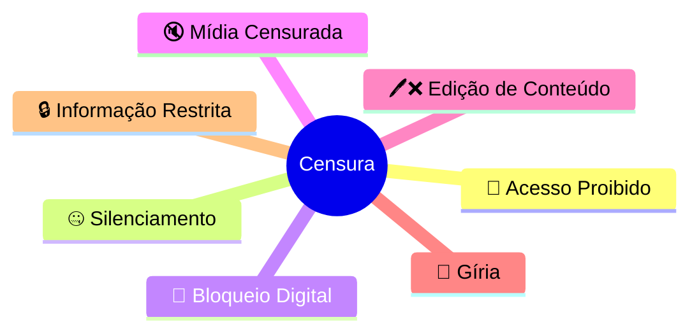

1. **Compilação de dados de censura judicial:** O autor compilou 118 notícias sobre censura judicial no Brasil de 2019 a fevereiro de 2025, excluindo casos relacionados a parlamentares ou aos réus do 8 de Janeiro.

2. **Bloqueio do Telegram e Twitter:** Alexandre de Moraes utilizou seu poder para suspender o Telegram em 2022 e o Twitter em 2024, citando a necessidade de combate à desinformação e exigindo medidas como a remoção de links e monitoramento de canais.

3. **Censura prévia:** A censura prévia, considerada inadmissível pela classe intelectual brasileira, é rotineira no país. Há vários exemplos de censura prévia aplicada por juízes em diferentes estados.

4. **Justiça eleitoral:** O Tribunal Superior Eleitoral (TSE) é único no mundo e exerce um poder significativo sobre os cidadãos, incluindo a censura de propagandas eleitorais e de opiniões políticas.

5. **Tratamento especial a celebridades:** Celebridades alinhadas com o progressismo, como Chico Buarque e Gilberto Gil, parecem receber tratamento especial, com censura de paródias de suas músicas.

6. **Conclusão:** A censura judicial é uma prática comum no Brasil, afetando tanto os meios de comunicação quanto os cidadãos comuns, com decisões frequentemente justificadas pela proteção à imagem de indivíduos ou instituições.

## Linha do Tempo:

- 2019 - Início do Inquérito das Fake News:
    - Março de 2019: O Supremo Tribunal Federal (STF) anuncia a abertura de um inquérito para investigar "fake news" e "ataques" contra ministros do STF, conhecido como "inquérito do fim do mundo".
- 2019 - Primeiras Censuras Judiciais:
    - Abril de 2019: O ministro Alexandre de Moraes ordena a retirada de uma reportagem da revista Crusoé e do site O Antagonista, sob ameaça de multa diária.
- 2020 - Aumento da Censura e Perseguição Judicial:
    - Início de 2020: Canal Terça Livre é banido das redes sociais e incluído no inquérito das fake news.
    - Abril de 2020: Jornalista Allan dos Santos se autoexila nos Estados Unidos devido à perseguição judicial.
- 2022 - Eleições e Censura Eleitoral:
    -   Durante as eleições: Questionamentos ao sistema eleitoral, especialmente sobre urnas eletrônicas, resultam em censura indiscriminada pelo Tribunal Superior Eleitoral (TSE).
- 2023 - Continuação da Prática de Censura:
    - Continuação de decisões judiciais que censuram publicações e conteúdos em redes sociais.
- 2024 - Revelações e Reações:
    - Publicações de rankings globais de liberdade de expressão que ignoram a censura judicial no Brasil.
- 2025 - Novos Casos de Censura:
    - Fevereiro de 2025: Supremo Tribunal Federal censura a revista Timeline.

## Mapa Conceptual:

Núcleo Central: Judiciário Brasileiro (STF, TSE)
- Ramo 1: Inquérito das Fake News
  - Decisões de censura
  - Perseguição a jornalistas e veículos de comunicação
- Ramo 2: Censura Eleitoral
  - Decisões durante as eleições de 2022
  - Remoção de conteúdo crítico ao sistema eleitoral
- Ramo 3: Impacto na Sociedade
  - Autoexílio de jornalistas
  - Retirada de plataformas de redes sociais do Brasil
  - Reações e críticas de entidades e organizações de comunicação
- Ramo 4: Consequências Legais
  - Falta de transparência nos processos judiciais
  - Sigilo mantido em muitas decisões
  - Aumento da judicialização da política
 