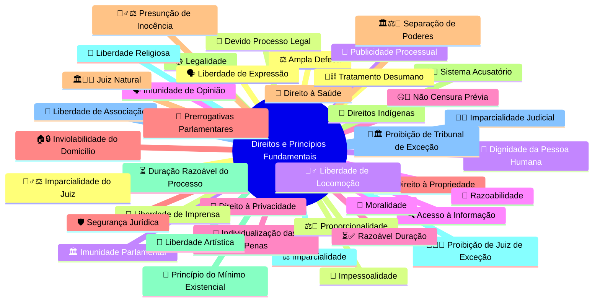

Aqui estão sugestões de ícones Font Awesome para cada tema listado. Use as classes conforme a versão instalada no seu projeto (por exemplo, `fas`, `fa`, `far`):

| Tema            | Font Awesome (classe do ícone)          | Sugestão/Justificativa                           |
|-----------------|-----------------------------------------|--------------------------------------------------|
| Lawfare         | `fa-gavel`                              | martelo (símbolo de justiça/golpe judicial)[1]  |
| STF             | `fa-balance-scale`                      | balança (justiça, tribunais superiores)[2]      |
| TSE             | `fa-balance-scale`                      | balança (tribunal eleitoral)[2]                 |
| Dossiê          | `fa-folder-open`                        | pasta aberta (arquivos, documentos)              |
| Escândalos      | `fa-exclamation-triangle`               | atenção, alerta                                  |
| Bancos          | `fa-university` ou `fa-bank`            | prédio banco [3]                                |
| Justiça         | `fa-gavel` ou `fa-balance-scale`        | martelo/balança[1][2]                          |
| Impunidade      | `fa-unlock`                             | cadeado aberto (impunidade, falta de punição)    |
| Operações       | `fa-cogs`                               | engrenagens (ações, operações)                   |
| Indecoro        | `fa-user-slash`                         | usuário riscado (má conduta, perda de decoro)    |
| Gilmar Mendes   | `fa-user-tie`                           | figura de autoridade (ministro/decano)           |
| Extravagância   | `fa-gem`                                | jóia (ostentação)                                |
| Penduricalhos   | `fa-gift` ou `fa-ribbon`                | presente/laço (benefícios extras)                |
| Estudos         | `fa-book`                               | livro (estudos, pesquisa)                        |
| Projetos        | `fa-project-diagram`                    | diagrama de projetos                             |

**Notas rápidas:**
- Para alguns temas (como Lawfare, STF, Justiça), os ícones clássicos são o martelo da justiça (`fa-gavel`) e a balança (`fa-balance-scale`).
- Bancos: `fa-university` e `fa-bank` são sinônimos em Font Awesome.
- Alguns temas sem ícone “oficial” podem ser representados por analogias visuais (ex: `fa-exclamation-triangle` para “escândalos”).
- Confirme a versão do Font Awesome usada no seu projeto, pois algumas classes mudam em versões mais novas (ex: `fas fa-gavel` para Font Awesome 5+).

Se precisar do código HTML para uso, por exemplo:
```html

```

**** 

Para "Vaza Toga", que combina os conceitos de **vazamento de informações** e o **Poder Judiciário**, a escolha ideal dependerá da ênfase que você quer dar.

Aqui estão as melhores opções em Font Awesome, com suas justificativas:

### 1. Opção Mais Descritiva: `fa-file-signature`
📜 **Ícone:** `fa-solid fa-file-signature`
**Justificativa:** Este ícone representa um **documento legal ou oficial**. Ele combina perfeitamente a ideia de "vazamento" (o arquivo em si) com a "toga" (o caráter judicial/oficial do conteúdo). É a escolha mais completa e contextual.

---
### 2. Opção Mais Direta (Foco no Judiciário): `fa-gavel`
⚖️ **Ícone:** `fa-solid fa-gavel`
**Justificativa:** O martelo do juiz é o símbolo mais reconhecido do Poder Judiciário ("Toga"). É uma opção excelente se o objetivo é identificar rapidamente o tópico como sendo sobre a justiça.

---
### 3. Opção Mais Analítica (Foco na Consequência): `fa-bug`
🐛 **Ícone:** `fa-solid fa-bug`
**Justificativa:** Este ícone é usado para representar uma falha, um erro ou um problema sistêmico. Usá-lo para "Vaza Toga" transmite a ideia de que os vazamentos expuseram uma "falha" fundamental no sistema de justiça.

**Recomendação:**
* Para clareza e descrição, use **`fa-file-signature`**.
* Para um símbolo rápido e universalmente reconhecido do judiciário, use **`fa-gavel`**.
* 

****

Aqui estão algumas sugestões de ícones (usando emojis) para enriquecer tópicos em um gráfico Mermaid mindmap:

- 🟥 Crise, bloqueio, alerta, conflito
- ⚖️ Justiça, decisão judicial, tribunal, STF
- 🇧🇷 Brasil, contexto nacional
- 🇺🇸 EUA, contexto americano/internacional
- 📰 Mídia, repercussão pública
- 🗣️ Debate, pronunciamento, discurso
- 🛂 Vistos, passaportes, restrições de entrada
- 🔒 Sanções, bloqueio de ativos, restrição
- 📝 Ação judicial, processos, documentos
- 🤝 Cooperação, tratados, acordos diplomáticos
- 🌐 Internet, plataformas digitais, tecnologia
- 📢 Protesto, reação, manifestação pública
- 📉 Impacto econômico, queda no mercado, risco
- 🔮 Futuro, projeção, tendência
- 💼 Diplomacia, relações exteriores
- 🏦 Bancos, sistema financeiro
- ⚖️ Justiça, STF, decisão judicial  
- 📰 Mídia, notícia  
- 🚨 Crise, emergência  
- 🇧🇷 Brasil  
- 🇺🇸 EUA, exterior  
- ⏳ Linha do tempo, progresso  
- 💬 Debate, diálogo  
- 🛂 Visto, passaporte  
- 🔒 Bloqueio, restrição, sanção  
- 📑 Documento, ação judicial  
- 🌐 Internet, tecnologia  
- 📈 Impacto, economia  
- 🏛️ Governo, poderes, tribunal  
- 📢 Protesto, manifestação  
- 🤝 Diplomacia, acordo  
- 🔮 Futuro, previsão  
- 🛡️ Proteção, defesa

Estes ícones ajudam a diferenciar assuntos principais e tornam o mapa mental mais visual e fácil de memorizar.
Você pode usar estes emojis diretamente nos nós do mindmap em Mermaid para tornar a visualização mais intuitiva!

*** 

Aqui estão sugestões de ícones FontAwesome (em formato class) para eventos de Crise Diplomática e temas relacionados:

- Crise Diplomática: `fa-solid fa-handshake-slash`
- Bloqueio/Sanção/Estrangulamento: `fa-solid fa-ban`
- Justiça/Decisão Judicial: `fa-solid fa-gavel`
- Sanções Econômicas: `fa-solid fa-dollar-sign`
- Cancelamento de Visto: `fa-solid fa-passport`
- Protesto/Declaração Pública: `fa-solid fa-bullhorn`
- Relações Exteriores/Diplomacia: `fa-solid fa-globe`
- Comércio Internacional/Tarifa: `fa-solid fa-percentage`
- Moeda/Troca Cambial: `fa-solid fa-exchange-alt`
- Aeronave/Avião Militar: `fa-solid fa-plane`
- Navio/Navio Militar: `fa-solid fa-ship`
- Reunião Política: `fa-solid fa-handshake`
- Persona non grata: `fa-solid fa-user-slash`
- Rússia: `fa-brands fa-rust` (não existe um específico para Rússia; use genéricos para países)
- China: `fa-solid fa-dragon` (representativo)
- BRICS: `fa-solid fa-globe` (genérico para blocos multilaterais)

Esses ícones facilitam a visualização de cada evento no seu sistema ou infográfico!

*** 

Aqui estão sugestões de ícones (emojis) para representar Crise Diplomática e eventos relacionados:

- 🌐 Diplomacia internacional  
- 🤝 Reunião entre líderes  
- ⚖️ Decisão judicial  
- 🚫 Sanção, bloqueio, veto  
- 🛂 Cancelamento de visto  
- 📢 Protesto, manifestação  
- 💬 Declaração pública  
- 🇧🇷 Brasil  
- 🇺🇸 EUA  
- 🇷🇺 Rússia  
- 🇨🇳 China  
- 🚢 Navio militar  
- ✈️ Avião militar  
- 💸 Tarifa, sanções econômicas  
- 💱 Troca de moedas, swap cambial  
- 🥇 BRICS, alianças multilaterais  
- 👥 Persona non grata  
- 🔄 Retaliação  
- 📉 Impacto econômico

Você pode combinar esses emojis nos seus mapas mentais, relatórios e linhas do tempo para facilitar a compreensão visual dos acontecimentos!

****

Aqui está uma **lista completa de ícones (emojis)** sugeridos para cada um dos **princípios, direitos e garantias fundamentais** que você listou. Os ícones foram escolhidos com base em **relevância simbólica**, **uso comum em infográficos jurídicos** e **clareza visual**, sendo ideais para uso em:

- Mapas mentais (Mermaid)
- Apresentações (PowerPoint, Canva)
- Infográficos
- Painéis de direitos fundamentais

---

### 📜 **Ícones para Princípios e Direitos Fundamentais**

| Direito / Princípio | Ícone Recomendado | Justificativa |
|---------------------|--------------------|-------------|
| **Ampla Defesa** | ⚖️ | Balança simboliza justiça e defesa no processo |
| **Devido Processo Legal** | 📜 | Pergaminho = legalidade formal e processo |
| **Dignidade da Pessoa Humana** | 🫶 | Mão em forma de coração: valor supremo da pessoa |
| **Direito ao Acesso à Informação** | 🔍 | Lupa: busca e transparência |
| **Direito à Privacidade** | 🔐 | Cadeado fechado: proteção de dados e intimidade |
| **Direito à Propriedade** | 🏠 | Casa: símbolo universal de propriedade imóvel |
| **Direito à Saúde** | 🏥 | Hospital: direito social à saúde |
| **Direitos Indígenas** | 🌿 | Folha verde: conexão com terras, natureza e culturas tradicionais |
| **Duração Razoável do Processo** | ⏳ | Ampulheta: tempo justo no processo |
| **Imparcialidade** | ⚖️ | Balança: neutralidade na decisão |
| **Imparcialidade Judicial** | 👨‍⚖️ | Juiz com expressão neutra (ou ⚖️) |
| **Imparcialidade do Juiz** | 🧍‍♂️⚖️ | Juiz equilibrado (pode usar 👨‍⚖️) |
| **Impessoalidade** | 🧍 | Figura neutra: ausência de interesse pessoal |
| **Imunidade Parlamentar** | 🏛️ | Capitólio: proteção a parlamentares |
| **Imunidade de Opinião** | 🗣️ | Fala protegida: liberdade de expressão parlamentar |
| **Individualização das Penas** | 🔢 | Número específico: pena ajustada à pessoa |
| **Inviolabilidade do Domicílio** | 🏠🔒 | Casa + cadeado: proteção contra invasão |
| **Juiz Natural** | 🏛️👨‍⚖️ | Juiz legítimo, previamente estabelecido |
| **Legalidade** | 📚 | Livro de leis: "não há crime sem lei" |
| **Liberdade Artística** | 🎨 | Pincel: expressão criativa livre |
| **Liberdade Religiosa** | ✝️, ☪️, 🕉️, 🕎 | Símbolos religiosos variados (ou 🙏) |
| **Liberdade de Associação** | 👥 | Grupo de pessoas: união livre |
| **Liberdade de Expressão** | 🗣️ | Fala livre, sem censura |
| **Liberdade de Imprensa** | 📰 | Jornal: mídia livre |
| **Liberdade de Locomoção** | 🚶‍♂️ | Pessoa andando: livre circulação |
| **Moralidade** | 🧭 | Bússola: orientação ética |
| **Não Censura Prévia** | 🤐🚫 | Boca fechada com proibição: ausência de censura |
| **Prerrogativas Parlamentares** | 🎤 | Microfone: direitos de fala e proteção |
| **Presunção de Inocência** | 🧍‍♂️⚖️ | Pessoa sob balança: "inocente até prova em contrário" |
| **Princípio Acusatório** | ⚖️👥 | Juiz neutro entre acusação e defesa |
| **Princípio do Mínimo Existencial** | 🍞 | Pão: mínimo vital para sobrevivência |
| **Proibição de Juiz de Exceção** | 🚫👨‍⚖️ | Juiz improvisado proibido |
| **Proibição de Tribunal de Exceção** | 🚫🏛️ | Tribunal criado para perseguir, proibido |
| **Proibição de tratamento desumano ou degradante** | 🚫⛓️ | Correntes proibidas: tortura e degradação |
| **Proporcionalidade** | ⚖️📏 | Balança + régua: medida adequada e necessária |
| **Publicidade dos Atos Processuais** | 📢 | Alto-falante: transparência processual |
| **Razoabilidade** | 🧠 | Cérebro: decisão lógica e justa |
| **Razoável Duração do Processo** | ⏳✅ | Ampulheta com ok: tempo justo garantido |
| **Segurança Jurídica** | 🛡️ | Escudo: previsibilidade do direito |
| **Separação de Poderes** | 🏛️⚖️👑 | Três poderes: Executivo, Legislativo, Judiciário |
| **Sistema Acusatório** | ⚖️🗣️👥 | Acusação, defesa e juiz neutro |

---

### ✅ **Exemplo de Uso em Mermaid (Mindmap)**



---

### 📎 Dicas de Uso

- ✅ **Evite ícones ambíguos**: Prefira os mais universais.
- ✅ **Use em conjunto com cores**: Ex: vermelho para proibições (🚫), verde para direitos (✅).
- ✅ **Ideal para infográficos jurídicos**, painéis de controle de constitucionalidade, ou educação cívica.

---


👉 Dica: você pode manter uma **coerência visual** usando sempre a mesma lib (Lucide ou FA), mas também dá pra misturar se precisar de ícones bem específicos.

Quer que eu monte um **mini wireframe de cards** (com Tailwind + Lucide/FA) mostrando como ficariam os três temas lado a lado, cada um com seus ícones?

----

## Projeto para ser **completo e pronto para React + Vite**, com:

* Estrutura de components ideal (`App.jsx`, `components/Cards.jsx`, `components/Card.jsx`).
* Template completo de `index.html` integrado com Tailwind e Vite.
* `tailwind.config.js` configurado corretamente.
* `package.json` com todas as dependências e scripts.
* Passo a passo detalhado para criação e execução do projeto.

Isso vai permitir rodar o projeto imediatamente com `npm run dev`.
````package.json
// package.json
{
  "name": "cards-timeline-project",
  "version": "1.0.0",
  "private": true,
  "dependencies": {
    "react": "^18.2.0",
    "react-dom": "^18.2.0",
    "lucide-react": "^0.276.0",
    "tailwindcss": "^3.4.0",
    "postcss": "^8.4.27",
    "autoprefixer": "^10.4.14"
  },
  "scripts": {
    "dev": "vite",
    "build": "vite build",
    "preview": "vite preview"
  },
  "devDependencies": {
    "vite": "^4.4.9",
    "@vitejs/plugin-react": "^4.0.0"
  }
}
````

````tailwind.config.js
// tailwind.config.js
module.exports = {
  content: ['./index.html', './src/**/*.{js,jsx}'],
  theme: {
    extend: {},
  },
  plugins: [],
};

// index.html
<!DOCTYPE html>
<html lang="en">
  <head>
    <meta charset="UTF-8" />
    <meta name="viewport" content="width=device-width, initial-scale=1.0" />
    <title>Cards Timeline Project</title>
    <link rel="stylesheet" href="/src/index.css">
  </head>
  <body>
    <div id="root"></div>
    <script type="module" src="/src/main.jsx"></script>
  </body>
</html>
````

````src/main.jsx
// src/main.jsx
import React from 'react';
import ReactDOM from 'react-dom/client';
import './index.css';
import App from './App';

ReactDOM.createRoot(document.getElementById('root')).render(
  <React.StrictMode>
    <App />
  </React.StrictMode>
);
````

````src/App.jsx
// src/App.jsx
import React from 'react';
import Cards from './components/Cards';

export default function App() {
  return (
    <div className='min-h-screen bg-gray-100 flex items-center justify-center'>
      <Cards />
    </div>
  );
}
````

````src/components/Cards.jsx
// src/components/Cards.jsx
import React from 'react';
import Card from './Card';
import { Landmark, BarChart3, Users, Scale, Gavel, BookOpenText, HandCoins, DollarSign, FileWarning } from 'lucide-react';

export default function Cards() {
  const cards = [
    {
      title: 'Eleições',
      icon: <Landmark className='w-10 h-10 text-blue-600' />, 
      description: 'Textos e análises sobre processos eleitorais, voto e democracia.',
      extras: [<BarChart3 key='1' className='w-5 h-5 text-blue-400' />, <Users key='2' className='w-5 h-5 text-blue-400' />]
    },
    {
      title: 'Justiça',
      icon: <Scale className='w-10 h-10 text-green-600' />, 
      description: 'Reflexões sobre leis, julgamentos e equilíbrio social.',
      extras: [<Gavel key='1' className='w-5 h-5 text-green-400' />, <BookOpenText key='2' className='w-5 h-5 text-green-400' />]
    },
    {
      title: 'Corrupção',
      icon: <HandCoins className='w-10 h-10 text-red-600' />, 
      description: 'Investigações e críticas sobre desvios, fraudes e escândalos.',
      extras: [<DollarSign key='1' className='w-5 h-5 text-red-400' />, <FileWarning key='2' className='w-5 h-5 text-red-400' />]
    }
  ];

  return (
    <div className='grid grid-cols-1 md:grid-cols-3 gap-6 p-6'>
      {cards.map((card, idx) => (
        <Card key={idx} {...card} />
      ))}
    </div>
  );
}
````

````src/components/Card.jsx
// src/components/Card.jsx
import React from 'react';

export default function Card({ title, icon, description, extras }) {
  return (
    <div className='bg-white shadow-md rounded-2xl p-6 flex flex-col items-center text-center hover:shadow-lg transition'>
      {icon}
      <h2 className='text-xl font-semibold mt-3'>{title}</h2>
      <p className='text-gray-600 text-sm mt-2'>{description}</p>
      <div className='flex gap-3 mt-4'>{extras}</div>
    </div>
  );
}
````

````src/index.css
// src/index.css
@tailwind base;
@tailwind components;
@tailwind utilities;

body {
  @apply bg-gray-100;
}
````

## Passo a passo de criação do projeto 

1. Crie a pasta do projeto: mkdir cards-timeline-project && cd cards-timeline-project
2. Inicialize o projeto: npm init -y
3. Instale dependências principais: 
   npm install react react-dom lucide-react tailwindcss postcss autoprefixer
4. Instale dependências de desenvolvimento:
   npm install -D vite @vitejs/plugin-react
5. Crie a estrutura de pastas:
   src/
     - main.jsx
     - App.jsx
     - index.css
     - components/
         - Cards.jsx
         - Card.jsx
6. Configure Tailwind:
   npx tailwindcss init -p
   (edite tailwind.config.js -> content: ['./index.html','./src/**/*.{js,jsx}'])
7. Copie o conteúdo acima para seus respectivos arquivos.
8. Crie index.html com o template fornecido.
9. Rode o projeto: npm run dev
10. Abra o navegador no endereço informado pelo Vite (ex: http://localhost:5173)

****

[1] https://fontawesome.com/v4/icon/gavel
[2] https://www.w3schools.com/icons/tryit.asp?filename=tryicons_fa-legal
[3] https://fontawesome.com/v5/icons/bank
[4] https://fontawesome.com/v4/icon/money
[5] https://fontawesome.com/v3/icon/legal
[6] https://fontawesome.com/v4.7/icons/
[7] https://fontawesome.com/v5/icons/legal
[8] https://fontawesome.com/v3/icons
[9] https://stackoverflow.com/questions/26971191/font-awesome-icon-for-section-symbol-law
[10] https://iconscout.com/icons/justica-de-tribunal?styles%5B%5D=plano
[11] https://www.youtube.com/watch?v=pRlNS3fhHwU
[12] https://nitw.ac.in/tlc/elements/font-icons.htm
[13] https://icon-icons.com/pt/icone/justi%C3%A7a/187939
[14] https://www.treinaweb.com.br/blog/css-dominando-o-font-awesome
[15] https://www.flaticon.com/br/icones-gratis/justica
[16] https://www.scriptcase.com.br/exemplos/menu-php/menu-font-awesome/
[17] https://icons8.com.br/icons/set/oficial-de-justi%C3%A7a--style-pieces
[18] https://fontawesome.com/v4/cheatsheet/
[19] https://icon-icons.com/pt/icone/justi%C3%A7a-simbolo/70458
[20] https://fontawesome.com
