Aqui estão sugestões de ícones Font Awesome para cada tema listado. Use as classes conforme a versão instalada no seu projeto (por exemplo, `fas`, `fa`, `far`):

| Tema            | Font Awesome (classe do ícone)          | Sugestão/Justificativa                           |
|-----------------|-----------------------------------------|--------------------------------------------------|
| Lawfare         | `fa-gavel`                              | martelo (símbolo de justiça/golpe judicial)[1]  |
| STF             | `fa-balance-scale`                      | balança (justiça, tribunais superiores)[2]      |
| TSE             | `fa-balance-scale`                      | balança (tribunal eleitoral)[2]                 |
| Dossiê          | `fa-folder-open`                        | pasta aberta (arquivos, documentos)              |
| Escândalos      | `fa-exclamation-triangle`               | atenção, alerta                                  |
| Bancos          | `fa-university` ou `fa-bank`            | prédio banco [3]                                |
| Justiça         | `fa-gavel` ou `fa-balance-scale`        | martelo/balança[1][2]                          |
| Impunidade      | `fa-unlock`                             | cadeado aberto (impunidade, falta de punição)    |
| Operações       | `fa-cogs`                               | engrenagens (ações, operações)                   |
| Indecoro        | `fa-user-slash`                         | usuário riscado (má conduta, perda de decoro)    |
| Gilmar Mendes   | `fa-user-tie`                           | figura de autoridade (ministro/decano)           |
| Extravagância   | `fa-gem`                                | jóia (ostentação)                                |
| Penduricalhos   | `fa-gift` ou `fa-ribbon`                | presente/laço (benefícios extras)                |
| Estudos         | `fa-book`                               | livro (estudos, pesquisa)                        |
| Projetos        | `fa-project-diagram`                    | diagrama de projetos                             |

**Notas rápidas:**
- Para alguns temas (como Lawfare, STF, Justiça), os ícones clássicos são o martelo da justiça (`fa-gavel`) e a balança (`fa-balance-scale`).
- Bancos: `fa-university` e `fa-bank` são sinônimos em Font Awesome.
- Alguns temas sem ícone “oficial” podem ser representados por analogias visuais (ex: `fa-exclamation-triangle` para “escândalos”).
- Confirme a versão do Font Awesome usada no seu projeto, pois algumas classes mudam em versões mais novas (ex: `fas fa-gavel` para Font Awesome 5+).

Se precisar do código HTML para uso, por exemplo:
```html

```

**** 

Para "Vaza Toga", que combina os conceitos de **vazamento de informações** e o **Poder Judiciário**, a escolha ideal dependerá da ênfase que você quer dar.

Aqui estão as melhores opções em Font Awesome, com suas justificativas:

### 1. Opção Mais Descritiva: `fa-file-signature`
📜 **Ícone:** `fa-solid fa-file-signature`
**Justificativa:** Este ícone representa um **documento legal ou oficial**. Ele combina perfeitamente a ideia de "vazamento" (o arquivo em si) com a "toga" (o caráter judicial/oficial do conteúdo). É a escolha mais completa e contextual.

---
### 2. Opção Mais Direta (Foco no Judiciário): `fa-gavel`
⚖️ **Ícone:** `fa-solid fa-gavel`
**Justificativa:** O martelo do juiz é o símbolo mais reconhecido do Poder Judiciário ("Toga"). É uma opção excelente se o objetivo é identificar rapidamente o tópico como sendo sobre a justiça.

---
### 3. Opção Mais Analítica (Foco na Consequência): `fa-bug`
🐛 **Ícone:** `fa-solid fa-bug`
**Justificativa:** Este ícone é usado para representar uma falha, um erro ou um problema sistêmico. Usá-lo para "Vaza Toga" transmite a ideia de que os vazamentos expuseram uma "falha" fundamental no sistema de justiça.

**Recomendação:**
* Para clareza e descrição, use **`fa-file-signature`**.
* Para um símbolo rápido e universalmente reconhecido do judiciário, use **`fa-gavel`**.
* 

****

- 🟥 Crise, bloqueio, alerta, conflito
- ⚖️ Justiça, decisão judicial, tribunal, STF
- 🇧🇷 Brasil, contexto nacional
- 🇺🇸 EUA, contexto americano/internacional
- 📰 Mídia, repercussão pública
- 🗣️ Debate, pronunciamento, discurso
- 🛂 Vistos, passaportes, restrições de entrada
- 🔒 Sanções, bloqueio de ativos, restrição
- 📝 Ação judicial, processos, documentos
- 🤝 Cooperação, tratados, acordos diplomáticos
- 🌐 Internet, plataformas digitais, tecnologia
- 📢 Protesto, reação, manifestação pública
- 📉 Impacto econômico, queda no mercado, risco
- 🔮 Futuro, projeção, tendência
- 💼 Diplomacia, relações exteriores
- 🏦 Bancos, sistema financeiro
- ⚖️ Justiça, STF, decisão judicial  
- 📰 Mídia, notícia  
- 🚨 Crise, emergência  
- 🇧🇷 Brasil  
- 🇺🇸 EUA, exterior  
- ⏳ Linha do tempo, progresso  
- 💬 Debate, diálogo  
- 🛂 Visto, passaporte  
- 🔒 Bloqueio, restrição, sanção  
- 📑 Documento, ação judicial  
- 🌐 Internet, tecnologia  
- 📈 Impacto, economia  
- 🏛️ Governo, poderes, tribunal  
- 📢 Protesto, manifestação  
- 🤝 Diplomacia, acordo  
- 🔮 Futuro, previsão  
- 🛡️ Proteção, defesa

- 🌐 Diplomacia internacional  
- 🤝 Reunião entre líderes  
- ⚖️ Decisão judicial  
- 🚫 Sanção, bloqueio, veto  
- 🛂 Cancelamento de visto  
- 📢 Protesto, manifestação  
- 💬 Declaração pública  
- 🇧🇷 Brasil  
- 🇺🇸 EUA  
- 🇷🇺 Rússia  
- 🇨🇳 China  
- 🚢 Navio militar  
- ✈️ Avião militar  
- 💸 Tarifa, sanções econômicas  
- 💱 Troca de moedas, swap cambial  
- 🥇 BRICS, alianças multilaterais  
- 👥 Persona non grata  
- 🔄 Retaliação  
- 📉 Impacto econômico

Você pode combinar esses emojis nos seus mapas mentais, relatórios e linhas do tempo para facilitar a compreensão visual dos acontecimentos!

****

Aqui está uma **lista completa de ícones (emojis)** sugeridos para cada um dos **princípios, direitos e garantias fundamentais** que você listou. Os ícones foram escolhidos com base em **relevância simbólica**, **uso comum em infográficos jurídicos** e **clareza visual**, sendo ideais para uso em:

- Mapas mentais (Mermaid)
- Apresentações (PowerPoint, Canva)
- Infográficos
- Painéis de direitos fundamentais

---

### 📜 **Ícones para Princípios e Direitos Fundamentais**

| Direito / Princípio | Ícone Recomendado | Justificativa |
|---------------------|--------------------|-------------|
| **Ampla Defesa** | ⚖️ | Balança simboliza justiça e defesa no processo |
| **Devido Processo Legal** | 📜 | Pergaminho = legalidade formal e processo |
| **Dignidade da Pessoa Humana** | 🫶 | Mão em forma de coração: valor supremo da pessoa |
| **Direito ao Acesso à Informação** | 🔍 | Lupa: busca e transparência |
| **Direito à Privacidade** | 🔐 | Cadeado fechado: proteção de dados e intimidade |
| **Direito à Propriedade** | 🏠 | Casa: símbolo universal de propriedade imóvel |
| **Direito à Saúde** | 🏥 | Hospital: direito social à saúde |
| **Direitos Indígenas** | 🌿 | Folha verde: conexão com terras, natureza e culturas tradicionais |
| **Duração Razoável do Processo** | ⏳ | Ampulheta: tempo justo no processo |
| **Imparcialidade** | ⚖️ | Balança: neutralidade na decisão |
| **Imparcialidade Judicial** | 👨‍⚖️ | Juiz com expressão neutra (ou ⚖️) |
| **Imparcialidade do Juiz** | 🧍‍♂️⚖️ | Juiz equilibrado (pode usar 👨‍⚖️) |
| **Impessoalidade** | 🧍 | Figura neutra: ausência de interesse pessoal |
| **Imunidade Parlamentar** | 🏛️ | Capitólio: proteção a parlamentares |
| **Imunidade de Opinião** | 🗣️ | Fala protegida: liberdade de expressão parlamentar |
| **Individualização das Penas** | 🔢 | Número específico: pena ajustada à pessoa |
| **Inviolabilidade do Domicílio** | 🏠🔒 | Casa + cadeado: proteção contra invasão |
| **Juiz Natural** | 🏛️👨‍⚖️ | Juiz legítimo, previamente estabelecido |
| **Legalidade** | 📚 | Livro de leis: "não há crime sem lei" |
| **Liberdade Artística** | 🎨 | Pincel: expressão criativa livre |
| **Liberdade Religiosa** | ✝️, ☪️, 🕉️, 🕎 | Símbolos religiosos variados (ou 🙏) |
| **Liberdade de Associação** | 👥 | Grupo de pessoas: união livre |
| **Liberdade de Expressão** | 🗣️ | Fala livre, sem censura |
| **Liberdade de Imprensa** | 📰 | Jornal: mídia livre |
| **Liberdade de Locomoção** | 🚶‍♂️ | Pessoa andando: livre circulação |
| **Moralidade** | 🧭 | Bússola: orientação ética |
| **Não Censura Prévia** | 🤐🚫 | Boca fechada com proibição: ausência de censura |
| **Prerrogativas Parlamentares** | 🎤 | Microfone: direitos de fala e proteção |
| **Presunção de Inocência** | 🧍‍♂️⚖️ | Pessoa sob balança: "inocente até prova em contrário" |
| **Princípio Acusatório** | ⚖️👥 | Juiz neutro entre acusação e defesa |
| **Princípio do Mínimo Existencial** | 🍞 | Pão: mínimo vital para sobrevivência |
| **Proibição de Juiz de Exceção** | 🚫👨‍⚖️ | Juiz improvisado proibido |
| **Proibição de Tribunal de Exceção** | 🚫🏛️ | Tribunal criado para perseguir, proibido |
| **Proibição de tratamento desumano ou degradante** | 🚫⛓️ | Correntes proibidas: tortura e degradação |
| **Proporcionalidade** | ⚖️📏 | Balança + régua: medida adequada e necessária |
| **Publicidade dos Atos Processuais** | 📢 | Alto-falante: transparência processual |
| **Razoabilidade** | 🧠 | Cérebro: decisão lógica e justa |
| **Razoável Duração do Processo** | ⏳✅ | Ampulheta com ok: tempo justo garantido |
| **Segurança Jurídica** | 🛡️ | Escudo: previsibilidade do direito |
| **Separação de Poderes** | 🏛️⚖️👑 | Três poderes: Executivo, Legislativo, Judiciário |
| **Sistema Acusatório** | ⚖️🗣️👥 | Acusação, defesa e juiz neutro |

---

### ✅ **Exemplo de Uso em Mermaid (Mindmap)**



Aqui está uma sugestão de **ícones (emojis ou símbolos visuais)** para cada item do seu menu, com foco em **clareza, identificação rápida e apelo visual** — ideal para uso em **sites, blogs jurídicos, dashboards, infográficos ou interfaces** (como em Mermaid, HTML, Notion, etc).

Os ícones foram escolhidos com base no **significado simbólico**, **reconhecimento universal** e **contexto temático** (jurídico, político, investigativo).

---

### 📋 **Ícones para os Itens do Menu**

| Item do Menu | Ícone Recomendado | Justificativa |
|--------------|--------------------|-------------|
| **[HOME](/)** | 🏠 | Símbolo universal de início/página principal |
| **[CRISE DIPLOMÁTICA](/crise-diplomatica/)** | 🌍⚔️ ou 🤝❌ | Globo + conflito ou aperto de mão rompido |
| **[LAWFARE](/lawfare/)** | ⚖️💣 ou ⚖️🎯 | "Guerra jurídica": justiça usada como arma |
| **[STF](/stf/)** | 🏛️ | Prédio do Supremo (Capitólio) — símbolo institucional |
| **[TSE/USAID](/tse/)** | 🗳️🌐 | Urna eletrônica + globo: eleições e interferência externa |
| **[DOSSIÊ](/dossie/)** | 📁🔍 | Pasta + lupa: investigação, coleta de provas |
| **[CENSURA](/censura/)** | 🤐🚫 | Boca fechada com proibição: silenciamento |
| **[ESCÂNDALOS](/escandalos/)** | 📢💥 | Alto-falante + explosão: revelação de escândalos |
| **[BANCOS](/bancos/)** | 💰🏦 | Dinheiro + banco: sistema financeiro |
| **[JUSTIÇA](/justica/)** | ⚖️ | Balança: símbolo universal da justiça |
| **[IMPUNIDADE](/impunidade/)** | 🕳️👤 ou 🚔❌ | Pessoa desaparecendo / polícia com "não": crime sem punição |
| **[INDECORO](/indecoro/)** | 🎩🔥 ou 🤡 | Chapéu em chamas / palhaço: conduta vergonhosa |
| **[GILMAR MENDES](/decano/)** | 👴⚖️👓 | Velho, justiça, óculos — reconhecível e irônico |
| **[EXTRAVAGÂNCIA](/extravagancia/)** | 💸🎭 | Dinheiro + máscara de teatro: luxo exagerado |
| **[OPERAÇÕES](/operacoes/)** | 🕵️‍♂️📁 | Detetive + pasta: operações policiais/investigativas |
| **[PENDURICALHOS](/penduricalhos/)** | 🎗️💎 | Medalhas/joias: símbolos de status e privilégios |
| **[FELIPE NETO / USAID](/felipe-neto/)** | 🎥🌐 | Câmera + globo: influenciador com apoio externo |
| **[LINHA DO TEMPO](/timeline/)** | 📅⏳ | Calendário + ampulheta: cronologia de eventos |
| **[ESTUDOS](/book/)** | 📚🎓 | Livro + diploma: pesquisa e análise |
| **[TAGS](/tags/)** | 🔖🏷️ | Etiquetas: categorização e marcação |
| **[CATEGORIAS](/categories/)** | 📂🗂️ | Pastas organizadas: classificação temática |
| **[SOBRE](/about/)** | ℹ️ | Informação: detalhes institucionais |

---

### ✅ **Exemplo de Menu com Ícones (Markdown)**

```markdown
- 🏠 [HOME](/)
- 🌍⚔️ [CRISE DIPLOMÁTICA](/crise-diplomatica/)
- ⚖️💣 [LAWFARE](/lawfare/)
- 🏛️ [STF](/stf/)
- 🗳️🌐 [TSE/USAID](/tse/)
- 📁🔍 [DOSSIÊ](/dossie/)
- 🤐🚫 [CENSURA](/censura/)
- 📢💥 [ESCÂNDALOS](/escandalos/)
- 💰🏦 [BANCOS](/bancos/)
- ⚖️ [JUSTIÇA](/justica/)
- 🕳️👤 [IMPUNIDADE](/impunidade/)
- 🎩🔥 [INDECORO](/indecoro/)
- 👴⚖️👓 [GILMAR MENDES](/decano/)
- 💸🎭 [EXTRAVAGÂNCIA](/extravagancia/)
- 🕵️‍♂️📁 [OPERAÇÕES](/operacoes/)
- 🎗️💎 [PENDURICALHOS](/penduricalhos/)
- 🎥🌐 [FELIPE NETO / USAID](/felipe-neto/)
- 📅⏳ [LINHA DO TEMPO](/timeline/)
- 📚🎓 [ESTUDOS](/book/)
- 🔖 [TAGS](/tags/)
- 📂🗂️ [CATEGORIAS](/categories/)
- ℹ️ [SOBRE](/about/)
```

---

### 💡 Dicas de Uso

- **Consistência**: Use um estilo único (só emojis, ou com texto).
- **Responsividade**: Em mobile, ícones ajudam na navegação rápida.
- **Ironia moderada**: Em contextos críticos (ex: Gilmar, penduricalhos), o emoji pode ter tom satírico, mas use com cuidado.
- **Alternativas em SVG**: Para sites profissionais, substitua emojis por ícones SVG (ex: Font Awesome, Feather Icons).

---

### 🎨 Sugestão de Tema por Cor (opcional)

| Tema | Cor Sugerida (ícone de fundo) |
|------|-------------------------------|
| Crítica/Jurídico | ⚫ ou 🔴 |
| Investigação | 🟨 ou 🟦 |
| Neutralidade | ⚪ |
| Alerta | 🟧 |

---

### 📎 Dicas de Uso

- ✅ **Evite ícones ambíguos**: Prefira os mais universais.
- ✅ **Use em conjunto com cores**: Ex: vermelho para proibições (🚫), verde para direitos (✅).
- ✅ **Ideal para infográficos jurídicos**, painéis de controle de constitucionalidade, ou educação cívica.

---


👉 Dica: você pode manter uma **coerência visual** usando sempre a mesma lib (Lucide ou FA), mas também dá pra misturar se precisar de ícones bem específicos.

*** 

Aqui está uma **lista completa com ícones do Font Awesome 6 (Free)** recomendados para:

1. ✅ **Menu do site**  
2. ✅ **Princípios e direitos fundamentais**

Todos os ícones são da **versão gratuita (Free)** do **Font Awesome 6**, compatíveis com `fa-solid`, `fa-regular` ou `fa-brands` quando aplicável. Você pode usá-los em HTML com a CDN oficial.

---

## 🔗 **1. Ícones Font Awesome para o Menu do Site**

| Item do Menu | Ícone Font Awesome | Código HTML |
|--------------|--------------------|------------|
| **[HOME](/)** | `fa-house` | `<i class="fas fa-house"></i>` |
| **[CRISE DIPLOMÁTICA](/crise-diplomatica/)** | `fa-handshake-slash` ou `fa-globe-americas` + `fa-triangle-exclamation` | `<i class="fas fa-handshake-slash"></i>` |
| **[LAWFARE](/lawfare/)** | `fa-balance-scale-left` | `<i class="fas fa-balance-scale-left"></i>` *(justiça desequilibrada)* |
| **[STF](/stf/)** | `fa-building-columns` | `<i class="fas fa-building-columns"></i>` *(Supremo como instituição)* |
| **[TSE/USAID](/tse/)** | `fa-ballot` + `fa-earth-americas` | `<i class="fas fa-ballot fa-earth-americas"></i>` |
| **[DOSSIÊ](/dossie/)** | `fa-folder-open` | `<i class="fas fa-folder-open"></i>` |
| **[CENSURA](/censura/)** | `fa-comment-slash` | `<i class="fas fa-comment-slash"></i>` |
| **[ESCÂNDALOS](/escandalos/)** | `fa-bullhorn` ou `fa-fire` | `<i class="fas fa-bullhorn"></i>` ou `<i class="fas fa-fire"></i>` |
| **[BANCOS](/bancos/)** | `fa-building` ou `fa-landmark` | `<i class="fas fa-building"></i>` |
| **[JUSTIÇA](/justica/)** | `fa-balance-scale` | `<i class="fas fa-balance-scale"></i>` |
| **[IMPUNIDADE](/impunidade/)** | `fa-gavel` + `fa-xmark` | `<i class="fas fa-gavel"></i> <i class="fas fa-xmark"></i>` ou `fa-people-roof` *(proteção indevida)* |
| **[INDECORO](/indecoro/)** | `fa-face-angry` ou `fa-triangle-exclamation` | `<i class="fas fa-triangle-exclamation"></i>` |
| **[GILMAR MENDES](/decano/)** | `fa-user-tie` + `fa-crown` | `<i class="fas fa-user-tie"></i> <i class="fas fa-crown"></i>` *(irônico)* |
| **[EXTRAVAGÂNCIA](/extravagancia/)** | `fa-gem` ou `fa-money-bill-wave` | `<i class="fas fa-gem"></i>` |
| **[OPERAÇÕES](/operacoes/)** | `fa-magnifying-glass` ou `fa-shield-halved` | `<i class="fas fa-magnifying-glass"></i>` |
| **[PENDURICALHOS](/penduricalhos/)** | `fa-medal` ou `fa-star` | `<i class="fas fa-medal"></i>` |
| **[FELIPE NETO / USAID](/felipe-neto/)** | `fa-video` + `fa-earth-americas` | `<i class="fas fa-video fa-earth-americas"></i>` |
| **[LINHA DO TEMPO](/timeline/)** | `fa-timeline` | `<i class="fas fa-timeline"></i>` *(disponível no FA6 Pro)*<br>Alternativa Free: `fa-clock-rotate-left` |
| **[ESTUDOS](/book/)** | `fa-book` | `<i class="fas fa-book"></i>` |
| **[TAGS](/tags/)** | `fa-tags` | `<i class="fas fa-tags"></i>` |
| **[CATEGORIAS](/categories/)** | `fa-layer-group` | `<i class="fas fa-layer-group"></i>` |
| **[SOBRE](/about/)** | `fa-circle-info` | `<i class="fas fa-circle-info"></i>` |

> ✅ **Nota**: `fa-timeline` é Pro. Use `fa-clock-rotate-left` como alternativa gratuita.

---

## ⚖️ **2. Ícones Font Awesome para Direitos e Princípios Fundamentais**

| Princípio / Direito | Ícone Font Awesome | Código HTML |
|---------------------|--------------------|------------|
| **Ampla Defesa** | `fa-scale-balanced` | `<i class="fas fa-scale-balanced"></i>` |
| **Devido Processo Legal** | `fa-book-law` | `<i class="fas fa-book-law"></i>` |
| **Dignidade da Pessoa Humana** | `fa-hands-holding` | `<i class="fas fa-hands-holding"></i>` |
| **Direito ao Acesso à Informação** | `fa-magnifying-glass` | `<i class="fas fa-magnifying-glass"></i>` |
| **Direito à Privacidade** | `fa-lock` | `<i class="fas fa-lock"></i>` |
| **Direito à Propriedade** | `fa-house` | `<i class="fas fa-house"></i>` |
| **Direito à Saúde** | `fa-house-medical` | `<i class="fas fa-house-medical"></i>` |
| **Direitos Indígenas** | `fa-people-group` | `<i class="fas fa-people-group"></i>` |
| **Duração Razoável do Processo** | `fa-hourglass-half` | `<i class="fas fa-hourglass-half"></i>` |
| **Imparcialidade** | `fa-balance-scale` | `<i class="fas fa-balance-scale"></i>` |
| **Imparcialidade Judicial** | `fa-jedi` *(metafórico)* ou `fa-scale-balanced` | `<i class="fas fa-scale-balanced"></i>` |
| **Imparcialidade do Juiz** | `fa-user-judge` | `<i class="fas fa-user-judge"></i>` |
| **Impessoalidade** | `fa-mask` ou `fa-user-secret` | `<i class="fas fa-user-secret"></i>` |
| **Imunidade Parlamentar** | `fa-shield-alt` | `<i class="fas fa-shield-alt"></i>` |
| **Imunidade de Opinião** | `fa-comment-medical` | `<i class="fas fa-comment-medical"></i>` |
| **Individualização das Penas** | `fa-id-card` | `<i class="fas fa-id-card"></i>` |
| **Inviolabilidade do Domicílio** | `fa-house-lock` | `<i class="fas fa-house-lock"></i>` |
| **Juiz Natural** | `fa-judge` | `<i class="fas fa-user-judge"></i>` |
| **Legalidade** | `fa-scale-balanced` | `<i class="fas fa-scale-balanced"></i>` |
| **Liberdade Artística** | `fa-palette` | `<i class="fas fa-palette"></i>` |
| **Liberdade Religiosa** | `fa-church` ou `fa-mosque` | `<i class="fas fa-church"></i>` |
| **Liberdade de Associação** | `fa-people-group` | `<i class="fas fa-people-group"></i>` |
| **Liberdade de Expressão** | `fa-comment-dots` | `<i class="fas fa-comment-dots"></i>` |
| **Liberdade de Imprensa** | `fa-newspaper` | `<i class="fas fa-newspaper"></i>` |
| **Liberdade de Locomoção** | `fa-walkie-talkie` ou `fa-person-walking` | `<i class="fas fa-person-walking"></i>` |
| **Moralidade** | `fa-heart-circle-check` | `<i class="fas fa-heart-circle-check"></i>` |
| **Não Censura Prévia** | `fa-comment-slash` | `<i class="fas fa-comment-slash"></i>` |
| **Prerrogativas Parlamentares** | `fa-crown` | `<i class="fas fa-crown"></i>` *(irônico/metafórico)* |
| **Presunção de Inocência** | `fa-person-circle-check` | `<i class="fas fa-person-circle-check"></i>` |
| **Princípio Acusatório** | `fa-scale-balanced` + `fa-user` | `<i class="fas fa-scale-balanced"></i>` |
| **Princípio do mínimo existencial** | `fa-bread-slice` | `<i class="fas fa-bread-slice"></i>` |
| **Proibição de Juiz de Exceção** | `fa-user-secret` + `fa-ban` | `<i class="fas fa-user-secret"></i> <i class="fas fa-ban"></i>` |
| **Proibição de Tribunal de Exceção** | `fa-building` + `fa-ban` | `<i class="fas fa-building"></i> <i class="fas fa-ban"></i>` |
| **Proibição de tratamento desumano ou degradante** | `fa-handcuffs` + `fa-ban` | `<i class="fas fa-handcuffs"></i> <i class="fas fa-ban"></i>` |
| **Proporcionalidade** | `fa-ruler-combined` | `<i class="fas fa-ruler-combined"></i>` |
| **Publicidade dos Atos Processuais** | `fa-bullhorn` | `<i class="fas fa-bullhorn"></i>` |
| **Razoabilidade** | `fa-brain` | `<i class="fas fa-brain"></i>` |
| **Razoável Duração do Processo** | `fa-hourglass-end` | `<i class="fas fa-hourglass-end"></i>` |
| **Segurança Jurídica** | `fa-shield-halved` | `<i class="fas fa-shield-halved"></i>` |
| **Separação de Poderes** | `fa-building-group` | `<i class="fas fa-building-group"></i>` |
| **Sistema Acusatório** | `fa-scale-balanced` | `<i class="fas fa-scale-balanced"></i>` |

> 💡 **Dica**: Use `fa-stack` para combinar ícones (ex: casa + cadeado = `fa-house-lock`).

---

## 📦 Como usar no seu site

Adicione a CDN do Font Awesome no `<head>`:

```html
<link rel="stylesheet" href="https://cdnjs.cloudflare.com/ajax/libs/font-awesome/6.5.0/css/all.min.css">
```

Exemplo de item do menu:

```html
<a href="/censura/">
  <i class="fas fa-comment-slash"></i> CENSURA
</a>
```

---

## 🎨 Sugestão de Estilo CSS (opcional)

```css
.menu-item {
  display: flex;
  align-items: center;
  gap: 8px;
  padding: 10px;
  color: #2c3e50;
  text-decoration: none;
  border-radius: 8px;
}
.menu-item:hover {
  background: #f8f9fa;
}
.menu-item i {
  color: #3498db;
  width: 24px;
  text-align: center;
}
```

***

# Um **mini wireframe de cards** (com Tailwind + Lucide/FA) mostrando como ficariam os três temas lado a lado, cada um com seus ícones?

----

## Projeto para ser **completo e pronto para React + Vite**, com:

* Estrutura de components ideal (`App.jsx`, `components/Cards.jsx`, `components/Card.jsx`).
* Template completo de `index.html` integrado com Tailwind e Vite.
* `tailwind.config.js` configurado corretamente.
* `package.json` com todas as dependências e scripts.
* Passo a passo detalhado para criação e execução do projeto.

Isso vai permitir rodar o projeto imediatamente com `npm run dev`.
````package.json
// package.json
{
  "name": "cards-timeline-project",
  "version": "1.0.0",
  "private": true,
  "dependencies": {
    "react": "^18.2.0",
    "react-dom": "^18.2.0",
    "lucide-react": "^0.276.0",
    "tailwindcss": "^3.4.0",
    "postcss": "^8.4.27",
    "autoprefixer": "^10.4.14"
  },
  "scripts": {
    "dev": "vite",
    "build": "vite build",
    "preview": "vite preview"
  },
  "devDependencies": {
    "vite": "^4.4.9",
    "@vitejs/plugin-react": "^4.0.0"
  }
}
````

````tailwind.config.js
// tailwind.config.js
module.exports = {
  content: ['./index.html', './src/**/*.{js,jsx}'],
  theme: {
    extend: {},
  },
  plugins: [],
};

// index.html
<!DOCTYPE html>
<html lang="en">
  <head>
    <meta charset="UTF-8" />
    <meta name="viewport" content="width=device-width, initial-scale=1.0" />
    <title>Cards Timeline Project</title>
    <link rel="stylesheet" href="/src/index.css">
  </head>
  <body>
    <div id="root"></div>
    <script type="module" src="/src/main.jsx"></script>
  </body>
</html>
````

````src/main.jsx
// src/main.jsx
import React from 'react';
import ReactDOM from 'react-dom/client';
import './index.css';
import App from './App';

ReactDOM.createRoot(document.getElementById('root')).render(
  <React.StrictMode>
    <App />
  </React.StrictMode>
);
````

````src/App.jsx
// src/App.jsx
import React from 'react';
import Cards from './components/Cards';

export default function App() {
  return (
    <div className='min-h-screen bg-gray-100 flex items-center justify-center'>
      <Cards />
    </div>
  );
}
````

````src/components/Cards.jsx
// src/components/Cards.jsx
import React from 'react';
import Card from './Card';
import { Landmark, BarChart3, Users, Scale, Gavel, BookOpenText, HandCoins, DollarSign, FileWarning } from 'lucide-react';

export default function Cards() {
  const cards = [
    {
      title: 'Eleições',
      icon: <Landmark className='w-10 h-10 text-blue-600' />, 
      description: 'Textos e análises sobre processos eleitorais, voto e democracia.',
      extras: [<BarChart3 key='1' className='w-5 h-5 text-blue-400' />, <Users key='2' className='w-5 h-5 text-blue-400' />]
    },
    {
      title: 'Justiça',
      icon: <Scale className='w-10 h-10 text-green-600' />, 
      description: 'Reflexões sobre leis, julgamentos e equilíbrio social.',
      extras: [<Gavel key='1' className='w-5 h-5 text-green-400' />, <BookOpenText key='2' className='w-5 h-5 text-green-400' />]
    },
    {
      title: 'Corrupção',
      icon: <HandCoins className='w-10 h-10 text-red-600' />, 
      description: 'Investigações e críticas sobre desvios, fraudes e escândalos.',
      extras: [<DollarSign key='1' className='w-5 h-5 text-red-400' />, <FileWarning key='2' className='w-5 h-5 text-red-400' />]
    }
  ];

  return (
    <div className='grid grid-cols-1 md:grid-cols-3 gap-6 p-6'>
      {cards.map((card, idx) => (
        <Card key={idx} {...card} />
      ))}
    </div>
  );
}
````

````src/components/Card.jsx
// src/components/Card.jsx
import React from 'react';

export default function Card({ title, icon, description, extras }) {
  return (
    <div className='bg-white shadow-md rounded-2xl p-6 flex flex-col items-center text-center hover:shadow-lg transition'>
      {icon}
      <h2 className='text-xl font-semibold mt-3'>{title}</h2>
      <p className='text-gray-600 text-sm mt-2'>{description}</p>
      <div className='flex gap-3 mt-4'>{extras}</div>
    </div>
  );
}
````

````src/index.css
// src/index.css
@tailwind base;
@tailwind components;
@tailwind utilities;

body {
  @apply bg-gray-100;
}
````

## Passo a passo de criação do projeto 

1. Crie a pasta do projeto: mkdir cards-timeline-project && cd cards-timeline-project
2. Inicialize o projeto: npm init -y
3. Instale dependências principais: 
   npm install react react-dom lucide-react tailwindcss postcss autoprefixer
4. Instale dependências de desenvolvimento:
   npm install -D vite @vitejs/plugin-react
5. Crie a estrutura de pastas:
   src/
     - main.jsx
     - App.jsx
     - index.css
     - components/
         - Cards.jsx
         - Card.jsx
6. Configure Tailwind:
   npx tailwindcss init -p
   (edite tailwind.config.js -> content: ['./index.html','./src/**/*.{js,jsx}'])
7. Copie o conteúdo acima para seus respectivos arquivos.
8. Crie index.html com o template fornecido.
9. Rode o projeto: npm run dev
10. Abra o navegador no endereço informado pelo Vite (ex: http://localhost:5173)

****

[1] https://fontawesome.com/v4/icon/gavel
[2] https://www.w3schools.com/icons/tryit.asp?filename=tryicons_fa-legal
[3] https://fontawesome.com/v5/icons/bank
[4] https://fontawesome.com/v4/icon/money
[5] https://fontawesome.com/v3/icon/legal
[6] https://fontawesome.com/v4.7/icons/
[7] https://fontawesome.com/v5/icons/legal
[8] https://fontawesome.com/v3/icons
[9] https://stackoverflow.com/questions/26971191/font-awesome-icon-for-section-symbol-law
[10] https://iconscout.com/icons/justica-de-tribunal?styles%5B%5D=plano
[11] https://www.youtube.com/watch?v=pRlNS3fhHwU
[12] https://nitw.ac.in/tlc/elements/font-icons.htm
[13] https://icon-icons.com/pt/icone/justi%C3%A7a/187939
[14] https://www.treinaweb.com.br/blog/css-dominando-o-font-awesome
[15] https://www.flaticon.com/br/icones-gratis/justica
[16] https://www.scriptcase.com.br/exemplos/menu-php/menu-font-awesome/
[17] https://icons8.com.br/icons/set/oficial-de-justi%C3%A7a--style-pieces
[18] https://fontawesome.com/v4/cheatsheet/
[19] https://icon-icons.com/pt/icone/justi%C3%A7a-simbolo/70458
[20] https://fontawesome.com
