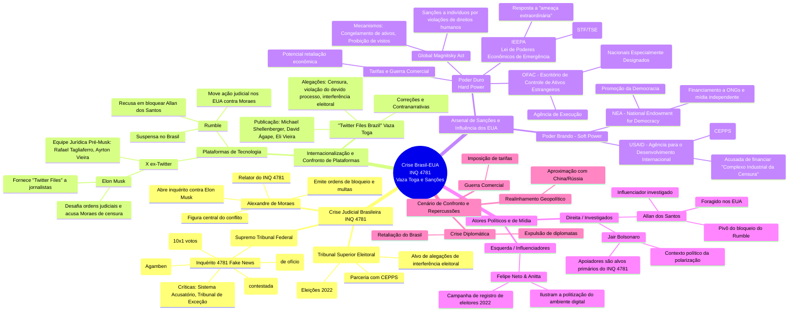

Crise Brasil-EUA - INQ 4781 - Vaza Toga e Sanções

    Crise Judicial Brasileira INQ 4781
      STF (Supremo Tribunal Federal)
        Inquérito 4781 Fake News
          Origem: Portaria GP 69/2019 (de ofício)
          Base Legal: Art. 43 RISTF (contestada)
          Validação: ADPF 572 (10x1 votos)
          Críticas: Sistema Acusatório, Tribunal de Exceção
          Análise Teórica: "Estado de Exceção" (Agamben)
      TSE (Tribunal Superior Eleitoral)
        Presidência de Moraes (Eleições 2022)
        Alvo de alegações de interferência eleitoral
        Parceria com CEPPS 
      Alexandre de Moraes
        Relator do INQ 4781
        Figura central do conflito
        Emite ordens de bloqueio e multas
        Abre inquérito contra Elon Musk 
    Internacionalização e Confronto de Plataformas
      "Twitter Files Brazil" Vaza Toga
        Publicação: Michael Shellenberger, David Ágape, Eli Vieira
        Alegações: Censura, violação do devido processo, interferência eleitoral
        Correções e Contranarrativas 
      Plataformas de Tecnologia
        X ex-Twitter
          Equipe Jurídica Pré-Musk: Rafael Tagliaferro, Ayrton Vieira
          Elon Musk
            Desafia ordens judiciais e acusa Moraes de censura 
            Fornece "Twitter Files" a jornalistas 
        Rumble
          Recusa em bloquear Allan dos Santos 
          Suspensa no Brasil
          Move ação judicial nos EUA contra Moraes 
    Arsenal de Sanções e Influência dos EUA
      Poder Duro Hard Power
        Global Magnitsky Act
          Sanções a indivíduos por violações de direitos humanos
          Mecanismos: Congelamento de ativos, Proibição de vistos
        IEEPA Lei de Poderes Econômicos de Emergência
          Resposta a "ameaça extraordinária"
          Sanções a indivíduos e instituições (STF/TSE)
        OFAC - Escritório de Controle de Ativos Estrangeiros
          Agência de Execução
          Gerencia a "Lista SDN" (Nacionais Especialmente Designados)
        Tarifas e Guerra Comercial
          Potencial retaliação econômica
      Poder Brando - Soft Power
        NEA - National Endowment for Democracy
          Promoção da Democracia
          Financiamento a ONGs e mídia independente
        USAID - Agência para o Desenvolvimento Internacional
          Financiamento a parceiros (CEPPS)
          Acusada de financiar "Complexo Industrial da Censura"
    Atores Políticos e de Mídia
      Direita / Investigados
        Jair Bolsonaro
          Contexto político da polarização
          Apoiadores são alvos primários do INQ 4781
        Allan dos Santos
          Influenciador investigado
          Foragido nos EUA
          Pivô do bloqueio do Rumble
      Esquerda / Influenciadores
        Felipe Neto & Anitta
          Campanha de registro de eleitores 2022
          Ilustram a politização do ambiente digital
    Cenário de Confronto e Repercussões
      Crise Diplomática
        Retaliação do Brasil
        Expulsão de diplomatas
      Guerra Comercial
        Imposição de tarifas
      Realinhamento Geopolítico
        Aproximação com China/Rússia
