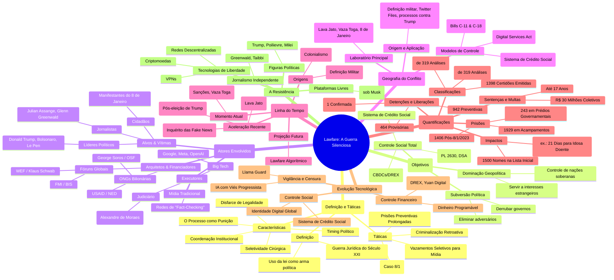

### 🧠 Mapa Mental Lawfare - O Quê, Porquê, Quem, Onde, Quando

![](https://mermaid.live/view#pako:eNqNWE2P28gR_SsFIRtoAI0taWTNSJeAI1ETefXlkWbiBL60yBbVOyRb203Kjg2fcljsXoP8ACeHwAv4ZOwlV_6xvCYlsWl7kACGh8Ourq6uevXqcd7VPOnzWr8WidiP2O5VTKSkTOr1CXu9YYr3yaGblCvFaClCHntCanZ29io2lkTffUdzenHnUvYzuTSYT-c0upsNxvOZUxhgNc1-_QPVh3wjYpH9O_uXJE6r7EMiPKbPCiuifl94Mq5vGG3Y-Y8p14mQ8WnV2nx8Rcewnqcq--TDGfmSltlHLw0lvXw5Lg3vtCSfUcgFeTKSxFTEaCfD7JOJ4Wg3YIp5CYcznYdW7h8KjVR4nHxOEx6wUPjM5-X6koc8Efv8LQ2Eyv6jAssx0UogvQEtDkdadxhIqXwesyIv4xhHJylyHLOwNJrTQkmPa1wjj3-RfpGLYzbLLffsLYt4nEh9jA5PO9yQpiZZVmwLJXT2G9d44HvsEHtmnmUo44D5ts8DIhBz4ZDqA4aQrp62zqwLKXNXpOjt4U63PFGSGbfGqETN9XN3Nb6fL8ldrm6dVfbzzXgwXxbrC6l-LFAzX_9QBP9toIQi2CbrNFyflpfpes-VNicvvqywwZFS6ZopCiSsYmndzg3zwBUxP3fwQYlyeSjNWnGhGy53X3seyBj3DHOM5JYmpVquuWKxncQlV3uBQ0jEwBpqCjOAHVYBF6o88eRvKT3BQlrJxIbEgMc6RTWHIhBYoPpiQu3uRbNBw6Vz9o2wRog_9swRKNv1cKCfDm_dl5blUuiEoy8MhFX20ReJPJxdqdutO3QJ_5zV_NY9lOtFyiPUykkkLkRuvJchmuGxmqUa6T0tOai0SLgB6u8PQQrmG0cW_mc3mq5FiLYwZbHTSaYcKjBpQvLoKc2XI3v1bumMh3g9c4fl61H2WaWxpptQrpmoePuTO4L19yFL0Tje9jVb26uj6Rir1-Pl8aX7hntpUo32eQoyEjl-7L3L1QgpCvkbFvsqh8lUKsa1VYJrEdCKe9vK9aQMQt6gKU9Yg-Y7HjsWsxXNTCvFzJlV1rjlPqqBc17VRiC288GWew-goVe1U-7DfZ72ewPmqNLq8GvQWVJWJUtDc5KPY9No16BrGWq8ULIBdqQFj61cSGW4QCfVmj1PQ8FicrQ2sG-gEDyO6UZxHr-GYwu-hlPRdJXdUxaLDXqGoYO0If0rc8vnLDboroD1xp3f3DqjsUPDOYbTbDQZr-aHuRT7HJgFegLFNiIfHmiWTQjcfxu3AdDCT0sTtkb5EiBJSMOhgO3Ozv61YlqgLydsjxHFEiTHcDL6OEAd7YhPLqeYxKHMS3ZsWysTW_QG1R_vUgtHbqrkDsZHcsg5B_ODHC-xuQHM5GcfqI7WCjUNzlstgAE_rk5GcyUCHmFeO7sQdPfFAHbvnOpcj9CjCVMNWr0WCegNDR1y3aDdYXxpzC9cjBXIOavUajKe_TGv08qdLuZHYkGzSJRpIuJtXqIVj3aP1McLpfdQjTy2ifeoDO7H4zE40Aw4YbAZSSsn7WazVb3TtLhTSVge5qk6DTcPI5Pb-1sdq-gVz60uaDr7rM_h4OAcZSxTcbLrUX0cYwB-VKa8mME0Yg-cZvy1tsCSj3dyktSGXbvZ7pzjv2eACouLMWQh77QdA_4HXsQwShNMkq_HvBMGEmIoiXLBcqrTiztnthqPxgMn-yn7RzkCmImmnv8UmwIrv_FHRoDHQtQC-VFWQIUMKeNo9do9Avgcj0W7g5ixLtq5MIuLvAkArJt8oOdmFUpvdZpdyrMOnfIUmbk4TdiQaW2Fau256F1hwqpE-PkYdyOBR5vCOm0woxaFWKqjihcomoPpBDxVKL19eYm6Bex_WQ55wg_lQrdNxLqAWCWsnjm1FGlWNN2OKegeGfxcHY-tTo-mabjNudyJ03y4mkBaOdkJCGG_BMXSYBlRMBMDtlVY20myj9S6hBe7DLe_o4um6ZFtHvpRGp4sxiidVylc61mzSTOgV0Mn4abgcehecRQaR2oyZOHqHfeyTxszfqjO3zzpU7sFycMOUnYMjQEJJE3Y9heJez-f3AGdfzNkMpjNJ9nfIS4PHyQu1ElaIB-zNsZ8-2yL9SpOZVCW6B5sGmb_NClEeg4CrAwZQwbiHFbZx1w_B0bcmdt9LdocSIYIkHiL5IMsQgZCv0mZ8s--Un-lbLPcGPkGkoJ-a9Cf0XBHFXhmf7LE21zs5ZGwKPuw5-Ej2vL_1YCHe_oGf_mnznG-5DqqKhMdCMXleLnKfsHH4CHzeMdNRrJfTQ6_mXC9FTz0z1lYzqmRCJCzUonYmDwIkIUER_O9MjIJA0ecOAUUwzYSINcA2r6i0m7TaG10Fb4XUCPvoUEvqQ69Dtzrcooc9Utkvs18DvXlV_n-pFkw85hYr09nF9iSgQGrf-jo6lcjvpR2wIHkFWYpVNuQazNYVP4dVVm_X8x0rVELlPBr_Q0LNW_UIo4rmt9r7_Ii1JItj_irWh-PPlMPRvG9x6Ydi_8iZVTrJyrFNiXTYHtyku58lnA0l4HLycRcWA1kGie1frvbyn3U-u9qb2r97pOr5tVV59llq91uXXY6nUbtr7V-q9t8cnXR7nV73csWDHqd943a2_zU5pNer9m7aHa67U673XvWgztuMKamxd8g8j9FvP8vmzxBiA)

*** 

mindmap
  root((Lawfare: A Guerra Silenciosa))

    %% O QUE É E COMO FUNCIONA
    O Quê? (Definição e Táticas)
      ::icon(fa fa-question)
      Definição
        Guerra Jurídica do Século XXI
        Uso da lei como arma política
      Características
        Disfarce de Legalidade
        Seletividade Cirúrgica
        Timing Político
        Coordenação Institucional
        O Processo como Punição
      Táticas
        Vazamentos Seletivos para Mídia
        Prisões Preventivas Prolongadas
          (Filipe Martins)
          (Braga Netto: General 4 estreles)
          (Marcelo Câmara: Coronel do Exército)
          (Rafael de Oliveira: Major do Exército)
          (Coronel Naime: COPM-DF)
          (Anderson Torres: ex-ministro da Justiça)
        Lawfare 
          (Daniel Silveira)
          (Coletivo - Caso 8/1)
        Criminalização Retroativa

*** 

mindmap
  root((Lawfare: A Guerra Silenciosa))

    %% OBJETIVOS ESTRATÉGICOS
    (Porquê? Objetivos)
      ::icon(fa fa-lightbulb)
      Subversão Política
        Derrubar governos
        Eliminar adversários
      Dominação Geopolítica
        Controle de nações soberanas
        Servir a interesses estrangeiros
      Controle Social Total
        Censura Digital 
            (Inquérito 4.781)
            (PL 2630)
            (DSA)
        Controle Financeiro 
            (CBDCs)
            (DREX)
        Sistema de Crédito Social

*** 

mindmap
  root((Lawfare: A Guerra Silenciosa))

    %% REDE DE ATORES
    (Quem? Atores Envolvidos)
      ::icon(fa fa-users)
      Arquitetos & Financiadores
        ONGs Bilionárias
          (George Soros / OSF)
          (USAID)
          (NED)
        Fóruns Globais
          (WEF / Klaus Schwab)
          (FMI)
          (BIS)
      Executores
        Judiciário
          STF 
            (Alexandre de Moraes)
        Big Tech
          Google
          Meta
          OpenAI
        Mídia Tradicional
        Redes de "Fact-Checking"
      Alvos & Vítimas
        Líderes Políticos
          Donald Trump
          Bolsonaro
          Le Pen
        Jornalistas
          Julian Assange
          Glenn Greenwald
          Allan dos Santos
        Cidadãos
          300 de Brasília  
          Manifestantes do 8 de Janeiro

***

mindmap
  root((Lawfare: A Guerra Silenciosa))

    %% GEOGRAFIA DO CONFLITO
    Onde? (Geografia do Conflito)
      ::icon(fa fa-globe)
      Laboratório Principal
        Brasil 
            (Lava Jato)
            (Vaza Toga)
            (Inquerio 4871)
            (8 de Janeiro)
      Modelos de Controle
        China 
            (Sistema de Crédito Social)
        Europa 
            Digital Services Act
        Canadá 
            (Bills C-11 )
            (C-18)
      Origem e Aplicação
        EUA 
            (Definição militar)
            (Twitter Files)
            (processos contra Trump)

*** 

mindmap
  root((Lawfare: A Guerra Silenciosa))

    %% LINHA DO TEMPO
    Quando? (Linha do Tempo)
      ::icon(fa fa-clock)
      Origens
        Século XVIII 
            (Colonialismo)
        2001 
            (Definição Militar)
      Aceleração Recente
        2014 
            (Lava Jato)
        2016 
            (Pós-eleição de Trump)
        2019 
            (Inquérito das Fake News)
      Momento Atual
        2024-2025 
            (Sanções, Vaza Toga)
      Projeção Futura
        Lawfare Algorítmico

*** 

mindmap
  root((Lawfare: A Guerra Silenciosa))

    %% QUANTIFICAÇÕES
    Quanto (Quantificações)
      ::icon(fa fa-calculator)
      Prisões
        1929 em Acampamentos
        243 em Prédios Governamentais
        1406 Pós-8/1/2023
      Classificações
        1398 Certidões Emitidas
        319 Análises
            (42 Positivas)
            (277 Negativas)
      Detenções e Liberações
        942 Preventivas
        464 Provisórias
        149 Mulheres Anunciadas 
            (1 Confirmada)
      Sentenças e Multas
        Até 17 Anos
        R$ 30 Milhões Coletivos
      Impactos
        1500 Nomes na Lista Inicial
        Casos Específicos 
            (21 Dias para Idosa Doente)

*** 

mindmap
  root((Lawfare: A Guerra Silenciosa))

    %% EVOLUÇÃO TECNOLÓGICA
    Evolução Tecnológica
      ::icon(fa fa-cogs)
      Vigilância e Censura
        IA com Viés Progressista
        Censura Automatizada 
            (Llama Guard)
      Controle Financeiro
        CBDCs 
            (DREX)
            (Yuan Digital)
        Dinheiro Programável
      Controle Social
        Sistema de Crédito Social
        Identidade Digital Global

*** 

mindmap
  root((Lawfare: A Guerra Silenciosa))

    %% A RESISTÊNCIA
    A Resistência
      ::icon(fa fa-shield-alt)
      Figuras Políticas
        Trump
        Poilievre
        Milei
      Plataformas Livres
        Rumble
        Substack
        X @Musk
      Jornalismo Independente
        Greenwald
        Taibbi
      Tecnologias de Liberdade
        Criptomoedas
        Redes Descentralizadas
        VPNs

*** 
