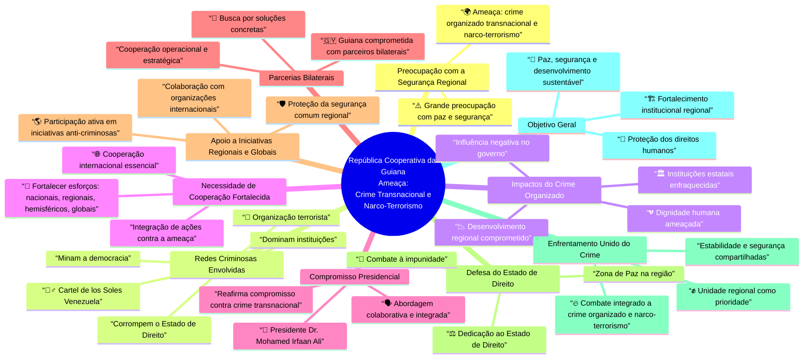

# Declaração do Governo da República Cooperativa da Guiana sobre a Ameaça à Segurança Regional causada pelo Crime Transnacional e Narco-terrorismo  
## Preocupação com a Segurança Regional  
- ⚠️ O governo expressa grande preocupação com a ameaça à paz e segurança na região.  
- 🌍 A ameaça é causada por crime organizado transnacional e narco-terrorismo.  
## Redes Criminosas Envolvidas  
- 🕵️‍♂️ Destaca-se o Cartel de los Soles da Venezuela como organização terrorista.  
- 🚨 Essas redes dominam instituições, minam a democracia e corrompem o estado de direito.  
## Impactos do Crime Organizado  
- 💔 A dignidade humana e o desenvolvimento regional estão ameaçados.  
- 🏛️ As instituições estatais sofrem influência negativa e enfraquecimento.  
## Necessidade de Cooperação Fortalecida  
- 🤝 É essencial fortalecer esforços nacionais, regionais, hemisféricos e globais.  
- 🌐 A cooperação internacional é fundamental para combater a ameaça.  
## Compromisso Presidencial  
- 👤 O Presidente Dr. Mohamed Irfaan Ali reafirma o compromisso contra o crime transnacional.  
- 🗣️ Enfatiza uma abordagem colaborativa e integrada.  
## Parcerias Bilaterais  
- 🇬🇾 Guiana está comprometida a trabalhar com parceiros bilaterais.  
- 🔗 Busca soluções concretas para combater redes criminosas.  
## Apoio a Iniciativas Regionais e Globais  
- 🌎 Participação ativa em iniciativas que visam desmantelar redes criminosas.  
- 🛡️ Proteção da segurança comum da região.  
## Defesa do Estado de Direito  
- ⚖️ Reafirmação da dedicação para defender o estado de direito.  
- 📜 Garantia de que a região permaneça uma Zona de Paz.  
## Enfrentamento Unido do Crime  
- ✊ Unidade regional é chave para combater o crime organizado e narco-terrorismo.  
- 🔥 Compromisso com a segurança e estabilidade da região.  
## Objetivo Geral  
- 🎯 Promover paz, segurança e desenvolvimento sustentável na região.  
- 🤲 Proteção dos direitos humanos e fortalecimento institucional.


República Cooperativa da Guiana 
Ameaça: Crime Transnacional e Narco-Terrorismo

https://tinyurl.com/crime-transnacional

https://tinyurl.com/crime-transnacionalNC

https://tinyurl.com/guiana-crime-transnacional



https://tinyurl.com/crime-transnacionalNC

https://mermaid.live/view#pako:eNptk81u2kAQx19ltKdUAsSH-bAPlVJMK6RGqULUQw2HiT3AtvautWujFMzDVD3kHXrlxTq2SY1oDrZnxv_5zezs7kGEOiLhiY3BdAuP_lIBfMolKgweKD39eYpliBDhObiCdvt9MXtODVmLwB8d5imeXk6_dQEL2uQG1ekFbxoTHmgjtcL4Xcm-iJek24Q4GZmfalPA1MiEbqo33JsNKrnHSMMjZ1iFYYOpJSXhs4zIlKIagCajOKg_EBHE2sJCx2ShDV9J0T6nGFcVotaUjKk2RicpFTCzGbN88qUhmemg9kvQOXKdeicVJgX4lOjQcIcYNOaqGea5TJJyHWltSSzgCw-Ru1cZBY0JvunAnd5iQhHMzRpRwW0sK9aFquT5tCYV_d_1VdmP2mQYU8jCqdYpT6varuDSgTlDzeuI60Ve_j63zz2jCclItB9kjJyC0r4pnrF2riRPIZM7tOczUIvfildJ90_ficO6LLMP-Pl3durlc4BlPGxLaqfjHZ8BxZt05cMitxkbp187ileixWdbRsLLTE4tkZBJsHTFoUQuRbalhJbCYzNC82MplurIOSmqb1onr2lG55ut8NYYW_byNOK1-xL51jSSci_MVOcqE16v71YM4R3EM7vjcccdDYeDQa87GI8n_VFL_BRef9zpu11n6Ewcpz90nN7o2BL7qmy34w56_clg5HQdx3VHvXFLUMSba-7qC1vd2-NfU3JWrQ


```mermaid
graph TD
    A["⚠️ Preocupação com a Segurança Regional<br/>• Grande preocupação com paz e segurança<br/>• 🌍 Ameaça: crime organizado transnacional e narco-terrorismo"]
    --> B["🕵️‍♂️ Redes Criminosas Envolvidas<br/>• Cartel de los Soles (Venezuela)<br/>• 🚨 Organização terrorista<br/>• Dominam instituições<br/>• Minam a democracia<br/>• Corrompem o Estado de Direito"]

    B --> C["💔 Impactos do Crime Organizado<br/>• Dignidade humana ameaçada<br/>• Desenvolvimento regional comprometido<br/>• 🏛️ Instituições enfraquecidas<br/>• Influência negativa no governo"]

    A --> D["🤝 Necessidade de Cooperação Fortalecida<br/>• Fortalecer esforços: nacionais, regionais, hemisféricos e globais<br/>• 🌐 Cooperação internacional essencial"]

    D --> E["👤 Compromisso Presidencial<br/>• Presidente Dr. Mohamed Irfaan Ali<br/>• Reafirma combate ao crime transnacional<br/>• 🗣️ Abordagem colaborativa e integrada"]

    D --> F["🇬🇾 Parcerias Bilaterais<br/>• Guiana comprometida com aliados estratégicos<br/>• 🔗 Busca soluções concretas contra redes criminosas"]

    D --> G["🌎 Apoio a Iniciativas Regionais e Globais<br/>• Participação ativa em operações conjuntas<br/>• 🛡️ Proteção da segurança comum regional"]

    C --> H["⚖️ Defesa do Estado de Direito<br/>• Dedicação ao Estado de Direito<br/>• 📜 Combate à impunidade<br/>• Zona de Paz na região"]

    E --> I["✊ Enfrentamento Unido do Crime<br/>• Unidade regional como prioridade<br/>• 🔥 Combate integrado a crime organizado e narco-terrorismo<br/>• Estabilidade e segurança compartilhadas"]

    F --> I
    G --> I
    H --> I

    I --> J["🎯 Objetivo Geral<br/>• Paz, segurança e desenvolvimento sustentável<br/>• 🤲 Proteção dos direitos humanos<br/>• Fortalecimento institucional"]

    G --> J
    H --> J

    style A fill:#f8d7da,stroke:#c00,stroke-width:2px,color:#721c24
    style B fill:#fff3cd,stroke:#f0b518,stroke-width:2px,color:#856404
    style C fill:#f9f9c5,stroke:#856404,stroke-width:2px,color:#544804
    style D fill:#d1ecf1,stroke:#0b7f8c,stroke-width:2px,color:#06545e
    style E fill:#cce5ff,stroke:#004085,stroke-width:2px,color:#002b58
    style F fill:#e2e3e5,stroke:#383d41,stroke-width:2px,color:#1f2224
    style G fill:#d4edda,stroke:#277b57,stroke-width:2px,color:#155724
    style H fill:#e1d5e7,stroke:#8c6fa6,stroke-width:2px,color:#573a68
    style I fill:#fff2cc,stroke:#b38f00,stroke-width:2px,color:#7a6300
    style J fill:#d4edda,stroke:#155724,stroke-width:2px,color:#155724
    ```
