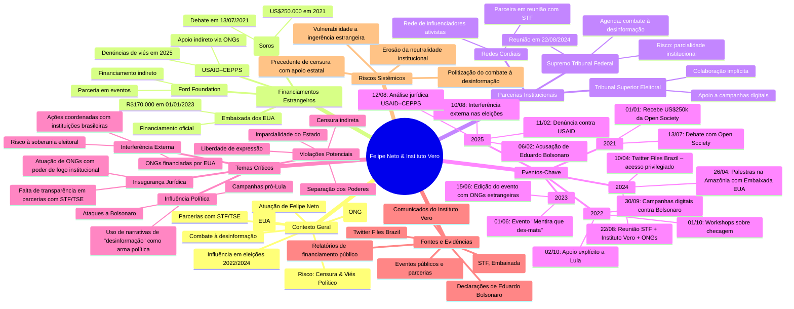

```mermaid
mindmap
  root((Felipe Neto & Instituto Vero))
  
    Contexto Geral
      Atuação de Felipe Neto
      Instituto Vero (ONG)
      Combate à desinformação
      Parcerias com STF/TSE
      Influência em eleições 2022/2024
      Financiamento externo (EUA)
      Risco: Censura & Viés Político

    Financiamentos Estrangeiros
      Open Society Foundations (Soros)
        US$250.000 em 2021
        Debate em 13/07/2021
      Embaixada dos EUA
        R$170.000 em 01/01/2023
        Financiamento oficial
      USAID–CEPPS
        Apoio indireto via ONGs
        Denúncias de viés em 2025
      Ford Foundation
        Parceria em eventos
        Financiamento indireto

    Parcerias Institucionais
      STF (Supremo Tribunal Federal)
        Reunião em 22/08/2024
        Agenda: combate à desinformação
        Risco: parcialidade institucional
      TSE (Tribunal Superior Eleitoral)
        Colaboração implícita
        Apoio a campanhas digitais
      Redes Cordiais
        Parceira em reunião com STF
        Rede de influenciadores ativistas

    Eventos-Chave
      2021
        01/01: Recebe US$250k da Open Society
        13/07: Debate com Open Society
      2022
        01/10: Workshops sobre checagem
        30/09: Campanhas digitais contra Bolsonaro
        02/10: Apoio explícito a Lula
      2023
        01/06: Evento "Mentira que des-mata"
        15/06: Edição do evento com ONGs estrangeiras
      2024
        10/04: Twitter Files Brazil – acesso privilegiado
        26/04: Palestras na Amazônia com Embaixada EUA
        22/08: Reunião STF + Instituto Vero + ONGs
      2025
        06/02: Acusação de Eduardo Bolsonaro
        11/02: Denúncia contra USAID
        10/08: Interferência externa nas eleições
        12/08: Análise jurídica USAID–CEPPS

    Temas Críticos
      Interferência Externa
        ONGs financiadas por EUA
        Ações coordenadas com instituições brasileiras
        Risco à soberania eleitoral
      Violações Potenciais
        Liberdade de expressão
        Imparcialidade do Estado
        Separação dos Poderes
        Censura indireta
      Influência Política
        Campanhas pró-Lula
        Ataques a Bolsonaro
        Uso de narrativas de "desinformação" como arma política
      Insegurança Jurídica
        Atuação de ONGs com poder de fogo institucional
        Falta de transparência em parcerias com STF/TSE

    Fontes e Evidências
      Twitter Files Brazil
      Relatórios de financiamento público
      Comunicados do Instituto Vero
      Declarações de Eduardo Bolsonaro
      Reuniões oficiais (STF, Embaixada)
      Eventos públicos e parcerias

    Riscos Sistêmicos
      Precedente de censura com apoio estatal
      Politização do combate à desinformação
      Erosão da neutralidade institucional
      Vulnerabilidade a ingerência estrangeira
```
