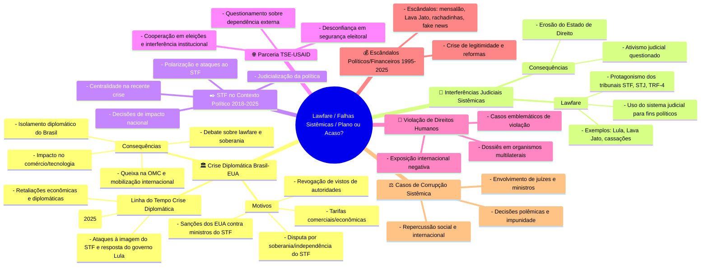

```mermaid
mindmap
  root((Lawfare / Falhas Sistêmicas / Plano ou Acaso?))
    🏛️ Crise Diplomática Brasil-EUA  
      Motivos
        - Sanções dos EUA contra ministros do STF
        - Tarifas comerciais/econômicas
        - Revogação de vistos de autoridades
        - Disputa por soberania/independência do STF
      Consequências
        - Isolamento diplomático do Brasil
        - Impacto no comércio/tecnologia
        - Queixa na OMC e mobilização internacional
        - Debate sobre lawfare e soberania
      Linha do Tempo Crise Diplomática
        - Início das sanções (2025)
        - Ataques à imagem do STF e resposta do governo Lula
        - Retaliações econômicas e diplomáticas
    📜 Interferências Judiciais Sistêmicas
      Lawfare
        - Uso do sistema judicial para fins políticos
        - Protagonismo dos tribunais STF, STJ, TRF-4
        - Exemplos: Lula, Lava Jato, cassações
      Consequências
        - Erosão do Estado de Direito
        - Ativismo judicial questionado
    ✒️ STF no Contexto Político 2018-2025
      - Judicialização da política
      - Decisões de impacto nacional
      - Polarização e ataques ao STF
      - Centralidade na recente crise
    🌐 Parceria TSE-USAID
      - Cooperação em eleições e interferência institucional
      - Questionamento sobre dependência externa
      - Desconfiança em segurança eleitoral
    📝 Violação de Direitos Humanos
      - Casos emblemáticos de violação
      - Exposição internacional negativa
      - Dossiês em organismos multilaterais
    💰 Escândalos Políticos/Financeiros 1995-2025
      - Escândalos: mensalão, Lava Jato, rachadinhas, fake news
      - Crise de legitimidade e reformas
    ⚖️ Casos de Corrupção Sistêmica
      - Envolvimento de juízes e ministros
      - Decisões polêmicas e impunidade
      - Repercussão social e internacional
```
