  style root fill:#c0392b, color:white, font-weight:bold, font-size:18px
  style Introducao fill:#3498db, color:white, font-weight:bold
  style Detalhamento fill:#e67e22, color:white, font-weight:bold
  style Pontos fill:#2c3e50, color:white, font-weight:bold
  style Modus fill:#8e44ad, color:white, font-weight:bold
  style Atores fill:#27ae60, color:white, font-weight:bold
  style Consequencias fill:#d35400, color:white, font-weight:bold
  style Conclusao fill:#f39c12, color:black, font-weight:bold
  style Recomendacoes fill:#1abc9c, color:white, font-weight:bold

```mermaid
mindmap
  root((🔍 Vaza Toga 1 & 2))

    📌 Introdução
      Objetivo
        Mapear padrões de censura
        Identificar agentes envolvidos
        Analisar impacto na democracia
      Ênfase
        Ações de TSE/STF
        Operações policiais
        Táticas informacionais
        ONGs estrangeiras
        Impactos políticos e sociais

    📊 Detalhamento
      Censura Sistêmica e Bastidores
        Estrutura paralela de monitoramento
        Remoção de conteúdo crítico
        Letícia Sallorenzo
          "Bruxa da Vaza Toga"
          Colaboradora informal
          Envio de dossiês contra críticos
        Negativa oficial do TSE
        Pressões ilegais contra adversários
      Relatórios Técnicos e Criminalização
        Tese de *firehosing* (inundação informacional)
        Uso por PF e TSE para reprimir críticos
        Alvos
          Instituto Voto Legal (IVL)
          Engenheiros: Carlos Rocha, Éder Balbino
          Associação indevida a golpismo
        Distorção por influenciadores
          Ex: Fernando Cerimedo (ARG)
          Censura sem base técnica
      Lawfare e Repressão Judicial
        Liderado por Alexandre de Moraes
        Concentração de poder
        Inquéritos indefinidos
        Multas excessivas
        Censura prévia de opiniões
        Ataques à advocacia
        Sigilo e ausência de transparência

    🔥 Pontos Importantes
      Bastidores da censura digital
        Núcleo paralelo no TSE
        Monitoramento informal
      Criminalização da auditoria técnica
        Perseguição a engenheiros
        Relatórios tratados como ameaça
      Difusão internacional de alegações
        ONGs amplificam narrativas
        Gera repressão sem investigação
      Lawfare sistêmico
        Multas para induzir autocensura
        Restrições ao contraditório
        Bloqueios indiscriminados
      Ingerência internacional
        Financiamento por NED, USAID, DFRLab
        Apoio a estratégias de controle
      Ocultamento institucional
        TSE/STF não divulgam dados
        Falta de prestação de contas

    ⚙️ Modus Operandi
      Estrutura paralela
        Ativistas informais na Assessoria do TSE
        Dossiês sem registro oficial
      Centralização e opacidade
        Decisões monocráticas
        Processos físicos sem sorteio
        Sem acesso a investigados
      Instrumentalização de especialistas
        Importação de conceitos
          Ex: *firehosing* (RAND Corporation)
        Parcerias com think tanks
      Censura via plataformas
        Exigência de dados sem ordem judicial
        Perseguição a jornalistas
        Colaboração de big techs
      Sanções desproporcionais
        Multas altas para silenciar
        Efeito dissuasivo
      Difusão de escândalos sem análise
        Repressão antes de investigação
        Críticas tratadas como crime

    👥 Atores Envolvidos
      Individuais
        Letícia Sallorenzo
          Articuladora de dossiês
          Ligação com auxiliares de Moraes
        Alexandre de Moraes
          Líder dos inquéritos
          Centralização do poder
        Carlos Rocha & Éder Balbino
          Engenheiros criminalizados
          Relatórios técnicos censurados
        Fernando Cerimedo
          Consultor argentino
          Internacionalizou acusações
          Indiciado posteriormente
      Institucionais e Redes
        TSE
          Epicentro da censura
          Bloqueios sem transparência
          Expansão de poder
        STF
          Viabiliza lawfare
          Inquéritos sem contraditório
        Polícia Federal
          Relatórios frágeis
          Base para criminalização
        ONGs Internacionais
          NED, USAID, DFRLab
          Financiamento de ações
          RAND Corporation
          Fornecimento de conceitos

    ⚠️ Consequências
      Violação de direitos
        Liberdade de expressão
        Censura prévia
        Falta de devido processo
      Radicalização da desconfiança
        Polarização aumentada
        Descrédito institucional
      Criminalização do debate técnico
        Silenciamento de especialistas
        Medo de auditoria
      Influência internacional
        Controles informacionais via ONGs
        Agenda externa internalizada
      Desmonte democrático
        Estado de exceção informacional
        Autocensura generalizada
        Sociedade inibida

    🎯 Conclusão
      Práticas sistêmicas de censura
      Justificadas como "defesa da democracia"
      Comprometem garantias constitucionais
      Criam ambiente de exceção
      Risco ao Estado de Direito

    ✅ Recomendações
      Formalização e transparência
        Proibir colaborações informais
        Tornar públicas decisões de censura
      Revisão do controle judicial
        Limitar poderes discricionários
        Restabelecer sorteio de relatoria
      Proteção à auditoria técnica
        Garantir segurança para especialistas
        Abolir criminalização de relatórios
      Controle de influências externas
        Tornar públicos financiamentos
        Proibir ingerência estrangeira
      Instâncias de recurso contra censura
        Contraditório imediato
        Revisão por colegiados
      Reforço ao jornalismo
        Proibir censura prévia
        Multas não devem inviabilizar
        Promover pluralidade

```

