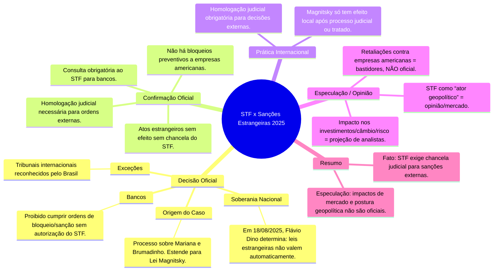

- &nbsp;
{:toc .large-only}

# 🗂️ Linha do Tempo Detalhada: Conflitos STF, Sanções Internacionais e Plataformas Digitais

## ⏳ Fevereiro 2025 — Bloqueio da Rumble no Brasil
- 🟥 **Decisão Judicial:** STF, via ministro Alexandre de Moraes, determina bloqueio do Rumble por descumprimento de ordens judiciais ligadas à investigação sobre fake news e ataques às instituições.[^1]
- ⚖️ **Fundamentação Jurídica:** Moraes cita o Marco Civil da Internet e o dever de cooperação de plataformas com decisões judiciais brasileiras. Exige remoção de perfis e indicação de representante legal.[^1]
- 📝 **Recurso:** Rumble recorre ao próprio STF e busca sustentação em tribunais americanos, alegando restrição à liberdade de expressão.

***

## ⏳ Fevereiro–Março 2025 — Ação Judicial nos EUA contra Moraes
- 🇺🇸 **Ação Civil nos EUA:** Rumble e Trump Media (Truth Social) processam Moraes e o governo brasileiro na Flórida, alegando censura e violação dos princípios de liberdade de expressão garantidos pela Primeira Emenda da Constituição Americana.[^2][^3][^4]
- 📜 **Pedidos judiciais:** Buscam liminar proibindo qualquer efeito das decisões brasileiras em território americano; pleiteiam indenização por perdas decorrentes do bloqueio no Brasil.
- ✉️ **Notificação ao STJ:** Justiça dos EUA encaminha pedido oficial para que Moraes seja intimado.
- 🏛️ **STJ responde:** O Superior Tribunal de Justiça analisa se pode dar validade à intimação internacional via MLAT (acordo de assistência jurídica mútua), mas reforça a soberania nacional e limita atuação estrangeira.[^5][^6]

***

## ⏳ Julho 2025 — Sanções Magnitsky e Reações
- ⚠️ **Sanções dos EUA:** EUA aplicam Lei Global Magnitsky contra Moraes por “repressão injustificada à liberdade de expressão”. Ativos bloqueados, restrições financeiras e proibição de entrada nos EUA.[^7][^8][^9]
- 🗣️ **Campanha Pública:** Rumble, políticos americanos e personalidades divulgam apoios à ação, classificam STF como “autoritário”.
- 📢 **Comemoração Internacional:** Rumble celebra restrições e diz que manterá resistência judicial internacional.[^10]

***

## ⏳ Agosto 2025 — Nota Diplomática & Decisões Brasileiras
- ✉️ **Nota dos EUA:** Embaixada americana publica comunicado reafirmando que decisões de tribunais estrangeiros não obrigam empresas dos EUA automaticamente; destaca que a cooperação depende de acordos formais (ex: MLAT).[^4][^11][^5]
- 🤝 **STF reage:** Flávio Dino decide que bancos e empresas brasileiras não podem cumprir ordens estrangeiras (ex: bloqueios, cancelamentos) sem chancela judicial brasileira. Consolida soberania nacional e limita extraterritorialidade de sanções.[^12][^13]
- 📚 **Base Jurídica:** Apoio constitucional e na LINDB (Lei de Introdução às Normas do Direito Brasileiro), CPC e tratados internacionais.

***

## ⏳ Agosto 2025 — Novos Movimentos de Rumble e Trump Media
- 📝 **Apelação em Washington:** Rumble amplia ação nos EUA, agora incluindo pedido para investigação federal contra pressão de autoridades brasileiras sobre empresas americanas.
- 🌐 **Articulação política:** Políticos do Partido Republicano pedem audiências sobre “censura global de plataformas de livre expressão”.
- ⚖️ **Jurisdição internacional:** Discussão sobre validade de decisões estrangeiras versus soberania judicial brasileira ganha destaque em fóruns internacionais.
- 📊 **Mercado:** Analistas apontam impactos no risco país, câmbio e decisões de investimento no Brasil pós-escalada dos conflitos.

***

## 🧠 Mapa Mental STF x Sanções Estrangeiras 2025

### 📌 Referências

1. [Primeira turma do STF confirma suspensão da Rumble no Brasil](https://agenciabrasil.ebc.com.br/radioagencia-nacional/justica/audio/2025-03/primeira-turma-do-stf-confirma-suspensao-da-rumble-no-brasil)
2. [STJ recebe notificação americana sobre ação da Rumble contra Moraes](https://www.cnnbrasil.com.br/politica/stj-recebe-notificacao-do-rumble-para-intimar-moraes-em-acao-nos-eua/)
3. [Empresa de Trump entra com processo contra Alexandre de Moraes](https://www.bbc.com/portuguese/articles/cyvep11qd6po)
4. [Rumble comemora sanções contra Moraes](https://www.cnnbrasil.com.br/politica/bloqueada-no-brasil-rumble-comemora-sancoes-contra-moraes/)
5. [Linha do tempo das sanções e conflitos com o STF](https://www.cnnbrasil.com.br/politica/linha-do-tempo-o-que-aconteceu-ate-eua-aplicarem-magnistky-contra-moraes/)
6. [Entenda a guerra de Trump e Rumble contra Moraes](https://apublica.org/2025/02/quatro-pontos-para-entender-a-guerra-de-trump-e-rumble-contra-moraes/)
7. [Sanções de Trump a Moraes e defesa da liberdade de expressão](https://www.brasilagro.com.br/conteudo/sancoes-de-trump-a-moraes-vitorias-da-liberdade-de-expressao-e-da-justica.html)
8. [Decisão de Dino afeta bancos](https://g1.globo.com/economia/noticia/2025/08/19/decisao-de-dino-entenda-as-duvidas-geradas-e-como-bancos-podem-ser-afetados.ghtml)
9. [Exceção para tribunais internacionais](https://agenciabrasil.ebc.com.br/justica/noticia/2025-08/veto-alcanca-tribunais-estrangeiros-mas-nao-internacionais-diz-dino)

[^1]: [Primeira turma do STF confirma suspensão da Rumble no Brasil](https://agenciabrasil.ebc.com.br/radioagencia-nacional/justica/audio/2025-03/primeira-turma-do-stf-confirma-suspensao-da-rumble-no-brasil)  
[^2]: [Empresa de Trump entra com processo contra Alexandre de Moraes](https://www.bbc.com/portuguese/articles/cyvep11qd6po)  
[^3]: [Moraes vira alvo em ação de empresa de Trump e da Rumble nos EUA](https://noticias.uol.com.br/ultimas-noticias/agencia-estado/2025/02/20/moraes-vira-alvo-em-acao-de-empresa-de-trump-e-da-rumble-nos-eua.htm)  
[^4]: [Quatro pontos para entender a guerra de Trump e Rumble contra Moraes](https://apublica.org/2025/02/quatro-pontos-para-entender-a-guerra-de-trump-e-rumble-contra-moraes/)  
[^5]: [STJ recebe notificação do Rumble para intimar Moraes em ação nos EUA](https://www.cnnbrasil.com.br/politica/stj-recebe-notificacao-do-rumble-para-intimar-moraes-em-acao-nos-eua/)  
[^6]: [STJ recebe pedido para intimar Moraes em ação movida pelo Rumble e empresa de Trump](https://www.cartacapital.com.br/justica/stj-recebe-pedido-para-intimar-moraes-em-acao-movida-pelo-rumble-e-empresa-de-trump/)  
[^7]: [Alexandre de Moraes: o que Lei Magnitsky muda na vida dele](https://www.bbc.com/portuguese/articles/cx2xnn4wplro)  
[^8]: [EUA sancionam Alexandre de Moraes com a Lei Magnitsky](https://www.bbc.com/portuguese/articles/c8ryl2px01mo)  
[^9]: [Sanções de Trump a Moraes: Vitórias da liberdade de expressão e da justiça](https://www.brasilagro.com.br/conteudo/sancoes-de-trump-a-moraes-vitorias-da-liberdade-de-expressao-e-da-justica.html)  
[^10]: [Bloqueada no Brasil, Rumble comemora sanções contra Moraes](https://www.cnnbrasil.com.br/politica/bloqueada-no-brasil-rumble-comemora-sancoes-contra-moraes/)  
[^11]: [Linha do tempo: o que aconteceu até EUA aplicarem Magnistky contra Moraes](https://www.cnnbrasil.com.br/politica/linha-do-tempo-o-que-aconteceu-ate-eua-aplicarem-magnistky-contra-moraes/)  
[^12]: [Bancos perdem bilhões em valor de mercado com decisão Dino - Lei Magnitsky](https://www.gazetadopovo.com.br/economia/bancos-perdem-bilhoes-valor-de-mercado-decisao-dino-lei-magnitsky/)  
[^13]: [Veto alcança tribunais estrangeiros, mas não internacionais, diz Dino](https://agenciabrasil.ebc.com.br/justica/noticia/2025-08/veto-alcanca-tribunais-estrangeiros-mas-nao-internacionais-diz-dino)  
