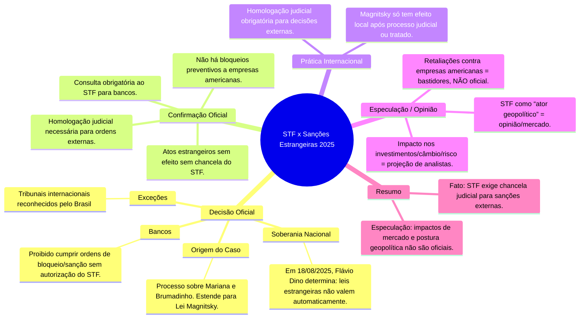

- &nbsp;
{:toc .large-only}

# 🏛️ Sanções, Suspensão de Vistos e Crise Diplomática: STF x EUA em 2025

***

## 🚨 Eventos que Levaram às Sanções e Suspensão de Vistos dos Ministros do STF pelos EUA

- 🟥 **Bloqueios a Plataformas Digitais**  
  O ministro Alexandre de Moraes determinou, ainda em fevereiro de 2025, o bloqueio da plataforma Rumble por descumprimento de ordens judiciais no contexto de investigações sobre desinformação e ataques institucionais. Essa decisão repercutiu internacionalmente e passou a ser vista, nos EUA, como censura a veículos e personalidades ligadas à direita americana.[^1][^2]

- 🏛️ **Ações Judiciais nos EUA**  
  Rumble, apoiada pela Trump Media, entrou com ação na Justiça americana contra Moraes, o STF e o governo brasileiro, pleiteando proteção à liberdade de expressão garantida pela Primeira Emenda dos EUA e buscando impedir o cumprimento internacional das decisões do STF.[^3][^4][^5]

- ⚠️ **Escalada e Reação Política nos EUA**  
  Parlamentares republicanos e líderes de plataformas digitais pressionaram a gestão Trump para uso de instrumentos de política externa. Em julho, os EUA anunciaram sanção via Lei Magnitsky a Moraes por “graves violações à liberdade de expressão” e revogaram simultaneamente vistos de entrada de oito ministros do STF e do procurador-geral da República, atingindo também familiares de autoridades brasileiras.[^2][^6][^7][^8]

***

## 🇧🇷 Como Evoluiu a Reação do Governo Brasileiro aos Cancelamentos de Vistos

- ⚖️ **Resposta Imediata:**  
  O governo brasileiro, através dos Ministérios da Justiça, Relações Exteriores e do próprio STF, classificou a medida americana como “arbitrária” e “sem fundamento”, alegando afronta à soberania e à separação de poderes.[^6][^9]
  
- 🗣️ **Pronunciamentos Oficiais:**  
  O presidente Lula e o presidente do STF emitiram notas duras, defendendo a autonomia do judiciário brasileiro e alertando para o precedente ruim que represálias diplomáticas trazem à cooperação internacional.[^8][^2]

- 🕊️ **Busca de Distensão:**  
  Apesar da irritação inicial, o Itamaraty evitou ampliar o conflito, apostando em canais diplomáticos tradicionais e contatos junto ao Departamento de Estado para tentar reverter ou mitigar as restrições.[^6]

***

## ⚖️ Ações Diplomáticas e Judiciais do Brasil em Resposta às Sanções dos EUA

- 📄 **Protesto Diplomático Formal:**  
  O Brasil enviou notas de protesto à Embaixada dos EUA em Brasília e buscou apoio de países parceiros no âmbito do Mercosul e BRICS, defendendo regras multilaterais claras para sanções e proteção a autoridades.[^8]

- 👩⚖️ **Discussão Constitucional Interna:**  
  O STF apoiou Moraes e debateu medidas para blindar ministros e magistrados de sanções e intimações de cortes estrangeiras, inclusive orientando o governo a garantir livre atuação dos integrantes da corte em missões oficiais no exterior.[^8]

- 🤝 **Consulta à OEA e à ONU:**  
  O Itamaraty considerou acionar relatorias especiais da ONU para independência judicial e liberdade de expressão, buscando construir narrativa contrária à extraterritorialidade dos EUA sobre autoridades brasileiras.[^6]

***

## 👨⚖️ Como a Suspensão dos Vistos Influenciou a Atuação dos Ministros Afetados

- ✈️ **Restrições Práticas e Simbólicas:**  
  Os ministros do STF perderam a possibilidade de viagens de trabalho, participação em seminários, eventos acadêmicos e audiências com pares ou autoridades nos EUA, afetando missões internacionais e cooperação jurídica bilateral.[^10][^6]

- 🗨️ **Aumento da Cautela em Decisões:**  
  Segundo análises, a suspensão de vistos aumentou o grau de preocupação dos ministros com repercussão internacional, sem, porém, modificar o conteúdo de decisões sensíveis sobre liberdade de expressão e combate à desinformação.[^9][^8]

- 📰 **Exposição e Defesa Pública:**  
  Os ministros passaram a rebater publicamente as acusações, defendendo a legitimidade do STF e suas decisões perante a opinião pública nacional e internacional.[^6]

***

## 🔮 Possíveis Impactos Futuros nas Relações Brasil-EUA e no STF

- 🌐 **Diplomacia Judicial Abalada:**  
  Sanções e cancelamentos de vistos podem dificultar cooperação institucional entre Justiças dos dois países, inclusive trocas entre Ministérios Públicos, extraditamentos e trâmites de assistência jurídica mútua.

- ⚡ **Precedente para Disputas Externas:**  
  O caso abre precedente perigoso para politização da justiça internacional e uso de mecanismos diplomáticos como retaliação contra decisões judiciais domésticas, afetando previsibilidade jurídica.[^7][^6]

- 💼 **Risco de Nova Escalada:**  
  Medidas semelhantes podem ser replicadas por terceiros países, pressionando o STF e as instituições brasileiras, além de alimentar discurso de confronto “soberanista” e desconfiar de acordos internacionais.

- 💭 **Imagem e Isolamento:**  
  O STF pode ter sua legitimidade contestada internacionalmente, enquanto autoridades americanas e investidores reavaliam o ambiente jurídico-político brasileiro, impactando percepção de risco-país e custos de transação para empresas e bancos.

*** 

### 🧠 Mapa Mental Sanções, Suspensão de Vistos e Crise Diplomática: STF x EUA em 2025

*** 

### 🧭 Linha do Tempo Crise Diplomática

- [🏦 Crise diplomática Brasil-EUA em 2025 com Sanções a Autoridades](/crise-diplomatica/)

***

### 📚 Referências

1. [G1: EUA suspendem vistos de Moraes e ministros](https://g1.globo.com/politica/noticia/2025/07/19/eua-suspendem-vistos-de-moraes-de-outros-sete-ministros-do-stf-e-do-pgr-mendonca-nunes-marques-e-fux-ficam-de-fora.ghtml)
2. [CNN Brasil: Vistos suspensos atingem 8 ministros do STF](https://www.cnnbrasil.com.br/politica/eua-suspenderam-vistos-de-oito-ministros-do-stf-e-do-pgr-dizem-fontes/)
3. [Migalhas: Outros sete ministros perderam visto americano](https://www.migalhas.com.br/quentes/435014/alem-de-moraes-outros-7-ministros-tiveram-o-visto-americano-cancelado)
4. [CartaCapital: Medida atinge quase todo o STF](https://www.cartacapital.com.br/politica/decisao-dos-eua-de-suspender-vistos-atinge-8-dos-11-ministros-do-stf/)
5. [G1: Primeira reação dos ministros](https://g1.globo.com/politica/blog/julia-duailibi/post/2025/08/15/vistos-cancelados-mulher-filha-alexandre-padilha.ghtml)
6. [Agência Brasil: STF confirma bloqueio de Rumble](https://agenciabrasil.ebc.com.br/radioagencia-nacional/justica/audio/2025-03/primeira-turma-do-stf-confirma-suspensao-da-rumble-no-brasil)
7. [UOL: Autoridades brasileiras sem visto dos EUA](https://noticias.uol.com.br/ultimas-noticias/agencia-estado/2025/07/19/quem-sao-as-autoridades-brasileiras-que-vao-ficar-sem-visto-dos-eua.htm)
8. [CNN Brasil: Sanções e Lei Magnitsky](https://www.cnnbrasil.com.br/politica/linha-do-tempo-o-que-aconteceu-ate-eua-aplicarem-magnistky-contra-moraes/)
9. [BBC: Cancelamento de vistos de brasileiros](https://www.bbc.com/portuguese/articles/clyj4ggglqgo)
10. [Agência Brasil: Reação de Gilmar Mendes](https://agenciabrasil.ebc.com.br/justica/noticia/2025-08/gilmar-mendes-ironiza-cancelamento-de-visto-dos-eua)
11. [G1: Barroso saiu dos EUA antes do cancelamento](https://noticias.uol.com.br/politica/ultimas-noticias/2025/07/18/barroso-saiu-dos-eua-quatro-dias-antes-de-revogacao-de-visto.htm)

[^1]: [Primeira turma do STF confirma suspensão da Rumble no Brasil](https://agenciabrasil.ebc.com.br/radioagencia-nacional/justica/audio/2025-03/primeira-turma-do-stf-confirma-suspensao-da-rumble-no-brasil)  
[^2]: [Além de Moraes, outros 7 ministros tiveram o visto americano cancelado](https://www.migalhas.com.br/quentes/435014/alem-de-moraes-outros-7-ministros-tiveram-o-visto-americano-cancelado)  
[^3]: [Empresa de Trump entra com processo contra Alexandre de Moraes](https://www.bbc.com/portuguese/articles/cyvep11qd6po)  
[^4]: [Moraes vira alvo em ação de empresa de Trump e da Rumble nos EUA](https://noticias.uol.com.br/ultimas-noticias/agencia-estado/2025/02/20/moraes-vira-alvo-em-acao-de-empresa-de-trump-e-da-rumble-nos-eua.htm)  
[^5]: [Quatro pontos para entender a guerra de Trump e Rumble contra Moraes](https://apublica.org/2025/02/quatro-pontos-para-entender-a-guerra-de-trump-e-rumble-contra-moraes/)  
[^6]: [EUA suspendem vistos de Moraes, de outros sete ministros do STF e do PGR; Mendonça, Nunes Marques e Fux ficam de fora](https://g1.globo.com/politica/noticia/2025/07/19/eua-suspendem-vistos-de-moraes-de-outros-sete-ministros-do-stf-e-do-pgr-mendonca-nunes-marques-e-fux-ficam-de-fora.ghtml)  
[^7]: [EUA suspenderam vistos de oito ministros do STF e do PGR, dizem fontes](https://www.cnnbrasil.com.br/politica/eua-suspenderam-vistos-de-oito-ministros-do-stf-e-do-pgr-dizem-fontes/)  
[^8]: [Decisão dos EUA de suspender vistos atinge 8 dos 11 ministros do STF](https://www.cartacapital.com.br/politica/decisao-dos-eua-de-suspender-vistos-atinge-8-dos-11-ministros-do-stf/)  
[^9]: [Gilmar Mendes ironiza cancelamento de visto dos EUA](https://agenciabrasil.ebc.com.br/justica/noticia/2025-08/gilmar-mendes-ironiza-cancelamento-de-visto-dos-eua)  
[^10]: [Barroso saiu dos EUA quatro dias antes de revogação de visto](https://noticias.uol.com.br/politica/ultimas-noticias/2025/07/18/barroso-saiu-dos-eua-quatro-dias-antes-de-revogacao-de-visto.htm)  
