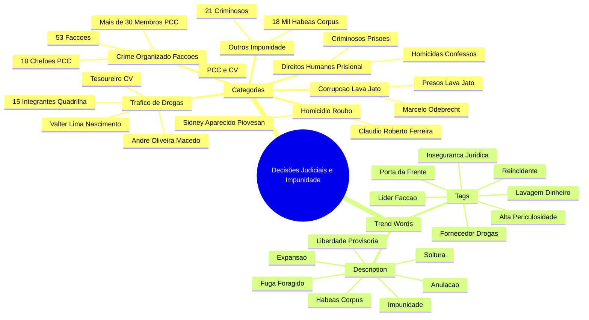

# **A Governança Criminal no Brasil: Análise do Estudo afirmando que 26% da População sob Influência de Facções**

- &nbsp;
{:toc .large-only}

### Mapa Mental 

I. Resumo Executivo  
  - 📊 26% da população brasileira percebe viver sob influência de facções criminosas, maior índice na América Latina  
  - 🔍 Governança criminal é fenômeno complexo, com coexistência tensa entre Estado e organizações criminosas  
  - ⚠️ Repressão estatal pode fortalecer o poder das facções ao invés de enfraquecê-las  

II. Conceito e Mensuração da Governança Criminal  
  - ⚖️ Governança criminal é uma autoridade paralela que regula comportamentos em territórios específicos  
  - 🤝 Estado e facções coexistem em uma "governança híbrida" com tensão e cooptação mútua  
  - 📋 Estudo dos 26% baseia-se na percepção pública sobre quem exerce o poder local, não em controle territorial objetivo  

III. O Mosaico Faccional do Brasil: Estrutura e Expansão  
  - 📍 Existência de entre 53 e 88 facções, com destaque para PCC e Comando Vermelho (CV)  
  - 🏢 PCC: organização hierárquica, empresarial, com forte controle em presídios e atuação transnacional  
  - 🌎 CV e PCC têm presença em vários estados, com destaque para São Paulo e Rio de Janeiro  

IV. Dinâmica Regional e Conflito Territorial  
  - 🔥 Expansão para Norte e Nordeste aumenta violência, especialmente no Ceará, com alta taxa de homicídios  
  - 🏙️ São Paulo (PCC) e Rio de Janeiro (milícias e CV) apresentam modelos distintos de controle territorial  
  - ⚔️ PCC busca monopólio da violência com ordem; Rio tem disputa fragmentada com milícias e traficantes  

V. Comparação dos Principais Atores Facção  
  - 🗺️ PCC: 23 estados, estrutura rígida e empresarial, forte no tráfico de cocaína  
  - 🔴 CV: 20 estados, estrutura descentralizada, foco em disputa territorial  
  - 🛡️ Milícias (RJ): controle local, participação estatal, exploração de serviços básicos  

VI. Políticas Públicas de Segurança: Diagnóstico  
  - 🌍 Raízes sociais: desigualdade e falta de oportunidades alimentam o crime organizado  
  - 🚫 Modelo de guerra às drogas é falho e fortalece facções dentro dos presídios  
  - 🏛️ Sistema prisional funciona como centro de comando das facções  

VII. Recomendações e Ações Governamentais  
  - 📑 Propostas: Lei Geral de Proteção de Dados, comitê interministerial, fortalecimento do Coaf, regulamentação de  criptoativos  
  - 💸 Contradição entre recomendações e cortes orçamentários significativos na segurança pública em 2020  
  - 📉 Programas como "CidadeSusp" têm foco em dados, mas sofrem com falta de financiamento estrutural  

VIII. Perspectiva Comparada na América Latina  
  - 🌎 Brasil lidera com 26% da população sob governança criminal percebida, enquanto média regional é 13%  
  - 🇲🇽 México tem controle territorial militarizado por cartéis, Honduras com violência extrema por gangues  
  - 🇨🇴 Colômbia apresenta modelo híbrido parecido com o Brasil, com coexistência Estado-facções  

IX. Complexidade Única do Brasil  
  - 🔄 Brasil combina sofisticação transnacional de cartéis com múltiplos grupos locais e milícias com participação estatal  
  - ⚖️ Mistura de mercado financeiro ilícito e violência territorial configura desafio singular  
  - 📈 Problema exige soluções coordenadas e multifacetadas  

X. Conclusão e Perspectivas Futuras  
  - ⚠️ 26% da população sob influência de facções indica grave crise de legitimidade do Estado  
  - 🔄 Repressão isolada não resolve; é necessário investimento em políticas sociais e combate à corrupção  
  - 🤝 Recuperar presença estatal e desarticular simbiose entre crime e política é essencial para reverter cenário  

---

### **I. Resumo Executivo**

O presente relatório técnico examina os achados de estudos recentes, com destaque para a pesquisa Latinobarómetro de 2020, que aponta que 26% da população brasileira percebe viver sob a influência de facções criminosas ou grupos armados.1 Este índice posiciona o Brasil na liderança do ranking na América Latina, superando o segundo colocado, Costa Rica, onde a percepção de controle criminal atinge 13% da população.1 A dimensão do problema e a sua particularidade no contexto regional demandam uma análise aprofundada que transcenda o dado superficial.

Este documento tem como objetivo investigar a definição de "governança criminal" utilizada pelos pesquisadores, a metodologia por trás da estimativa, a distribuição geográfica do fenômeno no Brasil, sua evolução histórica, as políticas públicas recomendadas e a posição do país em relação a nações vizinhas. A análise demonstra que a governança criminal não se manifesta como um simples vácuo de poder preenchido pelo crime, mas sim como um fenômeno complexo e multifacetado, enraizado em desigualdades sociais profundas e em uma dinâmica de coexistência tensa, e por vezes simbiótica, entre o Estado e as organizações criminosas. As evidências sugerem que a repressão estatal, ao invés de desmantelar, pode, em muitos casos, se tornar um catalisador para a consolidação e expansão do poder criminal.

### **II. O Conceito e a Mensuração da Governança Criminal**

#### **2.1. Definição Conceitual: Uma Governança Híbrida e Coexistente**

A noção de "governança criminal" é frequentemente mal interpretada, sendo reduzida a uma mera ausência do Estado. No entanto, a literatura acadêmica e as pesquisas mais recentes oferecem uma perspectiva mais sofisticada. O conceito é amplamente definido como a capacidade de organizações criminosas de "impor regras e restrições ao comportamento" dos civis.2 Essa capacidade de regulação se manifesta como uma autoridade paralela à do Estado, exercendo poder sobre o território e a população, conforme observado em estudos de caso em favelas como o Complexo da Maré, no Rio de Janeiro.4

A dinâmica fundamental desse fenômeno não reside na ausência total do Estado, mas sim em uma complexa "governança híbrida", onde o Estado e as organizações criminosas coexistem em um "modus vivendi tenso, mas estável".2 A polícia, por exemplo, pode entrar nos territórios controlados por facções, mas raramente o faz para contestar a autoridade desses grupos de forma sustentada.2 Essa coexistência é alimentada por uma interação paradoxal: a repressão legal do Estado, em vez de enfraquecer o crime, atua como "a força propulsora que estrutura os próprios espaços do crime", especialmente dentro das prisões e nos mercados ilícitos.7 A visão de que o crime prospera apenas onde o Estado é ausente ignora a negociação, a cooptação e até a simbiose entre atores estatais e criminosos que permitem essa coexistência. O problema não é a falta de presença, mas a falta de legitimidade e de um controle efetivo e permanente por parte do Estado. A atuação estatal, portanto, deve focar na desestruturação das redes de poder e corrupção que sustentam essa governança híbrida, além de restabelecer sua legitimidade perante a população, oferecendo segurança e serviços básicos que as facções não podem fornecer de forma legítima.

#### **2.2. A Metodologia do Estudo dos 26% e a Percepção Pública**

O dado de que 26% da população brasileira vive sob a influência de facções é um dos achados mais notáveis da pesquisa Latinobarómetro de 2020\.1 A metodologia utilizada para chegar a este número se baseia em um

*survey* de opinião pública, com aproximadamente 20.000 entrevistas em 18 países da América Latina.8 O dado não é uma contagem literal, mas sim uma medida da percepção popular capturada pela pergunta-chave da pesquisa: “quem é que manda aqui?”.3 As respostas, que poderiam ser "a gangue, a mara, a milícia, a facção, o coletivo ou o cartel", foram usadas para construir um modelo de regressão que avalia a "percepção de confiança política" na região.12

A importância desse resultado reside, portanto, em sua natureza subjetiva. A estimativa não mede o controle territorial objetivo do crime, mas sim a percepção do público sobre a legitimidade e a eficácia do Estado. O número de 26% é um sintoma da erosão da autoridade estatal, um indicativo de que um quarto da população sente que o poder real em seu bairro ou comunidade está nas mãos de grupos criminosos. Esta revelação é mais profunda do que um mero dado estatístico sobre o poder de fogo das facções; ela aponta para uma crise de confiança fundamental na capacidade do Estado de garantir segurança e dignidade para seus cidadãos. A pesquisa, ao invés de quantificar o crime, revela a desintegração do tecido social e a perda de confiança na instituição pública como provedora de ordem.

### **III. O Mosaico Faccional do Brasil: Estrutura e Expansão**

#### **3.1. Panorama Nacional: A Discrepância de Dados e a Hegemonia Transnacional**

O mapeamento das facções criminosas no Brasil apresenta uma notável discrepância de dados entre diferentes fontes. Enquanto um estudo indica a existência de 72 facções 13, um relatório da Secretaria Nacional de Políticas Penais (Senappen) aponta para 88 grupos 14, e um levantamento de 2021 contabiliza pelo menos 53 em atuação.16 Esta variação reflete a natureza fluida e a complexidade do crime organizado, bem como as distintas metodologias de mapeamento. No entanto, há um consenso sobre a hegemonia e o alcance das duas maiores facções do país: o Primeiro Comando da Capital (PCC) e o Comando Vermelho (CV).13 O PCC opera em 23 estados, enquanto o CV está presente em 20, com ambos os grupos possuindo tentáculos transnacionais.13

A estrutura do PCC, em particular, é notável. Fundado em 1993, dentro de um presídio em São Paulo, o grupo se expandiu para atuar como uma "mão invisível" no mercado do crime, regulando conflitos e impondo um "código de ética" conhecido como "proceder".17 Com cerca de 35 mil membros em todo o país, dos quais 8 mil estão apenas em São Paulo, o PCC é uma organização rigidamente hierárquica e financeira, financiada principalmente pelo tráfico de drogas.17 A capacidade de atuação da facção se estende por mais de 90% dos presídios paulistas, e sua renda anual é estimada em centenas de milhões de reais.18

#### **3.2. A Dinâmica Regional e o Conflito Territorial**

##### **3.2.1. A Expansão para o Nordeste e o Aumento da Violência**

A expansão do PCC e do CV para as regiões Norte e Nordeste é apontada como a principal causa do aumento das taxas de homicídio nesses locais, que agora lideram o ranking de violência do país.13 Esse movimento não é um fenômeno isolado, mas sim parte de um processo de "faccionalização" do crime no Brasil.20 As redes faccionais transformaram a pequena criminalidade local, forçando grupos estabelecidos nos mercados ilegais a se filiarem ou a entrarem em confronto direto para resistir às investidas das grandes organizações.20

O caso do Ceará é um exemplo contundente dessa dinâmica. Após o rompimento da aliança entre PCC e CV, o estado presenciou um aumento significativo de homicídios dolosos, com a taxa de Fortaleza atingindo 87,9 por 100 mil habitantes em 2017\.21 A violência, neste contexto, deixou de ser um mero reflexo do desvio social para se tornar uma ferramenta de mercado, uma manifestação da disputa por rotas de tráfico e controle territorial. O problema do crime no Brasil, portanto, tornou-se intrinsecamente ligado à geopolítica do crime organizado, com suas próprias regras, hierarquias e lógicas de poder que se sobrepõem à autoridade estatal.

##### **3.2.2. O Cenário de São Paulo e Rio de Janeiro: Modelos de Controle Distintos**

A análise da governança criminal em São Paulo e no Rio de Janeiro revela dois modelos distintos de controle. Em São Paulo, o PCC exerce uma hegemonia incontestável, com um controle rígido que se estende para 123 cidades do estado.22 Sua estratégia de poder é monopolística e empresarial, visando minimizar conflitos internos para maximizar o lucro, atuando como um "regulador" que impõe ordem e "justiça" local.17

Já o Rio de Janeiro apresenta um cenário de disputa territorial constante e fragmentada. Uma pesquisa indica que as milícias controlam 57,5% do território da capital, superando o domínio do tráfico de drogas, que atinge 15,4%.23 A dinâmica de conflito é complexa e envolve milícias, o Comando Vermelho (CV) e outras facções, com o CV sendo o grupo que mais conquistou territórios das milícias nos últimos sete anos.24 Enquanto o PCC de São Paulo busca o "monopólio da violência", minimizando o conflito aberto, as milícias no Rio, que agem como máfias urbanas em simbiose com atores estatais, competem por território e serviços, gerando um ambiente de maior instabilidade e conflito contínuo.24 Essa diferença nos modelos de governança explica as distintas manifestações de violência e consolidação do poder criminal em cada estado.

A seguir, a Tabela 1 apresenta um panorama comparativo dos principais atores faccionais no Brasil.

| Fatores de Comparação | Primeiro Comando da Capital (PCC) | Comando Vermelho (CV) | Milícias (RJ) |
| :---- | :---- | :---- | :---- |
| **Alcance Geográfico** | 23 estados do Brasil, transnacional | 20 estados do Brasil, transnacional | Principalmente no Rio de Janeiro |
| **Origem e Estrutura** | Surgiu em presídio de São Paulo em 1993; estrutura rígida, empresarial e hierárquica | Mais antiga facção do país; estrutura mais descentralizada | Grupos paramilitares, muitas vezes com participação de agentes do Estado |
| **Modelo de Governança** | Monopolístico, regula mercados e impõe "proceder" para manter a ordem e maximizar lucros | Modelo mais competitivo, focado em disputa territorial e rotas de tráfico | Controle territorial e exploração de serviços básicos (gás, internet, transporte) 23 |
| **Fontes de Renda** | Principalmente tráfico de cocaína, roubos e extorsões 17 | Tráfico de drogas, roubos e alianças estratégicas 26 | Extorsão, roubo de propriedade, grilagem de terras, monopólio de serviços 23 |

### **IV. Políticas Públicas de Segurança: Diagnóstico e Recomendações**

#### **4.1. Raízes Estruturais e a Falência de Modelos Anteriores**

A ascensão da governança criminal no Brasil está intimamente ligada a fatores estruturais e à falência de modelos de segurança pública. O cenário de desigualdade social, a pobreza e a falta de oportunidades são apontados como elementos determinantes para o aumento da criminalidade.27 O crime organizado, ao prometer uma "vida fácil e farta", preenche um vácuo social em um país onde os direitos básicos são "vergonhosamente violados".21

O modelo de "guerra às drogas" tem sido consistentemente criticado como uma política falida globalmente.29 A ênfase na repressão e no encarceramento em massa não apenas falha em reduzir a demanda por substâncias proibidas, mas também fortalece as organizações criminosas dentro das prisões. O sistema penitenciário brasileiro se tornou o principal "quartel-general" das facções, servindo como ambiente ideal para recrutamento, comando de operações e consolidação de poder.30 As prisões, em vez de ressocializar, funcionam como "universidades do crime", consolidando um ciclo vicioso onde a falência do Estado social empurra a população para a criminalidade, e a resposta repressiva do Estado fortalece a própria governança criminal que se pretende combater.

#### **4.2. Recomendações e Ações Governamentais: Uma Análise Crítica**

Diante do diagnóstico complexo, o estudo sobre segurança pública e crime organizado no Brasil sugere políticas que vão além da repressão tradicional.13 Entre as recomendações estão a aprovação de uma Lei Geral de Proteção de Dados para a Segurança Pública, a criação de um comitê interministerial para a pauta, o fortalecimento do Conselho de Controle de Atividades Financeiras (Coaf), e a regulamentação de criptoativos e apostas online para minar as fontes de faturamento das facções.13 Essas propostas reconhecem a natureza financeira e transnacional do crime.

Em resposta a esse desafio, o governo tem implementado programas como o "CidadeSusp", que busca usar dados criminais e sociais para elaborar planos municipais de segurança pública e defesa social, tentando uma abordagem mais integrada.33 No entanto, a análise orçamentária revela uma contradição. O Ministério da Justiça e Segurança Pública sofreu cortes significativos em 2020, que atingiram a Polícia Federal, o Fundo Penitenciário Nacional e o Fundo Nacional de Segurança Pública.34 Embora o discurso político enfatize a "luta contra o crime", a realidade orçamentária indica uma despriorização de políticas estruturais de longo prazo, em favor de ações que geram visibilidade, mas que, no longo prazo, não desarticulam o poder das facções.

A Tabela 2 ilustra a desconexão entre as recomendações de especialistas e as ações efetivas do governo em 2020\.

| Recomendação de Estudo | Ação Governamental (2020) | Fonte |
| :---- | :---- | :---- |
| Fortalecimento do Coaf e regulamentação de criptoativos | Cortes de mais de R$ 2,29 bilhões na Polícia Federal, R$ 45,2 milhões no Fundo Penitenciário Nacional, e R$ 234 milhões no Fundo Nacional de Segurança Pública 34 | 13 |
| Criação de um comitê interministerial | Ausência de medidas para combater o subfinanciamento; foco em programas de visibilidade como o "CidadeSusp", que dependem de dados para serem eficazes 33 | 13 |
| Combate ao crime organizado financeiro | Alocação de crédito suplementar para outras áreas, como seguro-desemprego, em decorrência da pandemia, o que limitou o espaço fiscal para segurança pública 35 | 13 |

### **V. Perspectiva Comparada: O Brasil na América Latina**

#### **5.1. O Brasil como Líder no Ranking de Governança Criminal**

A pesquisa Latinobarómetro de 2020 destaca o Brasil como o país com a maior proporção de sua população (26%) que percebe viver sob a influência de grupos criminosos.1 Este dado é particularmente alarmante quando comparado a outros países da América Latina, onde a média regional de governança criminal percebida é de 13%.3 A Costa Rica, que ocupa o segundo lugar, registra a mesma porcentagem que a média regional, 13%.1 Essa diferença substancial demonstra a gravidade e a especificidade do problema brasileiro em relação à sua região.

A Tabela 3 apresenta um comparativo direto do ranking de governança criminal percebida.

| País | Percentual da População sob Governança Criminal (Percebida) | Posição no Ranking |
| :---- | :---- | :---- |
| Brasil | 26% | 1ª |
| Costa Rica | 13% | 2ª (ao lado de outros países) |
| Média Regional | 13% | \- |

#### **5.2. A Natureza Distinta do Problema em Outros Países**

A liderança do Brasil no ranking se explica pela natureza particular e multifacetada do seu crime organizado, que combina elementos de diferentes modelos criminais da América Latina. O caso do México, por exemplo, é caracterizado por um controle territorial massivo e militarizado por parte de cartéis como o Jalisco Nova Geração (CJNG) e o de Sinaloa, que assediam 81% do território do país.36 A violência lá é uma ferramenta primária na disputa por poder. Em Honduras, a violência é exacerbada pela presença de "maras" e outras gangues, com o país sendo um dos mais violentos do mundo.37 Por outro lado, a Colômbia apresenta um modelo de "governança híbrida", onde organizações criminosas e o Estado coexistem de forma a complementar suas ações, como observado durante a pandemia de COVID-19, quando grupos criminosos assumiram funções estatais, como a imposição de regras sanitárias.6

O Brasil não é uma simples cópia de nenhum desses modelos, mas sim uma síntese. Possui facções com a sofisticação e o alcance transnacional dos cartéis mexicanos (PCC, CV), mas também uma proliferação de grupos locais (cujo número exato é incerto) que exercem controle territorial mais semelhante ao das gangues centro-americanas. Adicionalmente, a dinâmica de coexistência com agentes estatais, como demonstrado pelo poder das milícias no Rio de Janeiro, aproxima o cenário brasileiro do modelo de governança híbrida da Colômbia. Essa complexidade única, que mistura a lógica do mercado financeiro e a violência territorial, torna o problema da governança criminal no Brasil particularmente desafiador e explica sua posição no topo da pesquisa.

### **VI. Conclusão e Perspectivas Futuras**

A análise detalhada do estudo sobre governança criminal no Brasil revela um panorama complexo e multifacetado, que vai além da simples constatação de um vácuo de poder. A percepção de que 26% da população vive sob a influência de facções é um sintoma alarmante da perda de legitimidade do Estado, que não consegue mais ser percebido como a única fonte de autoridade e segurança.

A resposta a esse desafio não pode se limitar a políticas de repressão pontuais. As evidências demonstram que a política de "guerra às drogas" e o subfinanciamento do sistema de segurança pública apenas fortalecem as organizações criminosas, transformando as prisões em seus quartéis-generais. A expansão das facções para as diversas regiões do país, especialmente para o Nordeste, reconfigurou a violência de um fenômeno de delinquência comum para uma disputa estratégica por mercados e territórios.

Para reverter este quadro, é imperativo que o Estado brasileiro adote uma abordagem mais sofisticada e coordenada. As recomendações do estudo, focadas em inteligência financeira, regulamentação de criptoativos e o fortalecimento de mecanismos de controle, são cruciais. No entanto, é fundamental que essas medidas sejam acompanhadas de um compromisso orçamentário e político que transcenda o discurso e se concretize em ações efetivas de longo prazo. O combate à governança criminal exige não apenas o uso da força, mas também a recuperação da presença estatal nas áreas sociais, abordando as raízes da desigualdade e da falta de oportunidades que alimentam o recrutamento e o poder das facções. Sem um esforço para restaurar a legitimidade do Estado e desarticular a simbiose entre o crime e a política, o problema da governança criminal no Brasil tende a se aprofundar.

#### **Referências citadas**

1. Brasil registra 26% da população sob domínio de facções criminosas na América Latina, acessado em agosto 22, 2025, [https://www.portaltela.com/noticias/politica/2025/08/22/brasil-registra-26-da-populacao-sob-dominio-de-faccoes-criminosas-na-america-latina](https://www.portaltela.com/noticias/politica/2025/08/22/brasil-registra-26-da-populacao-sob-dominio-de-faccoes-criminosas-na-america-latina)  
2. Governança criminal na América Latina em perspectiva comparada: Apresentação à edição especial \- Redalyc, acessado em agosto 22, 2025, [https://www.redalyc.org/journal/5638/563872581001/html/](https://www.redalyc.org/journal/5638/563872581001/html/)  
3. Apresentação à edição especial Governança criminal na América Latina em perspectiva comparada \- SciELO, acessado em agosto 22, 2025, [https://www.scielo.br/j/dilemas/a/Q4YkhN9xPyMCZmp7RJ3k9cb/](https://www.scielo.br/j/dilemas/a/Q4YkhN9xPyMCZmp7RJ3k9cb/)  
4. Tipos de governança criminal: Estudo comparativo a partir dos ..., acessado em agosto 22, 2025, [https://www.scienceopen.com/document?vid=e7ca2da8-6c52-4ef0-918b-2b53ca7fff0f](https://www.scienceopen.com/document?vid=e7ca2da8-6c52-4ef0-918b-2b53ca7fff0f)  
5. Tipos de governança criminal: Estudo comparativo a partir dos casos da Maré \- Redalyc, acessado em agosto 22, 2025, [https://www.redalyc.org/journal/5638/563872581011/html/](https://www.redalyc.org/journal/5638/563872581011/html/)  
6. Organizações Criminosas e Governança Híbrida na América do Sul: O contexto da COVID-19 \- SciELO, acessado em agosto 22, 2025, [https://www.scielo.sa.cr/pdf/ri/v95n2/2215-4582-ri-95-02-106.pdf](https://www.scielo.sa.cr/pdf/ri/v95n2/2215-4582-ri-95-02-106.pdf)  
7. SciELO Brasil \- Pandemia, governança criminal e mecanismos de ..., acessado em agosto 22, 2025, [https://www.scielo.br/j/dilemas/a/77jyq7NdvQm6fyDDCkVdgpB/](https://www.scielo.br/j/dilemas/a/77jyq7NdvQm6fyDDCkVdgpB/)  
8. As covariantes da confiança política na América Latina \- SciELO, acessado em agosto 22, 2025, [https://www.scielo.br/j/op/a/TXGfR7Z8fdz6K8kYwtw6Fjw/?lang=pt](https://www.scielo.br/j/op/a/TXGfR7Z8fdz6K8kYwtw6Fjw/?lang=pt)  
9. Percepções públicas da política e suas implicações para as respostas à COVID-19 na América Latina e no Caribe | United Nations Development Programme, acessado em agosto 22, 2025, [https://www.undp.org/pt/brazil/news/percepcoes-publicas-da-politica-e-suas-implicacoes-para-respostas-covid-19-na-america-latina-e-no-caribe](https://www.undp.org/pt/brazil/news/percepcoes-publicas-da-politica-e-suas-implicacoes-para-respostas-covid-19-na-america-latina-e-no-caribe)  
10. (PDF) Governança Criminal na América Latina em Perspectiva, acessado em agosto 22, 2025, [https://www.researchgate.net/publication/363000225\_Governanca\_Criminal\_na\_America\_Latina\_em\_Perspectiva\_Comparada\_Apresentacao\_a\_edicao\_especial](https://www.researchgate.net/publication/363000225_Governanca_Criminal_na_America_Latina_em_Perspectiva_Comparada_Apresentacao_a_edicao_especial)  
11. Governança criminal na América Latina em perspectiva comparada: Apresentação à edição especial \- Visor Redalyc, acessado em agosto 22, 2025, [https://www.redalyc.org/journal/5638/563872581001/](https://www.redalyc.org/journal/5638/563872581001/)  
12. UNIVERSIDADE FEDERAL DE PERNAMBUCO CENTRO DE FILOSOFIA E CIÊNCIAS HUMANAS DEPARTAMENTO DE CIÊNCIA POLÍTICA AYLA REIS DE LIMA \- RI UFPE, acessado em agosto 22, 2025, [https://repositorio.ufpe.br/bitstream/123456789/51255/1/TCC%20Ayla%20Reis%20de%20Lima.pdf](https://repositorio.ufpe.br/bitstream/123456789/51255/1/TCC%20Ayla%20Reis%20de%20Lima.pdf)  
13. Facções criminosas brasileiras faturam até R$ 335 bilhões com cocaína, revela estudo, acessado em agosto 22, 2025, [https://revistaoeste.com/brasil/faccoes-criminosas-brasileiras-faturam-ate-r-335-bilhoes-com-cocaina-revela-estudo/](https://revistaoeste.com/brasil/faccoes-criminosas-brasileiras-faturam-ate-r-335-bilhoes-com-cocaina-revela-estudo/)  
14. Brasil tem 88 facções criminosas em atividade, diz governo \- Revista Oeste, acessado em agosto 22, 2025, [https://revistaoeste.com/brasil/brasil-tem-88-faccoes-criminosas-em-atividade-diz-governo/](https://revistaoeste.com/brasil/brasil-tem-88-faccoes-criminosas-em-atividade-diz-governo/)  
15. Governo identifica 88 organizações criminosas atuantes no Brasil, acessado em agosto 22, 2025, [https://www.cnnbrasil.com.br/nacional/centro-oeste/df/governo-identifica-88-organizacoes-criminosas-atuantes-no-brasil/](https://www.cnnbrasil.com.br/nacional/centro-oeste/df/governo-identifica-88-organizacoes-criminosas-atuantes-no-brasil/)  
16. As 53 facções criminosas brasileiras \- Fonte Segura, acessado em agosto 22, 2025, [https://fontesegura.forumseguranca.org.br/as-53-faccoes-criminosas-brasileiras/](https://fontesegura.forumseguranca.org.br/as-53-faccoes-criminosas-brasileiras/)  
17. PCC – Primeiro Comando da Capital: o que é \- Brasil Escola, acessado em agosto 22, 2025, [https://brasilescola.uol.com.br/sociologia/pcc-primeiro-comando-da-capital.htm](https://brasilescola.uol.com.br/sociologia/pcc-primeiro-comando-da-capital.htm)  
18. Primeiro Comando da Capital – Wikipédia, a enciclopédia livre, acessado em agosto 22, 2025, [https://pt.wikipedia.org/wiki/Primeiro\_Comando\_da\_Capital](https://pt.wikipedia.org/wiki/Primeiro_Comando_da_Capital)  
19. Facções colocam três estados do Nordeste no topo do ranking de homicídios \- VEJA, acessado em agosto 22, 2025, [https://veja.abril.com.br/brasil/faccoes-colocam-tres-estados-do-nordeste-no-topo-do-ranking-de-homicidios/](https://veja.abril.com.br/brasil/faccoes-colocam-tres-estados-do-nordeste-no-topo-do-ranking-de-homicidios/)  
20. EXPANSÃO DAS FACÇÕES, MUTAÇÃO DOS MERCADOS ILEGAIS APRESENTAÇÃO, acessado em agosto 22, 2025, [https://www.scielo.br/j/nec/a/XV3MYGkK4CySbDtfxpZkKNk/?lang=pt](https://www.scielo.br/j/nec/a/XV3MYGkK4CySbDtfxpZkKNk/?lang=pt)  
21. Entrevista Nota 10: Juliana Mamede e o efeito das facções criminosas na crise de segurança pública \- UNIFOR, acessado em agosto 22, 2025, [https://unifor.br/-/entrevista-nota-10-juliana-mamede-e-o-efeito-das-faccoes-criminosas-na-crise-de-seguranca-publica](https://unifor.br/-/entrevista-nota-10-juliana-mamede-e-o-efeito-das-faccoes-criminosas-na-crise-de-seguranca-publica)  
22. PCC atua em 123 cidades paulistas \- Instituto Humanitas Unisinos \- IHU, acessado em agosto 22, 2025, [https://www.ihu.unisinos.br/categorias/172-noticias-2012/514138-pcc-atua-em-123-cidades-paulistas](https://www.ihu.unisinos.br/categorias/172-noticias-2012/514138-pcc-atua-em-123-cidades-paulistas)  
23. Milícias controlam 57% do território da cidade do Rio de Janeiro, diz pesquisa \- CNN Brasil, acessado em agosto 22, 2025, [https://www.cnnbrasil.com.br/nacional/milicias-controlam-57-do-territorio-da-cidade-do-rio-de-janeiro-diz-pesquisa/](https://www.cnnbrasil.com.br/nacional/milicias-controlam-57-do-territorio-da-cidade-do-rio-de-janeiro-diz-pesquisa/)  
24. Comando Vermelho é o grupo armado que mais conquistou territórios no RJ, diz instituto, acessado em agosto 22, 2025, [https://www.cnnbrasil.com.br/nacional/comando-vermelho-e-o-grupo-armado-que-mais-conquistou-territorios-no-rj-diz-instituto/](https://www.cnnbrasil.com.br/nacional/comando-vermelho-e-o-grupo-armado-que-mais-conquistou-territorios-no-rj-diz-instituto/)  
25. MILÍCIAS E GOVERNANÇA URBANA NO RIO DE JANEIRO, acessado em agosto 22, 2025, [https://globalinitiative.net/wp-content/uploads/2024/01/Nicholas-Pope-e-Antonio-Sampaio-Mediac%CC%A7a%CC%83o-e-coerc%CC%A7a%CC%83o-Mili%CC%81cias-e-governanc%CC%A7a-urbana-no-Rio-de-Janeiro-GI-TOC-Janeiro-de-2024.pdf](https://globalinitiative.net/wp-content/uploads/2024/01/Nicholas-Pope-e-Antonio-Sampaio-Mediac%CC%A7a%CC%83o-e-coerc%CC%A7a%CC%83o-Mili%CC%81cias-e-governanc%CC%A7a-urbana-no-Rio-de-Janeiro-GI-TOC-Janeiro-de-2024.pdf)  
26. Comando Vermelho – Wikipédia, a enciclopédia livre, acessado em agosto 22, 2025, [https://pt.wikipedia.org/wiki/Comando\_Vermelho](https://pt.wikipedia.org/wiki/Comando_Vermelho)  
27. RAÍZES HISTÓRICAS DA CRIMINALIDADE NO BRASIL: DESIGUALDADE, VIOLÊNCIA E IDENTIDADE \- Revista Tópicos, acessado em agosto 22, 2025, [https://revistatopicos.com.br/artigos/raizes-historicas-da-criminalidade-no-brasil-desigualdade-violencia-e-identidade](https://revistatopicos.com.br/artigos/raizes-historicas-da-criminalidade-no-brasil-desigualdade-violencia-e-identidade)  
28. o crescimento das facções criminosas e o aumento da violência na região norte do brasil, acessado em agosto 22, 2025, [https://www.unitins.br/RepositorioDigital/Publico/Home/VisualizarArquivo/157](https://www.unitins.br/RepositorioDigital/Publico/Home/VisualizarArquivo/157)  
29. Disseminação de facções tem impacto profundo na violência geral, diz pesquisadora, acessado em agosto 22, 2025, [https://apublica.org/2018/02/disseminacao-de-faccoes-tem-impacto-profundo-na-violencia-geral-diz-pesquisadora/](https://apublica.org/2018/02/disseminacao-de-faccoes-tem-impacto-profundo-na-violencia-geral-diz-pesquisadora/)  
30. Conflito entre facções criminosas brasileiras entre 2016 e 2020 \- Wikipédia, acessado em agosto 22, 2025, [https://pt.wikipedia.org/wiki/Conflito\_entre\_fac%C3%A7%C3%B5es\_criminosas\_brasileiras\_entre\_2016\_e\_2020](https://pt.wikipedia.org/wiki/Conflito_entre_fac%C3%A7%C3%B5es_criminosas_brasileiras_entre_2016_e_2020)  
31. O DOMÍNIO DAS FACÇÕES CRIMINOSAS NOS PRESÍDIOS BRASILEIROS E O CASO DA CHACINA DE ALTAMIRA/PA COMO REFLEXO DESSA REALIDADE \- OJS CNMP, acessado em agosto 22, 2025, [https://ojs.cnmp.mp.br/index.php/revistacsp/article/download/211/184/609](https://ojs.cnmp.mp.br/index.php/revistacsp/article/download/211/184/609)  
32. O domínio das facções nos presídios brasileiros: desafios e perspectivas para a segurança pública The dominance of gangs i \- Dialnet, acessado em agosto 22, 2025, [https://dialnet.unirioja.es/descarga/articulo/10089006.pdf](https://dialnet.unirioja.es/descarga/articulo/10089006.pdf)  
33. Políticas públicas de combate a criminalidade: 20 municípios aderem ao programa CidadeSusp \- Portal Gov.br, acessado em agosto 22, 2025, [https://www.gov.br/mj/pt-br/assuntos/noticias/politicas-publicas-de-combate-a-criminalidade-20-municipios-aderem-ao-programa-cidadesusp](https://www.gov.br/mj/pt-br/assuntos/noticias/politicas-publicas-de-combate-a-criminalidade-20-municipios-aderem-ao-programa-cidadesusp)  
34. Orçamento 2020: corte de R$ 3,8 bilhões no Ministério de Moro \- Jornalistas Livres, acessado em agosto 22, 2025, [https://jornalistaslivres.org/orcamento-2020-corte-de-r-38-bilhoes-no-ministerio-de-moro/](https://jornalistaslivres.org/orcamento-2020-corte-de-r-38-bilhoes-no-ministerio-de-moro/)  
35. Proposta altera Orçamento de 2020 para cobrir gasto extra de R$ 3,8 bi no seguro-desemprego \- Notícias \- Câmara dos Deputados, acessado em agosto 22, 2025, [https://www.camara.leg.br/noticias/700485-proposta-altera-orcamento-de-2020-para-cobrir-gasto-extra-de-r-38-bi-no-seguro-desemprego/](https://www.camara.leg.br/noticias/700485-proposta-altera-orcamento-de-2020-para-cobrir-gasto-extra-de-r-38-bi-no-seguro-desemprego/)  
36. Narcomapa 2024: qué cárteles tienen mayor presencia en México \- Infobae, acessado em agosto 22, 2025, [https://www.infobae.com/mexico/2024/04/23/narcomapa-2024-que-carteles-tienen-mayor-presencia-en-mexico/](https://www.infobae.com/mexico/2024/04/23/narcomapa-2024-que-carteles-tienen-mayor-presencia-en-mexico/)  
37. World Report 2024: Honduras | Human Rights Watch, acessado em agosto 22, 2025, [https://www.hrw.org/world-report/2024/country-chapters/honduras](https://www.hrw.org/world-report/2024/country-chapters/honduras)  
38. IACHR Releases Report on the Situation of Human Rights in Honduras, acessado em agosto 22, 2025, [https://www.oas.org/en/iachr/jsForm/?File=/en/iachr/media\_center/preleases/2024/101.asp](https://www.oas.org/en/iachr/jsForm/?File=/en/iachr/media_center/preleases/2024/101.asp)
