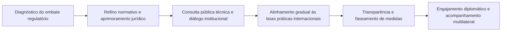
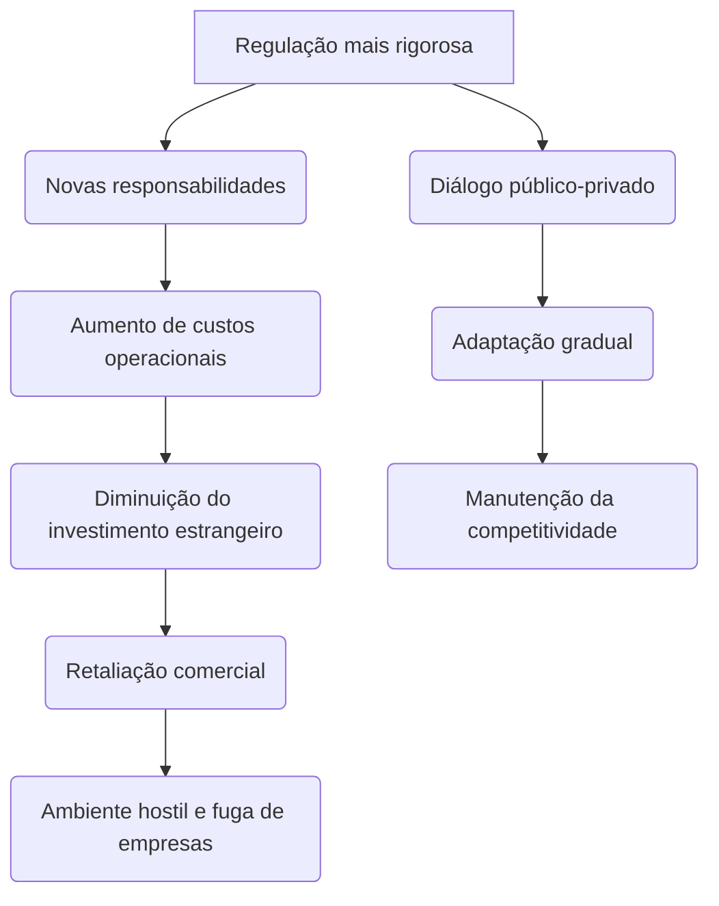
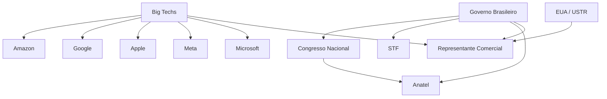

- &nbsp;
{:toc .large-only}

# 🇧🇷💻 Brasil, Big Techs e Seção 301: Desafios Regulatórios do Ambiente Digital

***

## 🧭 Resumo 

O avanço da regulação digital brasileira, notadamente após decisões do STF e novas normas da Anatel, gerou forte reação de grandes plataformas digitais dos EUA, que solicitaram ao USTR investigação sob a [Seção 301](/posts/crise-brasil-eua-inq-4781-vaza-toga-e-sancoes/#-o-que-é-a-seção-301) por barreiras e hostilidade ao setor tech. Com risco real de retaliações às exportações brasileiras e aumento da insegurança jurídica, destacam-se a importância de diálogo multilateral, revisão normativa e aproximação regulatória internacional para evitar danos econômicos e manter o acesso do país à inovação e investimento estrangeiro.

***

## ⚠️ Classificação de Segurança & Palavras-chave

- **Risco digital**
- **Risco comercial**
- **Conflito jurídico**
- **Ameaça à inovação**
- **Risco diplomático**

**Palavras-chave:**  
  - Soberania
  - Big Techs
  - [Seção 301](/posts/crise-brasil-eua-inq-4781-vaza-toga-e-sancoes/#-o-que-é-a-seção-301)
  - Responsabilidade civil
  - Tributação digital
  - Marco Civil
  - Ambientes hostis
  - Compliance
  - Investimento estrangeiro
  - Liberdade de expressão

***

## 🏁 Introdução

O Brasil é alvo de pressão internacional após gigantes digitais, alegando ambiente regulatório hostil, pedirem investigação comercial ao USTR via [Seção 301](/posts/crise-brasil-eua-inq-4781-vaza-toga-e-sancoes/#-o-que-é-a-seção-301). A crescente responsabilização de plataformas, a transferência de obrigações por agências reguladoras e planos tributários intensificam o debate sobre soberania digital, inovação e segurança jurídica, em meio a risco concreto de um conflito comercial com Washington.

***

## 📰 Diagnóstico: Linhas Fatuais do Embate

- 📢 Grandes plataformas (Amazon, Google, Apple, Meta etc.) denunciaram ao USTR práticas brasileiras que ampliam obrigações e custos, incluindo decisões do STF sobre conteúdo, normas restritivas da Anatel e planos de tributação digital.[^1][^2][^3][^4]
- 🏛️ O STF mudou o Marco Civil da Internet (art. 19), permitindo responsabilização extrajudicial das plataformas, aumentando o risco de sanções e ampliações de compliance.[^5][^6]
- 🏪 A Anatel exige que marketplaces fiscalizem rigorosamente produtos de terceiros, sob risco de multas e bloqueios.[^7][^8]
- 💸 Em andamento, projetos do Executivo e Legislativo ampliam a carga tributária digital e tensionam o ambiente de inovação nacional.[^3][^9]
- 🇺🇸 O processo da [Seção 301](/posts/crise-brasil-eua-inq-4781-vaza-toga-e-sancoes/#-o-que-é-a-seção-301) pode escalar para sanções tarifárias, incertezas institucionais e restrições à competitividade global do Brasil.[^2][^10]

***

## 📊 Achados e Dados

| Tema            | Detalhes-chave                                                                     | Referências      |
|-----------------|------------------------------------------------------------------------------------|------------------|
| STF x Art. 19   | Decisão facilitou a responsabilização civil extrajudicial de plataformas           | [^5][^6]           |
| Anatel & Market | Regras transformam marketplaces em corresponsáveis, exigindo compliance reforçado   | [^7][^8]          |
| Tributação      | Proposta de Contribuição Social Digital pode asfixiar modelos baseados em ads       | [^9][^3]          |
| Big Tech x USTR | Documento formal denuncia ambiente hostil e pede investigação imediata              | [^3][^4]         |
| Recepção global | Estratégias na UE, Reino Unido e Canadá mostram ênfase no diálogo e adaptação       | [^11][^12][^13]       |

***

## 📝 Análise de Causas

- Impulso pela soberania digital, proteção de dados e combate à desinformação.
- Insuficiência de canais para consulta pública e diálogo estável com agentes disruptivos.
- Divergências entre as expectativas de uniformização jurídica e inovação das big techs e o papel do Estado neste ambiente.
- Resistência do ambiente internacional – via [Seção 301](/posts/crise-brasil-eua-inq-4781-vaza-toga-e-sancoes/#-o-que-é-a-seção-301) – à ruptura de modelos de autorregulação e isenções relacionadas.

***

## 🎯 Análise de Riscos

- **Econômico-comercial:** Possibilidade de tarifas punitivas sobre exportações brasileiras aos EUA, impacto relevante no agronegócio e manufatura.[^10][^14][^2]
- **Jurídico:** Elevação da litigiosidade e insegurança institucional, retraindo investimentos estrangeiros.[^9][^3]
- **Tecnológico:** Retirada/limitação de serviços digitais e diminuição da atratividade do ecossistema brasileiro.
- **Político/diplomático:** Precedente de isolamento normativo em fóruns econômicos globais.

***

## 🔍 Análise Quali-Quantitativa & Exemplos Globais

### 🌍 Casos de Sucesso Globais

| Jurisdição         | Estratégia Central                                                         | Referência    |
|--------------------|---------------------------------------------------------------------------|---------------|
| União Europeia     | Negociação faseada, transparência, adaptação e diálogo direto              | [^12][^13]       |
| Reino Unido        | "Soft landing" regulatório, priorização e consulta pública ampliada         | [^11]           |
| EUA (Califórnia)   | Distinção entre proteção ao consumidor e fomento à inovação                | [^11]           |
| Austrália          | Mediação obrigatória para remuneração de conteúdos jornalísticos            | Relatório     |
| Canadá             | Ajuste regulatório escalonado e participação pró-ativa de stakeholders      | Relatório     |

***

## 🛠️ Plano de Ação – Caminhos para Solução

## 📑 Impacto das Mudanças Regulatórias Digitais Brasileiras e Repercussão Internacional

***

### 🔍 Quais pontos específicos do Marco Civil motivaram a crítica das big techs ao USTR

- As big techs criticaram principalmente a mudança no **Artigo 19 do Marco Civil da Internet**, que antes estabelecia que as plataformas só poderiam ser responsabilizadas por danos causados por conteúdo de terceiros com ordem judicial para remoção e descumprimento pela empresa.  
- A decisão do STF considerou o artigo parcialmente inconstitucional para plataformas abertas, permitindo responsabilização sem ordem judicial e ampliando obrigações de remoção e monitoramento, aproximando o Brasil de regimes de responsabilidade mais rígidos.  
- Além disso, houve críticas quanto à ampliação do dever de diligência e instrumentos de presunção de responsabilidade nos casos de conteúdo impulsionado por pagamento ou disseminados artificialmente, o que gera insegurança jurídica por tornar a responsabilização mais ampla e subjetiva.[1]

***

### ⚖️ Como a decisão do STF sobre o Art. 19 altera a responsabilidade prática das plataformas

- A decisão do STF restringiu a proteção antes concedida: plataformas de redes sociais, fóruns públicos e mecanismos de busca **podem ser responsabilizadas mesmo sem decisão judicial**, desde que haja omissão comprovada na remoção de conteúdo ilícito notificado extrajudicialmente.  
- Introduziu hipóteses de **presunção de responsabilidade**, especialmente para:
  - Conteúdos impulsionados por pagamento;
  - Conteúdos disseminados artificialmente (robôs/bots);
- As plataformas agora precisam adotar mecanismos proativos de monitoramento e resposta rápida, sob risco de responsabilização solidária e multas.  
- Houve ainda obrigação de manutenção de representação legal com poderes amplos no Brasil, facilitando ação judicial e administrativa das autoridades nacionais contra gigantes globais.[1]

***

### 🏪 Que medidas da Anatel geram risco de responsabilização por anúncios de terceiros

- A Anatel passou a exigir que **marketplaces (ex: Amazon, Shopee, Mercado Livre)** operem com maior compliance sobre produtos e anúncios de terceiros em suas plataformas.
- As plataformas podem ser responsabilizadas e até alvo de sanções administrativas caso permitam a venda de produtos ilícitos (ex: celulares sem homologação, medicamentos sem registro) por meio de seus serviços.[^12]
- Isso obriga plataformas a implementar sistemas de fiscalização, controle prévio e mecanismos permanentes de denúncia e resposta para evitar responsabilidade solidária.
- A supervisão passa a ser direta pelo órgão regulador, ampliando o risco e criando exigências pesadas de compliance digital.[^12]

***

### 💣 Quais cenários de retaliação via Seção 301 podem afetar exportações brasileiras

- Caso os EUA concluam pela procedência da denúncia das big techs sob a [Seção 301](/posts/crise-brasil-eua-inq-4781-vaza-toga-e-sancoes/#-o-que-é-a-seção-301), os cenários de retaliação mais prováveis incluem:
  - **Imposição de tarifas adicionais (sanções) sobre produtos brasileiros** exportados aos EUA, afetando desde commodities a manufaturados com grande valor agregado;
  - **Restrições à importação de bens específicos** ou bloqueio temporário de acordos setoriais, impactando setores como aço, alumínio, carne, café, etanol e até manufaturados têxteis;[^13][^14]
  - Pressão para mudança legislativa, inclusive condicionando acordos bilaterais de livre comércio ou preferências tarifárias à reversão de dispositivos legais considerados restritivos.[^13]
- Já houve precedentes globais envolvendo China, UE, Índia e Indonésia, especialmente em áreas digitais, de propriedade intelectual ou serviços financeiros.[^14][^13]

***

### 🌍 Que estratégias outras jurisdições usaram para evitar sanções comerciais dos EUA

- **Diálogo regulatório e adaptação gradual:** Europa e Reino Unido negociaram cronogramas mais flexíveis de implementação de novas regras para possibilitar adaptação do setor privado e evitar disputas formais.[^15][^16][^17]
- **Negociação multilateral**: Realização de consultas na OMC (Organização Mundial do Comércio), levando divergências para fóruns multilaterais antes da escalada da disputa.
- **Transparência e consulta pública:** Consulta ampliada ao setor privado internacional e ajustes nas normas com base em feedback de empresas afetadas, reduzindo repercussão negativa.
- **Faseamento e mitigação de riscos:** Implementação parcial ou por etapas das novas obrigações, priorizando setores e temas mais sensíveis para ofertar previsibilidade ao setor internacional.

***

### 📈 Tendência Internacional do Conflito Regulação x Big Techs

### 🔎 Análise de Causas

- 🇧🇷 **Soberania regulatória:** Brasil busca maior controle sobre dados, conteúdo e receitas digitais em território nacional.
- 🇺🇸 **Interesses corporativos globais:** Big techs buscam segurança jurídica, uniformidade normativa e baixa carga fiscal.
- ⚖️ **Tensão jurídica:** Alterações no Marco Civil e posicionamento de agências autônomas (como Anatel) criam incerteza sobre deveres e limites de responsabilidade.
- 💬 **Diálogo público-privado insuficiente:** Falta de canais estáveis de negociação e consulta agravou o conflito.
- 🌍 **Harmonização internacional ausente:** Ausência de coordenação efetiva com modelos regulatórios estrangeiros dificulta convergência e reciprocidade.

***

### ⚠️ Análise de Riscos

- **Comercial:** Possibilidade real de tarifas sobre exportações brasileiras devido à [Seção 301](/posts/crise-brasil-eua-inq-4781-vaza-toga-e-sancoes/#-o-que-é-a-seção-301).
- **Jurídico:** Aumento da litigiosidade, com instabilidades no ambiente de negócios digitais.
- **Tecnológico:** Risco de retirada de serviços, menos acesso a inovação e fuga de talentos.
- **Político:** Tensão diplomática Brasil–EUA, com possível escalada para outros setores estratégicos.

***

### 🧠 Mapa de Entidades e Atores

***

**Recomendações detalhadas**:
- Revisar artigos críticos (caso do art. 19) com apoio técnico e consulta internacional.
- Canal aberto com EUA, UE e setor privado para antecipar litígios e buscar convergência.
- Mecanismos de mitigação (compliance escalonado, sandbox regulatório).
- Ações diplomáticas pró-ativas junto à OMC e organismos multilaterais.
- Incentivar inovação local, sem perder previsibilidade e atratividade global.

***

*** 

## 🏁 Conclusão

O embate evidencia o dilema entre soberania regulatória e integração a cadeias globais de valor no ambiente digital. A história recente em outras jurisdições mostra que soluções eficazes envolvem consulta transparente, adaptação paulatina e harmonia regulatória internacional. O avanço do Brasil depende de equilíbrio entre inovação, segurança jurídica e previsibilidade institucional, prevenindo sanções e protegendo o futuro digital do país.

***

## Artigos Relacionados

- [Linha do Tempo Crise Judicial Brasileira INQ 4781 e Internacionalização das Tensões](/posts/crise-brasil-eua-inq-4781-vaza-toga-e-sancoes/)

*** 

## 📚 Referências

1. [BRASIL. Ministério das Relações Exteriores. Comentários escritos do Brasil ao USTR no âmbito da Seção 301]https://www.gov.br/mre/pt-br/canais_atendimento/imprensa/notas-a-imprensa/comentarios-escritos-do-brasil-ao-ustr-no-ambito-da-secao-301().Acesso em: 25 ago. 2025.
2. TELETIME. “Big Techs acusam Brasil de criar ambiente hostil”. 21 ago. 2025.
3. TRENCH ROSSI WATANABE. EUA iniciam investigação em face do Brasil com base na Seção 301. Jul. 2025.
4. TELETIME. “Investigação dos EUA contra o Brasil cita Marco Civil”. 15 jul. 2025.
5. MARTINELLI ADVOGADOS. STF redefine responsabilidades das plataformas digitais: impactos e novas obrigações. 2025.
6. EXPOECOMM. “Anatel passa a responsabilizar marketplaces por produtos irregulares”. 2025.
7. FORBES TECH. “Google avalia impacto da mudança no Artigo 19 do Marco Civil da Internet”. Jun. 2025.
8. BBC Brasil. “Acusações de Trump em investigação comercial contra o Brasil”. Jul. 2025.
9. ECONOMIA UOL. “O que é Seção 301?”. 17 ago. 2025.
10. MOBILE TIME. “Big Techs acusam Brasil de criar ‘ambiente hostil’ para empresas dos EUA”. 21 ago. 2025.
11. G1. “Big techs são alvo de multas e processos na Europa; veja casos”. 15 maio 2025.
12. IPEA. “União Europeia contra as big techs”. 2025.
13. G1. “Marco civil da internet: como EUA e Europa tratam as ‘big techs’”. 13 jun. 2025.
14. AMCHAM. Apresenta contribuições à consulta pública da Seção 301 dos Estados Unidos. 2025.
15. GRANERO, F.L.B. Análise tática e estratégica de negociação internacional no segmento de tecnologia: estudo de caso – UFU, 2023.
16. UNINTER. Estratégias de negociação internacional para empresas de pequeno e médio porte. 2025.
17. REPOSITÓRIO UFU. Análise estratégica de negociação internacional no segmento de tecnologia. 2025.
18. MINISTÉRIO DO DESENVOLVIMENTO, INDÚSTRIA, COMÉRCIO E SERVIÇOS. Empresas dos EUA declaram apoio ao Brasil para reverter tarifas de Trump. Jul. 2025.
19. MOBILE TIME. “NetChoice acusa Brasil de práticas injustas”. Ago. 2025.
20. UOL. “Brasil defende STF e Pix em resposta à investigação comercial dos EUA”. 17 ago. 2025.

---

[^1]: [Arquivo detalhado “Brasil e Big Techs: O Impacto da Seção 301”](https://ppl-ai-file-upload.s3.amazonaws.com/web/direct-files/attachments/43779815/2fb3a928-3129-4db2-8d8f-4ef5f0ec18ce/2025-08-25-brasil-e-big-techs-o-impacto-da-secao-301.md)
[^2]: [Post oficial no Instagram](https://www.instagram.com/p/DNy1WGM4tEb/)
[^3]: [A sociedade civil brasileira e o conflito Israel-Palestina](https://opeb.org/2025/08/21/a-sociedade-civil-brasileira-e-o-conflito-israel-palestina/)
[^4]: [Embaixada de Israel em Brasília permanece fechada](https://cbn.globo.com/mundo/noticia/2025/06/13/embaixada-de-israel-em-brasilia-permanece-fechada-apos-ataques-do-pais-ao-ira.ghtml)
[^5]: [Riscos do rompimento de relações Brasil-Israel](https://glomes.com.br/os-riscos-do-rompimento-de-relacoes-diplomaticas-do-brasil-e-israel/?b=7%2F)
[^6]: [Lula e entidades judaicas – antissemitismo](https://www.gazetadopovo.com.br/republica/lula-escala-crise-com-israel-e-entidades-judaicas-constrange-aliados-e-fortalece-antissemitismo/)
[^7]: [Brasil mantém embaixada esvaziada em Tel Aviv](https://www.cbnsantos.com.br/noticias/cultura/brasil-mantem-embaixada-esvaziada-em-tel-aviv-enquanto-avalia-romper-acordos-estrategicos-evangelicos-militares-demonstram-preocupacao-com-os-impactos.html)
[^8]: [Manual de Relatório Técnico-Científico (Fatec Tatuapé)](https://www.fatectatuape.edu.br/h/d/CTG/ManualRelatorioCientifico.pdf)
[^9]: [PT pede fim da relação diplomática e comercial com Israel](https://www.gazetadopovo.com.br/republica/em-carta-a-lula-pt-pede-fim-da-relacao-diplomatica-e-comercial-com-israel/)
[^10]: [Relatório Técnico nas normas ABNT – FastFormat](https://blog.fastformat.co/relatorio-tecnico-e-ou-cientifico-normas-abnt/)
[^11]: [Embaixada de Israel não está fechada, diz embaixador](https://noticias.r7.com/prisma/alem-das-embaixadas/embaixada-de-israel-no-brasil-nao-esta-fechada-afirma-embaixador-14062025/)
[^12]: [Amorim explica recusa a novo embaixador de Israel](https://veronoticias.com/politica/amorim-explica-recusa-a-novo-embaixador-de-israel/)
[^13]: [Modelos de Referências e Citações – FCA Unesp](https://www.fca.unesp.br/Home/Biblioteca/folheto_modelos-de_referencias-e-citacoes_2017_mar.pdf)
[^14]: [Elaboração de Relatório Técnico-Científico – PUC Minas](https://www.pucminas.br/biblioteca/DocumentoBiblioteca/ABNT-Elaborar-formatar-relatorio-tecnico-e-ou-cientifico.pdf)

***
