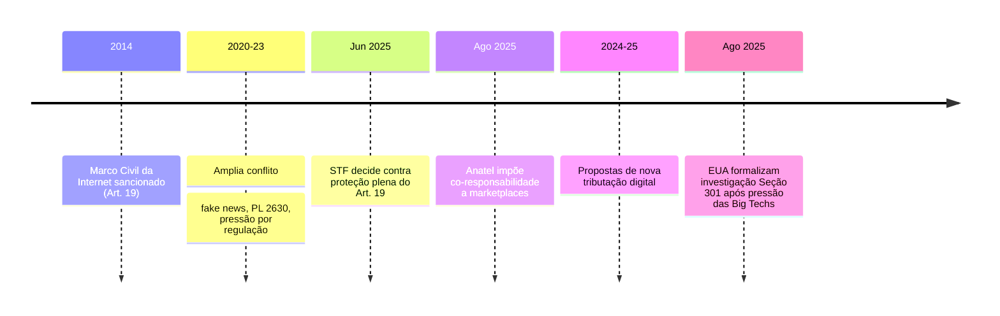

- &nbsp;
{:toc .large-only}

## 📆 Linha do Tempo: Disputa entre Big Techs, STF e Governo Brasileiro

***

### **2014: Marco Civil da Internet**
- 🏛️ O Marco Civil da Internet (Lei 12.965/2014) é sancionado, estabelecendo o artigo 19, que determina que provedores só podem ser responsabilizados civilmente por conteúdos de terceiros após descumprirem ordem judicial específica de remoção.[1]

***

### **2020–2023: Intensificação das Disputas**
- 💬 Crescem demandas judiciais e debates públicos sobre fake news, discurso de ódio e segurança em plataformas digitais.  
- 📜 Proposta de projetos como o "PL das Fake News" (PL 2630) mobiliza grandes empresas e o Congresso para revisão das regras de responsabilização e moderação de conteúdo.

***

### **Junho de 2025: Decisão do STF sobre o Artigo 19**
- ⚖️ STF declara parcialmente inconstitucional o artigo 19 do Marco Civil, permitindo responsabilização extrajudicial de plataformas por conteúdos ilícitos caso não retirem publicações após notificação da vítima.[2][3]
- 📣 Big techs reagem negativamente, afirmando que a decisão amplia riscos jurídicos e reduz garantias de liberdade de expressão.

***

### **Agosto de 2025: Novas Regras da Anatel para Marketplaces**
- 🛒 Anatel publica a Resolução nº 780/2025, tornando marketplaces corresponsáveis pela comercialização de produtos irregulares e obrigando compliance rigoroso sobre anúncios de terceiros.[4][5][6]
- 🔍 Exigência de código de homologação e fiscalização ativa transforma plataformas em fornecedores, não apenas intermediários.

***

### **2024–2025: Propostas Tributárias e Pressão ao Setor Digital**
- 💰 Governo e Congresso discutem novas formas de tributação do setor digital, como a Contribuição Social sobre Serviços Digitais (CSD) e regras no bojo da reforma tributária.[7]
- 🌐 Big techs denunciam “ambiente hostil” e recorrem ao USTR [Seção 301](/posts/crise-brasil-eua-inq-4781-vaza-toga-e-sancoes/#-o-que-é-a-seção-301), pedindo investigação das práticas brasileiras e ameaçando transferir investimentos para outros países.[8][9]

***

### **Agosto de 2025: Início Formal da Investigação Seção 301**
- 🇺🇸 USTR dos EUA abre investigação oficial após memorial das big techs; entidades americanas questionam decisões do STF, normas da Anatel e os planos tributários brasileiros.[8]
- 📉 Risco de sanções comerciais coloca setores exportadores brasileiros em alerta máximo.

***

## **Resumo Visual – Mermaid**

## 📌 O que é a **Seção 301**?
A **Seção 301 do Trade Act de 1974** é um instrumento legal dos EUA que permite ao **USTR** (Escritório do Representante Comercial dos EUA) investigar práticas comerciais de outros países consideradas **injustas, discriminatórias ou que restrinjam o comércio americano**.  
- Se confirmadas irregularidades, os EUA podem **impor sanções unilaterais**, como tarifas, restrições ou retaliações contra produtos do país-alvo.  
- Exemplos históricos: já foi usada contra **China**, **Índia**, **União Europeia** e outros, em disputas sobre subsídios, propriedade intelectual e barreiras digitais.

***

## 📌 Como isso chega ao Brasil?
Segundo o que você resumiu, **Big Techs** (Amazon, Google, Apple, Microsoft, Meta, etc.) enviaram posição formal ao **USTR**, pedindo que a política digital brasileira seja alvo de investigação no âmbito da **Seção 301**.  
Os pontos de tensão (de acordo com o documento das empresas) são:

1. **STF e Marco Civil da Internet**  
   - O Supremo declarou inconstitucional o antigo “porto seguro” do **Artigo 19**, que limitava a responsabilidade de plataformas por conteúdos de usuários.  
   - Agora, empresas podem ser responsabilizadas mais facilmente — o que as Big Techs chamam de “risco de censura preventiva” e “insegurança jurídica”.

2. **Anatel e Marketplaces**  
   - Resolução transfere responsabilidade por anúncios irregulares a plataformas como Amazon, Shopee e Mercado Livre.  
   - Elas alegam que isso cria custos extras e obrigações impossíveis de cumprir em larga escala.

3. **Planos do governo Lula**  
   - Propostas de **tributação sobre serviços digitais** e a **Contribuição Social Digital (CSD)** sobre publicidade online.  
   - Projeto de **regulação da inteligência artificial (PL 2338/2023)**, considerado muito restritivo pelas empresas.

***

## 📌 O argumento das Big Techs
- Dizem que o Brasil se tornou um **ambiente hostil ao setor digital**, com:
  - **Censura disfarçada de regulação** (decisões judiciais e exigências excessivas de remoção de conteúdo);  
  - **Tributação agressiva** (novos impostos sobre publicidade e receita digital);  
  - **Burocracia sufocante** (novas regras da Anatel, STF e Congresso).  

- Alegam que isso:  
  - Aumenta custos;  
  - Gera insegurança jurídica;  
  - Desestimula investimentos e inovação.  

***

## 📌 O risco de retaliação via Seção 301
- Se o USTR aceitar a pressão das empresas e considerar que o **Brasil cria barreiras comerciais abusivas no setor digital**, os EUA podem:
  - Impor **tarifas punitivas** sobre exportações brasileiras;  
  - Restringir a atuação de empresas brasileiras nos EUA;  
  - Criar precedentes contra a regulação digital do país.

- Ou seja, pode virar um **conflito comercial aberto** — com impacto direto sobre exportações (soja, carne, minério, aço etc.), se os EUA decidirem retaliar.

***

## 📌 Narrativa política por trás
- Críticos do governo e do STF apontam que isso seria uma tentativa de **“controle político da internet”** somada a nova carga tributária.  
- Já os defensores argumentam que é fundamental **responsabilizar Big Techs** pelas externalidades que elas causam (fake news, conteúdo ilegal, evasão fiscal).  
- Há tensão entre uma agenda de **soberania digital brasileira** vs. a **pressão internacional das big techs** com respaldo do governo americano.

***

✅ **Resumindo**:  
O caso é sério porque a **Seção 301** é uma arma legal real que os EUA já usaram contra outros países quando sentiram que suas empresas eram prejudicadas. Se o Brasil se mantiver nessa linha regulatória e tributária, o risco de **conflito comercial com Washington** existe, e pode respingar em setores muito além da tecnologia.  

*** 

## Artigos Relacionados

- [Brasil e Big Techs: O Impacto da Seção 301](/posts/brasil-e-big-techs-o-impacto-da-secao-301/)

*** 

### 🔗 Referências
1. Migalhas. STF: Redes respondem por posts mesmo sem ordem judicial. Disponível em: https://www.migalhas.com.br/quentes/433462/stf-redes-respondem-por-posts-mesmo-sem-ordem-judicial-veja-tese. Acesso em: 26 ago. 2025.[1]
2. TozziniFreire Advogados. Mudanças relevantes trazidas pela Resolução Anatel nº 780/2025. Disponível em: https://tozzinifreire.com.br/boletins/mudancas-relevantes-trazidas-pela-resolucao-anatel-n-7802025. Acesso em: 26 ago. 2025.[2]
3. Tribuna do Poder. 81 big techs enviam carta a Trump sobre a Seção 301 contra o Brasil. Disponível em: https://tribunadopoder.com.br/mundo/81-big-techs-enviam-carta-a-trump-sobre-a-secao-301-contra-o-brasil/. Acesso em: 26 ago. 2025.[3]
4. Teletime. A USTR, associações de techs dos EUA reclamam da Anatel, Congresso e Supremo. Disponível em: https://teletime.com.br/19/08/2025/a-ustr-associacoes-de-techs-dos-eua-reclamam-da-anatel-congresso-e-supremo/. Acesso em: 26 ago. 2025.[4]
5. Gazeta do Povo. Trump ameaça tarifas a países que regularem big techs. Disponível em: https://www.gazetadopovo.com.br/mundo/trump-ameaca-impor-tarifas-e-restringir-exportacao-de-tecnologia-a-paises-que-regularem-big-techs/. Acesso em: 26 ago. 2025.[5]

[1](https://www.migalhas.com.br/quentes/433462/stf-redes-respondem-por-posts-mesmo-sem-ordem-judicial-veja-tese)
[2](https://tozzinifreire.com.br/boletins/mudancas-relevantes-trazidas-pela-resolucao-anatel-n-7802025)
[3](https://tribunadopoder.com.br/mundo/81-big-techs-enviam-carta-a-trump-sobre-a-secao-301-contra-o-brasil/)
[4](https://teletime.com.br/19/08/2025/a-ustr-associacoes-de-techs-dos-eua-reclamam-da-anatel-congresso-e-supremo/)
[5](https://www.gazetadopovo.com.br/mundo/trump-ameaca-impor-tarifas-e-restringir-exportacao-de-tecnologia-a-paises-que-regularem-big-techs/)
