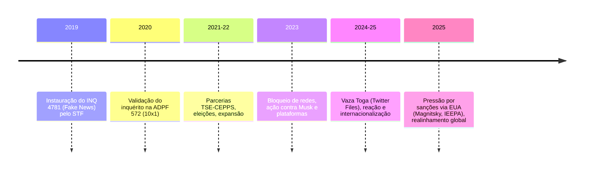

## 📚 Linha do Tempo Analítica – Crise Judicial Brasileira INQ 4781 e Internacionalização das Tensões

***

### **2019: Início do Inquérito 4781 (“Fake News”)**
- 🏛️ **Abril:** STF instaura, de ofício, o INQ 4781 por portaria do ministro Toffoli (GP 69/2019), fundamentando-se no Art. 43 do RISTF (contestado por parte da doutrina).
- ⚖️ Objetivo: Apurar notícias falsas, ameaças e ataques ao STF e seus membros — relatoria de Alexandre de Moraes.
- 🧑‍⚖️ **Críticas:** Viés de “tribunal de exceção” e questionamentos ao sistema acusatório.

***

### **2019–2021: Consolidação e Expansão**
- 🔎 Alcance do inquérito amplifica-se, atingindo políticos, influenciadores e ativistas, com bloqueios de contas, buscas e apreensões.
- 📚 ADPF 572 (2020): STF valida por maioria a legalidade do INQ 4781 (placar 10x1).
- 🏛️ Doutrina crítica: leitura de Estado de Exceção (Agamben) começa a pautar o debate teórico nacional e internacional.

***

### **2021–2022: TSE e Parcerias Eleitorais**
- 🗳️ Alexandre de Moraes assume a presidência do TSE no contexto das eleições de 2022.
- 🤝 Firmadas parcerias entre o TSE e entidades como o CEPPS (vinculado à USAID); objetivo declarado: “proteção do processo eleitoral contra ataques digitais”.
- 💬 Oposição levanta alegações de interferência eleitoral e cooptação internacional.

***

### **2023: Escalada nas Ordens Judiciais e Chocante Digital**
- 🚫 Ordens de bloqueio, multas e remoção de perfis atingem, principalmente, apoiadores de Jair Bolsonaro, influenciadores (Allan dos Santos, outros) e plataformas como o X/Twitter.
- 🧑‍💻 **Equipe X (pré-Musk):** Rafael Tagliaferro, Ayrton Vieira operam sob supervisão do STF/TSE.
- 🚀 Com Elon Musk, ocorre confronto direto: Musk desafia decisões, denuncia censura, entrega arquivos (“Twitter Files Brasil”) a jornalistas internacionais.

***

### **2024–2025: Vaza Toga, Internacionalização e Novas Fronteiras**
- 📰 **Vaza Toga/Twitter Files Brazil:** Publicações de Michael Shellenberger, David Ágape, Eli Vieira revelam supostos dossiês e práticas extralegais — dossiês “certidões” produzidos sem contraditório, com base em redes sociais, para embasar prisões pós-8/1/2023.[1][3][4][7]
- 👩‍💼 Cristina Yukiko organiza grupos informais de inteligência, assessores do STF/TSE colaboram.
- 📣 Acusações ampliadas internacionalmente: censura, violação de due process e cooperação com agências estrangeiras.

***

### **2025: Confronto geopolítico e “Hard Power”**
- 🌎 Pressões externas: EUA, via Global Magnitsky Act, IEEPA e OFAC, discutem sanções individuais, podendo mirar membros do STF/TSE.[5]
- 💰 EUA ameaçam retaliações econômicas; financiamento via NEA/USAID a mídia e ONGs brasileiras acusado de alimentar guerra de narrativas.
- 🏛️ Rumble desafia bloqueio judicial e judicializa nos EUA; plataformas aumentam lobby por liberdade de expressão.

***

### **Panorama das Repercussões**
- ⚠️ Crise diplomática crescente: ameaças de expulsão de diplomatas, tensões sobre cooperação internacional.
- 💼 Cenários econômicos: risco de tarifas e restrições comerciais (“guerra comercial”) como retaliação cruzada.
- 🌏 Possível realinhamento geopolítico brasileiro, buscando aproximação com China/Rússia diante do confronto EUA/Brasil.

***

#### **Resumo Visual (timeline Mermaid)**

***

Este panorama evidencia não só a **verticalização das decisões judiciais** no Brasil mas também a ampliação do conflito para o plano internacional, misturando temas de Estado de Direito, soberania digital, e repercussão geopolítica.[3][4][7][1][2][5]

[1](https://www.gazetadopovo.com.br/republica/mensagens-vazadas-justica-paralela-moraes-8-janeiro/)
[2](https://www.gazetadopovo.com.br/republica/tse-fez-dossies-sobre-presos-do-8-1-com-postagens-antigas-e-de-teor-politico/)
[3](https://static.poder360.com.br/2025/08/relatorio-civilization-works-alexandre-de-moraes-6.ago_.2025.pdf)
[4](https://novo.org.br/noticias/vaza-toga-alexandre-de-moraes-ilegalmente-posts-prender-8-1/)
[5](https://checamos.afp.com/doc.afp.com.69GQ366)
[6](https://www.intercept.com.br/2024/08/15/vazamento-alexandre-de-moraes-vaza-jato/)
[7](https://www.youtube.com/watch?v=xPk1Uge1IPo)
[8](https://www.instagram.com/p/DM8mWxay1jv/)
