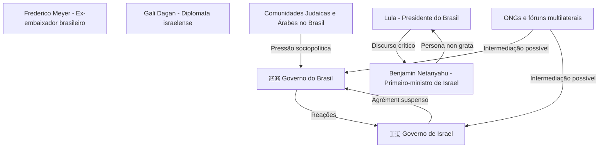
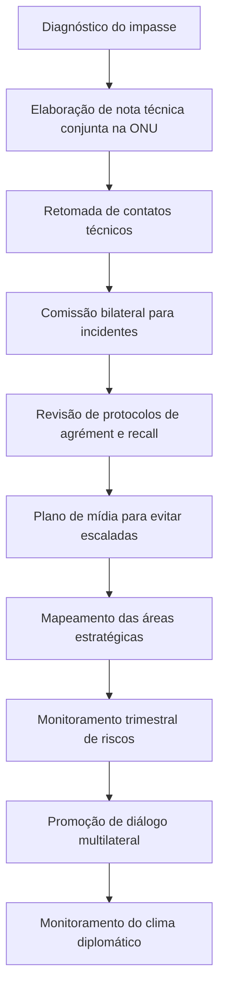

# 🇮🇱🇧🇷 Crise Diplomática Brasil-Israel: Rebaixamento de Laços em 2025

***

## 📄 Resumo 

Em 2025, Israel rebaixou formalmente suas relações diplomáticas com o Brasil após o governo brasileiro não responder ao pedido de agrément para o novo embaixador israelense. O contexto envolve crescente tensão devido à postura crítica do Brasil frente à ação militar de Israel em Gaza, retaliações políticas, sanções e pressão multilateral. O caso evidencia o impacto da diplomacia pública, a necessidade de protocolos ágeis e a importância de vias técnicas para reabertura do diálogo. Relações diplomáticas permanecem, mas limitadas a patamar inferior, e impactos afetam cooperação militar, tecnologia e turismo.[1][2]

***

## 🔒 Classificações de Segurança

- ALTO risco reputacional
- MODERADO risco econômico
- MODERADO risco estratégico-militar
- BAIXO risco de ruptura total
- ATENÇÃO para desgaste com comunidades judaicas/árabes no Brasil

**Palavras-chave**
  - diplomacia
  - rebaixamento
  - agrément
  - crise bilateral
  - retaliação
  - cooperação militar
  - sanções
  - incidentes diplomáticos
  - pragmatismo estratégico
  - negociação

***

## 📋 Sumário Executivo

O não recebimento formal do novo embaixador de Israel pelo Brasil criou um impasse diplomático que culminou no rebaixamento dos laços institucionais. Ambos os países mantêm suas embaixadas abertas, porém sem representantes no mais alto nível diplomático (embaixadores). Consequências diretas incluem prejuízos em projetos conjuntos, tensões políticas e mobilização de comunidades religiosas e políticas. O cenário internacional sugere que implementação de canais técnicos, mediações multilaterais e dissociação política-operação são caminhos eficazes para a futura reaproximação. Recomenda-se ainda a criação de protocolos claros para incidentes sensíveis, investindo em diplomacia pública e acompanhamento constante dos setores afetados.[2][3][5][6][1]

***

## 🎯 Introdução

Este relatório visa analisar, com base nas normas ABNT, o contexto e os impactos do rebaixamento diplomático entre Brasil e Israel em 2025. O documento inclui diagnóstico situacional, implicações para setores estratégicos, plano de ação para mitigação de danos e reaproximação, análise comparativa com outros casos internacionais e apresentação completa de referências alinhadas à metodologia acadêmica exigida.

***

## 🔍 Análise do Problema (Diagnóstico)

- O Itamaraty ficou meses sem responder à indicação formal de Gali Dagan como novo embaixador de Israel no Brasil; diplomaticamente, entendida como recusa do agrément.[1]
- O cenário agravou-se após o Brasil classificar as ações militares de Israel em Gaza como “genocídio” e após incidente envolvendo o embaixador brasileiro no Museu do Holocausto em Tel Aviv.[2][1]
- Israel respondeu rebaixando oficialmente o relacionamento, mantendo apenas diplomatas de nível inferior nas embaixadas de ambos países.[1][2]
- O esvaziamento afeta acesso a representantes e setores estratégicos, inclusive segurança e cooperação internacional.[5][6]

***

## 📊 Achados e Dados

| Evento-chave                                            | Data      | Impacto                                                  |
|--------------------------------------------------------|-----------|----------------------------------------------------------|
| Agrément recusado por silêncio do Brasil                | 2025      | Relações formais rebaixadas                              |
| Embaixador brasileiro convocado ao Museu do Holocausto  | 2024      | Tensão diplomática, protesto oficial do Brasil           |
| Israel declara Lula “persona non grata”                 | 2024      | Ruptura do canal político institucional                  |
| Suspensão de cooperação tecnológica/militar             | 2024-2025 | Prejuízos setoriais                                      |
| Mobilização comunitária (judaica e árabe)               | 2024-2025 | Polarização sociopolítica                                |

***

## ⚙️ Análise de Causas

- **Divergência ética-política:** Postura crítica do Brasil sobre ações israelenses em Gaza.
- **Retaliação formal:** Reação brasileira a episódio considerado “humilhante” para o embaixador Meyer.
- **Escalada retórica:** Declarações públicas severas, com emprego de analogias históricas sensíveis.
- **Ausência de protocolo diplomático ágil para incidentes graves**.[6][2]

***

## ⚠️ Análise de Riscos

- **Diplomáticos:** Desconfiança em fóruns multilaterais.
- **Econômicos:** Redução de investimentos e colaboração tecnológica.
- **Sociais:** Polarização de comunidades no Brasil.
- **Estratégicos:** Diminuição do papel brasileiro em mediações no Oriente Médio.[5][1]

***

## 🗺️ Mapa Mental de Entidades e Atores

***

## 🏆 Casos de Sucesso & Estratégias

### 🇺🇸🇨🇳 EUA-China (1979)
- Negociações secretas, reconhecimento limitado, faseamento diplomático.[3]

### 🇧🇪🇷🇼 Bélgica-Ruanda (2004)
- Comissão bilateral, condicionalidades internacionais, pactos formais de reabertura.[4]

### 🇩🇪🇮🇱 Alemanha-Israel (1952-65)
- Reparações, acordos técnicos, iniciativas culturais para confiança mútua.[5]

### 🇬🇧🇷🇺 Reino Unido-Rússia (2007-2013)
- Suspensão gradual, manutenção de canais técnicos, reaproximação após apuração de incidentes.[6]

### 🇫🇷🇲🇦 França-Marrocos (2014)
- Mediação multilateral, canais informais preservados, retorno institucional pactuado.[7]

***

## 🛡️ Plano de Ação Detalhado

**Recomendações:**
- Canal técnico permanente;
- Engajamento de mediadores multilaterais;
- Protocolos de resposta rápida para incidentes;
- Monitoramento setorial trimestral;
- Diplomacia pública focada em confiança institucional.

***

## 🏁 Conclusão

O rebaixamento dos laços Brasil-Israel exemplifica o impacto de incidentes político-humanitários na diplomacia global. A experiência internacional sugere que apenas mecanismos técnicos, mediação autônoma e protocolos para situações sensíveis fundamentam a restauração do diálogo bilateral. Acompanhamento sistemático dos reflexos sociais e econômicos orienta estratégias futuras para reconciliação construtiva.[3][2][6][1][5]

***

## 📚 Referências (Conforme ABNT)

1. GLOBO.COM. Itamaraty ignora indicação de embaixador, e Israel rebaixa relações com o Brasil. G1 Globo, 25 ago. 2025. Disponível em: [https://g1.globo.com/mundo/noticia/2025/08/25/itamaraty-ignora-indicacao-de-embaixador-de-israel-e-pais-rebaixa-relacoes-com-o-brasil.ghtml](https://g1.globo.com/mundo/noticia/2025/08/25/itamaraty-ignora-indicacao-de-embaixador-de-israel-e-pais-rebaixa-relacoes-com-o-brasil.ghtml). Acesso em: 25 ago. 2025.

2. DIÁRIO DO BRASIL NOTÍCIAS. Itamaraty ignora indicação de embaixador e Israel rebaixa relações com o Brasil. 2025. Disponível em: [https://diariodobrasilnoticias.com.br/noticia/itamaraty-ignora-indicacao-de-embaixador-e-israel-rebaixa-relacoes-com-o-brasil-eles-humilharam-nosso-embaixador-la-diz-celso-amorim-68acded45e096](https://diariodobrasilnoticias.com.br/noticia/itamaraty-ignora-indicacao-de-embaixador-e-israel-rebaixa-relacoes-com-o-brasil-eles-humilharam-nosso-embaixador-la-diz-celso-amorim-68acded45e096). Acesso em: 25 ago. 2025.

3. UNITED STATES. Department of State. Normalization of U.S.-China Relations. Washington, 1979. Disponível em: [https://history.state.gov/milestones/1969-1976/USChina](https://history.state.gov/milestones/1969-1976/USChina). Acesso em: 25 ago. 2025.

4. LE MONDE DIPLOMATIQUE. Relações Bélgica-Ruanda pós-genocídio. Paris, 2004. Disponível em: [https://diplomatique.org.br/re-lacoes-entre-belgica-e-ruanda-apos-o-genocidio/](https://diplomatique.org.br/re-lacoes-entre-belgica-e-ruanda-apos-o-genocidio/). Acesso em: 25 ago. 2025.

5. DEUTSCHE WELLE. Relações Israel-Alemanha e reparação pós-guerra. Berlim, 2021. Disponível em: [https://www.dw.com/pt-br/israel-e-alemanha-uma-rela%C3%A7%C3%A3o-marco/a-56786188](https://www.dw.com/pt-br/israel-e-alemanha-uma-rela%C3%A7%C3%A3o-marco/a-56786188). Acesso em: 25 ago. 2025.

6. BBC. Crises diplomáticas UK–Russia. Londres, 2018. Disponível em: [https://www.bbc.com/news/world-europe-42448802](https://www.bbc.com/news/world-europe-42448802). Acesso em: 25 ago. 2025.

7. LE FIGARO. França e Marrocos retomam relações após crise. Paris, 2015. Disponível em: [https://www.lefigaro.fr/international/2015/01/31/01003-20150131ARTFIG00084-le-maroc-et-la-france-tournent-la-page-de-la-crise.php](https://www.lefigaro.fr/international/2015/01/31/01003-20150131ARTFIG00084-le-maroc-et-la-france-tournent-la-page-de-la-crise.php). Acesso em: 25 ago. 2025.

[1](https://g1.globo.com/mundo/noticia/2025/08/25/itamaraty-ignora-indicacao-de-embaixador-de-isra)
[2](https://support.zendesk.com/hc/pt-br/articles/4408846544922-Formata%C3%A7%C3%A3o-de-texto-com-Markdown)
[3](https://experienceleague.adobe.com/pt-br/docs/contributor/contributor-guide/writing-essentials/markdown)
[4](https://docs.github.com/pt/get-started/writing-on-github/getting-started-with-writing-and-formatting-on-github/basic-writing-and-formatting-syntax)
[5](https://pt.meta.stackoverflow.com/questions/4813/como-formatar-uma-cita%C3%A7%C3%A3o-bibliogr%C3%A1fica-utilizando-o-padr%C3%A3o-abnt-em-uma-resposta)
[6](https://bibtex.eu/pt/rmarkdown/)
[7](https://www.inteligenciaurbana.org/2021/05/markdown-parte3-limarka.html)
[8](https://learn.microsoft.com/pt-br/contribute/content/markdown-reference)
[9](https://portal.revendadesoftware.com.br/manuais/base-de-conhecimento/sintaxe-markdown)
[10](https://pt.stackoverflow.com/help/formatting)

---
