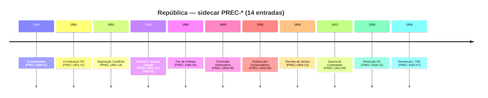

- &nbsp;
{:toc .large-only}

# T-224 · Precedentes República 1891–1930

Dossiê índice do **sidecar** `_data/precedentes-republica.json` — **14 entradas** no namespace `PREC-AAAA-NN`, período **1890–1930**. Não mesclado ao main track (`lawfare.json`); **1629+** permanece reservado para eventos contemporâneos 2026+.

***

## 🧭 Resumo

Batch `precedentes-republica-1891-1930.json` processado em **Sidecar + T-224**. Revisão **2026-07-19** incorpora:

- **PREC-1891-14** — lacuna crítica: Castilhos deposto 14 meses (nov/1891–jan/1893), retorno negociado com Floriano Peixoto para barrar Silveira Martins, reeleição sem concorrentes, guerra federalista uma semana após posse contestada
- **PREC-1891-01** e **PREC-1895-04** — leitura corrigida (permanência **não** contínua desde 1891); fontes reforçadas com **CPDOC/FGV**
- **PREC-1899-05** e **PREC-1926-13** — `captura-institucional` com paralelos **P06-B** e **P03** (decisão editorial T-224)

***

## ⚠️ Cluster Castilhos (1891–1895)

Lidas isoladamente, PREC-1891-01 e PREC-1895-04 sugeriam continuidade ininterrupta de poder. **PREC-1891-14** corrige a sequência:

| Fase | ID | Evento |
|------|-----|--------|
| Constituição autoritária | PREC-1891-01 | Constituição gaúcha redigida por Castilhos (14/07/1891) |
| Deposição e interregno | **PREC-1891-14** | Golpe de Três de Novembro → 14 meses de juntas interinas |
| Retorno negociado | **PREC-1891-14** | Acordo com Floriano Peixoto; posse 25/01/1893; eleição contestada |
| Estallido | PREC-1893-02 | Invasão de Gumercindo Saraiva (02/02/1893) — uma semana após posse |
| Consolidação pós-guerra | PREC-1895-04 | Paz de Pelotas — projeto constitucional sobrevive à guerra |

> Fontes primárias: [CPDOC — Castilhos](https://cpdoc.fgv.br/sites/default/files/verbetes/primeira-republica/CASTILHOS,%20J%C3%BAlio%20de.pdf) · [CPDOC — Revolução Federalista](https://cpdoc.fgv.br/sites/default/files/verbetes/primeira-republica/REVOLU%C3%87%C3%83O%20FEDERALISTA.pdf)

***

## 📊 Inventário cronológico

| ID | Data | Categoria | Evento | Paralelo |
|----|------|-----------|--------|----------|
| PREC-1890-11 | 1890 | captura-institucional | Encilhamento — bolha com beneficiário no Ministério da Fazenda | P05/P11 |
| PREC-1891-01 | 1891-07-14 | captura-institucional | Constituição do RS redigida unilateralmente por Castilhos | — |
| **PREC-1891-14** | 1891-11-13 | captura-institucional | **Deposição, juntas interinas e retorno negociado (14 meses)** | P03 |
| PREC-1893-02 | 1893-02-02 | registro-analitico | Guerra da Degola / Revolução Federalista | — |
| PREC-1893-03 | 1893-11-23 | registro-analitico | Potreiro das Almas — correção do número de degolados | — |
| PREC-1895-04 | 1895-08-23 | captura-institucional | Paz de Pelotas — Castilhos permanece; Constituição intacta | — |
| PREC-1899-05 | 1899 | captura-institucional | Comissão Verificadora de Poderes — “degola” parlamentar | P06-B |
| PREC-1902-06 | 1902 | captura-institucional | Política dos Governadores (Campos Sales) | P11 |
| PREC-1904-12 | 1904-11-10 | perseguicao-institucional | Revolta da Vacina — higienismo como remoção | — |
| PREC-1908-08 | 1908 | captura-institucional | Concessão Brazil Railway (Farquhar) | — |
| PREC-1912-09 | 1912–1916 | registro-analitico | Guerra do Contestado | — |
| PREC-1916-10 | 1916-10-20 | captura-institucional | Acordo de Limites PR-SC | — |
| PREC-1926-13 | 1926 | captura-institucional | Reforma de 1926 restringe habeas corpus | P03 |
| PREC-1930-07 | 1930 | captura-institucional | Revolução de 1930 e Justiça Eleitoral (1932) | — |

***

## 🔗 Paralelos estruturais (main track contemporâneo)

| Precedente | Padrão | Conexão editorial |
|------------|--------|-------------------|
| PREC-1890-11 Encilhamento | P05/P11 | Cluster [Banco Master / Compliance Zero](/categories/lawfare/) |
| PREC-1891-14 Retorno Castilhos | P03 | Sucessão negociada para barrar rival — ver [Sucessão RJ / Fux (1626–1627)](/posts/2026-05-29-ministro-luiz-fux-stf-nega-pedido-da-mesa-diretora-da-alerj-para-que-douglas-ruas-assuma-i/) |
| PREC-1899-05 Comissão Verificadora | P06-B | [CPI Crime Organizado (1625)](/posts/cpi-crime-organizado-mapeamento-pcc-cv-infiltracao-municipal/) |
| PREC-1926-13 HC restrito | P03 | Paralização de remédio jurídico — [Sucessão RJ / Fux](/posts/2026-05-29-ministro-luiz-fux-stf-nega-pedido-da-mesa-diretora-da-alerj-para-que-douglas-ruas-assuma-i/) |
| PREC-1902-06 Política dos Governadores | P11 | [Estudos P11](/categories/escandalos/) |

***

## 📈 Linha do tempo (1890–1930)

***

## ⚙️ Metodologia

- **Track:** `historical_precedents` em `claude.ai-corpus-ids-sync.json` (14 entradas)
- **Formato ID:** `PREC-AAAA-NN` — sem colisão com main 1–1628
- **Fontes:** PREC-1891-01, PREC-1891-14 e PREC-1895-04 ancorados em CPDOC/FGV (risco metodológico #1 resolvido para o cluster Castilhos)
- **Posts individuais:** Fase 3 opcional (14 slugs `prec-*.md`)

## Conexões temáticas

- [T-222 · P10 autônomo](/posts/2026-07-16-p10-promovido-a-padrao-autonomo-infraestrutura-de-servico-compartilhada-com-dois-nos-verif/)
- [T-223 · P12-B assimetria analítica](/posts/2026-07-16-p12-b-instanciado-como-assimetria-de-capacidade-analitica-camada-oficial-aberta-tse-camada/)
- [Dashboard Padrões Sistemicos v3.3](/posts/padroes-sistemicos-dashboard/)

*Dossiê T-224 · CC0 · lawfare-timeline · revisão 2026-07-19*
