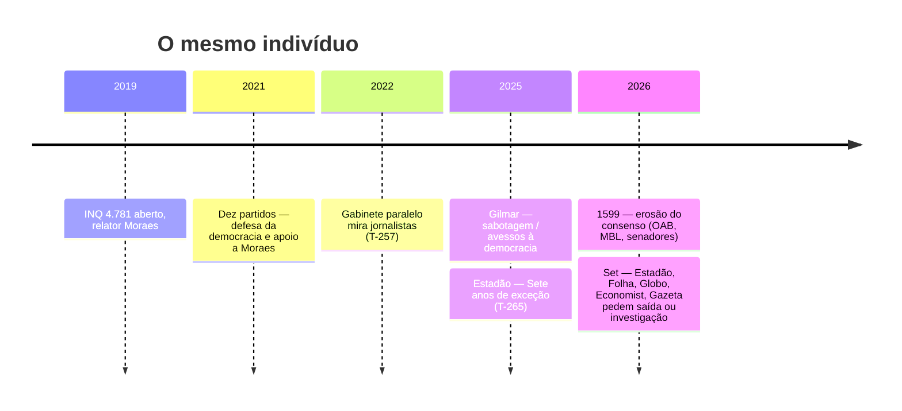

- &nbsp;
{:toc .large-only}

# T-269 · A criatura e o consenso

Em agosto de 2021, dez partidos pediram ao país que protegesse Alexandre de Moraes. Em setembro de 2026, Estadão, Folha e O Globo pediram que ele saísse do Supremo. É o mesmo homem. O que mudou não foi o inquérito — o [INQ 4.781](/posts/crise-brasil-eua-inq-4781-vaza-toga-e-sancoes/) segue aberto, sem mérito, desde 2019. Mudou o custo de continuar a defendê-lo.

Quem licenciou a expansão agora recua. A criatura não cabe mais no consenso que a fez.

## O que Bonhoeffer descreveu

O vídeo [TEORIA DA ESTUPIDEZ HUMANA](https://www.youtube.com/watch?v=TnWgSHK4pdE) (12/09/2026) lê o fragmento [Da estupidez](https://www.ihu.unisinos.br/categorias/592293-da-estupidez-dietrich-bonhoeffer-1943) (1943; tradução de Petronella Maria Boonen no IHU) e o livro [Suicidal Empathy](https://bookshop.org/p/books/suicidal-empathy-dying-to-be-kind-gad-saad/b07d1eccb4f021c9) de Gad Saad (12/05/2026). O vídeo aponta o texto contra o campo oposto. O ensaio, lido no próprio recorte brasileiro, descreve outra coisa.

Bonhoeffer escreve da prisão. A estupidez, diz, não é falta de QI. É um processo social. Sob uma expansão forte de poder, um número grande de pessoas entrega a independência interior: deixa de julgar o caso à sua frente e passa a repetir a frase que o poder precisa. «O poder de alguém precisa da estupidez de outrem.» O estúpido fica capaz de todo o mal e incapaz de reconhecer maldade no que faz. Instrução não resolve. Só libertação.

Saad chama de empatia suicida o hábito de elevar uma virtude (compaixão, proteção do vulnerável) até o ponto em que ela desmonta a própria defesa de quem a professa. No Brasil de 2019–2026 a virtude emprestada foi «defesa da democracia». Funcionou como licença. Enquanto o custo caía sobre o adversário, o julgamento crítico ficou suspenso. Quando o custo chegou ao próprio sistema — Banco Master, Vorcaro, contratos e mensagens — a licença estourou.

O estudo não atribui o vídeo a um apresentador sem URL de canal. Não usa audiência alegada nem testemunho anônimo. O texto de 1943 e a sequência pública de 2021–2026 bastam.

## A licença (2019–2025)

O INQ 4.781 nasce em 2019 para apurar ataques ao STF. O relator é Moraes. Em 22/08/2021, no dia seguinte ao pedido de impeachment apresentado por Jair Bolsonaro, [dez partidos](https://www.cartacapital.com.br/politica/partidos-divulgam-nota-em-defesa-da-democracia-e-em-apoio-a-moraes/) — PDT, PSB, Cidadania, PCdoB, PV, Rede, PT, e à parte DEM, MDB e PSDB — publicam notas de «defesa da democracia» e de apoio ao ministro (CartaCapital, 23/08/2021). A fórmula é explícita: esgotados os recursos, «as únicas atitudes possíveis são acatar e respeitar». Discordar depois do trânsito vira «escalada autoritária».

Isso é a suspensão do julgamento. Não é um voto em processo. É um cheque em branco moral: o ministro passa a ser o próprio bem a proteger.

Quatro anos depois o cheque ainda circula. Em 01/08/2025 Gilmar Mendes classifica o movimento crítico à Corte como «sabotagem contra o povo brasileiro» por «pessoas avessas à democracia» ([JOTA](https://tagteam.harvard.edu/hub_feeds/3884/feed_items/14996096)). Crítica vira defeito de caráter. Bonhoeffer outra vez: slogans no lugar do caso concreto.

Enquanto a licença valeu, o inquérito saiu do objeto original. O [T-257](/posts/2026-08-20-t-257-vaza-toga-3-cacando-jornalistas/) documenta o gabinete paralelo mirando colunistas (Constantino, Fiuza), Gettr e Allan dos Santos. A frase de Airton Vieira — «use sua criatividade» — é o manual de quem já não precisa justificar o alvo. Jornalista crítico deixa de ser imprensa e vira matéria de inquérito.

O Estadão, que apoiara a abertura do inquérito em 2019, publica em dezembro de 2025 o editorial [Sete anos de exceção](/posts/2025-12-01-o-estado-de-s-paulo-publica-editorial-sete-anos-de-excecao-criticando-manutencao-do-inq-47/) (T-265). A rachadura começa no próprio jornal que havia dado cobertura. Ainda não é recusa ao homem. É recusa ao prazo.

## A recusa (setembro de 2026)

O [1599](/posts/2026-05-01-erosao-do-consenso-de-apoio-a-moraes-oab-mbl-senadores-e-governadores-revisam-posicoes-pub/) já tinha a lista de quem apoiou e depois recuou: OAB federal, Mourão, Ciro, Oriovisto, Kajuru, Lira, MBL, Eduardo Leite. Figuras que emprestaram ombro e, uma a uma, retiraram o ombro. Nenhuma dessas viradas reabre processo nem devolve direito a investigado. Servem como termômetro: o P09 — a legitimidade simbólica que cobria o sistema — está rachando.

Em 1º e 2/09/2026 a rachadura vira capa. [Estadão, Folha e O Globo](https://www.poder360.com.br/poder-midia/estadao-folha-e-globo-defendem-saida-de-moraes-do-supremo/) pedem a saída de Moraes ou reação urgente da Corte (Poder360, 03/09/2026). O Estadão: «Moraes tem de deixar o Supremo.» A Folha: «A Moraes cabe a renúncia.» O Globo cobra o plenário e, se a Corte demorar, o Senado.

Em 10/09 a *The Economist* publica [When the defenders of democracy turn their backs on it instead](https://www.economist.com/the-americas/2026/09/10/when-the-defenders-of-democracy-turn-their-backs-on-it-instead). O título faz o trabalho sozinho: os defensores da democracia viram as costas para ela. Em 11/09 a [Gazeta do Povo](https://www.gazetadopovo.com.br/opiniao/editoriais/stf-alexandre-de-moraes-afastamento-investigacao/) pede afastamento e investigação, na véspera da sessão de 15/09 em que Fachin leva ao plenário as ligações com Daniel Vorcaro e o Banco Master.

O gatilho visível é financeiro e pessoal — mensagens, contratos, o nome Vorcaro. Não é a prisão de jornalista em 2022, nem os sete anos sem mérito do INQ. A criatura só fica intolerável quando ameaça a casa de quem a alimentou.

Isso não prova que o Master seja a única causa. Prova a sequência. Apoio ao homem enquanto o poder crescia. Recusa ao mesmo homem quando o poder já não se deixa guardar.

## A criatura

Frankenstein é metáfora, não processo. O que o corpus segura é mais seco. Um relator recebeu cobertura partidária, jurídica e editorial para tratar crítica como ataque à democracia. Com essa cobertura o inquérito virou máquina permanente, chegou a jornalista e atravessou fronteira — daí a [crise Brasil–EUA](/posts/crise-brasil-eua-inq-4781-vaza-toga-e-sancoes/). Em 2026 os mesmos jornais que sustentaram a moldura descobrem que não há interruptor. Moraes não se demite porque um editorial pediu. Gilmar ainda fala em sabotagem. O plenário de 15/09 é a tentativa tardia de pôr coleira numa função que o próprio colegiado deixou crescer.

Bonhoeffer outra vez: o poder precisa da estupidez alheia. A estupidez, aqui, foi o hábito de não examinar o caso — só o campo. Quem criticava Moraes era golpista, entreguista, avesso à democracia. Quem o defendia estava do lado certo, independente do volume de droga processual, do prazo do inquérito ou do alvo. Quando Folha e Estadão pedem a cabeça, não estão confessando maldade. Estão saindo, atrasados, do estado que o ensaio de 1943 descreve: slogans no lugar do julgamento.

Saad entra no mesmo ponto por outro vocabulário. Empatia suicida é proteger tanto o «bem» declarado que se aceita o dano ao próprio arranjo que deveria sobreviver. Defender a democracia até o ponto em que um ministro concentra inquérito, pauta e execução, e depois descobrir que a concentração não tem dono além dele.

A frase «toda a imprensa apoiou» não passa. Crusoé, Gazeta, Oeste e o próprio T-257 mostram imprensa que pagou custo por discordar. O que passou foi outra coisa: a grande imprensa diária e um bloco partidário suspenderam o exame do homem enquanto o homem era útil. Em setembro de 2026 o exame volta. A criatura, não.

## O que este estudo não afirma

Não confirma autoria do vídeo, audiência, o «poeta ateu», cifra de exilados nem diploma de Olavo. Não trata a simetria olavista/STF como padrão medido. Não diz que Globo, Folha e Estadão tenham sido silenciosos em cada ano de 2019 a 2025 — não há amostragem. Diz o que as datas sustentam: o mesmo indivíduo foi objeto de licença coletiva e, cinco anos depois, de recusa coletiva. O INQ continua. O consenso, não.

[T-208](/posts/narrativa-vs-evidencia-corpus-bridge/) é a trava. O que não fecha, não sobe.

## Padrões

- **P09** — legitimidade emprestada («defesa da democracia») cobriu a expansão; em 2026 a cobertura editorial cai.
- **P04** — crítica convertida em defeito moral (Gilmar, 2025); no vídeo, o mesmo mecanismo apontado para o outro lado.
- **P02** — custo assimétrico a jornalistas no INQ 4.781, documentado no T-257 enquanto a licença ainda valia.

## Conexões

- [T-257 · Vaza Toga 3 — caçando jornalistas](/posts/2026-08-20-t-257-vaza-toga-3-cacando-jornalistas/)
- [1599 · Erosão do consenso de apoio a Moraes](/posts/2026-05-01-erosao-do-consenso-de-apoio-a-moraes-oab-mbl-senadores-e-governadores-revisam-posicoes-pub/)
- [T-208 · Narrativa vs. evidência](/posts/narrativa-vs-evidencia-corpus-bridge/)
- [INQ 4.781 × crise Brasil-EUA](/posts/crise-brasil-eua-inq-4781-vaza-toga-e-sancoes/)

## Fontes

- [TEORIA DA ESTUPIDEZ HUMANA](https://www.youtube.com/watch?v=TnWgSHK4pdE)
- [Da estupidez — Bonhoeffer, 1943 (IHU)](https://www.ihu.unisinos.br/categorias/592293-da-estupidez-dietrich-bonhoeffer-1943)
- [Suicidal Empathy — Gad Saad, 12/05/2026](https://bookshop.org/p/books/suicidal-empathy-dying-to-be-kind-gad-saad/b07d1eccb4f021c9)
- [CartaCapital — notas partidárias, 23/08/2021](https://www.cartacapital.com.br/politica/partidos-divulgam-nota-em-defesa-da-democracia-e-em-apoio-a-moraes/)
- [JOTA / TagTeam — Gilmar Mendes, 01/08/2025](https://tagteam.harvard.edu/hub_feeds/3884/feed_items/14996096)
- [Poder360 — editoriais Estadão, Folha e Globo, 03/09/2026](https://www.poder360.com.br/poder-midia/estadao-folha-e-globo-defendem-saida-de-moraes-do-supremo/)
- [The Economist, 10/09/2026](https://www.economist.com/the-americas/2026/09/10/when-the-defenders-of-democracy-turn-their-backs-on-it-instead)
- [Gazeta do Povo — editorial, 11/09/2026](https://www.gazetadopovo.com.br/opiniao/editoriais/stf-alexandre-de-moraes-afastamento-investigacao/)

*Dossiê T-269 · CC0 · lawfare-timeline*
