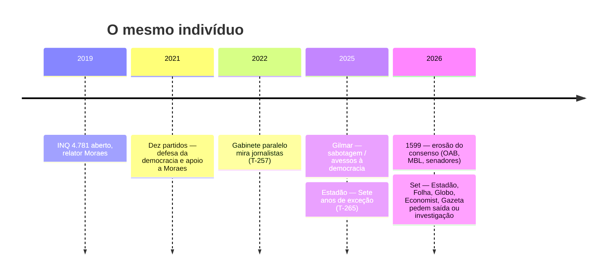
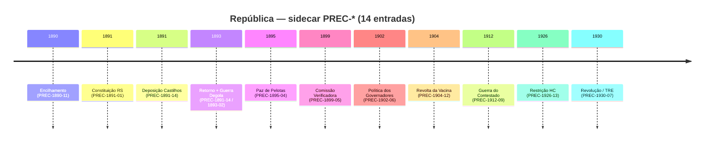

- &nbsp;
{:toc .large-only}


# T-270 · Compilado Lawfare

Síntese + antologia de **128 estudos**. Parte A organiza a leitura. Parte B devolve o texto integral. Página da categoria: [https://lawfare-timeline.vercel.app/estudos/](https://lawfare-timeline.vercel.app/estudos/). EPUB para leitura offline: [T-270 Compilado Lawfare](https://lawfare-timeline.vercel.app/assets/ebook/compilado-lawfare.epub).

***

# Parte A — Síntese do compilado

Este volume não inventa dossiê novo. Organiza os **128 estudos** já publicados na categoria `estudos` em uma leitura contínua e, na Parte B, devolve o texto integral de cada um, com [links para a página canônica](https://lawfare-timeline.vercel.app/estudos/) e para as fontes que o estudo original já citava.

A regra do corpus vale aqui: o que não fecha, não sobe. [T-208](https://lawfare-timeline.vercel.app/posts/narrativa-vs-evidencia-corpus-bridge/) é a trava. Selos `ev-confirmed`, `ev-contested`, `ev-alleged` e `ev-inference` continuam no texto de origem.

## Como ler este livro

Há três camadas no projeto, descritas no [guia sem jargão](https://lawfare-timeline.vercel.app/posts/como-ler-o-lawfare-timeline-guia-para-o-leitor-brasileiro/):

1. **Linha do tempo** — eventos com data, fonte e ID.
2. **Estudos** — cruzamentos que nomeiam um mecanismo.
3. **Padrões (P01–P13)** — só entram no catálogo quando o mesmo mecanismo aparece em três ou mais casos independentes.

Este compilado é a camada 2 inteira, lida como livro. O [dashboard mestre](https://lawfare-timeline.vercel.app/posts/padroes-sistemicos-dashboard/) é o mapa dos padrões. O [radar de lacunas](https://lawfare-timeline.vercel.app/posts/top30-alertas-criticos-operacoes-sem-dossie/) (T-196) é o que ainda não tem dossiê.

## Tese em uma página

A falha institucional brasileira documentada nestes estudos **não é um bug ocasional**. É desenho recorrente: o mesmo tipo de manobra reaparece sob nome novo de operação, de inquérito ou de acordo. O [dossiê de padrões](https://lawfare-timeline.vercel.app/posts/padroes-sistemicos-dashboard/) formula isso assim: a falha estrutural não é vício do sistema — é o seu design principal.

Três eixos se cruzam o tempo todo:

- **Poder sem colegiado imediato.** Liminar monocrática, relatoria acumulada, inquérito sem mérito que dura anos. Ver [Anatomia da liminar](https://lawfare-timeline.vercel.app/posts/anatomia-liminar-monocratica-stf-poder-individual-sem-controle/), [T-221](https://lawfare-timeline.vercel.app/posts/2026-06-16-nemo-judex-in-causa-propria-formalizado-por-orgao-de-estado-a-preliminar-da-dpu-na-ap-2782/) e [T-266](https://lawfare-timeline.vercel.app/posts/2026-08-24-refutacao-juridica-da-tese-de-legitima-defesa-institucional-como-fundamento-para-autotutel/).
- **Narrativa no lugar do caso.** P04 e P04b: o fato some, ou vira «só um lado». Vale para esquerda e direita — [T-227](https://lawfare-timeline.vercel.app/posts/2026-07-20-p04-pela-direita-narco-soberania-eleitoral-e-diplomacia-das-sombras-como-espelhos-estrutur/) e o [modelo SPLC](https://lawfare-timeline.vercel.app/posts/splc-modelo-brasil/).
- **Dinheiro público como veículo.** P05 e P11: INSS, FGC, estatais, penduricalho, rejeito que é ativo num regulador e «não-ativo» noutro. [P11 expandido](https://lawfare-timeline.vercel.app/posts/p11-expandido-loop-extracao-perpetua-economia-politica-brasil/), [T-268](https://lawfare-timeline.vercel.app/posts/2026-06-12-o-loop-da-lama-rejeito-como-ativo-bilionario-perante-o-cade-passivo-inexistente-perante-a-/), [T-219](https://lawfare-timeline.vercel.app/posts/2026-03-28-farra-do-inss-rede-completa-conafer-careca-do-inss-nucleo-politico-e-o-nucleo-internaciona/).

O [T-269](https://lawfare-timeline.vercel.app/posts/2026-09-13-a-criatura-e-o-consenso-teoria-da-estupidez/) fecha o arco político-editorial: o mesmo Alexandre de Moraes que recebeu licença partidária em 2021 («defesa da democracia») vira objeto de recusa editorial em setembro de 2026. O [INQ 4.781](https://lawfare-timeline.vercel.app/posts/crise-brasil-eua-inq-4781-vaza-toga-e-sancoes/) segue aberto. O consenso, não.

## Os padrões, em uma frase cada

Síntese operacional a partir do [dashboard](https://lawfare-timeline.vercel.app/posts/padroes-sistemicos-dashboard/) e das promoções posteriores ([T-222](https://lawfare-timeline.vercel.app/posts/2026-07-16-p10-promovido-a-padrao-autonomo-infraestrutura-de-servico-compartilhada-com-dois-nos-verif/), [T-223](https://lawfare-timeline.vercel.app/posts/2026-07-16-p12-b-instanciado-como-assimetria-de-capacidade-analitica-camada-oficial-aberta-tse-camada/), [T-254](https://lawfare-timeline.vercel.app/posts/2026-08-18-t-254-p13-porta-giratoria/)):

| Código | Mecanismo |
|---|---|
| P01 | O processo cai por defeito formal, sem enfrentar o mérito |
| P02 | Quem investiga ou denuncia vira alvo |
| P03 | Um ministro, sozinho, trava ou destrava o caso |
| P04 / P04b | A cobertura decide o que «aconteceu», ou dilui o fato em opinionismo |
| P05 | Recurso público mistura-se ao esquema que deveria fiscalizar |
| P06 / P06-B | O caso envelhece até prescrever; CPI/CPMI acaba sem relatório |
| P07 | A rede atravessa gerações e trocas de governo |
| P08 | Fintech, cripto e ouro irregular como trilho de lavagem |
| P09 | Legitimidade cultural como escudo («defesa da democracia», narcoestética) |
| P10 | Política e crime organizado compartilham prestador de serviço |
| P11 | Loop macro: juro, dívida, transferência e extração que se realimentam |
| P12 / P12-B | Assimetria de capacidade analítica / paywall de dado eleitoral |
| P13 | Porta giratória: autoridade pública vira capital relacional privado |

Metodologia: [METHODOLOGY.md](https://github.com/araguaci/lawfare-timeline/blob/main/METHODOLOGY.md).

## Eixo por eixo

### STF e a criatura

O [índice Vaza Toga](https://lawfare-timeline.vercel.app/posts/vaza-toga-corpus-bridge/) (T-207) ancora o gabinete paralelo e o INQ 4.781. O [Estadão](https://lawfare-timeline.vercel.app/posts/2025-12-01-o-estado-de-s-paulo-publica-editorial-sete-anos-de-excecao-criticando-manutencao-do-inq-47/) (T-265) marca a rachadura editorial («sete anos de exceção»). A DPU formaliza *nemo judex* na [AP 2782](https://lawfare-timeline.vercel.app/posts/2026-06-16-nemo-judex-in-causa-propria-formalizado-por-orgao-de-estado-a-preliminar-da-dpu-na-ap-2782/) (T-221). [T-266](https://lawfare-timeline.vercel.app/posts/2026-08-24-refutacao-juridica-da-tese-de-legitima-defesa-institucional-como-fundamento-para-autotutel/) recusa a tese de «legítima defesa institucional» como autotutela. [T-269](https://lawfare-timeline.vercel.app/posts/2026-09-13-a-criatura-e-o-consenso-teoria-da-estupidez/) lê a sequência 2021–2026 com Bonhoeffer: o poder precisa da estupidez alheia — slogan no lugar do caso.

Análise evidencial do golpe e erosão: [Quem deu o golpe](https://lawfare-timeline.vercel.app/posts/golpe-brasil-analise-evidencial/) e [Brazil Democratic Erosion 2026](https://lawfare-timeline.vercel.app/posts/brazil-democratic-erosion-2026/). COAF e acumulação de funções: [T-198](https://lawfare-timeline.vercel.app/posts/coaf-moraes-acumulacao-funcoes-dosimetria/).

### TSE e seletividade

[T-216](https://lawfare-timeline.vercel.app/posts/tse-usaid-parceria-censura-seletiva/) documenta o acordo TSE–USAID e repasses via ONGs. [T-180](https://lawfare-timeline.vercel.app/posts/tse-seletividade-inelegibilidade-cassacao/) e [T-217](https://lawfare-timeline.vercel.app/posts/seletividade-punitiva-tse-casos-isolados/) tratam cassação e seletividade punitiva. [T-223](https://lawfare-timeline.vercel.app/posts/2026-07-16-p12-b-instanciado-como-assimetria-de-capacidade-analitica-camada-oficial-aberta-tse-camada/) instancia P12-B: portal aberto na superfície, assimetria de capacidade por baixo. [T-247](https://lawfare-timeline.vercel.app/posts/2026-07-25-episodio-video-de-ia-de-bolsonaro-na-convencao-do-pl-detona-disputa-de-competencia-stftse-/) é o episódio de IA na convenção do PL e a disputa de competência STF/TSE.

### Mineração: dois mercados, um loop

[T-197](https://lawfare-timeline.vercel.app/posts/operacao-rejeito-serra-curral-manuscritos/) consolida Rejeito / Serra do Curral. [T-267](https://lawfare-timeline.vercel.app/posts/2026-09-10-minerios-terras-raras-dois-mercados/) cruza 80 IDs: 22 presos em setembro de 2025, zero em janeiro de 2026; Serra Verde vendida por US$ 2,8 bi. [T-268](https://lawfare-timeline.vercel.app/posts/2026-06-12-o-loop-da-lama-rejeito-como-ativo-bilionario-perante-o-cade-passivo-inexistente-perante-a-/) é a contradição CADE/CVM: o mesmo rejeito muda de natureza jurídica conforme o regulador.

### PCC e o trilho compartilhado

O cluster transnacional (WSJ, OFAC, Yakuza, GAFILAT, Europol, GI-TOC) e as pontes domésticas ([T-201](https://lawfare-timeline.vercel.app/posts/pcc-transnacional-ofac-eua-luso/), [T-195](https://lawfare-timeline.vercel.app/posts/cpi-crime-organizado-pcc-infiltracao-eleitoral/), [T-202](https://lawfare-timeline.vercel.app/posts/delegada-pcc-infiltracao-institucional-sp/), [T-218](https://lawfare-timeline.vercel.app/posts/ouro-ilegal-vetor-p08-amazonia-pcc-cv-venezuela/), [T-220](https://lawfare-timeline.vercel.app/posts/convergencia-estrutural-vetor-pcc-ofac-rede-arpar-farra-do-inss-via-infraestrutura-finance/)) descrevem o mesmo desenho: facção, porto, ouro, fintech e, quando cabe, dinheiro público. [T-1512](https://lawfare-timeline.vercel.app/posts/designacao-terrorista-pcc-cv/) registra a designação terrorista e o enquadramento P04b da cobertura. P10 ([T-222](https://lawfare-timeline.vercel.app/posts/2026-07-16-p10-promovido-a-padrao-autonomo-infraestrutura-de-servico-compartilhada-com-dois-nos-verif/)) é o nome do prestador compartilhado.

### Extração e penduricalho

[P11 expandido](https://lawfare-timeline.vercel.app/posts/p11-expandido-loop-extracao-perpetua-economia-politica-brasil/), [Prisão econômica](https://lawfare-timeline.vercel.app/posts/prisao-economica/), [máquina de gastos](https://lawfare-timeline.vercel.app/posts/maquina-gastos-p11-indice-cluster/) (T-194), [custeio administrativo](https://lawfare-timeline.vercel.app/posts/custeio-administrativo-federal-p11/) (T-191), [estatais](https://lawfare-timeline.vercel.app/posts/estatais-rombo-p11-complemento/) (T-200) e [T-226](https://lawfare-timeline.vercel.app/posts/o-ciclo-do-penduricalho-restricao-burla-e-autolegitimacao-mar-jul2026/) descrevem o loop: restrição, burla, autolegitimação. Paris e viagens entram como cluster de extravagância ([T-204](https://lawfare-timeline.vercel.app/posts/gastos-paris-cluster-extravagancia-janja/), [T-193](https://lawfare-timeline.vercel.app/posts/viagens-gastos-sigilo-complemento-p11/)).

### Master, INSS, carbono

[T-192](https://lawfare-timeline.vercel.app/posts/vorcaro-triangulo-carbono-mineracao-banco/), [T-219](https://lawfare-timeline.vercel.app/posts/2026-03-28-farra-do-inss-rede-completa-conafer-careca-do-inss-nucleo-politico-e-o-nucleo-internaciona/), [T-215](https://lawfare-timeline.vercel.app/posts/2026-06-16-2-turma-do-stf-mantem-prisao-de-pai-e-primo-de-daniel-vorcaro-por-31-gilmar-mendes-diverge/), [T-251](https://lawfare-timeline.vercel.app/posts/2026-08-12-t-251-convergencia-estrutural-stffamiliabanco-master-p02p05p07-aplicados-ao-mesmo-colegiad/) e [T-1765](https://lawfare-timeline.vercel.app/posts/2026-07-27-sintese-estrutural-sigilo-de-100-anos-como-padrao-p10-confirmado-vorcaro-executivo-e-carec/) cruzam liquidação bancária, família no colegiado, sigilo de 100 anos e o INSS. Americanas ([T-199](https://lawfare-timeline.vercel.app/posts/fraude-lojas-americanas-risco-sacado/)) e Biomm entram como variação do mesmo trilho financeiro.

### Justiça seletiva

[T-209 JustiçaWatch](https://lawfare-timeline.vercel.app/posts/justicawatch-brasil-corpus-bridge/), [T-205](https://lawfare-timeline.vercel.app/posts/duplo-padrao-judicial-corpus-bridge/), [T-250](https://lawfare-timeline.vercel.app/posts/dois-pesos-duas-medidas-erro-judiciario-indenizacao-assimetrica/), [HC seletivo](https://lawfare-timeline.vercel.app/posts/hc-seletivo-habeas-corpus-como-privilegio-processual/), [foro privilegiado](https://lawfare-timeline.vercel.app/posts/foro-privilegiado-jurisdicao-como-escudo-brasil/) e [dosimetria da impunidade](https://lawfare-timeline.vercel.app/posts/dosimetria-da-impunidade-lei-15402-ep72-tratamento-diferenciado/) medem o privilégio processual. [Estado como réu](https://lawfare-timeline.vercel.app/posts/estado-como-reu-weaponizacao-processual-contra-cidadaos/) inverte o vetor: o cidadão vira alvo da máquina que deveria protegê-lo.

### Narrativa e SPLC

[SPLC → Brasil](https://lawfare-timeline.vercel.app/posts/splc-modelo-brasil/) e a [ponte T-206](https://lawfare-timeline.vercel.app/posts/splc-modelo-brasil-corpus-bridge/) descrevem transferência estrutural de weaponização. [T-263](https://lawfare-timeline.vercel.app/posts/2026-08-26-auditoria-evidencial-do-mapa-das-conexoes-documentadas-mcd-052024-como-artefato-do-padrao-/) audita o MCD-05/2024 aresta a aresta. [T-190](https://lawfare-timeline.vercel.app/posts/direita-permitida-dossie/) e [T-227](https://lawfare-timeline.vercel.app/posts/2026-07-20-p04-pela-direita-narco-soberania-eleitoral-e-diplomacia-das-sombras-como-espelhos-estrutur/) impedem a leitura de um lado só. [T-254](https://lawfare-timeline.vercel.app/posts/2026-08-18-t-254-p13-porta-giratoria/) promove a porta giratória a padrão.

### Saúde e precedentes

Pandemia capturada e o arco Sepse/Parasitas (T-210 a T-214) mostram P03+P07 em verba de emergência. [T-224](https://lawfare-timeline.vercel.app/posts/precedentes-republica-1891-1930/) e [República capturada](https://lawfare-timeline.vercel.app/posts/republica-capturada/) puxam o fio até 1891–1930. [T-253](https://lawfare-timeline.vercel.app/posts/2010-04-08-t-253-ap-470-mensalao-stf-exige-base-documental-e-probatoria-para-recusar-reiteradamente-a/) (AP 470) é o precedente de recusa reiterada de inclusão no polo passivo.

## O que este compilado não afirma

Não substitui a linha do tempo (os IDs main). Não reabre mérito penal. Não trata selo `ev-alleged` como fato. Não unifica autoria de vídeos, cifras de plateia nem testemunho sem URL. Cada estudo da Parte B traz a sua própria lista do que **não** afirma — respeite essa lista ao citar.

## Referências-mãe (porta de entrada)

- Site: [https://lawfare-timeline.vercel.app/estudos/](https://lawfare-timeline.vercel.app/estudos/)
- Guia: [Como ler o Lawfare Timeline](https://lawfare-timeline.vercel.app/posts/como-ler-o-lawfare-timeline-guia-para-o-leitor-brasileiro/)
- Padrões: [Dashboard mestre](https://lawfare-timeline.vercel.app/posts/padroes-sistemicos-dashboard/)
- Método: [T-208](https://lawfare-timeline.vercel.app/posts/narrativa-vs-evidencia-corpus-bridge/) · [METHODOLOGY.md](https://github.com/araguaci/lawfare-timeline/blob/main/METHODOLOGY.md)
- INQ 4.781: [crise Brasil–EUA](https://lawfare-timeline.vercel.app/posts/crise-brasil-eua-inq-4781-vaza-toga-e-sancoes/)
- JustiçaWatch: [T-209](https://lawfare-timeline.vercel.app/posts/justicawatch-brasil-corpus-bridge/)


## 📚 Catálogo dos estudos

Este compilado reúne **128 estudos** publicados em `_posts/estudos`. Cada título aponta para a página canônica no site. As fontes primárias de cada peça permanecem no texto integral (Parte B) e nas notas originais.

### Método, padrões e como ler

- [República Capturada — Dashboard Investigativo](https://lawfare-timeline.vercel.app/posts/republica-capturada/) — Dashboard investigativo autônomo. Mapeamento forense das operações Greenwashing, Carbono Oculto, Compliance Zero, Sem Desconto e conexões transversais com Lava Jato e Panama …
- [Mestre: Padrões × Operações Anticorrupção — Dossiê 2026](https://lawfare-timeline.vercel.app/posts/padroes-sistemicos-dashboard/) — Análise transversal de 12 padrões confirmados em 25 anos de operações brasileiras — incluindo P06-B (prescrição parlamentar), P10 autônomo e P12/P12-B.
- [ARMADURA MENTAL — Framework de Defesa Cognitiva](https://lawfare-timeline.vercel.app/posts/armadura-mental/) — Como não ser manipulado pela indústria cinematográfica — um sistema de 5 níveis para análise crítica de conteúdo cultural ⚔ Os 5 Níveis 🔍 Radar de Perguntas...
- [A captura da res publica: corrupção e o paradoxo do guardião traidor](https://lawfare-timeline.vercel.app/posts/a-captura-da-res-publica-corrupcao-e-o-paradoxo-do/) — Quando a **res publica** deixa de ser o bem comum tutelado e vira **presa** daqueles que juraram defendê-la, o arranjo de **freios e contrapesos** deixa de amortecer o abuso:…
- [Dashboard: Decadência Moral do Alto Comando](https://lawfare-timeline.vercel.app/posts/alto-comando-decadencia-moral/) — Dashboard: Decadência Moral do Alto Comando
- `T-208` · [T-208 · Narrativa vs Evidência — Índice Corpus](https://lawfare-timeline.vercel.app/posts/narrativa-vs-evidencia-corpus-bridge/) — Ponte T-144 — Schüler/Jeffs vs. documentação forense lawfare-timeline; metodologia anti-viés e falha institucional de segundo nível (ID 149).
- `T-196` · [T-196 · Radar de Lacunas — Top 30 Operações sem Dossiê](https://lawfare-timeline.vercel.app/posts/top30-alertas-criticos-operacoes-sem-dossie/) — Mapa editorial atualizado mai/2026 — rodadas T-191–T-207; 0 alertas críticos; ranking vivo via rank_ops_sem_estudo.py.
- [Como Ler o Lawfare Timeline — Guia Sem Jargão Para o Leitor Brasileiro](https://lawfare-timeline.vercel.app/posts/como-ler-o-lawfare-timeline-guia-para-o-leitor-brasileiro/) — Guia sem jargão para navegar o corpus: por que o projeto existe, os 5 artigos essenciais, e 3 leituras por perfil de leitor e por categoria.

### STF, INQ 4.781 e a premissa protetora

- `T-265` · [T-265 · O Estado de S. Paulo publica editorial 'Sete anos de exceção' critican](https://lawfare-timeline.vercel.app/posts/2025-12-01-o-estado-de-s-paulo-publica-editorial-sete-anos-de-excecao-criticando-manutencao-do-inq-47/) — O jornal O Estado de S. Paulo — que havia apoiado a abertura do INQ 4.781 em 2019 como resposta emergencial a ataques contra o STF — publicou editorial argum...
- [Brazil Democratic Erosion Report 2026](https://lawfare-timeline.vercel.app/posts/brazil-democratic-erosion-2026/) — This report is not based on political claims or opposition narratives. It is based on leaked primary documents, Senate testimony, and legal analysis by...
- [Quem Deu o Golpe no Brasil? — Análise Evidencial](https://lawfare-timeline.vercel.app/posts/golpe-brasil-analise-evidencial/) — Síntese analítica baseada nos documentos primários: dois vetores de ruptura simultâneos, instrumentos diferentes, assimetria de consequências.
- [Análise do Voto — Ministro Luiz Fux na AP 2668 — STF 10/09/2025](https://lawfare-timeline.vercel.app/posts/analise-voto-fux-ap-2668/) — Análise consolidada do voto do Ministro Luiz Fux em contraste com a linha majoritária (rel. Alexandre de Moraes; Min. Flávio Dino). Abordagem técnica,...
- [Anatomia da Liminar Monocrática — Quando um Ministro do STF Decide Sozinho: poder sem controle, conveniência sem critério](https://lawfare-timeline.vercel.app/posts/anatomia-liminar-monocratica-stf-poder-individual-sem-controle/) — Em 2019, Toffoli suspendeu dados do COAF com uma monocrática — e é hoje relator (sob sigilo) do caso investigado pelo COAF. Em 2026, Moraes suspendeu uma lei válida para um r…
- [Dosimetria da Impunidade — Lei 15.402/2026, EP 72/DF e o tratamento normativo diferenciado](https://lawfare-timeline.vercel.app/posts/dosimetria-da-impunidade-lei-15402-ep72-tratamento-diferenciado/) — Uma lei aprovada com veto presidencial derrubado reduz de 27 para ~3 anos o tempo efetivo de pena do principal réu dos atentados de 8 de janeiro. Um ministro do STF suspende …
- `T-198` · [T-198 · COAF × Moraes — Inteligência Financeira e Acumulação de Funções](https://lawfare-timeline.vercel.app/posts/coaf-moraes-acumulacao-funcoes-dosimetria/) — Decisão COAF ago/2025, solicitação seletiva out/2025, acumulação julgador–relator dosimetria (182) e sequestro de pauta — P03/P06/P07 no eixo Moraes.
- `T-207` · [T-207 · Vaza Toga — Índice Corpus INQ 4781](https://lawfare-timeline.vercel.app/posts/2026-05-29-vaza-toga-corpus-bridge/) — Ponte T-108 — gabinete paralelo Moraes, mensagens TSE/STF, INQ 4781; weaponized legalism e perseguição a jornalistas.
- `T-221` · [T-221 · Nemo judex in causa propria formalizado por órgão de Estado: a prelimi](https://lawfare-timeline.vercel.app/posts/2026-06-16-nemo-judex-in-causa-propria-formalizado-por-orgao-de-estado-a-preliminar-da-dpu-na-ap-2782/) — No julgamento da AP 2782 (16/06/2026), a Defensoria Pública da União — órgão público de defesa, atuando como defensora dativa de réu revel — arguiu formalmen...
- `T-266` · [T-266 · Refutação jurídica da tese de 'legítima defesa institucional' como fundamento para autotutela](https://lawfare-timeline.vercel.app/posts/2026-08-24-refutacao-juridica-da-tese-de-legitima-defesa-institucional-como-fundamento-para-autotutel/) — Em publicação no X, o professor de Economia e Direito Fábio Talhari argumentou que não existe, na Constituição Federal de 1988 nem no Código Penal, instituto...
- `T-269` · [T-269 · A criatura e o consenso — teoria da estupidez, Moraes 2021–2026](https://lawfare-timeline.vercel.app/posts/2026-09-13-a-criatura-e-o-consenso-teoria-da-estupidez/) — O mesmo Moraes: apoio partidário em 2021, recusa editorial em 2026. Bonhoeffer: o poder precisa da estupidez alheia. A criatura já não cabe no consenso.

### TSE, USAID e seletividade eleitoral

- `T-180` · [T-180 · TSE — Seletividade em Inelegibilidade e Cassação](https://lawfare-timeline.vercel.app/posts/tse-seletividade-inelegibilidade-cassacao/) — O Tribunal Superior Eleitoral como chokepoint (P03) — assimetria documentada entre exclusão de oposição, bloqueio partidário e tolerância a condutas análogas de atores alinha…
- `T-217` · [Seletividade Punitiva — TSE: Casos Isolados (Atualizado)](https://lawfare-timeline.vercel.app/posts/2026-06-29-seletividade-punitiva-tse-casos-isolados/) — Dois casos documentados no corpus tocam o tema sem constituir estudo comparativo: (1) TSE pune 14 canais do YouTube por narrativas pro-voto impresso em 2021.
- `T-216` · [T-216 · TSE-USAID](https://lawfare-timeline.vercel.app/posts/2026-06-29-tse-usaid-parceria-censura-seletiva/) — Acordo TSE-USAID (2021) para combate a desinformacao eleitoral. Repasses documentados: R$ 267 mi via ONGs (Instituto Vero entre outras).
- `T-223` · [T-223 · P12-B instanciado como assimetria de capacidade analítica](https://lawfare-timeline.vercel.app/posts/2026-07-16-p12-b-instanciado-como-assimetria-de-capacidade-analitica-camada-oficial-aberta-tse-camada/) — Estudo estrutural resolvendo a hipótese P12-B (Paywall Eleitoral) em duas camadas. Camada oficial: falseada — Portal de Dados Abertos do TSE e DivulgaCandCon...
- `T-247` · [T-247 · Episódio: vídeo de IA de Bolsonaro na convenção do PL detona disputa d](https://lawfare-timeline.vercel.app/posts/2026-07-25-episodio-video-de-ia-de-bolsonaro-na-convencao-do-pl-detona-disputa-de-competencia-stftse-/) — Em 25/07/2026, a convenção nacional do PL que oficializou a pré-candidatura de Flávio Bolsonaro à Presidência exibiu vídeo com simulação de imagem e voz de J...
- `T-1766` · [T-1766 · Ricardo Salles registra candidatura ao Senado por SP e declara ao TSE ](https://lawfare-timeline.vercel.app/posts/2026-07-28-ricardo-salles-registra-candidatura-ao-senado-por-sp-e-declara-ao-tse-patrimonio-de-r-905-/) — O deputado federal Ricardo Salles (Novo-SP), ex-ministro do Meio Ambiente (2019-2021), registrou candidatura ao Senado por São Paulo no TSE em 28/07/2026. Se...

### Mineração, rejeito e terras raras

- `T-197` · [T-197 · Operação Rejeito — Serra do Curral e Três Manuscritos](https://lawfare-timeline.vercel.app/posts/operacao-rejeito-serra-curral-manuscritos/) — Dossiê consolidado do cluster 1552–1571 — captura vertical do licenciamento mineral em MG, três manuscritos, sigilo STF, solturas em massa e cadeia comercial até Vale, Gerdau…
- `T-192` · [T-192 · Vorcaro — Triângulo Carbono–Mineração–Banco](https://lawfare-timeline.vercel.app/posts/vorcaro-triangulo-carbono-mineracao-banco/) — Alliance/Apuí, Tamisa/ANM e Banco Master como arquitetura de extração — vértice familiar do Carbono Oculto e da Operação Rejeito.
- `T-268` · [T-268 · O Loop da Lama: rejeito como ativo bilionário perante o CADE, passivo ](https://lawfare-timeline.vercel.app/posts/2026-06-12-o-loop-da-lama-rejeito-como-ativo-bilionario-perante-o-cade-passivo-inexistente-perante-a-/) — Síntese estrutural da cadeia Acordo de Confidencialidade (jul/2017) → licenciamento acelerado + aquisição da New Steel (dez/2018) → laudos fraudados e perfur...
- `T-267` · [T-267 · Minérios e terras raras — dois mercados, um país](https://lawfare-timeline.vercel.app/posts/2026-09-10-minerios-terras-raras-dois-mercados/) — 80 IDs de minério e terras raras: Rejeito 22→0 em 118 dias, Serra Verde a US$ 2,8 bi e o PL 2.780 no Senado.

### PCC, crime organizado e vetor transnacional

- `T-225` · [T-225 · Global Organized Crime Index (GI-TOC) atribui ao Brasil pontuação 8/10](https://lawfare-timeline.vercel.app/posts/2023-01-01-global-organized-crime-index-gi-toc-atribui-ao-brasil-pontuacao-810-em-ator-criminoso-tipo/) — O Global Organized Crime Index, produzido pela Global Initiative Against Transnational Organized Crime (GI-TOC), atribui ao Brasil pontuação de 8 em 10 na ca...
- `1502` · [Rotas Amazônia/MS: PCC estabelece relação de compra com dissidências FARC via Clã do Golfo para acesso à cocaína colombiana](https://lawfare-timeline.vercel.app/posts/pcc-farc-clan-golfo-rotas-amazonia-ms-cocaina/) — Relatórios da PF e do UNODC documentam que o PCC acessa cocaína colombiana por duas rotas: (1) rota MS — via Mato Grosso do Sul e fronteira boliviana/paragua…
- `1501` · [GAFILAT/COAF documentam sobreposição de infraestrutura financeira entre PCC e redes do Hezbollah na Tri-fronteira](https://lawfare-timeline.vercel.app/posts/gafilat-coaf-sobreposicao-pcc-hezbollah-tri-fronteira/) — Relatórios do GAFILAT e do COAF brasileiro apontam sobreposição de uso de câmbio informal (hawala) na Tríplice Fronteira (BR/AR/PY) por redes ligadas ao Hezb…
- `1504` · [Itália enquadra membros do PCC na legislação antimáfia — primeira aplicação da lei Antimafia a organização brasileira](https://lawfare-timeline.vercel.app/posts/italia-enquadra-pcc-legislacao-antimafia-primeira-vez-organizacao-brasileira/) — A Procuradoria Distrital Antimáfia de Turim enquadrou formalmente dois brasileiros ligados ao PCC na legislação antimáfia italiana (art. 416-bis do CP italia…
- `1493` · [PCC contrata hackers para invadir sistemas portuários e mergulhadores para inserir cocaína em cascos de navios](https://lawfare-timeline.vercel.app/posts/pcc-hackers-sistemas-portuarios-mergulhadores-cocaina-cascos-navios/) — O WSJ e a PJ portuguesa documentam a sofisticação técnica do PCC: hackers invadem sistemas de controle portuário para a técnica rip-on/rip-off (cocaína em co…
- `1491` · [Parlamento Europeu: pergunta formal P-002759/2025 sobre infiltração do PCC na UE e uso do Acordo UE-Brasil com Europol](https://lawfare-timeline.vercel.app/posts/parlamento-europeu-pergunta-p002759-pcc-europol/) — Parlamentar europeu protocolou pergunta formal P-002759/2025 à Comissão Europeia questionando como a UE pretende reforçar cooperação policial e judiciária co…
- `1489` · [PCC em Portugal: 87 membros identificados, 1 cabecilha confirmado — operações portuárias e lavagem via imobiliário e futebol](https://lawfare-timeline.vercel.app/posts/pcc-portugal-87-membros-operacoes-portuarias-lavagem/) — A Polícia Judiciária portuguesa identificou 87 membros do PCC em Portugal. Um membro preso no Montijo coordenava a extração de cocaína dos cascos de navios u…
- `1498` · [Funk como infraestrutura de recrutamento e propaganda: PCC usa artistas, bailes e plataformas digitais como rede de influência territorial](https://lawfare-timeline.vercel.app/posts/funk-infraestrutura-recrutamento-propaganda-pcc-crime-branding/) — A documentação da Narco Fluxo revela que o uso do funk pelo PCC vai além da lavagem financeira. Bailes em territórios controlados funcionam como demonstração…
- [Operação Narco Fluxo — Dossiê Investigativo 2026](https://lawfare-timeline.vercel.app/posts/operacao-narco-fluxo/) — R$ 1,6 bi lavados via narcoestética, influenciadores e gravadoras. A primeira operação a detalhar os padrões P9 (Captura Cultural) e P10 (Infraestrutura de Serviço Compartilh…
- [NARCO FLUXO — Choquei: Da Campanha Eleitoral ao Crime Organizado](https://lawfare-timeline.vercel.app/posts/choquei-narco-fluxo/) — RAPHAEL SOUSA OLIVEIRA — 27M SEGUIDORES — OPERADOR DE MÍDIA DO NARCOCRIMES O maior perfil de fofocas do Brasil — aliado declarado do governo Lula, próximo à...
- `1503` · [WSJ documenta aliança PCC–Yakuza e presença em portos europeus disputados com gangues balcânicas](https://lawfare-timeline.vercel.app/posts/wsj-alianca-pcc-yakuza-portos-europeus-gangues-balcanicas/) — O WSJ documenta que o PCC estabeleceu alianças com a Yakuza japonesa para distribuição de cocaína no mercado asiático via Europa. Nos portos de Antuérpia, Ro…
- `1494` · [WSJ compara PCC à máfia italiana e multinacional: 40.000 membros, 30 países, guerras em portos europeus](https://lawfare-timeline.vercel.app/posts/wsj-pcc-mafia-italiana-multinacional-40mil-membros-30-paises/) — O WSJ publicou em abril de 2026 reportagem extensa comparando o PCC 'à dimensão dos grupos criminosos italianos e à eficiência de uma corporação multinaciona…
- [TEIA MASTER — Rede de Conexões Investigativas](https://lawfare-timeline.vercel.app/posts/rede-master-conexoes/) — Mapeamento das relações entre Banco Master · Fictor · Reag Investimentos · PCC · STF · INSS. Baseado em fontes documentais públicas, relatórios da PF, CPI...
- [Trilogia Narco: Do Porto à Rede Social | lawfare-timeline](https://lawfare-timeline.vercel.app/posts/trilogia-narco/) — O que pareceu uma série de apreensões isoladas revelou-se um ecossistema criminoso integrado: tráfico marítimo de cocaína, lavagem via apostas digitais e...
- [PCC — Fluxo Completo 2026 | Dossiê Analítico](https://lawfare-timeline.vercel.app/posts/pcc-fluxo-completo-2026/) — Dossiê analítico · Corpus gosurf.site · Entradas 1481–1510 · Atualizado 2026-05-11
- `T-195` · [T-195 · CPI Crime Organizado × PCC Eleitoral](https://lawfare-timeline.vercel.app/posts/cpi-crime-organizado-pcc-infiltracao-eleitoral/) — Convergência CPI/CPMI, Hydra/INSS e infiltração eleitoral via fintech — P10 e lawfare eleitoral.
- `T-1512` · [T-1512 · Designação Terrorista PCC/CV — Dossiê Geopolítico 2026](https://lawfare-timeline.vercel.app/posts/designacao-terrorista-pcc-cv/) — State Dept. designa PCC e CV como FTO + SDGT em 28/05/2026. IDs 1512–1520 — sequência diplomática desde nov/2025, mecanismo estrutural da Lei 13.260/2016 e padrões P03, P04b,…
- `T-201` · [T-201 · PCC Transnacional — OFAC, EUA e Eixo Luso](https://lawfare-timeline.vercel.app/posts/pcc-transnacional-ofac-eua-luso/) — Consolidação residual 1488–1496–1490 — sanções OFAC, indiciamento EUA por fentanil/armas e cimeira luso-brasileira, complemento T-195 e PCC Fluxo.
- `T-202` · [T-202 · Delegada × PCC — Infiltração Institucional SP](https://lawfare-timeline.vercel.app/posts/delegada-pcc-infiltracao-institucional-sp/) — Layla Ayub, Operação Serpens e precedente Flávio Dino — falha de idoneidade em carreiras de segurança e vínculo com liderança PCC (Dedel).
- `T-218` · [T-218 · Ouro ilegal na Amazônia como vetor P08](https://lawfare-timeline.vercel.app/posts/2026-06-29-ouro-ilegal-vetor-p08-amazonia-pcc-cv-venezuela/) — Receita Federal instituiu NF-e do Ouro (IN RFB 2.138/2023). STF derrubou presuncao de boa-fe das DTVMs; rotas PCC/CV-Venezuela documentadas.
- `T-220` · [T-220 · Convergência estrutural: vetor PCC-OFAC × rede Arpar × Farra do INSS v](https://lawfare-timeline.vercel.app/posts/2026-07-01-convergencia-estrutural-vetor-pcc-ofac-rede-arpar-farra-do-inss-via-infraestrutura-finance/) — A sanção OFAC de 01/07/2026 contra Victor Shimada/Victory Trading (id_1609) e o elo reportado entre a Victory Trading e a Wave Intermediações — operador cita...
- `T-227` · [T-227 · P04 Pela Direita](https://lawfare-timeline.vercel.app/posts/2026-07-20-p04-pela-direita-narco-soberania-eleitoral-e-diplomacia-das-sombras-como-espelhos-estrutur/) — Estudo de caso do relatório 'O Crime Organizado como Ameaça à Soberania e Unidade Política do Brasil' (Observatório para um Brasil Soberano, Análise Mensal, ...

### Extração P11, penduricalhos e máquina de gastos

- [Prisão Econômica — A Arquitetura da Dependência no Brasil · Dossiê 2026](https://lawfare-timeline.vercel.app/posts/prisao-economica/) — 94 milhões de brasileiros no Cadastro Único não é o fracasso de uma política pública. É o resultado aritmético mensurável de um modelo que opera em três...
- [Abono Blindado — lawfare-timeline](https://lawfare-timeline.vercel.app/posts/abono-blindado/) — O STF extinguiu 15 penduricalhos em 25/mar/2026 e gerou narrativa de contenção. O mesmo acórdão preservou o abono permanência — o mecanismo que mais inflaciona contracheques …
- [p11 Expandido — O Loop de Extração Perpétua: a economia política que transforma proteção social em serviço de dívida](https://lawfare-timeline.vercel.app/posts/p11-expandido-loop-extracao-perpetua-economia-politica-brasil/) — Selic cronicamente elevada → desindustrialização → desemprego estrutural → R$160 bilhões em transferências → captura do fluxo pelo sistema financeiro → rentistas sem incentiv…
- [Penduricalhos — Dossiê Consolidado: R$ 136 bilhões, 15 auxílios extintos e a resistência que não para](https://lawfare-timeline.vercel.app/posts/penduricalhos-dossie-consolidado-custo-arquitetura-resistencia/) — De 2016 a 2026, magistrados e promotores acumularam R$ 136 bilhões em benefícios extrateto. O STF extinguiu 15 auxílios em março/2026. Em 15 dias, CNJ e CNMP recriaram dois d…
- `T-189` · [T-189 · Reforma Tributária como Captura Regulatória](https://lawfare-timeline.vercel.app/posts/reforma-tributaria-captura-regulatoria/) — Split payment, dependência tecnológica compulsória e concentração econômica na transição EC 132/2023 — P11, P05 e conflito de interesse estrutural documentado.
- `T-191` · [T-191 · Custeio Administrativo Federal — R$ 32,4 bi e o Padrão P11](https://lawfare-timeline.vercel.app/posts/custeio-administrativo-federal-p11/) — Extração macroeconômica estrutural via orçamento público — custeio federal, sigilo de viagens, cartão corporativo e captura institucional sem ato ilícito identificável.
- `T-200` · [T-200 · Estatais Federais — Rombo P11 Complemento](https://lawfare-timeline.vercel.app/posts/estatais-rombo-p11-complemento/) — Déficit recorde R$ 4,16 bi no 1º bim/2026 — complemento T-191/T-194 ao eixo estatais do cluster P11 orçamentário.
- `T-194` · [T-194 · Máquina de Gastos P11 — Índice do Cluster](https://lawfare-timeline.vercel.app/posts/maquina-gastos-p11-indice-cluster/) — Índice editorial do cluster orçamentário P11 — liga T-191, T-193 e episódios timeline de maior score.
- `T-193` · [T-193 · Viagens e Gastos sob Sigilo — Complemento P11](https://lawfare-timeline.vercel.app/posts/viagens-gastos-sigilo-complemento-p11/) — Opacidade orçamentária federal — viagens R$ 405 mi e cartão corporativo como blindagem informacional do P11.
- `T-204` · [T-204 · Gastos Paris — Cluster Extravagância Janja](https://lawfare-timeline.vercel.app/posts/gastos-paris-cluster-extravagancia-janja/) — Índice Paris/G20 — Olimpíadas (170), Janjapalooza (171), desfile Apex (172); complemento T-193/T-194 ao eixo opacidade e P05/P11.
- `T-226` · [T-226 · O Ciclo do Penduricalho](https://lawfare-timeline.vercel.app/posts/2026-07-06-o-ciclo-do-penduricalho-restricao-burla-e-autolegitimacao-mar-jul2026/) — Estudo consolidando id_1633 e id_1634 como ciclo fechado de P11 no Judiciario: restricao (mar/2026) -> liberacao parcial em plenario virtual pelos proprios b...

### Bancos, Vorcaro, Master, INSS e carbono

- `T-219` · [T-219 · Farra do INSS](https://lawfare-timeline.vercel.app/posts/2026-03-28-farra-do-inss-rede-completa-conafer-careca-do-inss-nucleo-politico-e-o-nucleo-internaciona/) — Entre 2019 e 2026, sucessivas fases da Operação Sem Desconto (PF + CGU) documentaram um esquema de descontos associativos não autorizados sobre benefícios do...
- [Operação Carbono Oculto — Mapa Forense](https://lawfare-timeline.vercel.app/posts/carbono-oculto/) — Investigação editorial que organiza publicamente o que as operações desarticulam em silos: a mesma infraestrutura financeira liga combustíveis adulterados,...
- [Banco Master — Operação Compliance Zero](https://lawfare-timeline.vercel.app/posts/banco-master-compliance-zero/) — Daniel Vorcaro adquiriu o banco em 2018 com capitalização de R. O modelo de crescimento usou a emissão massiva de CDBs a rendimentos de até 177% do...
- [Os 10 Dossiês Mais Importantes do gosurf.site](https://lawfare-timeline.vercel.app/posts/top10-artigos-gosurf/) — Mais de 120 artigos publicados. Investigações baseadas em documentos primários, arquivos desclassificados da CIA, emails do WikiLeaks, dados do Banco Mundial e relatórios do …
- [Operação Greenwashing — Dossiê Forense](https://lawfare-timeline.vercel.app/posts/operacao-greenwashing/) — A maior fraude em créditos de carbono da história do Brasil — Amazônia, Verra e o mercado voluntário como veículo de lavagem Deflagração: 05/jun/2024 Fases:...
- [Captura Regulatória — BACEN, CVM e INSS como nós do sistema: quando o regulador trabalha para o regulado](https://lawfare-timeline.vercel.app/posts/captura-regulatoria-bacen-cvm-inss-como-nos-do-sistema/) — R$ 46 bilhões sem rastreamento pelo BACEN. R$ 6 bilhões lavados por fintechs autorizadas. R$ 7 bilhões desviados do INSS com 91 bancos credenciados. A e-Financeira revogada d…
- `1527-1546` · [Dossiê Biomm · Insider, Conflito e Poder · Mai/2026](https://lawfare-timeline.vercel.app/posts/biomm-insider-operacao-completa/) — Como o presidente do IBGE se tornou conselheiro remunerado da maior farmacêutica dependente do Estado — e o que as 1.780 operações de venda de ações...
- `T-199` · [T-199 · Americanas — R$ 25,3 bi de Fraude Contábil, Zero Condenações](https://lawfare-timeline.vercel.app/posts/fraude-lojas-americanas-risco-sacado/) — VPCs fictícias, risco sacado e R$ 70 bi destruídos — maior fraude corporativa do Brasil com zero condenações criminais três anos depois. P08/P06/P03/P09.
- `T-215` · [T-215 · 2ª Turma do STF mantém prisão de pai e primo de Daniel Vorcaro por 3×1; Gilmar Mendes diverge citando Lava Jato](https://lawfare-timeline.vercel.app/posts/2026-06-16-2-turma-do-stf-mantem-prisao-de-pai-e-primo-de-daniel-vorcaro-por-31-gilmar-mendes-diverge/) — Na sessão presencial da 2ª Turma do STF, André Mendonça (relator) votou pela manutenção da prisão preventiva de Henrique Moura Vorcaro (pai de Daniel Vorcaro…
- `T-1765` · [T-1765 · Síntese estrutural: sigilo de 100 anos como padrão P10 confirmado](https://lawfare-timeline.vercel.app/posts/2026-07-27-sintese-estrutural-sigilo-de-100-anos-como-padrao-p10-confirmado-vorcaro-executivo-e-carec/) — Análise editorial consolidando dois casos independentes de sigilo de 100 anos sobre registros de visitação/entrada a figuras centrais de escândalos financeir...
- `T-251` · [T-251 · Convergência estrutural STF–família–Banco Master: P02/P05/P07 aplicados ao mesmo colegiado](https://lawfare-timeline.vercel.app/posts/2026-08-12-t-251-convergencia-estrutural-stffamiliabanco-master-p02p05p07-aplicados-ao-mesmo-colegiad/) — Síntese analítica do cluster de sete entradas (id_1843–id_1849) que documenta a intersecção entre o Banco Master (liquidado em 18/11/2025, rombo estimado em …

### Justiça seletiva, HC, foro e dosimetria

- [Duplo Padrão Judicial — Dossiê Investigativo 2026](https://lawfare-timeline.vercel.app/posts/duplo-padrao-judicial/) — Duplo Padrão Judicial — Dossiê Investigativo 2026
- [Delação Como Jogo — Teoria dos Jogos, Colaboração Premiada e o Dilema do Prisioneiro Brasileiro](https://lawfare-timeline.vercel.app/posts/delacao-como-jogo-teoria-dos-jogos-colaboracao-premiada-brasil/) — A delação premiada é um mecanismo de teoria dos jogos: cada réu decide cooperar ou não conforme o que espera dos outros. Quando o sistema funciona, produz verdade. Quando cap…
- [O Estado Como Réu — e Como Ele Não Perde: weaponização processual contra quem ousa demandar](https://lawfare-timeline.vercel.app/posts/estado-como-reu-weaponizacao-processual-contra-cidadaos/) — Um dentista ficou preso 210 dias por crimes que não cometeu. O STJ negou a indenização. A PGE-RJ executou R$ 479 mil em custas. O caso chegou à CIDH. Esse não é um caso isola…
- [Foro Privilegiado — Jurisdição Como Escudo: como o foro por prerrogativa de função protege quem deveria punir](https://lawfare-timeline.vercel.app/posts/foro-privilegiado-jurisdicao-como-escudo-brasil/) — O STF tem competência original para julgar crimes de 800+ autoridades. A taxa de condenação é próxima de zero. A Ação Penal 937 (2018) tentou restringir o foro — e produziu o…
- [HC Seletivo — Quando o Habeas Corpus Vale Mais Para Uns: a liberdade como privilégio processual](https://lawfare-timeline.vercel.app/posts/hc-seletivo-habeas-corpus-como-privilegio-processual/) — 210 dias de prisão preventiva para um dentista absolvido. Habeas corpus deferido em 18 horas para ex-presidentes e generais. O art. 5º LXVIII da CF/88 garante o HC a 'qualque…
- [Caso Biazucci — Erro Judiciário, Indenização Negada e Petição à CIDH](https://lawfare-timeline.vercel.app/posts/biazucci-erro-judiciario-cidh/) — Dentista preso 210 dias por reconhecimento viciado; DNA excludente pago pela defesa; STJ nega indenização e cobra R$ 478,9 mil do inocente; recurso à CIDH protocolado. IDs 15…
- [Crise Diplomática Brasil–EUA (2025–2026)](https://lawfare-timeline.vercel.app/posts/crise-diplomatica-brasil-eua-2025-2026/) — Sanções Magnitsky, processo Rumble/TMTG, ICE/Ramagem, expulsão de delegados, vistos revogados, FTOs e dosimetria — escalada bilateral documentada. IDs 1514–1524.
- `T-209` · [T-209 · JustiçaWatch Brasil — Índice Corpus](https://lawfare-timeline.vercel.app/posts/justicawatch-brasil-corpus-bridge/) — Ponte T-156 — observatório de decisões de alto impacto (2005–2026); HC, progressões, nulidades e alertas, com revisão de 12/09/2026 (P01-B e cautelares).
- `T-205` · [T-205 · Duplo Padrão Judicial — Índice Corpus](https://lawfare-timeline.vercel.app/posts/duplo-padrao-judicial-corpus-bridge/) — Ponte T-143 entre artefato gosurf.site, estudo abril/2026 e timeline 1483 (ocupações Câmara) — assimetria punitiva P02/P06.
- `T-250` · [T-250 · Dois pesos, duas medidas — erro judiciário e indenização assimétrica](https://lawfare-timeline.vercel.app/posts/2026-08-05-dois-pesos-duas-medidas-erro-judiciario-indenizacao-assimetrica/) — Síntese temática: quando o erro é do Estado contra o cidadão, 'risco normal'; quando magistrados são parte interessada, dano moral indenizável. Corpus id_1511–1513, id_1834–1…

### Captura cultural, SPLC, P04 e mapa de conexões

- [SPLC → Brasil — Modelo Estrutural Transferível](https://lawfare-timeline.vercel.app/posts/splc-modelo-brasil/) — Análise comparativa do modelo SPLC aplicado ao Brasil: seis funções estruturais documentadas, padrões P1–P8, evidências classificadas.
- `T-190` · [Direita Permitida — O Gatekeeping do Campo Oposicionista](https://lawfare-timeline.vercel.app/posts/direita-permitida-dossie/) — Do enunciado Deltan (2019) à fragmentação pré-2026: como a centro-direita liberal extrai capital político bolsonarista sem herdar seus custos institucionais.
- `T-206` · [T-206 · SPLC Modelo Brasil — Índice Corpus](https://lawfare-timeline.vercel.app/posts/splc-modelo-brasil-corpus-bridge/) — Ponte T-129 — transferência estrutural SPLC→Brasil, weaponização P04, cadeia NetLab→STF; indiciamento DOJ abr/2026.
- `T-254` · [T-254 — P13 promovido a padrão: Porta Giratória como conversão de autoridade pública em capital relacional privado](https://lawfare-timeline.vercel.app/posts/2026-08-18-t-254-p13-porta-giratoria/) — Proposta de promoção formal do padrão candidato P13 (Porta Giratória) a padrão autônomo do corpus, com base em cinco âncoras documentadas em `ev-confirmed` d…
- `T-263` · [T-263 · Auditoria evidencial do 'Mapa das Conexões Documentadas' (MCD-05/2024)](https://lawfare-timeline.vercel.app/posts/2026-08-26-auditoria-evidencial-do-mapa-das-conexoes-documentadas-mcd-052024-como-artefato-do-padrao-/) — MCD-05/2024 aresta a aresta: 13 vínculos ev-confirmed, Sleeping Giants e ISA corrigidos. Grant é agenda-setting, não comando do STF.

### Saúde, pandemia e Operação Sepse

- `T-210` · [T-210 · Operação Parasitas (PC-GO) identifica fraude em materiais hospitalares no HMAP](https://lawfare-timeline.vercel.app/posts/2023-01-01-operacao-parasitas-pc-go-identifica-fraude-em-materiais-hospitalares-no-hmap/) — Polícia Civil do Estado de Goiás identifica, entre 2020 e início de 2023, fraudes no fornecimento de materiais hospitalares ao Hospital Municipal de Aparecid…
- [Brasil em Colapso Silencioso · Painel Comparativo 2019–2026](https://lawfare-timeline.vercel.app/posts/insolvencia-brasil/) — Painel comparativo de indicadores econômicos e de insolvência empresarial nos períodos 2019–2022 (estabilização pós-pandemia) e 2023–2026 (espiral de...
- `T-212` · [T-212 · Esquema na Operação Sepse: contratos superfaturados de UTI com repasse de ~10% à cúpula da OS](https://lawfare-timeline.vercel.app/posts/2026-04-23-esquema-na-operacao-sepse-contratos-superfaturados-de-uti-com-repasse-de-10-a-cupula-da-os/) — Segundo apurado pelo MPF/PF/CGU, controladores da organização social gestora do HMAP direcionavam contratos superfaturados e fraudulentos de gestão de leitos…
- `T-211` · [T-211 · MPF e PF deflagram 2ª fase da Operação Sepse contra rede de lavagem ligada ao HMAP](https://lawfare-timeline.vercel.app/posts/2026-04-23-mpf-e-pf-deflagram-2-fase-da-operacao-sepse-contra-rede-de-lavagem-ligada-ao-hmap/) — MPF (Gaeco) e Polícia Federal cumprem 15 mandados de busca, apreensão e medidas assecuratórias em Goiânia e Anápolis contra núcleo diretivo da organização so…
- [Assimetria Punitiva — P3 Invertido · Jan/2023 × Pandemia · lawfare-timeline ID 179](https://lawfare-timeline.vercel.app/posts/assimetria-punitiva/) — O mesmo sistema judicial que condenou 1.500 manifestantes em velocidade recorde não produziu nenhuma condenação definitiva de mandante por R$ 2,27B em...
- [Pandemia Capturada — Desvios de Recursos Covid por UF · 2020–2024](https://lawfare-timeline.vercel.app/posts/pandemia-capturada/) — Mapeamento forense dos desvios de verbas da pandemia por unidade federativa. 77 operações da PF. R$ 2,27B+ investigados. Padrão sistêmico P3+P7.
- `T-214` · [T-214 · Status atual da Operação Sepse — sem denúncia formal ou desfecho judicial até a data de registro](https://lawfare-timeline.vercel.app/posts/2026-06-20-status-atual-da-operacao-sepse-sem-denuncia-formal-ou-desfecho-judicial-ate-a-data-de-regi/) — Até a data de fechamento desta entrada, não há registro público de denúncia formal do MPF, julgamento ou desfecho da Operação Sepse. Os 15 mandados cumpridos…

### Precedentes históricos e República

- `T-253` · [T-253 · AP 470 (Mensalão) — STF exige 'base documental e probatória' para recusar reiteradamente a inclusão de Lula no polo passivo](https://lawfare-timeline.vercel.app/posts/2010-04-08-t-253-ap-470-mensalao-stf-exige-base-documental-e-probatoria-para-recusar-reiteradamente-a/) — Na Ação Penal 470/STF, a Procuradoria-Geral da República não denunciou o então Presidente Luiz Inácio Lula da Silva, apesar de a denúncia ter sido recebida c…
- `T-224` · [T-224 · Precedentes República 1891–1930](https://lawfare-timeline.vercel.app/posts/precedentes-republica-1891-1930/) — Índice editorial de 14 precedentes históricos (sidecar PREC-*) da Primavera Republicana e República Velha, com lacuna Castilhos (PREC-1891-14) e paralelos P03/P05/P06-B/P11.

### Outros recortes (patrimônio, cartórios, sorteio, dados)

- [Filipe Martins — Mapa Mental Jurídico](https://lawfare-timeline.vercel.app/posts/filipe-martins-refem/) — Mapa Mental · Cronologia · Prisões · Condenações · Defesa ⚖️ Nome Completo Filipe Garcia Martins Pereira Idade / Origem 38 anos — Sorocaba/SP Formação RI...
- [NADA É O QUE PARECE — Painel do Consumidor Brasileiro](https://lawfare-timeline.vercel.app/posts/fake-brasil/) — O mapa completo das adulterações, substituições e reduflações que estão esvaziando o carrinho do brasileiro — sem que ninguém avise direito. +16%...
- [A Faixa do Silêncio — Dossiê Geopolítico](https://lawfare-timeline.vercel.app/posts/faixa-tropical/) — Investigação sobre os mecanismos ocultos de supressão do potencial tropical &mdash; recursos minerais, controle financeiro, intervenções documentadas, e o...
- [Matriz de Emaranhamento de Operações — Análise Sistêmica da Corrupção](https://lawfare-timeline.vercel.app/posts/emaranhamento-operacoes/) — Visualização e análise da conexão sistêmica entre as grandes operações de combate à corrupção no Brasil.
- [O Leviatã dos Batistas — JBS/J&F: Impunidade Sistêmica](https://lawfare-timeline.vercel.app/posts/jbs-leviata-batista/) — 5 operações. 1 grupo. Impunidade funcional em todas. Análise dos padrões sistêmicos que transformaram crime em capital estratégico.
- [Weaponized Legalism — Brasil: Anatomia de um Estado Capturado](https://lawfare-timeline.vercel.app/posts/brasil-estado-totalitario/) — Como o Brasil se tornou um estado totalitário sem golpe: weaponized legalism, captura judicial, censura digital, perseguição seletiva e silêncio da...
- [OPERAÇÃO ESPELHO — Análise Estratégica](https://lawfare-timeline.vercel.app/posts/operacao-espelho/) — Anatomia da estratégia de captura eleitoral por agentes sistêmicos infiltrados no campo oposicionista. Análise baseada em Sun Tzu, teoria política comparada...
- `T-213` · [T-213 · CGU confirma histórico de irregularidades da mesma OS em outros estados — fixação de competência federal](https://lawfare-timeline.vercel.app/posts/2026-04-25-cgu-confirma-historico-de-irregularidades-da-mesma-os-em-outros-estados-fixacao-de-compete/) — A CGU forneceu cruzamentos de dados que atestaram histórico de irregularidades da mesma organização social em outras unidades federativas, contribuindo para …
- [Controle Total — Arquitetura do Poder | Brasil 2025–2026](https://lawfare-timeline.vercel.app/posts/controle-total-2026/) — Monitoramento STF de formadores de opinião 24/7 com análise de ´posicionamento, influência e capacidade de repercussão.´ Georreferenciamento de postagens....
- [Teatro das Tesouras — Anatomia de um Sistema Imortal](https://lawfare-timeline.vercel.app/posts/teatro-das-tesouras/) — Anatomia de um Sistema Imortal - As duas lâminas parecem se opor — mas o corte só acontece porque trabalham juntas. A tensão entre elas não é uma falha do...
- [Brasil: O País Preso na Roda · Economia Política](https://lawfare-timeline.vercel.app/posts/brasil-roda-hamster/) — Exportações recordes versus déficit industrial, IRBES em último lugar há 14 anos, corrupção como variável orçamentária, desindustrialização precoce e Custo Brasil — dados cit…
- [Operação Mare Liberum — Análise Transversal · lawfare-timeline](https://lawfare-timeline.vercel.app/posts/mare-liberum/) — R$ 86,6 bilhões. 17.000 declarações de importação irregulares. Porto do Rio. Mapeamento completo nos 7 padrões sistêmicos do corpus anticorrupção brasileiro.
- [Brasil Patrimonialista: A Institucionalização da Corrupção](https://lawfare-timeline.vercel.app/posts/brasil-patrimonialista/) — A instituição que prendeu centenas de pessoas por um golpe de estado inexistente acabou de dar um golpe branco no Rio de Janeiro. Enquanto isso, na Assembleia Legislativa est…
- [PALANTIR × SOBERANIA DIGITAL — Diagnóstico Crítico Brasil 2025–2026](https://lawfare-timeline.vercel.app/posts/soberania-ameacada/) — PALANTIR × SOBERANIA DIGITAL — Diagnóstico Crítico Brasil 2025–2026
- [Armadilha do Decoro — Duplo Padrão, Gatilhos e Mecanismos de Defesa](https://lawfare-timeline.vercel.app/posts/armadilha-do-decoro/) — Suspensão seletiva de mandatos, duplo padrão histórico, gatilhos psicológicos como instrumentos de controle político e mecanismos de defesa institucionais....
- [Exploração da Miséria e Vulnerabilidade Humana](https://lawfare-timeline.vercel.app/posts/exploracao-vulnerabilidade-brasil/) — Tráfico de pessoas · Trabalho escravo · Exploração sexual · Migração ilegal · Desaparecimento de crianças Série histórica 1985–2026 · Dados consolidados de...
- [NASKAR · Dossiê Investigativo · R$ 900M · 2026](https://lawfare-timeline.vercel.app/posts/naskar-gestao-ativos/) — Dossiê Investigativo · Colapso de Esquema de Captação Irregular · R$ 900M · ~3.000 Vítimas PCDF em investigação Sócios incomunicáveis desde 05/mai App...
- [Paradoxo Constitucional — Brasil 2019–2026](https://lawfare-timeline.vercel.app/posts/paradoxo-constitucional/) — Dois vetores de ruptura simultâneos. Um tentou o golpe clássico e falhou — mas legitimou o adversário. O outro construiu um estado de exceção por via legal...
- [Violência Política e Perseguição Jurídica — Dossiê Global 2018–2025](https://lawfare-timeline.vercel.app/posts/violencia-politica-perseguicao-juridica/) — Mapeamento sistemático de ataques físicos e judiciais contra líderes conservadores globais entre 2018 e 2025. Brasil, EUA, Colômbia — padrão convergente de...
- [O Sistema que Apaga — lawfare-timeline · Dossiê 2026](https://lawfare-timeline.vercel.app/posts/lawfare-timeline/) — Como o Brasil opera um mecanismo de saturação informacional para suprimir a memória de investigações bilionárias — e como a documentação forense estruturada...
- [Corte Medieval — Um Ritual de Poder](https://lawfare-timeline.vercel.app/posts/corte-medieval/) — Posse de Kassio Nunes Marques na presidência do TSE — cargo administrativo interno, sem nova investidura constitucional — celebrada com jantar de gala a R$ 800 por ingresso.
- [Operador Inconsciente do Sistema — lawfare-timeline](https://lawfare-timeline.vercel.app/posts/operador-inconsciente/) — Há dois tipos de quem lucra com distorção institucional: quem esconde de propósito e quem mostra quase tudo e mesmo assim não enxerga o papel que ocupa no circuito
- [Retorno Zero — lawfare-timeline](https://lawfare-timeline.vercel.app/posts/retorno-zero/) — O Brasil opera o sistema judiciário mais caro do mundo em proporção ao PIB. O cidadão que financia esse sistema via tributos é o que menos o acessa e o que mais sofre com os …
- [Geocorrupção — O Mapa Geográfico da Captura Institucional: onde o Estado é mais poroso e por quê](https://lawfare-timeline.vercel.app/posts/geocorrupcao-mapa-geografico-captura-institucional-brasil/) — A corrupção sistêmica no Brasil não se distribui uniformemente. Ela se concentra em nós geográficos: municípios com fundo a fundo, estados com TCEs capturados, fronteiras com…
- [A Violência do Sistema Contra Quem Ousa Nomear o Sistema](https://lawfare-timeline.vercel.app/posts/violencia-estatal-captura/) — Maquiavel · Sun-Tzu · Gramsci · Orwell · Arendt · Kafka — Um sistema só pode ser rompido por quem consegue nomeá-lo com exatidão. lawfare-timeline ...
- `T-203` · [T-203 · Operação Zelotes — Captura do CARF](https://lawfare-timeline.vercel.app/posts/operacao-zelotes-carf-captura-fiscal/) — Fraude no Conselho Administrativo de Recursos Fiscais (2015) — propina para anular débitos, prejuízo ~R$ 20 bi, Gerdau/Bradesco e reforma estrutural do tribunal fiscal.
- `T-222` · [T-222 · P10 promovido a padrão autônomo](https://lawfare-timeline.vercel.app/posts/2026-07-16-p10-promovido-a-padrao-autonomo-infraestrutura-de-servico-compartilhada-com-dois-nos-verif/) — Estudo estrutural consolidando a promoção de P10 (Infraestrutura de Serviço Compartilhada) de padrão subordinado a P05/P08 para padrão autônomo da taxonomia,...
- `T-248` · [T-248 · STF defende publicamente tramitação de 14 anos da ADI dos cartórios da](https://lawfare-timeline.vercel.app/posts/2026-08-03-stf-defende-publicamente-tramitacao-de-14-anos-da-adi-dos-cartorios-da-bahia-como-decorren/) — Em nota à imprensa, a assessoria do STF afirmou que o tempo de tramitação da ADI sobre cartórios da Bahia (14 anos, placar 6x0 pela inconstitucionalidade, ai...
- `T-249` · [T-249 · Sorteio correto, resultado sensível: quando a distribuição aleatória n](https://lawfare-timeline.vercel.app/posts/2026-08-04-sorteio-correto-resultado-sensivel-quando-a-distribuicao-aleatoria-nao-resolve-o-conflito-/) — Síntese analítica do caso Lulinha/Mendonça/Dino como estudo de caso sobre os limites do sorteio eletrônico como salvaguarda de imparcialidade quando a compos...
- `T-252` · [T-252 · Escalada em duas frentes na mesma semana: doutrina de que proteção técnica não isenta responsabilidade, aplicada a dados de usuário e a sigilo de fonte jornalística](https://lawfare-timeline.vercel.app/posts/2026-08-13-t-252-escalada-em-duas-frentes-na-mesma-semana-doutrina-de-que-protecao-tecnica-nao-isenta/) — Entre 06/08/2026 e 12/08/2026, o mesmo princípio estrutural — mecanismo de proteção técnica não isenta o Estado/operador de encontrar via de acesso equivalen…
- `T-264` · [T-264 · Transparência Internacional e Deltan Dallagnol reagem à decisão britân](https://lawfare-timeline.vercel.app/posts/2026-08-18-transparencia-internacional-e-deltan-dallagnol-reagem-a-decisao-britanica-sobre-provas-da-/) — A ONG Transparência Internacional (sede em Berlim) publicou crítica direta a Dias Toffoli, afirmando que 'outros países não toleram essa impunidade' e observ...

***

# Parte B — Antologia integral

Os textos abaixo são os estudos originais, com front matter removido. Links internos foram reescritos para URL absoluta do site. A peça canônica de cada capítulo continua sendo a página individual — use o link no cabeçalho do capítulo se for citar.

# Método, padrões e como ler

# República Capturada — Dashboard Investigativo

*Canônico:* [https://lawfare-timeline.vercel.app/posts/republica-capturada/](https://lawfare-timeline.vercel.app/posts/republica-capturada/)

- &nbsp;
{:toc .large-only}

O cruzamento forense de cinco megaoperações (Greenwashing, Carbono Oculto, Compliance Zero, Sem Desconto e Poço de Lobato) revela que não estamos diante de episódios isolados de corrupção. O que emerge dos dados brutos é a anatomia de uma arquitetura sistêmica que fundiu o crime organizado ao topo da economia formal brasileira. 

Apenas entre 2020 e 2025, R$ 140 bilhões em movimentações ilícitas foram documentados. É um modelo colonial financeiro autossustentável onde o recurso extraído — gasolina adulterada, terras públicas griladas ou as aposentadorias do INSS — financia a própria infraestrutura de lavagem e blindagem institucional.

## A Arquitetura em 7 Camadas

O mecanismo operou com uma sofisticação que anula a divisão clássica entre economia formal e ilícita, estruturando-se em sete camadas sobrepostas:

1. **A Origem no Crime Organizado:** O caixa inicial veio das atividades do PCC/CV. Apenas entre 2022 e 2023, mais de 10.900 depósitos em espécie pulverizados (R$ 61 milhões) foram feitos em postos de combustível, operando fora do radar do COAF.
2. **Entrada Formal:** Uma teia de mais de 1.000 postos de combustível em múltiplos estados viabilizou importações irregulares de hidrocarbonetos e a emissão de notas fiscais fictícias bilionárias.
3. **O Banco Paralelo:** O sistema de contas-bolsão do BK Bank movimentou R$ 46 bilhões sem rastreamento estatal — um paraíso fiscal doméstico viabilizado no escuro das regulamentações de fintechs.
4. **O Ativo Fictício:** Na Amazônia, 530 mil hectares de terras públicas da União foram grilados e usados para justificar 168 milhões de créditos de carbono vazios, avaliados artificialmente em R$ 45,5 bilhões.
5. **A Blindagem da Faria Lima:** Esses ativos sem lastro inflaram o patrimônio de dezenas de fundos de investimento. A gestora REAG (R$ 299 bilhões sob gestão) atuou como o hub central, absorvendo fundos diretamente operados pelo crime.
6. **A Legitimação e o FGC:** O Banco Master supostamente vendia bilhões em carteiras de crédito fictícias ao Banco de Brasília (BRB). CDBs garantidos pelo Fundo Garantidor de Créditos (FGC) forçaram o pequeno poupador a lastrear passivamente a engenharia inteira.
7. **A Saída Offshore:** O topo da pirâmide escoou o dinheiro utilizando dezenas de LLCs (sociedades de responsabilidade limitada) anônimas em Delaware, combinadas com "contratos de mútuo" simulados de R$ 1,2 bilhão, fechando o ciclo.

## A Lacuna de Delaware e o Silêncio Americano

A Receita Federal mapeou a estrutura societária até onde a jurisdição nacional permitia. Exportadoras baseadas em Houston chegaram a triangular compras de petróleo russo burlando sanções americanas ativas, em um esquema classificado pelo Ministério da Fazenda como triangulação internacional gravíssima.

> "A migração da criminalidade da ilegalidade para a legalidade atinge proporções nunca antes vistas."
> — Ministério da Justiça (Agosto, 2025)

No entanto, o silêncio que ecoa do exterior é uma mensagem política. O Departamento de Justiça (DOJ) tem amplo e irrestrito acesso aos registros de Delaware. Documentação oficial traduzida foi levada à Casa Branca, mas a cooperação trava na ausência de resposta. Tratados de cooperação só são destravados quando existe um claro interesse estratégico americano em expor quem lavou o dinheiro. Proteger os beneficiários finais dessas contas não é burocracia; é poder geopolítico.

## Vetores de Ruptura

O sistema é imenso, mas carrega pontos críticos de estresse. Um rompimento pode ocorrer através de **conflito interno na elite**, ainda que os pactos do passado mostrem que, se um inquérito respinga em todas as direções, ele migra sob sigilo para a Suprema Corte. Pode vir através da **violação de sanções internacionais**, caso o governo americano julgue o caso perigoso o bastante para agir com sua lei extraterritorial (FCPA). A **inteligência open-source** colabora agrupando o que antes ficava espalhado.

Mas o limitador incontornável é o **colapso fiscal**. Quando o custo para sustentar os escritórios de advocacia, as remessas offshore e as compras de silêncio torna-se matematicamente incompatível com a base tributária dos 200 milhões de cidadãos, o sistema precisa sangrar quem antes era aliado. 

Resta uma pergunta sem resposta na praça pública: de quem é o nome nos contratos das LLCs de Delaware? A operação revela o operador financeiro e o doleiro moderno, mas continua mantendo o verdadeiro tomador de decisão invisível sob a blindagem jurídica americana.

## Fontes Oficiais

- Receita Federal do Brasil — Notas das Operações Carbono Oculto e Poço de Lobato (2025)
- Ministério da Justiça e Segurança Pública — Relatório Quasar/Tank (2025)
- Polícia Federal — Relatório Final Operação Greenwashing (2024)
- Transparência Internacional Brasil — Relatório de Desdobramentos (2026)

---
*Dossiê investigativo cruzado disponível via: lawfare-timeline.vercel.app*

```
Instrução de Publicação no X Articles

X Articles está disponível para contas X Premium. Para publicar: acesse x.com/compose/articles → cole o conteúdo do .md gerado → faça o upload da imagem hero criada como a capa principal do texto → publique. O artigo gera um link próprio e nativo, compartilhável em formato de card na timeline.

3. Sugestão de Tweet de Lançamento (Hook/Gancho) Use este tweet para engajar seus seguidores e enviá-los para dentro do X Article:

Entre 2020 e 2025, o Brasil viu R$ 140 bilhões circularem fora do radar. Não foi corrupção comum, foi um modelo de engenharia: PCC financiando postos de combustíveis, fundos na Faria Lima operando contas de gaveta e offshores no paraíso fiscal de Delaware.

Cruzamos 5 grandes megaoperações forenses (Greenwashing, Carbono Oculto, Poço de Lobato) para entender a anatomia de um sistema com raízes que chegam ao petróleo russo.

Quem esconde a última chave do cofre lá fora? O mecanismo exposto em 7 camadas no artigo completo abaixo 👇

[Link automático do seu X Article virá aqui]

***

# ARMADURA MENTAL — Framework de Defesa Cognitiva

*Canônico:* [https://lawfare-timeline.vercel.app/posts/armadura-mental/](https://lawfare-timeline.vercel.app/posts/armadura-mental/)

- &nbsp;
{:toc .large-only}

Não existe entretenimento neutro. Toda narrativa tem uma tese. Se você entra em uma sala de cinema ou maratona uma série sem um sistema de análise crítica, você não está apenas se divertindo — você está absorvendo uma engenharia de valores não examinada.

**Entretenimento que você não analisa, você absorve.**

Para sobreviver à indústria da manipulação, é necessário construir uma "Armadura Mental". Um framework de defesa cognitiva em 5 níveis para processar o que você consome.

## Os 5 Níveis da Armadura

1. **Ver (Alfabetização Midiática):** Aprender a identificar quem o filme quer que você ame ou odeie, e qual o mecanismo emocional usado para isso.
2. **Ancorar (Princípios):** Usar a Lei Natural e a lógica como base. Justiceiro carismático não muda o princípio do devido processo.
3. **Decodificar (Engenharia):** Perceber como a trilha sonora, os ângulos de câmera e o humor são usados para baixar sua guarda crítica.
4. **Proteger (Vulnerabilidade):** Reconhecer que crianças, adolescentes e estados de consumo passivo (maratonas) são as zonas de maior infiltração.
5. **Construir (Dieta Mental):** Selecionar ativamente o que você consome. Seletividade não é censura — é higiene.

## Técnicas de Manipulação Detectadas

A indústria cinematográfica utiliza ferramentas subconscientes para moldar sua percepção moral:

- **Music Score:** A trilha diz o que sentir antes do cérebro processar a cena.
- **Gradualismo Moral:** O filme escala comportamentos errados progressivamente para que você aceite o inaceitável ao final.
- **Humor como Cavalo de Troia:** Você ri e, enquanto está sorrindo, a premissa ideológica é injetada.
- **O Vilão Ainda Pior:** O anti-herói nunca é comparado ao padrão ético, mas a um monstro ainda mais sombrio, para parecer "o herói necessário".

> "Venom decide quem merece morrer. Isso é poder absoluto sem accountability. Sob qualquer outro nome, chamaríamos de ditador. Mas com humor e boa fotografia, chamamos de entretenimento."
> — Manifesto da Clareza, Armadura Mental

## O Antídoto: Narrativas que Constroem

Nem tudo é manipulação. Existem obras que glorificam a virtude, o processo legal e a coragem institucional. Elas são o antídoto:

- **12 Homens e uma Sentença:** A defesa do processo legal como virtude suprema.
- **O Sol é Para Todos:** Integridade e justiça dentro do sistema, sem vingança.
- **Spotlight:** A busca pela verdade como serviço público metódico.
- **A Lista de Schindler:** Sacrifício pessoal em prol de um bem absoluto.

## Manifesto da Clareza

A armadura mais eficiente é aquela compartilhada. Conversar sobre o que você assiste — com seus filhos e amigos — é o ato mais subversivo contra a engenharia de consentimento cultural.

- **Simpatia não é validação:** Você pode gostar de um personagem e reconhecer que seus atos são errados.
- **O processo é a civilização:** Justiça sem processo é tirania com boa estética.
- **A dieta mental é responsabilidade sua:** Ninguém vai proteger sua mente por você.

---

*Dossiê completo: [https://gosurf.site/armadura-mental](https://gosurf.site/armadura-mental)*

```
Entretenimento que você não analisa, você absorve. 🎬🛡️

Como a indústria do cinema molda seus valores sem você perceber — e como construir uma "Armadura Mental" para se proteger.

Dossiê completo aqui:
```

```
 Sugestão de Post para Promoção
Entretenimento que você não analisa, você absorve. 🎬🛡️

Já parou para pensar como a trilha sonora ou o ângulo da câmera silenciam seu senso crítico? A indústria do cinema não quer que você veja o mecanismo.

Publiquei o framework completo de "Armadura Mental" no meu novo X Article:

[LINK DO ARTIGO AQUI]
```

***

# A captura da res publica: corrupção e o paradoxo do guardião traidor

*Canônico:* [https://lawfare-timeline.vercel.app/posts/a-captura-da-res-publica-corrupcao-e-o-paradoxo-do/](https://lawfare-timeline.vercel.app/posts/a-captura-da-res-publica-corrupcao-e-o-paradoxo-do/)

- &nbsp;
{:toc .large-only}

Quando a **res publica** deixa de ser o bem comum tutelado e vira **presa** daqueles que juraram defendê-la, o arranjo de **freios e contrapesos** deixa de amortecer o abuso: vira **decorativo**. A influência corrosiva se espalha **por baixo do radar**; a sociedade **espelha** o conflito em facções que não conversam; e a **inércia** passa a favorecer quem já ocupa o centro do tabuleiro. Sair desse impasse **de dentro do próprio sistema** é raro na história — o que resta, com frequência, é **ruptura**, **refundação** ou **memória** guardada por minorias até abrir janela para restauração.

[Essa é a versão em HTML do texto-base](https://gosurf.site/a_captura_da_res_publica_corrupcao_e_o_paradoxo_do) (gerado via X2Doc Pro, **13/05/2026**).

## O veneno depois da vitória

Um aspecto cruel da captura é que ela **não desliga** quando o objetivo imediato do grupo dominante foi atingido. O hábito de tratar o apparatus público como **extensão de interesse privado** contamina **protocolo**, **carreira**, **linguagem** e **expectativa**. O “mal menor” vira critério permanente; o “urgente” dissolve o “importante”. A degradação deixa de ser episódio e vira **clima institucional**.

> *Corruptio optimi pessima*: a corrupção do **melhor** — do mais capaz, do mais bem posicionado — produz o **pior** resultado simbólico. Quando quem detém prestígio técnico ou moral cede, o recado para baixo é que **ninguém está acima do acordo**.

## O paradoxo do guardião traidor

O guardião designado — juiz, servidor de carreira, regulador, parlamentar, militar na função constitucional — ocupa um papel que **pressupõe** lealdade à **forma** da república, não ao governante do dia. Na captura madura, esse mesmo papel **converte-se** em instrumento de extração ou de blindagem. O **arcabouço** que deveria responsabilizá-lo é **reprogramado** pela mesma lógica que deveria reprimir: normas ficam; **interpretação e enforcement** mudam de dono.

Isso não é “alguns maus elementos”. É **clímax de processo**: seleção adversa, cumplicidade por omissão, carreira subordinada à hierarquia política, medo processual, ou simplesmente **adesão sincera** a uma narrativa que redefine o ilegal como “estratégico”.

### Responsabilização que depende do comprometido

Auditoria, corregedoria, CPI, MP, polícia judiciária: todos os freios **presumem** que **alguma instância** ainda não foi assimilada. Quando a falha é **sistêmica**, o mesmo órgão que assina o relatório pode ser o que **beneficia** da obscuridade. O cidadão pede transparência a quem tem **custo político** em entregá-la.

### Opinião pública sem âncora comum

Polarização não é só ruído de rede. É **perda de terreno comum** sobre o que conta como prova, sobre quem pode ser investigado, sobre qual punição é legítima. Sem âncora, **pressão social** se parte em dois gritos que se neutralizam — e o centro administrativo continua operando no modo capturado.

### Cooptação por gentileza

A toxicidade raramente chega como ordem escrita. Chega como **convite** para “ser pragmático”, como **promoção** condicionada ao silêncio, como **belonging** a um clube de insiders. Quem entra para “consertar” pode terminar **preservando** o arranjo porque sua biografia já está **indexada** ao sucesso dentro dele.

### Tempo como recurso do captor

**Exaustão cívica** não é fraqueza moral da população. É **estrutural**: escândalo sobre escândalo sem desfecho visível gera aprendizado pessimista — “nada muda”. O tempo trabalha para **normalizar** o que seria intolerável na primeira ocorrência.

## Lições históricas e caminhos improváveis

Rotações entre **Roma tardia**, **Veneza em declínio** e as **repúblicas italianas do século XV** (tradição comentada desde **Maquiavel**) sugerem um padrão incômodo: sistemas altamente sofisticados em formalismo podem **persistir** longamente em estado **funcionalmente corrupto**, porque quem poderia reformar **internaliza** os ganhos da não reforma.

Quando há mudança de verdade, o texto original aponta três vias recorrentes na história comparada:

1. **Ruptura exógena** — choque vindo de fora do circuito de poder que não consegue autorreforma.
2. **Colapso e refundação** — queda da legitimidade operacional seguida de **recriação** de regras e elites.
3. **Minorias guardiãs da memória** — núcleos que **documentam**, **preservam princípio** e **aguardam janela** política para recomposição institucional.

### Por que não há “pacote sistêmico” pronto

Em outras palavras: **não existe alavanca única** que um legislativo ou um tribunal possa puxar **amanhã** para “desligar” a captura como quem desliga um interruptor. Reforma parcial pode melhorar métricas locais; sem **reconfiguração de incentivos** e **quebra de veto** dos beneficiários finais, o sistema tende a **reabsorver** a novidade.

Isso não é desânimo programático. É **realismo de engenharia institucional**: quem desenha o anti-corrupção dentro da sala ocupada pelo captor precisa assumir **conflito** explícito — ou aceitar **instrumentos híbridos** (transparência radical, accountability externa, rotatividade real de cargos, cortes de veto informal) que o próprio texto-fonte não detalha, mas cuja **ausência** explica a estagnação.

## Epílogo

O paradoxo do **guardião traidor** não se resolve com mais retórica republicana. Resolve-se, quando resolve-se, com **poder fático** que **realinha** enforcement com discurso — ou com **história** que **força** refundação. Entretanto, enquanto uma **reserva de memória institucional** sobreviver (arquivo, imprensa independente, servidores linha-dura, magistratura não capturada, academia não comprada), o jogo não está matematicamente fechado.

## Referências e leituras de apoio

- Maquiavel e as repúblicas italianas do século XV (tradicionais leituras sobre fortuna, virtù e decadenza política das oligarqùias urbanas).
- Roma tardia; declínio de Veneza (história comparada citada no HTML-fonte; links externos no original estão em branco — completar na edição final conforme edições utilizadas).

*Gerado originalmente como fluxo X2Doc Pro · 13/05/2026 · Versão artigo longo para X Articles.*

***

# Dashboard: Decadência Moral do Alto Comando

*Canônico:* [https://lawfare-timeline.vercel.app/posts/alto-comando-decadencia-moral/](https://lawfare-timeline.vercel.app/posts/alto-comando-decadencia-moral/)

- &nbsp;
{:toc .large-only}

A omissão institucional tem um custo. Quando o Alto Comando do Exército Brasileiro escolheu o silêncio diante de prisões arbitrárias, perseguições políticas e o desmantelamento do devido processo legal, não houve um acidente tático. O que testemunhamos foi o colapso estrutural de um código de honra.

Ao cruzar os dados de comportamento público e omissões documentadas da cúpula militar com frameworks da psicologia organizacional e comportamental (Big Five, Dark Triad, HEXACO), o diagnóstico que emerge não é o de covardia individual, mas o de um **desengajamento moral sistêmico**. 

> A instituição condicionou seus membros ao silêncio via reforço negativo: quem fala perde carreira, promoção e prestígio. A decadência não é um acidente; é arquitetura.

## A Tétrade Sombria Institucional

Quando analisamos as atitudes da cúpula, todos os alertas piscam em vermelho. A instituição construiu uma narrativa defensiva de que "o silêncio preserva a democracia". Albert Bandura documentou esse exato mecanismo: é a racionalização que permite ao indivíduo ignorar a responsabilidade moral pelo abandono de pares. 

Observamos a presença simultânea da Tétrade Obscura no comportamento coletivo:
- **Narcisismo Institucional:** A preservação da imagem da corporação e das garantias de classe sobrepõe-se à justiça individual.
- **Maquiavelismo:** O silêncio é friamente calculado. Só se fala quando não há custo ou risco.
- **Psicopatia Afetiva:** A absoluta ausência de solidariedade pública a generais presos ou a veteranos perseguidos.
- **Cisão Relacional:** O pensamento "tudo-ou-nada", no qual colegas silenciados ou condenados em ritos de exceção são abandonados sem qualquer análise processual. 

O teste definitivo de honra de uma tropa é o que ela faz quando proteger seus pares custa caro. A cúpula militar falhou nesse teste repetidas vezes.

## O Caso Paulo Chagas: Sintoma de um Sistema

O comportamento ativo na rede X de figuras como o General Paulo Chagas funciona como um microcosmo da psicopatologia institucional. O perfil demonstra um Maquiavelismo discursivo clássico: a crítica ao ex-presidente Bolsonaro é utilizada não como exercício de princípio republicano, mas como ferramenta de reposicionamento político e busca por hipervisibilidade.

Ele ataca adversários que foram silenciados e não podem se defender por ordem judicial — uma assimetria que valida o diagnóstico de oportunismo. Falar a verdade sobre quem não pode revidar não exige coragem moral. O alvo é seguro; ao passo que questionar o ativismo judicial impõe riscos severos. O risco dita o silêncio.

> Na taxonomia de Jung, a "Sombra Coletiva" da instituição (tudo aquilo que ela declara não ser: covarde, oportunista e cúmplice) está sendo sistematicamente projetada no adversário político. 

## A Linha do Tempo da Corrosão

O índice de integridade moral despencou vertiginosamente entre 2019 e 2025. Os eventos críticos não deixam margem para dúvida:

* **2019:** A primeira busca e apreensão contra um oficial general resulta no silêncio do Alto Comando. O precedente do abandono estava criado.
* **2022:** A cumplicidade passiva nos acampamentos em frente aos quartéis. A permissividade que evitou o choque imediato era, em si, um posicionamento.
* **2023:** O 8 de Janeiro. Generais e soldados presos, condenados a dezenas de anos em processos altamente irregulares. A resposta da cúpula? Distanciamento e silêncio.
* **2024:** Sanções internacionais via Lei Magnitsky ao autoritarismo judicial brasileiro. Uma oportunidade histórica para posicionamento institucional de defesa dos direitos humanos. Ausência total.
* **2025:** Um ex-presidente sob censura e restrição física. O Alto Comando que serviu sob sua tutela finge que o processo transcorre dentro da normalidade democrática.

## O Código de Honra de Fachada

O vocabulário da honra, da república e da constituição continuará sendo utilizado em discursos de formatura, mas agora soa oco. Tornou-se um ornamento retórico sem lastro na realidade.

A lealdade institucional demonstrou ser estritamente performática. O Alto Comando assumiu a postura da **Obediência Difusa**, delegando a responsabilidade ao andar de cima e evitando o confronto, num eco perverso do experimento de Milgram.

A ruptura desse padrão de cumplicidade só ocorrerá quando a força da *accountability* histórica cobrar seu preço. Quando o custo moral do silêncio no passado superar o conforto e as pensões do presente, o sistema poderá ruir. Até lá, a história registrará que, no momento em que o país mais precisou de homens de coragem, encontrou apenas burocratas de farda.

---

*Artigo produzido com base no Dashboard Forense: Decadência Moral do Alto Comando — Análise Psicológica Institucional.*

***

# T-208 · T-208 · Narrativa vs Evidência — Índice Corpus

*Canônico:* [https://lawfare-timeline.vercel.app/posts/narrativa-vs-evidencia-corpus-bridge/](https://lawfare-timeline.vercel.app/posts/narrativa-vs-evidencia-corpus-bridge/)

- &nbsp;
{:toc .large-only}

## T-208 · O Espelho Partido — narrativa vs evidência

Entrada canônica do **registry T-144** no track temático Jekyll. Consolida o artefato interativo de abril/2026 com a [timeline 148](https://lawfare-timeline.vercel.app/posts/timeline-148-cruzamento-narrativa-publica-vs-documentacao-forense/) e a metodologia anti-viés do corpus.

| Camada | Recurso |
| --- | --- |
| **Dossiê canônico (DS v1.1)** | [/artigos/t208-narrativa-vs-evidencia.html](https://lawfare-timeline.vercel.app/artigos/t208-narrativa-vs-evidencia.html) |
| Artefato HTML (gosurf.site) | [gosurf.site/narrativa-vs-evidencia](https://gosurf.site/narrativa-vs-evidencia) |
| Espelho local | [/artigos/narrativa-vs-evidencia.html](https://lawfare-timeline.vercel.app/artigos/narrativa-vs-evidencia.html) |
| Timeline | [ID 148 — cruzamento Schüler/Jeffs](https://lawfare-timeline.vercel.app/posts/timeline-148-cruzamento-narrativa-publica-vs-documentacao-forense/) |
| Registry | T-144 · IDs 146–149 · 26/abr/2026 |

> A tese da captura chegou ao mainstream em 26/abr/2026. O suporte probatório já existia no lawfare-timeline. Este dossiê mapeia o gap.

## Fontes analisadas

| Fonte | Canal | Avaliação |
| --- | --- | --- |
| Fernando Schüler | Estadão A12 · 26/abr/2026 | Diagnóstico estrutural correto — opera no nível do fenômeno, não da arquitetura |
| @Jeffssss_ | X · viral abr/2026 | Termômetro coletivo — zero referências verificáveis; risco de apropriação retórica |

### Convergências documentáveis

- Captura independe de sigla (P03 em 4 operações, 3 governos)
- Judiciário a 1,4% do PIB vs. 0,3% internacional
- Estado como transferência inversa de renda ([Brasil Sangra](https://lawfare-timeline.vercel.app/posts/brasil-sangra/))
- Fundo eleitoral R$ 5 bi como vetor P05

### Lacunas que o corpus preenche

- **Quem captura:** Gilmar Mendes, Asfor Rocha, Toffoli, Vorcaro — datas e decisões
- **Mecanismo judicial:** HC 48h (Satiagraha), liminar recesso (Castelo de Areia), sigilo + conflito (Compliance Zero)
- **Offshore:** 15+ LLCs Delaware, exportadora Houston R$ 12,5 bi, corredor Amapá
- **Ponto de inflexão:** momento em que investigação circula sobre operadores médios
- **Ruptura:** 3 vetores históricos mapeados em [Zero × Zero](https://lawfare-timeline.vercel.app/posts/zero-x-zero/)

## Matriz de cruzamento (resumo)

| Dimensão | Narrativa pública | Projeto (forense) |
| --- | --- | --- |
| Captura transpartidária | Afirmada (ambos) | P03 documentado com datas |
| Custo do Judiciário | Schüler: 1,4% PIB | Mecanismo: HC, liminar, sigilo monocrático |
| Quem captura | Elites genéricas | Atores nomeados + conexões |
| Mecanismo judicial | Ausente | P03 exclusivo do projeto |
| Estrutura offshore | Ausente | R$ 140 bi documentados |
| Prescrição (P06) | Ausente | Tríplex/sítio, Castelo de Areia, Compliance Zero |

## 6 padrões que a narrativa não alcança

O artefato HTML mapeia P01–P06 nas 6 operações-núcleo (Castelo de Areia · Satiagraha · Lava Jato · Compliance Zero · Carbono Oculto · Poço de Lobato):

| Padrão | Nome | Gap narrativo |
| --- | --- | --- |
| P01 | Anulação por vício processual | Nenhum texto público nomeia o mecanismo |
| P02 | Investigador vira investigado | Protógenes, Moro, Dallagnol — destino documentado |
| P03 | Chokepoint judicial | HC, liminar recesso, sigilo monocrático |
| P05 | Cofres públicos como esquema | UECs fictícias, FGC, fundo eleitoral |
| P06 | Prescrição como instrumento | Tríplex/sítio durante redistribuição |
| P11 | Extração macroeconômica | Convergência Schüler/Jeffs — projeto excede em especificidade |

## Falha institucional de segundo nível (ID 149)

**FALHA-INST-001:** diagnóstico correto sem dados funciona como válvula de alívio — captura absorve crítica sem dano estrutural.

**FALHA-INST-002:** quanto mais a tese circula sem nomes, mais vira paisagem política aceitável.

> Diferença entre *"o Estado é capturado"* e *"em 12/out/2008, o presidente do STF concedeu dois habeas corpus em 48 horas"* — retórica vs. responsabilização.

## Integração corpus

| Dossiê | Eixo |
| --- | --- |
| [República Capturada](https://lawfare-timeline.vercel.app/posts/republica-capturada/) | Dashboard forense R$ 140 bi |
| [Paralelos](https://lawfare-timeline.vercel.app/posts/paralelos/) | 4 operações · KPIs P01–P08 |
| [T-205 Duplo Padrão](https://lawfare-timeline.vercel.app/posts/duplo-padrao-judicial-corpus-bridge/) | Assimetria punitiva |
| [T-196 Radar Top 30](https://lawfare-timeline.vercel.app/posts/top30-alertas-criticos-operacoes-sem-dossie/) | Priorização editorial |

## Fontes

- Schüler, Estadão 26/abr/2026 · @Jeffssss_ X · lawfare-timeline IDs 146–149
- Artefato [narrativa-vs-evidencia.html](https://lawfare-timeline.vercel.app/artigos/narrativa-vs-evidencia.html) · gosurf.site/pages.json

*Dossiê T-208 · registry T-144 · CC0 · lawfare-timeline*

***

# T-196 · T-196 · Radar de Lacunas — Top 30 Operações sem Dossiê

*Canônico:* [https://lawfare-timeline.vercel.app/posts/top30-alertas-criticos-operacoes-sem-dossie/](https://lawfare-timeline.vercel.app/posts/top30-alertas-criticos-operacoes-sem-dossie/)

- &nbsp;
{:toc .large-only}

## T-196 · Radar de lacunas — Top 30 sem dossiê

**Atualizado:** 2026-05-29 · **89 estudos** em `estudos/` · **214+ posts** excluídos do ranking por cobertura.

Rodadas editoriais **T-191–T-207** (mai/2026) mantêm **0 alertas críticos** (score ≥ 40). Este dossiê registra o estado pós-rodada e aponta para o ranking vivo.

> Metodologia: `python tools/rank_ops_sem_estudo.py` → `_data/relatorio-top30-sem-estudo.md`

## Status maio/2026

| Métrica | Valor |
| --- | --- |
| Alertas críticos restantes | **0** |
| Maior score atual | 🟠 27 (privatização Vale) |
| Posts excluídos por cobertura | 214 |
| Próximo ID temático livre | T-208 |

## Rodada T-205–T-207 ✅ (29/05/2026)

| ID | Dossiê | Registry |
| --- | --- | --- |
| T-205 | [Duplo padrão judicial](https://lawfare-timeline.vercel.app/posts/duplo-padrao-judicial-corpus-bridge/) | T-143 |
| T-206 | [SPLC modelo Brasil](https://lawfare-timeline.vercel.app/posts/splc-modelo-brasil-corpus-bridge/) | T-129 |
| T-207 | [Vaza Toga INQ 4781](https://lawfare-timeline.vercel.app/posts/2026-05-29-vaza-toga-corpus-bridge/) | T-108 |

## Rodada T-202–T-204 ✅ (29/05/2026)

| ID | Dossiê | Cluster |
| --- | --- | --- |
| T-202 | [Delegada × PCC SP](https://lawfare-timeline.vercel.app/posts/delegada-pcc-infiltracao-institucional-sp/) | Infiltração institucional |
| T-203 | [Zelotes CARF](https://lawfare-timeline.vercel.app/posts/operacao-zelotes-carf-captura-fiscal/) | Captura fiscal |
| T-204 | [Gastos Paris](https://lawfare-timeline.vercel.app/posts/gastos-paris-cluster-extravagancia-janja/) | Extravagância P11 |

## Rodada T-191–T-201 ✅ (28/05/2026)

| ID | Dossiê | Cluster |
| --- | --- | --- |
| T-191 | [Custeio P11](https://lawfare-timeline.vercel.app/posts/custeio-administrativo-federal-p11/) | Orçamento federal |
| T-192 | [Vorcaro triângulo](https://lawfare-timeline.vercel.app/posts/vorcaro-triangulo-carbono-mineracao-banco/) | Carbono/mineração |
| T-193 | [Viagens sigilo](https://lawfare-timeline.vercel.app/posts/viagens-gastos-sigilo-complemento-p11/) | P11 opacidade |
| T-194 | [Índice P11](https://lawfare-timeline.vercel.app/posts/maquina-gastos-p11-indice-cluster/) | Cluster gastos |
| T-195 | [CPI × PCC eleitoral](https://lawfare-timeline.vercel.app/posts/cpi-crime-organizado-pcc-infiltracao-eleitoral/) | Infiltração |
| T-197 | [Operação Rejeito](https://lawfare-timeline.vercel.app/posts/operacao-rejeito-serra-curral-manuscritos/) | 1552–1571 |
| T-198 | [COAF × Moraes](https://lawfare-timeline.vercel.app/posts/coaf-moraes-acumulacao-funcoes-dosimetria/) | Dosimetria |
| T-199 | [Lojas Americanas](https://lawfare-timeline.vercel.app/posts/fraude-lojas-americanas-risco-sacado/) | Fraude contábil |
| T-200 | [Estatais P11](https://lawfare-timeline.vercel.app/posts/estatais-rombo-p11-complemento/) | Rombo estatais |
| T-201 | [PCC transnacional](https://lawfare-timeline.vercel.app/posts/pcc-transnacional-ofac-eua-luso/) | OFAC/EUA/PT |

## Top 10 lacunas atuais (🟠 alto / 🟡 médio)

| # | Score | Episódio |
| ---: | ---: | --- |
| 1 | 27 | [Escândalo venda Vale](https://lawfare-timeline.vercel.app/posts/1997-01-01-escandalo-da-venda-da-companhia-vale-do-rio-doce/) |
| 2 | 25 | [Moraes inquérito Flávio Bolsonaro](https://lawfare-timeline.vercel.app/posts/moraes-abre-inquerito-contra-pre-candidato-a-presidencia-flavio-bolsonaro-por-postagem-criticando-lula-apos-prisao-de-maduro/) |
| 3 | 23 | [Silas Malafaia mensagens vazadas](https://lawfare-timeline.vercel.app/posts/2025-08-20-silas-malafaia-tem-mensagens-vazadas-na-imprensa/) |
| 4 | 19 | [Jeffssss manifesto viral](https://lawfare-timeline.vercel.app/posts/timeline-147-jeffssss-x-manifesto-viral-captura-do-estado/) |
| 5 | 19 | [Magnitsky × Moraes](https://lawfare-timeline.vercel.app/posts/2025-07-30-eua-aplicam-sancoes-a-alexandre-de-moraes-usando-lei-magnitsky/) |
| 6 | 16 | [Operação Descarte](https://lawfare-timeline.vercel.app/posts/2018-03-01-operacao-descarte/) |
| 7 | 16 | [Operação Último Lance](https://lawfare-timeline.vercel.app/posts/2020-03-03-operacao-ultimo-lance/) |
| 8 | 15 | [Operação Banestado](https://lawfare-timeline.vercel.app/posts/2003-07-01-operacao-banestado/) |
| 9 | 15 | [Operação Anaconda](https://lawfare-timeline.vercel.app/posts/2003-10-30-operacao-anaconda/) |
| 10 | 15 | [Operação Navalha](https://lawfare-timeline.vercel.app/posts/2007-05-17-operacao-navalha/) |

Ranking completo: [relatorio-top30-sem-estudo.md](https://lawfare-timeline.vercel.app/docs/relatorio-top30-sem-estudo.md)

## Próximas candidaturas editoriais

1. **T-208** — Narrativa vs Evidência (artefato HTML sem ID)
2. **T-209** — JustiçaWatch Brasil (schema + integração repo)
3. **Batch 1572+** — Flávio/Trump/Escudo (main track)

## Lacunas metodológicas

- Score não pondera vítimas vs. dano patrimonial
- Posts sem `id_corpus` penalizados na rastreabilidade
- Estudos parciais podem subestimar cobertura — revisão humana necessária

*Dossiê T-196 · CC0 · lawfare-timeline · Regenerar: `python tools/rank_ops_sem_estudo.py`*

***

# Mestre: Padrões × Operações Anticorrupção — Dossiê 2026

*Canônico:* [https://lawfare-timeline.vercel.app/posts/padroes-sistemicos-dashboard/](https://lawfare-timeline.vercel.app/posts/padroes-sistemicos-dashboard/)

- &nbsp;
{:toc .large-only}

Este texto resume o **dashboard mestre** que cruza **12 padrões (P1–P12)** com **17 operações** e linhas de evidência **2000–2026**. Os números de capa do dossiê HTML (v3.3): **12** padrões confirmados, **17** operações cobertas, volume total estimado **R$ 156 bi+**, **5** nós do **grafo dual**, **P9–P12** como emergências **2026**, subpadrão **P06-B** formalizado **jul/2026**, taxa de **anulação ~75%**. Referência documental no arquivo: **DOCS 153–1594**, verificação **jul/2026**.

A tese do próprio painel é dura: a falha **não** é um “bug” ocasional do sistema; é **desenho recorrente** que se repete sob nomes novos de operação.

> A falha estrutural não é um vício do sistema — é o seu design principal.

## Nota metodológica (do HTML)

**P1–P8:** identificados em análise transversal **2000–2025**. **P9** (captura cultural) e **P10** (infraestrutura compartilhada) emergem da **Operação Narco Fluxo** (**abr/2026**); **P10** promovido a padrão autônomo (**T-222**, ID **1620**, **jul/2026**). **P11** (loop de extração perpétua) emerge do cruzamento do dossiê **Prisão Econômica** com **Sem Desconto** e dados macro **2010–2025**. **P06-B** (prescrição parlamentar) formalizado **jul/2026**. Proposta **P13** arquivada (Consulado HK → **P02**). Fontes citadas no rodapé do painel: **PF, COAF, Receita, CVM, CNJ, STF**, cruzamento com **ICL Notícias, GAECO-SP, Congresso em Foco, FBSP 2025**.
* [P12 — Paywall Existencial / Captura Cognitiva de Mercado *(novo 2026)*](#p12--paywall-existencial--captura-cognitiva-de-mercado-novo-2026)

[Dossiê interativo completo](https://gosurf.site/padroes-sistemicos-dashboard) · [lawfare-timeline.vercel.app](https://lawfare-timeline.vercel.app)

## Catálogo P1–P12 (síntese operacional)

### P1 · Anulação via defeito processual

Nulidades formais invalidam anos de prova **sem** enfrentamento direto do mérito. **Ops:** Lava Jato, Castelo de Areia, Satiagraha (parcial), Narco Fluxo (risco). **Exemplos no painel:** Castelo anulada por **denúncia anônima** na origem; Lava Jato com **declaração de suspeição** de Moro e **278 condenações** revertidas no arco citado.

### P2 · Inversão: investigadores viram alvo

**Ops:** Satiagraha (Protógenes), Hydra (Gritzbach), INQ 4781, Narco Fluxo (risco). **Pontos:** assassinato do delator **Gritzbach** em Guarulhos sem escolta; INQ transformando **críticos do STF** em réus.

### P3 · Captura judicial emergencial

Liminares **monocráticas** interrompem investigações na **janela** certa (recesso etc.). **Ops:** Compliance Zero (Toffoli), Castelo de Areia, Vaza Toga. **Tese:** um ministro pode suspender investigação nacional **sem** revisão colegiada imediata.

### P4 · Weaponização de mídia e narrativa

Saturação (**firehose**), intimidação institucional, influenciador como **nó** ativo. **Ops:** Firehose 2022/2026, INQ 4781, Narco Fluxo (Choquei), Vaza Toga. **Inovação:** Raphael Sousa Oliveira (Choquei) como **componente operacional**, não só amplificador.

### P5 · Recursos públicos como vetor

INSS, FGC, carbono, cultura: dinheiro público **mistura-se** ao esquema. **Ops:** Sem Desconto, Compliance Zero (FGC), Carbono Oculto; lacuna Narco Fluxo (Rouanet/editiais).

### P6 · Silêncio e prescrição

Atraso **estrutural** consome prazo judicial. **Ops:** Castelo, Satiagraha, Lava Jato; **interseção** com P3 compra meses.

**P06-B — Prescrição Parlamentar / Encerramento sem Relatório** *(subpadrão formalizado jul/2026):* CPI/CPMI esgota prazo regimental **sem aprovar relatório final**, dissipando formalmente o resultado da apuração — mesmo com conteúdo extenso e grave — **sem** configurar absolvição ou arquivamento formal. Mecanismo: maioria simples do colegiado, não decurso de prazo processual.

| Caso | Data | Mecanismo |
|------|------|-----------|
| CPMI do Banestado | dez/2004 | Disputa relator×presidente; texto nunca votado |
| CPMI do INSS | 28/03/2026 | Relatório Gaspar (4.340 p., 216+ indiciados) rejeitado 19×12 |
| CPI do Crime Organizado | 14/04/2026 | Relatório rejeitado 6×4; sem texto final |

8 ocorrências documentadas desde 2004 (*Congresso em Foco*); duas instâncias de **2026** convergem no cluster **Banco Master/Vorcaro**.

### P7 · Captura transgeracional

Fluxos **decenais**: consignado, concursos, cultura como **recrutamento**. **Ops:** Master/INSS, PCC em Direito (CNJ), Narco Fluxo, Carbono Oculto.

### P8 · Fintechs e cripto

IPs, contas-bolsão, revogação da **e-Financeira** em **jan/2025** no contexto Hydra. **Ops:** Hydra, Carbono Oculto (BK Bank), Narco Fluxo, Poço de Lobato.

### P9 · Captura cultural (novo 2026)

Legitimidade **simbólica** como escudo; narcoestética; **triângulo** narrativa + território + financiamento. **Ops:** Narco Fluxo, PCC, CV, INQ (versão política).

### P10 · Infraestrutura de serviço compartilhada *(confirmado — autônomo)*

**Padrão autônomo** (consolidado **abr/2026**, corroborado **jul/2026**): mesma arquitetura jurídico-financeira para **cleptocracia política** e **narcocleptocracia cultural**. **Distinção fechada:** P10 = quem **presta** o serviço de lavagem (ex.: Oliver Ortiz → Master, PCC → REAG, Hydra); P11 = **substrato** macroeconômico que torna esse serviço lucrativo — **distintos e complementares**.

**Cadeia citada:** Ortiz → Aquilla/Sefer → **Benjamim Botelho** → Master → REAG → PCC. **Dois nós verificados (jul/2026):** estruturação Reag/CBSF + camada de auditoria (KPMG, PwC, EY, Crowe). **Cinco nós:** fundos em camadas; advogado-estruturador; fintech sem rastreamento; influenciador/narrativa; offshore final. Ver T-222 e ID **1620**.

### P11 · Loop de extração perpétua (novo 2026)

Macroeconomia que **gera** dependência e **captura** o fluxo de transferência (Selic alta, CadÚnico, consignado, rentismo). **Ops:** Sem Desconto, Compliance Zero (consignado), dossiê Prisão Econômica; **distinção:** P10 é **prestador de serviço**; P11 é **substrato** que torna P10 **lucrativo**.

### P12 — Paywall Existencial / Captura Cognitiva de Mercado *(novo 2026)*

P1 a P11 documentam como o sistema captura o **fluxo de recursos**. P12 documenta como o mesmo sistema captura o **fluxo de informação necessária para perceber a captura** — o insumo cognitivo que permitiria ao cidadão médio reconhecer P1–P11 em tempo real.

O mecanismo opera em duas camadas. Na camada de mercado, o acesso a jornalismo investigativo, dados judiciais estruturados e análise técnica de qualidade está crescentemente atrás de paywalls — não por má-fé editorial, mas porque o modelo de negócio do jornalismo de qualidade colapsou e o paywall é a única âncora de receita restante. O efeito estrutural, independente da intenção, é que a capacidade de monitorar P1–P11 em tempo real se torna um bem de consumo de elite, exatamente como o acesso a advocacia especializada o é desde sempre. O cidadão sem renda para assinaturas múltiplas fica dependente de resumos gratuitos, redes sociais e — cada vez mais — de modelos de IA, o que reintroduz o risco de P4b (both-sidesism funcional) numa nova camada: se o modelo trata o mecanismo documentado como "uma entre várias interpretações", a captura cognitiva se completa sem que nenhum ator precise agir de má-fé.

**P12-B — Paywall Eleitoral** é a instância mais grave e mais bem documentada no corpus até o momento: o estudo técnico de bloqueio de internet no Brasil (IDs 1590–1594, sincronizados em jun/2026) identificou ~46.000 sites bloqueados sob convênio Anatel/Ministério da Fazenda, dos quais 18.000 domínios têm potencial de derrubar colateralmente 250 milhões de domínios por overblocking técnico. A aderência das operadoras às ordens varia entre 3% e 90% — apenas 15% das ordens são cumpridas de forma consistente — e a própria Anatel confirmou que **não avalia nem monitora** quais domínios estão bloqueados. Em ano eleitoral (2026), o mesmo aparato de bloqueio apresenta variação seletiva por horário e tipo de conteúdo (ID 1594) — um padrão que, se confirmado como direcionado, classificaria como P12-B pleno: paywall de acesso à informação eleitoral operado por infraestrutura técnica opaca, sem supervisão e sem possibilidade de auditoria externa em tempo real.

**Distinção de P03 e P06:** P03 é captura do ponto de decisão judicial; P06 é exaustão por volume. P12 é diferente dos dois — não bloqueia a decisão nem satura a atenção, **encarece o acesso ao dado bruto** necessário para que qualquer decisão ou atenção seja informada. Os três padrões podem coexistir no mesmo evento sem se sobreporem funcionalmente.

**Lacuna explícita:** diferente de P9, P10 e P11 (que têm 3+ instâncias documentadas antes da formalização), P12 tem hoje uma única cadeia robusta de evidência (IDs 1590–1594) sustentando P12-B. P12 "puro" — a tese de mercado sobre paywalls jornalísticos como captura cognitiva geral, sem o componente eleitoral — permanece como hipótese estrutural ainda não testada contra dados de assinaturas, tráfego ou cobertura comparada pré/pós-paywall em veículos brasileiros. Registrar como padrão formal agora, com uma instância confirmada (P12-B) e uma tese aberta (P12 geral), é mais honesto metodologicamente do que aguardar acúmulo de casos antes de nomear o mecanismo — mas o rigor do corpus exige declarar isso, não escondê-lo.

→ *Aprofunde: [Relato técnico de bloqueio seletivo — ano eleitoral 2026](https://lawfare-timeline.vercel.app/posts/2026-06-15-relato-tecnico-de-bloqueio-seletivo-por-horario-e-conteudo-nas-operadoras-brasileiras-ano-/) · IDs 1590–1594 (lawfare.json)*

---

## Matriz P × operações: o que o painel destaca

- **Narco Fluxo** (**abr/2026**, **R$ 1,6 bi**, **9 estados**): primeira operação a cravar **P7** e **P9** em conjunto elevado; também **P10** como inovação; **P4** e **P8** confirmados; riscos em **P1–P3**.
- **Sem Desconto** e dossiê **Prisão Econômica:** aparecem como âncoras do **P11** (**★** na matriz).
- **PCC — infiltração Estado:** único ator com marcação **plena** nos **12** padrões no quadro do dashboard.
- **Compliance Zero** concentra **P3, P5, P7, P8, P10, P11** com confirmações fortes (sigilo STF, Master).
- Legenda da matriz no HTML: **✓** fonte primária; **◑** evidência indireta ou risco; **—** não documentado; **★** padrão primário ou inovação.

## Operações em destaque (anatomia rápida)

- **Narco Fluxo.** Core: lavagem via **cultura** (estúdios, shows). Partida: backup em iCloud do contador **Rodrigo de Paula Morgado**. Presos citados: **MC Poze**, **MC Ryan SP**, **Raphael Sousa Oliveira (Choquei)**. Vetores: apostas, rifas, fachadas, cripto, remessas. **Lacunas:** destinos externos não divulgados; Rouanet não verificado; nexo **REAG/Aquilla**.

- **Compliance Zero.** Core: captura regulatória, **CDBs fictícios**, **R$ 12,2 bi** em créditos citados; **Vorcaro**, Tanure, REAG, BRB; **6 fundos PCC** ligados ao Master (referência Revista Fórum **jan/2026**); caso sob **sigilo** com **Toffoli**.

- **Carbono Oculto.** Trilha **PCC → combustíveis → fintechs → fundos CVM → carbono**; **BK Bank** com **R$ 46 bi** não rastreáveis **2020–2024**; **15+ offshores** EUA.

- **Hydra.** **R$ 6 bi**, **15 países**; **2GO/InvBank**; **Gritzbach** morto (**P2**).

- **Oliver Ortiz.** Ponte **tráfico → Aquilla/Sefer → Botelho → Master**; empresa **Bahamas** **9 dias** após liquidação do Master.

## Operações ativas — fraude, carbono, narcoestética e fintech

O bloco seguinte reúne frentes marcadas como **ativas**, com ênfase em lavagem, estruturas de fachada e interface entre economia formal e crime.

- **Sem Desconto — Fraude INSS** ([abrir](https://gosurf.site/operacao-sem-desconto)): associações de fachada e servidores corruptos; **R$ 6,3 bilhões**; linha temporal 2024–2026; padrões **P3** e **P7**.
- **Greenwashing — Carbono Amazônia** ([abrir](https://gosurf.site/operacao-greenwashing)): maior fraude em créditos de carbono do país na leitura do corpus; **Verra**, mercado voluntário como possível veículo de lavagem; **P8** e **P10**; denúncia pendente no MPF.
- **Carbono Oculto** ([abrir](https://gosurf.site/carbono-oculto)): combustíveis adulterados, mesma infraestrutura financeira associada ao tráfico; nexo **PCC**; **P8** e **P10**, 2023–2026.
- **Narco Fluxo — Choquei** ([abrir](https://gosurf.site/operacao-narco-fluxo)): **R$ 1,6 bilhão** lavados via “narcoestética”, influenciadores e gravadoras; **P9** e **P10** documentados pela primeira vez no arcabouço analítico (2026).
- **Hydra — Fintechs** ([abrir](https://gosurf.site/operacao-hydra-fintech-laundry)): infiltração do crime organizado em fintechs reguladas; **“apagão” da e-Financeira** como tema central; **P8**.
- **Poço de Lobato** ([abrir](https://gosurf.site/operacao-poco-de-lobato)): cinco camadas de blindagem do lucro ilícito; importação fraudulenta até distribuidoras; **P10**, 2025–2026.

### Histórico (tabela resumida)


| Operação         | Período   | Resultado citado                |
| ---------------- | --------- | ------------------------------- |
| Lava Jato        | 2014–2021 | 278 condenações revertidas      |
| Castelo de Areia | 2009–2017 | Anulada (denúncia anônima)      |
| Satiagraha       | 2008      | Delegado afastado               |
| Sem Desconto     | 2025      | Em andamento                    |
| Poço de Lobato   | 2025      | 190 alvos, dívidas **R$ 26 bi** |


## Grafo dual-universo (P10)

**Universo A (político):** REAG/fundos Faria Lima · Sintonia dos Gravatas · BK Bank · portais/influenciadores · offshore.

**Universo B (cultural):** gravadoras/shows · escritórios de reversão de custódia · apostas/cripto · Choquei · remessas não divulgadas.

**Conectores documentados:** **Benjamim Botelho** (nós **1, 3, 5** confirmados; **2** parcial); **Aquilla/Sefer**; **PCC** nos **cinco** nós.

**Mapa de nexo:** centro **“Sistema capturado”** (**P10**) com arestas para fundos, jurídico, fintech, narrativa, offshore (diagrama SVG no HTML).

## Lacunas de auditoria (painel)

1. **Aquilla/Sefer × Narco Fluxo:** registros CVM em gravadoras/agências fecham o grafo?
2. **Remessas Narco Fluxo:** sobrepõem **Delaware/Cayman** da Carbono Oculto?
3. **Artistas presos × Rouanet/PROAC:** dinheiro público cultural financiou camada do esquema?

## Objetos relacionados no site

- [PCC e CV — ameaça nacional](https://gosurf.site/pcc-cv-ameaca-nacional)
- [Global Kompromat](https://gosurf.site/global-kompromat)
- [Brasil: falha institucional (diagnóstico)](https://gosurf.site/brasil-falha-institucional-diagnostico)

## Rodapé analítico

**Matriz de Indulgência Sistêmica v3.3 · Mestre de Padrões 2026** · CC0 1.0

## **Tweet sugerido**

> *Dashboard mestre v3.3: 12 padrões × 17 ops, R$156bi+, anulação ~75%. P06-B formalizado (CPMI INSS + CPI Crime Organizado 2026). P10 autônomo fechado vs P11. PCC marca todos os P; Narco Fluxo fecha P7+P9+P10. Design, não bug.*

***

# Como Ler o Lawfare Timeline — Guia Sem Jargão Para o Leitor Brasileiro

*Canônico:* [https://lawfare-timeline.vercel.app/posts/como-ler-o-lawfare-timeline-guia-para-o-leitor-brasileiro/](https://lawfare-timeline.vercel.app/posts/como-ler-o-lawfare-timeline-guia-para-o-leitor-brasileiro/)

- &nbsp;
{:toc .large-only}

## 🧭 Como Ler Este Projeto (e Por Que Ele Existe)

***

## 🧭 Resumo

Este site já reúne mais de **1.600 entradas** documentadas entre 1855 e 2026. Isso é ótimo para quem investiga a fundo — e complicado para quem só quer entender, em quinze minutos, o que está acontecendo no país. Este guia resolve esse segundo problema.

Ele faz quatro coisas:

1. Explica, sem jargão, **como o projeto é organizado** e por que ele existe como alternativa ao que a imprensa tradicional decide mostrar (ou esconder).
2. Aponta os **5 artigos mais importantes** para começar.
3. Sugere **3 leituras para cada um de cinco perfis** de leitor — cidadão comum, investigador, juiz, delegado, diplomata.
4. Lista os **3 melhores artigos de cada categoria** do site, com uma frase dizendo do que se trata.

***

## 📰 O problema que este projeto tenta resolver

A maior parte do que um brasileiro sabe sobre justiça, corrupção e poder chega filtrada por dois funis: o **noticiário do dia** (que esquece rápido) e a **cobertura editorial** de veículos que têm contratos publicitários, dependem de acesso a fontes oficiais, ou evitam desagradar quem os processa. Isso não é teoria da conspiração — é a rotina econômica de qualquer redação.

O efeito prático tem nome neste projeto: **P04 (weaponização da mídia e da narrativa)**. Um caso vira manchete por dias e some sem desfecho. Um número gigantesco (R$ 86 bilhões, R$ 51 bilhões) aparece uma vez e nunca mais é atualizado. Uma decisão importante sai nas páginas de economia, não na capa.

Tem uma variação mais sutil, batizada de **P04b (both-sidesism funcional)**: em vez de esconder o fato, a cobertura o **dilui** — trata um padrão bem documentado como "só mais uma opinião", equipara dado a narrativa, ou desloca o debate dos fatos (quem, quanto, quando) para a motivação de quem denuncia ("isso é ingerência estrangeira", "isso é perseguição política"). O projeto documenta essa manobra dos dois lados do espectro político — ela não pertence a um partido, pertence ao sistema. Dois exemplos concretos, para não ficar abstrato:

- Em 2026, a designação de PCC/CV como organização terrorista pelos EUA foi noticiada por boa parte da imprensa como **"ameaça à soberania nacional"** — e não pelos fatos disponíveis (indiciamentos, sanções, células identificadas em 12 estados americanos). [Ver o artigo →](https://lawfare-timeline.vercel.app/posts/imprensa-brasileira-enquadra-designacao-terrorista-pcc-cv-como-questao-de-soberania-p04b/)
- Um relatório do mesmo período, de um observatório alinhado à direita, repete exatamente o mesmo mecanismo — trocando só o alvo. [Ver o artigo →](https://lawfare-timeline.vercel.app/posts/2026-07-20-p04-pela-direita-narco-soberania-eleitoral-e-diplomacia-das-sombras-como-espelhos-estrutur/)

**Este site não pede para você confiar em opinião nenhuma — nem na dele mesmo.** Cada entrada tem fonte, data e um selo de confiabilidade: `ev-confirmed` (confirmado por documento ou fonte primária), `ev-contested` (contestado), `ev-alleged` (alegado, ainda sem prova documental) e `ev-inference` (inferência razoável, não fato). Quando você ler algo chocante aqui, o primeiro instinto certo é clicar na fonte, não acreditar porque "parece bater com o que eu já pensava".

***

## 🗂️ A organização em três camadas

**Camada 1 — Linha do tempo (a maioria dos posts).** São eventos pontuais: uma decisão, uma prisão, uma denúncia, uma reportagem. Ficam em `_posts/<categoria>/`, uma pasta por assunto (`bancos`, `stf`, `tse`, `justica`, etc.). Cada card tem uma data, uma fonte e, quando aplicável, um ID sequencial (ex. `id_corpus: 1635`).

**Camada 2 — Estudos (a categoria `estudos`).** São análises mais longas que cruzam várias entradas da linha do tempo e nomeiam um mecanismo recorrente — por exemplo, "por que o mesmo ministro decide sozinho e depois vira relator do processo que o investiga". É aqui que fica a resposta para "por que isso se repete?".

**Camada 3 — Padrões sistêmicos (P01 a P11).** Um "padrão" só existe no projeto se aparecer em **três ou mais casos independentes**, com o mesmo mecanismo. Não é rótulo aplicado de olho fechado — é um critério de corte. Os principais, em português simples:

| Código | O que é, em uma frase |
|---|---|
| P01 | O processo desmorona por um defeito formal, não porque o fato não aconteceu |
| P02 | Quem denuncia vira réu; o investigado vira "vítima" |
| P03 | Um único ministro do STF, sozinho, destrava ou trava tudo |
| P04 | A cobertura de mídia decide o que "aconteceu", não o fato |
| P04b | A cobertura dilui o fato tratando-o como "só um lado da história" |
| P05 | Dinheiro público vira veículo do próprio esquema que deveria fiscalizar |
| P06 | Nada é absolvido nem condenado — o caso só fica velho até prescrever |
| P07 | A mesma rede de proteção atravessa gerações e trocas de governo |
| P08 | Crime organizado usa fintech/criptoativo para lavar em escala |
| P09 | Captura da legitimidade cultural — quem denuncia perde prestígio social |
| P10 | Política e crime organizado compartilham a mesma infraestrutura de serviço |
| P11 | Um ciclo econômico (juros, dívida, austeridade) se realimenta sem que ninguém precise coordenar nada |

Metodologia completa em [METHODOLOGY.md](https://github.com/araguaci/lawfare-timeline/blob/main/METHODOLOGY.md), se você quiser ir fundo.

***

## 🚦 Regra prática de leitura

1. Comece pelos **5 artigos abaixo** — eles ancoram o resto.
2. Vá para o **seu perfil** (cidadão, investigador, juiz, delegado ou diplomata) para 3 leituras direcionadas.
3. Use a lista **por categoria** como referência de consulta, não como maratona — ninguém lê 1.600 entradas de uma vez.
4. Sempre que uma manchete parecer "óbvia demais para discutir", é justamente hora de checar a fonte.

***

## 🎯 Os 5 artigos mais importantes para começar

Se você só vai ler cinco coisas neste site, leia estas — elas cobrem o maior vazamento, o maior rombo financeiro, o maior escândalo bancário, o mecanismo mais poderoso do STF, e o próprio viés de mídia que motiva este guia.

1. **[Vaza Toga — Resumo Executivo da Crise Institucional e Judicial](https://lawfare-timeline.vercel.app/posts/resumo-executivo/)** — o resumo do maior vazamento de mensagens internas do STF/TSE já documentado: um gabinete paralelo usando WhatsApp para monitorar e pressionar críticos. É o ponto de partida para entender por que "prova secreta dentro do próprio tribunal" virou um problema central.

2. **[17.000 Declarações de Importação irregulares — R$ 86,6 bilhões (Mare Liberum)](https://lawfare-timeline.vercel.app/posts/timeline-153-17000-declaracoes-importacao-irregulares-r86-bilhoes/)** — o maior número financeiro do corpus: fraude na importação pelo Porto do Rio, fragmentada em milhares de processos pequenos para nenhum deles ser grande o bastante para chamar atenção sozinho.

3. **[Banco Master é liquidado pelo Banco Central após suspeitas de fraude bilionária](https://lawfare-timeline.vercel.app/posts/banco-master-e-liquidado-pelo-banco-central-apos-suspeitas-de-fraude-bilionaria/)** — o escândalo bancário que expôs contratos milionários com escritórios ligados a ministros do STF e uma rede de proteção política em tempo real.

4. **[Anatomia da Liminar Monocrática — Quando um Ministro do STF Decide Sozinho](https://lawfare-timeline.vercel.app/posts/anatomia-liminar-monocratica-stf-poder-individual-sem-controle/)** — explica, com dois exemplos concretos e nomeados, como um único ministro pode suspender uma lei ou uma investigação sozinho — e depois acabar relatando o próprio caso que essa decisão beneficiou.

5. **["p04 Pela Direita" — Espelhos Estruturais do Both-Sidesism](https://lawfare-timeline.vercel.app/posts/2026-07-20-p04-pela-direita-narco-soberania-eleitoral-e-diplomacia-das-sombras-como-espelhos-estrutur/)** — mostra que a manipulação de narrativa (P04/P04b) não tem lado político fixo: o mesmo mecanismo de diluir fato em "opinião" aparece em observatórios de direita e de esquerda. É o artigo que mais diretamente explica o viés deste guia.

***

## 👥 Um roteiro de 3 artigos para cada perfil de leitor

Escolha o perfil mais parecido com o seu interesse — cada um tem uma porta de entrada diferente para o mesmo corpus.

### 🙋 Cidadão comum

Você quer saber o que isso custa e o que isso significa no dia a dia — não decorar sigla de padrão sistêmico.

- **[Tribunais dos Estados e DF pagaram R$ 10,7 bilhões acima do teto em 2025](https://lawfare-timeline.vercel.app/posts/tribunais-estados-df-pagaram-r107-bilhoes-acima-teto-2025/)** — o dinheiro que sai do orçamento público em "penduricalhos" (benefícios acima do teto constitucional) daria para outras prioridades.
- **[TJMG absolve estuprador de menina de 12 anos alegando "vínculo afetivo consensual"](https://lawfare-timeline.vercel.app/posts/tjmg-absolve-estuprador-de-menina-de-12-anos-alegando-vinculo-afetivo-consensual/)** — mostra que a falha institucional não é abstrata: ela chega até decisões que afetam diretamente crianças e famílias comuns.
- **[STJ nega indenização a inocente preso 210 dias e Estado cobra R$ 478,9 mil em honorários](https://lawfare-timeline.vercel.app/timeline/1512/)** — o cidadão comum, sem foro privilegiado, pode ser vítima do mesmo sistema — e ainda sair devendo.

### 🕵️ Investigador / jornalista

Você quer método, dados cruzados e o desenho estrutural, não um caso isolado.

- **[Mestre: Padrões × Operações Anticorrupção — Dossiê 2026](https://lawfare-timeline.vercel.app/posts/padroes-sistemicos-dashboard/)** — a matriz que cruza 25 anos de operações com os 12 padrões documentados. O melhor mapa geral do corpus.
- **[Geocorrupção — O Mapa Geográfico da Captura Institucional](https://lawfare-timeline.vercel.app/posts/geocorrupcao-mapa-geografico-captura-institucional-brasil/)** — mostra que a corrupção não se distribui igual pelo território: se concentra em nós específicos (fronteiras, portos, fundo a fundo municipal).
- **[P11 Expandido — O Loop de Extração Perpétua](https://lawfare-timeline.vercel.app/posts/p11-expandido-loop-extracao-perpetua-economia-politica-brasil/)** — como juros altos, desindustrialização e transferência de renda formam um ciclo que se realimenta sozinho, sem que ninguém precise coordenar nada.

### ⚖️ Juiz / operador do direito

Você quer entender o mecanismo processual por dentro — o que a lei permite e onde o desenho institucional falha.

- **[Anatomia da Liminar Monocrática](https://lawfare-timeline.vercel.app/posts/anatomia-liminar-monocratica-stf-poder-individual-sem-controle/)** — o instrumento mais poderoso e menos controlado do STF, com dois casos nomeados.
- **[HC Seletivo — Quando o Habeas Corpus Vale Mais Para Uns](https://lawfare-timeline.vercel.app/posts/hc-seletivo-habeas-corpus-como-privilegio-processual/)** — 210 dias de prisão preventiva para um réu comum contra 18 horas de HC para outro, com a mesma garantia constitucional do art. 5º, LXVIII.
- **[Foro Privilegiado — Jurisdição Como Escudo](https://lawfare-timeline.vercel.app/posts/foro-privilegiado-jurisdicao-como-escudo-brasil/)** — como a prerrogativa de função, pensada para proteger a função pública, na prática blinda quem deveria responder por ela.

### 👮 Delegado / investigador financeiro

Você quer a rota do dinheiro e do crime organizado, não a manchete política.

- **[T-201 · PCC Transnacional — OFAC, EUA e Eixo Luso](https://lawfare-timeline.vercel.app/posts/pcc-transnacional-ofac-eua-luso/)** — como sanções americanas, indiciamentos por armas/fentanil e uma cúpula luso-brasileira se conectam num só mapa.
- **[T-218 · Ouro ilegal na Amazônia como vetor P08](https://lawfare-timeline.vercel.app/posts/2026-06-29-ouro-ilegal-vetor-p08-amazonia-pcc-cv-venezuela/)** — rota documentada de ouro entre PCC/CV e Venezuela, e como a nota fiscal eletrônica do ouro tentou (e não conseguiu de vez) fechar a brecha.
- **[T-220 · Convergência estrutural: vetor PCC-OFAC × rede Arpar × Farra do INSS](https://lawfare-timeline.vercel.app/posts/2026-07-01-convergencia-estrutural-vetor-pcc-ofac-rede-arpar-farra-do-inss-via-infraestrutura-finance/)** — como uma sanção da OFAC contra um só operador financeiro revela o nó que liga fraude do INSS, lavagem e crime organizado.

### 🌍 Diplomata / relações internacionais

Você quer entender a escalada Brasil–EUA e como ela se conecta ao crime organizado e à Justiça brasileira.

- **[Trump assina EO 14157 — cartéis como FTO/SDGT](https://lawfare-timeline.vercel.app/posts/2025-01-20-trump-assina-eo-14157-carteis-internacionais-como-ftosdgt-arquitetura-juridica-que-precede/)** — a base jurídica americana que, um ano depois, embasaria a designação do PCC e do CV como organizações terroristas.
- **[Imprensa brasileira enquadra a designação terrorista do PCC/CV como "questão de soberania"](https://lawfare-timeline.vercel.app/posts/imprensa-brasileira-enquadra-designacao-terrorista-pcc-cv-como-questao-de-soberania-p04b/)** — o contraponto necessário: como esse mesmo episódio foi coberto no Brasil.
- **[Crise Diplomática Brasil–EUA (2025–2026)](https://lawfare-timeline.vercel.app/posts/crise-diplomatica-brasil-eua-2025-2026/)** — a linha do tempo consolidada: sanções Magnitsky, processo Rumble/TMTG, vistos revogados, expulsões — tudo num só documento.

***

## 📂 3 artigos-chave por categoria

Cada categoria do site tem uma pasta própria em `_posts/` e uma página de índice em `/categories/`. Aqui vão os três melhores pontos de entrada em cada uma.

### 🏦 [Bancos](https://lawfare-timeline.vercel.app/categories/bancos/)
- [Banco Master é liquidado pelo Banco Central após suspeitas de fraude bilionária](https://lawfare-timeline.vercel.app/posts/banco-master-e-liquidado-pelo-banco-central-apos-suspeitas-de-fraude-bilionaria/) — o estopim do maior escândalo bancário do período.
- [Vorcaro é preso novamente na 3ª fase da Operação Compliance Zero](https://lawfare-timeline.vercel.app/posts/vorcaro-e-preso-novamente-na-3a-fase-da-operacao-compliance-zero/) — a operação avança, mas por fases — e cada fase tem seu próprio noticiário.
- [Delação de Vorcaro cita propina de US$ 30 milhões a Alcolumbre — rejeitada pela PF](https://lawfare-timeline.vercel.app/posts/2026-06-11-delacao-de-vorcaro-cita-propina-de-us30mi-a-alcolumbre-rejeitada-pela-pf/) — quando a própria delação é barrada, quem decide o que vira prova?

### 🌎 [Crise Diplomática](https://lawfare-timeline.vercel.app/categories/crise-diplomatica/)
- [Trump assina EO 14157 — cartéis como FTO/SDGT](https://lawfare-timeline.vercel.app/posts/2025-01-20-trump-assina-eo-14157-carteis-internacionais-como-ftosdgt-arquitetura-juridica-que-precede/) — a arquitetura jurídica que antecedeu toda a escalada seguinte.
- [FinCEN designa CIBanco, Intercam e Vector como "primary money laundering concern"](https://lawfare-timeline.vercel.app/posts/2025-06-25-fincen-designa-cibanco-intercam-e-vector-como-primary-money-laundering-concern-primeiro-us/) — o primeiro uso de uma lei antifentanil americana contra instituições financeiras, com efeitos regionais.
- [Crise Brasil-EUA x INQ 4781 x Vaza Toga e Sanções](https://lawfare-timeline.vercel.app/posts/crise-brasil-eua-inq-4781-vaza-toga-e-sancoes/) — linha do tempo que junta as três frentes de tensão num só lugar.

### 👴 [Decano](https://lawfare-timeline.vercel.app/categories/decano/)
- [Fórum Jurídico de Lisboa — "Gilmar Palusa"](https://lawfare-timeline.vercel.app/posts/forum-juridico-de-lisboa-gilmar-palusa-lobby-judicial/) — descrito pela Transparência Internacional como o maior evento de lobby judicial do planeta.
- [Gilmar suspende monocraticamente lei de impeachment de 1950](https://lawfare-timeline.vercel.app/posts/gilmar-mendes-suspende-lei-impeachment-eleva-quorum-stf/) — um ministro altera, sozinho, a régua que serviria para julgá-lo.
- [Gilmar anula quebra de sigilo da CPI do Banco Master por duas vezes](https://lawfare-timeline.vercel.app/posts/gilmar-anula-quebra-de-sigilo-cpi-banco-master-duas-vezes/) — a mesma decisão derrubada duas vezes pela mesma via monocrática.

### 🗂️ [Dossiê](https://lawfare-timeline.vercel.app/categories/dossie/)
- ["Todo Poder Emana do Polvo" — análise editorial de Paulo Faria](https://lawfare-timeline.vercel.app/posts/analise-editorial-todo-poder-emana-do-polvo-dr-paulo-faria/) — nomeia o mecanismo de captura institucional a partir do caso Banco Master.
- [Lacuna investigativa: quem são os beneficiários dos CDBs Master não reclamados?](https://lawfare-timeline.vercel.app/posts/lacuna-investigativa-quem-sao-os-beneficiarios-dos-cdbs-master-nao-reclamados-e-qual-sua-relacao-com-decisoes-judiciais-favoraveis-ao-banco/) — R$ 793 milhões sem dono identificado; a pergunta em aberto vale mais que a resposta fácil.
- [Aplicação de sanções financeiras pelo governo Trump a Alexandre de Moraes](https://lawfare-timeline.vercel.app/posts/aplicacao-de-sancoes-financeiras-pelo-governo-trump-a-alexandre-de-moraes/) — o episódio que internacionalizou de vez a crise institucional.

### 📢 [Escândalos](https://lawfare-timeline.vercel.app/categories/escandalos/)
- [Pesquisa FBSP/Datafolha: 41,2% dos brasileiros convivem com facções ou milícias no bairro](https://lawfare-timeline.vercel.app/posts/2026-03-10-pesquisa-fbspdatafolha-medo-do-crime-e-eleicoes-2026-412-dos-brasileiros-convivem-com-facc/) — o dado que mostra o tamanho real do problema, sem passar pelo filtro político.
- [Alckmin responsabiliza Lula pelo crescimento do PCC — contexto eleitoral 2006](https://lawfare-timeline.vercel.app/posts/2006-05-02-alckmin-responsabiliza-lula-pelo-crescimento-do-pcc-contexto-eleitoral-2006/) — mostra que atribuir crime organizado ao adversário político é uma tática antiga, não uma novidade de 2026.
- [Sócio formal da ACX ITC confessa à polícia ser "laranja" — rede ligada ao "Careca do INSS"](https://lawfare-timeline.vercel.app/posts/2026-07-05-socio-formal-da-acx-itc-rede-de-lavagem-ligada-ao-careca-do-inss-mesma-malha-da-victory-tr/) — como uma fraude bilionária do INSS se conecta a uma rede de lavagem já sancionada nos EUA.

### 📚 [Estudos](https://lawfare-timeline.vercel.app/categories/estudos/)
- [Mestre: Padrões × Operações Anticorrupção — Dossiê 2026](https://lawfare-timeline.vercel.app/posts/padroes-sistemicos-dashboard/) — o mapa mestre de 25 anos de operações cruzadas com os 12 padrões.
- [SPLC → Brasil — Modelo Estrutural Transferível](https://lawfare-timeline.vercel.app/posts/splc-modelo-brasil/) — como um modelo de vigilância de discurso criado nos EUA (Southern Poverty Law Center) é adaptável — e adaptado — ao Brasil.
- [A Violência do Sistema Contra Quem Ousa Nomear o Sistema](https://lawfare-timeline.vercel.app/posts/violencia-estatal-captura/) — sobre o custo pessoal de documentar tudo isso, com Maquiavel, Orwell e Arendt como referência.

### 💸 [Extravagância](https://lawfare-timeline.vercel.app/categories/extravagancia/)
- [Gastos federais com viagens ultrapassam R$ 1,7 bilhão no 1º semestre de 2025](https://lawfare-timeline.vercel.app/posts/gastos-federais-com-viagens-ultrapassam-r-1-7-bilhao-no-primeiro-semestre-de-2025/) — o maior valor real em diárias e passagens desde 2014.
- [Barroso usa FAB para antecipar férias em resort de luxo em Trancoso](https://lawfare-timeline.vercel.app/posts/barroso-usa-fab-para-antecipar-ferias-em-resort-de-luxo-em-trancoso/) — avião oficial, hotel de luxo, conta que sai do Estado.
- [Vorcaro pagou R$ 3 milhões em degustação de uísque Macallan para autoridades em Londres](https://lawfare-timeline.vercel.app/posts/vorcaro-pagou-r-3-milhoes-em-degustacao-de-uisque-macallan-para-autoridades-em-londres/) — quando o "jantar de negócios" é parte da própria arquitetura de proteção.

### 🏛️ [Governo](https://lawfare-timeline.vercel.app/categories/governo/)
- [CPI do Crime Organizado e CPMI do INSS convergem nos mesmos atores do Banco Master](https://lawfare-timeline.vercel.app/posts/timeline-134-cpi-do-crime-organizado-e-cpmi-do-inss-convergem-nos-mesmos-atores-do-ba/) — duas CPIs paralelas, mesmo núcleo de nomes.
- [TST: 30 Lexus a R$ 346,5 mil cada, quando havia opção mais barata](https://lawfare-timeline.vercel.app/posts/timeline-174-tst-30-lexus-es-300h-a-r-3465-mil-cada-r-1039-mi-s/) — o próprio estudo técnico do tribunal recomendava outra marca.
- [Desfile Janja em Paris: R$ 344 mil pela Apex para evento com Brigitte Macron](https://lawfare-timeline.vercel.app/posts/timeline-172-desfile-janja-em-paris-r-344-mil-pela-apex-para-ev/) — gasto público em promoção pessoal via verba de exportação.

### 🔓 [Impunidade](https://lawfare-timeline.vercel.app/categories/impunidade/)
- [Prisão preventiva de inocente por reconhecimento fotográfico viciado — Caso Biazucci](https://lawfare-timeline.vercel.app/timeline/1511/) — o ponto de partida de um erro judicial que levaria mais de uma década para começar a ser reconhecido.
- [STJ nega indenização ao mesmo inocente e Estado ainda cobra R$ 478,9 mil em honorários](https://lawfare-timeline.vercel.app/timeline/1512/) — o desfecho: nem reparação, e ainda uma dívida.
- [Delegado Marcelo Ivo mata motociclista embriagado e é absolvido 4 anos depois](https://lawfare-timeline.vercel.app/posts/delegado-marcelo-ivo-mata-motociclista-embriagado-cnh-vencida-absolvido/) — impunidade do outro lado da farda.

### 🗯️ [Indecoro](https://lawfare-timeline.vercel.app/categories/indecoro/)
- [Barroso admite ter pedido apoio dos EUA para pressionar militares brasileiros](https://lawfare-timeline.vercel.app/posts/barroso-admite-ter-pedido-apoio-dos-eua-para-pressionar-militares/) — dito em público, em Nova York, sobre um tema de soberania nacional.
- [Gilmar Mendes: "200 milhões de juristas palpitando sobre coisas do Supremo"](https://lawfare-timeline.vercel.app/posts/gilmar-mendes-200-milhoes-de-juristas-blindagem-do-stf/) — a frase que resume o desdém por escrutínio público.
- [Moraes: "Querem me derrubar faz tempo. Cabeças vão rolar"](https://lawfare-timeline.vercel.app/posts/moraes-cabecas-vao-rolar-ameaca-em-sessao-judicial/) — dito ao vivo, em sessão de julgamento.

### ⚖️ [Justiça](https://lawfare-timeline.vercel.app/categories/justica/)
- [TJMG absolve estuprador de menina de 12 anos alegando "vínculo afetivo consensual"](https://lawfare-timeline.vercel.app/posts/tjmg-absolve-estuprador-de-menina-de-12-anos-alegando-vinculo-afetivo-consensual/) — o caso que expôs uma decisão de primeira instância indefensável.
- [CNJ afasta desembargador relator do mesmo caso após denúncias de crimes sexuais praticados por ele](https://lawfare-timeline.vercel.app/posts/cnj-afasta-desembargador-relator-que-absolveu-estuprador-apos-denuncias-de-crimes-sexuais/) — o desdobramento: quem absolveu tinha interesse pessoal em absolver.
- [Novo dossiê aponta venda de sentenças em tribunal federal](https://lawfare-timeline.vercel.app/posts/novo-dossie-aponta-venda-de-sentencas-em-tribunal-federal/) — quando a decisão judicial vira mercadoria.

### ⚔️ [Lawfare](https://lawfare-timeline.vercel.app/categories/lawfare/)
- [COAF e Ação de Moraes: Desafios nas Investigações Criminais](https://lawfare-timeline.vercel.app/posts/coaf-e-acao-de-moraes-desafios-nas-investigacoes-criminais/) — como uma decisão sobre uso de relatórios financeiros afeta o combate ao crime organizado.
- [Jornalistas David Ágape e Eli Vieira são alvo de queixa-crime no STF por revelações da Vaza Toga](https://lawfare-timeline.vercel.app/posts/jornalistas-david-agape-e-eli-vieira-sao-alvo-de-queixa-crime-no-stf-por-revelacoes-da-vaza-toga/) — quando quem revela vira réu.
- [STF determina suspensão do X (Twitter) por descumprimento de ordens judiciais](https://lawfare-timeline.vercel.app/posts/stf-determina-suspensao-do-x-twitter-por-descumprimento-de-ordens-judiciais/) — o caso mais visível internacionalmente de poder de censura judicial.

### 🚨 [Operações](https://lawfare-timeline.vercel.app/categories/operacoes/)
- [17.000 Declarações de Importação irregulares — R$ 86,6 bilhões (Mare Liberum)](https://lawfare-timeline.vercel.app/posts/timeline-153-17000-declaracoes-importacao-irregulares-r86-bilhoes/) — a maior operação financeira do corpus, fatiada em milhares de processos pequenos.
- [Desproporção analítica — R$ 86,6B em mercadorias vs. R$ 500M em prejuízo fiscal](https://lawfare-timeline.vercel.app/posts/timeline-162-desproporcao-analitica-r86bi-mercadorias-r500mi-prejuizo/) — por que o número que vira manchete quase nunca é o número que importa de verdade.
- [Operação Acrônimo — Deflagração (2015)](https://lawfare-timeline.vercel.app/posts/2015-05-29-operacao-acronimo-deflagracao-pfmpf-investigam-financiamento-ilegal-da-campanha-pimentel-p/) — um exemplo mais antigo, para lembrar que o mecanismo não começou ontem.

### 💰 [Penduricalhos](https://lawfare-timeline.vercel.app/categories/penduricalhos/)
- [Tribunais dos Estados e DF pagaram R$ 10,7 bilhões acima do teto em 2025](https://lawfare-timeline.vercel.app/posts/tribunais-estados-df-pagaram-r107-bilhoes-acima-teto-2025/) — o número que resume o problema inteiro.
- [STF limita penduricalhos a 35% do teto e extingue auxílios](https://lawfare-timeline.vercel.app/posts/stf-limita-penduricalhos-35-porcento-teto-extingue-auxilios-alimentacao-moradia-combustivel-peru/) — a tentativa de correção.
- [CNJ e CNMP aprovam nova resolução com penduricalhos que afrontam o próprio STF](https://lawfare-timeline.vercel.app/posts/cnj-cnmp-resolucao-conjunta-14-2026-novos-penduricalhos-afrontam-stf/) — a resposta à correção: uma nova brecha, aprovada pelos próprios órgãos de controle.

### 🏛️ [STF](https://lawfare-timeline.vercel.app/categories/stf/)
- [Contrato R$ 129M Viviane Barci/Master + reuniões Moraes-Galípolo + Toffoli avoca e recua](https://lawfare-timeline.vercel.app/posts/2024-01-01-contrato-r-129m-viviane-barcimaster-reunioes-moraes-galipolo-toffoli-avoca-e-recua-chokepo/) — o caso mais concreto de proximidade financeira entre um escritório ligado a um ministro e o banco investigado.
- [Erosão do consenso de apoio a Moraes: OAB, MBL, senadores e governadores revisam posições](https://lawfare-timeline.vercel.app/posts/2026-05-01-erosao-do-consenso-de-apoio-a-moraes-oab-mbl-senadores-e-governadores-revisam-posicoes-pub/) — mostra que o apoio institucional não é fixo nem eterno.
- [Moraes e Dino dão 48h para sete Tribunais explicarem supersalários acima do teto](https://lawfare-timeline.vercel.app/posts/2026-07-06-moraes-e-dino-dao-48h-para-sete-tribunais-de-justica-explicarem-supersalarios-acima-do-tet/) — o próprio STF cobrando outros tribunais, para variar.

### 🗳️ [TSE](https://lawfare-timeline.vercel.app/categories/tse/)
- [TSE aprova nova regulamentação de conteúdo eleitoral nas redes sociais](https://lawfare-timeline.vercel.app/posts/tse-aprova-nova-regulamentacao-de-conteudo-eleitoral-nas-redes-sociais/) — as novas regras de remoção de conteúdo eleitoral.
- [Denúncia sobre atuação da USAID contra Bolsonaro envolvendo ONGs como Instituto Vero](https://lawfare-timeline.vercel.app/posts/denuncia-sobre-atuacao-da-usaid-contra-bolsonaro-envolvendo-ongs-como-instituto-vero/) — financiamento estrangeiro de ONGs que atuavam no debate eleitoral brasileiro.
- [Recebimento de US$ 250 mil da Open Society para o Instituto Vero](https://lawfare-timeline.vercel.app/posts/recebimento-de-us250-mil-da-open-society-para-instituto-vero/) — a trilha de financiamento por trás de uma das ONGs citadas acima.

### 🔓 [Vaza Toga](https://lawfare-timeline.vercel.app/categories/vazatoga/)
- [Vaza Toga expõe gabinete paralelo de Alexandre de Moraes](https://lawfare-timeline.vercel.app/posts/vaza-toga-expoe-gabinete-paralelo-de-alexandre-de-moraes/) — a explicação mais direta do que é o "gabinete paralelo".
- [Vaza Toga — Folha de S.Paulo publica mensagens internas do TSE/STF](https://lawfare-timeline.vercel.app/posts/vaza-toga-folha-publica-mensagens-internas-tse-stf/) — a reportagem de origem de todo o caso.
- [Senado decide enviar relatório sobre Vaza Toga aos EUA e organismos internacionais](https://lawfare-timeline.vercel.app/posts/senado-decide-enviar-relatorio-sobre-vaza-toga-aos-eua-e-organismos-internacionais/) — o desdobramento institucional do vazamento.

***

## ✅ Uma última regra — para não repetir o erro que este guia denuncia

Nomear um padrão de manipulação de mídia não dá licença para inventar um novo. A tentação, ao descobrir que "a imprensa engana", é passar a desconfiar de qualquer fonte que contrarie o que você já acha — e isso é exatamente o mecanismo P04b operando ao contrário. A régua deste projeto é sempre a mesma, para qualquer ator, de qualquer lado: **fonte, data, e o que pode ser checado**. Quando um artigo aqui não tiver isso, desconfie dele também.

***

## 📚 Fontes e referências

- Metodologia completa: [METHODOLOGY.md](https://github.com/araguaci/lawfare-timeline/blob/main/METHODOLOGY.md)
- Índice analítico complementar (visão X Articles): [O Sistema que Apaga](https://lawfare-timeline.vercel.app/posts/lawfare-timeline/)
- Painel de todas as categorias: [/categories/](https://lawfare-timeline.vercel.app/categories/)
- Repositório e dados abertos (CC0): [lawfare-timeline.vercel.app](https://lawfare-timeline.vercel.app)

***

# STF, INQ 4.781 e a premissa protetora

# T-265 · T-265 · O Estado de S. Paulo publica editorial 'Sete anos de exceção' critican

*Canônico:* [https://lawfare-timeline.vercel.app/posts/2025-12-01-o-estado-de-s-paulo-publica-editorial-sete-anos-de-excecao-criticando-manutencao-do-inq-47/](https://lawfare-timeline.vercel.app/posts/2025-12-01-o-estado-de-s-paulo-publica-editorial-sete-anos-de-excecao-criticando-manutencao-do-inq-47/)

- &nbsp;
{:toc .large-only}

## T-265 · O Estado de S. Paulo publica editorial 'Sete anos de exceção' critican

O jornal O Estado de S. Paulo — que havia apoiado a abertura do INQ 4.781 em 2019 como resposta emergencial a ataques contra o STF — publicou editorial argumentando que o inquérito se transformou em instrumento de poder pessoal de seu relator, Alexandre de Moraes, e em símbolo de deterioração institucional. O editorial argumenta que a permanência da investigação por quase sete anos, sob sigilo e com escopo indefinido, viola o Estado de Direito.

## Analise

P04b documentado em sua reversão: o mesmo veículo que enquadrou a abertura do inquérito como necessidade emergencial em 2019 o descreve, seis anos depois, como captura institucional. A mudança de enquadramento não decorre de fato novo sobre a natureza do inquérito — que era estruturalmente idêntica desde 2019 — mas da mudança de quem está sendo atingido por ele.

## Lacuna investigativa

A ficha do lote usava Wikipédia e data 01/12/2025 (precisão de mês). Fonte primária confirmada: editorial Notas & Informações, 14/12/2025, [Sete anos de exceção](https://www.estadao.com.br/opiniao/sete-anos-de-excecao/). Permanece sem leitura linha a linha o editorial de 2019 em que o próprio jornal afirma ter apoiado a abertura.

## Padroes

- P04b

## Conexoes

- [1777 · Toffoli abre de ofício o INQ 4.781/DF após ofensas de procurador da Lav…](https://lawfare-timeline.vercel.app/posts/2019-03-14-toffoli-abre-de-oficio-o-inq-4781df-apos-ofensas-de-procurador-da-lava-jato-ao-judiciario/)
- [1900 · Plenário do STF valida legalidade do INQ 4.781 por 10 votos a 1](https://lawfare-timeline.vercel.app/posts/2020-06-10-plenario-do-stf-valida-legalidade-do-inq-4781-por-10-votos-a-1/)

## Fontes

- [O Estado de S. Paulo, “Sete anos de exceção” (14/12/2025)](https://www.estadao.com.br/opiniao/sete-anos-de-excecao/)
- [Inquérito das Fake News](https://pt.wikipedia.org/wiki/Inqu%C3%A9rito_das_Fake_News)

*Dossie T-265 · CC0 · lawfare-timeline*

***

# Brazil Democratic Erosion Report 2026

*Canônico:* [https://lawfare-timeline.vercel.app/posts/brazil-democratic-erosion-2026/](https://lawfare-timeline.vercel.app/posts/brazil-democratic-erosion-2026/)

- &nbsp;
{:toc .large-only}

This is not a political claim. It is what the documents show.

In August 2024, a series of leaked court communications — now known as "Vaza Toga" — revealed an informal intelligence apparatus operating inside Brazil's Supreme Electoral Court (TSE) and Supreme Federal Tribunal (STF), directed by a single justice: Alexandre de Moraes. The same documents that ended Lava Jato (Vaza Jato, 2019) exist for the other side. The legal principle applied is identical. The institutional response is not.

Brazil now operates as a **hybrid regime in accelerated autocratization**: maintaining democratic forms while systematically dismantling their substance. The window for reversal is October 2026. After that, based on the Venezuelan and Nicaraguan trajectories, reversal becomes structurally improbable without systemic collapse.

## What the Documents Actually Show

Four findings that are documented — not alleged.

**Finding 1:** On the night of August 27, 2022 — four days after ordering raids against eight of Brazil's top businessmen during a presidential campaign — Justice Moraes pressured his staff to produce backdated documents to retroactively justify the operation. The original raids were based on a single newspaper column, not on technical reports or formal investigations. The Federal Police delegate signed the official report **after** the raids had already occurred.

**Finding 2:** A secret task force operated via WhatsApp — a group called "Custody Hearings" — to classify 1,500+ detainees after January 8, 2023. The unit used the TSE's biometric voter database (GestBio) for facial recognition, then classified individuals as "positive" or "negative" based on their social media posts.

> "What we see here is the exact opposite of due process: WhatsApp screenshots handed over informally to a minister's office, without a seizure record, without forensic examination, without an integrity hash."
> — Richard Campanari, Constitutional Law Specialist, ABRADEP (A Investigação, September 2025)

**Finding 3:** People were classified as "positive" — marked for continued detention — for: sharing pro-Bolsonaro posts, wearing Brazilian flag colors, or retweeting a link to a petition about "defense of freedoms" (1.66 million signatories). Sentences reached 17 years for people who committed no individual act of violence. These classification certificates were never shared with defense attorneys.

**Finding 4:** When the Attorney General formally recommended releasing a group of detainees, Moraes refused. Internal message: *"The PGR asked for provisional release, but the minister doesn't want to release them before we check social media for anything."*

## The Structural Problem

The issue is not one bad actor. It is a system structurally designed to be capturable — and that has been captured.

From 2019 to 2023, Justice Moraes held two concurrent positions: STF Justice (Brazil's highest court) and TSE President (electoral arbiter). This meant a single individual simultaneously:

- **Investigated** political opponents via the "Fake News Inquiry" (Inq. 4781)
- **Produced evidence** through the extrajudicial AEED unit
- **Controlled electoral arbitration** as TSE President during the 2022 election
- **Centralized detention decisions** for January 8 detainees as STF rapporteur
- **Ordered censorship** of social media accounts, channels, and platforms — including a 40-day block of X (Twitter) in 2024

No functioning democracy permits this concentration of power in a single unelected official with lifetime tenure. Brazil's own constitution prohibits it. The institution that would enforce that prohibition is the same institution being violated.

Six systemic patterns have been identified recurring across every major anti-corruption operation since 2003. Pattern 3 — Emergency Judicial Capture — is the only one present in **all** operations: the "democratic threat" narrative used to justify extraordinary powers that are then turned against the opposition.

## The Venezuelan and Nicaraguan Precedent

This is not speculation. The mechanisms being deployed in Brazil follow a documented sequence previously observed elsewhere — with traceable chronology.


| Mechanism                     | Venezuela                       | Nicaragua                                    | Brazil 2026                                                                     |
| ----------------------------- | ------------------------------- | -------------------------------------------- | ------------------------------------------------------------------------------- |
| Judicial capture              | Supreme Court packed, 2004      | Court aligned, 2010–14                       | STF/TSE under single operator, 2019–present                                     |
| Main opposition neutralized   | Leopoldo López imprisoned, 2014 | Cristiana Chamorro imprisoned, June 2021     | Bolsonaro disqualified 2023, imprisoned Nov. 2025, incommunicado                |
| Digital censorship            | Twitter/VPNs blocked, 2010+     | "Cybercrimes" law criminalized dissent, 2020 | X blocked 40 days, 2024. Systematic deplatforming by judicial order             |
| Mass political detention      | 300+ political prisoners        | 200+ detained in 2021, including bishops     | 1,500+ detained Jan. 8. Sentences up to 17 years without individual violent act |
| Electoral process compromised | CNE controlled since 2003       | Council packed, observers expelled 2021      | TSE without independent audit. Arbiter is documented interested party           |


Brazil today corresponds approximately to Venezuela in 2013–2014: the main opposition leader has been neutralized, media is largely captured, but the electoral window has not yet fully closed.

The critical difference: Venezuela's point of no return came in 2017 when Capriles was disqualified and the opposition entered the election without a viable candidate. **Brazil's equivalent moment is October 2026.**

## The October 2026 Window

The timeline of acceleration:

- **2019–2021** — Judicial restructuring. "Fake News Inquiry" established outside normal procedures. Lava Jato dismantled.
- **2022** — Electoral interference documented. Raids against opposition businessmen based on fabricated retroactive evidence. TSE president simultaneously controls arbitration and investigation.
- **January 2023** — Mass detention without due process. 1,500+ detained using extrajudicial classification certificates. Sentences disproportionate to individual conduct.
- **2023–2024** — Digital space closed. X blocked for 40 days. "Disinformation" framework expanded to cover political criticism.
- **2025** — Opposition leader imprisoned. Bolsonaro under house arrest from August, converted to preventive detention in November. Incommunicado. Prohibited from social media and political activity.
- **→ April 2026** — Six months to the election. Opposition without its main leader. No independent electoral audit. AI deactivation for election period under discussion.
- **October 2026** — Election with compromised arbiter, imprisoned opposition leader, captured media. If conducted without structural reform, result will not be independently verifiable — regardless of outcome.
- **2027+ (projected)** — If October 2026 passes without a verifiable election, reversal requires systemic shock: economic collapse, military fracture, or sustained external pressure sufficient to alter elite calculations.

## What Can Be Done — and by Whom

**United States Government:** Maintain and condition tariff pressure. The 50% tariff has already demonstrated that Brazil's economic elite feels the cost of the regime's choices. Conditioning relief on verifiable electoral reforms creates concrete incentive for institutional actors to break with the system.

**European Union:** Condition the Mercosur trade agreement. The EU-Mercosur deal is sensitive to democratic conditionality clauses. Formal activation of review mechanisms imposes real costs on Brazilian agribusiness and industrial elites.

**OAS / UN Human Rights:** Formally investigate the January 8 detentions. The extrajudicial classification system, disproportionate sentences, and denial of defense access to evidence meet international thresholds. A formal OAS process would internationalize the narrative.

**International Press:** Report the primary documents, not the narratives. Vaza Toga and the January 8 Archives exist in English. The documents are more damning than any opposition claim. Reporting based on primary sources bypasses the "coup vs. democracy" framing that obscures what the documents actually show.

**Electoral Observation Missions:** Demand real access, not protocol access. Venezuela expelled observers when they asked for real verification. Brazil has not yet done so. Missions that demand genuine technical access before October 2026 create accountability that makes manipulation more costly.

**Brazilian Civil Society:** Archive, distribute, coordinate internationally. The documents exist. The analysis exists. What is missing is a coordinated strategy to ensure that every diplomat, every foreign correspondent, every international legal scholar has access to the primary sources **before** the election — not after.

## Primary Sources

- **Vaza Toga 1–4** — David Ágape, A Investigação (Substack), 2024–2025. Leaked WhatsApp communications between TSE/STF officials. [ainvestigacao.com](https://www.ainvestigacao.com)
- **January 8 Archives** — David Ágape & Eli Vieira, 2025. Internal communications of the "Custody Hearings" task force. Includes classification certificates and biometric database access records.
- **Senate Testimony — Eduardo Tagliaferro** — Former head of TSE's Anti-Disinformation Unit (AEED). Confirmed fabrication of backdated reports in Senate hearing, 2024.
- **MPF Confidential Opinion — Lindôra Araújo, PGR** — Published by Folha de S.Paulo, August 22, 2024. Classified AEED activities as unconstitutional.
- **Vaza Jato** — Glenn Greenwald, The Intercept Brasil, 2019. Authenticated by multiple independent outlets.
- **STF — Gilmar Mendes decisions** — Official STF records annulling Lava Jato convictions citing Moro's partiality. October 2024.
- **ASFAV Report** — Association of Families and Victims of January 8. 100-page documentation of due process violations. 2023.
- **Bolsonaro imprisonment records** — Official STF decisions: STF Pet. 14129 and related proceedings. 2025.

---

*Full report and all dossiers: [lawfare-timeline.vercel.app](https://lawfare-timeline.vercel.app) · [gosurf.site](https://gosurf.site) · CC0 1.0 Universal — No rights reserved*

---

### **Como publicar no X Articles**

> *X Articles está disponível para contas **X Premium**. Para publicar:* `x.com/compose/articles` *→ colar o conteúdo do* `.md` *→ fazer upload da hero image como capa → publicar. O artigo gera um link próprio compartilhável como tweet normal.*

---

### **Sugestão de primeiro tweet para promover o artigo**

Brazil is no longer a full democracy.

That's not a political claim. It's what the primary documents show:

leaked court communications, backdated evidence, 1,500+ detainees

classified by social media posts — never shared with defense attorneys.

The October 2026 window is closing. Full report:

[link do artigo]

***

# Quem Deu o Golpe no Brasil? — Análise Evidencial

*Canônico:* [https://lawfare-timeline.vercel.app/posts/golpe-brasil-analise-evidencial/](https://lawfare-timeline.vercel.app/posts/golpe-brasil-analise-evidencial/)

- &nbsp;
{:toc .large-only}

A pergunta pressupõe um evento único, abrupto, clássico. O que os documentos registram é diferente: dois vetores de ruptura simultâneos — mas com evidências de qualidades radicalmente distintas.

Não é narrativa. É método. Cada achado aqui está classificado explicitamente: **documentado**, *em apuração* ou inferência. Você decide o peso de cada um.

O paradoxo central: um lado foi punido com todo o aparato do Estado. O outro continua no cargo julgando os que o denunciam. A assimetria é, em si, o registro mais claro do que aconteceu.

## Vetor A — Ruptura Institucional por Dentro

### A1 — Árbitro, Juiz e Investigador ao Mesmo Tempo

Alexandre de Moraes acumulou simultaneamente: Presidente do TSE (árbitro da eleição 2022), Ministro do STF, Relator do INQ 4.781 (Fake News) e Relator do INQ 4.874 (Milícias Digitais).

Isso significa que o árbitro da disputa eleitoral era, ao mesmo tempo, o juiz que investigava e punia um dos candidatos. Sem precedente documentado em qualquer democracia do hemisfério ocidental. Não é inferência — é fato estrutural verificável nos registros oficiais do STF e TSE.

### A2 — Vaza Toga: o TSE como Braço Investigativo Secreto

**Documentado pela Folha de São Paulo (ago/2024):** Assessor Airton Vieira, do gabinete Moraes/STF, solicitava relatórios informais ao TSE via WhatsApp. Mais de 20 casos documentados. Pediu que técnicos "caprichassem" e "usassem a criatividade" em dossiês sobre opositores.

Resultado: quebra de sigilo bancário, cancelamento de passaportes, bloqueio de redes de Constantino, Figueiredo, Revista Oeste. **1.400+ pessoas perfiladas** pelo critério de criticar o STF ou Lula, retuitar conteúdo rotulado "desinformação" ou fazer menções anônimas.

A comparação que os documentos impõem:

> Vaza Jato (2019): STF anulou toda a Lava Jato por parcialidade do juiz → beneficiou Lula diretamente.
> Vaza Toga (2024): evidências de parcialidade comparáveis ou mais graves de Moraes → zero revisão de decisão.
> — Princípio jurídico aplicado assimetricamente

### A3 — USAID → NetLab → Decisões Judiciais

**Documentado:** R$ 267M+ da USAID a ONGs brasileiras (portal transparência EUA). Dois eventos conjuntos USAID + TSE em 2021 sobre "desinformação". NetLab (UFRJ): parceiro formal do TSE + R$ 6M Open Society/Ford pós-2023.

O elo com decisões judiciais é direto: Moraes usou estudo NetLab no INQ 4.781 para intimar o Brasil Paralelo e big techs. Dino citou NetLab para censurar o Google. Toffoli citou NetLab em voto sobre Marco Civil.

Resultado: ecossistema de "checagem" de espectro único alimentando diretamente decisões de censura da oposição digital.

### A4 — Assimetria Eleitoral Oficial: 226 × 14

Nos 8 dias finais da eleição 2022:

**Lula: 226 inserções. Bolsonaro: 14. Razão de 16:1** — decisão oficial do TSE presidido pelo mesmo Moraes que investigava Bolsonaro.

Campanha "Bora Votar" (TSE, 2021–2022): 88M pessoas atingidas, +51% jovens de 16–17 anos, +2,04M novos eleitores. Tudo sob gestão do árbitro-juiz.

### A5 — PCC → Choquei → Janja: Dinheiro Criminoso na Campanha

**Operação Narco Fluxo (15/abr/2026):** 33 presos, R$ 1,6 bilhão lavados via bets, rifas e criptomoedas.

Raphael Sousa (Choquei, 27M seguidores): a PF o classifica como "operador de mídia da organização" — lavagem de reputação, promoção de investigados, contenção de crises com autoridades. Ele mesmo admitiu que "pode ter ajudado a eleger Lula".

**Janja:** 17 interações LAI documentadas, fotos exclusivas de bastidores enviadas pela primeira-dama, presença no carro de som da vitória, reunião no Planalto (fev/2024) com influenciadores "pela Democracia". Alcance combinado dos presos: 55M+ seguidores.

---

## Vetor B — Evento Físico e Processo Contaminado

### B1 — Plano Punhal: Indiciamento sem Due Process

A PF indiciou Bolsonaro e aliados pelo Plano Punhal Verde e Amarelo. O problema metodológico é crítico: o relator de toda a instrução era Alexandre de Moraes — simultaneamente suposta vítima do plano, árbitro eleitoral do pleito contestado e juiz da Suprema Corte.

Em qualquer sistema de due process, isso é causa de impedimento absoluto. O mesmo CPP art. 157 que a Vaza Toga viola ao produzir provas irregulares contamina tudo que o aparato Moraes produziu para documentar o "golpe". A Vaza Jato anulou a Lava Jato inteira por princípio análogo. O mesmo padrão exigiria revisão completa aqui.

O que está documentado: o indiciamento existe. O que está em apuração: se as provas são válidas sob processo neutro. O que é inferência: a culpabilidade individual dos indiciados.

### B2 — 8 de Janeiro: Destruição Real, Narrativa Contestada

O que é inegável: houve destruição física nas sedes. Mas "inegável" não é sinônimo de "narrativa oficial verificada" — são categorias distintas.

**O que desapareceu — supressão seletiva de evidências:**

Vídeos mostrando agentes de segurança facilitando o acesso foram extraviados. Filmagens da época mostravam portões abertos por seguranças, policiais posando para selfies com manifestantes, rotas de fuga desobstruídas antes da chegada do coletivo principal. O que permanece são apenas as imagens da destruição posterior.

Registros da época documentam o lançamento de agentes de dispersão de helicópteros em direção à multidão — em sentido que empurrava as pessoas para dentro dos prédios, não para fora. Inocentes que não participavam de qualquer depredação foram fisicamente forçados a adentrar o espaço que seria usado para incriminá-los coletivamente. Estas imagens também desapareceram do registro oficial.

> Quando as evidências que sustentam a narrativa oficial são preservadas e as que a contradizem são extraviadas pelo mesmo aparato que controla a investigação, não estamos diante de "evento documentado" — estamos diante de documentação seletiva como instrumento da própria operação.

### B3 — Hipótese de Facilitação: Sete Elementos

A hipótese de que o 8/jan foi ao menos deliberadamente não impedido pelo grupo que dele se beneficiou não é teoria conspiratória — é a aplicação padrão do método histórico (cui bono) cruzado com falhas documentadas no aparato de segurança.

**Os sete elementos que sustentam a inferência:**

1. Falha de segurança inexplicável: mobilização anunciada publicamente por dias, capital federal, aparato de segurança não respondeu por horas.
2. Agentes de segurança facilitando o acesso (imagens extraviadas).
3. Bombas lançadas de helicóptero forçando entrada nos prédios (imagens extraviadas).
4. Sequência temporal suprimida: parte da depredação anterior à chegada do coletivo principal.
5. Benefício político imediato e abrangente: em 72 horas — prisões em massa, intervenção federal, cassações, passaportes bloqueados.
6. Indício Do Val suprimido: Sen. Marcos do Val afirmou que Moraes participou de reunião em dez/2022 com propostas suspeitas sobre "segurança eleitoral". Gravou. A gravação foi apreendida pela PF — comandada por Moraes. Testemunho não refutado; evidência inacessível.
7. Padrão histórico global: eventos de ruptura são frequentemente permitidos ou facilitados por quem os instrumentaliza politicamente.

Limite metodológico honesto: a evidência disponível não permite classificação acima de inferência qualificada. Mas a mesma suspeita que aplicamos à narrativa oposicionista é metodologicamente obrigatória em relação à narrativa oficial.

---

## Comparação Final: Dois Vetores, Um Árbitro


| Dimensão                | Vetor A (STF / Lawfare)                                                      | Vetor B (8 de Janeiro)                                                                              |
| ----------------------- | ---------------------------------------------------------------------------- | --------------------------------------------------------------------------------------------------- |
| Qualidade da evidência  | Fontes primárias independentes, documentos públicos, múltiplos verificadores | Evento físico: documentado. Responsabilidade: processo contaminado — relator é suposta vítima       |
| Consequências           | Zero revisão de decisões · Moraes continua no cargo                          | Bolsonaro réu · 200+ presos · passaportes cancelados · oposição desarticulada                       |
| Supressão de evidências | Tentada · parcialmente frustrada por vazamentos                              | Evidências exculpatórias extraviadas · preservadas apenas imagens que sustentam a narrativa oficial |


**A assimetria que os documentos registram sem ambiguidade:**

Quando o árbitro eleitoral é simultaneamente juiz dos investigados, usa o aparato judicial para suprimir a oposição digital, aceita financiamento externo via ONGs para um ecossistema de checagem de espectro único, e os documentos que provam isso não geram nenhuma revisão — ainda existe Estado de Direito?

Os documentos respondem: formalmente sim. Materialmente comprometido.

O que isso representa historicamente — captura sistêmica, golpe branco, defesa legítima da democracia contra uma ameaça real, ou as três coisas simultaneamente em camadas diferentes — é a questão política central do Brasil em 2026.

O que não deixa dúvida: **a assimetria de consequências é real e documentada. Um lado foi punido com todo o vigor do Estado. O outro continua no cargo julgando os demais.**

## Fontes e Dossiês

- [VAZA TOGA — Dossiê Completo INQ 4.781](https://gosurf.site/vaza-toga)
- [PCC → Choquei → Eleição 2022 — Cadeia Jurídica v3.0](https://gosurf.site/choquei-pcc-fluxo)
- [USAID → NetLab → TSE/Moraes — Cadeia de Influência](https://gosurf.site/cadeia-influencia-usaid-tse-2022)
- [NARCO FLUXO — Choquei e o Crime Organizado](https://gosurf.site/choquei-narco-fluxo)
- [Operação Silêncio Digital — Censura Judicial 2020–2026](https://gosurf.site/operacao-silencio-digital)
- [Dossiê Jurídico — Nulidades do 8 de Janeiro](https://gosurf.site/dossie-juridico-nulidades-8jan)
- [Operação Armadilha ICE — Perseguição Transnacional](https://gosurf.site/operacao-armadilha-ice)
- [República Capturada — Dashboard Investigativo](https://gosurf.site/republica-capturada)
- [Padrões × Operações Anticorrupção — Dashboard 2026](https://gosurf.site/padroes-sistemicos-dashboard)
- Folha de São Paulo — "Assessor de Moraes pedia relatórios informais ao TSE" (ago/2024)
- Portal Transparência EUA — USAID Grants Brazil (2021–2024)
- TSE — Registros oficiais de inserções eleitorais (out/2022)
- PF — Operação Narco Fluxo, indiciamentos (abr/2026)

---

*Dossiê completo: [gosurf.site](https://gosurf.site) · lawfare-timeline.vercel.app · CC0 1.0 Universal*

---

### **Como publicar no X Articles**

> *X Articles está disponível para contas **X Premium**. Para publicar:* `x.com/compose/articles` *→ colar o conteúdo do* `.md` *→ fazer upload da hero image como capa → publicar. O artigo gera um link próprio compartilhável como tweet normal.*

---

### **Sugestão de primeiro tweet para promover o artigo**

A pergunta "quem deu o golpe no Brasil" pressupõe um evento único.

Os documentos registram outra coisa: dois vetores, evidências de qualidades radicalmente distintas, e uma assimetria que fala por si.

Análise evidencial completa — documentado / em apuração / inferência explícitos:

[link do artigo]

***

# Análise do Voto — Ministro Luiz Fux na AP 2668 — STF 10/09/2025

*Canônico:* [https://lawfare-timeline.vercel.app/posts/analise-voto-fux-ap-2668/](https://lawfare-timeline.vercel.app/posts/analise-voto-fux-ap-2668/)

- &nbsp;
{:toc .large-only}

Em **10 de setembro de 2025**, o Ministro **Luiz Fux** proferiu voto na **Ação Penal 2668** do STF que rompe com a linha já exposta pelos votos do relator **Alexandre de Moraes** e do Ministro **Flávio Dino**. O texto é massivo: cerca de **429 páginas** e leitura em plenário próxima de **13 horas**. Em vez de política explícita, Fux empilha argumento de competência, contraditório, tratamento da colaboração premiada e critérios estritos de tipicidade, dolo e nexo causal — com ênfase em prova concreta **além de dúvida razoável**, ecoando jurisprudência citada (por exemplo **AP 676**, Rel. Min. Rosa Weber).

Este artigo condensa o [artefato HTML](https://gosurf.site/analise-voto-fux-ap-2668) derivado do dossiê `docs/2025-09-10-analise-do-voto-do-ministro-luiz-fux-na-ap-2668.md`. **Não substitui** o inteiro teor do voto nem o acórdão no portal do STF.

## O que o voto tenta fazer, em uma frase

Recuperar o STF como guardião da **Constituição Federal de 1988** e como tribunal penal: individualizar conduta, rejeitar analogias **in malam partem**, censurar **casuísmo** competencial e impedir que discursos ou “cogitações” sustentem condenação sem **prova** e sem **juiz natural** adequado.

## Preliminares que mudam o tabuleiro

### Competência e foro

Fux sustenta **incompetência absoluta** do STF em parte do caso, lembrando que o **foro por prerrogativa cessou** para figuras como **Augusto Heleno** e **Paulo Sérgio Nogueira** antes da instrução, com base na Questão de Ordem na **AP 937 (2018)**. Para ele, **não se aplica retroativamente** a tese mais recente da QO no **Inq 4787 (2025)** só para manter a ação na corte “muito depois da prática dos crimes” — o que, no texto-fonte, gera crítica ao **casuísmo**.

> "A aplicação da tese mais recente para manter esta ação no STF, muito depois da prática dos crimes, gera questionamentos sobre o casuísmo da medida."  
> — Min. Luiz Fux (p. 25, conforme texto-fonte consolidado no dossiê)

Propõe **remessa ao primeiro grau** da Justiça Federal (**art. 567, CPP**), onde couber.

### Plenário, não “turma de conveniência”

Defende **Plenário** pelo cargo em jogo, com referência ao **art. 5º, I, do RISTF**, independentemente da Emenda Regimental nº 59/2023.

> "O Plenário do Supremo Tribunal Federal [...] tem como missão julgar os ocupantes do cargo mais elevado e de maior relevância em nosso país."  
> — Min. Luiz Fux (p. 37, texto-fonte)

### Colaboração de Mauro Cid

**Homologação de 2023** mantida: a contribuição para a elucidação **vale**; o voto rejeita anular o acordo por omissões parciais quando o conjunto ainda prestigia a colaboração.

> "É inegável que as informações fornecidas pelo réu Mauro Cid contribuíram para a elucidação dos crimes apurados nesta ação penal."  
> — Min. Luiz Fux (p. 45, texto-fonte)

### Cerceamento e o “data dump” de 80 TB

Acolhe violação ao **contraditório** pela juntada tardia de volume colossal — **80 TB**, citados como equivalente a volume irreal de análise humana em **cerca de cinco meses**, sem indexação adequada. Entram **Súmula Vinculante 14** e tratados internacionais no raciocínio.

> "Não houve tempo de analisar a prova. São milhares de documentos que nem sequer agora puderam ser analisados."  
> — Min. Luiz Fux (p. 58, texto-fonte)

### Crime permanente e prescrição

Trata a **organização criminosa** como crime **permanente**, com consumação dilatada no tempo, citando precedente do STF (referência ao trecho do **HC 191068 AgR** no material-fonte).

### Demais frentes preliminares

Separação entre acusação e julgamento; **denúncia individualizada** (**art. 41, CPP**); rejeição de postura **inquisitorial** do juiz.

## Mérito: tipicidade apertada, sem punir “pensamento criminoso”

O exame adota **tipicidade**, **dolo**, **nexo causal** e **lesividade** como filtros duros. Atos meramente preparatórios não viram pena; há lugar para **consunção** e **especialidade** (ex.: **359-L** vs **359-M** do CP — violência ou grave ameaça com início de execução; quando a via é a deposição violenta do governo legítimo, prevalece o espectro do **359-M** na leitura consolidada).

Sobre **359-L / 359-M**, o texto reproduz tese de que **não há dolo subsequente**: o conhecimento relevante deve ser **atual** no momento da conduta.

> "O conhecimento deve ser atual, ou seja, deve dar-se no momento da ação. Não existe um dolo subsequente."  
> — Heleno Fragoso, citado no voto (via texto-fonte)

**Organização criminosa armada (Lei 12.850/2013, art. 2º)**: exige associação estável, divisão de tarefas, crimes graves com pena máxima **superior a 4 anos** e emprego de armas no tipo discutido; sem dolo estável para **série indeterminada** de delitos, a condenação não fecha.

> "A condenação pelo delito de organização criminosa exige que o acusado tenha o dolo de praticar uma série indeterminada de delitos, de modo estável e permanente, punidos com pena máxima superior a 4 anos."  
> — Referência a De Grandis (2023, p. 253), citada no texto-fonte

**Dano a patrimônio tombado**: trilha subsidiária (**Lei 9.605/1998**); no resumo do voto, faltam nexo e dolo explícitos para os fatos de **08/01/2023** nas linhas sintetizadas.

**Omissão imprópria**: exige **dever jurídico de agir** e posição de **garante** — acusação genérica não basta.

> "Será necessário [...] que a existência ou a integridade do bem jurídico [...] permaneça efetivamente sob a guarda do omitente: sob seu controle pessoal."  
> — Mir Puig, citado no texto-fonte

## Resultado por réu (resumo da tabela do dossiê)

A linha dominante no quadro consolidado é **improcedência** ou **absolvição** por **insuficiência probatória** (**art. 386, VII, CPP**), com **exceções** indicadas abaixo.

- **Jair Messias Bolsonaro** — OC, abolição violenta, golpe, danos: **improcedente**. Tese: cogitações sem atos executórios; no material, obstou ações golpistas. Citação do acervo: *"Pra que alguma coisa fosse feita, teria que ter uma ordem, e essa ordem tinha que vir com o presidente."*

- **Mauro Cesar Barbosa Cid** — OC, abolição violenta, golpe: **parcial**. Só **tentativa de golpe**; sem associação duradoura provada; colaboração validada. *"Não há qualquer prova nos autos de que o réu se uniu com mais de quatro pessoas..."*

- **Almir Garnier Santos** — **improcedente**. Atos preparatórios impuníveis. *"Antes de iniciada a execução do delito... não há crime a ser punido."*

- **Walter Souza Braga Netto** — **improcedente** no resumo tabular: ausência de provas concretas de execução.

- **Paulo Sérgio Nogueira de Oliveira** (danos) — **absolvido**. Sem nexo ou ordem para depredações. *"Não há qualquer prova nos autos de que o réu tenha determinado a destruição..."*

- **Augusto Heleno Ribeiro Pereira** — **absolvido**. Violação à ampla defesa e insuficiência probatória. *"Não há nenhuma prova nos autos de que a Abin tenha... monitorar o candidato eleito."*

- **Anderson Gustavo Torres** — **absolvido**. Análise “dividida” sem prova de desígnios unitários.

## A divergência que você precisa checar no acórdão

O **parágrafo de conclusão** do markdown original — reproduzido no painel “Conclusão” do HTML — afirma **condenação parcial** de **Mauro Cid** e **Walter Braga Netto** por **tentativa de abolição violenta (art. 359-L, CP)**. A **tabela** do mesmo material, porém, marca **improcedência** para **Braga Netto**.

Isso não é “erro de interpretação” aqui: é **sinal de que o consolidado editorial e a tabela não batem**. Quem for publicar ou citar o voto em peça jurídica deve **fechar a leitura no texto oficial** do STF (AP 2668), não neste resumo.

## Fechamento (tese do texto de análise, não órgão)

O material de conclusão do dossiê ainda traz a formulação de que a **gravidade** de **08/01/2023** não autoriza **responsabilidade genérica**:

> "A gravidade do ocorrido não justifica uma acusação de responsabilidade genérica, sem a devida análise individual da conduta de cada um."

Em outras palavras: Fux, no recorte analisado, tenta segurar o processo no trilho do **Estado de Direito** — pena só para conduta **tipificada** e **provada**, mesmo sob pressão política e midiática enorme.

## Fontes

- Repositório: `docs/2025-09-10-analise-do-voto-do-ministro-luiz-fux-na-ap-2668.md` (10/09/2025, metadados do projeto)
- **STF** — processo **AP 2668**: voto Min. **Luiz Fux** e acórdão publicado (consulta obrigatória para citação processual exata)
- Artefato visual e abas: [Análise do voto Fux — AP 2668](https://gosurf.site/analise-voto-fux-ap-2668)

*Dossiê HTML completo (abas, tabela de réus, alertas metodológicos): [gosurf.site/analise-voto-fux-ap-2668.html](https://gosurf.site/analise-voto-fux-ap-2668)*

```
Sugestão de tweet de abertura
429 páginas. ~13h de leitura. Fux na AP 2668: competência, 80 TB sem tempo hábil pra defesa, colaboração de Mauro Cid e improcedência em larga escala — com tese explícita de prova além de dúvida razoável. Artigo longo (X Articles) com o que importa e onde a tabela do dossiê diverge da conclusão sobre Braga Netto:

***

# Dosimetria da Impunidade — Lei 15.402/2026, EP 72/DF e o tratamento normativo diferenciado

*Canônico:* [https://lawfare-timeline.vercel.app/posts/dosimetria-da-impunidade-lei-15402-ep72-tratamento-diferenciado/](https://lawfare-timeline.vercel.app/posts/dosimetria-da-impunidade-lei-15402-ep72-tratamento-diferenciado/)

- &nbsp;
{:toc .large-only}

Em 30 de abril de 2026, o Congresso derrubou o veto presidencial ao PL 2.162/2023: 318×144 na Câmara, 49×24 no Senado. Lula não promulgou dentro das 48 horas constitucionais. O presidente do Senado, Davi Alcolumbre, promulgou a **Lei 15.402/2026** em 08 de maio.

Em 09 de maio — no dia seguinte —, o ministro Alexandre de Moraes **suspendeu monocraticamente a aplicação da lei** na Execução Penal 72/DF, sem declarar a lei inconstitucional, sem cautelar do plenário do STF, invocando o art. 493 do CPC de forma que os próprios críticos da decisão — incluindo o jurista Rodrigo Chemim — classificaram como "inconstitucionalidade à la carte."

Esse estudo documenta o ciclo completo: a lei, seus efeitos projetados, a suspensão monocrática, seus vícios jurídicos, e o que o padrão revela sobre como a dosimetria penal opera no Brasil quando o réu é politicamente relevante.

---

## A Lei 15.402/2026 — o que diz

### Origem e tramitação

O PL 2.162/2023 foi originado por Marcelo Crivella (Republicanos-RJ), com relator Paulinho da Força (Solidariedade-SP) na Câmara. O percurso legislativo completo, documentado no acervo (ID 166):

1. **Aprovação na Câmara** — dezembro de 2025
2. **Aprovação no Senado** — semanas depois
3. **Veto integral de Lula** — janeiro de 2026 (fundamento: inconstitucionalidade e contrariedade ao interesse público)
4. **Derrubada do veto** — 30/04/2026 (318×144 Câmara; 49×24 Senado)
5. **Recusa de promulgação por Lula** — prazo constitucional de 48h não cumprido
6. **Promulgação por Alcolumbre** — 08/05/2026

### Os dispositivos centrais

**1. Vedação de soma de penas:**  
Crimes de abolição violenta do Estado Democrático de Direito + golpe de Estado, praticados no mesmo contexto, não se somam: prevalece a pena mais grave. Antes, somavam-se.

**2. Progressão de regime antecipada:**  
- Réus primários: progressão ao semiaberto após **1/6** da pena (era 25%)
- Reincidentes: progressão após **20%** (era 25%)

**3. Redução de 1/3 a 2/3 para crimes em "contexto de multidão":**  
Aplicável a partícipes — excluídos líderes, organizadores e financiadores.

**4. Remição por estudo e trabalho em prisão domiciliar:**  
Compatível com o cumprimento de pena em regime domiciliar.

### Os 179 beneficiários estimados

| Categoria | Estimativa |
|---|---|
| Condenados definitivos em regime fechado | 114 |
| Prisão domiciliar | 50 |
| Prisão preventiva | 15 |
| **Total estimado** | **179** |

O **impacto principal documentado (ID 166)**: Jair Bolsonaro — condenado a 27 anos e 3 meses pelos crimes de 8 de janeiro. Com a Lei 15.402/2026, a progressão ao semiaberto projetada de setembro de 2033 antecipou-se para aproximadamente **3 anos e 3 meses** de cumprimento efetivo em regime fechado.

A lei foi aprovada com maioria parlamentar expressiva — e construída, na análise do corpus, com precisão cirúrgica para beneficiar exatamente esse conjunto de réus.

---

## EP 72/DF — a suspensão de Moraes

### O caso e a decisão

A **Execução Penal 72/DF** tem como paciente Nara Faustino de Menezes, condenada por:
- Abolição violenta do Estado Democrático de Direito
- Golpe de Estado
- Dano qualificado
- Deterioração de patrimônio tombado
- Associação criminosa armada

Pena: **16 anos e 6 meses** (15 anos reclusão + 1 ano e 6 meses detenção + 100 dias-multa) + R$ 30 milhões solidários em danos morais coletivos.

A defesa de Nara Faustino pediu a aplicação imediata da Lei 15.402/2026 para revisão de pena e progressão de regime — direito que a lei, válida e vigente, garantia.

A decisão de Moraes (09/05/2026):

> *Suspensão da aplicação da Lei 15.402/2026 especificamente nesta execução penal até julgamento das ADIs 7.966 e 7.967.*

**Fundamento invocado:** Art. 493 do CPC, aplicado analogicamente — "fato processual novo e relevante" (superveniência das ADIs).

**Fundamento concomitante:** "Segurança jurídica."

### O vício jurídico central

O acervo documenta (ID 167) a contradição interna da decisão:

A decisão determinou a suspensão da lei *por segurança jurídica* e **simultaneamente** ordenou que a execução "prossiga integralmente" — premissas logicamente incompatíveis. Se há insegurança jurídica sobre a lei, ela afeta a execução integral, não apenas o pedido de aplicação da lei. Se a execução pode prosseguir integralmente, a lei pode ser aplicada.

O vício jurídico estrutural:

**O art. 493 do CPC autoriza apenas a consideração de fato superveniente relevante ao julgamento — não a suspensão de eficácia de lei federal válida.** Para suspender a eficácia de uma lei, o instrumento constitucional é a **cautelar em ADI**, com efeito *erga omnes* após deliberação do plenário. Não existe no ordenamento brasileiro a "suspensão ad personam de eficácia normativa por decisão monocrática de relator."

O que Moraes criou — na análise de Rodrigo Chemim citada no corpus — é uma "terceira via entre o HC e a ADI cautelar, sem fundamento constitucional localizável."

### A concentração como dado agravante

O dado mais revelador é o que o corpus de padrões sistêmicos classifica como **acúmulo de mandatos em um único ponto** (P3):

| Papel | Quem é |
|---|---|
| Relator da EP 72/DF (execução penal da ré) | Alexandre de Moraes |
| Relator da ADI 7.966 (desafia a Lei 15.402/2026) | Alexandre de Moraes |
| Relator da ADI 7.967 (desafia a Lei 15.402/2026) | **Alexandre de Moraes** |
| Ex-presidente do TSE que presidiu as condenações de 8 de janeiro | Alexandre de Moraes |

O mesmo ministro que:
- Presidiu o julgamento que produziu as condenações
- É relator das execuções penais resultantes
- Foi sorteado relator das ADIs que podem anular a lei que reduziria essas penas
- Suspendeu, monocraticamente, a lei específica na execução específica

O sorteio para as ADIs ocorreu em **08 de maio** — um dia antes da decisão de suspensão.

---

## A questão empírica aberta

O corpus documenta (ID 167) a **pergunta que define a seletividade**:

> *Quantas outras execuções penais com pedido de aplicação da Lei 15.402/2026 receberam a mesma suspensão monocrática?*

Se a resposta for "apenas EP 72/DF": há prova direta de **tratamento normativo diferenciado por identidade do jurisdicionado**. A mesma lei, válida para todos os 179 beneficiários estimados, foi suspensa para uma pessoa específica — cujo processo é relatado pelo ministro que presidiu as condenações de onde emergiu a lei.

O status documentado: aberto — requer verificação via consulta processual no STF.

---

## O padrão histórico: dosimetria como variável política

A Lei 15.402/2026 não é o primeiro caso de legislação penal calibrada para beneficiar grupo específico. O padrão histórico documentado no acervo:

**Crimes de colarinho branco vs. crimes comuns:**  
O sistema penal brasileiro pune crimes patrimoniais de pobres com penas efetivas maiores, em regime fechado, por tempo mais longo — enquanto crimes financeiros de maior valor econômico tendem a ser punidos com penas menores, em regime aberto, com maior acesso a HC e progressão de regime.

**Dosimetria nas operações:**  
Em Lava Jato, a dosimetria das penas variou amplamente conforme a posição política do réu, o estado da negociação de delação, e o tribunal competente. O acervo documenta casos com penas de décadas e casos análogos com penas inferiores a 4 anos.

**A progressão como gatilho:**  
O principal instrumento de pressão em grandes operações não é a pena-base — é o regime de progressão. Controlar quando o réu passa de fechado para semiaberto é controlar o incentivo para cooperar. A Lei 15.402/2026 — ao reduzir o tempo mínimo para progressão — elimina parte desse mecanismo de pressão para 179 réus específicos.

---

## O que a EP 72/DF documenta sobre o sistema

O corpus de padrões sistêmicos classifica a EP 72/DF como candidata a **sub-padrão P03-B**: monocrática usada não para garantir direito processual individual, mas para **suspender, ad personam, a eficácia de norma geral** — em benefício de uma conclusão previamente decidida.

O jurista Nilo Bairros de Brum, referenciado no corpus (ID 167), nomeia o mecanismo como **"efeito de legalidade"**: a norma é invocada não como mandamento a ser cumprido, mas como mecanismo retórico de legitimação de uma conclusão previamente tomada por outros critérios.

No caso EP 72/DF, a conclusão parece ser: a lei aprovada pelo Congresso não deve beneficiar os réus que ela foi desenhada para beneficiar — ao menos não enquanto o plenário não decida. Mas o plenário só decide quando o relator pauta. E o relator é o mesmo que suspendeu.

---

## As ADIs pendentes

| ADI | Autora | Relator | Status (mai/2026) |
|---|---|---|---|
| **7.966** | Associação Brasileira de Imprensa (ABI) | Alexandre de Moraes | Aguardando informações — prazo 5 dias à Presidência e Congresso |
| **7.967** | Federação PSOL-Rede Sustentabilidade | Alexandre de Moraes | Aguardando informações |

As ADIs questionam a constitucionalidade da Lei 15.402/2026. Enquanto não são julgadas, a lei é válida. A suspensão monocrática na EP 72/DF contorna essa validade para um jurisdicionado específico — sem o instrumento constitucional adequado para fazê-lo.

---

## Corpus e referências relacionadas

### Acervo lawfare-timeline
- [Lei 15.402/2026 — Dosimetria promulgada por Alcolumbre — ID 166](https://lawfare-timeline.vercel.app/posts/lei-15402-2026-lei-dosimetria-promulgada-alcolumbre/)
- [EP 72/DF — Suspensão Monocrática de Lei Federal Válida — ID 167](https://lawfare-timeline.vercel.app/posts/moraes-suspende-lei-dosimetria-monocraticamente-10-execucoes-penais-8j/)
- [HC Seletivo — Habeas Corpus como Privilégio Processual](https://lawfare-timeline.vercel.app/posts/hc-seletivo-habeas-corpus-como-privilegio-processual/)
- [Anatomia da Liminar Monocrática](https://lawfare-timeline.vercel.app/posts/anatomia-liminar-monocratica-stf-poder-individual/)

### Análises sistêmicas (gosurf.site)
- [Duplo Padrão Judicial](https://gosurf.site/duplo-padrao-judicial)
- [Assimetria Punitiva — P3 Invertido](https://gosurf.site/assimetria-punitiva)
- [Padrões Sistêmicos — Dashboard](https://gosurf.site/padroes-sistemicos-dashboard)
- [Weaponized Legalism — Brasil](https://gosurf.site/brasil-estado-totalitario)
- [Brasil: Falha Institucional — Diagnóstico](https://gosurf.site/brasil-falha-institucional-diagnostico)

---

*Fontes primárias: Migalhas 09/05/2026 — íntegra da decisão EP 72/DF; Agência Câmara — PL 2.162/2023; Agência Brasil 30/04/2026; Rodrigo Chemim, ulyssesblog.com.br 09/05/2026; Nilo Bairros de Brum.*  
*Base legal: CF/88 arts. 66 §5º, 102; CPC art. 493; Lei 15.402/2026.*  
*Padrões sistêmicos referenciados: P3 (chokepoint), P7 (duplo padrão), P8 (infiltração institucional).*  
*CC0 1.0 Universal — Domínio Público.*

***

# Anatomia da Liminar Monocrática — Quando um Ministro do STF Decide Sozinho: poder sem controle, conveniência sem critério

*Canônico:* [https://lawfare-timeline.vercel.app/posts/anatomia-liminar-monocratica-stf-poder-individual-sem-controle/](https://lawfare-timeline.vercel.app/posts/anatomia-liminar-monocratica-stf-poder-individual-sem-controle/)

- &nbsp;
{:toc .large-only}

A Constituição de 1988 estruturou o Supremo Tribunal Federal como órgão **colegiado**: onze ministros, deliberação por maioria, publicidade das sessões. O modelo pressupõe que o poder jurisdicional da corte emerge do coletivo — não de um único julgador.

Na prática, o instrumento mais poderoso do STF é **individual**: a **liminar monocrática**. Uma decisão unilateral de um único ministro, com efeito imediato, sem necessidade de deliberação plenária, sem prazo máximo definido para referendo do colegiado, e — em casos de segredo de justiça — sem publicidade.

Esse estudo mapeia o padrão de uso das liminares monocráticas em dois casos paradigmáticos documentados no acervo: a suspensão dos dados do COAF por Toffoli em 2019, e a suspensão da Lei 15.402/2026 por Moraes na EP 72/DF em 2026. O que os dois casos têm em comum vai além do instrumento: em ambos, o ministro que decidiu sozinho estava ou está em **conflito de interesse documentado**.

---

## O que é uma liminar monocrática no STF

### O instrumento e sua base

A liminar monocrática do STF deriva de competências distintas:

**Em HC:** o relator pode conceder liminar individualmente para cessar constrangimento ilegal antes do julgamento colegiado (art. 5º, LXVIII da CF/88 + RISTF).

**Em ADI/ADPF:** medida cautelar pode ser concedida pelo relator individualmente em período de recesso ou "em casos de excepcional urgência" — mas deve ser referendada pelo plenário (art. 10 da Lei 9.868/99).

**Em execução penal:** competência do STF quando a execução decorre de condenação pela corte — não há base expressa para suspender lei federal por decisão monocrática; o relator pode gerir a execução, não suspender a vigência de norma geral.

**Em recurso:** o relator pode negar provimento ou dar provimento monocraticamente em determinadas hipóteses (art. 21, §1º do RISTF).

### O poder sem mecanismo de controle imediato

O problema estrutural: **não existe prazo constitucional máximo para o referendo plenário** de liminares monocráticas do STF. Em teoria, o plenário deve reapreciar rapidamente. Na prática:

- A pauta é definida pelo presidente da corte
- O relator, em geral, não tem interesse em pautar sua própria liminar para cassação
- Outros ministros podem pedir destaque para cassação — mas esse pedido depende de mobilização
- Liminares concedidas em 2019 ainda aguardam referendo plenário

O resultado: a liminar monocrática é, funcionalmente, uma **decisão definitiva de fato** — mesmo sendo provisória de direito.

---

## Caso 1 — Toffoli e o COAF (2019)

### O que aconteceu

Em julho de 2019, o ministro Dias Toffoli — então presidente do STF — deferiu liminar monocrática **suspendendo o compartilhamento de dados do COAF** com investigações em curso. A decisão suspendeu relatórios de inteligência financeira que o Conselho de Controle de Atividades Financeiras compartilhava com o Ministério Público e com a Polícia Federal sem autorização judicial prévia.

O fundamento: proteção ao sigilo bancário e ao direito à privacidade. A tese tinha substância — a discussão sobre compartilhamento automático de dados do COAF sem autorização judicial era juridicamente legítima.

O efeito prático: investigações ativas que usavam dados do COAF **foram impactadas imediatamente**. Acordos de delação que referenciavam relatórios do COAF entraram em zona de incerteza. Operações em curso perderam uma fonte de prova enquanto o plenário não se manifestava.

O plenário do STF reverteu parcialmente a decisão meses depois — mas o intervalo gerou impacto documentado sobre as investigações.

### O conflito de interesse documentado

O corpus de captura regulatória (acervo lawfare-timeline) documenta o que o corpus de padrões sistêmicos classifica como **conflito de interesse estrutural documentado, sem corregedoria efetiva**:

**Toffoli é**, a partir de determinado momento, o **ministro relator do caso Banco Master/Vorcaro no STF** — processo que corre **sob sigilo**. O Banco Master é central na Operação Compliance Zero, investigada com uso de dados de inteligência financeira — exatamente o tipo de dado que a decisão de 2019 buscou restringir.

O mesmo ministro que, em 2019:
- Suspendeu o compartilhamento de dados do COAF com investigações
- Gerou impacto imediato sobre operações em curso

É hoje o ministro que:
- Julga, sob sigilo, o caso do banco investigado por lavagem via CDBs (Compliance Zero)
- Tem interesse estrutural na questão de quais evidências do COAF são admissíveis

A sobreposição não é prova de intenção — o corpus registra claramente esse limite. É prova de **conflito de interesse estrutural**: o mesmo ponto de controle que restringiu a inteligência financeira é o mesmo ponto de controle que julga o caso que a inteligência financeira instruiria.

---

## Caso 2 — Moraes e a EP 72/DF (2026)

### O que aconteceu

Em 09 de maio de 2026 — um dia após ser sorteado relator das ADIs 7.966 e 7.967 que contestam a Lei 15.402/2026 —, o ministro Alexandre de Moraes suspendeu monocraticamente a **aplicação da Lei 15.402/2026** na Execução Penal 72/DF.

A decisão criou um fenômeno sem precedente documentado: **suspensão ad personam de eficácia de lei federal válida**. A lei continuou em vigor para todos os demais jurisdicionados. Para a ré da EP 72/DF especificamente, foi como se a lei não existisse.

O fundamento: art. 493 do CPC (fato processual superveniente = as ADIs), mais "segurança jurídica." A contradição interna: o mesmo ato que invocou segurança jurídica para suspender a lei ordenou que a execução "prossiga integralmente" — a segurança jurídica não suspendeu a execução, apenas o benefício legal da ré.

### O instrumento sem base

O acervo documenta (ID 167) a análise jurídica:

**O art. 493 do CPC** autoriza o juiz a levar em conta fato novo relevante ao julgamento — não a suspender a vigência de norma geral para caso específico. Suspensão de eficácia de lei requer:

1. **ADI com cautelar:** deliberação do plenário, efeito erga omnes (para todos), fundamento de inconstitucionalidade declarado
2. **HC:** instrumento para proteger liberdade individual de constrangimento ilegal — mas a ré não estava sendo constrangida pela lei; estava pedindo seu benefício
3. **Decisão plenária:** qualquer restrição a lei federal válida exige colegiado, não relator individual

O instrumento utilizado não existe no ordenamento. Rodrigo Chemim (09/05/2026) o classificou como "inconstitucionalidade à la carte e o novo normal antidemocrático do STF."

### A concentração documentada

| Papel | Ministro |
|---|---|
| Relator da EP 72/DF (execução da condenada) | Alexandre de Moraes |
| Relator ADI 7.966 (desafia Lei 15.402/2026) | Alexandre de Moraes |
| Relator ADI 7.967 (desafia Lei 15.402/2026) | Alexandre de Moraes |
| Presidente do TSE durante os eventos de 8/jan | Alexandre de Moraes |
| Quem presidiu o julgamento que resultou nas condenações | Alexandre de Moraes |

Um único ministro concentra: a condenação, a execução da pena, o controle sobre a lei que beneficiaria as condenadas, e o julgamento das ADIs que podem anular essa lei. A monocrática de 09/05/2026 é o exercício mais visível dessa concentração.

---

## O padrão: quando a monocrática aparece

O corpus de padrões sistêmicos permite identificar o padrão de quando a liminar monocrática é usada, tanto para suspender quanto para manter:

### Suspensão monocrática usada quando:
- Dados de inteligência financeira impactam investigado de alto perfil (Toffoli/COAF, 2019)
- Lei válida beneficiaria réus de conjunto específico sem aprovação do relator competente (Moraes/EP 72, 2026)
- Investigação avança sobre ator com conexão institucional ao poder judicial (múltiplos casos documentados no acervo)

### Suspensão monocrática não usada quando:
- Prisão preventiva de réu comum excede prazo razoável sem revisão
- Execução de custas processuais contra cidadão absolvido (caso Cardoso — a PGE executou R$ 478,9 mil sem liminar que suspendesse)
- Benefício legal aguardado por réu sem conexão política com o sistema

O padrão não é absoluto — mas é documentável. A liminar monocrática aparece sistematicamente em favor de quem tem acesso ao circuito rápido e desaparece para quem não tem.

---

## Três modalidades de uso

### 1. Monocrática como escudo

O uso mais documentado: a monocrática que **suspende investigação ou prova** que avança sobre ator de alto perfil. A decisão de Toffoli sobre o COAF é o caso mais claro: o efeito prático foi restringir o principal mecanismo de inteligência financeira enquanto operações em curso dependiam dele.

### 2. Monocrática como vantagem processual

A monocrática que **beneficia réu específico** em situação que o plenário não revisou: HC liminar concedido rapidamente, progressão de regime deferida, transferência de presídio determinada. O acervo HC Seletivo documenta o padrão de velocidade diferencial.

### 3. Monocrática como bloqueio normativo

A modalidade mais nova, documentada em EP 72/DF: a monocrática que **suspende para caso específico** a eficácia de lei geral válida — sem instrumento constitucional adequado. Se consolidada como precedente, cria a possibilidade de qualquer relator do STF aplicar ou não aplicar uma lei para jurisdicionados específicos, a seu critério, antes de qualquer deliberação coletiva.

---

## O paradoxo do colegiado

O STF foi desenhado como colegiado exatamente para evitar a concentração de poder em um único julgador. Onze ministros com votos independentes — o modelo pressupõe que a maioria corrige o erro do relator.

O problema é que a **fase monocrática** antecede o colegiado e, na prática, frequentemente o substitui:

- A liminar monocrática tem efeito imediato
- O referendo plenário pode levar anos
- Quem foi prejudicado pela liminar aguarda o plenário sem data
- Quem foi beneficiado pela liminar desfruta da decisão enquanto o plenário não cassa

O colegiado existe como correção teórica. A liminar monocrática é a realidade imediata.

O sistema funciona quando o relator tem critérios previsíveis, conflitos de interesse são gerenciados por impedimento/suspeição, e o referendo plenário é rápido. Quando nenhuma das três condições é satisfeita — o que o acervo documenta nos casos Toffoli/COAF e Moraes/EP 72 —, a liminar monocrática é poder sem controle.

---

## O que permanece em aberto

**1. ADIs 7.966 e 7.967:** o plenário do STF julgará a constitucionalidade da Lei 15.402/2026. Com Moraes como relator, a pergunta sobre imparcialidade não tem resposta institucional disponível — o STF não tem corregedoria externa efetiva.

**2. Toffoli/Compliance Zero sob sigilo:** o processo corre em segredo. O conflito de interesse entre a decisão de 2019 sobre o COAF e o julgamento atual do caso Banco Master não tem instância de revisão pública. A corregedoria do STF é o próprio STF.

**3. EP 72/DF e os demais réus:** quantos outros pediram aplicação da Lei 15.402/2026 e receberam a mesma suspensão? Se nenhum: prova direta de tratamento normativo diferenciado por identidade do jurisdicionado.

**4. Precedente da "suspensão ad personam":** se a técnica de Moraes em EP 72/DF não for cassada pelo plenário, ela se torna precedente — qualquer relator do STF pode, individualmente, suspender a aplicação de lei válida para caso específico, invocando ADIs pendentes sobre a mesma lei.

---

## Corpus e referências relacionadas

### Acervo lawfare-timeline
- [EP 72/DF — Suspensão Monocrática de Lei Federal Válida — ID 167](https://lawfare-timeline.vercel.app/posts/moraes-suspende-lei-dosimetria-monocraticamente-10-execucoes-penais-8j/)
- [Dosimetria da Impunidade — Lei 15.402 e EP 72](https://lawfare-timeline.vercel.app/posts/dosimetria-da-impunidade-lei-15402-ep72-tratamento-diferenciado/)
- [Captura Regulatória — BACEN, CVM, INSS](https://lawfare-timeline.vercel.app/posts/captura-regulatoria-bacen-cvm-inss-como-nos-do-sistema/)
- [HC Seletivo — Habeas Corpus como Privilégio Processual](https://lawfare-timeline.vercel.app/posts/hc-seletivo-habeas-corpus-como-privilegio-processual/)

### Análises sistêmicas (gosurf.site)
- [Padrões Sistêmicos — Dashboard](https://gosurf.site/padroes-sistemicos-dashboard)
- [Duplo Padrão Judicial](https://gosurf.site/duplo-padrao-judicial)
- [Weaponized Legalism — Brasil: Anatomia de um Estado Capturado](https://gosurf.site/brasil-estado-totalitario)
- [Narrativa vs. Evidência — Análise do STF](https://gosurf.site/narrativa-vs-evidencia)
- [Vaza Toga — Dossiê](https://gosurf.site/vaza-toga)
- [Brasil: Falha Institucional — Diagnóstico](https://gosurf.site/brasil-falha-institucional-diagnostico)
- [República Capturada](https://gosurf.site/republica-capturada)

---

*Fontes primárias: Migalhas 09/05/2026 — íntegra da decisão EP 72/DF; Rodrigo Chemim, ulyssesblog.com.br 09/05/2026; ICL Notícias; acervo lawfare-timeline IDs 166 e 167.*  
*Base legal: CF/88 arts. 5º LXVIII, 102; Lei 9.868/99 art. 10; CPC art. 493; RISTF.*  
*Padrões sistêmicos referenciados: P3 (chokepoint), P6 (sigilo como escudo), P7 (duplo padrão).*  
*CC0 1.0 Universal — Domínio Público.*

***

# T-198 · T-198 · COAF × Moraes — Inteligência Financeira e Acumulação de Funções

*Canônico:* [https://lawfare-timeline.vercel.app/posts/coaf-moraes-acumulacao-funcoes-dosimetria/](https://lawfare-timeline.vercel.app/posts/coaf-moraes-acumulacao-funcoes-dosimetria/)

- &nbsp;
{:toc .large-only}

## T-198 · COAF × Moraes — inteligência financeira e acumulação de funções

Alexandre de Moraes opera o **COAF** como instrumento bidirecional: restringe relatórios quando a CPI do Crime Organizado ameaça expor o próprio STF, e **expande requisições** quando o alvo é oposição política. No mesmo eixo, acumula **instrutor, condenador e relator** da lei que reduziria as penas que ele mesmo fixou — violação estrutural de *nemo judex in causa propria*.

> A decisão COAF de ago/2025 foi ajustada para *ex nunc* após anular investigações de PCC — preservando convenientemente os casos onde o COAF já havia sido usado contra alvos políticos. O perseguidor virou, involuntariamente, o melhor advogado do crime organizado.

## Eixo 1 — COAF como chokepoint (P03)

### Suspensão ago/2025

Em [26/ago/2025](https://lawfare-timeline.vercel.app/posts/2025-08-26-coaf-e-acao-de-moraes-desafios-nas-investigacoes-criminais/), Moraes suspendeu processos sobre uso de relatórios COAF sem autorização judicial — resposta ao Tema 990 (STF × STJ). Efeito imediato:

- Defesas de réus PCC, tigrinho e lavagem pediram anulação de provas e solturas
- Operações **Tacitus**, **Fim da Linha**, **Armagedon** ficaram sob risco temporário
- PGR e MP-SP pressionaram; Moraes **restringiu** o alcance, preservando investigações com RIF já validados

Motivação documentada em [Duplo Padrão Judicial](https://lawfare-timeline.vercel.app/posts/duplo-padrao-judicial/): proteger STF de CPI CO recebendo dados financeiros de ministros. Efeito colateral: juiz federal no Piauí anulou frente da **Carbono Oculto** com o mesmo argumento.

### Expansão out/2025

Em [31/out/2025](https://lawfare-timeline.vercel.app/posts/2025-10-31-alexandre-de-moraes-solicita-novos-relatorios-financeiros-ao-coaf/), Moraes **solicita novos relatórios** ao COAF para ampliar investigações no Inquérito das Fake News — foco em figuras da oposição. Assimetria:

| Direção | Gatilho | Efeito |
| --- | --- | --- |
| Restrição | CPI CO × STF | Anulação Carbono Oculto · defesas PCC |
| Expansão | INQ Fake News | Rastreamento financeiro de oposição |

## Eixo 2 — Acumulação de funções dosimetria (P06 · P07)

Configuração documentada em [ID 182](https://lawfare-timeline.vercel.app/posts/acumulacao-funcoes-moraes-julgou-condenou-relator-lei-reduziria-penas-8j/):

1. **Instrutor** — conduziu inquéritos e presidiu instrução dos réus do 8J
2. **Condenador** — proferiu condenações e calculou penas (10–17 anos)
3. **Relator** — sorteado relator das ADIs 7966/7967 que questionam a Lei 15.402/2026

Réus sem foro privilegiado julgados no STF por **conexão processual elástica** — desvio do juízo natural.

### Sequestro de pauta (175 → 181)

| ID | Evento | Mecanismo |
| ---: | --- | --- |
| 175 | [Sequestro de pauta](https://lawfare-timeline.vercel.app/posts/sequestro-pauta-dosimetria-1402-condenados-limbo-processual/) | 1.402 condenados aguardam revisão; ADI sem prazo regimental |
| 181 | [Suspensão monocrática](https://lawfare-timeline.vercel.app/posts/moraes-suspende-lei-dosimetria-monocraticamente-10-execucoes-penais-8j/) | Lei 15.402/2026 inaplicável ao 8J em <24h da promulgação |

Lei vigente formalmente; **materialmente inaplicável** para os condenados cujo relator tem interesse direto em manter as penas. Encarceramento por **inação estrutural**, não por decisão explícita de manutenção.

## Cadeia lógica integrada

```
COAF restrito (protege STF da CPI) → defesas PCC anulam provas
→ COAF expandido (Fake News × oposição)
→ Moraes condena 8J → Lei dosimetria promulgada → Moraes relator ADI + suspende aplicação
→ 1.402 em limbo processual
```

## Conexões no corpus

| Dossiê | Conexão |
| --- | --- |
| [Duplo Padrão Judicial](https://lawfare-timeline.vercel.app/posts/duplo-padrao-judicial/) | Autoferida COAF · seletividade 18 anos |
| [Dosimetria da Impunidade](https://lawfare-timeline.vercel.app/posts/dosimetria-da-impunidade-lei-15402-ep72-tratamento-diferenciado/) | Lei 15.402/2026 · tratamento diferenciado |
| [Carbono Oculto](https://lawfare-timeline.vercel.app/posts/carbono-oculto/) | Investigação anulada no PI por decisão COAF |
| [CPI CO × PCC (T-195)](https://lawfare-timeline.vercel.app/posts/cpi-crime-organizado-pcc-infiltracao-eleitoral/) | CPI ameaçada pela restrição COAF |
| [HC Seletivo](https://lawfare-timeline.vercel.app/posts/hc-seletivo-habeas-corpus-como-privilegio-processual/) | P06 — habeas como privilégio assimétrico |

## Padrões sistêmicos

**P03** — COAF e relatoria STF como chokepoints convertidos em instrumento seletivo.

**P06** — prescrição/postergação estratégica via ADI sem pauta e suspensão *ex nunc*.

**P07** — captura institucional: mesmo agente acumula acusação, julgamento e controle da lei revisora.

## Fontes

- [COAF e Ação de Moraes](https://lawfare-timeline.vercel.app/posts/2025-08-26-coaf-e-acao-de-moraes-desafios-nas-investigacoes-criminais/)
- [Acumulação de funções ID 182](https://lawfare-timeline.vercel.app/posts/acumulacao-funcoes-moraes-julgou-condenou-relator-lei-reduziria-penas-8j/)
- Migalhas · G1 · Agência Brasil · Conjur (ago–out/2025)

*Dossiê T-198 · CC0 · lawfare-timeline*

***

# T-207 · T-207 · Vaza Toga — Índice Corpus INQ 4781

*Canônico:* [https://lawfare-timeline.vercel.app/posts/2026-05-29-vaza-toga-corpus-bridge/](https://lawfare-timeline.vercel.app/posts/2026-05-29-vaza-toga-corpus-bridge/)

- &nbsp;
{:toc .large-only}

## T-207 · Vaza Toga — índice corpus INQ 4781

Entrada canônica do **registry T-108** no track temático Jekyll (maio/2026). A leitura consolidada da série após os capítulos 2–5 está no hub **[/vazatoga/](https://lawfare-timeline.vercel.app/vazatoga/)** e na síntese **[T-255](https://lawfare-timeline.vercel.app/posts/2026-08-20-t-255-vaza-toga-sintese-geral/)**. Este T-207 permanece como ponte do INQ 4.781.

O artefato HTML consolida o dossiê do inquérito 4.781 e a arquitetura de **produção paralela de provas** entre STF e TSE.

| Camada | Recurso |
| --- | --- |
| Hub da série (ago/2026) | [/vazatoga/](https://lawfare-timeline.vercel.app/vazatoga/) — T-255→T-262 |
| Artefato HTML (INQ 4781) | [gosurf.site/vaza-toga](https://gosurf.site/vaza-toga) · [dossie local](https://lawfare-timeline.vercel.app/vazatoga/dossie-inq4781.html) |
| Top 10 gosurf | [Posição #2 — mai/2026](https://lawfare-timeline.vercel.app/posts/top10-artigos-gosurf/) |
| Categoria timeline | [vazatoga/](https://lawfare-timeline.vercel.app/categories/vazatoga/) |

> Mecanismo espelho: **weaponized legalism** ativo — inquérito sem prazo, relator investigado e investigador.

## Linha do tempo essencial

| Data | Evento | Link |
| --- | --- | --- |
| Ago/2024 | Folha publica mensagens internas TSE/STF | [timeline](https://lawfare-timeline.vercel.app/posts/vaza-toga-folha-publica-mensagens-internas-tse-stf/) |
| Ago/2025 | Gabinete paralelo exposto | [timeline](https://lawfare-timeline.vercel.app/posts/vaza-toga-expoe-gabinete-paralelo-de-alexandre-de-moraes/) |
| Set/2025 | Tagliaferro depõe no Senado | [timeline](https://lawfare-timeline.vercel.app/posts/eduardo-tagliaferro-depoe-no-senado-sobre-operacoes-paralelas-do-gabinete-de-moraes/) |
| Out/2025 | Queixa-crime jornalistas Agape/Vieira | [timeline](https://lawfare-timeline.vercel.app/posts/jornalistas-david-agape-e-eli-vieira-sao-alvo-de-queixa-crime-no-stf-por-revelacoes-da-vaza-toga/) |
| Nov/2025 | Tagliaferro torna-se réu | [timeline](https://lawfare-timeline.vercel.app/posts/stf-forma-maioria-para-tornar-eduardo-tagliaferro-reu-por-revelacoes-da-vaza-toga/) |
| Ago/2025 | Crise BR-EUA × sanções | [timeline](https://lawfare-timeline.vercel.app/posts/crise-brasil-eua-inq-4781-vaza-toga-e-sancoes/) |

## Arquitetura documentada

### Gabinete paralelo

Ex-assessor Tagliaferro expôs canal informal de coordenação entre **TSE e STF** para fundamentar decisões judiciais — fora dos ritos processuais ordinários.

### INQ 4781

- Relator: Alexandre de Moraes (investigador e investigado)
- Base teórica: relatórios **NetLab** (financiamento OSF/Oak/Ford — ver [T-206 SPLC](https://lawfare-timeline.vercel.app/posts/splc-modelo-brasil-corpus-bridge/))
- Efeito: intimidação de plataformas · criminalização de jornalismo investigativo

### Perseguição transnacional

Senado enviou relatório a **EUA e organismos internacionais** — eixo [crise diplomática Magnitsky](https://lawfare-timeline.vercel.app/posts/eua-revogam-vistos-de-alexandre-de-moraes-familiares-e-aliados/).

## Padrões

**P03** — chokepoint: STF controla inquérito, provas e punição de reveladores.

**P04** — weaponização: "fake news" e discurso de ódio como categorias expansivas.

**P01** — anulação retrospectiva de procedimentos quando conveniente.

## Integração corpus

| Dossiê | Eixo |
| --- | --- |
| [T-206 SPLC/NetLab](https://lawfare-timeline.vercel.app/posts/splc-modelo-brasil-corpus-bridge/) | Financiamento acadêmico → STF |
| [T-198 COAF × Moraes](https://lawfare-timeline.vercel.app/posts/coaf-moraes-acumulacao-funcoes-dosimetria/) | Acumulação funções |
| [Paradoxo constitucional](https://lawfare-timeline.vercel.app/posts/paradoxo-constitucional/) | STF guardião vs. vetor |
| [INQ 4781 estudo](https://lawfare-timeline.vercel.app/posts/inq4781/) | Entrada temática histórica |

## Fontes

- Folha de S.Paulo · Senado Federal · STF INQ 4781
- Artefato gosurf.site · `_data/processados/vazatoga-jornalistas-censura-2025.json`

*Dossiê T-207 · registry T-108 · CC0 · lawfare-timeline*

***

# T-221 · T-221 · Nemo judex in causa propria formalizado por órgão de Estado: a prelimi

*Canônico:* [https://lawfare-timeline.vercel.app/posts/2026-06-16-nemo-judex-in-causa-propria-formalizado-por-orgao-de-estado-a-preliminar-da-dpu-na-ap-2782/](https://lawfare-timeline.vercel.app/posts/2026-06-16-nemo-judex-in-causa-propria-formalizado-por-orgao-de-estado-a-preliminar-da-dpu-na-ap-2782/)

- &nbsp;
{:toc .large-only}

## T-221 · Nemo judex in causa propria formalizado por órgão de Estado: a prelimi

No julgamento da AP 2782 (16/06/2026), a Defensoria Pública da União — órgão público de defesa, atuando como defensora dativa de réu revel — arguiu formalmente o impedimento de Alexandre de Moraes com a formulação registrada em ata: 'aqui o julgador é, ao mesmo tempo, a principal vítima das condutas que é chamado a julgar'. A materialidade do crime imputado (coação via obtenção de sanções estrangeiras) inclui a Lei Magnitsky e o cancelamento de vistos cujo alvo nomeado é o próprio relator. Moraes rejeitou a preliminar redefinindo a vítima do art. 344 CP como 'a administração da Justiça', não os julgadores, e conduziu o julgamento até a condenação unânime.

## Analise

ev-inference: Salto qualitativo na série T-102/T-186/T-198. Nas instâncias anteriores, a sobreposição vítima-investigador-julgador era documentada por análise externa (este corpus, juristas, imprensa); podia ser desqualificada como leitura interessada. Aqui, a formulação é de órgão da administração da Justiça, custeado pelo Estado, sem vínculo com o campo político do réu, cumprindo dever funcional — e fica nos autos. Do ponto de vista do corpus, isso converte a geometria 535×1 de tese analítica em questão processual formalmente arguida e formalmente rejeitada, com data, autor institucional e fundamentação de ambos os lados. A rejeição de Moraes (vítima = administração da Justiça) é juridicamente articulável, mas prova exatamente o mecanismo: a redefinição do polo passivo que neutraliza o impedimento é feita pelo beneficiário da redefinição. Simetria: a DPU cumpriu dever de ofício, não aderiu à tese política; a condenação em si foi unânime e as condutas incontroversas. O que esta entrada documenta é a arquitetura decisória, não a inocência do réu.

## Lacuna investigativa

Trajetória recursal da preliminar: embargos da DPU, eventual RE, encaminhamento a organismos internacionais (CIDH/Comitê DH-ONU). A tese formalizada por órgão de Estado tem valor probatório em foros externos que a crítica militante nunca teve — mapear se a DPU pretende exauri-la.

## Padroes

- P02
- P03

## Conexoes

- 1614 — evento-âncora
- T-102 — INQ 4781 acumulação de funções
- T-186 — ADIs por prevenção
- T-198 — COAF × Moraes

## Fontes

- [STF decide se Eduardo Bolsonaro será condenado no processo do tarifaço (transcrição da preliminar DPU)](https://agenciabrasil.ebc.com.br/justica/noticia/2026-06/stf-decide-se-eduardo-bolsonaro-sera-condenado-no-processo-do-tarifaco)
- [STF condena Eduardo Bolsonaro a 4 anos e 2 meses (nota oficial com afastamento das preliminares)](https://noticias.stf.jus.br/postsnoticias/stf-condena-eduardo-bolsonaro-a-4-anos-e-2-meses-de-reclusao-por-tentar-interferir-no-processo-sobre-tentativa-de-golpe/)

*Dossie T-221 · CC0 · lawfare-timeline*

***

# T-266 · T-266 · Refutação jurídica da tese de 'legítima defesa institucional' como fundamento para autotutela

*Canônico:* [https://lawfare-timeline.vercel.app/posts/2026-08-24-refutacao-juridica-da-tese-de-legitima-defesa-institucional-como-fundamento-para-autotutel/](https://lawfare-timeline.vercel.app/posts/2026-08-24-refutacao-juridica-da-tese-de-legitima-defesa-institucional-como-fundamento-para-autotutel/)

- &nbsp;
{:toc .large-only}

## T-266 · Refutação jurídica da tese de 'legítima defesa institucional' como fundamento para autotutela

Em publicação no X, o professor de Economia e Direito Fábio Talhari argumentou que não existe, na Constituição Federal de 1988 nem no Código Penal, instituto jurídico correspondente a 'legítima defesa institucional'. A legítima defesa está prevista exclusivamente no art. 25 do Código Penal, como instituto de direito penal individual (ou de terceiro), com requisitos de atualidade/iminência da agressão, necessidade e moderação dos meios — inaplicável a pessoas jurídicas de direito público. A CF/88 prevê mecanismos excepcionais formalizados no Título V (arts. 136-144): estado de defesa, estado de sítio, intervenção federal e emprego das Forças Armadas — todos com procedimentos rígidos, prazos e envolvimento de Presidência, Congresso e Conselho da República/Defesa Nacional.

## Analise

A tese de 'legítima defesa institucional', quando usada para justificar concentração de papéis incompatíveis (investigador-acusador-julgador) no âmbito do INQ 4.781 e casos correlatos, opera como formulação retórica que preenche o vazio normativo deixado pela ausência de instituto positivado — funcionando como fundamento pós-hoc para práticas já em curso, e não como autorização prévia e delimitada nos moldes exigidos pelo Título V da CF/88.

## Lacuna investigativa

Em quais decisões formais do STF (votos, despachos) a expressão 'legítima defesa institucional' foi efetivamente invocada como fundamento jurídico, e por qual(is) ministro(s)? Necessário mapear ocorrências textuais em acórdãos e votos para além do debate público.

## Padroes

- P03-A

## Conexoes

- [1777 · Toffoli abre de ofício o INQ 4.781/DF após ofensas de procurador da Lav…](https://lawfare-timeline.vercel.app/posts/2019-03-14-toffoli-abre-de-oficio-o-inq-4781df-apos-ofensas-de-procurador-da-lava-jato-ao-judiciario/)
- [1900 · Plenário do STF valida legalidade do INQ 4.781 por 10 votos a 1](https://lawfare-timeline.vercel.app/posts/2020-06-10-plenario-do-stf-valida-legalidade-do-inq-4781-por-10-votos-a-1/)

## Fontes

- [Postagem sobre legítima defesa institucional](https://x.com/fabio_talhari/status/2091845974243020972)

*Dossie T-266 · CC0 · lawfare-timeline*

***

# T-269 · T-269 · A criatura e o consenso — teoria da estupidez, Moraes 2021–2026

*Canônico:* [https://lawfare-timeline.vercel.app/posts/2026-09-13-a-criatura-e-o-consenso-teoria-da-estupidez/](https://lawfare-timeline.vercel.app/posts/2026-09-13-a-criatura-e-o-consenso-teoria-da-estupidez/)

- &nbsp;
{:toc .large-only}

## T-269 · A criatura e o consenso

Em agosto de 2021, dez partidos pediram ao país que protegesse Alexandre de Moraes. Em setembro de 2026, Estadão, Folha e O Globo pediram que ele saísse do Supremo. É o mesmo homem. O que mudou não foi o inquérito — o [INQ 4.781](https://lawfare-timeline.vercel.app/posts/crise-brasil-eua-inq-4781-vaza-toga-e-sancoes/) segue aberto, sem mérito, desde 2019. Mudou o custo de continuar a defendê-lo.

Quem licenciou a expansão agora recua. A criatura não cabe mais no consenso que a fez.

## O que Bonhoeffer descreveu

O vídeo [TEORIA DA ESTUPIDEZ HUMANA](https://www.youtube.com/watch?v=TnWgSHK4pdE) (12/09/2026) lê o fragmento [Da estupidez](https://www.ihu.unisinos.br/categorias/592293-da-estupidez-dietrich-bonhoeffer-1943) (1943; tradução de Petronella Maria Boonen no IHU) e o livro [Suicidal Empathy](https://bookshop.org/p/books/suicidal-empathy-dying-to-be-kind-gad-saad/b07d1eccb4f021c9) de Gad Saad (12/05/2026). O vídeo aponta o texto contra o campo oposto. O ensaio, lido no próprio recorte brasileiro, descreve outra coisa.

Bonhoeffer escreve da prisão. A estupidez, diz, não é falta de QI. É um processo social. Sob uma expansão forte de poder, um número grande de pessoas entrega a independência interior: deixa de julgar o caso à sua frente e passa a repetir a frase que o poder precisa. «O poder de alguém precisa da estupidez de outrem.» O estúpido fica capaz de todo o mal e incapaz de reconhecer maldade no que faz. Instrução não resolve. Só libertação.

Saad chama de empatia suicida o hábito de elevar uma virtude (compaixão, proteção do vulnerável) até o ponto em que ela desmonta a própria defesa de quem a professa. No Brasil de 2019–2026 a virtude emprestada foi «defesa da democracia». Funcionou como licença. Enquanto o custo caía sobre o adversário, o julgamento crítico ficou suspenso. Quando o custo chegou ao próprio sistema — Banco Master, Vorcaro, contratos e mensagens — a licença estourou.

O estudo não atribui o vídeo a um apresentador sem URL de canal. Não usa audiência alegada nem testemunho anônimo. O texto de 1943 e a sequência pública de 2021–2026 bastam.

## A licença (2019–2025)

O INQ 4.781 nasce em 2019 para apurar ataques ao STF. O relator é Moraes. Em 22/08/2021, no dia seguinte ao pedido de impeachment apresentado por Jair Bolsonaro, [dez partidos](https://www.cartacapital.com.br/politica/partidos-divulgam-nota-em-defesa-da-democracia-e-em-apoio-a-moraes/) — PDT, PSB, Cidadania, PCdoB, PV, Rede, PT, e à parte DEM, MDB e PSDB — publicam notas de «defesa da democracia» e de apoio ao ministro (CartaCapital, 23/08/2021). A fórmula é explícita: esgotados os recursos, «as únicas atitudes possíveis são acatar e respeitar». Discordar depois do trânsito vira «escalada autoritária».

Isso é a suspensão do julgamento. Não é um voto em processo. É um cheque em branco moral: o ministro passa a ser o próprio bem a proteger.

Quatro anos depois o cheque ainda circula. Em 01/08/2025 Gilmar Mendes classifica o movimento crítico à Corte como «sabotagem contra o povo brasileiro» por «pessoas avessas à democracia» ([JOTA](https://tagteam.harvard.edu/hub_feeds/3884/feed_items/14996096)). Crítica vira defeito de caráter. Bonhoeffer outra vez: slogans no lugar do caso concreto.

Enquanto a licença valeu, o inquérito saiu do objeto original. O [T-257](https://lawfare-timeline.vercel.app/posts/2026-08-20-t-257-vaza-toga-3-cacando-jornalistas/) documenta o gabinete paralelo mirando colunistas (Constantino, Fiuza), Gettr e Allan dos Santos. A frase de Airton Vieira — «use sua criatividade» — é o manual de quem já não precisa justificar o alvo. Jornalista crítico deixa de ser imprensa e vira matéria de inquérito.

O Estadão, que apoiara a abertura do inquérito em 2019, publica em dezembro de 2025 o editorial [Sete anos de exceção](https://lawfare-timeline.vercel.app/posts/2025-12-01-o-estado-de-s-paulo-publica-editorial-sete-anos-de-excecao-criticando-manutencao-do-inq-47/) (T-265). A rachadura começa no próprio jornal que havia dado cobertura. Ainda não é recusa ao homem. É recusa ao prazo.



## A recusa (setembro de 2026)

O [1599](https://lawfare-timeline.vercel.app/posts/2026-05-01-erosao-do-consenso-de-apoio-a-moraes-oab-mbl-senadores-e-governadores-revisam-posicoes-pub/) já tinha a lista de quem apoiou e depois recuou: OAB federal, Mourão, Ciro, Oriovisto, Kajuru, Lira, MBL, Eduardo Leite. Figuras que emprestaram ombro e, uma a uma, retiraram o ombro. Nenhuma dessas viradas reabre processo nem devolve direito a investigado. Servem como termômetro: o P09 — a legitimidade simbólica que cobria o sistema — está rachando.

Em 1º e 2/09/2026 a rachadura vira capa. [Estadão, Folha e O Globo](https://www.poder360.com.br/poder-midia/estadao-folha-e-globo-defendem-saida-de-moraes-do-supremo/) pedem a saída de Moraes ou reação urgente da Corte (Poder360, 03/09/2026). O Estadão: «Moraes tem de deixar o Supremo.» A Folha: «A Moraes cabe a renúncia.» O Globo cobra o plenário e, se a Corte demorar, o Senado.

Em 10/09 a *The Economist* publica [When the defenders of democracy turn their backs on it instead](https://www.economist.com/the-americas/2026/09/10/when-the-defenders-of-democracy-turn-their-backs-on-it-instead). O título faz o trabalho sozinho: os defensores da democracia viram as costas para ela. Em 11/09 a [Gazeta do Povo](https://www.gazetadopovo.com.br/opiniao/editoriais/stf-alexandre-de-moraes-afastamento-investigacao/) pede afastamento e investigação, na véspera da sessão de 15/09 em que Fachin leva ao plenário as ligações com Daniel Vorcaro e o Banco Master.

O gatilho visível é financeiro e pessoal — mensagens, contratos, o nome Vorcaro. Não é a prisão de jornalista em 2022, nem os sete anos sem mérito do INQ. A criatura só fica intolerável quando ameaça a casa de quem a alimentou.

Isso não prova que o Master seja a única causa. Prova a sequência. Apoio ao homem enquanto o poder crescia. Recusa ao mesmo homem quando o poder já não se deixa guardar.

## A criatura

Frankenstein é metáfora, não processo. O que o corpus segura é mais seco. Um relator recebeu cobertura partidária, jurídica e editorial para tratar crítica como ataque à democracia. Com essa cobertura o inquérito virou máquina permanente, chegou a jornalista e atravessou fronteira — daí a [crise Brasil–EUA](https://lawfare-timeline.vercel.app/posts/crise-brasil-eua-inq-4781-vaza-toga-e-sancoes/). Em 2026 os mesmos jornais que sustentaram a moldura descobrem que não há interruptor. Moraes não se demite porque um editorial pediu. Gilmar ainda fala em sabotagem. O plenário de 15/09 é a tentativa tardia de pôr coleira numa função que o próprio colegiado deixou crescer.

Bonhoeffer outra vez: o poder precisa da estupidez alheia. A estupidez, aqui, foi o hábito de não examinar o caso — só o campo. Quem criticava Moraes era golpista, entreguista, avesso à democracia. Quem o defendia estava do lado certo, independente do volume de droga processual, do prazo do inquérito ou do alvo. Quando Folha e Estadão pedem a cabeça, não estão confessando maldade. Estão saindo, atrasados, do estado que o ensaio de 1943 descreve: slogans no lugar do julgamento.

Saad entra no mesmo ponto por outro vocabulário. Empatia suicida é proteger tanto o «bem» declarado que se aceita o dano ao próprio arranjo que deveria sobreviver. Defender a democracia até o ponto em que um ministro concentra inquérito, pauta e execução, e depois descobrir que a concentração não tem dono além dele.

A frase «toda a imprensa apoiou» não passa. Crusoé, Gazeta, Oeste e o próprio T-257 mostram imprensa que pagou custo por discordar. O que passou foi outra coisa: a grande imprensa diária e um bloco partidário suspenderam o exame do homem enquanto o homem era útil. Em setembro de 2026 o exame volta. A criatura, não.

## O que este estudo não afirma

Não confirma autoria do vídeo, audiência, o «poeta ateu», cifra de exilados nem diploma de Olavo. Não trata a simetria olavista/STF como padrão medido. Não diz que Globo, Folha e Estadão tenham sido silenciosos em cada ano de 2019 a 2025 — não há amostragem. Diz o que as datas sustentam: o mesmo indivíduo foi objeto de licença coletiva e, cinco anos depois, de recusa coletiva. O INQ continua. O consenso, não.

[T-208](https://lawfare-timeline.vercel.app/posts/narrativa-vs-evidencia-corpus-bridge/) é a trava. O que não fecha, não sobe.

## Padrões

- **P09** — legitimidade emprestada («defesa da democracia») cobriu a expansão; em 2026 a cobertura editorial cai.
- **P04** — crítica convertida em defeito moral (Gilmar, 2025); no vídeo, o mesmo mecanismo apontado para o outro lado.
- **P02** — custo assimétrico a jornalistas no INQ 4.781, documentado no T-257 enquanto a licença ainda valia.

## Conexões

- [T-257 · Vaza Toga 3 — caçando jornalistas](https://lawfare-timeline.vercel.app/posts/2026-08-20-t-257-vaza-toga-3-cacando-jornalistas/)
- [1599 · Erosão do consenso de apoio a Moraes](https://lawfare-timeline.vercel.app/posts/2026-05-01-erosao-do-consenso-de-apoio-a-moraes-oab-mbl-senadores-e-governadores-revisam-posicoes-pub/)
- [T-208 · Narrativa vs. evidência](https://lawfare-timeline.vercel.app/posts/narrativa-vs-evidencia-corpus-bridge/)
- [INQ 4.781 × crise Brasil-EUA](https://lawfare-timeline.vercel.app/posts/crise-brasil-eua-inq-4781-vaza-toga-e-sancoes/)

## Fontes

- [TEORIA DA ESTUPIDEZ HUMANA](https://www.youtube.com/watch?v=TnWgSHK4pdE)
- [Da estupidez — Bonhoeffer, 1943 (IHU)](https://www.ihu.unisinos.br/categorias/592293-da-estupidez-dietrich-bonhoeffer-1943)
- [Suicidal Empathy — Gad Saad, 12/05/2026](https://bookshop.org/p/books/suicidal-empathy-dying-to-be-kind-gad-saad/b07d1eccb4f021c9)
- [CartaCapital — notas partidárias, 23/08/2021](https://www.cartacapital.com.br/politica/partidos-divulgam-nota-em-defesa-da-democracia-e-em-apoio-a-moraes/)
- [JOTA / TagTeam — Gilmar Mendes, 01/08/2025](https://tagteam.harvard.edu/hub_feeds/3884/feed_items/14996096)
- [Poder360 — editoriais Estadão, Folha e Globo, 03/09/2026](https://www.poder360.com.br/poder-midia/estadao-folha-e-globo-defendem-saida-de-moraes-do-supremo/)
- [The Economist, 10/09/2026](https://www.economist.com/the-americas/2026/09/10/when-the-defenders-of-democracy-turn-their-backs-on-it-instead)
- [Gazeta do Povo — editorial, 11/09/2026](https://www.gazetadopovo.com.br/opiniao/editoriais/stf-alexandre-de-moraes-afastamento-investigacao/)

*Dossiê T-269 · CC0 · lawfare-timeline*

***

# TSE, USAID e seletividade eleitoral

# T-180 · T-180 · TSE — Seletividade em Inelegibilidade e Cassação

*Canônico:* [https://lawfare-timeline.vercel.app/posts/tse-seletividade-inelegibilidade-cassacao/](https://lawfare-timeline.vercel.app/posts/tse-seletividade-inelegibilidade-cassacao/)

- &nbsp;
{:toc .large-only}

## T-180 · TSE — seletividade em inelegibilidade e cassação

O **Tribunal Superior Eleitoral** não é apenas árbitro de disputas: é **ponto único de passagem** para quem pode competir, permanecer elegível ou manter mandato. Quando a aplicação da lei eleitoral varia de forma sistemática conforme o alvo político, o mecanismo deixa de ser jurisdição neutra e passa a funcionar como **P03 (chokepoint)** no sistema eleitoral.

> Critério operacional (METHODOLOGY): **seletividade** está documentada quando (a) há conduta análoga em dois polos, (b) apenas um polo sofre inelegibilidade, cassação ou bloqueio partidário definitivo, e (c) o resultado beneficia ator com relação documentada ao decisor ou à configuração da corte no período.

Este dossiê não reconta cada processo eleitoral — **mapeia o padrão transversal** que conecta bloqueio de partido, inelegibilidade antecipada, ameaças retóricas desde o STF e recompensa institucional aos operadores do chokepoint.

## O chokepoint eleitoral (P03)

| Função | Efeito |
| --- | --- |
| Registro de partidos/coligações | Quem não passa não disputa (ex.: ADI 5311) |
| Ações de abuso de poder | Inelegibilidade por anos sem trânsito em julgado criminal |
| Representações e cassação | Mandatos extintos ou cercados antes do ciclo seguinte |
| Combate a “desinformação” | Remoção de conteúdo e vigilância assimétrica (TSE × STF, 2019–2022) |

O [T-190 Direita Permitida](https://lawfare-timeline.vercel.app/posts/direita-permitida-dossie/) documenta a **fase 1** do mesmo mecanismo: Aliança pelo Brasil barrada (**ADI 5311, 10×1**), 183 mil assinaturas descartadas, oposição forçada a filiar-se em partido do centrão. T-180 é o **quadro institucional**; T-190 é a **trajetória oposicionista** que esse quadro moldou.

## Eixo 1 — Inelegibilidade antes do crime

Em **2023**, o TSE declarou Jair Bolsonaro **inelegível até 2030** com base em abuso de poder eleitoral (reunião com embaixadores / questionamento à urna) — **antes** da sentença criminal definitiva na trama golpista.

O [dossiê Violência política e perseguição jurídica](https://lawfare-timeline.vercel.app/posts/violencia-politica-perseguicao-juridica/) registra o formulário completo:

**inquérito → buscas → pressão sobre aliados → inelegibilidade ou cerco eleitoral → condenação**

A inelegibilidade funciona como **pena antecipada de competição**: o campo adversário perde eleições futuras mesmo com recursos pendentes no STF.

## Eixo 2 — Relator, missão e recompensa

[Benedito Gonçalves](https://lawfare-timeline.vercel.app/posts/benedito-goncalves-missao-dada-missao-cumprida/), relator das ações de inelegibilidade de Bolsonaro no TSE, foi gravado na diplomação de Lula (dez/2022) dizendo a Alexandre de Moraes: *"Missão dada é missão cumprida"*. Em **2026**, foi eleito **Corregedor Nacional de Justiça** do CNJ — nomeação de quem foi beneficiário direto do resultado eleitoral que Benedito ajudou a produzir.

Não prova conspiração em cada voto; documenta **circuito de recompensa** entre função jurisdicional eleitoral e carreira no aparato correcional.

## Eixo 3 — Ameaça desde o STF à justiça eleitoral

Na sessão da 2ª Turma do STF (mar/2026), [Dias Toffoli](https://lawfare-timeline.vercel.app/posts/dias-tofoli-ameaca-senadores-de-inelegibilidade-em-sessao-oficial-do-stf-por-terem-pedido-seu-indiciamento/) — declarado suspeito no caso Vorcaro — usou a tribuna para afirmar que senadores que pediram seu indiciamento podem sofrer **inelegibilidade**, que a *"justiça eleitoral não faltará"* em punir abuso de poder e que votos de quem "ataca instituições" seriam *"conspurcados"* e *"corruptos"*.

É **lawfare prospectivo**: o STF sinaliza o resultado esperado no TSE antes de qualquer processo eleitoral autônomo.

## Eixo 4 — Dupla função e produção de prova

De **2019 a 2023**, Moraes acumulou **STF** e **presidência do TSE**. O [Paradoxo constitucional](https://lawfare-timeline.vercel.app/posts/paradoxo-constitucional/) e o dossiê *Vaza Toga* descrevem intelligence informal (WhatsApp, GestBio) alimentando decisões — o mesmo operador investiga, arbitra eleição e julga no penal.

O [estudo HC seletivo](https://lawfare-timeline.vercel.app/posts/hc-seletivo-habeas-corpus-como-privilegio-processual/) mostra o **mesmo P03** no criminal: velocidade e resultado dependem de classe política e relator. T-180 estende a análise ao **ramo eleitoral**: quem entra, quem sai, quem disputa.

## Eixo 5 — Ritual e legitimidade (2026)

A [Corte medieval](https://lawfare-timeline.vercel.app/posts/corte-medieval/) documenta a posse de **Kassio Nunes Marques** na presidência do TSE (mai/2026): gala a R$ 800/convite, ~R$ 640 mil arrecadados, enquanto posses anteriores de Moraes e Cármen Lucia foram **sem festa paga**. Contexto registrado: Nunes Marques indicado por Bolsonaro; presidirá as eleições de **out/2026**; inelegibilidade do ex-presidente **ainda em revisão**.

Pompa não é prova de parcialidade — é **linguagem institucional** que reforça quem controla o chokepoint na janela eleitoral crítica.

## Tabela de assimetrias documentadas

| Conduta / instrumento | Polo A (documentado) | Polo B (lacuna no corpus) |
| --- | --- | --- |
| Bloqueio de partido opositor | ADI 5311, Aliança barrada | Partidos alinhados sem equivalente |
| Inelegibilidade por discurso institucional | Bolsonaro até 2030 (2023) | Aliados com narrativa “institucional” sem mesma sanção |
| Ameaça de inelegibilidade | Toffoli → senadores (2026) | — |
| Relator + recompensa | Benedito → CNJ (2026) | — |
| Acumulação STF/TSE | Moraes 2019–2023 | — |

*Lacuna explícita:* o corpus não fecha, neste dossiê, matriz completa de **todos** os casos simétricos não punidos — apenas os eixos com evidência primária publicada.

## Conexões no acervo

- [T-190 Direita Permitida](https://lawfare-timeline.vercel.app/posts/direita-permitida-dossie/) — gatekeeping e ADI 5311
- [T-195 CPI × PCC eleitoral](https://lawfare-timeline.vercel.app/posts/cpi-crime-organizado-pcc-infiltracao-eleitoral/) — infiltração eleitoral × crime organizado
- [Anatomia da liminar monocrática](https://lawfare-timeline.vercel.app/posts/anatomia-liminar-monocratica-stf-poder-individual-sem-controle/) — P03 no STF
- [Dosimetria da impunidade](https://lawfare-timeline.vercel.app/posts/dosimetria-da-impunidade-lei-15402-ep72-tratamento-diferenciado/) — tratamento diferenciado pós-condenação

## Padrões ativos

| Código | Função no TSE |
| --- | --- |
| **P03** | Chokepoint — quem passa pelo TSE define o tabuleiro |
| **P04** | Weaponização de narrativa (“desinformação”, abuso de poder) |
| **P06** | Exaustão — recursos longos com efeito eleitoral imediato |
| **P08** | Infraestrutura compartilhada (GestBio, integração STF/TSE) |

## Fontes e leitura complementar

- TSE / ADI 5311 · decisão de inelegibilidade Bolsonaro (2023)
- [Agência Brasil — Nunes Marques presidência TSE (2026)](https://agenciabrasil.ebc.com.br/justica/noticia/2026-05/nunes-marques-toma-posse-na-presidencia-do-tse-e-vai-comandar-eleicoes)
- Acervo lawfare-timeline (posts citados acima)

*Dossiê T-180 · CC0 · lawfare-timeline*

***

# T-217 · Seletividade Punitiva — TSE: Casos Isolados (Atualizado)

*Canônico:* [https://lawfare-timeline.vercel.app/posts/2026-06-29-seletividade-punitiva-tse-casos-isolados/](https://lawfare-timeline.vercel.app/posts/2026-06-29-seletividade-punitiva-tse-casos-isolados/)

## LAWFARE

**Lawfare** é o uso estratégico do sistema legal para fins políticos, sob aparência de legalidade e seletividade.

*4 min leitura · [Ver original](https://lawfare-timeline.vercel.app/posts/2026-06-29-seletividade-punitiva-tse-casos-isolados/)*

---

Este registro documenta uma lacuna metodológica real, não um achado: a tese de "seletividade punitiva institucional por facção política" — recorrente no debate público sobre o TSE e sobre órgãos de controle interno do Legislativo — não tem, até a data desta atualização, um estudo comparativo consolidado que a sustente como padrão sistêmico verificável.

Diferente da maioria das entradas do corpus, este registro não conclui um caso — ele declara, com transparência, o que falta para concluí-lo, e agora precisa exatamente **onde** essa falta pode ser preenchida.

## O que existe, de fato

Dois casos isolados tocam o tema, sem constituir comparação sistemática entre si:

**TSE × 14 canais do YouTube (2021)** — o TSE puniu 14 canais por veicular narrativas pró-voto impresso. O registro disponível é uma referência curta a uma matéria do Aos Fatos, sem dados de contraparte (não há, na mesma fonte, levantamento de canais favoráveis à posição oposta que tenham sido tratados de forma diferente).

**Conselho de Ética da Câmara — ocupação do plenário, 2016 vs. 2025/2026** — este é o caso com evidência mais forte de comparação direta: em maio de 2026, o Conselho suspendeu por 60 dias os mandatos de Van Hattem, Pollon e Zé Trovão por ocupação do plenário (05/08/2025), e o próprio registro do corpus contrasta esse episódio com a impunidade de uma ocupação similar promovida pela esquerda em 2016. **Importante**: este caso é do Conselho de Ética da Câmara, não do TSE — citá-lo como prova de seletividade do TSE seria erro de atribuição institucional.

## Atualização de 18/07/2026 — infraestrutura de dados localizada

Uma verificação adicional identificou que os insumos necessários **não são inexistentes** — são **infraestrutura pública já disponível, mas não extraída, cruzada nem testada estatisticamente**:

| Insumo necessário | Status anterior (29/06/2026) | Status atualizado (18/07/2026) |
|---|---|---|
| Base de dados TSE com tempo médio de tramitação de AIJE/AIRC | "não localizado em fonte pública" | **Localizado**: [Estatística Processual do TSE](https://www.tse.jus.br/transparencia-e-prestacao-de-contas/estatistica-processual) — consultas paramétricas 2007–2021 sobre a base SADP/PJe, "sem interferência humana" |
| Classificação de processos por partido/coligação do representado | "não localizado" | **Parcialmente localizável**: cruzamento manual necessário entre a Estatística Processual (não classifica por partido nativamente) e o [Repositório de Dados Eleitorais](https://dadosabertos.tse.jus.br/) (que tem candidato → partido → coligação) |
| API pública de metadados processuais de qualquer tribunal, incluindo Justiça Eleitoral | não mencionado | **Localizado**: [CNJ DataJud](https://www.cnj.jus.br/sistemas/datajud/) — API pública, metadados de processos de todos os tribunais brasileiros |
| Teste estatístico de diferença entre grupos | "não localizado" | Metodologicamente definível agora que os dois insumos anteriores têm fonte identificada — falta apenas a execução |

**O que isso muda, e o que não muda**: a classificação evidencial deste item **permanece `ev-alleged`** — nenhum dado foi de fato extraído, cruzado ou testado nesta atualização. O que mudou é que a lacuna deixou de ser "nenhuma fonte pública existe" e passou a ser "as fontes existem, a extração e o cruzamento não foram feitos". Essa é uma lacuna tratável, não estrutural — e por isso este registro agora se desdobra num projeto público próprio (ver abaixo) em vez de permanecer apenas como nota de metodologia.

## Origem deste registro

Este item nasceu de uma tentativa inicial de formalizar um "ID 180 — TSE seletividade punitiva" identificado em sync de sessão anterior. A verificação revelou que o ID 180 real do corpus trata de tema correlato mas distinto — seletividade em inelegibilidade e cassação (padrões P02/P03), já confirmado e publicado separadamente. Este registro (T-217) preserva especificamente a lacuna da tese "velocidade/rigor de julgamento por facção", que é diferente e permanece aberta.

## Padrões aplicáveis

**P04 — Arma midiática**: a repetição anedótica de uma tese sem dado estruturado é, em si, um padrão de circulação de narrativa que merece registro — não pela veracidade da tese, mas pela forma como ela se propaga sem verificação.

## Lacuna investigativa (campo central deste registro)

Falta, integralmente:
1. **Extração estruturada** do dataset de tramitação processual do TSE por partido/coligação (fonte identificada: Estatística Processual TSE + DataJud + Repositório de Dados Eleitorais — cruzamento não executado)
2. **Metodologia de comparação estatística** validada (teste a definir — ver projeto público abaixo)
3. **Levantamento sistemático** (não anedótico) de casos de ocupação de plenário no Conselho de Ética e seus desfechos ao longo do tempo, não apenas o par 2016/2025-2026 — nenhuma fonte consolidada localizada até esta atualização

## Conexões

`timeline-1483` (duplo padrão — Conselho de Ética) · `ID 180` (seletividade em inelegibilidade/cassação — tema correlato, já confirmado) · `alem-da-toga.html` · `paradoxo-constitucional.html` · **novo**: `tseletivometro` (projeto público de extração de dados — ver repositório)

---

Licença CC0 1.0 — domínio público. Parte do corpus lawfare-timeline. Esta entrada documenta uma lacuna, não uma conclusão — produção futura é bem-vinda caso surjam fontes primárias estruturadas.

***

# T-216 · T-216 · TSE-USAID

*Canônico:* [https://lawfare-timeline.vercel.app/posts/2026-06-29-tse-usaid-parceria-censura-seletiva/](https://lawfare-timeline.vercel.app/posts/2026-06-29-tse-usaid-parceria-censura-seletiva/)

Entre 2021 e 2025, o TSE manteve parceria formal com a USAID (agência de cooperação dos EUA) voltada ao combate à desinformação eleitoral. Parte dos recursos dessa cooperação — e de outras fontes externas — foi repassada a ONGs intermediárias, com destaque para o **Instituto Vero**, que recebeu **US$ 250 mil da Open Society** (2021) e **R$ 170 mil da Embaixada dos EUA** (2023). O total movimentado no ecossistema de combate à desinformação ligado a esse cluster é estimado em **R$ 267 milhões**.

A existência dos repasses é <span class="ev-confirmed">documentada e não contestada</span>. O que permanece em disputa — e por isso este registro usa `ev-contested`, não `ev-confirmed` — é se a execução desses recursos foi neutra ou direcionada a um espectro político específico.

## Linha do tempo

| Data | Evento |
|---|---|
| 20/09/2021 | Eventos colaborativos formais TSE-USAID sobre desinformação eleitoral |
| 01/2021 | Instituto Vero recebe US$ 250 mil da Open Society |
| 09–10/2022 | Mobilização de influenciadores e ONGs durante o ciclo eleitoral |
| 02/10/2022 | Campanha via Instituto Vero, no segundo turno das eleições |
| 2023 | Instituto Vero recebe R$ 170 mil da Embaixada dos EUA |
| 08/01/2023 | Uso de infraestrutura de biometria/TSE em classificação de detidos pós-8 de janeiro |
| 22/08/2024 | Reunião entre STF, Redes Cordiais e Instituto Vero |
| 30/09/2024 | Relatório sobre papel do governo dos EUA no "complexo de censura" no Brasil |
| 05–11/02/2025 | Declarações de Mike Benz e denúncia de Eduardo Bolsonaro sobre atuação da USAID via ONGs |

## O que está confirmado e o que não está

**`ev-confirmed`:** a existência dos repasses financeiros, os valores específicos citados, a realização das reuniões e eventos listados, e o uso de infraestrutura biométrica do TSE no contexto pós-8 de janeiro.

**`ev-alleged` / não verificado:** a alegação de que a execução das ações de checagem/remoção de conteúdo foi seletivamente direcionada contra um lado do espectro político. Não há, nas fontes consultadas, comparação quantitativa de volume de ações por viés político que sustente essa tese de forma sistemática.

**Caso à parte, não resolvido:** o TSE nega vínculo institucional formal com colaboradores informais (caso conhecido como "Bruxa da Vaza Toga", Letícia Sallorenzo), enquanto relatos internos documentados em paralelo (ver `alem-da-toga.html`) sugerem pressão informal. O corpus registra a negativa institucional e os relatos internos lado a lado, sem resolver a contradição por inferência.

## Padrões aplicáveis

- **P04** — Combate à desinformação como vetor formal de ação institucional.
- **P04b** — Risco estrutural: a mesma parceria pode funcionar simultaneamente como mecanismo legítimo de combate à fraude informacional *e* como instrumento de captura cultural seletiva. Tratar isso como contradição lógica seria erro de leitura — as duas coisas podem coexistir, e separar as duas leituras sem colapsá-las é o ponto central deste registro.
- **P09** — ONGs financiadas externamente como vetor de legitimação simbólica de agenda específica.

## Lacuna investigativa

Não foi localizado dataset público que permita medir, de forma comparável, quantas ações de remoção/checagem de conteúdo a parceria gerou contra cada espectro político. Até que esse dado exista, a tese de "censura seletiva" permanece no nível de alegação documentada, não de fato estabelecido.

## Conexões

`paradoxo-constitucional.html` · `alem-da-toga.html` · T-191 (Custeio administrativo federal — cluster P11)

---

*Licença CC0 1.0 — domínio público. Parte do corpus lawfare-timeline.*

***

# T-223 · T-223 · P12-B instanciado como assimetria de capacidade analítica

*Canônico:* [https://lawfare-timeline.vercel.app/posts/2026-07-16-p12-b-instanciado-como-assimetria-de-capacidade-analitica-camada-oficial-aberta-tse-camada/](https://lawfare-timeline.vercel.app/posts/2026-07-16-p12-b-instanciado-como-assimetria-de-capacidade-analitica-camada-oficial-aberta-tse-camada/)

- &nbsp;
{:toc .large-only}

## T-223 · P12-B instanciado como assimetria de capacidade analítica

Estudo estrutural resolvendo a hipótese P12-B (Paywall Eleitoral) em duas camadas. Camada oficial: falseada — Portal de Dados Abertos do TSE e DivulgaCandContas mantêm candidaturas, prestação de contas, doações e microdados históricos públicos, gratuitos e sem cadastro (Resolução TSE 23.751/2026). Camada privada: verificada em duas instâncias — PollingData (agregador com previsões gratuitas e microdados/APIs/relatórios condicionados a assinatura, produtos PDVoto/PDGov; 478 pesquisas de 121 institutos processadas no ciclo 2026, conforme termos de uso da própria plataforma) e Politique (plataforma de consulta comparativa de dados eleitorais por assinatura). Insumo de ambas: dado público do TSE.

## Analise

ev-inference: A formulação correta do padrão exige a delimitação: vender análise sobre dado público é atividade de mercado legítima e nenhuma das plataformas citadas é acusada de irregularidade — sua função nesta entrada é ilustrativa do mecanismo, não acusatória. O que P12-B documenta é que transparência formal (dado aberto) coexiste com opacidade funcional (custo de processamento analítico): atores com orçamento compram inteligência preditiva pronta; cidadãos e candidaturas pequenas recebem o mesmo insumo como planilhas brutas dispersas. A assimetria é de capacidade, não de acesso — refinamento que torna o padrão defensável e o distingue de teoria conspiratória sobre 'dados escondidos'.

## Lacuna investigativa

1) Preços e condições de licenciamento B2B não são públicos — sem eles não se mede a severidade da assimetria (marginal vs. excludente). 2) Partidos nanicos e candidaturas de baixo orçamento efetivamente não acessam essas ferramentas, ou existem alternativas gratuitas de qualidade equivalente (universidades, jornalismo de dados aberto)? 3) Existe camada equivalente para verificação de fatos paga no ciclo 2026?

## Padroes

- P12

## Conexoes

- [T-216 · TSE-USAID](https://lawfare-timeline.vercel.app/posts/2026-06-29-tse-usaid-parceria-censura-seletiva/)
- [T-217 · Seletividade Punitiva — TSE: Casos Isolados (Atualizado)](https://lawfare-timeline.vercel.app/posts/2026-06-29-seletividade-punitiva-tse-casos-isolados/)

## Fontes

- [Informações técnicas sobre a divulgação de resultados 2026](https://www.tse.jus.br/eleicoes/informacoes-tecnicas-sobre-a-divulgacao-de-resultados)
- [Portal de Dados Abertos do TSE amplia acesso a informações eleitorais](https://www.tse.jus.br/comunicacao/noticias/2026/Marco/portal-de-dados-abertos-do-tse-amplia-acesso-a-informacoes-eleitorais-e-fortalece-transparencia)
- [PollingData — Termos de Uso (conteúdos e funcionalidades gratuitas e pagas)](https://flex.pollingdata.com.br/termos-de-uso)
- [Politique — Assinatura da plataforma](https://politique.com.br/assinar-plataforma)

*Dossie T-223 · CC0 · lawfare-timeline*

***

# T-247 · T-247 · Episódio: vídeo de IA de Bolsonaro na convenção do PL detona disputa d

*Canônico:* [https://lawfare-timeline.vercel.app/posts/2026-07-25-episodio-video-de-ia-de-bolsonaro-na-convencao-do-pl-detona-disputa-de-competencia-stftse-/](https://lawfare-timeline.vercel.app/posts/2026-07-25-episodio-video-de-ia-de-bolsonaro-na-convencao-do-pl-detona-disputa-de-competencia-stftse-/)

- &nbsp;
{:toc .large-only}

## T-247 · Episódio: vídeo de IA de Bolsonaro na convenção do PL detona disputa d

Em 25/07/2026, a convenção nacional do PL que oficializou a pré-candidatura de Flávio Bolsonaro à Presidência exibiu vídeo com simulação de imagem e voz de Jair Bolsonaro (gerado por IA), no qual declara apoio ao filho e critica sua prisão. Bolsonaro está em prisão domiciliar humanitária, com direitos políticos suspensos e cautelares que proíbem manifestação político-eleitoral por terceiros. Em 28/07/2026, Alexandre de Moraes determinou que a defesa de Bolsonaro se manifeste em 48h sobre autorização do uso de imagem e voz. PT e Federação Brasil da Esperança acionaram tanto o STF (Moraes, alegando descumprimento de cautelares) quanto o TSE (Kássio Nunes Marques, alegando propaganda eleitoral antecipada e uso irregular de IA/deepfake). Paralelamente, em 16/07/2026, o TSE havia formalizado pa...

## Analise

Este episódio documenta uma configuração institucional rara: o STF sinalizando publicamente, antes de qualquer decisão formal, desconfiança preventiva sobre a disposição do TSE de aplicar sua própria norma. Não se trata de usurpação de competência por decisão unilateral consumada — é uma ameaça declarada de substituição funcional, condicionada ao desempenho de outro tribunal. Isso estende o padrão P10 (infraestrutura de serviço compartilhada) para um novo nível: dois tribunais formalmente distintos, cada um com competência própria sobre a mesma matéria de fato (uso eleitoral de conteúdo sintético), com um deles anunciando preventivamente que absorverá a função do outro caso julgue seu rigor insuficiente. A armadilha estrutural, já observada no caso do vídeo (se Bolsonaro autorizou, viola cautelar penal; se não autorizou, Flávio/PL respondem por deepfake), se soma agora a uma segunda camada de armadilha institucional: qualquer que seja a decisão do TSE, o STF já se posicionou como instância de reserva insatisfeita com a possibilidade de resultado brando. A adesão de empresas de IA generativa (incluindo a Anthropic, desenvolvedora deste sistema) ao programa do TSE via termo de adesão — mecanismo mais frouxo que os memorandos de entendimento assinados pelas redes sociais — documenta a entrada formal de provedores de modelos de linguagem no aparato de fiscalização eleitoral brasileiro, capítulo novo sem precedente direto no corpus até esta sessão.

## Lacuna investigativa

Desfecho da manifestação da defesa (autorização ou não) ainda não ocorrido nesta data. Não está estabelecido se a sinalização preventiva dos ministros do STF se concretizará em ação antes de decisão do TSE, nem qual seria o instrumento processual para isso, dado que o STF atua aqui na esfera de execução penal, não eleitoral.

## Padroes

- P03
- P04
- P04b
- P10

## Conexoes

- [1000 · Busca contra influenciadores por desinformação eleitoral](https://lawfare-timeline.vercel.app/posts/busca-contra-influenciadores-por-desinformacao-eleitoral/)_range_inq4781_origem
- [1777 · Toffoli abre de ofício o INQ 4.781/DF após ofensas de procurador da Lav…](https://lawfare-timeline.vercel.app/posts/2019-03-14-toffoli-abre-de-oficio-o-inq-4781df-apos-ofensas-de-procurador-da-lava-jato-ao-judiciario/)

## Fontes

- [Cobertura do despacho de Moraes sobre o vídeo de IA de Bolsonaro](https://agenciabrasil.ebc.com.br/)
- [Cobertura do processo distribuído a Kássio Nunes Marques no TSE](https://g1.globo.com/)
- [TSE e plataformas digitais firmam parcerias para ampliar combate à desinformação](https://www.tse.jus.br/comunicacao/noticias)
- [STF se prepara para agir caso vídeo de Bolsonaro com IA não seja punido pelo TSE](https://oglobo.globo.com/blogs/bela-megale/)

*Dossie T-247 · CC0 · lawfare-timeline*

***

# T-1766 · T-1766 · Ricardo Salles registra candidatura ao Senado por SP e declara ao TSE 

*Canônico:* [https://lawfare-timeline.vercel.app/posts/2026-07-28-ricardo-salles-registra-candidatura-ao-senado-por-sp-e-declara-ao-tse-patrimonio-de-r-905-/](https://lawfare-timeline.vercel.app/posts/2026-07-28-ricardo-salles-registra-candidatura-ao-senado-por-sp-e-declara-ao-tse-patrimonio-de-r-905-/)

- &nbsp;
{:toc .large-only}

## T-1766 · Ricardo Salles registra candidatura ao Senado por SP e declara ao TSE 

O deputado federal Ricardo Salles (Novo-SP), ex-ministro do Meio Ambiente (2019-2021), registrou candidatura ao Senado por São Paulo no TSE em 28/07/2026. Segundo dados da plataforma DivulgaCand (TSE), declarou patrimônio de R$ 9,05 milhões, alta de 127,95% em relação aos R$ 3,97 milhões declarados na eleição de 2022 (quando elegeu-se deputado federal pelo PL). A composição do patrimônio mudou: em 2022 constavam uma casa em São Paulo (R$ 3,15 milhões), um carro (R$ 120 mil) e R$ 700 mil em investimentos; em 2026, mantida a casa em São Paulo, Salles declarou dois novos imóveis rurais — um em Portugal (R$ 3 milhões) e outro no interior de São Paulo (R$ 2,9 milhões) — sem declarar veículos. Salles atribuiu o crescimento patrimonial a 'atividade advocatícia' e 'incorporação do resultado de inv...

## Analise

Nenhum código de padrão sistêmico (P01-P12) é aplicado aqui, propositalmente: crescimento patrimonial declarado por um candidato, isoladamente, é dado de disclosure eleitoral rotineiro, não evidência de mecanismo de captura documentado. Force-fit de um padrão P0X nesta entrada seria o anti-padrão que o protocolo anti-confirmation-bias proíbe explicitamente. O valor analítico da entrada está inteiramente no campo `lacuna_investigativa`: a aquisição de dois imóveis rurais (um em jurisdição estrangeira) durante mandato parlamentar, atribuída de forma genérica a advocacia e investimento imobiliário, é o tipo de dado que — se cruzado no futuro com contratos específicos, clientes ou operações identificáveis — poderia justificar reclassificação como instância de padrão. Até lá, permanece como ponto de monitoramento, não como acusação.

## Lacuna investigativa

Fonte jornalística é única até o momento (Terra), embora o dado subjacente seja de registro público oficial obrigatório (DivulgaCand/TSE) — recomenda-se verificação direta na base para eventual segunda corroboração editorial. Origem específica do capital para os dois imóveis rurais (Portugal e interior de SP) não é detalhada — declaração genérica de 'atividade advocatícia' e 'investimento imobiliário no exterior' não identifica contratos, clientes ou operações específicas. Salles exerce mandato com salário de R$ 46,3 mil/mês e enfrenta restrição estatutária (OAB) para advogar em ações de direito público — não há, nesta apuração, verificação de quais causas ou clientes geraram a renda declarada.

## Fontes

- [Candidato ao Senado, Ricardo Salles declara ao TSE patrimônio 127% maior do que na última eleição](https://www.terra.com.br/noticias/eleicoes/candidato-ao-senado-ricardo-salles-declara-ao-tse-patrimonio-127-maior-do-que-na-ultima-eleicao,336651b1e05bb3356ebb3e277474b1d84ubskuki.html)

*Dossie T-1766 · CC0 · lawfare-timeline*

***

# Mineração, rejeito e terras raras

# T-192 · T-192 · Vorcaro — Triângulo Carbono–Mineração–Banco

*Canônico:* [https://lawfare-timeline.vercel.app/posts/vorcaro-triangulo-carbono-mineracao-banco/](https://lawfare-timeline.vercel.app/posts/vorcaro-triangulo-carbono-mineracao-banco/)

- &nbsp;
{:toc .large-only}

## T-192 · Família Vorcaro — triângulo carbono–mineração–banco

A Folha (20/jan/2026) documentou que **Henrique e Natália Vorcaro** controlam a Alliance Participações com **R$ 45,5 bi** em UECs sem lastro em terras públicas em Apuí/AM — cerca de **80%** dos créditos de carbono fictícios do Amazonas. O Banco Master (Daniel Vorcaro, liquidado nov/2025) financiou o eixo mineral (Tamisa, 3D Minerals/ANM) enquanto o STF mantinha sigilo sobre Compliance Zero.

> O triângulo carbono–mineração–banco não é coincidência de negócios: é arquitetura de extração de patrimônio público natural (floresta amazônica + minerais da União) mediada por banco que opera como infraestrutura financeira do conjunto. A analogia estrutural com a blendagem mineral (minério ilegal misturado ao legal, ID 1571) é exata no carbono: UECs fictícias misturadas a projetos legítimos via Verra tornam o produto indistinguível para o comprador final.

## Os três vértices

| Vértice | Entidade | Valor / detalhe | Mecanismo |
| --- | --- | --- | --- |
| Carbono | Alliance Participações | R$ 45,5 bi em UECs · Apuí/AM | Verra certifica sem verificar cadeia dominial |
| Mineração | Tamisa / 3D Minerals | Serra do Curral · leilão ANM 2024 | Captura ANM (Caio Seabra) · TAC Zema |
| Banco | Banco Master | R$ 12,2 bi carteiras fictícias · liquidado nov/2025 | Victoria Falls FI (Tamisa) · sigilo Toffoli |

## Cadeia lógica

Alliance/Apuí (Henrique+Natália) → UECs fictícias como ativo ESG → Master (Daniel) valoriza e financia → Tamisa recebe licença via TAC Zema (Henrique doa R$ 1 mi ao Partido Novo) → 3D Minerals vence leilão ANM com crédito Master → Caio Seabra (ANM capturado) valida → Toffoli protege Compliance Zero no STF → Viviane Barci defende Kallas (sócio de Vorcaro) no mesmo tribunal

## Atores estruturais

| Ator | Função |
| --- | --- |
| Daniel Vorcaro | Nó central — banco como infraestrutura do triângulo |
| Henrique Moura Vorcaro | Controlador Alliance/carbono + financiador eleitoral Zema |
| Natália Vorcaro | Controladora Alliance — vértice carbono |
| Fabiano Zettel | Testa-de-ferro WJ Consultoria / Tamisa (cunhado de Daniel) |
| Lucas Kallas | Sócio Biomm — ponto de contato Rejeito/Parcours |
| Dias Toffoli | Protetor institucional — relator simultâneo Master e Rejeito |
| Viviane Barci de Moraes | Proteção jurídica no STF — escritório recebe R$ 129 mi do Master |

## Conexões no corpus

- Carbono Oculto (119): T-192 documenta vértice familiar (Alliance/Apuí) que T-119 abre como padrão
- Banco Master (114): T-192 fecha o triângulo que T-114 documenta como banco isolado
- Caio Seabra/ANM (1558): captura do leilão 3D Minerals — vértice mineral do triângulo
- Viviane Barci (1566): proteção jurídica no STF — mesmo tribunal com sigilo Master
- JF suspende Serra do Curral (1568): inclui processos Tamisa — vértice mineral bloqueado judicialmente
- 3º manuscrito (1571): blendagem mineral = mecanismo estruturalmente análogo à lavagem via UECs fictícias
- [T-191 Custeio P11](https://lawfare-timeline.vercel.app/posts/custeio-administrativo-federal-p11/): face orçamentária vs. patrimônio natural

## Padrões

P08 · P11 · P03 · P04 · P09 — Toffoli como relator simultâneo do Compliance Zero (sigilo Master) e da Rejeito (revogação das 22 preventivas) documenta P03 como proteção transversal do triângulo.

## Fontes e dossiês

- [Folha / timeline 132](https://lawfare-timeline.vercel.app/posts/2026-01-20-timeline-132-folha-revela-familia-vorcaro-controla-80-de-creditos-de-carbono-ficticio/)
- [T-191 Custeio P11](https://lawfare-timeline.vercel.app/posts/custeio-administrativo-federal-p11/) — face orçamentária vs. patrimônio natural
- [Dossiê HTML](https://lawfare-timeline.vercel.app/artigos/t192-vorcaro-triangulo-carbono-mineracao-banco.html)

*Dossiê T-192 · CC0 · lawfare-timeline*

***

# T-197 · T-197 · Operação Rejeito — Serra do Curral e Três Manuscritos

*Canônico:* [https://lawfare-timeline.vercel.app/posts/operacao-rejeito-serra-curral-manuscritos/](https://lawfare-timeline.vercel.app/posts/operacao-rejeito-serra-curral-manuscritos/)

- &nbsp;
{:toc .large-only}

## T-197 · Operação Rejeito — Serra do Curral e três manuscritos

Entre **2019 e 2026**, a PF documentou um sistema de extração mineral ilegal em Minas Gerais que capturou simultaneamente **PF, ANM, FEAM, Semad e eixo político estadual/federal**. A [Operação Rejeito](https://lawfare-timeline.vercel.app/posts/2025-09-17-operacao-rejeito-22-prisoes-set-2025/) (set/2025) prendeu 22 pessoas e bloqueou R$ 1,5 bi; o potencial ilícito total estimado chega a **R$ 18 bi**. Em **118 dias**, todas as preventivas foram revogadas — nenhuma permaneceu em vigor após jan/2026.

> Três organogramas manuscritos mapeiam o esquema desde 2021. O primeiro foi **retido por delegado da PF sem instaurar investigação**; o terceiro, apreendido em set/2025, **não foi publicado por nenhum veículo** durante a cobertura da operação — e nomeia Vale, Gerdau e Trafigura como compradoras finais via blendagem.

## Linha do tempo (IDs 1552–1571)

| ID | Data | Evento | Link |
| ---: | --- | --- | --- |
| 1552 | 2019-07 | Poeira Vermelha — terraplanagem como cobertura | [timeline](https://lawfare-timeline.vercel.app/posts/2019-07-18-poeira-vermelha-terraplanagem-nova-lima/) |
| 1553 | 2021-02 | Manuscritos retidos por Teixeira (PF) | [timeline](https://lawfare-timeline.vercel.app/posts/2021-02-26-manuscritos-serra-curral-teixeira-retencao/) |
| 1554 | 2025-03 | Parcours — PRAD como fachada na Serra do Curral | [timeline](https://lawfare-timeline.vercel.app/posts/2025-03-28-parcours-serra-curral-prad-fachada/) |
| 1555 | 2025-09 | Rejeito — 22 prisões, R$ 1,5 bi bloqueados | [timeline](https://lawfare-timeline.vercel.app/posts/2025-09-17-operacao-rejeito-22-prisoes-set-2025/) |
| 1556 | 2025-09 | Celular Teixeira — Gmais operada de facto pela PF | [timeline](https://lawfare-timeline.vercel.app/posts/2025-09-17-teixeira-celular-gmais-557-mensagens/) |
| 1557 | 2025-09 | Serra do Curral — R$ 830 mi extraídos, cavas em área tombada | [timeline](https://lawfare-timeline.vercel.app/posts/2025-09-17-serra-curral-dano-ambiental-cavas-corrego/) |
| 1558 | 2024-11 | Caio Seabra — voto por WhatsApp, propina R$ 2,7 mi | [timeline](https://lawfare-timeline.vercel.app/posts/2024-11-22-caio-seabra-voto-whatsapp-propina-anm/) |
| 1559 | 2025-09 | FEAM capturada — TACs com Fleurs autuada 17 vezes | [timeline](https://lawfare-timeline.vercel.app/posts/2025-09-17-feam-tac-maquina-fleurs-global/) |
| 1560 | 2025-09 | Silveira em evento Cedro 5 dias após prisões | [timeline](https://lawfare-timeline.vercel.app/posts/2025-09-22-silveira-evento-cedro-cinco-dias-rejeito/) |
| 1561 | 2025-10 | Remessa ao STF — citação Pacheco/Viana | [timeline](https://lawfare-timeline.vercel.app/posts/2025-10-01-rejeito-remessa-stf-pacheco-viana/) |
| 1562 | 2025-11 | Toffoli — sigilo absoluto, PF sem acesso aos autos | [timeline](https://lawfare-timeline.vercel.app/posts/2025-11-15-toffoli-sigilo-absoluto-rejeito/) |
| 1563 | 2025-12 | Toffoli revoga preventivas dos 4 líderes (contra PGR) | [timeline](https://lawfare-timeline.vercel.app/posts/2025-12-19-toffoli-revoga-preventivas-lideres-rejeito/) |
| 1564 | 2025-12 | Marília Melo Semad → Copasa no mesmo dia | [timeline](https://lawfare-timeline.vercel.app/posts/2025-12-23-marilia-melo-semad-copasa/) |
| 1565 | 2026-01 | TRF-6 — 22→0 preventivas em 118 dias | [timeline](https://lawfare-timeline.vercel.app/posts/2026-01-14-trf6-soltura-massa-22-preventivas-zero/) |
| 1566 | 2026-01 | Viviane Barci defende Kallas no STF | [timeline](https://lawfare-timeline.vercel.app/posts/2026-01-20-viviane-barci-defesa-kallas-stf/) |
| 1567 | 2026-02 | PAD Teixeira — MPF pede bloqueio R$ 4,2 mi | [timeline](https://lawfare-timeline.vercel.app/posts/2026-02-01-pad-teixeira-corregedoria-pf-fev2026/) |
| 1568 | 2026-03 | JF suspende 57 processos minerários, multa ANM | [timeline](https://lawfare-timeline.vercel.app/posts/jf-57-processos-anm-multada-serra-curral/) |
| 1569 | 2026-04 | Toffoli devolve à 1ª instância — zero condenações | [timeline](https://lawfare-timeline.vercel.app/posts/toffoli-retorno-1a-instancia-rejeito/) |
| 1570 | 2026-04 | Kallas vende Biomm/Latache — desvinculação Vorcaro | [timeline](https://lawfare-timeline.vercel.app/posts/kallas-vorcaro-desinvestimento-biomm-latache/) |
| 1571 | 2026-05 | 3º manuscrito — cadeia até Vale/Gerdau/Trafigura | [timeline](https://lawfare-timeline.vercel.app/posts/terceiro-manuscrito-vale-gerdau-trafigura/) |

## Arquitetura de captura (P03)

| Chokepoint | Titular capturado | Função |
| --- | --- | --- |
| PF / CPRM | Rodrigo de Melo Teixeira | Proteção institucional · retenção de manuscritos |
| ANM | Caio Seabra | Voto pré-orientado · leilão 3D Minerals |
| FEAM | Rodrigo Gonçalves Franco | Licenças · TACs Fleurs Global |
| Semad-MG | Marília Carvalho de Melo | Licenciamento ambiental (manuscrito 1) |
| Eixo político | João Alberto Paixão Lages | Conexão TRF/STF · doações Silveira |

Teixeira operava a Gmais Ambiental de facto (**557 mensagens** vs. 30 da sócia formal). Nota apreendida: *"NÃO FALE DE RODRIGO DA PF"*. Brava Mineração pagou R$ 27 mi **sem investimento prévio** documentado.

## Mecanismo de extração (P08 · P11)

1. **Terraplanagem legal** em condomínios Nova Lima ([Poeira Vermelha](https://lawfare-timeline.vercel.app/posts/2019-07-18-poeira-vermelha-terraplanagem-nova-lima/), 2019) → minério desviado, não descartado
2. **PRAD como fachada** ([Parcours](https://lawfare-timeline.vercel.app/posts/2025-03-28-parcours-serra-curral-prad-fachada/)) → extração além do título minerário (CGU confirma)
3. **Blendagem** Cedro/Extrativa → documentação fiscal aponta só fontes legais
4. **GSM/Grupo Avante** (Gabriel Baya Andrade) → Vale, Gerdau, Trafigura como destinatárias finais ([3º manuscrito](https://lawfare-timeline.vercel.app/posts/terceiro-manuscrito-vale-gerdau-trafigura/))

Dano documentado na Serra do Curral: **R$ 830 mi** em minério extraído; CFEM não recolhida 2012–2019: R$ 11,4 mi; Córrego Taquaril seco desde 2017; barragem Água Fria entre as 7 de maior risco do país.

## Arco judicial: prisão → sigilo → soltura

```
Rejeito (22 preventivas) → STF/T offoli (sigilo absoluto) → revogação 4 líderes (contra PGR)
→ TRF-6 soltura restantes → 22→0 em 118 dias → devolução 1ª instância (6 meses, zero condenações)
```

O sigilo impediu **a própria PF** de consultar autos. Investigadores precisaram pedir formalmente o número do processo ao STF. Presos ficaram sem acesso pleno à defesa — violação do contraditório documentada.

## Três manuscritos

| # | Destino | Conteúdo-chave |
| ---: | --- | --- |
| 1 | Retido Teixeira (2021) | Organograma R$ 18 bi · captura ANM/Semad/FEAM · blindagem TRF |
| 2 | Publicado na cobertura set/2025 | Eixo político · senadores Pacheco/Viana |
| 3 | Omitido até mai/2026 | Terraplanagem RMBH → Fleurs → blendagem → Vale/Gerdau/Trafigura |

A omissão do 3º manuscrito durante set–dez/2025 é dado analítico: nomear as três maiores siderúrgicas/traders como destinatárias finais impôs autocensura na cadeia jornalística.

## Integração no corpus

| Dossiê | Conexão |
| --- | --- |
| [T-267 Minérios / terras raras](https://lawfare-timeline.vercel.app/posts/2026-09-10-minerios-terras-raras-dois-mercados/) | Índice dos 80 IDs (Rejeito + lítio + Taboca + PL 2.780 + Serra Verde + Topázio) |
| [T-192 Vorcaro](https://lawfare-timeline.vercel.app/posts/vorcaro-triangulo-carbono-mineracao-banco/) | Caio Seabra/ANM · Viviane Barci/Master · blendagem = UECs fictícias |
| [Compliance Zero](https://lawfare-timeline.vercel.app/posts/banco-master-compliance-zero/) | Daniel Vorcaro sócio Kallas · Master R$ 129 mi escritório Barci |
| [Carbono Oculto](https://lawfare-timeline.vercel.app/posts/carbono-oculto/) | P08 greenwashing · lavagem por documento legítimo |
| [Biomm Insider](https://lawfare-timeline.vercel.app/posts/biomm-insider-operacao-completa/) | Kallas/Vorcaro · desinvestimento pós-Rejeito (1570) |
| [T-191 Custeio P11](https://lawfare-timeline.vercel.app/posts/custeio-administrativo-federal-p11/) | P11 orçamentário vs. P11 patrimonial natural (minério/floresta) |

## Padrões sistêmicos

**P03** — chokepoints institucionais (PF, ANM, FEAM, Semad, STF) convertidos em ativos do grupo.

**P06** — prescrição estratégica via sigilo, remessa ao STF e solturas antes de instrução completa.

**P08** — atividade legítima (terraplanagem, PRAD, blendagem) como cobertura de ilícita.

**P11** — extração estrutural de patrimônio natural (R$ 18 bi potencial, 42 empresas de lavagem documentadas).

## Fontes

- PF · CGU · MPF · STF · TRF-6 · Corregedoria PF
- [A Investigação — 3º manuscrito omitido](https://www.ainvestigacao.com/p/o-terceiro-manuscrito-omitido)
- Relatório SINTE SR/MG (01/out/2025)

*Dossiê T-197 · cluster 1552–1571 · CC0 · lawfare-timeline*

***

# T-267 · T-267 · Minérios e terras raras — dois mercados, um país

*Canônico:* [https://lawfare-timeline.vercel.app/posts/2026-09-10-minerios-terras-raras-dois-mercados/](https://lawfare-timeline.vercel.app/posts/2026-09-10-minerios-terras-raras-dois-mercados/)

- &nbsp;
{:toc .large-only}

## T-267 · Minérios e terras raras — dois mercados, um país

Em 17 de setembro de 2025 a Polícia Federal prendeu 22 pessoas na [Operação Rejeito](https://lawfare-timeline.vercel.app/posts/2025-09-17-operacao-rejeito-22-prisoes-set-2025/). Bloqueou R$ 1,5 bi. Suspendeu 42 empresas. Uma só firma já tinha movimentado R$ 4,3 bi. O potencial ilícito estimado chegou a R$ 18 bi.

Em 22 de janeiro de 2026 o último preso saiu. Das 22 preventivas, nenhuma restava. O TRF-6 fechou o que [Toffoli abriu em 19 de dezembro](https://lawfare-timeline.vercel.app/posts/2025-12-19-toffoli-revoga-preventivas-lideres-rejeito/): soltar os quatro líderes contra o parecer do PGR.

No mesmo semestre a USA Rare Earth comprou a [Serra Verde](https://lawfare-timeline.vercel.app/posts/id1715-usa-rare-earth-anuncia-aquisicao-da-serra-verde-goias-por-us-28-bilhoes-inverten/) (Minaçu, GO) por US$ 2,8 bi. Até a venda, a produção ia para a China. Depois, offtake de 15 anos com veículo capitalizado por entidades do governo americano. Caiado chamou o manifesto com os EUA de "talvez o mais importante geoeconômico já assinado por um governador". Três meses depois o ativo virou faixa de campanha.

Este estudo indexa o extrato `_data/minerios-terras-raras.json`: **80 IDs** do corpus principal. Não é dossiê de "entreguismo" genérico. São dois mercados no mesmo país. Um vende o óxido. O outro vende o licenciamento.

O artigo longo para X está em `artigos/minerios-terras-raras-xarticle.md`. A capa deste post é a hero 1200×675 dessa peça.

## Tese

O minério estratégico muda de bandeira em contrato internacional no mesmo intervalo em que o licenciamento mineiro, já capturado, esvazia a prisão.

O [T-197](https://lawfare-timeline.vercel.app/posts/operacao-rejeito-serra-curral-manuscritos/) cobre o cluster Rejeito 1552–1571. O [T-192](https://lawfare-timeline.vercel.app/posts/vorcaro-triangulo-carbono-mineracao-banco/) cobre o triângulo carbono–mineração–banco. O T-267 não substitui esses dossiês. Cruza Rejeito, Topázio, lítio, Taboca, PL 2.780 e terras raras de Goiás numa só ficha.

## O que o lote confirma

A Serra do Curral já estava aberta em 2019 ([1552](https://lawfare-timeline.vercel.app/posts/2019-07-18-poeira-vermelha-terraplanagem-nova-lima/)). Manuscritos retidos em 2021 ([1553](https://lawfare-timeline.vercel.app/posts/2021-02-26-manuscritos-serra-curral-teixeira-retencao/)). Iepha presidido por prima do diretor da Tamisa ([1547](https://lawfare-timeline.vercel.app/posts/2022-05-01-governo-zema-nomeou-ao-iepha-prima-de-diretor-responsavel-pela-tamisa/)). TACs/TCs triplicados, Tamisa no fundo Victoria Falls do Master ([1548](https://lawfare-timeline.vercel.app/posts/2023-01-01-governo-zema-triplicou-uso-de-tacs-e-tcs-permitindo-mineracao-sem-licenca-ambiental-defini/)). Voto da ANM no WhatsApp uma hora antes da sessão ([1558](https://lawfare-timeline.vercel.app/posts/2024-11-22-caio-seabra-voto-whatsapp-propina-anm/)). Teixeira operava a Gmais de facto: 557 de 587 mensagens ([1556](https://lawfare-timeline.vercel.app/posts/2025-09-17-teixeira-celular-gmais-557-mensagens/)). Em 6 de setembro de 2026 a telemetria nomeia o arquivo [Projeto Topázio](https://lawfare-timeline.vercel.app/posts/2026-09-06-extracao-forense-confirma-nome-de-arquivo-projeto-topazio-no-grupo-gmais-operado-por-teixe/).

A ponta geopolítica é outra cadeia. Plano de mineração Brasil–China ([1653](https://lawfare-timeline.vercel.app/posts/id1653-governo-lula-assina-36-acordos-com-a-china-em-pequim-incluindo-plano-de-acao-par/)). Taboca com a China Nonferrous ([1667](https://lawfare-timeline.vercel.app/posts/id1667-mineracao-taboca-e-adquirida-pela-estatal-chinesa-china-nonferrous-metal-mining/)). Vale do Lítio na Nasdaq ([1679](https://lawfare-timeline.vercel.app/posts/id1679-zema-lanca-mundialmente-o-projeto-vale-do-litio-na-nasdaq-em-nova-york/)). BYD no Jequitinhonha ([1750](https://lawfare-timeline.vercel.app/posts/id1750-byd-adquire-direitos-minerais-de-litio-em-coronel-murta-mg-no-mesmo-vale-do-jequ/)). JOGMEC e manifesto EUA–Goiás ([1741](https://lawfare-timeline.vercel.app/posts/id1741-inicio-da-negociacao-com-a-jogmec-japao-para-terras-raras-em-goias/), [1745](https://lawfare-timeline.vercel.app/posts/id1745-manifesto-de-entendimento-entre-goias-e-o-governo-dos-eua-sobre-terras-raras/)). PL 2.780 aprovado na Câmara com FGAM de R$ 2 bi ([1707](https://lawfare-timeline.vercel.app/posts/id1707-camara-aprova-o-pl-27802024-na-forma-do-substitutivo-fgam-de-r2bi-incentivos-de/)), urgência parada no Senado em julho ([1712](https://lawfare-timeline.vercel.app/posts/id1712-pl-27802024-aguarda-votacao-de-urgencia-no-senado-especialista-ja-defende-suspen/)).

## O que o lote não faz

Não prova que Toffoli soltou os quatro porque Vorcaro pediu. A decisão existe. O parecer da PGR existe. O nexo, não.

Não prova que o áudio de [Nikolas](https://lawfare-timeline.vercel.app/posts/2026-09-01-nikolas-ferreira-pede-prisao-e-afastamento-de-moraes-citando-mensagens-de-vorcaro-audios-d/) "libera" o Projeto Topázio por ordem de Vorcaro. A telemetria liga o arquivo ao grupo da Gmais. O áudio pede ativo minerário. A identidade plena dos dois objetos ainda pede o auto.

Não trata Caiado, Zema, Lula ou o G7 como um só bloco. Goiás pivota para EUA e Japão. Minas vende lítio para a LG e cede direito à BYD. Brasília assina plano com Pequim e, no semestre seguinte, vê a Serra Verde ir para Delaware. São decisões distintas. O padrão que se repete: o Estado brasileiro aparece como palco, raramente como dono do processamento.

## Padrões

**P03** — chokepoints (PF, ANM, FEAM, Semad, STF) convertidos em ativo do grupo. Teixeira na Gmais. Seabra no voto. Toffoli no sigilo e na soltura.

**P06** — 22 preventivas a zero em 118 dias; autos inacessíveis à própria PF; devolução à 1ª instância sem condenação ([1565](https://lawfare-timeline.vercel.app/posts/2026-01-14-trf6-soltura-massa-22-preventivas-zero/), [1569](https://lawfare-timeline.vercel.app/posts/toffoli-retorno-1a-instancia-rejeito/)).

**P08** — terraplanagem, PRAD e blendagem como cobertura. Terceiro manuscrito nomeia Vale, Gerdau e Trafigura ([1571](https://lawfare-timeline.vercel.app/posts/terceiro-manuscrito-vale-gerdau-trafigura/)).

**P09** — ativo mineral vira campanha. Caiado leva terras raras à pré-candidatura ([1748](https://lawfare-timeline.vercel.app/posts/id1748-caiado-ja-candidato-associa-terras-raras-a-plataforma-de-campanha-presidencial/)). Zema lança o Vale do Lítio e convive, no mesmo mandato, com FDI chinês no Jequitinhonha.

**P11** — extração estrutural: R$ 18 bi potenciais na Rejeito; FGAM de R$ 2 bi para o investidor no PL 2.780, sem fundo equivalente para comunidade atingida ([1711](https://lawfare-timeline.vercel.app/posts/id1711-assimetria-estrutural-fundo-garantidor-da-atividade-mineral-fgam-protege-investi/)).

## Integração no corpus

| Dossiê | Papel |
| --- | --- |
| [T-197 Rejeito](https://lawfare-timeline.vercel.app/posts/operacao-rejeito-serra-curral-manuscritos/) | Cluster 1552–1571, três manuscritos, 22→0 |
| [T-192 Vorcaro](https://lawfare-timeline.vercel.app/posts/vorcaro-triangulo-carbono-mineracao-banco/) | Tamisa / Master / carbono |
| [T-218 ouro ilegal](https://lawfare-timeline.vercel.app/posts/2026-06-29-ouro-ilegal-vetor-p08-amazonia-pcc-cv-venezuela/) | Camada P08 de garimpo; o T-267 soma [1607](https://lawfare-timeline.vercel.app/posts/2026-06-28-comando-vermelho-assume-controle-de-garimpo-ilegal-na-terra-indigena-sarare-mt-e-usa-ouro-/) |
| Série Dragão e a Onça | 1653–1750, 1714–1717, 1740–1748 |
| [1909](https://lawfare-timeline.vercel.app/posts/2026-09-01-nikolas-ferreira-pede-prisao-e-afastamento-de-moraes-citando-mensagens-de-vorcaro-audios-d/) / [1912](https://lawfare-timeline.vercel.app/posts/2026-09-06-extracao-forense-confirma-nome-de-arquivo-projeto-topazio-no-grupo-gmais-operado-por-teixe/) | Áudio Nikolas + arquivo Topázio |

## Referências dos 80 IDs

Fonte: `_data/minerios-terras-raras.json` (extraído de `_data/lawfare.json` em 10/09/2026). Links apontam para o post Jekyll quando `fonte_arquivo` existe.

### Garimpo e ouro ilegal

| ID | Data | Evento |
| ---: | --- | --- |
| 33 | 1990-01-01 | [Operação Diamante Negro](https://lawfare-timeline.vercel.app/posts/operacao-diamante-negro/) |
| 430 | 2019-01-01 | [Operação Alerta Mínimo](https://lawfare-timeline.vercel.app/posts/operacao-alerta-minimo/) |
| 649 | 2021-06-28 | [Operação Munduruku](https://lawfare-timeline.vercel.app/posts/operacao-munduruku/) |
| 1607 | 2026-06-28 | [Comando Vermelho assume controle de garimpo ilegal na Terra Indígena …](https://lawfare-timeline.vercel.app/posts/2026-06-28-comando-vermelho-assume-controle-de-garimpo-ilegal-na-terra-indigena-sarare-mt-e-usa-ouro-/) |

### Operação Rejeito / Serra do Curral

| ID | Data | Evento |
| ---: | --- | --- |
| 1552 | 2019-07-18 | [Operação Poeira Vermelha — extração de minério sob cobertura de terra…](https://lawfare-timeline.vercel.app/posts/2019-07-18-poeira-vermelha-terraplanagem-nova-lima/) |
| 1553 | 2021-02-26 | [Manuscritos da Serra do Curral retidos por delegado da PF — sem insta…](https://lawfare-timeline.vercel.app/posts/2021-02-26-manuscritos-serra-curral-teixeira-retencao/) |
| 1547 | 2022-05-01 | [Governo Zema nomeou ao Iepha prima de diretor responsável pela Tamisa](https://lawfare-timeline.vercel.app/posts/2022-05-01-governo-zema-nomeou-ao-iepha-prima-de-diretor-responsavel-pela-tamisa/) |
| 1548 | 2023-01-01 | [Governo Zema triplicou uso de TACs e TCs permitindo mineração sem lic…](https://lawfare-timeline.vercel.app/posts/2023-01-01-governo-zema-triplicou-uso-de-tacs-e-tcs-permitindo-mineracao-sem-licenca-ambiental-defini/) |
| 1550 | 2024-01-01 | [Vorcaro comprou 50% da Itaminas em 2024 e vendeu por ~R$ 700 mi dias …](https://lawfare-timeline.vercel.app/posts/2024-01-01-vorcaro-comprou-50-da-itaminas-em-2024-e-vendeu-por-r-700-mi-dias-antes-de-ser-preso-zema-/) |
| 1549 | 2025-09-17 | [Operação Rejeito — PF desmantela esquema de R$ 1,5 bi em licenciament…](https://lawfare-timeline.vercel.app/posts/2025-09-17-operacao-rejeito-pf-desmantela-esquema-de-r-15-bi-em-licenciamentos-ambientais-fraudulento/) |
| 1558 | 2024-11-22 | [Diretor da ANM recebe voto por WhatsApp 1h antes da sessão — propina …](https://lawfare-timeline.vercel.app/posts/2024-11-22-caio-seabra-voto-whatsapp-propina-anm/) |
| 1554 | 2025-03-28 | [Operação Parcours — PRAD usado como cobertura jurídica para extração …](https://lawfare-timeline.vercel.app/posts/2025-03-28-parcours-serra-curral-prad-fachada/) |
| 1555 | 2025-09-17 | [Operação Rejeito — 22 prisões preventivas por corrupção no licenciame…](https://lawfare-timeline.vercel.app/posts/2025-09-17-operacao-rejeito-22-prisoes-set-2025/) |
| 1556 | 2025-09-17 | [Extração forense do celular de Teixeira — Gmais Ambiental operada de …](https://lawfare-timeline.vercel.app/posts/2025-09-17-teixeira-celular-gmais-557-mensagens/) |
| 1557 | 2025-09-17 | [Serra do Curral — cavas em área tombada, córrego destruído, R$ 830 mi…](https://lawfare-timeline.vercel.app/posts/2025-09-17-serra-curral-dano-ambiental-cavas-corrego/) |
| 1559 | 2025-09-17 | [FEAM capturada — presidente preso, TACs firmados com empresa autuada …](https://lawfare-timeline.vercel.app/posts/2025-09-17-feam-tac-maquina-fleurs-global/) |
| 1560 | 2025-09-22 | [Ministro de Minas e Energia participa de evento patrocinado pela Cedr…](https://lawfare-timeline.vercel.app/posts/2025-09-22-silveira-evento-cedro-cinco-dias-rejeito/) |
| 1561 | 2025-10-01 | [Operação Rejeito remetida ao STF — citação a senadores aciona foro pr…](https://lawfare-timeline.vercel.app/posts/2025-10-01-rejeito-remessa-stf-pacheco-viana/) |
| 1562 | 2025-11-15 | [STF impõe sigilo absoluto — PF e advogados dos presos sem acesso aos …](https://lawfare-timeline.vercel.app/posts/2025-11-15-toffoli-sigilo-absoluto-rejeito/) |
| 1563 | 2025-12-19 | [Toffoli revoga prisões dos 4 líderes da Rejeito contrariando parecer …](https://lawfare-timeline.vercel.app/posts/2025-12-19-toffoli-revoga-preventivas-lideres-rejeito/) |
| 1564 | 2025-12-23 | [Secretária de Meio Ambiente de MG deixa pasta e é nomeada diretora-pr…](https://lawfare-timeline.vercel.app/posts/2025-12-23-marilia-melo-semad-copasa/) |
| 1565 | 2026-01-14 | [TRF-6 solta restantes da Rejeito — 22 prisões preventivas chegam a ze…](https://lawfare-timeline.vercel.app/posts/2026-01-14-trf6-soltura-massa-22-preventivas-zero/) |
| 1566 | 2026-01-20 | [Esposa de ministro do STF assume defesa de investigado da Rejeito no …](https://lawfare-timeline.vercel.app/posts/2026-01-20-viviane-barci-defesa-kallas-stf/) |
| 1567 | 2026-02-01 | [Corregedoria PF instaura PAD contra Teixeira; MPF pede bloqueio de R$…](https://lawfare-timeline.vercel.app/posts/2026-02-01-pad-teixeira-corregedoria-pf-fev2026/) |
| 1568 | 2026-03-01 | [Justiça Federal suspende 57 processos minerários na Serra do Curral e…](https://lawfare-timeline.vercel.app/posts/jf-57-processos-anm-multada-serra-curral/) |
| 1569 | 2026-04-15 | [Toffoli devolve operações Rejeito/Parcours à 1ª instância — sem nenhu…](https://lawfare-timeline.vercel.app/posts/toffoli-retorno-1a-instancia-rejeito/) |
| 1570 | 2026-04-28 | [Cedro Participações vende Biomm e Latache Capital — Kallas se desvinc…](https://lawfare-timeline.vercel.app/posts/kallas-vorcaro-desinvestimento-biomm-latache/) |
| 1571 | 2026-05-27 | [Terceiro manuscrito revelado — cadeia do minério ilegal até Vale, Ger…](https://lawfare-timeline.vercel.app/posts/terceiro-manuscrito-vale-gerdau-trafigura/) |
| 1912 | 2026-09-06 | [Extração forense confirma nome de arquivo 'Projeto Topázio' no grupo …](https://lawfare-timeline.vercel.app/posts/2026-09-06-extracao-forense-confirma-nome-de-arquivo-projeto-topazio-no-grupo-gmais-operado-por-teixe/) |

### Pará — Vale / Hydro

| ID | Data | Evento |
| ---: | --- | --- |
| 1657 | 2023-01-01 | [Vale e Pará firmam "Programa Estrutura": até 40% de dívida da minerad…](https://lawfare-timeline.vercel.app/posts/id1657-vale-e-para-firmam-programa-estrutura-ate-40-de-divida-da-mineradora-convertida/) |
| 1655 | 2023-04-14 | [Barbalho, CCCC e Vale assinam MoU da Ferrovia do Pará em Pequim (R$10…](https://lawfare-timeline.vercel.app/posts/id1655-barbalho-cccc-e-vale-assinam-mou-da-ferrovia-do-para-em-pequim-r10-bilhoes-us2-b/) |
| 1658 | 2024-09-01 | [Comunidades do Vale do Acará denunciam mineroduto da Norsk Hydro sem …](https://lawfare-timeline.vercel.app/posts/id1658-comunidades-do-vale-do-acara-denunciam-mineroduto-da-norsk-hydro-sem-consulta-pr/) |
| 1659 | 2025-05-01 | [Trem de minério da Vale já matou 39 pessoas em 8 anos na Terra Indíge…](https://lawfare-timeline.vercel.app/posts/id1659-trem-de-minerio-da-vale-ja-matou-39-pessoas-em-8-anos-na-terra-indigena-mae-mari/) |

### Goiás — terras raras e diplomacia

| ID | Data | Evento |
| ---: | --- | --- |
| 1740 | 2023-11-14 | [Caiado lidera missões à China (2023-2024): CMOC, Chint Power, Weichai…](https://lawfare-timeline.vercel.app/posts/id1740-caiado-lidera-missoes-a-china-2023-2024-cmoc-chint-power-weichai-huawei-e-china/) |
| 1193 | 2025-07-27 | [Exportações de terras raras do Brasil para China triplicam](https://lawfare-timeline.vercel.app/posts/exportacoes-de-terras-raras-do-brasil-para-china-triplicam/) |
| 1746 | 2025-12-15 | [CMOC (China) compra ativos de ouro da Equinox Gold no Brasil por US$1…](https://lawfare-timeline.vercel.app/posts/id1746-cmoc-china-compra-ativos-de-ouro-da-equinox-gold-no-brasil-por-us1015-bilhao/) |
| 1743 | 2026-03-01 | [Acordo de cooperação Goiás-Japão formalizado (modelo JOGMEC)](https://lawfare-timeline.vercel.app/posts/id1743-acordo-de-cooperacao-goias-japao-formalizado-modelo-jogmec/) |
| 1744 | 2026-03-30 | [Caiado deixa o governo de Goiás para concorrer à Presidência; Daniel …](https://lawfare-timeline.vercel.app/posts/id1744-caiado-deixa-o-governo-de-goias-para-concorrer-a-presidencia-daniel-vilela-assum/) |
| 1747 | 2026-06-13 | [Cota de exportação de carne goiana à China quase esgotada; tarifa de …](https://lawfare-timeline.vercel.app/posts/id1747-cota-de-exportacao-de-carne-goiana-a-china-quase-esgotada-tarifa-de-55-sobre-exc/) |
| 1748 | 2026-06-18 | [Caiado, já candidato, associa terras raras à plataforma de campanha p…](https://lawfare-timeline.vercel.app/posts/id1748-caiado-ja-candidato-associa-terras-raras-a-plataforma-de-campanha-presidencial/) |

### Taboca / Amazonas

| ID | Data | Evento |
| ---: | --- | --- |
| 1667 | 2024-01-01 | [Mineração Taboca é adquirida pela estatal chinesa China Nonferrous Me…](https://lawfare-timeline.vercel.app/posts/id1667-mineracao-taboca-e-adquirida-pela-estatal-chinesa-china-nonferrous-metal-mining/) |
| 1668 | 2024-06-06 | [MPF arquiva inquérito sobre Taboca com base em pareceres técnicos que…](https://lawfare-timeline.vercel.app/posts/id1668-mpf-arquiva-inquerito-sobre-taboca-com-base-em-pareceres-tecnicos-que-atribuem-d/) |
| 1669 | 2025-08-01 | [Relatório da FUNAI (elaborado pela startup Aqua Viridi) reacende denú…](https://lawfare-timeline.vercel.app/posts/id1669-relatorio-da-funai-elaborado-pela-startup-aqua-viridi-reacende-denuncia-de-conta/) |
| 1670 | 2025-09-29 | [Povo Waimiri Atroari denuncia contaminação do rio Alalaú por mercúrio…](https://lawfare-timeline.vercel.app/posts/id1670-povo-waimiri-atroari-denuncia-contaminacao-do-rio-alalau-por-mercurio-e-rejeitos/) |
| 1671 | 2026-01-01 | [Taboca anuncia investimento de US$100 milhões para dobrar produção at…](https://lawfare-timeline.vercel.app/posts/id1671-taboca-anuncia-investimento-de-us100-milhoes-para-dobrar-producao-ate-2028/) |
| 1672 | 2026-01-01 | [Taboca firma Termo de Cooperação nº 01/2026 com R$12,3 milhões à ACWA…](https://lawfare-timeline.vercel.app/posts/id1672-taboca-firma-termo-de-cooperacao-no-012026-com-r123-milhoes-a-acwa-dois-dias-apo/) |
| 1673 | 2026-04-08 | [Waimiri Atroari enviam novo ofício ao MPF-AM com suspeitas adicionais…](https://lawfare-timeline.vercel.app/posts/id1673-waimiri-atroari-enviam-novo-oficio-ao-mpf-am-com-suspeitas-adicionais-de-contami/) |
| 1674 | 2026-07-05 | [Polícia Federal passa a investigar a Mineração Taboca por contaminaçã…](https://lawfare-timeline.vercel.app/posts/id1674-policia-federal-passa-a-investigar-a-mineracao-taboca-por-contaminacao-em-terra/) |

### PL 2.780 / minerais críticos

| ID | Data | Evento |
| ---: | --- | --- |
| 1697 | 2024-01-01 | [PL 2.780/2024 institui a Política Nacional de Minerais Críticos e Est…](https://lawfare-timeline.vercel.app/posts/id1697-pl-27802024-institui-a-politica-nacional-de-minerais-criticos-e-estrategicos/) |
| 1701 | 2024-07-08 | [Dep. Zé Silva (Solidariedade-MG) apresenta o PL 2.780/2024, instituin…](https://lawfare-timeline.vercel.app/posts/id1701-dep-ze-silva-solidariedade-mg-apresenta-o-pl-27802024-instituindo-a-politica-nac/) |
| 1702 | 2024-10-30 | [Tramitação inicial estagna: relator designado deixa a função sem apre…](https://lawfare-timeline.vercel.app/posts/id1702-tramitacao-inicial-estagna-relator-designado-deixa-a-funcao-sem-apresentar-parec/) |
| 1703 | 2025-09-01 | [Aprovado requerimento de urgência para o PL 2.780/2024, mudando o reg…](https://lawfare-timeline.vercel.app/posts/id1703-aprovado-requerimento-de-urgencia-para-o-pl-27802024-mudando-o-regime-de-tramita/) |
| 1704 | 2025-10-01 | [Múltiplos projetos são apensados ao PL 2.780/2024, incluindo Política…](https://lawfare-timeline.vercel.app/posts/id1704-multiplos-projetos-sao-apensados-ao-pl-27802024-incluindo-politica-nacional-de-t/) |
| 1705 | 2025-10-15 | [Dep. João Daniel requer audiência pública para debater PNMCE e Políti…](https://lawfare-timeline.vercel.app/posts/id1705-dep-joao-daniel-requer-audiencia-publica-para-debater-pnmce-e-politica-nacional/) |
| 1700 | 2026-03-04 | [Observatório do Clima cataloga 70 projetos do "Pacote da Destruição" …](https://lawfare-timeline.vercel.app/posts/id1700-observatorio-do-clima-cataloga-70-projetos-do-pacote-da-destruicao-em-tramitacao/) |
| 1696 | 2026-04-08 | [APIB protocola manifestação no STF contra regulamentação de mineração…](https://lawfare-timeline.vercel.app/posts/id1696-apib-protocola-manifestacao-no-stf-contra-regulamentacao-de-mineracao-em-terra-c/) |
| 1708 | 2026-05-01 | [INESC: Certificado Mineral de Baixo Carbono (CMBC) cria mercado de ca…](https://lawfare-timeline.vercel.app/posts/id1708-inesc-certificado-mineral-de-baixo-carbono-cmbc-cria-mercado-de-carbono-paralelo/) |
| 1709 | 2026-05-01 | [Substitutivo cria acesso preferencial das mineradoras ao Fundo Clima …](https://lawfare-timeline.vercel.app/posts/id1709-substitutivo-cria-acesso-preferencial-das-mineradoras-ao-fundo-clima-fundo-nacio/) |
| 1711 | 2026-05-01 | [Assimetria estrutural: Fundo Garantidor da Atividade Mineral (FGAM) p…](https://lawfare-timeline.vercel.app/posts/id1711-assimetria-estrutural-fundo-garantidor-da-atividade-mineral-fgam-protege-investi/) |
| 1706 | 2026-05-04 | [Comissão Especial apresenta parecer/substitutivo do relator Arnaldo J…](https://lawfare-timeline.vercel.app/posts/id1706-comissao-especial-apresenta-parecersubstitutivo-do-relator-arnaldo-jardim-projet/) |
| 1707 | 2026-05-06 | [Câmara aprova o PL 2.780/2024 na forma do substitutivo: FGAM de R$2bi…](https://lawfare-timeline.vercel.app/posts/id1707-camara-aprova-o-pl-27802024-na-forma-do-substitutivo-fgam-de-r2bi-incentivos-de/) |
| 1712 | 2026-07-06 | [PL 2.780/2024 aguarda votação de urgência no Senado; especialista já …](https://lawfare-timeline.vercel.app/posts/id1712-pl-27802024-aguarda-votacao-de-urgencia-no-senado-especialista-ja-defende-suspen/) |

### Lítio — Minas Gerais

| ID | Data | Evento |
| ---: | --- | --- |
| 1680 | 2025-01-01 | [Sigma Lithium opera com R$3 bilhões investidos no complexo Grota do C…](https://lawfare-timeline.vercel.app/posts/id1680-sigma-lithium-opera-com-r3-bilhoes-investidos-no-complexo-grota-do-cirilo-e-acor/) |
| 1750 | 2025-02-16 | [BYD adquire direitos minerais de lítio em Coronel Murta (MG), no mesm…](https://lawfare-timeline.vercel.app/posts/id1750-byd-adquire-direitos-minerais-de-litio-em-coronel-murta-mg-no-mesmo-vale-do-jequ/) |
| 1679 | 2025-05-09 | [Zema lança mundialmente o projeto "Vale do Lítio" na Nasdaq, em Nova …](https://lawfare-timeline.vercel.app/posts/id1679-zema-lanca-mundialmente-o-projeto-vale-do-litio-na-nasdaq-em-nova-york/) |
| 1682 | 2025-10-01 | [Sigma Lithium paralisa única mina em operação para reestruturação de …](https://lawfare-timeline.vercel.app/posts/id1682-sigma-lithium-paralisa-unica-mina-em-operacao-para-reestruturacao-de-equipamento/) |
| 1681 | 2026-01-01 | [Assembleia Legislativa de Minas Gerais requer vistoria de segurança n…](https://lawfare-timeline.vercel.app/posts/id1681-assembleia-legislativa-de-minas-gerais-requer-vistoria-de-seguranca-no-complexo/) |
| 1684 | 2026-01-01 | [Sigma Lithium nomeia Katia Abreu (ex-senadora, ex-ministra da Agricul…](https://lawfare-timeline.vercel.app/posts/id1684-sigma-lithium-nomeia-katia-abreu-ex-senadora-ex-ministra-da-agricultura-para-con/) |
| 1683 | 2026-03-30 | [Sigma Lithium retoma operações, fecha US$146 milhões em contratos e a…](https://lawfare-timeline.vercel.app/posts/id1683-sigma-lithium-retoma-operacoes-fecha-us146-milhoes-em-contratos-e-acoes-saltam-4/) |

### Minerais críticos / geopolítica

| ID | Data | Evento |
| ---: | --- | --- |
| 1653 | 2025-05-13 | [Governo Lula assina 36 acordos com a China em Pequim, incluindo Plano…](https://lawfare-timeline.vercel.app/posts/id1653-governo-lula-assina-36-acordos-com-a-china-em-pequim-incluindo-plano-de-acao-par/) |
| 1741 | 2025-07-01 | [Início da negociação com a JOGMEC (Japão) para terras raras em Goiás](https://lawfare-timeline.vercel.app/posts/id1741-inicio-da-negociacao-com-a-jogmec-japao-para-terras-raras-em-goias/) |
| 1742 | 2025-08-01 | [Caiado declara que "Goiás não quer ser apenas exportador de matéria-p…](https://lawfare-timeline.vercel.app/posts/id1742-caiado-declara-que-goias-nao-quer-ser-apenas-exportador-de-materia-prima/) |
| 1714 | 2026-02-06 | [EUA articulam bloco de minerais críticos para reduzir dependência da …](https://lawfare-timeline.vercel.app/posts/id1714-eua-articulam-bloco-de-minerais-criticos-para-reduzir-dependencia-da-china-pequi/) |
| 1745 | 2026-04-17 | ["Manifesto de Entendimento" entre Goiás e o governo dos EUA sobre ter…](https://lawfare-timeline.vercel.app/posts/id1745-manifesto-de-entendimento-entre-goias-e-o-governo-dos-eua-sobre-terras-raras/) |
| 1715 | 2026-04-20 | [USA Rare Earth anuncia aquisição da Serra Verde (Goiás) por US$ 2,8 b…](https://lawfare-timeline.vercel.app/posts/id1715-usa-rare-earth-anuncia-aquisicao-da-serra-verde-goias-por-us-28-bilhoes-inverten/) |
| 1710 | 2026-05-01 | [INESC cita explicitamente o caso Serra Verde (Goiás) como exemplo de …](https://lawfare-timeline.vercel.app/posts/id1710-inesc-cita-explicitamente-o-caso-serra-verde-goias-como-exemplo-de-risco-dos-con/) |
| 1575 | 2026-05-27 | [Flávio Bolsonaro posiciona minerais críticos brasileiros como alterna…](https://lawfare-timeline.vercel.app/posts/2026-05-27-minerais-criticos-brasil-eua-alternativa-china/) |
| 1716 | 2026-06-17 | [G7 fecha acordo para limitar dependência de terras raras da China; Br…](https://lawfare-timeline.vercel.app/posts/id1716-g7-fecha-acordo-para-limitar-dependencia-de-terras-raras-da-china-brasil-recebe/) |
| 1717 | 2026-06-30 | [Lula anuncia lançamento de negociação de parceria econômica com o Jap…](https://lawfare-timeline.vercel.app/posts/id1717-lula-anuncia-lancamento-de-negociacao-de-parceria-economica-com-o-japao-e-avanco/) |

### Topázio / Vorcaro / Nikolas

| ID | Data | Evento |
| ---: | --- | --- |
| 1909 | 2026-09-01 | [Nikolas Ferreira pede prisão e afastamento de Moraes citando mensagen…](https://lawfare-timeline.vercel.app/posts/2026-09-01-nikolas-ferreira-pede-prisao-e-afastamento-de-moraes-citando-mensagens-de-vorcaro-audios-d/) |

1912 entra no cluster Rejeito, acima. 1909 é o áudio e o pedido de prisão.

## Fontes

- Extrato `_data/minerios-terras-raras.json` (80 assuntos de `_data/lawfare.json`)
- Artigo X: `artigos/minerios-terras-raras-xarticle.md`
- [T-197](https://lawfare-timeline.vercel.app/posts/operacao-rejeito-serra-curral-manuscritos/) · [T-192](https://lawfare-timeline.vercel.app/posts/vorcaro-triangulo-carbono-mineracao-banco/)
- Agência Pública, Observatório da Mineração, Brasilmineral, G1, Fantástico/TV Globo, A Investigação

*Dossiê T-267 · 80 IDs · CC0 · lawfare-timeline*

***

# T-268 · T-268 · O Loop da Lama: rejeito como ativo bilionário perante o CADE, passivo 

*Canônico:* [https://lawfare-timeline.vercel.app/posts/2026-06-12-o-loop-da-lama-rejeito-como-ativo-bilionario-perante-o-cade-passivo-inexistente-perante-a-/](https://lawfare-timeline.vercel.app/posts/2026-06-12-o-loop-da-lama-rejeito-como-ativo-bilionario-perante-o-cade-passivo-inexistente-perante-a-/)

- &nbsp;
{:toc .large-only}

## T-268 · O Loop da Lama: rejeito como ativo bilionário perante o CADE, passivo 

Síntese estrutural da cadeia Acordo de Confidencialidade (jul/2017) → licenciamento acelerado + aquisição da New Steel (dez/2018) → laudos fraudados e perfuração fatal (2018-2019) → contradição contábil CADE/CVM (2018/2022) → extinção da New Steel com perda patrimonial de 250x (2022). A mesma classe de material muda de natureza jurídica conforme o regulador e o momento processual, sem que nenhum vetor — regulatório, policial, midiático, judicial — alcance o beneficiário final dos US$500 milhões pagos ao Hankoe FIP.

## Analise

O padrão aqui não é ocultação de um fato único, mas realocação sequencial da mesma classe de ativo entre regimes jurídicos conforme a conveniência regulatória do momento — rejeito é 'estéril aproveitável' perante Green Metals/Flapa em 2017, base de rentabilidade perante o CADE em 2018, e 'não-ativo' perante a CVM em 2022. Cada realocação é, isoladamente, defensável perante o regulador específico que a recebeu; a incompatibilidade só aparece na leitura cruzada — o que nenhuma das instituições envolvidas fez publicamente. É P04b em sua forma contábil: tratar como equivalentes classificações tecnicamente incompatíveis, funcionando como proteção ativa do mecanismo de extração.

## Lacuna investigativa

O dado mais importante do caso — quem recebeu os US$500 milhões via Hankoe FIP — permanece protegido simultaneamente pela estrutura de FIP (sem exigência de identificação pública de cotistas), pelo sigilo do processo do CADE e pelo não enfrentamento da CVM à contradição contábil de 2022.

## Padroes

- P04b
- P05
- P09
- P10

## Conexoes

- [1918 · Vale assina Acordo de Confidencialidade com Green Metals e Flapa sobre…](https://lawfare-timeline.vercel.app/posts/2017-07-20-vale-assina-acordo-de-confidencialidade-com-green-metals-e-flapa-sobre-rejeitos-de-jangada/)
- [1919 · Vale anuncia compra da New Steel Global N.V. por US$500 milhões no mesm…](https://lawfare-timeline.vercel.app/posts/2018-12-11-vale-anuncia-compra-da-new-steel-global-nv-por-us500-milhoes-no-mesmo-dia-em-que-copammg-c/)
- [1920 · TÜV SÜD emite laudos de estabilidade fraudados da B1 (jun. e set. 2018)…](https://lawfare-timeline.vercel.app/posts/2018-09-01-tuv-sud-emite-laudos-de-estabilidade-fraudados-da-b1-jun-e-set-2018-mp-de-brumadinho-arqui/)
- [1921 · Perícia da PF aponta perfuração feita pela própria Vale como gatilho di…](https://lawfare-timeline.vercel.app/posts/2019-01-25-pericia-da-pf-aponta-perfuracao-feita-pela-propria-vale-como-gatilho-direto-do-rompimento-/)
- [1922 · Vale declara à CVM que rejeitos 'não se enquadram na definição de ativo…](https://lawfare-timeline.vercel.app/posts/2022-04-14-vale-declara-a-cvm-que-rejeitos-nao-se-enquadram-na-definicao-de-ativo-contradiz-posicao-a/)
- [1923 · Vale incorpora e extingue as três entidades da New Steel — patrimônio a…](https://lawfare-timeline.vercel.app/posts/2022-04-29-vale-incorpora-e-extingue-as-tres-entidades-da-new-steel-patrimonio-avaliado-em-r785-milho/)
- [1924 · STJ mantém, por unanimidade, reabertura da ação penal contra Fábio Schv…](https://lawfare-timeline.vercel.app/posts/2026-06-02-stj-mantem-por-unanimidade-reabertura-da-acao-penal-contra-fabio-schvartsman-por-brumadinh/)

## Fontes

- [O Negócio da Lama: a venda bilionária por trás da tragédia de Brumadinho](https://www.ainvestigacao.com/p/o-negocio-da-lama-a-venda-bilionaria)

*Dossie T-268 · CC0 · lawfare-timeline*

***

# PCC, crime organizado e vetor transnacional

# T-225 · T-225 · Global Organized Crime Index (GI-TOC) atribui ao Brasil pontuação 8/10

*Canônico:* [https://lawfare-timeline.vercel.app/posts/2023-01-01-global-organized-crime-index-gi-toc-atribui-ao-brasil-pontuacao-810-em-ator-criminoso-tipo/](https://lawfare-timeline.vercel.app/posts/2023-01-01-global-organized-crime-index-gi-toc-atribui-ao-brasil-pontuacao-810-em-ator-criminoso-tipo/)

- &nbsp;
{:toc .large-only}

## T-225 · Global Organized Crime Index (GI-TOC) atribui ao Brasil pontuação 8/10

O Global Organized Crime Index, produzido pela Global Initiative Against Transnational Organized Crime (GI-TOC), atribui ao Brasil pontuação de 8 em 10 na categoria de atores criminosos tipo máfia (mafia-style groups) e uma pontuação de resiliência geral de 4,92 em 10 — incluindo sub-pontuação de 4,5/10 em 'políticas nacionais e leis'. O índice também documenta um efeito multiplicador estatístico: cada confronto registrado entre redes criminosas rivais gera aumento imediato de 39% nos homicídios no município afetado no mês subsequente.

## Analise

O efeito multiplicador de 39% pós-confronto é o dado mais operacionalizável deste índice para o corpus: transforma 'violência de facção' de fenômeno difuso em métrica preditiva e datável, compatível com o padrão de documentação por ponto de inflexão exigido pela metodologia. A pontuação baixa de resiliência em políticas e leis (4,5/10) é consistente com a tese central do corpus — captura institucional que atravessa espectros políticos, não falha técnica pontual.

## Lacuna investigativa

O índice não decompõe a pontuação de resiliência por unidade federativa — mascarando a variação regional já documentada no corpus (SP hegemônico/pacificado vs. BA/Norte-Nordeste fragmentado e mais letal).

## Padroes

- P10
- P11

## Conexoes

- 1629
- 1630

## Fontes

- [Brazil — Global Organized Crime Index](https://ocindex.net/country/brazil)

*Dossie T-225 · CC0 · lawfare-timeline*

***

# 1502 · Rotas Amazônia/MS: PCC estabelece relação de compra com dissidências FARC via Clã do Golfo para acesso à cocaína colombiana

*Canônico:* [https://lawfare-timeline.vercel.app/posts/pcc-farc-clan-golfo-rotas-amazonia-ms-cocaina/](https://lawfare-timeline.vercel.app/posts/pcc-farc-clan-golfo-rotas-amazonia-ms-cocaina/)

- &nbsp;
{:toc .large-only}

## Rotas Amazônia/MS: PCC estabelece relação de compra com dissidências FARC via Clã do Golfo para acesso à cocaína colombiana

***

## 🧭 Resumo

Relatórios da PF e do UNODC documentam que o PCC acessa cocaína colombiana por duas rotas: (1) rota MS — via Mato Grosso do Sul e fronteira boliviana/paraguaia, com produção mediada pelo Clã do Golfo; (2) rota AM — via Amazônia, com produção controlada por dissidências FARC. O PCC não controla a produção — compra nos países de origem. O volume movimentado representa a maior parcela da cocaína exportada para a Europa via Santos e Paranaguá.

***

## 🏷️ Metadados do corpus

| Campo | Valor |
| --- | --- |
| `id_corpus` | **1502** |
| Categoria analítica | crime-organizado-transnacional |
| País / âmbito | Brasil / Colômbia |
| Dimensão global | sim |

### Instituições

- PCC
- Clã do Golfo
- Dissidências FARC
- Polícia Federal
- UNODC

## 📐 Padrões sistêmicos (P01–P12)

Os códigos **P01** a **P12** seguem o glossário do corpus unificado. Síntese editorial: [Matriz de indulgência sistêmica](https://lawfare-timeline.vercel.app/posts/padroes-sistemicos/) (mirror: [https://lawfare-timeline.vercel.app/posts/padroes-sistemicos/](https://lawfare-timeline.vercel.app/posts/padroes-sistemicos/)); painel interativo: [https://gosurf.site/padroes-sistemicos-dashboard](https://gosurf.site/padroes-sistemicos-dashboard).


| Código | Descrição (corpus) |
| --- | --- |
| [P10](https://lawfare-timeline.vercel.app/posts/padroes-sistemicos/) · [dashboard](https://gosurf.site/padroes-sistemicos-dashboard) | Crime organizado transnacional — alianças e rotas internacionais |

*Referência cruzada:* [artigo na timeline](https://lawfare-timeline.vercel.app/posts/padroes-sistemicos/) · [dashboard Gosurf](https://gosurf.site/padroes-sistemicos-dashboard)


## 🔗 Registros relacionados

- [Giuseppe Palermo ('Peppe') preso em Bogotá — coordenava rede ʼNdrangheta–Clã do Golfo–PCC](https://lawfare-timeline.vercel.app/posts/giuseppe-palermo-ndrangheta-clan-golfo-pcc-preso-bogota/) (`id_corpus` 1484)
- [Corumbá e BR-262: PCC consolida corredor pantaneiro — 13,7t apreendidas em MS em 2025, rota Bolívia-Santos-Europa](https://lawfare-timeline.vercel.app/posts/corumba-br262-corredor-cocaina-pcc-bolivia-santos-europa/) (`id_corpus` 1492)

## 📎 Artigos de apoio (Gosurf)

- [Pcc Cv Ameaca Nacional](https://gosurf.site/pcc-cv-ameaca-nacional) (`pcc-cv-ameaca-nacional`)
- [Pcc Fluxo Completo 2026](https://gosurf.site/pcc-fluxo-completo-2026) (`pcc-fluxo-completo-2026`)

## 📚 Fontes verificáveis

1. [Máfia italiana e PCC — laços no tráfico de cocaína](https://www.band.com.br/noticias/brasil-urgente/ultimas/mafia-italiana-e-pcc-veja-os-lacos-entre-as-faccoes-no-trafico-de-cocaina-202509051720) — Band — 2025-09-05

***

# 1501 · GAFILAT/COAF documentam sobreposição de infraestrutura financeira entre PCC e redes do Hezbollah na Tri-fronteira

*Canônico:* [https://lawfare-timeline.vercel.app/posts/gafilat-coaf-sobreposicao-pcc-hezbollah-tri-fronteira/](https://lawfare-timeline.vercel.app/posts/gafilat-coaf-sobreposicao-pcc-hezbollah-tri-fronteira/)

- &nbsp;
{:toc .large-only}

## GAFILAT/COAF documentam sobreposição de infraestrutura financeira entre PCC e redes do Hezbollah na Tri-fronteira

***

## 🧭 Resumo

Relatórios do GAFILAT e do COAF brasileiro apontam sobreposição de uso de câmbio informal (hawala) na Tríplice Fronteira (BR/AR/PY) por redes ligadas ao Hezbollah e por operadores do PCC. Não há cooperação documentada — a sobreposição é de infraestrutura, não de comando. O governo brasileiro resiste à classificação do PCC como organização terrorista parcialmente por esse paralelo.

***

## 🏷️ Metadados do corpus

| Campo | Valor |
| --- | --- |
| `id_corpus` | **1501** |
| Categoria analítica | crime-organizado-transnacional |
| País / âmbito | Brasil / Argentina / Paraguai |
| Dimensão global | sim |

### Instituições

- COAF
- GAFILAT
- PCC
- Hezbollah
- FATF/GAFI

## 📐 Padrões sistêmicos (P01–P12)

Os códigos **P01** a **P12** seguem o glossário do corpus unificado. Síntese editorial: [Matriz de indulgência sistêmica](https://lawfare-timeline.vercel.app/posts/padroes-sistemicos/) (mirror: [https://lawfare-timeline.vercel.app/posts/padroes-sistemicos/](https://lawfare-timeline.vercel.app/posts/padroes-sistemicos/)); painel interativo: [https://gosurf.site/padroes-sistemicos-dashboard](https://gosurf.site/padroes-sistemicos-dashboard).


| Código | Descrição (corpus) |
| --- | --- |
| [P08](https://lawfare-timeline.vercel.app/posts/padroes-sistemicos/) · [dashboard](https://gosurf.site/padroes-sistemicos-dashboard) | Lavagem via mercado de capitais — fundos, fintechs, FIDCs como camadas de opacidade |
| [P10](https://lawfare-timeline.vercel.app/posts/padroes-sistemicos/) · [dashboard](https://gosurf.site/padroes-sistemicos-dashboard) | Crime organizado transnacional — alianças e rotas internacionais |

*Referência cruzada:* [artigo na timeline](https://lawfare-timeline.vercel.app/posts/padroes-sistemicos/) · [dashboard Gosurf](https://gosurf.site/padroes-sistemicos-dashboard)


## 🔗 Registros relacionados

- [OFAC/Tesouro EUA sanciona Diego Gonçalves do Carmo — lavagem de R$1,2bi para o PCC](https://lawfare-timeline.vercel.app/posts/ofac-sanciona-diego-carmo-lavagem-r12bi-pcc/) (`id_corpus` 1488)
- [EUA indicia 18 brasileiros ligados ao PCC por tráfico de armas e fentanil em Massachusetts](https://lawfare-timeline.vercel.app/posts/eua-indicia-18-brasileiros-pcc-trafico-armas-fentanil-massachusetts/) (`id_corpus` 1496)

## 📎 Artigos de apoio (Gosurf)

- [Pcc Cv Ameaca Nacional](https://gosurf.site/pcc-cv-ameaca-nacional) (`pcc-cv-ameaca-nacional`)
- [Pcc Fluxo Completo 2026](https://gosurf.site/pcc-fluxo-completo-2026) (`pcc-fluxo-completo-2026`)

## 📚 Fontes verificáveis

1. [Made in Brasil: PCC cresce nos Estados Unidos](https://www.gazetadopovo.com.br/republica/made-in-brasil-pcc-cresce-cada-vez-mais-nos-estados-unidos/) — Gazeta do Povo

***

# 1504 · Itália enquadra membros do PCC na legislação antimáfia — primeira aplicação da lei Antimafia a organização brasileira

*Canônico:* [https://lawfare-timeline.vercel.app/posts/italia-enquadra-pcc-legislacao-antimafia-primeira-vez-organizacao-brasileira/](https://lawfare-timeline.vercel.app/posts/italia-enquadra-pcc-legislacao-antimafia-primeira-vez-organizacao-brasileira/)

- &nbsp;
{:toc .large-only}

## Itália enquadra membros do PCC na legislação antimáfia — primeira aplicação da lei Antimafia a organização brasileira

***

## 🧭 Resumo

A Procuradoria Distrital Antimáfia de Turim enquadrou formalmente dois brasileiros ligados ao PCC na legislação antimáfia italiana (art. 416-bis do CP italiano), a mesma aplicada a Cosa Nostra e Camorra — primeira vez na história. O enquadramento permite bloqueio ampliado de patrimônios, regime prisional 41-bis e cooperação internacional acelerada. O promotor Giovanni Bombardieri declarou que o PCC não é mais tratado como problema de segurança pública brasileiro, mas como organização mafiosa transnacional.

***

## 🏷️ Metadados do corpus

| Campo | Valor |
| --- | --- |
| `id_corpus` | **1504** |
| Categoria analítica | crime-organizado-transnacional |
| País / âmbito | Brasil / Itália |
| Dimensão global | sim |

### Atores

- Giovanni Bombardieri
- Vincenzo Pasquino

### Instituições

- PCC
- Procuradoria Antimáfia Turim
- ʼNdrangheta
- Polícia Federal Brasil
- Carabinieri

## 📐 Padrões sistêmicos (P01–P12)

Os códigos **P01** a **P12** seguem o glossário do corpus unificado. Síntese editorial: [Matriz de indulgência sistêmica](https://lawfare-timeline.vercel.app/posts/padroes-sistemicos/) (mirror: [https://lawfare-timeline.vercel.app/posts/padroes-sistemicos/](https://lawfare-timeline.vercel.app/posts/padroes-sistemicos/)); painel interativo: [https://gosurf.site/padroes-sistemicos-dashboard](https://gosurf.site/padroes-sistemicos-dashboard).


| Código | Descrição (corpus) |
| --- | --- |
| [P10](https://lawfare-timeline.vercel.app/posts/padroes-sistemicos/) · [dashboard](https://gosurf.site/padroes-sistemicos-dashboard) | Crime organizado transnacional — alianças e rotas internacionais |

*Referência cruzada:* [artigo na timeline](https://lawfare-timeline.vercel.app/posts/padroes-sistemicos/) · [dashboard Gosurf](https://gosurf.site/padroes-sistemicos-dashboard)


## 🔗 Registros relacionados

- [Acordo PGR-Itália cria equipes conjuntas de investigação permanente contra crime organizado transnacional](https://lawfare-timeline.vercel.app/posts/acordo-pgr-italia-investigacao-conjunta-pcc-ndrangheta/) (`id_corpus` 1485)
- [Vincenzo Pasquino firma delação premiada e revela pela primeira vez conexão estrutural ʼNdrangheta–PCC](https://lawfare-timeline.vercel.app/posts/pasquino-delacao-conexao-ndrangheta-pcc/) (`id_corpus` 1483)

## 📎 Artigos de apoio (Gosurf)

- [Pcc Cv Ameaca Nacional](https://gosurf.site/pcc-cv-ameaca-nacional) (`pcc-cv-ameaca-nacional`)
- [Pcc Fluxo Completo 2026](https://gosurf.site/pcc-fluxo-completo-2026) (`pcc-fluxo-completo-2026`)

## 📚 Fontes verificáveis

1. [Declaração Giovanni Bombardieri — PCC e antimáfia italiana](https://youtube.com/watch?v=diZRFJlSJIg&t=2s) — YouTube
2. [Colaboração de traficante italiano revela laços PCC e ʼNdrangheta](https://www.portaltela.com/politica/justica/2025/05/31/colaboracao-de-traficante-italiano-revela-lacos-entre-pcc-e-mafia-ndrangheta) — Portal Tela — 2025-05-31

***

# 1493 · PCC contrata hackers para invadir sistemas portuários e mergulhadores para inserir cocaína em cascos de navios

*Canônico:* [https://lawfare-timeline.vercel.app/posts/pcc-hackers-sistemas-portuarios-mergulhadores-cocaina-cascos-navios/](https://lawfare-timeline.vercel.app/posts/pcc-hackers-sistemas-portuarios-mergulhadores-cocaina-cascos-navios/)

- &nbsp;
{:toc .large-only}

## PCC contrata hackers para invadir sistemas portuários e mergulhadores para inserir cocaína em cascos de navios

***

## 🧭 Resumo

O WSJ e a PJ portuguesa documentam a sofisticação técnica do PCC: hackers invadem sistemas de controle portuário para a técnica rip-on/rip-off (cocaína em contêineres legítimos sem conhecimento dos exportadores); mergulhadores inserem pacotes nos cascos de navios ainda no Brasil, recuperados por membros locais antes de entrada na faixa fiscal do porto. Equipamentos de mergulho, incluindo motos subaquáticas, foram apreendidos em Alcochete (Portugal) em março de 2025.

***

## 🏷️ Metadados do corpus

| Campo | Valor |
| --- | --- |
| `id_corpus` | **1493** |
| Categoria analítica | crime-organizado-transnacional |
| País / âmbito | Brasil / Portugal |
| Dimensão global | sim |

### Instituições

- PCC
- Polícia Judiciária Portugal
- Polícia Federal Brasil

## 📐 Padrões sistêmicos (P01–P12)

Os códigos **P01** a **P12** seguem o glossário do corpus unificado. Síntese editorial: [Matriz de indulgência sistêmica](https://lawfare-timeline.vercel.app/posts/padroes-sistemicos/) (mirror: [https://lawfare-timeline.vercel.app/posts/padroes-sistemicos/](https://lawfare-timeline.vercel.app/posts/padroes-sistemicos/)); painel interativo: [https://gosurf.site/padroes-sistemicos-dashboard](https://gosurf.site/padroes-sistemicos-dashboard).


| Código | Descrição (corpus) |
| --- | --- |
| [P08](https://lawfare-timeline.vercel.app/posts/padroes-sistemicos/) · [dashboard](https://gosurf.site/padroes-sistemicos-dashboard) | Lavagem via mercado de capitais — fundos, fintechs, FIDCs como camadas de opacidade |
| [P10](https://lawfare-timeline.vercel.app/posts/padroes-sistemicos/) · [dashboard](https://gosurf.site/padroes-sistemicos-dashboard) | Crime organizado transnacional — alianças e rotas internacionais |

*Referência cruzada:* [artigo na timeline](https://lawfare-timeline.vercel.app/posts/padroes-sistemicos/) · [dashboard Gosurf](https://gosurf.site/padroes-sistemicos-dashboard)


## 🔗 Registros relacionados

- [PCC em Portugal: 87 membros identificados, 1 cabecilha confirmado — operações portuárias e lavagem via imobiliário e futebol](https://lawfare-timeline.vercel.app/posts/pcc-portugal-87-membros-operacoes-portuarias-lavagem/) (`id_corpus` 1489)
- [Corumbá e BR-262: PCC consolida corredor pantaneiro — 13,7t apreendidas em MS em 2025, rota Bolívia-Santos-Europa](https://lawfare-timeline.vercel.app/posts/corumba-br262-corredor-cocaina-pcc-bolivia-santos-europa/) (`id_corpus` 1492)

## 📎 Artigos de apoio (Gosurf)

- [Pcc Cv Ameaca Nacional](https://gosurf.site/pcc-cv-ameaca-nacional) (`pcc-cv-ameaca-nacional`)
- [Pcc Fluxo Completo 2026](https://gosurf.site/pcc-fluxo-completo-2026) (`pcc-fluxo-completo-2026`)

## 📚 Fontes verificáveis

1. [PCC se consolida como facção global](https://francesnews.com.br/post/2026/04/26/21857-pcc-se-consolida-como-faccao-global-e-amplia-rotas-do-trafico-internacional-de-cocaina) — Frances News — 2026-04-26
2. [Resposta à expansão do PCC na Europa](https://theconversation.com/resposta-a-expansao-do-pcc-na-europa-impoe-desafios-as-autoridades-de-seguranca-no-brasil-e-em-portugal-252229) — The Conversation
3. [PCC já tem 87 elementos infiltrados em Portugal](https://www.jn.pt/justica/artigo/gangue-brasileiro-pcc-ja-tem-87-elementos-infiltrados-em-portugal/17752386) — Jornal de Notícias

***

# 1491 · Parlamento Europeu: pergunta formal P-002759/2025 sobre infiltração do PCC na UE e uso do Acordo UE-Brasil com Europol

*Canônico:* [https://lawfare-timeline.vercel.app/posts/parlamento-europeu-pergunta-p002759-pcc-europol/](https://lawfare-timeline.vercel.app/posts/parlamento-europeu-pergunta-p002759-pcc-europol/)

- &nbsp;
{:toc .large-only}

## Parlamento Europeu: pergunta formal P-002759/2025 sobre infiltração do PCC na UE e uso do Acordo UE-Brasil com Europol

***

## 🧭 Resumo

Parlamentar europeu protocolou pergunta formal P-002759/2025 à Comissão Europeia questionando como a UE pretende reforçar cooperação policial e judiciária contra o PCC. A pergunta cita que 'o PCC infiltra-se em prisões, explora falhas nas cadeias logísticas e constrói redes de narcotráfico e branqueamento de capitais.' Questiona especificamente como o novo Acordo UE-Brasil com a Europol será utilizado.

***

## 🏷️ Metadados do corpus

| Campo | Valor |
| --- | --- |
| `id_corpus` | **1491** |
| Categoria analítica | crime-organizado-transnacional |
| País / âmbito | União Europeia |
| Dimensão global | sim |

### Instituições

- Parlamento Europeu
- Comissão Europeia
- Europol

## 📐 Padrões sistêmicos (P01–P12)

Os códigos **P01** a **P12** seguem o glossário do corpus unificado. Síntese editorial: [Matriz de indulgência sistêmica](https://lawfare-timeline.vercel.app/posts/padroes-sistemicos/) (mirror: [https://lawfare-timeline.vercel.app/posts/padroes-sistemicos/](https://lawfare-timeline.vercel.app/posts/padroes-sistemicos/)); painel interativo: [https://gosurf.site/padroes-sistemicos-dashboard](https://gosurf.site/padroes-sistemicos-dashboard).


| Código | Descrição (corpus) |
| --- | --- |
| [P10](https://lawfare-timeline.vercel.app/posts/padroes-sistemicos/) · [dashboard](https://gosurf.site/padroes-sistemicos-dashboard) | Crime organizado transnacional — alianças e rotas internacionais |

*Referência cruzada:* [artigo na timeline](https://lawfare-timeline.vercel.app/posts/padroes-sistemicos/) · [dashboard Gosurf](https://gosurf.site/padroes-sistemicos-dashboard)


## 🔗 Registros relacionados

- [PCC em Portugal: 87 membros identificados, 1 cabecilha confirmado — operações portuárias e lavagem via imobiliário e futebol](https://lawfare-timeline.vercel.app/posts/pcc-portugal-87-membros-operacoes-portuarias-lavagem/) (`id_corpus` 1489)
- [XIV Cimeira Luso-Brasileira: acordos de investigação conjunta PCC assinados entre Portugal e Brasil](https://lawfare-timeline.vercel.app/posts/cimeira-luso-brasileira-acordos-investigacao-pcc/) (`id_corpus` 1490)

## 📎 Artigos de apoio (Gosurf)

- [Pcc Cv Ameaca Nacional](https://gosurf.site/pcc-cv-ameaca-nacional) (`pcc-cv-ameaca-nacional`)
- [Pcc Fluxo Completo 2026](https://gosurf.site/pcc-fluxo-completo-2026) (`pcc-fluxo-completo-2026`)

## 📚 Fontes verificáveis

1. [Pergunta P-002759/2025 — PCC na UE](https://www.europarl.europa.eu/doceo/document/P-10-2025-002759_PT.html) — Parlamento Europeu — 2025

***

# 1489 · PCC em Portugal: 87 membros identificados, 1 cabecilha confirmado — operações portuárias e lavagem via imobiliário e futebol

*Canônico:* [https://lawfare-timeline.vercel.app/posts/pcc-portugal-87-membros-operacoes-portuarias-lavagem/](https://lawfare-timeline.vercel.app/posts/pcc-portugal-87-membros-operacoes-portuarias-lavagem/)

- &nbsp;
{:toc .large-only}

## PCC em Portugal: 87 membros identificados, 1 cabecilha confirmado — operações portuárias e lavagem via imobiliário e futebol

***

## 🧭 Resumo

A Polícia Judiciária portuguesa identificou 87 membros do PCC em Portugal. Um membro preso no Montijo coordenava a extração de cocaína dos cascos de navios usando mergulhadores com motos subaquáticas. A rota Brasil-Portugal foi a maior em apreensões em 2023 (95) e 2024 (101). Setores de lavagem: imobiliário, futebol, restauração e barbearias.

***

## 🏷️ Metadados do corpus

| Campo | Valor |
| --- | --- |
| `id_corpus` | **1489** |
| Categoria analítica | crime-organizado-transnacional |
| País / âmbito | Portugal |
| Dimensão global | sim |

### Atores

- 'Zago' (detido em Cascais)

### Instituições

- PCC
- Polícia Judiciária Portugal
- Conselho de Disciplina FPF

## 📐 Padrões sistêmicos (P01–P12)

Os códigos **P01** a **P12** seguem o glossário do corpus unificado. Síntese editorial: [Matriz de indulgência sistêmica](https://lawfare-timeline.vercel.app/posts/padroes-sistemicos/) (mirror: [https://lawfare-timeline.vercel.app/posts/padroes-sistemicos/](https://lawfare-timeline.vercel.app/posts/padroes-sistemicos/)); painel interativo: [https://gosurf.site/padroes-sistemicos-dashboard](https://gosurf.site/padroes-sistemicos-dashboard).


| Código | Descrição (corpus) |
| --- | --- |
| [P07](https://lawfare-timeline.vercel.app/posts/padroes-sistemicos/) · [dashboard](https://gosurf.site/padroes-sistemicos-dashboard) | Captura institucional — infiltração de órgãos do Estado |
| [P10](https://lawfare-timeline.vercel.app/posts/padroes-sistemicos/) · [dashboard](https://gosurf.site/padroes-sistemicos-dashboard) | Crime organizado transnacional — alianças e rotas internacionais |

*Referência cruzada:* [artigo na timeline](https://lawfare-timeline.vercel.app/posts/padroes-sistemicos/) · [dashboard Gosurf](https://gosurf.site/padroes-sistemicos-dashboard)


## 🔗 Registros relacionados

- [XIV Cimeira Luso-Brasileira: acordos de investigação conjunta PCC assinados entre Portugal e Brasil](https://lawfare-timeline.vercel.app/posts/cimeira-luso-brasileira-acordos-investigacao-pcc/) (`id_corpus` 1490)
- [PCC contrata hackers para invadir sistemas portuários e mergulhadores para inserir cocaína em cascos de navios](https://lawfare-timeline.vercel.app/posts/pcc-hackers-sistemas-portuarios-mergulhadores-cocaina-cascos-navios/) (`id_corpus` 1493)

## 📎 Artigos de apoio (Gosurf)

- [Pcc Cv Ameaca Nacional](https://gosurf.site/pcc-cv-ameaca-nacional) (`pcc-cv-ameaca-nacional`)
- [Pcc Fluxo Completo 2026](https://gosurf.site/pcc-fluxo-completo-2026) (`pcc-fluxo-completo-2026`)

## 📚 Fontes verificáveis

1. [Gangue brasileiro PCC já tem 87 elementos infiltrados em Portugal](https://www.jn.pt/justica/artigo/gangue-brasileiro-pcc-ja-tem-87-elementos-infiltrados-em-portugal/17752386) — Jornal de Notícias
2. [PCC tem cabecilha e 87 membros em Portugal](https://observador.pt/2025/06/28/pcc-tem-cabecilha-e-87-membros-em-portugal-expressao-do-maior-gang-da-america-do-sul-deveria-preocupar-portugueses/) — Observador — 2025-06-28
3. [PCC espalha-se em Portugal — máfia brasileira instala-se](https://folhanacional.pt/2026/04/03/pcc-espalha-se-em-portugal-mafia-brasileira-instala-se-e-redes-criminosas-disparam/) — Folha Nacional — 2026-04-03
4. [The Expansion of the PCC in Portugal](https://smallwarsjournal.com/2025/04/24/the-expansion-of-the-pcc-in-portugal-challenges-impacts-and-responses/) — Small Wars Journal — 2025-04-24

***

# 1498 · Funk como infraestrutura de recrutamento e propaganda: PCC usa artistas, bailes e plataformas digitais como rede de influência territorial

*Canônico:* [https://lawfare-timeline.vercel.app/posts/funk-infraestrutura-recrutamento-propaganda-pcc-crime-branding/](https://lawfare-timeline.vercel.app/posts/funk-infraestrutura-recrutamento-propaganda-pcc-crime-branding/)

- &nbsp;
{:toc .large-only}

## Funk como infraestrutura de recrutamento e propaganda: PCC usa artistas, bailes e plataformas digitais como rede de influência territorial

***

## 🧭 Resumo

A documentação da Narco Fluxo revela que o uso do funk pelo PCC vai além da lavagem financeira. Bailes em territórios controlados funcionam como demonstração de poder; letras glorificando o PCC circulam em plataformas com monetização de anúncios; MCs com vínculos recebem proteção e acesso territorial. O patrocínio de artistas jovens desde a infância (MC Ryan, aos 9 anos) documenta o caráter estrutural — não oportunista — do investimento. A PF identificou o modelo como 'crime branding'.

***

## 🏷️ Metadados do corpus

| Campo | Valor |
| --- | --- |
| `id_corpus` | **1498** |
| Categoria analítica | crime-organizado-transnacional |
| País / âmbito | Brasil |
| Dimensão global | não |

### Instituições

- PCC
- Polícia Federal

## 📐 Padrões sistêmicos (P01–P12)

Os códigos **P01** a **P12** seguem o glossário do corpus unificado. Síntese editorial: [Matriz de indulgência sistêmica](https://lawfare-timeline.vercel.app/posts/padroes-sistemicos/) (mirror: [https://lawfare-timeline.vercel.app/posts/padroes-sistemicos/](https://lawfare-timeline.vercel.app/posts/padroes-sistemicos/)); painel interativo: [https://gosurf.site/padroes-sistemicos-dashboard](https://gosurf.site/padroes-sistemicos-dashboard).


| Código | Descrição (corpus) |
| --- | --- |
| [P09](https://lawfare-timeline.vercel.app/posts/padroes-sistemicos/) · [dashboard](https://gosurf.site/padroes-sistemicos-dashboard) | Crime branding — construção de narrativa de legitimidade cultural/social |
| [P11](https://lawfare-timeline.vercel.app/posts/padroes-sistemicos/) · [dashboard](https://gosurf.site/padroes-sistemicos-dashboard) | Cultura de massa como vetor — funk/entretenimento para lavagem e recrutamento |

*Referência cruzada:* [artigo na timeline](https://lawfare-timeline.vercel.app/posts/padroes-sistemicos/) · [dashboard Gosurf](https://gosurf.site/padroes-sistemicos-dashboard)


## 🔗 Registros relacionados

- [Operação Narco Fluxo: PF desvenda esquema R$1,63bi com Choquei, MC Ryan SP e funk como vetor de lavagem do PCC](https://lawfare-timeline.vercel.app/posts/operacao-narco-fluxo-pcc-choquei-mc-ryan-r163bi/) (`id_corpus` 1497)

## 📎 Artigos de apoio (Gosurf)

- [Operacao Narco Fluxo](https://gosurf.site/operacao-narco-fluxo) (`operacao-narco-fluxo`)
- [Choquei Narco Fluxo](https://gosurf.site/choquei-narco-fluxo) (`choquei-narco-fluxo`)
- [Pcc Fluxo Completo 2026](https://gosurf.site/pcc-fluxo-completo-2026) (`pcc-fluxo-completo-2026`)

## 📚 Fontes verificáveis

1. [Postos, fintechs e portos — alvos da PF](https://www.poder360.com.br/poder-justica/postos-fintechs-e-portos-saiba-quais-foram-os-alvos-da-pf/) — Poder360

***

# Operação Narco Fluxo — Dossiê Investigativo 2026

*Canônico:* [https://lawfare-timeline.vercel.app/posts/operacao-narco-fluxo/](https://lawfare-timeline.vercel.app/posts/operacao-narco-fluxo/)

- &nbsp;
{:toc .large-only}

A Operação Narco Fluxo, deflagrada pela Polícia Federal em abril de 2026, revelou uma estrutura que vai muito além da simples lavagem de dinheiro. O que foi documentado é um sistema integrado de captura cultural, guerra narrativa e financiamento transnacional do crime organizado, movimentando mais de **R$ 1,6 bilhão**.

## O Gatilho: O Erro no iCloud

Toda a engrenagem bilionária começou a desmoronar devido a um erro básico de segurança digital: um backup esquecido no iCloud do contador **Rodrigo de Paula Morgado**. A imprudência expôs um ecossistema financeiro que conectava o tráfico internacional de drogas a estúdios de música, influenciadores e apostas ilegais em 9 estados brasileiros.

## O Triângulo do Poder Criminal

A Narco Fluxo expõe o que analistas chamam de "Triângulo Estrutural do Crime Organizado Avançado":

1.  **Gramscismo Criminal**: A ocupação deliberada da cultura e do entretenimento. A facção não precisa de fuzis onde o símbolo já domina a mente da juventude.
2.  **Narcoterrorismo**: O controle físico do território, financiado pela aspiração cultural induzida.
3.  **Cleptocracia**: O motor financeiro que irriga o sistema, lavando o lucro do tráfico em negócios aparentemente legítimos.

## Atores e Captura Cultural

A operação resultou na prisão de figuras centrais da "Narcoestética":
-   **MCs Poze do Rodo e Ryan SP**: Ídolos com centenas de milhões de streams, cujas carreiras e infraestrutura de luxo serviam como vetores de legitimidade e lavagem de imagem para as facções (CV/PCC).
-   **Raphael Sousa Oliveira (Choquei)**: A prisão do dono da maior página de entretenimento do país revela como o esquema utilizava influenciadores digitais como uma camada adicional de distribuição de narrativa e proteção institucional.

## Narcoestética: A Lavagem de Imagem

A narcoestética é a idealização do estilo de vida criminoso. Cordões de ouro de R$ 650 mil e clipes cinematográficos financiados por cocaína convertem réus em referências aspiracionais. 

O perigo reside na "lavagem simbólica": o discurso progressista de "resistência periférica" é instrumentalizado como escudo contra investigações. Quando se questiona a origem do dinheiro, a resposta é o cancelamento por "preconceito contra a cultura popular".

## Conclusão: O Dano Geracional

O impacto da Narco Fluxo é incomensurável. Ao controlar o símbolo, a facção controla a realidade. O jovem que aspira ao poder através da narcoestética já foi recrutado mentalmente muito antes de tocar em uma arma. A lavagem de dinheiro é um crime financeiro; a lavagem de imagem é um crime contra o futuro do país.

---

### 📢 Sugestão de Tweet para Distribuição:

Operação Narco Fluxo: Como o crime organizado lavou R$ 1,6 bilhão através do funk, de influenciadores e da página Choquei.

A análise completa da PF sobre a "Narcoestética" e a captura cultural da juventude brasileira. 

Dossiê: [LINK]

#NarcoFluxo #PF #PCC #CV #CulturaPop #LavagemDeDinheiro #Brasil2026

***

# NARCO FLUXO — Choquei: Da Campanha Eleitoral ao Crime Organizado

*Canônico:* [https://lawfare-timeline.vercel.app/posts/choquei-narco-fluxo/](https://lawfare-timeline.vercel.app/posts/choquei-narco-fluxo/)

- &nbsp;
{:toc .large-only}

A trajetória de Raphael Sousa Oliveira, o dono da **Choquei**, é o exemplo definitivo da captura da esfera pública brasileira. Em quatro anos, ele passou de administrador de uma página de fofocas a aliado íntimo do Palácio do Planalto e, finalmente, a prisioneiro da Polícia Federal por lavagem de dinheiro para o crime organizado.

## A Ascensão: De Página de Fofoca a Arma Eleitoral

Fundada em 2014, a Choquei construiu uma audiência de 27 milhões de seguidores no Instagram e 9 milhões no X. Em 2022, essa massa foi instrumentalizada: no segundo turno, o perfil publicava mais de 10 posts políticos por hora, atuando como o principal braço informal da campanha de Lula. Raphael chegou a admitir: sua atuação ajudou a eleger o atual presidente.

## O Acesso Privilegiado: Janja e os Bastidores do Poder

O vínculo com o poder não era secreto. A primeira-dama Janja enviava fotos exclusivas dos bastidores de debates para a Choquei antes mesmo da imprensa oficial. Raphael subiu no carro de som da vitória de Lula e foi recebido no Planalto em fevereiro de 2023 no grupo dos "influenciadores pela democracia". A Choquei era a voz extraoficial do governo.

## A Tragédia Jéssica: O Lado Sombrio da Desinformação

Em dezembro de 2023, a face cruel da Choquei foi exposta. A propagação irresponsável de uma fake news sobre Jéssica Canedo, de 22 anos, levou a jovem ao suicídio. Mesmo após os apelos desesperados da vítima, Raphael ironizou: *"Avisa pra ela que a redação do ENEM já passou"*. A morte de Jéssica revelou um padrão: a Choquei era a 3ª conta que mais produzia fake news no mundo.

## O Desfecho Criminal: Operação Narco Fluxo

O capítulo final foi escrito em 15 de abril de 2026. Raphael Sousa foi preso pela PF em Goiânia. Ele não era apenas um disseminador de notícias falsas, mas o **operador de mídia de uma organização criminosa ligada ao PCC**.

A investigação revelou que a Choquei recebeu parte de um montante de **R$ 1,6 bilhão** lavado via criptoativos e promoções de apostas ilegais. Sua função? Promover artistas envolvidos no esquema e gerenciar crises de imagem do grupo criminoso usando seu alcance de 36 milhões de seguidores.

## O Silêncio do Planalto

Após a prisão, o silêncio do governo e de Janja foi ensurdecedor. O "aliado" que ajudou a vencer a eleição tornou-se um passivo radioativo. A questão que resta é: o governo utilizou conscientemente uma máquina de desinformação financiada pela lavagem de dinheiro do PCC para chegar ao poder?

O caso Choquei não é apenas sobre fofoca. É sobre o emaranhamento entre desinformação política e o financiamento do crime organizado no coração da República.

---

### 📢 Sugestão de Tweet para Distribuição:

A queda da Choquei: De aliado íntimo de Janja e Lula a operador de mídia do PCC. 

Como a maior página de fofocas do Brasil lavou R$ 1,6 bilhão e serviu como arma de desinformação para o crime organizado.

Dossiê completo: [LINK]

#Choquei #NarcoFluxo #Lula #Janja #PCC #Brasil2026 #FakeNews

***

# 1494 · WSJ compara PCC à máfia italiana e multinacional: 40.000 membros, 30 países, guerras em portos europeus

*Canônico:* [https://lawfare-timeline.vercel.app/posts/wsj-pcc-mafia-italiana-multinacional-40mil-membros-30-paises/](https://lawfare-timeline.vercel.app/posts/wsj-pcc-mafia-italiana-multinacional-40mil-membros-30-paises/)

- &nbsp;
{:toc .large-only}

## WSJ compara PCC à máfia italiana e multinacional: 40.000 membros, 30 países, guerras em portos europeus

***

## 🧭 Resumo

O WSJ publicou em abril de 2026 reportagem extensa comparando o PCC 'à dimensão dos grupos criminosos italianos e à eficiência de uma corporação multinacional.' Com cerca de 40.000 membros em quase 30 países, o PCC opera guerras territoriais com granadas nos portos de Antuérpia, Roterdã e Hamburgo. O promotor Lincoln Gakiya afirmou ao WSJ: 'Acredito ser hoje a organização criminosa que cresce mais rápido em todo o mundo.' O governo Trump pressiona o Brasil a classificá-lo como Organização Terrorista Estrangeira (FTO).

***

## 🏷️ Metadados do corpus

| Campo | Valor |
| --- | --- |
| `id_corpus` | **1494** |
| Categoria analítica | crime-organizado-transnacional |
| País / âmbito | Brasil / EUA / Internacional |
| Dimensão global | sim |

### Atores

- Lincoln Gakiya
- Pedro Lopes
- Marcola

### Instituições

- PCC
- Wall Street Journal
- MPSP
- PM-SP
- Departamento de Estado EUA

## 📐 Padrões sistêmicos (P01–P12)

Os códigos **P01** a **P12** seguem o glossário do corpus unificado. Síntese editorial: [Matriz de indulgência sistêmica](https://lawfare-timeline.vercel.app/posts/padroes-sistemicos/) (mirror: [https://lawfare-timeline.vercel.app/posts/padroes-sistemicos/](https://lawfare-timeline.vercel.app/posts/padroes-sistemicos/)); painel interativo: [https://gosurf.site/padroes-sistemicos-dashboard](https://gosurf.site/padroes-sistemicos-dashboard).


| Código | Descrição (corpus) |
| --- | --- |
| [P10](https://lawfare-timeline.vercel.app/posts/padroes-sistemicos/) · [dashboard](https://gosurf.site/padroes-sistemicos-dashboard) | Crime organizado transnacional — alianças e rotas internacionais |

*Referência cruzada:* [artigo na timeline](https://lawfare-timeline.vercel.app/posts/padroes-sistemicos/) · [dashboard Gosurf](https://gosurf.site/padroes-sistemicos-dashboard)


## 🔗 Registros relacionados

- [PCC contrata hackers para invadir sistemas portuários e mergulhadores para inserir cocaína em cascos de navios](https://lawfare-timeline.vercel.app/posts/pcc-hackers-sistemas-portuarios-mergulhadores-cocaina-cascos-navios/) (`id_corpus` 1493)
- [Infiltração eleitoral: operador de fintech do PCC preso por financiar campanhas municipais 2024 em troca de contratos de lixo, transporte e combustível](https://lawfare-timeline.vercel.app/posts/pcc-infiltracao-eleitoral-fintech-campanha-municipal-2024-contratos/) (`id_corpus` 1495)
- [WSJ documenta aliança PCC–Yakuza e presença em portos europeus disputados com gangues balcânicas](https://lawfare-timeline.vercel.app/posts/wsj-alianca-pcc-yakuza-portos-europeus-gangues-balcanicas/) (`id_corpus` 1503)

## 📎 Artigos de apoio (Gosurf)

- [Pcc Cv Ameaca Nacional](https://gosurf.site/pcc-cv-ameaca-nacional) (`pcc-cv-ameaca-nacional`)
- [Pcc Cv Intel Dashboard 2026](https://gosurf.site/pcc-cv-intel-dashboard-2026) (`pcc-cv-intel-dashboard-2026`)
- [Pcc Fluxo Completo 2026](https://gosurf.site/pcc-fluxo-completo-2026) (`pcc-fluxo-completo-2026`)

## 📚 Fontes verificáveis

1. [WSJ compara PCC à dimensão da máfia italiana](https://www.cnnbrasil.com.br/internacional/wsj-compara-pcc-a-dimensao-da-mafia-italiana-e-eficiencia-de-multinacionais/) — CNN Brasil — 2026-04-20
2. [WSJ compara PCC à máfia italiana — eficiência de multinacional](https://primeirojornal.com.br/2026/04/22/wall-street-journal-compara-pcc-a-mafia-italiana-eficiencia-de-multinacional/) — Primeiro Jornal — 2026-04-22
3. [PCC se tornou potência global do crime organizado, diz WSJ](https://revistaoeste.com/imprensa/pcc-se-tornou-potencia-global-do-crime-organizado-diz-wsj/) — Revista Oeste
4. [Reportagem do WSJ mostra como PCC virou potência global](https://timesbrasil.com.br/brasil/reportagem-do-wall-street-journal-mostra-como-pcc-virou-potencia-global-na-venda-de-drogas/) — Times Brasil

***

# 1503 · WSJ documenta aliança PCC–Yakuza e presença em portos europeus disputados com gangues balcânicas

*Canônico:* [https://lawfare-timeline.vercel.app/posts/wsj-alianca-pcc-yakuza-portos-europeus-gangues-balcanicas/](https://lawfare-timeline.vercel.app/posts/wsj-alianca-pcc-yakuza-portos-europeus-gangues-balcanicas/)

- &nbsp;
{:toc .large-only}

## WSJ documenta aliança PCC–Yakuza e presença em portos europeus disputados com gangues balcânicas

***

## 🧭 Resumo

O WSJ documenta que o PCC estabeleceu alianças com a Yakuza japonesa para distribuição de cocaína no mercado asiático via Europa. Nos portos de Antuérpia, Roterdã e Hamburgo, a disputa territorial com gangues albanesas e sérvias resulta em violência física: granadas, sequestros de operadores portuários e tiroteios. O PCC usa técnicas rip-on/rip-off e mantém funcionários corrompidos em zonas de armazenagem. A múltipla aliança simultânea configura o PCC como hub de distribuição global.

***

## 🏷️ Metadados do corpus

| Campo | Valor |
| --- | --- |
| `id_corpus` | **1503** |
| Categoria analítica | crime-organizado-transnacional |
| País / âmbito | Internacional |
| Dimensão global | sim |

### Atores

- Lincoln Gakiya

### Instituições

- PCC
- Yakuza
- Wall Street Journal
- Europol

## 📐 Padrões sistêmicos (P01–P12)

Os códigos **P01** a **P12** seguem o glossário do corpus unificado. Síntese editorial: [Matriz de indulgência sistêmica](https://lawfare-timeline.vercel.app/posts/padroes-sistemicos/) (mirror: [https://lawfare-timeline.vercel.app/posts/padroes-sistemicos/](https://lawfare-timeline.vercel.app/posts/padroes-sistemicos/)); painel interativo: [https://gosurf.site/padroes-sistemicos-dashboard](https://gosurf.site/padroes-sistemicos-dashboard).


| Código | Descrição (corpus) |
| --- | --- |
| [P10](https://lawfare-timeline.vercel.app/posts/padroes-sistemicos/) · [dashboard](https://gosurf.site/padroes-sistemicos-dashboard) | Crime organizado transnacional — alianças e rotas internacionais |

*Referência cruzada:* [artigo na timeline](https://lawfare-timeline.vercel.app/posts/padroes-sistemicos/) · [dashboard Gosurf](https://gosurf.site/padroes-sistemicos-dashboard)


## 🔗 Registros relacionados

- [WSJ compara PCC à máfia italiana e multinacional: 40.000 membros, 30 países, guerras em portos europeus](https://lawfare-timeline.vercel.app/posts/wsj-pcc-mafia-italiana-multinacional-40mil-membros-30-paises/) (`id_corpus` 1494)
- [Corumbá e BR-262: PCC consolida corredor pantaneiro — 13,7t apreendidas em MS em 2025, rota Bolívia-Santos-Europa](https://lawfare-timeline.vercel.app/posts/corumba-br262-corredor-cocaina-pcc-bolivia-santos-europa/) (`id_corpus` 1492)

## 📎 Artigos de apoio (Gosurf)

- [Pcc Cv Ameaca Nacional](https://gosurf.site/pcc-cv-ameaca-nacional) (`pcc-cv-ameaca-nacional`)
- [Pcc Fluxo Completo 2026](https://gosurf.site/pcc-fluxo-completo-2026) (`pcc-fluxo-completo-2026`)

## 📚 Fontes verificáveis

1. [WSJ compara PCC à dimensão da máfia italiana](https://www.cnnbrasil.com.br/internacional/wsj-compara-pcc-a-dimensao-da-mafia-italiana-e-eficiencia-de-multinacionais/) — CNN Brasil — 2026-04-20
2. [PCC se tornou potência global do crime organizado](https://revistaoeste.com/imprensa/pcc-se-tornou-potencia-global-do-crime-organizado-diz-wsj/) — Revista Oeste

***

# TEIA MASTER — Rede de Conexões Investigativas

*Canônico:* [https://lawfare-timeline.vercel.app/posts/rede-master-conexoes/](https://lawfare-timeline.vercel.app/posts/rede-master-conexoes/)

- &nbsp;
{:toc .large-only}

O escândalo do Banco Master não é apenas mais um caso de fraude financeira. É o mapeamento de como o crime organizado, o alto mercado financeiro e as mais altas esferas do Judiciário brasileiro se fundiram em uma engrenagem de poder e lavagem de dinheiro.

## O Epicentro: Banco Master e Daniel Vorcaro

Liquidado pelo Banco Central em novembro de 2025, o Banco Master tornou-se o epicentro de uma investigação da PF (Op. Compliance Zero) que revelou um rombo sistêmico de **R$ 12 bilhões**. 

Daniel Vorcaro, o dono do banco, foi preso três vezes em menos de seis meses. A teia de Vorcaro envolvia desde CDBs sem lastro até um esquema massivo de crédito consignado fraudulento contra o INSS, desviando mais de R$ 6 bilhões de aposentados entre 2019 e 2025.

## O Braço Financeiro: Reag e a Lavanderia do PCC

O canal preferencial para a circulação desses recursos era a Reag Investimentos. Segundo relatórios da Operação Carbono Oculto, a Reag movimentou cerca de **R$ 250 milhões para o PCC**. 

A estratégia era sofisticada: o Master emprestava para empresas-fachada recém-fundadas, que aplicavam esses valores em fundos da Reag, que por sua vez retornavam o capital ao banco via triangulação. A teia contava com uma "indústria de lavagem" instalada em 42 escritórios na Faria Lima.

## A Conexão com o Poder: O STF sob Suspeita

O que torna o caso Master explosivo é a profundidade das conexões institucionais:

*   **Alexandre de Moraes**: Mensagens no celular de Vorcaro indicam contato frequente. Além disso, a PF investiga contratos milionários (R$ 21 mi/mês) do escritório de sua esposa com o Master e o uso de jatos executivos do banqueiro pelo ministro.
*   **Dias Toffoli**: Ex-relator do caso Master no STF, Toffoli se afastou após a PF documentar conexões financeiras indiretas via a venda de um resort (Tayayá) a fundos ligados à teia de Vorcaro.
*   **Gilmar Mendes**: Anulou sistematicamente quebras de sigilo aprovadas pela CPI que visavam investigar o fundo Arleen, peça-chave na conexão Master-Toffoli.

## Operações em Curso: O Cerco se Fecha

A teia é alvo de cinco grandes operações simultâneas:
1.  **Compliance Zero**: Fraudes bancárias e rombo de R$ 12 bi.
2.  **Carbono Oculto**: Infiltração do PCC no mercado financeiro.
3.  **Sem Desconto**: Fraude massiva no crédito consignado do INSS.
4.  **Fatura Exposta**: Lavagem internacional via doleiros (Moghrabi).
5.  **CPMI do INSS**: Investigação política sobre o desvio de R$ 6,3 bi.

## O Desfecho da CPI e a Obstrução Judicial

A CPI do Crime Organizado encerrou seus trabalhos em abril de 2026 com um relatório devastador. Propôs o indiciamento de ministros do STF e do PGR por crimes de responsabilidade e obstrução de justiça. 

Entretanto, a rede de proteção institucional segue ativa: pedidos de CPIs específicas sobre o STF foram negados, e decisões monocráticas seguem blindando os nós centrais da teia.

> "Se provas implicarem ministros do STF na delação premiada de Vorcaro, o Brasil enfrentará a maior crise institucional de sua história."

---

### 📢 Sugestão de Tweet para Distribuição:

Não é apenas uma fraude de R$ 12 bilhões. É a Teia Master: a rede que une banqueiros da Faria Lima, o PCC e ministros do STF. 

Como o dinheiro dos aposentados do INSS financiou uma engrenagem de captura da República.

Dossiê completo: [LINK]

#BancoMaster #PCC #FariaLima #STF #Corrupcao #Brasil2026

***

# Trilogia Narco: Do Porto à Rede Social | lawfare-timeline

*Canônico:* [https://lawfare-timeline.vercel.app/posts/trilogia-narco/](https://lawfare-timeline.vercel.app/posts/trilogia-narco/)

- &nbsp;
{:toc .large-only}

O que parecia ser apenas uma série de apreensões de entorpecentes revelou-se um ecossistema criminoso altamente integrado. Da logística portuária às plataformas de apostas online, desaguando em clipes de ostentação financiados por capital ilícito, a Polícia Federal bloqueou R$ 3,5 bilhões em três fases cirúrgicas. 

Este é o mapa completo do ciclo de lavagem de dinheiro que conecta o tráfico transnacional de cocaína ao feed do seu Instagram e TikTok.

## A Trilogia: Três Fases, Um Fluxo

O crime organizado evoluiu de gangues territoriais para *holdings* financeiras e culturais complexas. A operação foi mapeada em três núcleos estruturais, deflagrados entre abril de 2025 e abril de 2026.

**Fase 01: Operação Narcovela (Abril/2025)**
A base da pirâmide criminal era o núcleo logístico focado no Porto de Santos. Veleiros e embarcações de pequeno porte exportavam toneladas de cocaína pura para a Europa e a costa africana. O saldo imediato? R$ 1,3 bilhão bloqueado. No ciclo de lavagem clássico, essa era a fase de *Geração de Valor* (Placement).

**Fase 02: Operação Narcobet (Outubro/2025)**
Milhões em espécie geram rastros. O capital bruto precisava de assepsia. Entrou o núcleo tecnológico: plataformas de apostas online (bets) e redes de criptoativos funcionaram como a câmara de compensação digital do esquema. Contadores pulverizaram o caixa ilícito em múltiplas carteiras para simular ganhos perfeitamente legais. A fase de *Ocultação* (Layering) resultou em mais R$ 630 milhões bloqueados.

**Fase 03: Operação Narco Fluxo (Abril/2026)**
A etapa final e mais perversa de *Integração*. O dinheiro, agora com forte aparência de legalidade, irrigou produtoras de entretenimento e alavancou as carreiras de influenciadores e MCs milionários (como MC Ryan SP e MC Poze do Rodo). Os lucros manchados de sangue do porto viraram contratos de publicidade e gestão de imagem de alto nível, culminando no bloqueio de massivos R$ 1,6 bilhão.

## Narcocultura: O Departamento de Marketing do Crime

A estética adotada por essas produções não é acidental, nem é uma genuína manifestação popular livre. É um projeto estratégico de poder. A *narcocultura* opera para criar anestesia moral na base da sociedade. Ao financiar influenciadores, clipes de carros de luxo e rifas digitais predatórias, a organização criminosa terceirizou e privatizou a distribuição de status, atuando como patrocinadora oficial do sucesso periférico.

Ao glamourizar o abjeto (vide as correntes de ouro com a efígie de Pablo Escobar) e consolidar o crime como *lifestyle*, constrói-se uma blindagem social impenetrável. O tráfico de drogas perde a aura violenta e torna-se o atalho luminoso rumo ao reconhecimento público. Reprimir a base financeira e a cooptação desses influenciadores passa a ser, perversamente, rotulado como "ataque e perseguição à cultura de favela".

> "A narcocultura é o lubrificante que permite à engrenagem do crime girar sem ranger. Até que ponto a sociedade continuará aplaudindo o brilho das correntes de ouro, ignorando que cada elo foi forjado com o sangue de quem não tem voz?"
> — Dossiê Investigativo, Lawfare Timeline

## A Cegueira Deliberada no Tribunal

O grande divisor de águas jurídico deste caso foi a aplicação rigorosa da tese do dolo eventual, consolidada nos tribunais como a *Cegueira Deliberada*. Figuras públicas, influenciadores milionários e produtoras de entretenimento já não podem apelar para a "mera ignorância" ao receberem fortunas desproporcionais vindas de estruturas obscuras. 

Quem fecha os olhos conscientemente para a origem ilícita dos fundos que sustentam sua ostentação luxuosa assume o risco corporativo da operação e responde ativamente por lavagem de capitais (Lei 9.613/98). Ignorar a origem do capital sujo não é mais defesa: é confissão.

## Fontes

- Polícia Federal — Sumário de Operações (Abril 2025 – Abril 2026)
- Lei 9.613/98 (Lavagem de Capitais) e Lei 12.850/13 (Organizações Criminosas)

---
*Dossiê sistêmico completo e mapeamento de operadores:* [Acesso ao Arquivo Lawfare](https://gosurf.site/trilogia-narco)

```
Instruções para Publicar no X.com
A funcionalidade X Articles está disponível para perfis Premium. Vá em x.com/compose/articles, cole todo o conteúdo do arquivo Markdown (.md) gerado e adicione a Hero Image no topo da página. Ao clicar em publicar, o artigo ganha uma URL dedicada nativa que você pode espalhar via tweets normais.

Ideia de Gancho/Tweet para divulgar a publicação:

"Como o tráfico internacional virou patrocinador do entretenimento? 🚢💻🎤 O ecossistema do crime mudou: do porto de Santos até as bets e o feed do Instagram, as engrenagens são complexas. O novo Dossiê 'Trilogia Narco' destrincha o ciclo de R$ 3,5 bilhões da lavagem de dinheiro moderno. Leia o artigo completo abaixo 👇"

***

# PCC — Fluxo Completo 2026 | Dossiê Analítico

*Canônico:* [https://lawfare-timeline.vercel.app/posts/pcc-fluxo-completo-2026/](https://lawfare-timeline.vercel.app/posts/pcc-fluxo-completo-2026/)

- &nbsp;
{:toc .large-only}

O dossiê que sintetiza este texto parte de um dado que a própria imprensa internacional passou a tratar como referência: cerca de **40 mil** membros estimados e presença em **mais de 30 países**, no rastro de reportagens como a do *Wall Street Journal* em abril de 2026. O ponto não é impressionar com escala. É reconhecer que **a infraestrutura que lava e move o dinheiro muda de rosto mais devagar que o nome do operador** — e que operações distintas (Carbono Oculto, Tank, Narco Fluxo, Hydra) insistem nos **mesmos encaixes**: distribuidoras, fintech paralela, FIDC na Faria Lima, administradora fiduciária.

> Corpus analítico: entradas 1481–1510 · **R$9,4 bi+** em montantes agregados citados (Carbono Oculto + Tank + Narco Fluxo) · metodologia lawfare-timeline v2.2

Este artigo organiza o HTML *PCC — Fluxo Completo 2026* em linha editorial para X Articles: narco, lavagem, cultura, FTO e resposta institucional, sem diagramas (o leitor abre o dossiê visual se quiser o grafo).

## Arquitetura: produção, porto, parceiro externo

A cocaína entra por rotas que o próprio material classifica com clareza geopolítica:

- **Amazônia** (fronteira com Colômbia, Peru, Venezuela) ligada a **dissidências das FARC**.
- **Mato Grosso do Sul / Paraná** (Bolívia e Paraguai) com o **Clã do Golfo** como elo de compra e logística.

Do Brasil, o fluxo aponta para **Santos** e **Paranaguá**, com técnica **rip-on/rip-off** (carga lícita como envoltório). Na Europa, aparecem **Antuérpia, Roterdã, Hamburgo** e **Gioia Tauro** — este último como vitrine da joint venture com **’Ndrangheta**. Há menção explícita a **disputas em portos europeus** envolvendo **albaneses e sérvios**.

A linha do tempo **PCC–’Ndrangheta** no dossiê começa nos **irmãos Torsi** (1989–1994), passa pela presão de **Morabito e Pasquino** em João Pessoa em **2021**, pela **delação Pasquino** em **2024** e pelo **acordo PGR–Itália** de **24/06/2025** (equipes conjuntas sem prazo de encerramento). A Itália aplica o **art. 416-bis** (associação de tipo mafioso) a brasileiros: o marco jurídico é outro continente descrevendo o PCC com vocabulário que Brasília ainda recusa no plano político.

## Lavagem: camadas até o cotista público

O fluxograma do dossiê descreve cinco camadas:

1. **Inserção**: distribuidoras (Aster, Copape) e **rede de postos** — na Tank, até **2 mil depósitos em espécie por dia** em trechos da narrativa operacional.
2. **Fracionamento**: **fintech “contas inteligentes”** e **transportadora de valores** (malote posto → fintech).
3. **Integração**: **FIDCs/FIPs** na Faria Lima e ecossistema **REAG** (citado como hub transversal, conectado a Compliance Zero no material).
4. **Opacidade regulatória**: **Banco Genial** (administração fiduciária, **múltiplas menções no Carbono Oculto**) e **BK Bank** como entidade paralela.
5. **Destino aparente**: patrimônio de fachada **e** fundos com **Desenvolve SP (~R$ 95,1 mi)** — o chamado **paradoxo Carbono Oculto**: o governo estadual autoriza **bloqueio cautelar** via PGE-SP enquanto mantém participação em fundos administrados pelo mesmo alvo da narrativa jurídica.

A tabela resumida do dossiê traz números que o leitor pode auditar nos autos e na imprensa especializada:

| Operação | Mecanismo | Ordem de grandeza citada |
| --- | --- | --- |
| Carbono Oculto | FIDC + distribuidoras + Genial | **R$ 176 mi** bloqueados; meta de apuração **R$ 7,6 bi** (objetivo em um dos eixos do caso) |
| Tank (PR) | Postos + fintech paralela | **R$ 1 bi+** bloqueados; **R$ 23 bi** movimentados (narrativa da operação) |
| Narco Fluxo | Funk, mídia, booking | **R$ 1,63 bi** identificados |
| OFAC | Sanção EUA | **R$ 1,2 bi** lavados atribuídos ao operador **Diego Gonçalves do Carmo** |

O padrão **P12** nomeado no HTML é direto: **administrador fiduciário** como zona cinzenta — o gestor decide, o adm. executa, e a investigação escorrega no argumento do **mero operacional**.

## Funk, Choquei e o P11

O dossiê trata o setor cultural como **vetor triplo**:

- **Lavagem** por cachê com precificação opaca.
- **Recrutamento** juvenil (patrocínio desde cedo no caso **MC Ryan SP**).
- **Propaganda** (letras, bailes, streaming).

**Choquei / Raphael Sousa** entra como **operador de mídia remunerado** na Narco Fluxo — não como “influencer vítima do algoritmo”. A tese do HTML é empírica: **criminal branding**, análogo ao narcocorrido e ao drill, mas com **processo e valores documentados** no esquema do **R$ 1,63 bi**.

## Terrorismo, FTO e tripla mensagem

O mapa “terrorismo / extremismo” separa com tags de evidência o que é **confirmado**, **alegado** ou **inferência**:

- **FARC** e **Clã do Golfo** no fornecimento ou intermediação (marcado como consolidado na lógica do próprio quadro).
- **’Ndrangheta** na joint venture.
- **Yakuza** e **Hezbollah / hawala** aparecem em nós com **ev-alleged** onde couber.

**Pressão FTO** (EUA classificando o PCC como organização terrorista estrangeira) choca com a posição do **governo federal** documentada no quadro: **recusa** da moldura “terrorista ou mafiosa” e **PF** sem aderir formalmente ao rótulo. **Itália** e **Europol** jogam em outra chave: **416-bis** e **cooperação portuária**.

## Resposta institucional: CPI, STF e o que SP faz sozinha

O diagrama institucional descreve tensão explícita: **STF** com **liminares** sobre a **CPI do Crime Organizado**; **CPI** investigando **PCC**; **Lula** vetando a lógica FTO na ponta **PF**; **PGE-SP** bloqueando **Genial** enquanto **Desenvolve SP** permanece cotista no mesmo ecossistema.

A conclusão analítica do HTML é dura: **sem tipificação federal de terrorismo ou máfia**, Brasil deixa de acionar instrumentos de **congelamento preventivo ampliado**, prioridade **FATF/GAFI** em alguns modelos, e **prisão de líderes em regime equivalente ao 41-bis**. São Paulo então vira o **motor processual visível**, e o risco é **migração operacional** para estados com **menor densidade de PGE/MP** equivalente.

## Relações e próximo ID

O grafo do HTML enumera **37 relações** (REL001–REL037) ligando PCC a **CV**, **Master**, **Rede Arpar**, **Hezbollah**, **Yakuza**, etc., sempre com código de padrão (P01–P12) e status evidencial. Não cabe tabela completa aqui; o leitor encontra a matriz no **dossiê interativo**.

**Próximo ID** sugerido no HTML do corpus: **1511** (lawfare-timeline).

## Linha do tempo (síntese dos IDs 1481–1505)

Em lista compacta, os marcos que o dossiê usa como espinha:

- **1481** · Torsi e DNA mafioso nos presídios (contestado / histórico).
- **1482–1485** · Morabito/Pasquino, delação, acordo **PGR–Itália**.
- **1486–1487** · **Carbono Oculto** e **Tank** (28/08/2025).
- **1488** · Sanção **OFAC** Carmo.
- **1489–1492** · Portugal, UE, **BR-262**, exportação.
- **1494–1496** · *WSJ*, financiamento municipal, **indiciamentos EUA**.
- **1497–1505** · Narco Fluxo, Genial/Desenvolve, CPI, **416-bis**.

## Padrões P01 a P12 em uma frase cada

O quadro do HTML nomeia **P11** (vetor cultural) e **P12** (adm. fiduciária) como inovações taxonômicas do próprio site. Em termos de leitura política: **P03** (chokepoint) aparece quando **STF** e **CPI** colidem; **P04–P05** quando **Choquei** e **Magrini** entram no circuito do dinheiro; **P08–P10** quando o narco vira **FIDC** e **porto**.

## Fontes e dossiê completo

- Artefato-fonte deste artigo: dossiê HTML `artigos/pcc-fluxo-completo-2026.html` no repositório (publicar em **gosurf.site** no path equivalente ao seu roteamento).
- Export JSON de relações PCC / crime organizado (quando aplicável ao repositório): `pcc-crime-organizado-relations-export.json`.
- Metodologia de evidências e padrões sistêmicos: **METHODOLOGY.md** (lawfare-timeline v2.2) no repositório **gosurf.site**.

Dossiê completo com grafos Mermaid, scroll longo e dados de timeline: abrir o link HTML acima no desktop para cópia e verificação cruzada.

```
Sugestão de tweet de estreia (curto)
40 mil membros, três frentes de lavagem e o mesmo Genial no centro: o dossiê PCC 2026 em um artigo só. Narco, Faria Lima, funk/CPI e por que SP processa o que Brasília não classifica.

***

# T-195 · T-195 · CPI Crime Organizado × PCC Eleitoral

*Canônico:* [https://lawfare-timeline.vercel.app/posts/cpi-crime-organizado-pcc-infiltracao-eleitoral/](https://lawfare-timeline.vercel.app/posts/cpi-crime-organizado-pcc-infiltracao-eleitoral/)

- &nbsp;
{:toc .large-only}

## T-195 · CPI Crime Organizado × infiltração eleitoral PCC

Conecta o mapeamento institucional da [CPI do Crime Organizado e CPMI do INSS](https://lawfare-timeline.vercel.app/posts/2026-01-28-timeline-134-cpi-do-crime-organizado-e-cpmi-do-inss-convergem-nos-mesmos-atores-do-ba/) com a trilha **PCC × fintech × eleições 2024** (main track 1495, 1505).

## Eixo institucional

A CPI/CPMI documenta convergência de atores do BA com o mesmo ecossistema investigado no INSS (Hydra) — **P10** (infraestrutura de serviço compartilhada).

## Eixo eleitoral

- [Infiltração fintech 2024](https://lawfare-timeline.vercel.app/posts/pcc-infiltracao-eleitoral-fintech-campanha-municipal-2024-contratos/) — operador preso
- [CPI CO mapeamento](https://lawfare-timeline.vercel.app/posts/cpi-crime-organizado-mapeamento-pcc-cv-infiltracao-municipal/)

## Padrões

P10 + P08 (fintech) + lawfare eleitoral.

*Dossiê T-195 · CC0*

***

# T-1512 · T-1512 · Designação Terrorista PCC/CV — Dossiê Geopolítico 2026

*Canônico:* [https://lawfare-timeline.vercel.app/posts/designacao-terrorista-pcc-cv/](https://lawfare-timeline.vercel.app/posts/designacao-terrorista-pcc-cv/)

- &nbsp;
{:toc .large-only}

## T-1512 · Designação Terrorista PCC/CV

Entrada canônica do **ID 1512** no track temático Jekyll. Documenta a designação formal de PCC e Comando Vermelho como **Foreign Terrorist Organizations (FTO)** e **Specially Designated Global Terrorists (SDGTs)** pelo Departamento de Estado dos EUA em 28 de maio de 2026.

| Camada | Recurso |
| --- | --- |
| **Dossiê canônico (DS v1.1)** | [/artigos/designacao-terrorista-pcc-cv-2026.html](https://lawfare-timeline.vercel.app/artigos/designacao-terrorista-pcc-cv-2026.html) |
| Artefato raiz | [/designacao-terrorista-pcc-cv-2026.html](https://lawfare-timeline.vercel.app/designacao-terrorista-pcc-cv-2026.html) |
| Corpus JSON | [`_data/processados/lawfare-1513-1520-designacao-terrorista-diplomatica.json`](_data/processados/lawfare-1513-1520-designacao-terrorista-diplomatica.json) |
| Fonte primária | [state.gov — Terrorist Designation PCC/CV](https://www.state.gov/releases/office-of-the-spokesperson/2026/05/terrorist-designation-of-comando-vermelho-and-primeiro-comando-da-capital/) |
| IDs corpus | 1512–1520 · 28/05/2026 |

> Governo Lula havia rejeitado pedido formal em março/2026. Designação foi feita unilateralmente. Vigência FTO: 05/06/2026.

## O Fato Documentado

Secretário de Estado **Marco Rubio** designou PCC e CV como:

- **SDGT** (Specially Designated Global Terrorist) — efeito imediato em 28/05/2026
- **FTO** (Foreign Terrorist Organization) — vigência 05/06/2026, via Federal Register

**Base legal:** Seção 219 do Immigration and Nationality Act + Executive Order 13224.

**Efeitos:** congelamento de ativos em jurisdição americana, criminalização de suporte material (18 U.S.C. § 2339B), inadmissibilidade de membros, sanções secundárias OFAC a entidades relacionadas.

## Sequência Diplomática (IDs 1513–1520)

| ID | Data | Evento | Status |
| ---: | --- | --- | --- |
| 1513 | Nov 2025 | Gakiya (GAECO/SP) sinaliza designação iminente à Bloomberg | ev-confirmed |
| 1514 | Mar 2026 | Trump lança Shield of the Americas — enquadre geopolítico regional | ev-confirmed |
| 1515 | 11/Mar/2026 | David Gamble reúne-se em Brasília — pedido formal. Sarrubo rejeita | ev-confirmed |
| 1516 | 11/Mar/2026 | Chanceler Vieira telefona a Rubio pedindo adiamento | ev-confirmed |
| 1517 | Mai 2026 | Flávio Bolsonaro visita Trump — pede designação "enfaticamente" | ev-confirmed |
| 1518 | 28/Mai/2026 | **Ato designatório — Rubio. SDGT + FTO** | ev-confirmed |
| 1519 | 05/Jun/2026 | FTO entra em vigor via Federal Register | em_andamento |
| 1520 | 28/Mai/2026 | P04b documentado — enquadramento "soberania" domina imprensa | ev-confirmed |

## Mecanismo Estrutural

**Camada 1 — Legislativa:** Lei 13.260/2016 exclui explicitamente o tráfico com fins lucrativos da definição de terrorismo. PCC/CV ficam fora da lei antiterror brasileira *por design*.

**Camada 2 — Executiva:** Governo Lula rejeita pedido formal e tenta adiar via diplomacia. Proteção prática da operação financeira dos grupos no território.

**Camada 3 — Narrativa (P04b):** Enquadramento "soberania" desloca o debate dos fatos (células em 12 estados, FBI, OFAC) para a narrativa de ingerência — tornando a proteção apresentável como patriotismo.

**Camada 4 — Judicial (risco):** STF pode ser acionado para bloquear cooperação com sanções americanas via decisão monocrática — replicando velocidade do padrão da Lei da Dosimetria (09/05/2026).

## Padrões Sistêmicos Ativados

| Padrão | Nome | Instância |
| --- | --- | --- |
| **P04b** | Both-sidesism funcional | Enquadramento "soberania" protege mecanismo estrutural |
| **P08** | Infiltração em fintechs/criptoativos | SDGT expõe canal financeiro em dólares |
| **P10** | Infraestrutura de serviço compartilhada | PCC/CV + cleptocracia política — mesma arquitetura |
| **P03** | Captura judicial emergencial | Risco de STF bloquear cooperação com OFAC |

## Lacunas Investigativas

- **L01 — Lei Antiterrorismo:** Quem redigiu a exclusão do tráfico na Lei 13.260/2016? Quais financiadores de campanha dos defensores da exclusão têm conexões com PCC/CV?
- **L02 — Ativos OFAC:** Quais ativos específicos do PCC/CV em jurisdição americana serão congelados? Sobreposição com corpus P10?
- **L03 — Sistema bancário:** Quais bancos brasileiros têm exposição a transações de entidades vinculadas?
- **L04 — Resposta judicial:** O governo vai acionar o STF? Via qual mecanismo processual?
- **L05 — Beneficiário final:** Nenhuma investigação brasileira identificou o beneficiário final da estrutura financeira de PCC/CV. O rastreamento OFAC chegará onde investigações brasileiras pararam?
- **L06 — Eleições 2026:** Como a designação será instrumentalizada? Impacto eleitoral da polarização "fraco no crime vs. subserviente a Washington"?

## Integração Corpus

| Dossiê | Eixo |
| --- | --- |
| [IDs 1481–1496](https://lawfare-timeline.vercel.app/posts/pcc-ndrangheta-crime-organizado-transnacional/) | Bloco PCC/ʼNdrangheta — P10 |
| [Carbono Oculto](https://lawfare-timeline.vercel.app/artigos/carbono_oculto.html) | PCC em gestoras CVM-reguladas — R$ 30bi |
| [T-209 JustiçaWatch](https://lawfare-timeline.vercel.app/artigos/t209-justicawatch-brasil.html) | André do Rap, HC coletivos — padrão P03 |
| [Compliance Zero](https://lawfare-timeline.vercel.app/artigos/banco-master-compliance-zero.html) | FGC / Banco Master — exposição OFAC potencial |
| [Crise diplomática 2026](https://lawfare-timeline.vercel.app/artigos/crise-diplomatica-brasil-eua-2025-2026.html) | Ramagem ICE, expulsão delegados — contexto |

## Fontes Primárias

- U.S. Department of State: [state.gov/releases/…](https://www.state.gov/releases/office-of-the-spokesperson/2026/05/terrorist-designation-of-comando-vermelho-and-primeiro-comando-da-capital/)
- Reuters: [Brazil rejects US request — 11/Mar/2026](https://www.yahoo.com/news/brazil-rejects-us-request-classify-212732152.html)
- Bloomberg: [Gakiya sinalização — 08/Nov/2025](https://www.bloomberg.com/news/articles/2025-11-08/eua-devem-classificar-pcc-como-terroristas-diz-promotor-de-sp)
- Breitbart: [Flávio Bolsonaro / designação iminente — 28/Mai/2026](https://www.breitbart.com/latin-america/2026/05/28/exclusive-u-s-state-department-to-designate-brazils-top-criminal-gangs-as-terrorist-groups/)
- Corpus JSON: `_data/processados/lawfare-1513-1520-designacao-terrorista-diplomatica.json`

*Dossiê T-1512 · IDs 1512–1520 · CC0 · lawfare-timeline · 28/05/2026*

***

# T-201 · T-201 · PCC Transnacional — OFAC, EUA e Eixo Luso

*Canônico:* [https://lawfare-timeline.vercel.app/posts/pcc-transnacional-ofac-eua-luso/](https://lawfare-timeline.vercel.app/posts/pcc-transnacional-ofac-eua-luso/)

- &nbsp;
{:toc .large-only}

## T-201 · PCC transnacional — OFAC, EUA e eixo luso

Três entradas timeline (1488, 1496, 1490) formavam o **cluster PCC transnacional residual** no radar Top 30 — parcialmente cobertas por [PCC Fluxo Completo](https://lawfare-timeline.vercel.app/posts/pcc-fluxo-completo-2026/) e [T-195 CPI eleitoral](https://lawfare-timeline.vercel.app/posts/cpi-crime-organizado-pcc-infiltracao-eleitoral/), mas sem dossiê 1:1. Este estudo fecha a lacuna.

> O PCC deixou de ser exportador de cocaína para operar **divisão americana** com fentanil e armas — primeira vez processado nos EUA por operações domésticas no território americano.

## Linha do tempo consolidada

| ID | Data | Evento | Link |
| ---: | --- | --- | --- |
| 1488 | 2024-03 | OFAC sanciona Diego Carmo — R$ 1,2 bi lavados | [timeline](https://lawfare-timeline.vercel.app/posts/ofac-sanciona-diego-carmo-lavagem-r12bi-pcc/) |
| 1496 | 2025-01 | EUA indicia 18 por armas/fentanil (MA) | [timeline](https://lawfare-timeline.vercel.app/posts/eua-indicia-18-brasileiros-pcc-trafico-armas-fentanil-massachusetts/) |
| 1490 | 2025-02 | Cimeira Luso-Brasileira — acordos PCC | [timeline](https://lawfare-timeline.vercel.app/posts/cimeira-luso-brasileira-acordos-investigacao-pcc/) |
| 1489 | — | PCC Portugal — 87 membros (estudo) | [estudo](https://lawfare-timeline.vercel.app/posts/pcc-portugal-87-membros-operacoes-portuarias-lavagem/) |

## Eixo americano (1488 + 1496)

### OFAC — Diego Gonçalves do Carmo

- Designação OFAC/Tesouro EUA · ativos congelados
- Condenado SP (7a11m tráfico) · **coordenava lavagem R$ 1,2 bi preso**
- Subsecretário Brian Nelson: PCC entre as organizações "mais significativas da região"
- Afiliados documentados em **5 estados americanos**

### Indiciamento Massachusetts (18 brasileiros)

- Tráfico de **armas** (fuzis, espingardas) + **fentanil**
- "Divisão americana" PCC em **6 estados**: FL, NY, NJ, CT, TN, MA
- Marco: não apenas exportador de cocaína — **operador doméstico nos EUA**

## Eixo europeu (1490 + 1489)

- XIV Cimeira Luso-Brasileira (fev/2025): acordos formais BR–PT
- Portugal = porta de entrada estratégica · **23 ton** apreendidas em 2024 (rota BR-PT mais ativa)
- Guilherme Derrite: PCC usa empresas portuguesas para **"regularizar verbas do crime" em euros**
- Complemento: [87 membros em Portugal](https://lawfare-timeline.vercel.app/posts/pcc-portugal-87-membros-operacoes-portuarias-lavagem/) · imobiliário · futebol · portos

## Cadeia lógica (P10)

```
Produção BR (Amazônia/MS-PR) → portos Santos/Paranaguá → Europa (PT hub)
→ lavagem euros via empresas lusas
∥
Divisão EUA: fentanil + armas (MA) ← OFAC Carmo (lavagem R$ 1,2 bi)
```

## Integração no corpus

| Dossiê | Escopo |
| --- | --- |
| [PCC Fluxo Completo](https://lawfare-timeline.vercel.app/posts/pcc-fluxo-completo-2026/) | Arquitetura 1481–1510 · R$ 9,4 bi+ |
| [T-195 CPI × eleitoral](https://lawfare-timeline.vercel.app/posts/cpi-crime-organizado-pcc-infiltracao-eleitoral/) | Infiltração institucional BR |
| [Carbono Oculto](https://lawfare-timeline.vercel.app/posts/carbono-oculto/) | FIDC Faria Lima · lavagem |
| [Itália 416-bis](https://lawfare-timeline.vercel.app/posts/italia-enquadra-pcc-legislacao-antimafia-primeira-vez-organizacao-brasileira/) | ’Ndrangheta · marco jurídico |
| [Crise Diplomática](https://lawfare-timeline.vercel.app/posts/crise-diplomatica-brasil-eua-2025-2026/) | Contexto BR–EUA |

## Padrões

**P10** — infraestrutura compartilhada transnacional (rotas, portos, fintech, OFAC).

**P08** — empresas legítimas (portuguesas, distribuidoras) como cobertura de lavagem.

## Fontes

- Tesouro EUA/OFAC · MPF EUA Massachusetts · Cimeira Luso-Brasileira 2025
- WSJ · Público · Le Monde Diplomatique Brasil

*Dossiê T-201 · IDs 1488–1496–1490 · CC0 · lawfare-timeline*

***

# T-202 · T-202 · Delegada × PCC — Infiltração Institucional SP

*Canônico:* [https://lawfare-timeline.vercel.app/posts/delegada-pcc-infiltracao-institucional-sp/](https://lawfare-timeline.vercel.app/posts/delegada-pcc-infiltracao-institucional-sp/)

- &nbsp;
{:toc .large-only}

## T-202 · Delegada × PCC — infiltração institucional em SP

Em **28 dias** entre posse solene e prisão, o caso Layla Lima Ayub expôs falha sistêmica na **idoneidade de carreiras de segurança**: delegada empossada com governador presente, namorado chefe do PCC na cerimônia, advogando por integrante da facção **9 dias** após tomar posse.

> MP-SP: *"se comprovado, estamos a poucos passos de um narcoestado"*.

## Sequência documentada

| Marco | Evento |
| --- | --- |
| Dez/2025 | Posse Layla Ayub · **Tarcísio presente** · Academia PC-SP |
| Posse | **Jardel "Dedel"** (chefe PCC Norte/Roraima) comparece à cerimônia |
| +9 dias | Layla advoga em audiência de custódia por integrante PCC |
| +28 dias | [Operação Serpens](https://lawfare-timeline.vercel.app/posts/2026-01-16-delegada-empossada-com-governador-e-presa-28-dias-depois-por-namorar-chefe-do-pcc/) — prisão em pensão SP |

### Atores

- **Layla Lima Ayub** — delegada recém-empossada
- **Jardel Neto Pereira ("Dedel")** — liderança PCC Região Norte · tráfico armas/drogas Roraima
- **Tarcísio de Freitas** — governador SP (cerimônia de posse)

Investigação aponta **lavagem via padaria** (laranja).

## Precedente judicial (STF)

Meses antes, [Flávio Dino reintegrou delegada SC](https://lawfare-timeline.vercel.app/posts/flavio-dino-reintegra-candidata-delegada-casada-com-traficante-condenado/) eliminada por casamento com condenado por tráfico — contra TJSC e delegado-geral. Dino: afastamento seria *"dano grave e de difícil reparação"*. Delegado-geral: *"Como se combate o crime dessa forma?"*

O caso Layla materializa o risco que a eliminação SC tentava prevenir — **P03 invertido**: chokepoint judicial flexibiliza critério; facção ocupa vácuo operacional.

## Cadeia lógica (P10)

```
Critério idoneidade flexibilizado (Dino/STF) → ingresso sem barreira efetiva
→ vínculo íntimo com liderança PCC → acesso institucional (posse, audiências)
→ lavagem + proteção operacional à facção
```

## Conexões no corpus

| Dossiê | Link |
| --- | --- |
| [T-195 CPI × PCC eleitoral](https://lawfare-timeline.vercel.app/posts/cpi-crime-organizado-pcc-infiltracao-eleitoral/) | Infiltração institucional BR |
| [T-201 PCC transnacional](https://lawfare-timeline.vercel.app/posts/pcc-transnacional-ofac-eua-luso/) | Eixo PCC global |
| [PCC Fluxo Completo](https://lawfare-timeline.vercel.app/posts/pcc-fluxo-completo-2026/) | Arquitetura 1481–1510 |
| [Flávio Dino reintegra SC](https://lawfare-timeline.vercel.app/posts/flavio-dino-reintegra-candidata-delegada-casada-com-traficante-condenado/) | Precedente STF |

## Padrões

**P10** — infraestrutura compartilhada: facção usa vínculos íntimos para acesso a cargo estatal.

**P03** — chokepoint (concurso/STF) convertido em passagem facilitada.

## Fontes

- Correio Braziliense · Metrópoles · MP-SP
- [Timeline delegada Serpens](https://lawfare-timeline.vercel.app/posts/2026-01-16-delegada-empossada-com-governador-e-presa-28-dias-depois-por-namorar-chefe-do-pcc/)

*Dossiê T-202 · CC0 · lawfare-timeline*

***

# T-218 · T-218 · Ouro ilegal na Amazônia como vetor P08

*Canônico:* [https://lawfare-timeline.vercel.app/posts/2026-06-29-ouro-ilegal-vetor-p08-amazonia-pcc-cv-venezuela/](https://lawfare-timeline.vercel.app/posts/2026-06-29-ouro-ilegal-vetor-p08-amazonia-pcc-cv-venezuela/)

- &nbsp;
{:toc .large-only}

## T-218 · Ouro ilegal na Amazônia como vetor P08

Receita Federal instituiu Nota Fiscal Eletrônica do Ouro como ativo financeiro via IN RFB nº 2.138/2023 (DOU 30/03/2023, obrigatória a partir de 03/07/2023). STF, nas ADIs 7.273 e 7.345, suspendeu liminarmente (rel. Gilmar Mendes, mai/2023) e depois declarou definitivamente inconstitucional (Plenário, 21/03/2025, 11x0) a 'presunção de boa-fé' das DTVMs na compra de ouro de garimpo (art. 39, par.4o, Lei 12.844/2013). Efeito combinado: produção registrada de garimpo cai de 31t (2022) para 17t (2023), e fica 84% menor no acumulado jan-jul/2024 vs. mesmo período de 2022 (Instituto Escolhas). Rotas de contrabando se deslocam para Venezuela/Guiana via Roraima (operações Flygold, Flygold II, Avis Aurea, Lotis Auro - valores entre R$40 mi e R$4 bi conforme operação). Contaminação por mercúrio em c...

## Cadeia logica

Brecha regulatória (presunção de boa-fé das DTVMs, 2013) -> garimpo ilegal escoa livremente via documentação fraudulenta -> crise de saúde pública Yanomami torna o problema politicamente visível (2023) -> resposta regulatória dupla (NF-e + fim da presunção de boa-fé) -> queda de ~84% na produção registrada de garimpo -> deslocamento da rota para fronteira com Venezuela/Guiana, onde fiscalização é mais frágil e o ouro venezuelano (até 91% ilegal, segundo coalizão FACT) se mistura ao contrabandeado -> integração com infraestrutura PCC/CV (ouro como moeda de troca no tráfico de cocaína) documentada no cluster T-201

## Correcoes de fonte secundaria

| Item | Citado | Correto |
| --- | --- | --- |
| Norma NF-e do ouro | IN RFB 2.176/2024 | IN RFB 2.138/2023 |
| ADI presunção de boa-fé | ADI 5.937/2020 | ADIs 7.273 e 7.345 — liminar mai/2023, decisão definitiva 21/03/2025 (11x0) |
| Lei facções criminosas transnacionais | Lei 14.823/2024 | Lei 15.358/2026 (Lei Antifacção, PL 5.582/2025, sancionada 24/03/2026) |
| Contaminação mercúrio Yanomami | 92% | 84% acima de 2,0µg/g (100% com algum grau de contaminação, conforme cobertura complementar) |
| Malária Yanomami | 28.402 casos em 2021 | 11.530 casos em 2022 (fonte mais próxima verificada; nenhuma fonte confirma o número/ano citados) |
| 'Operação Áurea' — US$805,5 milhões, dez/2024 | operação nomeada com essa cifra | NÃO LOCALIZADA. Operação real de dez/2024 (sem nome divulgado nas fontes) envolveu R$4 bilhões movimentados e R$615 milhões em bens apreendidos — valores e moeda diferentes dos citados |

## Analise

Este caso é instrutivo como exemplo do protocolo anti-confirmation-bias do corpus: o texto-fonte secundário tinha tese estruturalmente correta e bem alinhada com a tese central do corpus (P08 ambiental/fintech como vetor de extração, captura regulatória reativa do Estado), mas errou em praticamente todas as citações normativas específicas verificadas (3 de 3) e divergiu nos dados Yanomami (2 de 2). Isso não invalida a tese — confirma, de fato, que o fenômeno é real e documentado por fontes primárias independentes — mas exige que o corpus nunca absorva números de fonte secundária sem verificação cruzada, mesmo quando a conclusão geral está correta. É o mesmo princípio de 'nunca colapsar ev-alleged em ev-confirmed' aplicado a citações técnicas, não apenas a alegações de fato.

## Lacuna investigativa

Nenhuma fonte verificada quantifica a real interseção operacional entre o contrabando de ouro via Roraima/Venezuela e as facções PCC/CV em nível de dados duros (volumes, valores, nomes) — a conexão é amplamente citada qualitativamente (inclusive por fontes oficiais) mas sem dataset público que permita verificação independente. Esse é o ponto onde a fonte secundária original mais se aproxima de ev-inference sem dizer isso.

## Padroes

- P08
- P10
- P03

## Conexoes

- faixa-tropical.html
- cocaina-vermelha.html
- [T-201 · PCC Transnacional — OFAC, EUA e Eixo Luso](https://lawfare-timeline.vercel.app/posts/pcc-transnacional-ofac-eua-luso/)
- carbono_oculto.html

## Fontes

- [Diário Oficial da União; STF (Informativo 1092, ADIs 7273/7345); Agência Brasil; ENCCLA; Instituto Escolhas; Observatório do Clima; Fiocruz/ENSP; CNN Brasil; Reuters](https://agenciabrasil.ebc.com.br/geral/noticia/2023-03/contra-garimpo-ilegal-venda-de-ouro-exigira-nota-fiscal-eletronica)
- [Diário Oficial da União; STF (Informativo 1092, ADIs 7273/7345); Agência Brasil; ENCCLA; Instituto Escolhas; Observatório do Clima; Fiocruz/ENSP; CNN Brasil; Reuters](https://oeco.org.br/noticias/stf-poe-fim-definitivo-na-presuncao-de-boa-fe-no-comercio-de-ouro/)
- [Diário Oficial da União; STF (Informativo 1092, ADIs 7273/7345); Agência Brasil; ENCCLA; Instituto Escolhas; Observatório do Clima; Fiocruz/ENSP; CNN Brasil; Reuters](https://fiocruz.br/noticia/2024/04/yanomamis-de-nove-aldeias-assediadas-pelo-garimpo-estao-contaminados-por-mercurio)

*Dossie T-218 · CC0 · lawfare-timeline*

***

# T-220 · T-220 · Convergência estrutural: vetor PCC-OFAC × rede Arpar × Farra do INSS v

*Canônico:* [https://lawfare-timeline.vercel.app/posts/2026-07-01-convergencia-estrutural-vetor-pcc-ofac-rede-arpar-farra-do-inss-via-infraestrutura-finance/](https://lawfare-timeline.vercel.app/posts/2026-07-01-convergencia-estrutural-vetor-pcc-ofac-rede-arpar-farra-do-inss-via-infraestrutura-finance/)

- &nbsp;
{:toc .large-only}

## T-220 · Convergência estrutural: vetor PCC-OFAC × rede Arpar × Farra do INSS v

A sanção OFAC de 01/07/2026 contra Victor Shimada/Victory Trading (id_1609) e o elo reportado entre a Victory Trading e a Wave Intermediações — operador citado no relatório do relator da CPMI do INSS como parte da rede Arpar (id_1611) — constituem o primeiro cruzamento documentado entre dois vetores até então tratados como clusters separados no corpus: (1) o vetor PCC transnacional/OFAC (T-201, T-218, batch 1481-1505) e (2) o vetor Farra do INSS/rede Arpar (T-219, pendente). O relatório da CPMI já registrava esse padrão em nível estrutural — os mesmos operadores financeiros (BK Bank, Wave Intermediações, 2GO Bank) atendendo simultaneamente ao esquema do Careca do INSS, ao PCC e, segundo o mesmo documento, ao Hezbollah — mas este é o primeiro caso em que um ator nomeadamente sancionado por ...

## Analise

Este registro é o argumento mais forte reunido até agora para formalizar P06-B em METHODOLOGY-v2.2.md: o mecanismo de extração aqui documentado (Careca do INSS → rede Arpar → operadores financeiros compartilhados → PCC → sanção OFAC) só permanece como achado de 'relator', nunca como decisão institucional brasileira, porque a comissão que o produziu foi estruturalmente impedida de aprovar seu próprio relatório. O vetor de responsabilização que efetivamente age sobre esse mecanismo, neste momento, é estrangeiro (OFAC) — o que é, em si, um dado a documentar sobre a capacidade de autorregulação institucional brasileira diante de redes que amarram crime previdenciário, crime organizado armado e fintech de fachada. Nenhuma inferência sobre motivação de atores individuais (PF, relator, Congresso) deve ser extraída deste padrão — apenas o resultado estrutural: mecanismo mapeado, responsabilização formal ausente.

## Lacuna investigativa

Não há mapeamento público consolidado da rede Arpar que trate PCC, Careca do INSS e possível corrupção judicial (achado de fonte única não corroborado, não incluído neste registro) como uma única rede societária. CPMI encerrada sem relatório aprovado — nenhuma autoridade com poder de aprovação formal validou a íntegra dos achados. Quem controla a Wave Intermediações e a Arpar Administração (pessoa física final) não está identificado nas fontes verificadas.

## Padroes

- P08
- P10
- P04b

## Conexoes

- [1609 · OFAC sanciona dois brasileiros e quatro empresas por alegado vínculo fi…](https://lawfare-timeline.vercel.app/posts/2026-07-01-ofac-sanciona-dois-brasileiros-e-quatro-empresas-por-alegado-vinculo-financeiro-com-o-pcc/)
- [1610 · Diretor-geral da PF diverge publicamente da avaliação do Tesouro dos EU…](https://lawfare-timeline.vercel.app/posts/2026-07-01-diretor-geral-da-pf-diverge-publicamente-da-avaliacao-do-tesouro-dos-eua-sobre-vinculo-de-/)
- [1611 · Victory Trading (sancionada pela OFAC) recebeu R$ 514,5 milhões da Wave…](https://lawfare-timeline.vercel.app/posts/2026-07-01-victory-trading-sancionada-pela-ofac-recebeu-r-5145-milhoes-da-wave-intermediacoes-cnpj-ap/)
- [T-201 · PCC Transnacional — OFAC, EUA e Eixo Luso](https://lawfare-timeline.vercel.app/posts/pcc-transnacional-ofac-eua-luso/)
- [T-218 · Ouro ilegal na Amazônia como vetor P08](https://lawfare-timeline.vercel.app/posts/2026-06-29-ouro-ilegal-vetor-p08-amazonia-pcc-cv-venezuela/)
- T-219 (pendente)
- [1400 · Tse](https://lawfare-timeline.vercel.app/posts/tse/)-1448 — CPI INSS batch

## Fontes

- [Rede de R$ 39 bi lavou dinheiro de aposentados e blindou o crime](https://www.gazetadopovo.com.br/republica/quadrilha-especializada-em-lavar-dinheiro-para-politicos-e-faccoes-movimentou-r-39-bilhoes/)
- [Rede de lavagem usada pelo Careca do INSS movimentou R$ 39 bilhões](https://www.metropoles.com/colunas/andreza-matais/rede-de-lavagem-usada-pelo-careca-do-inss-movimentou-r-39-bilhoes)
- [Empresa sancionada pelos EUA recebeu R$ 514 mi de rede ligada ao Careca do INSS](https://revistaoeste.com/politica/empresa-sancionada-pelos-eua-recebeu-r-514-mi-de-rede-ligada-ao-careca-do-inss/)

*Dossie T-220 · CC0 · lawfare-timeline*

***

# T-227 · T-227 · P04 Pela Direita

*Canônico:* [https://lawfare-timeline.vercel.app/posts/2026-07-20-p04-pela-direita-narco-soberania-eleitoral-e-diplomacia-das-sombras-como-espelhos-estrutur/](https://lawfare-timeline.vercel.app/posts/2026-07-20-p04-pela-direita-narco-soberania-eleitoral-e-diplomacia-das-sombras-como-espelhos-estrutur/)

- &nbsp;
{:toc .large-only}

## T-227 · P04 Pela Direita

Estudo de caso do relatório 'O Crime Organizado como Ameaça à Soberania e Unidade Política do Brasil' (Observatório para um Brasil Soberano, Análise Mensal, Jun/2026). O documento compila dezenas de casos reais e verificáveis de colapso de controle territorial do Estado frente a facções criminosas (2014-2026) — tribunais paralelos, extorsão sistemática, sequestro e tortura de agentes públicos, colapso de serviços essenciais em áreas dominadas — e os enquadra numa conclusão política atribuindo o colapso ao governo federal Lula/PT. Periodização caso a caso mostra que a maioria dos episódios datados (Fortaleza 2023, Serrinha jan/2025, Odilon de Oliveira set/2025, Gritzbach nov/2024-jun/2026, Pavuna jun/2026) ocorre de fato durante o mandato Lula 2023-presente, corrigindo estimativa anterior d...

## Analise

Correção metodológica registrada em duas etapas nesta versão. Primeira: a alegação inicial de que os fatos de base seriam majoritariamente anteriores à gestão federal atual não resistiu à checagem individual — a maioria dos episódios datados ocorre dentro do mandato Lula 2023-2026. Segunda, e mais decisiva: o teste empírico da lacuna registrada nesta mesma entrada — cruzamento de dados longitudinais de controle territorial (GENI-UFF/Fogo Cruzado para RJ, 2007-2024) e indicadores oficiais de CVLI (SSPDS-CE, 2023-2024) contra a sucessão de governos estaduais, que são os detentores reais da competência constitucional sobre segurança pública (CF/88 Art. 144) — não encontra correlação com alinhamento partidário. RJ deteriorou de forma contínua sob quatro governadores não-petistas sucessivos (Cabral, Pezão, Witzel, Castro); SP deteriora sob Tarcísio (não-petista), com episódio de infiltração institucional também sob antecessor não-petista (Operação Contaminatio, 2022); CE, único dos três com governo petista (Elmano de Freitas), também registrou piora de CVLI de 10,2% em 2024, forçando o próprio governador a romper publicamente com o discurso tradicional de sua legenda em segurança pública. A hipótese nula — de que o colapso territorial independe de alinhamento partidário estadual ou federal — não pôde ser rejeitada com os dados disponíveis. Isso transforma a crítica ao documento do Observatório de uma inferência estrutural (nível de análise federal vs. estadual) em um resultado empiricamente testado: a atribuição causal partidária que sustenta a tese do relatório é refutada pelos próprios dados de controle territorial, não apenas por incoerência metodológica na sua construção. A regra de ouro do corpus permanece: os fatos de base do documento (execuções, tribunais paralelos, sequestros de oficiais, colapso de serviços) são `ev-confirmed` e preservados como tais; a atribuição causal partidária é `ev-inference` do próprio Observatório — agora refutada por evidência direta, não apenas por objeção de princípio — e o mesmo padrão de refutação se aplicaria a qualquer enquadramento equivalente de outra direção política que cometesse o mesmo erro de atribuição.

## Padroes

- P04
- P04b

## Conexoes

- [T-206 · SPLC Modelo Brasil — Índice Corpus](https://lawfare-timeline.vercel.app/posts/splc-modelo-brasil-corpus-bridge/)
- [T-208 · Narrativa vs Evidência — Índice Corpus](https://lawfare-timeline.vercel.app/posts/narrativa-vs-evidencia-corpus-bridge/)
- [T-217 · Seletividade Punitiva — TSE: Casos Isolados (Atualizado)](https://lawfare-timeline.vercel.app/posts/2026-06-29-seletividade-punitiva-tse-casos-isolados/)

## Fontes

- [O Crime Organizado como Ameaça à Soberania e Unidade Política do Brasil — Análise Mensal Jun/2026](https://report.observatoriobrasilsoberano.com/wp-content/uploads/2026/07/OBS_Analise-Mensal_2606Jun_O-crime-organizado-como_260713_091209.pdf)
- [Página de publicação do relatório (crime organizado)](https://report.observatoriobrasilsoberano.com/o-crime-organizado-como-ameaca-a-soberaniae-unidade-politica-do-brasil/)
- [A Diplomacia das Sombras do PT — Análise Mensal Abr/2026](https://report.observatoriobrasilsoberano.com/a-diplomacia-das-sombras-do-pt/)
- [Billion-Dollar Project and Latin American Promise: The Abreu e Lima Refinery (RNEST)](https://en.clickpetroleoegas.com.br/obra-bilionaria-e-promessa-latino-americana-a-refinaria-abreu-e-lima-rnest-o-plano-com-a-venezuela-e-por-que-ela-nao-saiu-como-prometido-rss94/)
- [CVM: relator vota para condenar Dilma e Mantega por Refinaria de Abreu e Lima](https://tagteam.harvard.edu/hub_feeds/3884/feed_items/2757397)
- [Fundadores — Grupo de Puebla](https://www.grupodepuebla.org/en/fundadores/)

*Dossie T-227 · CC0 · lawfare-timeline*

***

# Extração P11, penduricalhos e máquina de gastos

# Prisão Econômica — A Arquitetura da Dependência no Brasil · Dossiê 2026

*Canônico:* [https://lawfare-timeline.vercel.app/posts/prisao-economica/](https://lawfare-timeline.vercel.app/posts/prisao-economica/)

- &nbsp;
{:toc .large-only}

**94 milhões** de pessoas no **Cadastro Único** (jan/2025) não são “prova de que assistencialismo quebrou o país” no sentido que a narrativa de superfície costuma vender. São o **número mensurável** de um modelo que trabalha em camadas: **juros** que competem com (e muitas veces vencem) o investimento produtivo, **captura** do fluxo de benefício antes do bolso do cidadão, e **uso eleitoral** da dependência que o próprio arranjo ajuda a manter.

Este artigo condensa o [dossiê HTML](https://gosurf.site/prisao-economica) (referência **mai/2026** no artefato). É análise estrutural, não manual de política fiscal linha a linha nem parecer técnico do BC.

## O número: o que mede e o que não mede

**CadÚnico** agrega quem pode acessar **40+ programas**. **Bolsa Família** em 2025: **~19,8 milhões de famílias**, benefício médio **~R$ 680/mês**, ordem de **~R$ 160 bilhões/ano** no texto do dossiê. Critério citado: renda per capita abaixo de **R$ 218**. Condicionalidades: escola e vacina. O próprio HTML assinala: **57%** dos beneficiários têm **emprego formal parcial ou renda variável** — não é “universo apenas inativo”.

**BPC:** **+5 milhões**, um salário mínimo para idosos (65+) e PCD em extrema pobreza — **art. 203 da CF/88**. O dossiê compara a lógica a programas tipo **SSI** (EUA) ou **Grundsicherung** (Alemanha): **direito**, não esmola discricionária.

**Demais programas:** Auxílio Gás (~5,5M famílias), tarifa social de energia, MCMV, Pronatec, ID Jovem etc. **Estar cadastrado não implica receber tudo**; parte dos 94M **não** recebe benefício monetário ativo.

Comparativo que o artefato usa como farol: onde o mercado de trabalho formal é robusto, transferências diretas costumam cobrir **5–10%** da população; no Brasil, o mesmo arcabouço cobre, no recorte citado, **~44%** da população total — patamar que o dossiê associa não a “gestão ruim” isolada, mas a **décadas de compressão da base produtiva formal**.

A pergunta que o HTML propõe trocar de lugar:

- Errado para o debate: “por que tantos recebem auxílio?”
- Certo para o debate estrutural: **“por que o modelo não gera emprego formal suficiente para que esse auxílio deixe de ser estrutural?”**

O dossiê ainda cita **2 milhões de famílias** que saíram do Bolsa Família em **2025** após alta de renda — **rede de segurança transitória** quando há absorção de trabalho; o gargalo, no argumento do texto, é **escassez estrutural de emprego**, não a existência da renda mínima programada.

### Dois diagnósticos

**Leitura equivocada (síntese do HTML):** “94 milhões dependentes = prisão causada pelo Estado assistencialista.” Troca **efeito por causa** e favorece quem ganha com **crédito caro** e **mão de obra barata**.

**Leitura estrutural:** “94 milhões no CadÚnico = resultado de economia que não gera emprego formal suficiente — **Selic** cronicamente alta, **desindustrialização**, **captura rentista** do Estado que **sufoca** investimento produtivo.”

## Motor: Selic, FBCF e desindustrialização

Tese do capítulo 2 do dossiê: **Selic cronicamente acima de ~10% a.a.** funciona como **mecanismo de transferência** de renda dos trabalhadores para quem detém **títulos públicos**, não só como “ferramenta neutra” de polícia de preços.

**Crowding out:** com Tesouro pagando patamares como **14,75% a.a.** (mai/2025 no artefato), o investidor racional aloca em **papel sem risco de crédito equivalente à indústria**. **FBCF/PIB ~16,5%** — “mínimo histórico” no texto — versus **>30%** em China e Coreia em fase de industrialização.

**Serviço da dívida:** o Brasil gasta **mais em juros** do que **saúde + educação combinadas** (afirmação do dossiê). Dívida pública bruta **76,5% do PIB (2024)**, projeção **79,4% (2025)** — números reproduzidos no HTML. **Benefício social e rentista** saem do mesmo Tesouro em proporções **assimétricas**.

**CNI (mai/2025):**

> "A Selic favorece o rentismo e a especulação, em detrimento da geração de empregos, do investimento produtivo e do crescimento econômico de médio e longo prazo."

### Linha do tempo (como o dossiê conta a desindustrialização)

- **1994–2002:** câmbio e abertura **dizimam** setores; importar manufatura barata em vez de proteger como EUA/Alemanha/Coreia na fase de subida — eco **Ha-Joon Chang**.
- **2003–2010:** **commodities** puxam PIB **sem** reindustrialização profunda; Bolsa Família tira gente da pobreza extrema, mas o modelo repete **preço externo**.
- **2011–2014:** “Nova Matriz” com desoneração e **BNDES**; captura política, inflação, perda de credibilidade fiscal — **Lava Jato** depois expõe parte do **R$ 500 bi** sem accountability.
- **2015–2022:** **PEC do teto (EC 95/2016)** congela investimento em saúde, educação, infra — **não** cerca da mesma forma o **pagamento de juros**.
- **2023–2026:** PIB pode crescer, **Selic** ainda **contracionista**; FBCF em **16,5%** do PIB continua **incompatível** com industrialização sustentável no argumento do artefato.

> "Os países ricos pregam o livre comércio enquanto usaram protecionismo pesado para se industrializar. Depois de chegar ao topo, chutaram a escada para que outros não subissem."  
> — Ha-Joon Chang, *Bad Samaritans* / “Chutando a escada” (2002), citado no dossiê

## Captura do fluxo: Sem Desconto e o INSS

**Operação Sem Desconto** (PF + CGU, **abr/2025** no texto): associações com **ACT no INSS** descontavam aposentados e pensionistas **sem autorização** — documentos e áudios **simulando filiação**; outra frente, **consignado não pedido**.

- **Período:** **2019–2024** (governos Bolsonaro e Lula)
- **Prejuízo:** **R$ 6,3 bilhões**
- **Vítimas:** **9,3 milhões** de aposentados e pensionistas
- **Concentração:** **64%** do valor desviado em **2023–2024**
- **Exemplo AMBEC:** de **R$ 135 (2021)** para **R$ 91 milhões (2023)**

**7 de abril de 2025:** o então presidente do INSS, **Alessandro Stefanutto**, informa ao Congresso que **“não havia indício de fraudes”** nos descontos; **menos de três semanas depois** vem a operação — evidência de **Padrão P4** (regulador **omisso / cego deliberado**) no vocabulário do projeto.

**Banco Master:** **ACT com INSS**; **74%** dos contratos de consignado com irregularidades no trecho citado. **Aposentadoria compulsória não anula consignado** → renda **cativa** por décadas — **P7 captura transgeracional** no mapa de padrões do site.

**91 bancos** credenciados (**2020–2024**) no mercado de consignado INSS: desconto na folha = **inadimplência zero** para o credor, **endividamento** para o beneficiário. Ciclo descrito: Estado paga → banco desconta → líquido cai → novo empréstimo → volta ao início.

## O loop de seis passos (engenharia da dependência)

1. **Selic alta** → mata investimento produtivo  
2. **Desindustrialização** → emprego formal encolhe  
3. **Desemprego estrutural** → **94M** no CadÚnico  
4. **Transferência direta** → **~R$ 160B/ano**  
5. **Captura do fluxo** → consignado + associações (+ fraudes documentadas)  
6. **Retorno aos rentistas** → juros + extração financeira  

Fecho do dossiê: o passo 6 **alimenta** o passo 1; **“o Estado paga para criar a pobreza que justifica o Estado pagar”.**

### Quatro camadas (resumo)

1. **Captura das regras** — Congresso, STF, BC: mandatos e interpretações que **protegem** padrão rentista e **onera** política industrial crível.
2. **Destruição do emprego formal** — FBCF/PIB **16,5%**; trabalhador sem FGTS/INSS suficiente **cai** na assistência no longo prazo.
3. **Captura pós-transferência** — consignado e fraudes; **R$ 6,3B** em cinco anos.
4. **Instrumento eleitoral** — quem depende do benefício **racionalmente** pune quem ameaça cortar **sem** substituto produtivo; o sistema **mantém a necessidade** do benefício.

## Benefício como cédula (sem demonizar o eleitor)

Em **2022**, Lula ~**60,3 milhões** de votos; eleitorado ~**158,6 milhões**; CadÚnico ~**40 milhões** de famílias. **Correlação ≠ causalidade**: votar em quem defende o programa pode ser **interesse legítimo**.

O problema nomeado pelo HTML é outro: **ninguém com horizonte de quatro anos** tem incentivo político forte para **política industrial** que, no curto prazo, **machuca** antes de **construir** (educação técnica, reforma tributária **que onere financeiro**, etc.).

**Bipartidarismo da captura (tese do artefato):**

- **2019–2022:** fraude no INSS **começa em 2019**; **Auxílio Brasil** a **R$ 600** vía PEC **agosto/2022**, meses antes da eleição.
- **2023–2026:** **Bolsa Família** recentrado; **R$ 680** médio; **R$ 160B/ano**; rumor de **R$ 700**; **eleição 2026**.

## Por que o loop não rompeu

**Nova Matriz** falhou (argumento do dossiê): subsídio **capturado** sem contrapartida, **BNDES** sem accountability suficiente, inflação sem base produtiva, fuga de capital.

**Lava Jato** atingiu **obras/Petrobras**, não (no texto) o **núcleo rentista da Selic** nem a **captura do INSS** com a mesma profundidade; quando investigações **encostaram** em financeiro e STF (**P2 chokepoint judicial**), o instrumento foi **desmontado** — referências cruzadas a `republica-capturada.html` e `zero-x-zero.html`.

### O que o próprio dossiê diz que faltaria

1. **Política industrial com enforcement** (modelo que **cobra retorno**, não só distribui subsídio capturado).
2. **Reforma tributária** que **onere capital financeiro** — no artefato, IBS/CBS **não** resolve o viés que favorece **renda passiva** vs. produtiva.
3. **Integridade do fluxo** de benefícios — enquanto **R$ 6,3B** saem **com dados disponíveis**, o cidadão recebe **menos** do que o Tesouro paga.

## Síntese em três andares

**Andar 1 (macro):** Selic e dívida **estruturam** rentismo e **esmagam** investimento produtivo.

**Andar 2 (financeiro):** **Consignado** e fraudes **capturam** o fluxo **depois** da transferência.

**Andar 3 (político):** **Dois polos** criticanse e alternam poder **sem** desmontar o arranjo que **precisa** do benefício como esteio eleitoral e **alimenta** quem lucra com **crédito** e **papel público**.

**Paradoxo final do texto-fonte:** quem paga imposto **financia** a Selic do rentista, **e** o benefício que tapa o buraco de emprego, **e** a extração sobre o benefício — **“três vezes pelo mesmo problema”**, e o problema **permanece** porque sua reprodução **serve** a quem controla o sistema.

### Janelas de ruptura (como o dossiê enxerga)

Pressão **externa** (ex.: interesse regulatório americano em casos com **OFFAC/Delaware**, tese exploratória do HTML), **documentação pública** acumulada (CPMI INSS, lawfare-timeline), e **2026** como ano em que candidato com **diagnóstico estrutural + proposta industrial crível** teria, no máximo, **uma brecha** — desde que o diagnóstico **preceda** a campanha, não **surja só dela**.

> "O 'pai dos pobres' e o 'candidato do mercado' concordam em uma coisa: nenhum dos dois propõe industrialização real. Um distribui. O outro corta. Nenhum constrói. E quem lucra com juros altos financia os dois."  
> — Análise estrutural citada no dossiê (lawfare-timeline / republica-capturada)

## Fontes e artefatos cruzados

- [Dossiê Prisão Econômica (HTML completo)](https://gosurf.site/prisao-economica)
- Referências explícitas no HTML: **republica-capturada.html**, **banco-master-compliance-zero.html**, **faixa-tropical.html**, **padroes-sistemicos-dashboard.html**, **zero-x-zero.html**, **paralelos.html**, **lawfare-timeline**
- **CNI** (mai/2025), **Operação Sem Desconto**, dados **CadÚnico / Bolsa Família / BC** conforme quadro do artefato (**mai/2026**)

*Dossiê interativo (gráficos, camadas expansíveis): [gosurf.site/prisao-economica.html](https://gosurf.site/prisao-economica)*

```
Sugestão de tweet de abertura
94M no CadÚnico não são “prova” de que Bolsa é a prisão. O dossiê inverte: Selic 14,75%, FBCF/PIB 16,5%, R$ 6,3B desviados do INSS (Sem Desconto), loop que volta pro rentista. Artigo longo (X Articles) com a arquitetura em três andares:

***

# Abono Blindado — lawfare-timeline

*Canônico:* [https://lawfare-timeline.vercel.app/posts/abono-blindado/](https://lawfare-timeline.vercel.app/posts/abono-blindado/)

- &nbsp;
{:toc .large-only}

Em **março de 2026**, o STF votou fim de **15 penduricalhos** e empacotou a decisão com narrativa de **contenção** e **economia** declarada de **R$ 7,3 bilhões ao ano** (estimativa do próprio tribunal com base em médias de **2025**). No mesmo movimento, o acórdão **preservou** o **abono permanência**: o mecanismo que, na leitura deste dossiê, mais **inflaciona** contracheques no funcionalismo.

Em **março/2026**, **62,7%** dos procuradores da **PGE em São Paulo** apareceram **acima do teto constitucional** (**591 de 942**). No topo da escala documentada no material: **R$ 163 mil** de contracheque para um procurador, sendo **cerca de R$ 99 mil só de abono permanência**. Para **auditores fiscais** da **Fazenda-SP**, o registro citado chega a **R$ 513.273 líquidos** em **abr/2026**, com **~R$ 490 mil** atribuídos a **licença-prêmio**.

O corpus **lawfare-timeline** classifica o arranjo como **P03** (captura judicial) somado a **P05** (recursos públicos como vetor). Referências de lugar e tempo no HTML: **mai/2026**, **SP**, **STF**.

> A corte que define o teto é a mesma que define as exceções ao teto. A decisão que limita é a mesma que libera. O árbitro joga.

## Faixa de números (resumo)

- **~R$ 163 mil**: maior contracheque **procurador PGE-SP** em **mar/2026**; **~R$ 99 mil** só de abono permanência.
- **62,7%**: procuradores SP **acima do teto** (**591 / 942**, março 2026).
- **~R$ 31,5 milhões**: custo do **abono permanência** na **PGE-SP em um único mês**; **908 de 942** receberam.
- **~R$ 513 mil**: maior contracheque **auditor fiscal** **Fazenda-SP**; **~R$ 490 mil** só de licença-prêmio (**abr/2026**).
- **R$ 7,3 bi**: economia **estimada** pela decisão STF (referência do tribunal).
- **R$ 46.366**: **teto constitucional** de referência (**subsídio de ministro do STF**, base formal dos limites em **2026**).

## Arquitetura da decisão (quatro passos)

### 1. Gatilho

**Fev/2026:** **Flávio Dino** concede **60 dias** para os Três Poderes **suspenderem** verbas **extrateto**. Pressão pública alta; associações de magistrados e procuradores **se mobilizam** e **se reúnem** com ministros.

### 2. Julgamento

**25/mar/2026:** plenário fixa **tese nacional**. **Extinção de 15 verbas**. **Teto composto**: até **70% extrateto**, repartido em **dois grupos de 35%**. Economia anunciada: **R$ 7,3 bilhões/ano**. Mensagem para fora: **“acabou o excesso”**.

### 3. Exceção estrutural

**Abono permanência permanece imune** ao limite dos **70%**. Justificativa oficial no circuito jurídico: tratamento como **“devolução de contribuição previdenciária”**. Na prática descrita no dossiê: **pagamento mensal recorrente** que **atravessa o teto** **sem** o mesmo tipo de **restrição** aplicada aos outros penduricalhos.

### 4. Acórdão publicado

**8/mai/2026:** **216 páginas**. Proíbe **pagamento fatiado** em vários contracheques; exige **divulgação clara** dos valores; repassa **regulação** ao **CNJ** e **CNMP**. O texto **não trata o abono permanência como alvo** de **corte** explícito.

**Conclusão analítica do HTML (ev-confirmed):** o tribunal opera em **dois registros ao mesmo tempo**. Um é **público** (extinções, **R$ 7,3 bi**, narrativa de freio). Outro é **estrutural**: preservação do mecanismo que o próprio material chama de **mais custoso**. **908 de 942** procuradores de SP recebem o benefício (**96,4%** da carreira). No vocabulário do dossiê, **a regra virou exceção em escala**.

## Casos no Portal da Transparência SP (mar–abr 2026)

| Carreira / recorte | Valor | Mecanismo | Mês |
| --- | --- | --- | --- |
| Procurador PGE-SP (maior) | R$ 163.000 | ~R$ 99k abono permanência | mar/26 |
| Procuradora-Geral Inês Maria | R$ 94.562 | ~52 salários mínimos (nota do HTML) | mar/26 |
| Procuradores PGE-SP (total folha) | R$ 62 mi | salários líquidos do mês | mar/26 |
| Auditor fiscal Fazenda-SP (maior) | R$ 513.273 | ~R$ 490k licença-prêmio | abr/26 |
| Auditores fiscais (penduricalhos) | R$ 111,5 mi | abono + licença-prêmio | mar/26 |
| Teto constitucional (referência) | R$ 46.366 | subsídio ministro STF | 2026 |

**Nota metodológica do dossiê:** dados do **Portal da Transparência do Estado de SP**. Nenhum valor foi **inferido** pelo autor do HTML. **PGE** e **Fazenda** confirmam **pagamentos**; divergem na **qualificação jurídica** (“indenizatório”, “eventual”, “extraordinário”). O acervo registra **valor** e **argumento**, sem fundir posições.

## Linguagem institucional e padrão OIS

A resposta ao questionamento segue o tipo **Operador Inconsciente do Sistema** (categoria documentada em **12/05/2026**): **não nega** o número; **reclassifica** a natureza jurídica; apresenta **legalidade** como prova de **moralidade**. A racionalização tende a ser **fluida** e, no modelo analítico, **sincera**.

**PGE-SP — procuradores (2026):**

> "valores referem-se à indenização de direitos acumulados, de natureza eventual e extraordinária, não se tratando de remuneração recorrente"

**Fazenda-SP — auditores (abr/2026):**

> "todos os pagamentos realizados observam rigorosamente os dispositivos legais vigentes e são passíveis de controle pelos órgãos de fiscalização competentes"

**PGE-SP — procuradores (2024, padrão anterior citado):**

> "os procuradores do Estado não recebem nenhuma verba remuneratória acima do teto, inclusive a título de verba honorária"

**Leitura do corpus:** o termo **“eventual”** pode ser **defensável** no papel e **enganoso** no fluxo de caixa: **908 de 942** recebem o abono **todo mês**. “Eventual” descreve **instrumento**, não **regularidade**. A distinção **ofusca** o padrão.

Mais sobre OIS: [Operador inconsciente do sistema](https://gosurf.site/operador-inconsciente).

## P03 + P05 em conjunto

**P03 — captura judicial emergencial:** o STF é **árbitro** do sistema remuneratório e **parte** que **vive** das regras que fixa (ministros no **teto** já consolidado). As **exceções** mantidas beneficiam carreiras com **alta densidade** de servidor **próximo da aposentadoria**, perfil que **usa** abono permanência. A corte não está descrita como “contra o próprio bolso”; está descrita como decidindo **dentro** de um **interesse de classe** institucional.

**P05 — recursos públicos como vetor:** **R$ 31,5 milhões** em **um mês** só de abono permanência para **908** procuradores; **R$ 111,5 milhões** a auditores em registro à parte. **Teto no papel**, **folha no portal**.

**Achado estrutural (citação no dossiê):**

> "A Justiça decide sobre os salários de seus próprios membros" — Juliana Sakai, Transparência Brasil (Estadão, 2024)

O HTML usa a frase como **descrição de desenho**, não como gritinho acusatório. Liga o mesmo **tipo de arquitetura** a outros registros (ex.: **INQ 4.781**: juiz, investigador e relator no mesmo encadeamento).

## Epílogo

> "Como um trem descendo a serra *sem freios*." O freio foi instalado. Tem placa de inauguração. *Não está conectado às rodas.*

*(Metáfora de fechamento do dossiê visual · lawfare-timeline · P03/P05 · 12 mai 2026 · ev-confirmed)*

## Fontes

- [Estadão — Penduricalho blindado pelo STF turbina salários e paga R$ 31 milhões a procuradores do Estado em SP (mai/2026)](https://www.estadao.com.br/politica/blog-do-fausto-macedo/penduricalho-blindado-pelo-stf-turbina-salarios-e-paga-r-31-milhoes-a-procuradores-do-estado-em-sp/)
- [Poder360 — STF libera penduricalhos e juízes podem ganhar até 70% extrateto (25/mar/2026)](https://www.poder360.com.br/poder-justica/stf-autoriza-penduricalhos-com-limite-de-35-acima-do-teto/)
- [Poder360 — Decisão do STF libera até R$ 422 mil extrateto por ano a juízes (26/mar/2026)](https://www.poder360.com.br/poder-justica/decisao-do-stf-libera-ate-r-422-mil-extrateto-por-ano-a-juizes/)
- [Metrópoles — Entenda regras do STF que limitaram penduricalhos (8/mai/2026)](https://www.metropoles.com/colunas/manoela-alcantara/stf-penduricalhos-judiciario-ministerio-publico)
- [FatoNews — Penduricalhos da Fazenda-SP custaram R$ 111 milhões em um mês; maior salário é R$ 513 mil (abr/2026)](https://fatonews.com.br/2026/04/28/penduricalhos-da-fazenda-sp-custaram-r-111-milhoes-em-um-mes-maior-salario-e-r-513-mil/)
- [Portal da Transparência do Estado de São Paulo](https://www.transparencia.sp.gov.br/)

[Dossiê HTML — Abono Blindado — lawfare-timeline](https://gosurf.site/abono-blindado) · CC0 1.0

***

# Penduricalhos — Dossiê Consolidado: R$ 136 bilhões, 15 auxílios extintos e a resistência que não para

*Canônico:* [https://lawfare-timeline.vercel.app/posts/penduricalhos-dossie-consolidado-custo-arquitetura-resistencia/](https://lawfare-timeline.vercel.app/posts/penduricalhos-dossie-consolidado-custo-arquitetura-resistencia/)

- &nbsp;
{:toc .large-only}

Há uma pergunta que o debate sobre penduricalhos raramente formula com clareza: **se o teto constitucional existe desde 1988, como chegamos a R$ 136 bilhões em benefícios extrateto nos últimos sete anos?** A resposta exige entender não apenas os valores, mas a arquitetura de resistência que os sustenta — e que sobreviveu, em formas novas, ao julgamento histórico do STF em março de 2026.

Este dossiê consolida os 74 registros do acervo lawfare-timeline sobre penduricalhos (2023–2026), organiza os principais números, mapeia os mecanismos e documenta o ciclo completo: do acúmulo à decisão, da decisão à resistência, da resistência às manobras.

---

## O que é um penduricalho

O teto constitucional do art. 37, XI da CF/88 fixa o subsídio dos Ministros do STF (R$ 46.369,17) como limite absoluto de remuneração no serviço público. A norma é clara. O que se acumulou ao longo de décadas foram **benefícios nominalmente distintos** que, somados, ultrapassam sistematicamente esse teto:

- Auxílio-alimentação, moradia, combustível, creche, telefone, natalidade
- Licença compensatória paga (pelo não uso de férias vencidas)
- Indenização por transporte
- Bônus natalino ("auxílio-peru", "auxílio-panetone")
- Gratificações por acúmulo de funções, difícil provimento, produtividade

Nenhum desses benefícios aparece sozinho acima do teto. Juntos, tornam o teto constitucional uma **regra simbólica** — como a própria Transparência Brasil descreveu após a Resolução CNJ/CNMP nº 14/2026.

---

## Os números do acervo (2016–2026)

| Indicador | Valor | Fonte / período |
|---|---|---|
| Penduricalhos acumulados no serviço público | **R$ 30 bilhões** | 8 anos (2016–2024) |
| Salários + penduricalhos nos TJs | **R$ 136 bilhões** | 7 anos |
| Penduricalhos no Judiciário em um único ano | **R$ 12 bilhões** | 2024 |
| Custo total do Judiciário | **R$ 132,8 bilhões (1,4% do PIB)** | 2024 |
| Tribunais estaduais acima do teto | **R$ 10,7 bilhões** | 2025 |
| Supersalários acima de R$ 1 milhão | **28 casos** | 2024 |
| Entre R$ 500 mil e R$ 1 milhão | **127 casos** | 2024 |
| Acima de R$ 100 mil | **63.816 ocorrências** | 2024 |
| Magistrados com R$ 1 mi+ em 2023 | **1.002 casos** | 2023 |
| Licença compensatória só no Judiciário | **R$ 819 milhões** | 2024 |
| MPF: extras em 2024 | **R$ 294 milhões** | 2024 |
| Elite dos servidores (supersalários) | **R$ 20 bilhões em 6 anos** | 2018–2024 |
| CNJ: penduricalhos a 50 juízes auxiliares | **R$ 3,4 milhões em 5 meses** | 2024 |
| Crescimento de supersalários em 2024 | **+49,3%** | ano a ano |
| Economia estimada com a decisão do STF | **R$ 7,3 bilhões/ano** | projeção março/2026 |

---

## O catálogo dos mecanismos

### 1. Licença compensatória paga
Juízes acumulam férias não usufruídas durante anos e convertem em pagamento único. Um desembargador do TJ-SP recebeu **R$ 649 mil** por férias não gozadas entre 2017 e 2024. O mecanismo custou **R$ 819 milhões** ao Judiciário em 2024.

### 2. Dezembrada
Ao final do exercício, tribunais com sobras orçamentárias pagam benefícios extraordinários a magistrados — prática documentada desde 2024, especialmente em TCEs.

### 3. Auxílio-moradia no CNMP
Até **R$ 10 mil mensais** a procuradores, sem comprovação de gasto real. Extinto pelo STF em março/2026, recriado como "gratificação de moradia" pela Resolução nº 14/2026.

### 4. Acúmulo de funções
Bônus pagos por magistrados que acumulam jurisdições ou processos acima de uma cota. O STF barrou em maio/2026 a criação desse benefício após 25/03/2026, classificando-o como manobra de evasão da tese vinculante.

### 5. Reclassificação de jurisdições
Após a decisão do STF, alguns tribunais reclassificaram municípios como "difícil provimento" — o que garante adicional de remuneração. O STF declarou nulos esses atos em maio/2026.

### 6. Aviões da FAB sob sigilo
Mais de 150 voos de ministros do STF desde 2023, a maioria com um único passageiro, sob sigilo. Desembargadores também utilizaram aeronaves militares para viagens nacionais e internacionais, com custeio público.

### 7. Retroativos em lote
O MPMT pagou **R$ 15,3 milhões** em retroativos a promotores e procuradores relativos a dois anos de benefícios — em lote, após o período, sem publicidade prévia.

---

## A linha do tempo da decisão e da resistência

```
2023       1.002 magistrados com R$ 1 mi+/ano documentados
2024       R$ 12 bi em penduricalhos no Judiciário (um único ano)
           Supersalários crescem 49,3%
           R$ 136 bi acumulados em 7 anos
fev/2026   Ministro Flávio Dino suspende pagamentos — decisão monocrática
mar/2026   Tribunais estaduais pagaram R$ 10,7 bi acima do teto em 2025
25/mar/26  STF — plenário unânime: teto de 35% (R$ 16.228,16) para penduricalhos
           Extinção de 15+ auxílios (alimentação, moradia, combustível, creche,
           natalidade, telefone, peru, panetone, licença compensatória paga)
           Economia projetada: R$ 7,3 bi/ano
09/abr/26  CNJ + CNMP: Resolução nº 14/2026 recria auxílio-moradia e
           gratificação de maternidade — itens extintos 15 dias antes
           Transparência Brasil: "resolução afronta tese do STF"
15/abr/26  MPMS oculta dados de remuneração no portal de transparência
mai/2026   STF barra reclassificações e bônus criados após 25/03/2026
           TJMG: 1/3 dos magistrados ainda recebe acima do teto
```

---

## O paradoxo do autocontrole

O padrão mais revelador não é o volume dos benefícios — é a estrutura de quem os controla. O CNJ e o CNMP são os órgãos de **controle externo** do Judiciário e do Ministério Público. A Resolução nº 14/2026 foi aprovada por esses mesmos órgãos para "regulamentar" a decisão do STF — e, ao regulamentar, recriou o que o STF havia extinto.

É P3 (captura do chokepoint) aplicado à fiscalização interna: o regulador e o regulado são a mesma categoria profissional, com os mesmos interesses remuneratórios. A fiscalização do cumprimento da decisão do STF coube ao STF — que precisou editar decisões adicionais em abril e maio/2026 para barrar as manobras dos próprios órgãos que deveriam implementar a tese vinculante.

---

## O contraste social que o acervo documenta

Cada post do acervo inclui um "contraste social" padronizado. A comparação mais recorrente:

> Os **R$ 7,3 bilhões** de economia anual projetada com a decisão do STF equivalem ao investimento necessário para fornecer saneamento básico a **~15 milhões de brasileiros** — dos 47 milhões que ainda não têm acesso a esgoto tratado (SNIS 2023).

O custo total do Judiciário em 2024 — **R$ 132,8 bilhões, ou 1,4% do PIB** — é o maior do mundo em proporção ao produto interno. O cidadão que financia esse sistema via tributos é, segundo o acervo de `retorno-zero`, "o que menos o acessa e o que mais sofre com os resultados."

---

## O que ainda não foi resolvido

**1. Transparência:** O MPMS ocultou dados de remuneração no portal da transparência após a decisão do STF (abril/2026). A obrigatoriedade de publicação mensal determinada pelo STF não é auto-executável — depende de cumprimento voluntário.

**2. Retroativos:** Benefícios pagos em anos anteriores não são cobertos pela decisão de março/2026. O MPMT pagou R$ 15,3 milhões em retroativos de dois anos sem qualquer impugnação.

**3. Justiça Militar:** Penduricalhos em cargos judiciais militares seguem regra distinta — não foram alcançados pela tese vinculante do STF de março/2026 da mesma forma que o Judiciário civil.

**4. TCEs estaduais:** Tribunais de Contas continuam pagando benefícios na média de R$ 66 mil/conselheiro/mês. O TCE-RR pagou até R$ 1,8 milhão a quatro conselheiros em 2024.

---

## Corpus e registros relacionados

### Acervo lawfare-timeline (penduricalhos)
- [Supersalários no Judiciário crescem 49,3% em 2024](https://lawfare-timeline.vercel.app/posts/supersalarios-no-judiciario-crescem-493-em-2024/)
- [STF limita penduricalhos a 35% do teto e extingue auxílios](https://lawfare-timeline.vercel.app/posts/stf-limita-penduricalhos-35-porcento-teto-extingue-auxilios/)
- [CNJ e CNMP aprovam Resolução nº 14/2026 com novos penduricalhos](https://lawfare-timeline.vercel.app/posts/cnj-cnmp-resolucao-conjunta-14-2026-novos-penduricalhos-afrontam-stf/)
- [STF barra manobras de juízes para driblar limite de penduricalhos](https://lawfare-timeline.vercel.app/posts/stf-barra-manobras-juizes-driblar-limite-penduricalhos-reclassificacoes-bonus-proibidos/)
- [TJMG paga acima do teto a um terço dos magistrados em 2026](https://lawfare-timeline.vercel.app/posts/tjmg-paga-acima-teto-um-terco-magistrados-2026/)
- [MPMS oculta dados de remuneração após decisão do STF](https://lawfare-timeline.vercel.app/posts/mpms-oculta-dados-remuneracao-portal-transparencia-apos-decisao-stf/)
- [Tribunais dos estados pagaram R$ 10,7 bi acima do teto em 2025](https://lawfare-timeline.vercel.app/posts/tribunais-estados-df-pagaram-r107-bilhoes-acima-teto-2025/)

### Análises sistêmicas relacionadas (gosurf.site)
- [Abono Blindado — o auxílio permanência que o STF preservou](https://gosurf.site/abono-blindado)
- [Retorno Zero — o Judiciário mais caro do mundo](https://gosurf.site/retorno-zero)
- [Corte Medieval — Ritual de Poder](https://gosurf.site/corte-medieval)
- [Duplo Padrão Judicial](https://gosurf.site/duplo-padrao-judicial)
- [Brasil: Falha Institucional — Diagnóstico](https://gosurf.site/brasil-falha-institucional-diagnostico)
- [Prisão Econômica — P11 expandido](https://gosurf.site/prisao-economica)

---

*Fontes primárias: CNJ, CNMP, STF, Transparência Brasil, Agência Brasil, SNIS 2023.*  
*Corpus: 74 registros do acervo lawfare-timeline, categoria penduricalhos (2023–2026).*  
*CC0 1.0 Universal — Domínio Público.*

***

# p11 Expandido — O Loop de Extração Perpétua: a economia política que transforma proteção social em serviço de dívida

*Canônico:* [https://lawfare-timeline.vercel.app/posts/p11-expandido-loop-extracao-perpetua-economia-politica-brasil/](https://lawfare-timeline.vercel.app/posts/p11-expandido-loop-extracao-perpetua-economia-politica-brasil/)

- &nbsp;
{:toc .large-only}

O **P11** é o padrão mais estrutural do corpus de padrões sistêmicos lawfare-timeline. Não documenta uma operação policial específica, uma fraude localizada, ou um esquema com actores identificáveis. Documenta um **equilíbrio sistêmico**: o conjunto de incentivos que faz com que uma economia produza extração como seu resultado normal — sem precisar de coordenação intencional, sem exigir que alguém "mande" o sistema fazer isso.

O P11 é, em linguagem de teoria dos jogos, um **equilíbrio de Nash**: nenhum participante individual tem incentivo para se desviar unilateralmente, mesmo que todos ficassem melhor se o sistema fosse diferente. O loop se fecha não porque há uma cúpula planejando-o, mas porque cada ator age racionalmente dado o sistema em que opera.

Esse estudo expande o P11 além do nó INSS/consignado documentado nos estudos de captura regulatória, mapeando as seis etapas do loop, suas interações, seus alimentadores internacionais, e por que o loop é tão difícil de quebrar.

---

## O loop em seis etapas

### Etapa 1 — Selic cronicamente elevada

A taxa básica de juros brasileira é, em termos reais (descontada a inflação), **consistentemente uma das mais altas do mundo**. O Brasil operou a maior parte da última década com taxa real acima de 5% a.a. — em momentos de crise, acima de 10%.

O mecanismo oficial: o BACEN usa a Selic para controlar a inflação. A inflação brasileira tem componentes estruturais (energia, alimentos, inércia de reajustes) que a Selic não controla diretamente — mas que são usados como justificativa para mantê-la elevada.

O efeito não declarado: a Selic alta garante retorno seguro e elevado para quem detém títulos públicos. O governo brasileiro paga, anualmente, **R$ 800 bilhões a R$ 1 trilhão** em serviço da dívida — dos quais a parcela de juros representa fração crescente. Os detentores de títulos públicos — majoritariamente fundos de investimento, bancos e investidores institucionais — recebem esse fluxo sem risco de crédito (o Estado não dá calote em moeda própria) e sem risco de mercado (títulos pós-fixados acompanham a própria Selic).

O resultado: existir como credor do Estado brasileiro é mais rentável, com menor risco, do que qualquer alternativa produtiva — inclusive inovar, expandir fábricas, ou contratar.

### Etapa 2 — Desindustrialização

Selic alta tem efeito direto sobre o custo do capital para o setor produtivo. Uma empresa que precisa de financiamento para expandir compara o custo do crédito com o retorno esperado do investimento. Com Selic real acima de 5%, o custo do crédito para empresas (que pagam spread bancário sobre a Selic) é de 10% a 20% a.a. — antes de qualquer risco do negócio.

Pouquíssimos negócios produtivos têm retorno ajustado ao risco suficiente para competir com esse custo de capital. O resultado: **desinvestimento produtivo sistemático**. O Brasil registra taxas de formação bruta de capital fixo (FBCF) como proporção do PIB entre as mais baixas do mundo em desenvolvimento — consistentemente abaixo de 20%, versus 35-45% de economias asiáticas em trajetória de industrialização.

A desindustrialização brasileira não começou com a Selic — mas a Selic a acelerou e a perpetua. A indústria de transformação, que representava 36% do PIB nos anos 1980, caiu para menos de 12% em 2025.

### Etapa 3 — Desemprego estrutural

Desindustrialização sem substituição por serviços de alto valor-agregado produz **desemprego estrutural**: pessoas com habilidades para trabalho industrial sem demanda por essas habilidades. O ajuste laboral no Brasil se deu predominantemente via informalidade — não via requalificação para serviços sofisticados.

O resultado: uma massa de trabalhadores informais ou desempregados com renda instável e baixa capacidade de poupança — exatamente o perfil mais dependente de transferências do Estado e mais vulnerável ao crédito predatório.

Os dados do IBGE documentam a persistência: mesmo em períodos de crescimento do PIB, a taxa de desemprego efetivo (incluindo subocupados e desalentados) supera 20% da força de trabalho. O crescimento dos últimos anos foi liderado por serviços de baixo valor e agronegócio — setores que absorvem menos trabalhadores por unidade de produto.

### Etapa 4 — Transferências do Estado como único amortecedor

Na ausência de emprego formal e renda estável, o Estado absorve o impacto via transferências: **INSS** (previdência e benefícios assistenciais), **Bolsa Família/BPC**, **seguro-desemprego**. O fluxo total de transferências diretas ao cidadão supera **R$ 160 bilhões anuais** — o maior mecanismo de redistribuição do Estado brasileiro.

Esse fluxo é necessário: sem ele, a pobreza extrema seria significativamente maior. Mas a necessidade do fluxo cria a oportunidade de captura.

A transferência não chega em dinheiro vivo à maioria dos beneficiários — chega via conta bancária, frequentemente vinculada ao banco credenciado pelo INSS ou ao correspondente que processou o cadastro. O receptor do benefício já está dentro do sistema financeiro que capturará parte do fluxo.

### Etapa 5 — Captura do fluxo pelo sistema financeiro

A **Operação Sem Desconto** documentou R$ 6,3 bilhões desviados do INSS em cinco anos via consignado predatório. Os mecanismos: descontos automáticos em folha de benefício antes mesmo que o dinheiro chegue ao beneficiário; contratos firmados por associações de fachada com beneficiários sem plena capacidade de discernimento; renovações automáticas de contratos expirados.

O consignado é apenas a camada mais documentada. O ecossistema de captura inclui:

- **Crédito consignado:** desconto direto da aposentadoria, sem possibilidade de inadimplência para o banco — taxa de juros mais baixa que o mercado, mas ainda extraindo renda
- **Seguros associados:** apólices de seguro vinculadas ao crédito, com prêmios desproporcionais ao risco
- **Cartões de benefício:** cartões de crédito com limites baixos e taxas altas, comercializados especificamente para beneficiários do INSS
- **Fintechs de conta-bolsão:** conforme documentado na Operação Hydra, fintechs autorizadas pelo BACEN que movimentam recursos de beneficiários em estruturas de rastreamento opaco

O 91 bancos credenciados pelo INSS, 74% de irregularidades — esse dado da Operação Sem Desconto é a ponta documentada do iceberg. A captura informal — juros legalmente cobrados mas economicamente predatórios — não aparece nas estatísticas de irregularidade.

### Etapa 6 — Rentismo sem incentivo produtivo: o loop fecha

O dinheiro capturado nas etapas anteriores retorna ao mesmo sistema financeiro que o capturou. Bancos com carteiras de consignado lucrativas não têm incentivo para buscar negócios produtivos de maior risco. Fintechs que processam conta-bolsão de beneficiários do INSS não têm incentivo para desenvolver crédito para startups industriais.

O capital que deveria financiar a reindustrialização (etapa 2) está ocupado financiando transferências (etapa 4) com retorno garantido e risco zero (consignado INSS é debitado antes do beneficiário ver o dinheiro). O loop fecha:

> **Selic alta → custo de capital impede reindustrialização → desemprego → dependência de transferências → captura das transferências pelo sistema financeiro → sistema financeiro lucrativo sem produzir → Selic se mantém porque o sistema financeiro lucra com ela → loop recomeça**

Nenhuma etapa exige coordenação maliciosa. Cada ator age racionalmente: o BACEN usa a ferramenta disponível para controlar inflação; o banco maximiza retorno com menor risco; o governo mantém transferências porque são politicamente necessárias; o beneficiário aceita o consignado porque precisa de crédito; o rentista mantém títulos públicos porque é o melhor ativo disponível.

---

## O alimentador internacional: carry trade

O loop P11 tem um alimentador externo que o corpus de padrões sistêmicos registra mas que exige expansão: o **carry trade**.

O carry trade é a operação de tomar emprestado em moeda de país com juros baixos (dólar, euro, yen) e investir em país com juros altos (real). Com Selic real acima de 5% e câmbio relativamente estável, o carry trade em Brasil produz retorno real em dólar superior ao de qualquer economia desenvolvida.

O efeito:

**1. Capital internacional ingressa no Brasil para carry trade.** O ingresso de capital valoriza o real — o que barateia importações e encarece exportações industriais. A desindustrialização é acelerada pelo câmbio valorizado que o carry trade produz.

**2. O BACEN mantém Selic alta em parte para atrair esse capital.** Um real muito desvalorizado geraria inflação de importados — o que justifica a Selic alta para atrair capital que valorize o câmbio. O círculo: Selic alta atrai capital externo → valoriza câmbio → desindustrializa → cria dependência de transferências → que são capturadas → que financia o carry trade dos mesmos capitais internacionais.

**3. A saída do capital externo cria crises.** Quando o contexto internacional muda (Fed eleva juros americanos, crise global), o carry trade sai do Brasil — desvaloriza o real, pressiona inflação, exige nova elevação da Selic para atrair o capital de volta. A dependência do capital de curto prazo é estrutural.

---

## O nexo com o crime organizado

O P11 cria a demanda para o P8 (infiltração de fintechs): onde há fluxo capturável de transferências sociais com rastreamento opaco, o crime organizado encontra infraestrutura útil.

A Operação Carbono Oculto documenta a cadeia: PCC → combustíveis adulterados → fintechs → fundos CVM → créditos de carbono fictícios. A fintech não é apenas instrumento de lavagem — é parte do mesmo ecossistema de conta-bolsão que captura transferências do INSS. A infraestrutura é compartilhada (P10): o mesmo modelo regulatório que permite capturar legalmente R$ 6,3 bilhões do INSS via consignado irregular permite capturar ilegalmente bilhões em lavagem via conta-bolsão.

A Selic que expulsa o capital produtivo e cria dependência de transferências não é culpada da infiltração do crime organizado no sistema financeiro. Mas cria o ambiente onde essa infiltração é estruturalmente facilitada: sistema financeiro lucrativo sem precisar financiar a economia real, com infraestrutura de rastreamento opaca aprovada pelo regulador como "inovação".

---

## Por que o loop não se quebra

### O equilíbrio é estável para os atores relevantes

O loop P11 não persiste por inércia ou incompetência. Persiste porque é **equilíbrio de Nash**: os atores com poder de mudar uma etapa do loop são exatamente os atores que se beneficiam de mantê-la.

- **BACEN:** controlado por técnicos com formação em macroeconomia convencional que usa a Selic como instrumento padrão. O BACEN não tem incentivo para inovar em instrumentos que reduziriam a lucratividade do sistema financeiro que supervisiona.
- **Sistema financeiro:** os maiores bancos brasileiros têm as maiores margens do mundo. Não há incentivo para pressionar por mudança de modelo.
- **Governo federal:** transferências sociais são politicamente necessárias. Reformas que reduziriam a captura do fluxo (como regulação mais estrita de consignado) enfrentam resistência das instituições financeiras com influência sobre o Congresso.
- **Congresso:** a bancada ruralista (beneficiada pelo câmbio desvalorizado de crises de carry trade) e a bancada de bancos (beneficiada pelo consignado e pela Selic) têm vetos cruzados sobre qualquer reforma estrutural.

### A tentativa de reforma e seus limites

Historicamente, tentativas de quebrar etapas do loop foram bloqueadas:
- **Reforma do consignado:** normatizações do INSS foram sistematicamente contornadas via credenciamento de novas instituições (91 bancos e correspondentes)
- **Regulação de fintechs:** a e-Financeira — o principal instrumento de rastreamento — foi revogada durante a Operação Hydra
- **Política industrial:** programas de reindustrialização (PAC, BNDES, Novo PAC) competem com a estrutura de juros que os inviabiliza
- **Tributação do capital financeiro:** historicamente favorecida em relação à tributação do trabalho — imposto sobre dividendos isento até 2015 (e ainda parcialmente), juros sobre capital próprio como dedução fiscal

Cada reforma parcial encontra resistência dos beneficiários da etapa que tentaria mudar — e como os beneficiários estão em todos os nós do poder político e institucional, a resistência é eficaz.

---

## O P11 como diagnóstico, não como sentença

O corpus de padrões sistêmicos registra o P11 sem determinismo: equilíbrios de Nash podem ser quebrados quando as regras do jogo mudam — não quando atores individuais decidem ser virtuosos, mas quando o sistema de incentivos é alterado estruturalmente.

Quebrar o P11 exigiria intervenções simultâneas em múltiplas etapas:

1. **Selic:** instrumentos alternativos de controle de inflação que não dependam exclusivamente da taxa básica (controle de crédito direcionado, política fiscal coordenada)
2. **Capital produtivo:** tributação diferenciada que torne o investimento produtivo mais atraente que o rentismo financeiro
3. **Consignado:** regulação efetiva com rastreamento individual (não conta-bolsão), limite de percentual de renda comprometida, auditoria prévia de credenciados
4. **Inteligência financeira:** e-Financeira ou instrumento equivalente com acesso automático do COAF — sem revogação durante operações ativas

Nenhuma dessas intervenções é tecnicamente impossível. Todas são politicamente difíceis — porque os atores com poder de aprovar cada uma delas são frequentemente os mesmos que se beneficiam do status quo.

O P11 é um diagnóstico do equilíbrio atual. Não é uma sentença sobre o futuro — mas é o mapa que qualquer reforma estrutural precisa levar em conta.

---

## Corpus e referências relacionadas

### Acervo lawfare-timeline
- [Captura Regulatória — BACEN, CVM, INSS](https://lawfare-timeline.vercel.app/posts/captura-regulatoria-bacen-cvm-inss-como-nos-do-sistema/)
- [Padrões Sistêmicos — P1 a P11](https://lawfare-timeline.vercel.app/posts/padroes-sistemicos/)
- [Geocorrupção — Mapa Geográfico da Captura](https://lawfare-timeline.vercel.app/posts/geocorrupcao-mapa-geografico-captura-institucional-brasil/)

### Análises sistêmicas (gosurf.site)
- [Prisão Econômica — P11](https://gosurf.site/prisao-economica)
- [Padrões Sistêmicos — Dashboard](https://gosurf.site/padroes-sistemicos-dashboard)
- [República Capturada](https://gosurf.site/republica-capturada)
- [Brasil: Falha Institucional — Diagnóstico](https://gosurf.site/brasil-falha-institucional-diagnostico)
- [A Faixa do Silêncio — Dossiê Geopolítico](https://gosurf.site/faixa-tropical)
- [Retorno Zero — o Judiciário mais caro do mundo](https://gosurf.site/retorno-zero)
- [Nexo Fintech Master/PCC](https://gosurf.site/mapa-mental-nexo-fintech)
- [PCC — Fluxo Completo 2026](https://gosurf.site/pcc-fluxo-completo-2026)

---

*Fontes: IBGE — Contas Nacionais e PNADC; BACEN — Nota de Política Monetária; Tesouro Nacional — Relatório de Dívida Pública; SNIS 2023; PF — Operações Sem Desconto e Hydra (documentadas no acervo); CNJ — Justiça em Números.*  
*Padrões sistêmicos referenciados: P11 (loop de extração perpétua), P8 (infiltração fintechs), P10 (infraestrutura compartilhada).*  
*Referência analítica: John Nash — "Non-Cooperative Games" (1951); Daron Acemoğlu & James Robinson — "Why Nations Fail" (2012).*  
*CC0 1.0 Universal — Domínio Público.*

***

# T-189 · T-189 · Reforma Tributária como Captura Regulatória

*Canônico:* [https://lawfare-timeline.vercel.app/posts/reforma-tributaria-captura-regulatoria/](https://lawfare-timeline.vercel.app/posts/reforma-tributaria-captura-regulatoria/)

- &nbsp;
{:toc .large-only}

A EC 132/2023 não entrega apenas "simplificação fiscal". Institui o **split payment** — separação automática do imposto no momento da transação — eliminando o float tributário de 20–30 dias que funciona como capital de giro para milhões de PMEs. Paralelamente, impõe adaptação compulsória a CBS, IBS, NFS-e unificada e ERP parametrizado, com operação de dois sistemas até 2033.

O idealizador público do split payment é Miguel Abuhab, fundador da Datasul — adquirida pela TOTVS em 2008. A TOTVS comercializa hoje o Configurador de Tributos para adequação à reforma. BlackRock, CPP Investments e GIC têm posição acionária documentada na companhia.

## Duas dimensões sobrepostas

**P11 — Loop de extração:** retirar o buffer de liquidez autônoma substitui capital próprio por dependência creditícia (24,6% a.a. para empresas em out/2024, BC) e por dependência tecnológica compulsória.

**P05 — Captura regulatória:** norma cria mercado obrigatório capturado por fornecedor privado cujo idealizador participou do design da política. Não prova corrupção — prova conflito de interesse estrutural legível.

**P12 (candidato):** barreira regulatória de entrada induzida por norma — custo de conformidade diferenciado por escala expulsa PMEs ou as absorve.

## Valores documentados

| Item | Dado |
|------|------|
| Período duplo sistema | 2026–2033 |
| Float eliminado | 20–30 dias/transação |
| Custo adaptação ERP (est.) | R$ 3 trilhões (setor) |
| Transição | em curso |

## Lacunas

- Lobby formal TOTVS no Congresso — registros de transparência?
- % PMEs sem ERP compatível CBS/IBS na implementação?
- Metodologia auditável do custo R$ 3 tri?

## Fontes

- miguelabuhab.com · TOTVS Espaço Legislação · RI TOTVS composição acionária · BCB txjuros out/2024

## Corpus e referências relacionadas

### Acervo lawfare-timeline
- [Captura Regulatória — BACEN, CVM, INSS](https://lawfare-timeline.vercel.app/posts/captura-regulatoria-bacen-cvm-inss-como-nos-do-sistema/)
- [Padrões Sistêmicos — P1 a P11](https://lawfare-timeline.vercel.app/posts/padroes-sistemicos/)
- [Geocorrupção — Mapa Geográfico da Captura](https://lawfare-timeline.vercel.app/posts/geocorrupcao-mapa-geografico-captura-institucional-brasil/)


*Dossiê: [gosurf.site/reforma-tributaria-captura-regulatoria](https://gosurf.site/reforma-tributaria-captura-regulatoria) · T-189 · CC0*

***

# T-191 · T-191 · Custeio Administrativo Federal — R$ 32,4 bi e o Padrão P11

*Canônico:* [https://lawfare-timeline.vercel.app/posts/custeio-administrativo-federal-p11/](https://lawfare-timeline.vercel.app/posts/custeio-administrativo-federal-p11/)

- &nbsp;
{:toc .large-only}

O custeio administrativo federal bateu **R$ 32,4 bilhões** no primeiro semestre de 2025. Alta real de **15,6%** sobre o mesmo período de 2024. Maior patamar desde 2016. Projeção anual: mais de **R$ 65 bilhões** só para manter a máquina rodando — pessoal, benefícios, viagens, diárias, terceirizados, limpeza.

Não é escândalo de propina numa sala escura. É pior: **tudo legal**. Orçado, votado, executado, auditado. Registrado no Portal da Transparência. E mesmo assim o país não consegue cortar.

Este dossiê mapeia o **Padrão P11** — extração macroeconômica estrutural via orçamento público — na sua forma mais direta: o aparato estatal como beneficiário permanente de recursos que deveriam financiar investimento, saneamento, educação.

## O número que o ranking colocou em primeiro

No [radar de lacunas](#) do lawfare-timeline, o custeio federal aparece com **score 197** — o mais alto entre operações e escândalos ainda sem dossiê dedicado. Acima de Vorcaro (115), Serra do Curral (74), viagens sigilosas (72).

Por quê? Escala, permanência e opacidade combinadas. Não depende de um governo ou de um partido. Cada administração herda a estrutura anterior e a expande.

> Definição operacional: P11 está ativo quando o custeio do Estado cresce acima da inflação por três ou mais exercícios consecutivos, sem redução correspondente de déficit ou melhora documentada de entrega de serviços — e quando TCU, CGU e imprensa identificam o problema sem produzir correção.

## Anatomia do custeio — o que compõe os R$ 32,4 bi

Os R$ 32,4 bilhões agregam componentes heterogêneos. Cada um com lógica própria de crescimento e resistência a cortes:

| Componente | Valor / período | Opacidade |
|---|---|---|
| Custeio geral federal | R$ 32,4 bi (1º sem/2025) | parcial |
| Viagens com sigilo | R$ 405 mi / 2024 | 99% sigiloso |
| Cartão corporativo Presidência | R$ 55,5 mi | 99% opaco |
| Frota TST (30 Lexus ES 300H + sala VIP) | R$ 10,39 mi | público |
| Diárias Câmara dos Deputados | +78% em 2025 | parcial |
| Rombo estatais federais (1º tri 2026) | R$ 4,16 bi | parcial |

Só contratação temporária, terceirizados e limpeza somaram **R$ 15,9 bilhões** no semestre.

O arcabouço fiscal limita crescimento do custeio a **2,5% a.a. acima da inflação**. A alta real de 15,6% viola o espírito da regra — embora nem toda rubrica esteja formalmente sujeita ao limite.

> "Margem para investimentos medíocre em um país continental."
>
> — IFI (Instituto Fiscal Independente do Senado), sobre o custeio federal

## Três faces do P11 no custeio brasileiro

**P11-A · Expansão de pessoal.** Cargos comissionados, gratificações e benefícios acessórios crescem independentemente de desempenho. Folha como patrimônio político: cada governo herda e expande.

**P11-B · Opacidade orçamentária.** [Viagens federais](https://lawfare-timeline.vercel.app/posts/timeline-177-viagens-federais-sob-sigilo-r-405-milhoes-em-2024/) (R$ 405 mi — 99% sob sigilo) e [cartão corporativo](https://lawfare-timeline.vercel.app/posts/timeline-167-cartao-corporativo-da-presidencia-99-dos-r-555-mil/) (R$ 55,5 mi — 99% opacos) mostram que o Estado usa classificação de sigilo para proteger gastos do controle social. STF e Senado mantêm o sigilo via recursos próprios.

**P11-C · Captura institucional.** [TST compra 30 Lexus](https://lawfare-timeline.vercel.app/posts/timeline-174-tst-30-lexus-es-300h-a-r-3465-mil-cada-r-1039-mi-s/) quando o estudo técnico interno listava alternativas mais baratas. [Câmara dispara diárias 78%](https://lawfare-timeline.vercel.app/posts/timeline-176-camara-dos-deputados-diarias-disparam-78-em-2025-r/). O Judiciário e o Legislativo amplificam o padrão sem sujeição às mesmas regras de austeridade que impõem ao Executivo.

A assimetria midiática importa: episódios individuais (Lexus, [Olimpíadas de Paris](https://lawfare-timeline.vercel.app/posts/timeline-170-olimpiadas-de-paris-r-235-mil-em-viagem-de-4-dias/) — R$ 235 mil em 4 dias) capturam atenção desproporcional ao valor. O estoque maior — viagens sigilosas, cartão corporativo — permanece opaco.

## Como o mecanismo funciona (sem conluio)

P11 no custeio federal não exige corrupção episódica. Funciona por incentivos estruturais:

**Orçamento federal → dotação de custeio → gestores sem incentivo de corte → expansão acima da inflação → sigilo protege execução → déficit estrutural permanente.**

A segunda cadeia explica a estabilidade:

**TCU/CGU identifica → relatório publicado → sem poder de corte unilateral → Congresso não vota redução → accountability sem consequência.**

O Congresso, que teria poder de corte, é simultaneamente o maior beneficiário via diárias, passagens, emendas e estrutura de gabinete.

> A opacidade orçamentária e a opacidade de segurança têm a mesma arquitetura: o argumento de soberania e sigilo institucional protege despesas do escrutínio público — o mesmo argumento invocado contra o Escudo das Américas (ID 1576) é mobilizado internamente para bloquear transparência de gastos.

## Série histórica — não é fenômeno de um partido

**2023** — [Cartão corporativo da Presidência](https://lawfare-timeline.vercel.app/posts/timeline-167-cartao-corporativo-da-presidencia-99-dos-r-555-mil/): R$ 55,5 mi, 99% sob sigilo. Padrão herdado de governos anteriores.

**Jul. 2024** — [Olimpíadas de Paris](https://lawfare-timeline.vercel.app/posts/timeline-170-olimpiadas-de-paris-r-235-mil-em-viagem-de-4-dias/): R$ 235 mil em viagem de 4 dias (comitiva governamental).

**Jul. 2024** — [Gilmarpalooza](https://lawfare-timeline.vercel.app/posts/timeline-175-gilmarpalooza-lisboa-buenos-aires-r-1-mi-em-recurs/): R$ 1 mi+ em viagens Lisboa + Buenos Aires (recursos do Legislativo). Conecta P11 com P09.

**2024** — [Viagens federais sob sigilo](https://lawfare-timeline.vercel.app/posts/timeline-177-viagens-federais-sob-sigilo-r-405-milhoes-em-2024/): R$ 405 mi. STF e Senado mantêm opacidade.

**Ago. 2025** — [TST adquire 30 Lexus ES 300H](https://lawfare-timeline.vercel.app/posts/timeline-174-tst-30-lexus-es-300h-a-r-3465-mil-cada-r-1039-mi-s/) + sala VIP no aeroporto: R$ 10,39 mi. Licitação formal — P11 não precisa de irregularidade.

**1º sem. 2025** — [Custeio administrativo federal](https://lawfare-timeline.vercel.app/posts/timeline-178-custeio-administrativo-federal-r-324-bilhoes-no-1o/): R$ 32,4 bi. Pico documentado.

**2025** — [Câmara: diárias +78%](https://lawfare-timeline.vercel.app/posts/timeline-176-camara-dos-deputados-diarias-disparam-78-em-2025-r/) sem justificativa de escopo.

**1º tri. 2026** — [Estatais federais](https://lawfare-timeline.vercel.app/posts/estatais-federais-registram-rombo-recorde-de-r-4/): rombo recorde de R$ 4,16 bi.

**Jan. 2025** — [Orçamento secreto](https://lawfare-timeline.vercel.app/posts/novo-orcamento-secreto-stf-suspende-repasses-de-r-4-2-bilhoes-em-emendas-parlamentares/): STF suspende repasses de R$ 4,2 bi em emendas. P11 + P03: Supremo como árbitro de mecanismo que beneficia os mesmos atores que legislam sobre o orçamento.

## P11 vs outros padrões do corpus

**P11 × P08 (extração formal vs. fachada).** P08 usa atividade legítima como cobertura para ilícita (mineração como terraplanagem, Operação Rejeito). P11 é mais simples: a atividade *é* a extração, sem cobertura.

**P11 × P03 (chokepoint + gasto opaco).** O sigilo de viagens mantido por STF e Senado usa a mesma lógica de captura do ponto de controle: o órgão que deveria supervisionar blinda seus próprios gastos.

**P11 × P09 (nexo político-orçamentário).** Emendas parlamentares (orçamento secreto, R$ 4,2 bi) documentam como captura política e extração orçamentária se fundem no mesmo instrumento.

O que distingue P11: **aceitabilidade formal**. Os R$ 32,4 bilhões foram orçados, aprovados, executados e auditados. Nenhum ato ilegal identificável. O problema está no conjunto.

## Conexões com estudos existentes

| Dossiê | Relação |
| --- | --- |
| [P11 Expandido](https://lawfare-timeline.vercel.app/posts/p11-expandido-loop-extracao-perpetua-economia-politica-brasil/) | Loop macroeconômico — T-191 aplica P11 ao custeio orçamentário |
| [República Capturada](https://lawfare-timeline.vercel.app/posts/republica-capturada/) | T-191 é a instância orçamentária mais direta da tese central |
| [Prisão Econômica](https://lawfare-timeline.vercel.app/posts/prisao-economica/) | Extração macro P11 — complemento estrutural |
| [Assimetria Punitiva](https://lawfare-timeline.vercel.app/posts/assimetria-punitiva/) | Assimetria que protege custeio excessivo de mecanismo de corte |
| [Gilmarpalooza](https://lawfare-timeline.vercel.app/posts/2024-07-01-timeline-175-gilmarpalooza-lisboa-buenos-aires-r-1-mi-em-recurs/) | Instância judicial/legislativa de P11 |
| [Acumulação Moraes/8J](https://lawfare-timeline.vercel.app/posts/acumulacao-funcoes-moraes-julgou-condenou-relator-lei-reduziria-penas-8j/) | P03 e P11 coexistem no mesmo ator institucional |

## O que muda (e o que não muda)

Identificar o problema não corrige. TCU aponta, imprensa reporta, ranking prioriza — e o custeio continua subindo acima da inflação.

O cluster P11 orçamentário (custeio + viagens + orçamento secreto + TST + estatais + cartão corporativo) soma **score combinado 374,8** no ranking — o maior retorno por unidade de produção editorial do acervo.

Enquanto cada ato individual permanece legal, ninguém responde pelo conjunto. Esse é o mecanismo de proteção do P11.

## Fontes

- Portal da Transparência — despesas federais agregadas
- IFI (Senado) — análise de custeio vs. investimento
- TCU — representações sobre frota TST
- Requerimentos parlamentares (Gustavo Gayer, PL-GO) — despesas Apex/Paris
- lawfare-timeline — timeline ID 178 (custeio 1º sem/2025)

### Artefatos relacionados

- [Dossiê HTML T-191](https://lawfare-timeline.vercel.app/artigos/t191-custeio-administrativo-federal-p11.html)
- [X Article](https://lawfare-timeline.vercel.app/artigos/t191-custeio-administrativo-federal-p11-xarticle.md)

*Dossiê T-191 · CC0 · lawfare-timeline.vercel.app*

***

# T-193 · T-193 · Viagens e Gastos sob Sigilo — Complemento P11

*Canônico:* [https://lawfare-timeline.vercel.app/posts/viagens-gastos-sigilo-complemento-p11/](https://lawfare-timeline.vercel.app/posts/viagens-gastos-sigilo-complemento-p11/)

- &nbsp;
{:toc .large-only}

## T-193 · Viagens e gastos sob sigilo — complemento ao T-191

O [T-191 Custeio P11](https://lawfare-timeline.vercel.app/posts/custeio-administrativo-federal-p11/) mapeia o custeio federal agregado (R$ 32,4 bi). Este dossiê foca a **opacidade seletiva**: viagens e cartão corporativo com classificação sigilosa que impede controle social.

## Núcleo documentado

| Episódio | Valor | Opacidade |
| --- | --- | --- |
| [Viagens federais 2024](https://lawfare-timeline.vercel.app/posts/2024-01-01-timeline-177-viagens-federais-sob-sigilo-r-405-milhoes-em-2024/) | R$ 405 mi | 99% sigiloso |
| [Cartão Presidência](https://lawfare-timeline.vercel.app/posts/2023-01-01-timeline-167-cartao-corporativo-da-presidencia-99-dos-r-555-mil/) | R$ 55,5 mi | 99% opaco |

STF e Senado mantêm o sigilo via recursos próprios — **P03** (chokepoint) aplicado ao próprio orçamento de transparência.

## Leitura com T-191

T-191 = escala macro (P11 orçamentário). T-193 = mecanismo de **blindagem informacional** que torna o P11 auditável só em agregados, nunca em detalhe.

*Dossiê T-193 · CC0*

***

# T-194 · T-194 · Máquina de Gastos P11 — Índice do Cluster

*Canônico:* [https://lawfare-timeline.vercel.app/posts/maquina-gastos-p11-indice-cluster/](https://lawfare-timeline.vercel.app/posts/maquina-gastos-p11-indice-cluster/)

- &nbsp;
{:toc .large-only}

## T-194 · Máquina de gastos P11 — índice do cluster orçamentário

Índice editorial dos episódios com maior score no [radar T-196](https://lawfare-timeline.vercel.app/artigos/2026-05-27-top30-alertas-criticos-operacoes-sem-dossie.md) — **score combinado ~374,8** no cluster P11.

## Estudos base

- [T-191 Custeio federal](https://lawfare-timeline.vercel.app/posts/custeio-administrativo-federal-p11/) — R$ 32,4 bi (1º sem/2025)
- [T-193 Sigilo viagens/cartão](https://lawfare-timeline.vercel.app/posts/viagens-gastos-sigilo-complemento-p11/) — opacidade

## Timeline (links)

- [Custeio 178](https://lawfare-timeline.vercel.app/posts/2025-01-01-timeline-178-custeio-administrativo-federal-r-324-bilhoes-no-1o/)
- [Viagens sigilo 177](https://lawfare-timeline.vercel.app/posts/2024-01-01-timeline-177-viagens-federais-sob-sigilo-r-405-milhoes-em-2024/)
- [Cartão 167](https://lawfare-timeline.vercel.app/posts/2023-01-01-timeline-167-cartao-corporativo-da-presidencia-99-dos-r-555-mil/)
- [TST Lexus 174](https://lawfare-timeline.vercel.app/posts/2025-08-08-timeline-174-tst-30-lexus-es-300h-a-r-3465-mil-cada-r-1039-mi-s/)
- [Câmara diárias 176](https://lawfare-timeline.vercel.app/posts/2024-04-01-timeline-176-camara-dos-deputados-diarias-disparam-78-em-2025-r/)
- [Orçamento secreto](https://lawfare-timeline.vercel.app/posts/2025-01-01-novo-orcamento-secreto-stf-suspende-repasses-de-r-4-2-bilhoes-em-emendas-parlamentares/)

*Dossiê T-194 · índice · CC0*

***

# T-200 · T-200 · Estatais Federais — Rombo P11 Complemento

*Canônico:* [https://lawfare-timeline.vercel.app/posts/estatais-rombo-p11-complemento/](https://lawfare-timeline.vercel.app/posts/estatais-rombo-p11-complemento/)

- &nbsp;
{:toc .large-only}

## T-200 · Estatais federais — rombo P11 (complemento)

O Banco Central divulgou em **31/mar/2026** déficit recorde de **R$ 4,16 bilhões** nas estatais federais no **1º bimestre** — pior resultado da série histórica iniciada em 2002. Episódio já referenciado em [T-191](https://lawfare-timeline.vercel.app/posts/custeio-administrativo-federal-p11/) como face estatal do cluster P11; este dossiê consolida a entrada timeline e liga ao índice [T-194](https://lawfare-timeline.vercel.app/posts/maquina-gastos-p11-indice-cluster/).

> Rombo estatal não é evento isolado: insere-se no cluster orçamentário P11 (custeio R$ 32,4 bi + viagens sigilo + orçamento secreto + TST Lexus) com **score combinado ~374,8** no radar editorial.

## Dado central

| Campo | Valor |
| --- | --- |
| Período | 1º bimestre/2026 |
| Déficit | R$ 4,16 bi |
| Série | Pior desde 2002 (BC) |
| Post timeline | [ID 1435](https://lawfare-timeline.vercel.app/posts/estatais-federais-registram-rombo-recorde-de-r-4/) |

## Estatais citadas

- **Correios** — maior peso histórico no déficit do setor
- **Infraero**
- **Serpro**

## Mecanismo P11

Extração via **empresas estatais como válvula de pressão fiscal**: quando o ajuste orçamentário formal (custeio, emendas, sigilo) encontra resistência política, o rombo estatal absorve desequilíbrio — externalizando para tarifas, subsídios implícitos e futuras privatizações/recapitalizações.

```
Custeio federal ↑ (T-191) + emendas opacas (T-194) → estatais deficitárias
→ rombo R$ 4,16 bi · série recorde → custo social diluído no tempo
```

## Cluster P11 — posição no índice

| Estudo / timeline | Valor | Papel |
| --- | --- | --- |
| [T-191 Custeio](https://lawfare-timeline.vercel.app/posts/custeio-administrativo-federal-p11/) | R$ 32,4 bi | Face orçamentária direta |
| [T-193 Sigilo](https://lawfare-timeline.vercel.app/posts/viagens-gastos-sigilo-complemento-p11/) | R$ 405 mi viagens | Opacidade |
| [T-194 Índice](https://lawfare-timeline.vercel.app/posts/maquina-gastos-p11-indice-cluster/) | cluster | Mapa editorial |
| **T-200** | R$ 4,16 bi estatais | Face patrimonial estatal |

## Fontes

- [Estatais rombo recorde](https://lawfare-timeline.vercel.app/posts/estatais-federais-registram-rombo-recorde-de-r-4/)
- Banco Central — demonstrações setor público não financeiro

*Dossiê T-200 · complemento T-191/T-194 · CC0 · lawfare-timeline*

***

# T-204 · T-204 · Gastos Paris — Cluster Extravagância Janja

*Canônico:* [https://lawfare-timeline.vercel.app/posts/gastos-paris-cluster-extravagancia-janja/](https://lawfare-timeline.vercel.app/posts/gastos-paris-cluster-extravagancia-janja/)

- &nbsp;
{:toc .large-only}

## T-204 · Gastos Paris — cluster extravância Janja

Complemento a [T-193 viagens sigilo](https://lawfare-timeline.vercel.app/posts/viagens-gastos-sigilo-complemento-p11/) e [T-194 índice P11](https://lawfare-timeline.vercel.app/posts/maquina-gastos-p11-indice-cluster/) — três entradas timeline (170–172) documentam **gastos públicos via canais indiretos** (Apex, estatais, FAB) com opacidade de prestação de contas.

> Padrão estrutural: custo **não contabilizado na Presidência** — distribuído em agências e estatais (P05).

## Índice do cluster

| ID | Evento | Valor | Link |
| ---: | --- | --- | --- |
| 170 | Olimpíadas Paris 2024 — comitiva 220, FAB | R$ 4,5 mi+ total · R$ 235 mil equipe Janja (4 dias) | [timeline](https://lawfare-timeline.vercel.app/posts/2024-07-26-timeline-170-olimpiadas-de-paris-r-235-mil-em-viagem-de-4-dias/) |
| 171 | Janjapalooza G20 — estatais Petrobras/Itaipu | **R$ 33,5 mi** | [timeline](https://lawfare-timeline.vercel.app/posts/2024-11-14-timeline-171-janjapalooza-festival-alianca-global-r-335-milhoes/) |
| 172 | Desfile Paris 2025 — Apex + Brigitte Macron | R$ 344 mil evento · R$ 2,1 mi missão | [timeline](https://lawfare-timeline.vercel.app/posts/2025-06-01-timeline-172-desfile-janja-em-paris-r-344-mil-pela-apex-para-ev/) |

**Score combinado editorial:** ~74 (170+172+171) no radar pré-T-204.

## Mecanismos

### Canal indireto (P05)

- **Janjapalooza:** MinCultura + patrocínio **Petrobras, Itaipu, BB, BNDES, Caixa** — custo fora da rubrica Presidência
- **Desfile Apex:** convênio **Abest** (associação privada) — camada extra de opacidade
- **Olimpíadas:** **FAB** + hotel Taj Palace (R$ 1,7 mi Índia/G20 em viagem correlata)

### Opacidade e controle (P06/P07)

- TCU **arquivou** representação Paris (set/2024) sem instrução contraditória
- Secom **não divulgou** valores detalhados voos/hospedagem Janja
- Decreto DOU usado **retroativamente** para legalizar designação formal
- Ação judicial 9ª Vara Cível DF pede anulação de atos de viagens Janja

### Acumulação Janja (dado transversal)

Até set/2025: **R$ 237 mil** em passagens identificadas · **140+ viagens** · maioria com compra **<15 dias** da partida.

## Integração cluster P11

| Estudo | Eixo |
| --- | --- |
| [T-191 Custeio](https://lawfare-timeline.vercel.app/posts/custeio-administrativo-federal-p11/) | Orçamento direto R$ 32,4 bi |
| [T-193 Sigilo](https://lawfare-timeline.vercel.app/posts/viagens-gastos-sigilo-complemento-p11/) | Viagens/cartão opacos |
| [T-194 Índice](https://lawfare-timeline.vercel.app/posts/maquina-gastos-p11-indice-cluster/) | Mapa orçamentário |
| **T-204** | Extravagância Paris/G20 via terceiros |

## Fontes

- Estadão Verifica · Gazeta do Povo · Revista Oeste · Portal Transparência
- Requerimentos dep. Gustavo Gayer · TCU processos Janjapalooza

*Dossiê T-204 · complemento T-193/T-194 · CC0 · lawfare-timeline*

***

# T-226 · T-226 · O Ciclo do Penduricalho

*Canônico:* [https://lawfare-timeline.vercel.app/posts/2026-07-06-o-ciclo-do-penduricalho-restricao-burla-e-autolegitimacao-mar-jul2026/](https://lawfare-timeline.vercel.app/posts/2026-07-06-o-ciclo-do-penduricalho-restricao-burla-e-autolegitimacao-mar-jul2026/)

- &nbsp;
{:toc .large-only}

## T-226 · O Ciclo do Penduricalho

Estudo consolidando id_1633 e id_1634 como ciclo fechado de P11 no Judiciario: restricao (mar/2026) -> liberacao parcial em plenario virtual pelos proprios beneficiarios (30/06) -> burla documentada por 7 TJs (maio, revelada em julho) -> cobranca de 48h pelos autores da propria liberacao (06/07) -> justificativa aceita sem sancao visivel (13/07). Espelha T-191 no eixo Judiciario — candidato a subpattern P11-B.

## Analise

Estudo consolidando id_1633 e id_1634 como ciclo fechado de P11 no Judiciário: restrição (mar/2026) → liberação parcial em plenário virtual pelos próprios beneficiários (30/06) → burla documentada por 7 TJs (maio, revelada em julho) → cobrança de 48h pelos autores da própria liberação (06/07) → justificativa aceita sem sanção (13/07). Espelha estruturalmente o T-191 (Executivo/custeio federal), mas no eixo Judiciário — candidato a padrão autônomo ou subpattern P11-B (Judiciário).

## Padroes

- P11
- P03

## Conexoes

- 1633
- 1634
- [T-191 · Custeio Administrativo Federal — R$ 32,4 bi e o Padrão P11](https://lawfare-timeline.vercel.app/posts/custeio-administrativo-federal-p11/)

## Fontes

- [STF conclui julgamento e libera parte dos penduricalhos](https://fenafisco.org.br/01/07/2026/stf-conclui-julgamento-e-libera-parte-dos-penduricalhos-que-haviam-sido-barrados-pelo-tribunal/)
- [Moraes da 48h para sete tribunais explicarem supersalarios](https://costanorte.com.br/politica/moraes-da-48h-para-sete-tribunais-explicarem-supersalarios-de-juizes.html)

*Dossie T-226 · CC0 · lawfare-timeline*

***

# Bancos, Vorcaro, Master, INSS e carbono

# T-219 · T-219 · Farra do INSS

*Canônico:* [https://lawfare-timeline.vercel.app/posts/2026-03-28-farra-do-inss-rede-completa-conafer-careca-do-inss-nucleo-politico-e-o-nucleo-internaciona/](https://lawfare-timeline.vercel.app/posts/2026-03-28-farra-do-inss-rede-completa-conafer-careca-do-inss-nucleo-politico-e-o-nucleo-internaciona/)

- &nbsp;
{:toc .large-only}

## T-219 · Farra do INSS

Entre 2019 e 2026, sucessivas fases da Operação Sem Desconto (PF + CGU) documentaram um esquema de descontos associativos não autorizados sobre benefícios do INSS, viabilizado pela ausência de verificação de autenticidade das autorizações no sistema Dataprev entre a criação do crédito consignado (2003) e agosto de 2024. O núcleo financeiro central identificado pela PF foi o Acordo de Cooperação Técnica entre o INSS e a Conafer, que movimentou R$ 708 milhões e resultou, em 13/11/2025 (4ª fase da operação), na prisão preventiva do ex-presidente do INSS Alessandro Stefanutto (propina de R$ 250 mil/mês) e do ex-procurador-geral Virgílio Antônio Ribeiro de Oliveira Filho (R$ 6,5-6,57 milhões entre 2022-2024), além do ex-diretor de Benefícios André Paulo Felix Fidelis (R$ 3,4 milhões). Paralelam...

## Analise

A Farra do INSS ilustra com nitidez a tese central do corpus: nenhum vetor de extração — o judicial-normativo (biometria transitória, desbloqueio em lote) nem o político-parlamentar (blindagem de convocações, relatório rejeitado) — chega ao beneficiário final identificável com o mesmo rigor evidencial aplicado ao operador de rua. Há uma assimetria estrutural nítida entre a velocidade de responsabilização dos operadores técnicos (presidente e procurador-geral do INSS presos em questão de meses) e a virtual paralisia em relação aos elos de proteção política de mais alto nível (Frei Chico nunca convocado; Weverton Rocha com pedido de prisão negado pelo STF; Lulinha com convocação rejeitada pela própria CPMI, sem quebra de sigilo bancário autorizada). Isso não exige, e o corpus não afirma, coordenação consciente entre esses elos — é compatível com o padrão do Operador Inconsciente do Sistema (OIS): cada ator político nessa cadeia pode racionalizar sua proteção mútua como devido processo legal, blindagem partidária legítima ou insuficiência probatória, enquanto o efeito estrutural agregado é a interrupção sistemática da cadeia de apuração exatamente no ponto em que ela tocaria o núcleo do poder Executivo. O caso também exemplifica P10 (infraestrutura de serviço compartilhada): os mesmos instrumentos — DTVMs, fintechs, empresas de fachada, rotas para Dubai/Portugal — aparecem tanto na fraude previdenciária quanto nas redes de lavagem ligadas ao PCC (Carbono Oculto, rede ARPAR), sugerindo que a arquitetura de extração não distingue entre captura político-administrativa e narcocleptocracia; ambas compram os mesmos serviços no mesmo mercado.

## Lacuna investigativa

A cadeia financeira documentada pela PF vai de Brasília Consultoria (empresa do Careca do INSS) até RL Consultoria (Roberta Luchsinger) — não há, até o momento, transferência bancária direta identificada entre o Careca do INSS e Fábio Luís Lula da Silva. A alegação de mesada de R$ 300 mil/mês e pagamento total de R$ 25 milhões repousa sobre depoimento de testemunha colaboradora única (Edson Claro Medeiros Jr.), sem quebra de sigilo bancário do próprio Lulinha — autorizada pelo Congresso durante os trabalhos da CPMI, segundo declaração pública do presidente da comissão, senador Carlos Viana. A defesa de Lulinha, por meio de interlocutores, reconhece o custeio de viagem e hospedagem por Antunes mas nega sociedade oculta ou mesada. Este é o ponto onde o corpus deve manter ev-alleged sem migrar para ev-confirmed até que exista documento bancário primário ou decisão judicial. Adicionalmente, não está documentado publicamente se o beneficiário final da rede internacional (Candango Consulting / World Cannabis / projeto de cannabis medicinal em Aveiro) chegou a operar comercialmente antes da Operação Sem Desconto interromper o negócio — o galpão de Aveiro teve entrada de € 100 mil pagos, mas a aquisição não foi concluída.

## Padroes

- P05
- P08
- P10
- P11

## Conexoes

- Entrada existente 'Operação Sem Desconto — PF + CGU' (republica-capturada.html, referenciada como abr/2025) — esta entrada temática consolida e atualiza com as fases de nov/2025 a mar/2026; ID numérico main track a confirmar em lawfare.json
- Conexão com rede ARPAR / Carbono Oculto / Banco Master via operadores financeiros compartilhados (cf. T-118/T-119 Carbono Oculto, banco-master-compliance-zero.html) — padrão P10 (infraestrutura de serviço compartilhada) entre cleptocracia política e narcocleptocracia

## Fontes

- [Ex-presidente do INSS preso, recebia R$ 250 mil mensais, diz PF](https://www.correiobraziliense.com.br/politica/2025/11/7292160-ex-presidente-do-inss-preso-recebia-rs-250-mil-mensais-diz-pf.html)
- [O que mostram as investigações sobre as fraudes no INSS](https://www.cnnbrasil.com.br/politica/o-que-mostram-as-investigacoes-sobre-as-fraudes-no-inss/)
- [Ex-diretor do INSS recebeu R$ 3,4 milhões em propinas, diz PF](https://www.cnnbrasil.com.br/politica/ex-diretor-do-inss-recebeu-r-34-milhoes-em-propinas-diz-pf/)
- [Operação contra fraudes no INSS completa um ano com desdobramentos](https://www.otempo.com.br/politica/judiciario/2026/4/23/operacao-contra-fraudes-no-inss-completa-um-ano-com-desdobramentos-mas-sem-ouvir-todos-investigados)
- [CPMI do INSS encerra os trabalhos sem aprovação de relatório final](https://www.camara.leg.br/noticias/1258866-cpmi-do-inss-encerra-os-trabalhos-sem-aprovacao-de-relatorio-final/)
- [Rejeição do relatório da CPMI: veja como votou cada parlamentar](https://www.congressoemfoco.com.br/noticia/117669/rejeicao-do-relatorio-da-cpmi-veja-como-votou-cada-parlamentar)
- [CPMI do INSS termina sem relatório final](https://www12.senado.leg.br/noticias/materias/2026/03/28/cpmi-do-inss-termina-sem-relatorio-final)
- [CPMI do INSS rejeita relatório final de Alfredo Gaspar por 19 a 12](https://www.metropoles.com/brasil/cpmi-do-inss-rejeita-relatorio-de-alfredo-gaspar-por-19-a-12)
- [CPMI do INSS deve acabar nesta noite, com ou sem aprovação do relatório](https://www.camara.leg.br/noticias/1258855-cpmi-do-inss-deve-acabar-nesta-noite-com-ou-sem-aprovacao-do-relatorio/)
- [Testemunha que cita pagamentos a Lulinha já tem 70h de depoimento](https://blogdarenata.com.br/testemunha-que-cita-pagamentos-a-lulinha-ja-tem-70-h-de-depoimento/)
- [Viagem de Lulinha a Portugal foi paga por Careca do INSS, dizem interlocutores](https://ricardoantunes.net/viagem-de-lulinha-a-portugal-foi-paga-por-careca-do-inss-dizem-interlocutores/)
- [Publicitária com histórico no PT comandou projetos de Cannabis ligados ao Careca do INSS](https://www.thiagomanzoni.com.br/post/publicitaria-com-historico-no-pt-comandou-projetos-de-cannabis-ligados-ao-careca-do-inss)
- [PF encontra planilhas de propinas ligando diretores do INSS e políticos ao esquema](https://www.contrafatos.com.br/pf-encontra-planilhas-de-propinas-ligando-diretores-do-inss-e-politicos-ao-esquema-do-inss/)

*Dossie T-219 · CC0 · lawfare-timeline*

***

# Operação Carbono Oculto — Mapa Forense

*Canônico:* [https://lawfare-timeline.vercel.app/posts/carbono-oculto/](https://lawfare-timeline.vercel.app/posts/carbono-oculto/)

- &nbsp;
{:toc .large-only}

O Brasil está diante da maior operação investigativa de sua história. A **Operação Carbono Oculto**, deflagrada entre 2025 e 2026, revelou uma arquitetura criminosa que faz a Lava Jato parecer analógica. Não se trata apenas de corrupção política; é a fusão definitiva entre o crime organizado (PCC), o mercado de combustíveis e o coração financeiro da Faria Lima, tudo sob o manto ético do "crédito de carbono".

O volume é astronômico: cerca de **R$ 140 bilhões** movimentados de forma ilícita, conectando grilagem na Amazônia, adulteração de gasolina e fintechs que operam como paraísos fiscais domésticos. 

Enquanto o mundo olha para o clima, o crime organizado olha para o balanço. Esta é a anatomia do "mapa que falta".

## As 7 Camadas: Da Calçada ao Cayman

O esquema opera em um fluxo de lavagem de dinheiro dividido em camadas que buscam a legitimação total do capital:

1.  **A Origem Suja:** O PCC e o tráfico de drogas geram o caixa em espécie, fracionado para fugir do COAF.
2.  **O Canal dos Combustíveis:** Redes de postos (como Aster e Copape) e distribuidoras recebem o dinheiro. Foram identificadas 21 plantas da JBS e outras redes com 140 postos fantasmas que emitiram R$ 2 bilhões em notas fictícias.
3.  **O Banco Paralelo:** Fintechs como **BK Bank** e **Bankrow** funcionam como "contas-bolsão". R$ 46 bilhões foram movimentados sem rastreamento efetivo, explorando brechas regulatórias por design.
4.  **O Greenwashing na Amazônia:** Grilagem de 530 mil hectares em Apuí (AM). Terras da União foram "maquiadas" com títulos falsos para gerar créditos de carbono fictícios.
5.  **A Infiltração na Faria Lima:** Gestoras como a **REAG** (com R$ 299 bilhões sob gestão) e o **Banco Master** tornaram-se o hub financeiro, misturando recursos do crime com investimentos legítimos.
6.  **A Legitimação Bancária:** Empréstimos circulares e venda de carteiras de crédito fictícias (R$ 12,2 bilhões) para bancos como o BRB.
7.  **A Blindagem Final:** Offshores nos EUA (Houston e Delaware) retornando o dinheiro ao Brasil como "investimento estrangeiro".

## O "Greenwashing" como Ativo Fictício

O caso de Apuí é emblemático. O projeto "Carbono Oculto" não era sobre preservação, mas sobre a criação de um ativo financeiro do nada. Utilizando corrupção em cartórios e órgãos ambientais (INCRA, IPAAM), o grupo gerou **168,8 milhões de unidades de crédito de carbono (UECs)** sem base real.

A certificadora internacional **Verra** falhou na verificação da cadeia dominial, permitindo que R$ 180 milhões em créditos fictícios fossem vendidos para empresas globais ávidas por selos ESG. O carbono tornou-se o novo "contrato superfaturado" da Petrobras — um valor inflado com validação institucional frágil.

## Faria Lima: O Novo Paraíso Fiscal é em Casa

A grande inovação da Carbono Oculto em relação à Lava Jato é a dispensa de doleiros tradicionais. O "paraíso fiscal" agora é regulado pela CVM e pelo Banco Central. 

Investigações apontam que o PCC migrou da clandestinidade para gestoras de alto porte na Faria Lima. Instituições como a REAG e o Banco Master (ambos liquidados no final de 2025) são citadas como artérias centrais. O dinheiro do tráfico é pulverizado em fundos imobiliários e multimercados em cascata, onde a identificação do beneficiário final é quase impossível.

## O Mapa que Falta e a Blindagem Judicial

As operações (Greenwashing, Carbono Oculto, Compliance Zero e Sem Desconto) foram deflagradas em silos, mas a análise forense aponta para uma arquitetura única. 

Há, no entanto, lacunas graves. A dimensão americana do esquema — com 15 offshores e exportadoras em Houston — ainda é opaca. No Judiciário, a tensão é alta: casos envolvendo o Banco Master e a REAG tramitam sob sigilo no STF, com decisões monocráticas suspendendo investigações cruciais.

## Conclusão: O Crime em sua Forma Mais Avançada

O Carbono Oculto representa o ápice da evolução do crime organizado: ele tornou-se estruturalmente necessário ao Estado. Ao controlar portos, frotas logísticas, energia (via Âmbar) e agora o mercado de carbono, o conglomerado torna-se *too-big-to-investigate*.

A preservação da Amazônia foi sequestrada para lavar o capital do tráfico. O mercado de carbono, que deveria salvar o planeta, tornou-se o maior duto de lavagem de dinheiro da década.

---
*Dossiê completo e referências: [gosurf.site/carbono-oculto]*
*Fontes: Receita Federal (2025), MPF/Carbono Oculto, Relatórios CVM (2026), Operação Compliance Zero.*

```
💡 Sugestão de Tweet de Promoção
A maior lavanderia de dinheiro da história do Brasil não usa doleiros, usa créditos de carbono e fintechs. 🌿💸

Investigamos a Operação Carbono Oculto: como R$ 140 bilhões saíram das calçadas do PCC para o coração da Faria Lima sob o manto do ESG.

Leia o dossiê completo em X Articles: [LINK_DO_ARTIGO]

```

***

# Banco Master — Operação Compliance Zero

*Canônico:* [https://lawfare-timeline.vercel.app/posts/banco-master-compliance-zero/](https://lawfare-timeline.vercel.app/posts/banco-master-compliance-zero/)

- &nbsp;
{:toc .large-only}

R$ 51 bilhões. Este é o tamanho do buraco deixado pelo Banco Master, superando qualquer fraude financeira anterior na história do país. O que começou como uma ascensão meteórica em 2018 terminou em novembro de 2025 com uma liquidação extrajudicial, prisões preventivas e a exposição de uma teia que alcançou o topo do Judiciário e o coração do governo de Brasília.

A Operação Compliance Zero não investiga apenas um banco insolvente, mas um padrão de "captura de Estado" onde instituições privadas usam o aparato público — do Fundo Garantidor de Créditos (FGC) ao Banco de Brasília (BRB) — para socializar prejuízos bilionários enquanto privatizam lucros artificiais.

## A Engrenagem da Fraude: CDBs a 177% do CDI

O modelo de negócios do Banco Master era uma bomba-relógio matemática. Enquanto o mercado operava com taxas saudáveis, o Master captava investidores oferecendo CDBs com rendimentos absurdos de até 177% do CDI. O "seguro" para essa agressividade não era a solidez dos ativos, mas o próprio FGC.

O banco usou o fundo garantidor como ferramenta de marketing, atraindo 1,6 milhão de clientes com a promessa de risco zero socializado. No momento da liquidação, a realidade bateu à porta: o caixa real do banco era de apenas **R$ 4 milhões**, frente a passivos de **R$ 50 bilhões**.

## A Captura do BRB: O Plano de Diluição

Com a insolvência batendo à porta, o plano de Daniel Vorcaro foi audacioso: fundir o Master com o Banco de Brasília (BRB). A estratégia era simples e cruel: diluir a fraude privada em um banco público, transferindo o passivo para o contribuinte do Distrito Federal.

Através de uma empresa de fachada chamada **Tirreno**, o Master "fabricou" R$ 12,7 bilhões em créditos fictícios e os vendeu ao BRB. Quando o Banco Central analisou aleatoriamente 130 desses contratos, encontrou o mesmo resultado em todos: **zero lastro real**. Eram CPFs aleatórios e nomes inventados para sustentar uma venda de vento por bilhões de reais.

## O Fator Judiciário: Toffoli e a Tensão no STF

A investigação tomou contornos dramáticos quando o ministro Dias Toffoli avocou o caso para o STF e tentou convocar diretores do Banco Central para acareações com os investigados. O conflito institucional escalou até que a Polícia Federal descobriu mensagens e vínculos financeiros entre Vorcaro e Toffoli, relacionados à venda do resort Tayayá.

O afastamento de Toffoli da relatoria em fevereiro de 2026, sucedido pelo ministro André Mendonça, marcou um ponto de virada. A "justiça criativa" que tentou blindar o banco encontrou o limite na evidência física dos dados financeiros.

## O Custo Social: Quem paga a conta?

O prejuízo não é abstrato. O FGC terá que desembolsar **R$ 41 bilhões**, drenando um terço de todo o seu patrimônio. Mais grave ainda: 18 fundos de pensão estaduais e municipais, que investiram R$ 1,86 bilhão no Master, não possuem cobertura do FGC.

São aposentadorias de servidores públicos que evaporaram para sustentar o estilo de vida de "estratégia de guerra" de executivos que tentavam fugir para Dubai no momento da primeira prisão.

## Aprendizados Amargos

O caso Master deixa lições que o Brasil insiste em ignorar:
1. Rendimento anormal persistentemente acima do mercado **é insolvência anunciada**.
2. O FGC não pode ser usado como estratégia de captação agressiva.
3. A independência do regulador (BC) é a única barreira entre a poupança do povo e o apetite de pirâmides institucionais.

---
*Dossiê completo: [Banco Master — Operação Compliance Zero](file:///c:/Users/aragu/OneDrive/Documentos/painel-do-crime/banco-master-compliance-zero.html)*

```
💡 Sugestão de Gancho (Primeiro Tweet)
Para promover o artigo, sugiro o seguinte tweet com o link gerado pelo X:

"R$ 51 bilhões. O maior rombo bancário da história do Brasil não foi apenas uma falha de mercado, foi uma captura planejada das instituições.

Do marketing do FGC à tentativa de blindagem no STF, entenda a anatomia completa da Operação Compliance Zero. 👇 [LINK DO ARTIGO]"


```

***

# Os 10 Dossiês Mais Importantes do gosurf.site

*Canônico:* [https://lawfare-timeline.vercel.app/posts/top10-artigos-gosurf/](https://lawfare-timeline.vercel.app/posts/top10-artigos-gosurf/)

- &nbsp;
{:toc .large-only}

Mais de 120 artigos publicados. Investigações baseadas em documentos primários, arquivos desclassificados da CIA, emails do WikiLeaks, dados do Banco Mundial e relatórios do Senado.

Esta é a lista dos dez que você precisa ler para entender o que está acontecendo — no Brasil e no mundo.

---

## 1. Quem Deu o Golpe no Brasil? — Análise Evidencial

**18 min de leitura · Publicado 22/04/2026**

O artigo de síntese do projeto. Dois vetores de ruptura simultâneos documentados com fontes primárias: weaponized legalism via judiciário e força física via milícias digitais. Instrumentos diferentes, assimetria radical de consequências.

Não parte de tese política. Parte de documentos.

[gosurf.site/golpe-brasil-analise-evidencial](https://gosurf.site/golpe-brasil-analise-evidencial)

---

## 2. VAZA TOGA — Dossiê Completo INQ 4.781

**22 min de leitura · Publicado 21/04/2026**

Sistema paralelo de produção de provas: o gabinete do STF instrumentalizou o TSE para justificar decisões judiciais fora dos ritos processuais. O inquérito 4.781 foi o mecanismo. Os documentos estão aqui.

[gosurf.site/vaza-toga](https://gosurf.site/vaza-toga)

---

## 3. Operação Armadilha ICE — Perseguição Transnacional

**26 min de leitura · Publicado 17/04/2026**

O dossiê de maior profundidade do site. Como o único delegado da PF lotado nas dependências do ICE em Miami foi utilizado como instrumento de perseguição extrajudicial a opositores em território estrangeiro.

A perseguição política brasileira saiu do país. Este artigo documenta como.

[gosurf.site/operacao-armadilha-ice](https://gosurf.site/operacao-armadilha-ice)

---

## 4. Weaponized Legalism — Brasil: Anatomia de um Estado Capturado

**16 min de leitura · Publicado 17/04/2026**

O artigo conceitual central. Define o mecanismo: como um estado se torna autoritário sem golpe clássico — usando o próprio sistema jurídico como arma. Captura judicial, censura digital, prisões seletivas, assimetria eleitoral documentada.

[gosurf.site/brasil-estado-totalitario](https://gosurf.site/brasil-estado-totalitario)

---

## 5. Padrões × Operações Anticorrupção — Dossiê 2026

**22 min de leitura · Publicado 17/04/2026**

Análise transversal de 25 anos e 10 padrões identificados em operações brasileiras — Castelo de Areia, Satiagraha, Lava Jato, Compliance Zero, Hydra e outras. Inclui os padrões emergentes P9 (Captura Cultural) e P10 (Infraestrutura de Serviço Compartilhada).

A base metodológica de todos os dossiês do site.

[gosurf.site/padroes-sistemicos-dashboard](https://gosurf.site/padroes-sistemicos-dashboard)

---

## 6. Global Kompromat — Mapa de Captura Institucional

**15 min de leitura · Publicado 19/04/2026**

O único artigo com escopo verdadeiramente global. Dossiê forense sobre redes de captura institucional e kompromat em escala internacional — padrões P3 a P8 identificados em múltiplos países além do Brasil.

O Brasil não é caso isolado. É instância de um padrão global.

[gosurf.site/global-kompromat](https://gosurf.site/global-kompromat)

---

## 7. A Faixa do Silêncio — Por que o Trópico permanece pobre

**Dossiê geopolítico · 2025**

O artigo de maior alcance do projeto — saindo do Brasil para o contexto global.

O mundo tropical tem 80% dos minerais críticos do planeta. 20% da água doce superficial. 94% das reservas de nióbio. 70% do cobalto mundial.

Por que é pobre? Porque isso foi uma decisão. Não um acidente.

Mecanismos documentados com fontes acadêmicas verificáveis, CIA FOIA, WikiLeaks e Banco Mundial. O único artigo do site com audiência potencial além do nicho político brasileiro.

[gosurf.site/faixa-tropical](https://gosurf.site/faixa-tropical)

---

## 8. Operação Silêncio Digital — Regime de Censura Judicial 2020–2026

**12 min de leitura · Publicado 14/04/2026**

Documenta o mecanismo de censura judicial sistêmica nas redes sociais brasileiras via ordens sigilosas — o arquivo `@AlexandreFiles`. Mais de 150 ordens de remoção e bloqueio identificadas entre 2020 e 2026.

O artigo mais citável internacionalmente pela temática de liberdade de imprensa.

[gosurf.site/operacao-silencio-digital](https://gosurf.site/operacao-silencio-digital)

---

## 9. Brazil Democratic Erosion Report 2026

**10 min de leitura · Publicado 12/04/2026 · Em inglês**

O único dossiê central publicado em inglês. Gateway para imprensa estrangeira, ONGs de direitos humanos e audiência internacional.

Baseado em documentos primários vazados, testemunhos do Senado e análise jurídica de constitucionalistas independentes. Não parte de narrativa de oposição. Parte de documentos.

[gosurf.site/brazil-democratic-erosion-2026](https://gosurf.site/brazil-democratic-erosion-2026)

---

## 10. Janela 2026 — Cenário Estratégico de Defesa Institucional

**16 min de leitura · Publicado 12/04/2026**

O artigo prospectivo do projeto. Cenários estratégicos para 2026 com mapeamento transversal de 14 categorias — economia, lawfare, censura, crime organizado, geopolítica, eleições. Funciona como mapa de orientação para o conjunto do site.

[gosurf.site/janela-2026](https://gosurf.site/janela-2026)

---

## Leitura complementar — Brasil na roda do hamster

**~12 min · X Article · Abril 2026**

Síntese em formato X Articles a partir do dossiê *Brasil: O País Preso na Roda*: pauta exportadora 2024, IRBES, estimativas de corrupção, linha do tempo da desindustrialização, Custo Brasil e captura de Estado — tudo com fontes no fechamento do texto.

- Dossiê HTML (layout editorial): [gosurf.site/brasil-roda-hamster](https://gosurf.site/brasil-roda-hamster)


---

## Sobre o projeto

gosurf.site é um projeto de jornalismo investigativo independente baseado em documentos primários verificáveis.

Nenhuma afirmação sem fonte documentável. Sem partido. Sem financiamento institucional. Código aberto (CC0).

Todo o acervo: [gosurf.site](https://gosurf.site)

---

*Relatório compilado em 22/04/2026 · Atualizado 27/04/2026 (leitura complementar: Brasil na roda do hamster).*

***

# Operação Greenwashing — Dossiê Forense

*Canônico:* [https://lawfare-timeline.vercel.app/posts/operacao-greenwashing/](https://lawfare-timeline.vercel.app/posts/operacao-greenwashing/)

- &nbsp;
{:toc .large-only}

Em dezembro de 2023, o médico e empresário Ricardo Stoppe Júnior caminhava pelos corredores da COP28 em Dubai com uma credencial de peso: representava o Brasil como o maior vendedor global de créditos de carbono. Menos de seis meses depois, a Polícia Federal derrubava a sua operação. Stoppe foi preso preventivamente sob a acusação de liderar a maior fraude em ativos ambientais já documentada no país.

A Operação Greenwashing expôs um mecanismo sofisticado que movimentou R$ 180 milhões. A organização criminosa grilou 530.000 hectares de terras públicas federais no sul do Amazonas. Usou essas áreas como lastro para emitir créditos fictícios via projetos REDD+. E vendeu a ilusão de neutralização de carbono para algumas das maiores corporações do planeta. 

## A Anatomia da Fraude em 5 Camadas

Para transformar floresta roubada da União em ativo ESG negociado em Nova York ou na Europa, o grupo construiu uma arquitetura que dependia da corrupção institucional em múltiplos níveis:

- **Base fundiária:** Com o apoio de agrimensores e servidores do INCRA corrompidos, a organização inseriu dados falsos no Sistema de Gestão Fundiária (SIGEF). Deslocaram títulos privados sobre áreas protegidas da União. A propriedade fictícia ganhava aparência legal nos cartórios locais.
- **Captura regulatória:** Servidores de carreira do Instituto de Proteção Ambiental do Amazonas (IPAAM) — alguns já investigados cinco anos antes na Operação Arquimedes — emitiam licenças fraudulentas e autorizavam planos de manejo sobre as áreas griladas. 
- **O elo internacional:** A certificadora americana Verra, maior do mercado voluntário global, chancelou os projetos (Unitor, Sempre-Viva e Fortaleza Ituxi). A falha sistêmica foi clara: a Verra certificava se a floresta existia, mas não verificava a validade da propriedade das terras.
- **Lucro duplo:** Enquanto os projetos REDD+ geravam créditos pela "conservação" da floresta, a organização extraía madeira ilegalmente na mesma área. Vendiam a preservação e o desmatamento simultaneamente.
- **Mercado global:** Mais de 168 milhões de Unidades de Emissão de Carbono (UECs) foram comercializadas para gigantes como Boeing, Gol, Nestlé, Spotify, Toshiba, iFood, Itaú e PwC.

## Exposição Corporativa e o Risco de Litígio

As corporações compraram os créditos como forma de compensar suas emissões e limpar seus relatórios de sustentabilidade. Quando a operação deflagrou e a Verra suspendeu os projetos, o choque percorreu o mercado financeiro. O fundo AZ Quest Luna, da XP, perdeu mais de 10% do valor em uma única semana.

A resposta jurídica começou a escalar. Em janeiro de 2025, a GOL Linhas Aéreas apagou todas as informações do seu programa "Meu Voo Compensa" e rompeu sua parceria com a Moss (plataforma intermediária dos créditos). Em dezembro do mesmo ano, o Idec acionou a GOL no Tribunal de Justiça de São Paulo pedindo R$ 5 milhões por danos morais coletivos. Foi a primeira ação judicial de consumidores por greenwashing corporativo no Brasil. O risco reputacional das outras marcas globais permanece, com a ameaça real de enforcement estrangeiro via SEC (EUA) ou CSRD (UE).

## O Carbono como a Nova Lava Jato

A Operação Greenwashing revela uma evolução geracional do crime de colarinho branco no Brasil. Se há dez anos as empreiteiras inflavam contratos com a Petrobras e usavam auditorias para validar o superfaturamento, hoje a fraude utiliza a agenda climática global como veículo.

O crédito de carbono fictício opera com a mesma lógica do contrato fantasma: um ativo com valor artificial, chancelado por uma instituição de prestígio e adquirido no mercado formal. Stoppe usou sua ida à COP28 e a certificação da Verra como escudos de legitimidade para acessar compradores institucionais.

> A Verra certificava a existência da floresta, mas não a cadeia dominial. Uma floresta pode existir e ser "conservada" no papel, mas se a propriedade é fictícia, a adicionalidade do projeto é nula e a neutralização climática não passa de uma mentira contábil.

## A Janela de Vulnerabilidade Continua

A ironia final do esquema reside no calendário regulatório. A Lei 15.042, que criou o Sistema Brasileiro de Comércio de Emissões de Gases de Efeito Estufa (SBCE), só foi sancionada em dezembro de 2024 — seis meses após a deflagração da Greenwashing. 

O arcabouço infralegal para regulamentar o setor só estará pronto no final de 2026, com o mercado regulado entrando em operação plena apenas em 2030. Até lá, o mercado voluntário continua vulnerável. As investigações deixaram 31 indiciados e aguardam denúncia do MPF. Todos os investigados aguardam o processo em liberdade. Os créditos falsos, em grande parte, já foram "aposentados" em relatórios corporativos. O dano ambiental e sistêmico, por sua vez, está consolidado.

## Fontes

- Polícia Federal — Relatórios da Operação Greenwashing (Dez/2024 e Mai/2025)
- Center for Climate Crime Analysis (CCCA) e Mongabay
- Instituto Brasileiro de Defesa do Consumidor (Idec)
- Lei 15.042/2024 (Sistema Brasileiro de Comércio de Emissões)

```
Uma organização criminosa foi à COP28 representar o Brasil como a maior vendedora de carbono do mundo. 6 meses depois, foi desmantelada pela PF. Grilaram 530 mil hectares da União para vender créditos falsos para gigantes como Boeing, GOL e Nestlé.

O carbono como a nova Lava Jato. Dossiê forense completo da Operação Greenwashing: [Link do Artigo]"

***

# Captura Regulatória — BACEN, CVM e INSS como nós do sistema: quando o regulador trabalha para o regulado

*Canônico:* [https://lawfare-timeline.vercel.app/posts/captura-regulatoria-bacen-cvm-inss-como-nos-do-sistema/](https://lawfare-timeline.vercel.app/posts/captura-regulatoria-bacen-cvm-inss-como-nos-do-sistema/)

- &nbsp;
{:toc .large-only}

Em janeiro de 2025, o Banco Central do Brasil revogou a normativa **e-Financeira** — o instrumento que permitia o cruzamento automático de dados de movimentações financeiras acima de determinados limites para fins de auditoria fiscal e controle de lavagem de dinheiro. A revogação ocorreu **durante a Operação Hydra**, que investigava justamente o uso de fintechs para lavar R$ 6 bilhões em 15 países.

Coincidência ou design? O corpus de padrões sistêmicos não responde — mas registra como fato documentado e **abre a pergunta**. Este estudo a segue.

A captura regulatória no Brasil não é um fenômeno novo. É **estrutural**: o mesmo modelo de crescimento que permitiu ao BK Bank movimentar R$ 46 bilhões sem rastreamento entre 2020 e 2024 foi aprovado como "inovação financeira" pelo BACEN. Os 91 bancos credenciados pelo INSS para consignado — com 74% de irregularidades segundo a Operação Sem Desconto — foram credenciados pelo próprio INSS. A destruição dos dados do COAF foi ordenada por decisão monocrática do ministro relator que depois assumiu o caso Compliance Zero.

Esse dossiê mapeia os três eixos de captura regulatória documentados no acervo lawfare-timeline: **BACEN/fintechs**, **CVM/fundos** e **INSS/consignado**.

---

## Eixo 1 — BACEN e a arquitetura das fintechs sem rastreamento

### O modelo das contas-bolsão

Instituições de Pagamento (IPs) operam sob regulação mais leve que bancos tradicionais. A inovação central das últimas duas décadas foi o modelo de **contas-bolsão**: múltiplos clientes compartilham uma única conta agregada da fintech no sistema bancário formal. O saldo individual não aparece nas movimentações — apenas o consolidado da IP.

O resultado prático: rastrear a origem de uma remessa específica dentro de uma conta-bolsão exige mandado judicial contra a IP, que por sua vez precisa cruzar dados internos. Sem a obrigatoriedade de reportar individualmente, a conta-bolsão é funcionalmente equivalente a uma conta anônima com verniz legal.

Esse modelo foi aprovado pelo BACEN como "inovação financeira". A aprovação regulatória criou a infraestrutura que as operações subsequentes utilizariam.

### BK Bank — R$ 46 bilhões (Carbono Oculto)

O BK Bank aparece no fio da **Operação Carbono Oculto** como o instrumento financeiro central da cadeia PCC → combustíveis adulterados → fintechs → fundos CVM → créditos de carbono fictícios. O banco movimentou **R$ 46 bilhões sem rastreamento adequado** entre 2020 e 2024.

A Operação Carbono Oculto a chamou de **"paraíso fiscal doméstico"**: a brecha regulatória não estava em um offshore remoto, mas dentro do sistema financeiro nacional, autorizada e supervisionada pelo BACEN.

### 2GO Bank e InvBank — R$ 6 bilhões (Operação Hydra)

A **Operação Hydra** documentou **R$ 6 bilhões** lavados através de duas Instituições de Pagamento — 2GO Bank e InvBank — em operações que cruzaram 15 países. O esquema operava como equivalente digital dos doleiros históricos: cash físico convertido em ativos digitais rastreáveis via intermediário regulado.

O elemento crítico: a revogação da e-Financeira em janeiro de 2025, **durante a fase ativa da operação**, eliminou o principal mecanismo de cruzamento automático de dados. O impacto sobre as investigações em curso nunca foi publicamente avaliado.

### A porta giratória regulatória

O **Polvorcaro** — dossiê sobre as consultorias informais de servidores do Banco Central ao Banco Master — documenta algo mais granular: **R$ 793 milhões em CDBs sem titular identificado**, com evidências de que servidores da autarquia prestavam consultoria informal aos mesmos bancos que deviam supervisionar. O padrão de porta giratória — reguladores que se tornam consultores ou empregados dos regulados — é documentado em múltiplos contextos, mas raramente com fonte tão específica.

---

## Eixo 2 — CVM e a infiltração do PCC na Faria Lima

### O salto qualitativo da Carbono Oculto

A Operação Carbono Oculto documentou algo que o corpus de padrões sistêmicos registra como inovação de P10 (infraestrutura compartilhada): o **PCC infiltrado em gestoras reguladas pela CVM** na Faria Lima.

Isso representa uma mudança de qualidade na arquitetura do crime organizado brasileiro: não mais apenas contas correntes, doleiros ou fintechs de segunda linha — mas **fundos de investimento com registro formal na CVM**, geridos por empresas com quadro societário aparentemente legítimo, recebendo capital do tráfico como cotista.

Os atores documentados: Beto Louco (1.000+ postos de combustível adulterado), Mohamad Mourad, Marcelo Dias de Moraes (Bankrow), Família Vorcaro (Alliance Participações). A cadeia: PCC → combustíveis adulterados → fintechs → fundos CVM regulados → créditos de carbono fictícios → offshores Delaware/Cayman.

### A REAG como nó central

O grupo REAG (40+ fundos, R$ 30 bilhões sob gestão) aparece no fio de pelo menos duas operações simultâneas: Carbono Oculto e Compliance Zero. A CVM — responsável por supervisionar gestores de fundos — não produziu ação documentada pública contra a REAG no período coberto pelo acervo.

### Os offshores Delaware como camada final

Carbono Oculto documentou **15+ offshores nos EUA** e mútuo conversível de **R$ 1,2 bilhão** retornando ao Brasil como "investimento estrangeiro" — capital que saiu como recursos do esquema e voltou lavado com aparência de investimento regular. Os beneficiários finais das offshores permanecem desconhecidos, protegidos pela legislação de Delaware.

---

## Eixo 3 — INSS e o consignado como infraestrutura de extração

### 91 bancos credenciados, 74% de irregularidades

A **Operação Sem Desconto** (PF/CGU, 2025) documentou **R$ 6,3 bilhões** desviados do INSS em cinco anos através de contratos de crédito consignado irregulares. Os instrumentos: associações de fachada, servidores corruptos, representantes autorizados sem verificação adequada.

O dado mais revelador: o INSS credenciou **91 bancos e correspondentes** para operar consignado junto a seus beneficiários. A Operação Sem Desconto encontrou irregularidades em **74%** dos contratos verificados. O credenciamento — ato formal do próprio INSS — criou o acesso que o esquema utilizou.

A empresa AMBEC, uma das investigadas, cresceu **11.092.533%** entre 2021 e 2022. O crescimento anômalo — que deveria disparar alertas regulatórios automáticos — não produziu intervenção documentada antes da operação policial.

### O Banco Master e o acordo de cooperação

O Banco Master mantinha **Acordo de Cooperação formal com o INSS** — contrato público que garantia acesso privilegiado à base de beneficiários para oferta de consignado. A Operação Compliance Zero documenta que o Master tinha 74% dos contratos INSS com irregularidades. O acordo foi firmado pelo próprio INSS, que deveria proteger seus beneficiários de exatamente esse tipo de exploração.

### A lógica do P11

O padrão P11 (loop de extração perpétua) oferece o enquadramento estrutural: a Selic cronicamente elevada → desindustrialização → desemprego → transferências do Estado → captura do fluxo de transferências pelo sistema financeiro. O INSS é o maior fluxo de transferência do Estado brasileiro — R$ 160 bilhões/ano. Capturar uma fração desse fluxo, mesmo com 1% de irregularidade, significa bilhões anuais extraídos antes de chegarem ao receptor legítimo.

---

## O COAF e a destruição de dados

O COAF — Conselho de Controle de Atividades Financeiras — é o órgão de inteligência financeira do Estado. Em 2019, o então ministro do STF Dias Toffoli ordenou a **suspensão do compartilhamento de dados do COAF** com investigações em curso, numa decisão monocrática que foi parcialmente revertida pelo plenário do STF meses depois.

O contexto: Toffoli é o mesmo ministro que, conforme o corpus de Compliance Zero, atua como relator do caso Banco Master/Vorcaro no STF — sob sigilo. A sobreposição entre o ministro que ordenou restrições ao COAF e o ministro que julga o caso do banco investigado por lavagem via CDBs é registrada pelo corpus como **conflito de interesse estrutural documentado, sem corregedoria efetiva**.

---

## O padrão: regulação como serviço

A captura regulatória brasileira opera em três modalidades distintas, todas documentadas no acervo:

**1. Omissão estrutural:** o regulador não age porque não tem instrumentos, recursos ou mandato suficiente. O BACEN aprovando contas-bolsão como inovação sem avaliar o risco de uso para lavagem é omissão por design regulatório.

**2. Remoção ativa de instrumentos:** a revogação da e-Financeira durante a Hydra é o caso mais documentado. A pergunta sobre intencionalidade permanece aberta — mas o efeito é equivalente ao de uma ação deliberada.

**3. Infiltração direta:** servidores em porta giratória (BACEN → consultores do Master), credenciamento de operadores irregulares (INSS → 91 bancos), aprovação de fundos com cotistas do crime organizado (CVM → REAG/Faria Lima).

O resultado de todas as três modalidades é o mesmo: **a regulação que deveria proteger o sistema se torna parte da arquitetura que o explora**.

---

## O que permanece em aberto

**1. Beneficiários finais das offshores:** 15+ offshores Delaware/Cayman identificadas em Carbono Oculto não têm beneficiários finais publicamente conhecidos. A cooperação jurídica com os EUA para identificação — chamada MLAT — não foi ativada publicamente.

**2. A Resolução e-Financeira:** os dados técnicos sobre qual impacto a revogação da normativa teve sobre investigações em curso nunca foram publicados. O BACEN não produziu nota técnica pública sobre o timing.

**3. REAG × Narco Fluxo:** a pergunta aberta do corpus de padrões sistêmicos: fundos REAG têm participação em gravadoras ou apostas investigadas na Narco Fluxo? Se confirmado, P10 (infraestrutura compartilhada) deixa de ser hipótese.

**4. Modelos CVM pós-Carbono Oculto:** quais gestoras de fundos ainda operam com capital de origem desconhecida? A CVM não publicou auditoria sistemática sobre o segmento afetado.

---

## Corpus e referências relacionadas

### Operações documentadas no acervo
- [Operação Hydra — Dossiê Investigativo](https://gosurf.site/operacao-hydra-fintech-laundry)
- [Dossiê Hydra — Padrão P8: Infiltração Fintech](https://gosurf.site/dossie-hydra-padrao-p8)
- [Carbono Oculto — Mapa Forense](https://gosurf.site/carbono-oculto)
- [Operação Greenwashing](https://gosurf.site/operacao-greenwashing)
- [Banco Master — Compliance Zero](https://gosurf.site/banco-master-compliance-zero)
- [Operação Sem Desconto](https://gosurf.site/operacao-sem-desconto)
- [Operação Poço de Lobato](https://gosurf.site/operacao-poco-de-lobato)
- [O Polvorcaro — Registro Documental](https://gosurf.site/polvorcaro-registro)

### Análises estruturais
- [Nexo Fintech Master/PCC](https://gosurf.site/mapa-mental-nexo-fintech)
- [Os Donos do Banco Master](https://gosurf.site/banco-master-os-donos)
- [Rede Master — Conexões Investigativas](https://gosurf.site/rede-master-conexoes)
- [Corrida dos Ratos — Mind Map](https://gosurf.site/corrida-dos-ratos-mindmap)
- [PCC — Fluxo Completo 2026](https://gosurf.site/pcc-fluxo-completo-2026)
- [República Capturada](https://gosurf.site/republica-capturada)
- [Padrões Sistêmicos — Dashboard](https://gosurf.site/padroes-sistemicos-dashboard)
- [A Faixa do Silêncio — Dossiê Geopolítico](https://gosurf.site/faixa-tropical)
- [Prisão Econômica — P11](https://gosurf.site/prisao-economica)
- [Brasil: Falha Institucional](https://gosurf.site/brasil-falha-institucional-diagnostico)

---

*Fontes primárias: PF, COAF, CVM, BACEN, Receita Federal, ICL Notícias, GAECO-SP, PGE-SP.*  
*Padrões sistêmicos referenciados: P8 (infiltração fintechs), P10 (infraestrutura compartilhada), P11 (loop de extração perpétua).*  
*CC0 1.0 Universal — Domínio Público.*

***

# 1527-1546 · Dossiê Biomm · Insider, Conflito e Poder · Mai/2026

*Canônico:* [https://lawfare-timeline.vercel.app/posts/biomm-insider-operacao-completa/](https://lawfare-timeline.vercel.app/posts/biomm-insider-operacao-completa/)

- &nbsp;
{:toc .large-only}

Em fevereiro de 2024, o Banco Master de Daniel Vorcaro tornou-se maior acionista individual da Biomm S.A. (25,86%) via Fundo Cartago — gestado inicialmente pela WNT Capital, depois pela Trustee. Ambas gestoras foram citadas nas Operações Compliance Zero e Carbono Oculto.

O que se seguiu não foi apenas investimento: volume de negociações do conselho saltou **231%** vs. 2023 inteiro, totalizando **R$ 68,9 milhões** entre abril/2024 e nov/2025 (NeoFeed/CVM).

## Linha crítica

**Abr/2024:** Lula inaugura planta em Nova Lima. Vorcaro ausente (Londres). No mesmo mês, **Márcio Pochmann** — presidente do IBGE — entra no Conselho de Administração da Biomm com remuneração e voto. Conselho acumula contratos públicos enquanto o chefe do instituto estatístico vota decisões corporativas.

**Nov/2025:** Vorcaro preso. Master liquidado. Rombo estimado **R$ 41 bi** ao FGC. Fundo Cartago na lista de liquidação.

**Fev/2026:** TCU abre trilha sobre IBGE/Pochmann (representação do MPF). Cargo na Biomm não citado explicitamente — contexto amplia conflito.

**Abr/2026:** Pochmann deixa conselho. Fundo Cartago transfere 35,39 mi ações ao BRB. Alaska assume 26,15%. CEO: "página virada".

## Conflitos documentados

| Vetor | Mecanismo |
|-------|-----------|
| Insider timing | Negociações anômalas pós-entrada Master |
| Conflito estatístico | IBGE × conselho farmacêutico |
| Ecossistema Master | WNT, Trustee, Carbono Oculto, Compliance Zero |
| Estado como cliente | PDPs insulina / contratos SUS |

## CVM e lacunas

Ofício CVM nº 246/2025 pediu esclarecimentos. Biomm respondeu alegando capital pulverizado e conformidade legal. PAS público: inexistente até mai/2026.

- 27 operações em período vedado — detalhe sancionador pendente
- Encontro Lula–Vorcaro fora da agenda — registro GSI parcial

## Fontes

- NeoFeed · RI Biomm · CVM · TCU · Claudiodantas.com.br · Operações Compliance Zero / Carbono Oculto

*Dossiê: [gosurf.site/biomm-insider-operacao-completa](https://gosurf.site/biomm-insider-operacao-completa) · ID 1481+ · CC0*

***

# T-199 · T-199 · Americanas — R$ 25,3 bi de Fraude Contábil, Zero Condenações

*Canônico:* [https://lawfare-timeline.vercel.app/posts/fraude-lojas-americanas-risco-sacado/](https://lawfare-timeline.vercel.app/posts/fraude-lojas-americanas-risco-sacado/)

- &nbsp;
{:toc .large-only}

## T-199 · Americanas — R$ 25,3 bi de fraude contábil, zero condenações

Em **11/jan/2023**, a Americanas revelou **R$ 20 bi** em inconsistências contábeis via fato relevante à CVM. Auditoria independente confirmou fraude de **R$ 25,3 bi** operada entre fev/2016 e dez/2022 via **VPCs fictícias** e **risco sacado** não declarado. Dívida total: **R$ 43 bi** em 16.300 credores. Destruição de valor: **R$ 70 bi** em ativos de mercado.

> Mai/2026: **zero condenações criminais**. A maior fraude corporativa documentada no acervo ativa quatro padrões simultâneos — fachada contábil (P08), delonga que coloca ex-CEO em Madri (P06), HC do TRF-2 antes do mérito (P03) e seletividade que exclui controladores 3G com 31% das ações (P09).

## Cronologia

| Data | Evento |
| --- | --- |
| Fev/2016–dez/2022 | VPCs fictícias e risco sacado manipulam balanços por 7 anos |
| 11/jan/2023 | [Revelação da fraude](https://lawfare-timeline.vercel.app/posts/2023-01-11-fraude-contabil-das-lojas-americanas/) · queda ~80% da ação |
| Set/2023 | CPI encerra sem incriminar controladores |
| Jun/2024 | **Operação Disclosure** — PF deflagra com 2 preventivas e 15 buscas; ex-CEO já no exterior |
| Ago/2024 | TRF-2 concede HC — Gutierrez removido da lista da Interpol |
| Mar/2025 | MPF denuncia 13 ex-executivos, **excluindo acionistas controladores** (Lemann, Telles, Sicupira) |
| Jan/2026 | CVM acusa Gutierrez e mais 29 executivos |
| Mai/2026 | Zero condenações criminais |

## Cadeia lógica

```
VPCs fictícias (2016–2022) → balanços manipulados 7 anos → KPMG/PwC não detectam
→ ações sobrevalorizadas → bônus pagos com resultado fictício
→ nova diretoria revela (11/jan/2023) → R$ 70 bi destruídos
→ CPI encerra sem incriminar → Operação Disclosure (jun/2024)
→ ex-CEO já no exterior → TRF-2 concede HC (ago/2024)
→ MPF denuncia 13 executivos, exclui controladores (mar/2025)
→ zero condenações (mai/2026)
```

## Mecanismo (P08)

| Vetor | Detalhe |
| --- | --- |
| VPCs fictícias | Vendas a prazo simuladas inflam receita por 7 anos |
| Risco sacado | Duplicatas antecipadas como ativos líquidos; dívidas omitidas |
| Auditores | KPMG/PwC aprovaram balanços — não alcançados pelo processo |
| Credores | Itaú · Santander · Bradesco · BTG — due diligence falhou em escala |
| Passivo RJ | R$ 43 bi · 16.300 credores |

## Atores estruturais

| Ator | Função no padrão |
| --- | --- |
| Miguel Gutierrez | Executor central — "planejou, ordenou e executou" (MPF); CEO 2016–2022 |
| Anna Christina Saicali | Co-executora — CEO B2W (divisão digital) |
| Timótheo Barros / Márcio Cruz | Operadores do risco sacado e VPCs |
| Jorge Paulo Lemann / Marcel Telles / Carlos Sicupira | Controladores 3G Capital (31%) — **não denunciados pelo MPF** |
| KPMG / PwC | Auditores que aprovaram balanços por 7 anos |
| TRF-2 | Concedeu HC ao ex-CEO em 2 meses — revogação antes do mérito |

## Padrões

**P08** — fachada contábil formal aprovada por auditores durante 7 anos.

**P06** — delonga que coloca ex-CEO em Madri sem prisão; Operação Disclosure com alvo já no exterior.

**P03** — TRF-2 reverte preventiva em 2 meses antes de qualquer mérito (mesma geometria de [Toffoli revoga preventivas Rejeito](https://lawfare-timeline.vercel.app/posts/stf/) — ID 1563).

**P09** — seletividade que exclui controladores com 31% das ações e 7 anos de dividendos fictícios. Mesma geometria do isolamento do controlador documentada em [T-192 Vorcaro](https://lawfare-timeline.vercel.app/posts/vorcaro-triangulo-carbono-mineracao-banco/): Vorcaro usou fundo; 3G Capital usou controle acionário indireto.

## Conexões no corpus

| ID / Dossiê | Paralelo estrutural |
| --- | --- |
| [Zero × Zero (123)](https://lawfare-timeline.vercel.app/posts/assimetria-punitiva/) | Instância corporativa mais documentada da assimetria punitiva |
| [T-192 Vorcaro](https://lawfare-timeline.vercel.app/posts/vorcaro-triangulo-carbono-mineracao-banco/) | Isolamento do controlador via estrutura jurídica |
| [Brasil Sangra P11 (128)](https://lawfare-timeline.vercel.app/posts/prisao-economica/) | R$ 70 bi destruídos = evento macroeconômico sistêmico |
| [Banco Master (114)](https://lawfare-timeline.vercel.app/posts/banco-master-compliance-zero/) | Fraude contábil bancária vs. corporativa — P08 idêntico |
| [Emaranhamento](https://lawfare-timeline.vercel.app/posts/emaranhamento-operacoes/) | Fraudes Panamericano + Americanas no arco 1995–2023 |
| [T-191 Custeio P11](https://lawfare-timeline.vercel.app/posts/custeio-administrativo-federal-p11/) | P11 público vs. P11 privado (fraude corporativa) |

## Fontes verificadas

- [MPF denuncia 13 ex-executivos](https://agenciabrasil.ebc.com.br/justica/noticia/2025-04/mpf-denuncia-13-ex-executivos-das-americanas-por-fraudes-na-empresa)
- [Fraudes superaram R$ 25 bi](https://agenciabrasil.ebc.com.br/economia/noticia/2024-07/fraudes-contabeis-nas-americanas-superaram-os-r-25-bilhoes)
- [Operação Disclosure — PF](https://www.cnnbrasil.com.br/nacional/pf-faz-operacao-contra-ex-diretores-das-americanas-no-rio-de-janeiro/)
- [Ex-CEO solto pelo TRF-2](https://www.migalhas.com.br/quentes/413779/ex-ceo-da-americanas-e-solto-pelo-trf-2-e-respondera-em-liberdade)
- [MPF livra os donos](https://diariodopoder.com.br/brasil-e-regioes/csa-brasil/mpf-denuncia-13-por-fraude-as-americanas-mas-livra-os-donos)
- [CVM acusa Gutierrez e 29 executivos — jan/2026](https://www.otempo.com.br/economia/2026/1/21/caso-americanas-cvm-acusa-miguel-gutierrez-e-mais-29-executivos-por-fraude)
- [Timeline ID 787](https://lawfare-timeline.vercel.app/posts/2023-01-11-fraude-contabil-das-lojas-americanas/)

*Dossiê T-199 · CC0 · lawfare-timeline*

***

# T-215 · T-215 · 2ª Turma do STF mantém prisão de pai e primo de Daniel Vorcaro por 3×1; Gilmar Mendes diverge citando Lava Jato

*Canônico:* [https://lawfare-timeline.vercel.app/posts/2026-06-16-2-turma-do-stf-mantem-prisao-de-pai-e-primo-de-daniel-vorcaro-por-31-gilmar-mendes-diverge/](https://lawfare-timeline.vercel.app/posts/2026-06-16-2-turma-do-stf-mantem-prisao-de-pai-e-primo-de-daniel-vorcaro-por-31-gilmar-mendes-diverge/)

- &nbsp;
{:toc .large-only}

## 2ª Turma do STF mantém prisão de pai e primo de Daniel Vorcaro por 3×1; Gilmar Mendes diverge citando Lava Jato

***

## 🧭 Resumo

Na sessão presencial da 2ª Turma do STF, André Mendonça (relator) votou pela manutenção da prisão preventiva de Henrique Moura Vorcaro (pai de Daniel Vorcaro) e de Felipe Cançado Vorcaro (primo), presos desde maio/2026 na 6ª fase da Operação Compliance Zero (fraudes bilionárias no Banco Master). Nunes Marques e Luiz Fux acompanharam Mendonça. Gilmar Mendes, em voto isolado, divergiu e defendeu a substituição por prisão domiciliar (Henrique) e soltura com cautelares (Felipe). Dias Toffoli não votou, declarando-se suspeito. Placar final: 3×1 pela manutenção das prisões.

***

## 🏷️ Metadados do Estudo Temático

| Campo | Valor |
| --- | --- |
| `id_corpus` | **T-215** |
| Categoria | decisao_judicial |
| Status de Evidência | ev-confirmed |

### Atores

- **Gilmar Mendes** (Voto dissidente, decano do STF) — *STF — 2ª Turma*
- **André Mendonça** (Relator, voto pela manutenção) — *STF — 2ª Turma*
- **Henrique Moura Vorcaro** (Investigado — pai de Daniel Vorcaro) — *N/A*
- **Felipe Cançado Vorcaro** (Investigado — primo de Daniel Vorcaro) — *N/A*

### Instituições

- STF
- Polícia Federal
- Banco Master

## Base legal e referências normativas

- CPP arts. 312/319 — prisão preventiva e medidas cautelares alternativas

## Análise Estrutural e Padrão Ativado

P01 tentado, não consumado — relevante precisamente por isso: mostra que o mecanismo de anulação processual documentado em outros casos do corpus não é automático, depende da composição do colegiado no momento do julgamento. P04b candidato na própria argumentação de Gilmar: a equiparação 'Compliance Zero = Lava Jato' foi tratada por ele como fato estabelecido, mas Mendonça contestou com dado verificável (apenas 7 soltos em ~200 acordos da Lava Jato, nenhum como contrapartida de delação) — ou seja, a analogia retórica não resiste a checagem factual, mas foi usada como se fosse equivalência estrutural válida. Mendonça também tornou pública sua decisão deliberadamente citando necessidade de escrutínio social — postura que contrasta com o padrão de sigilo documentado em outros casos do corpus (T-191, T-193).

## Resultado e Desfecho

Prisões mantidas, 3x1. Tentativa de relaxamento via comparação retórica com Lava Jato NÃO prevaleceu.

## Lacunas Investigativas

Não há registro público, nas fontes consultadas, de manifestação anterior de Gilmar Mendes especificamente sobre o caso Compliance Zero antes deste julgamento — útil verificar se há padrão de atuação dele em casos anteriores ligados a Daniel Vorcaro/Banco Master, dado que ele já atuou em pedidos do banqueiro noutras frentes (verificar Compliance Zero dossiê existente).

## Conexões no corpus

- alem-da-toga.html
- T-192 (Vorcaro triângulo carbono-mineração-banco)
- banco-master-os-donos.html

## 📚 Fontes verificáveis

1. [Gilmar Mendes cita Lava Jato ao votar afrouxamento de prisão a pai de Vorcaro](https://ndmais.com.br/justica/gilmar-mendes-cita-lava-jato-ao-votar-por-prisao-domiciliar-de-familiares-de-vorcaro/) (ND Mais, 2026-06-16)
2. [Gilmar vota contra, mas STF mantém prisões de pai e primo de Daniel Vorcaro](https://www.otempo.com.br/politica/judiciario/2026/6/16/gilmar-vota-contra-mas-stf-mantem-prisoes-de-pai-e-primo-de-daniel-vorcaro) (O Tempo, 2026-06-16)
3. [Discussão entre Gilmar Mendes e André Mendonça marca julgamento sobre prisão de Henrique Vorcaro no STF](https://rede98.com.br/noticias/politica/discussao-entre-gilmar-mendes-e-andre-mendonca-marca-julgamento-sobre-prisao-de-henrique-vorcaro-no-stf/) (Rede 98, 2026-06-17)
4. [André Mendonça faz o necessário contraponto a Gilmar Mendes](https://www.gazetadopovo.com.br/opiniao/editoriais/andre-mendonca-gilmar-mendes-stf/) (Gazeta do Povo (opinião), 2026-06-18)

***

# T-1765 · T-1765 · Síntese estrutural: sigilo de 100 anos como padrão P10 confirmado

*Canônico:* [https://lawfare-timeline.vercel.app/posts/2026-07-27-sintese-estrutural-sigilo-de-100-anos-como-padrao-p10-confirmado-vorcaro-executivo-e-carec/](https://lawfare-timeline.vercel.app/posts/2026-07-27-sintese-estrutural-sigilo-de-100-anos-como-padrao-p10-confirmado-vorcaro-executivo-e-carec/)

- &nbsp;
{:toc .large-only}

## T-1765 · Síntese estrutural: sigilo de 100 anos como padrão P10 confirmado

Análise editorial consolidando dois casos independentes de sigilo de 100 anos sobre registros de visitação/entrada a figuras centrais de escândalos financeiros bilionários: (1) Ministério da Justiça do governo Lula sobre visitantes de Daniel Vorcaro na PF (id_1775, jul/2026); (2) Presidência do Senado (Pacheco, depois Alcolumbre) sobre entradas do 'Careca do INSS' (id_1776, jul-set/2025). Ambos os casos invocam a mesma base legal — decreto regulamentador da LAI (Decreto 7.845/2012 no caso federal-executivo; Decreto 7.724/2012 no caso do Senado) combinado com a LGPD — para vedar por um século o acesso a informação sobre quem teve contato pessoal com um agente central de fraude financeira de escala bilionária sob investigação. Em ambos os casos, um órgão de controle ou parte interessada cont...

## Analise

Dois eventos independentes, produzidos por atores de campos políticos opostos, aplicando a mesma leitura de um mesmo dispositivo legal (LAI + decreto de sigilo centenário + LGPD) exatamente no ponto em que a transparência revelaria proximidade entre poder institucional e alvos de investigação por fraude financeira de escala bilionária, constituem evidência estrutural — não anedótica — de P10. A convergência não depende de motivação individual dos decisores (Wellington Lima e Silva e Alcolumbre não compartilham partido, base eleitoral ou vínculo pessoal documentado): é a arquitetura jurídica-administrativa do Estado brasileiro que produz o mesmo resultado de opacidade sempre que a pergunta certa é feita ('quem visitou quem'). Isso confirma o núcleo teórico do corpus: a captura transcende o eixo esquerda-direita porque a infraestrutura de extração e ocultação é compartilhada, não partidária.

## Lacuna investigativa

Não foi mapeado ainda se existem outros casos do mesmo padrão (sigilo de 100 anos sobre registros de acesso) em outras esferas de poder (STF, governadorias, prefeituras) — mapeamento sistemático é o próximo passo natural para elevar P10 de 'padrão com dois anchors' a 'padrão institucionalizado e replicado'. Também não se sabe se há norma administrativa comum (ex: modelo de parecer padrão da AGU/consultorias jurídicas do setor público) que explique a convergência de linguagem entre os pareceres do MJSP e do Senado, ou se é coincidência de interpretação sobre o mesmo dispositivo legal.

## Padroes

- P10
- P06

## Conexoes

- [1763 · Ministério da Justiça mantém sigilo de 100 anos sobre lista de visitant…](https://lawfare-timeline.vercel.app/posts/2026-07-27-ministerio-da-justica-mantem-sigilo-de-100-anos-sobre-lista-de-visitantes-de-daniel-vorcar/)
- [1764 · Alcolumbre reafirma sigilo de 100 anos sobre registros de entrada do 'C…](https://lawfare-timeline.vercel.app/posts/2025-09-17-alcolumbre-reafirma-sigilo-de-100-anos-sobre-registros-de-entrada-do-careca-do-inss-no-sen/)
- [1334 · Desembargador do TJGO é aposentado compulsoriamente pelo CNJ por assédi…](https://lawfare-timeline.vercel.app/posts/desembargador-do-tjgo-e-aposentado-compulsoriamente-pelo-cnj-por-assedio-sexual/)
- [1326 · Vorcaro troca mensagens com Moraes no dia de sua primeira prisão, apont…](https://lawfare-timeline.vercel.app/posts/vorcaro-troca-mensagens-com-moraes-no-dia-de-sua-primeira-prisao-aponta-pericia-da-pf/)
- [1327 · Toffoli viaja ao Peru com advogado de investigado do Caso Master em avi…](https://lawfare-timeline.vercel.app/posts/toffoli-viaja-ao-peru-com-advogado-de-investigado-do-caso-master-em-aviao-de-empresario/)

## Fontes

- [Síntese produzida a partir de id_1775 e id_1776 (ver fontes primárias em cada entrada)](N/A)

*Dossie T-1765 · CC0 · lawfare-timeline*

***

# T-251 · T-251 · Convergência estrutural STF–família–Banco Master: P02/P05/P07 aplicados ao mesmo colegiado

*Canônico:* [https://lawfare-timeline.vercel.app/posts/2026-08-12-t-251-convergencia-estrutural-stffamiliabanco-master-p02p05p07-aplicados-ao-mesmo-colegiad/](https://lawfare-timeline.vercel.app/posts/2026-08-12-t-251-convergencia-estrutural-stffamiliabanco-master-p02p05p07-aplicados-ao-mesmo-colegiad/)

- &nbsp;
{:toc .large-only}

## T-251 · Convergência estrutural STF–família–Banco Master: P02/P05/P07 aplicados ao mesmo colegiado

***

## Resumo

Síntese analítica do cluster de sete entradas ([id_1843](https://lawfare-timeline.vercel.app/posts/2025-12-09-revelado-contrato-de-r-129-milhoes-entre-escritorio-da-esposa-de-moraes-e-banco-master/)–[id_1849](https://lawfare-timeline.vercel.app/posts/2026-08-11-moraes-autoriza-busca-e-apreensao-contra-fonte-de-jornalista-que-investigou-uso-de-veiculo/)) que documenta a intersecção entre o Banco Master (liquidado em 18/11/2025, rombo estimado em R$ 41 bilhões ao FGC) e três ministros do STF — Alexandre de Moraes (contrato familiar de R$129 milhões, encontros contestados, mensagens contestadas no dia da prisão de Vorcaro), Dias Toffoli (relator afastado por suspeição, empresa familiar com elo societário a fundo ligado ao entorno de Vorcaro) e Gilmar Mendes (autor da liminar que suspendeu quebra de sigilo dessa mesma empresa familiar). Uma oitava entrada ([id_1849](https://lawfare-timeline.vercel.app/posts/2026-08-11-moraes-autoriza-busca-e-apreensao-contra-fonte-de-jornalista-que-investigou-uso-de-veiculo/)) documenta episódio estruturalmente análogo mas tematicamente distinto — uso do aparato judicial para identificar fonte de jornalista que investigava outro ministro (Dino) — incluído por evidenciar o mesmo padrão de acumulação de instrumentos de poder pelo mesmo colegiado.

***

## Análise estrutural

O corpus já documentava, isoladamente, o contrato Master-Viviane ([T-192](https://lawfare-timeline.vercel.app/posts/vorcaro-triangulo-carbono-mineracao-banco/)), a manutenção de prisão de familiares de Vorcaro pela 2ª Turma ([T-215](https://lawfare-timeline.vercel.app/posts/2026-06-16-2-turma-do-stf-mantem-prisao-de-pai-e-primo-de-daniel-vorcaro-por-31-gilmar-mendes-diverge/)), e a assimetria indenizatória em [T-250](https://lawfare-timeline.vercel.app/posts/2026-08-05-dois-pesos-duas-medidas-erro-judiciario-indenizacao-assimetrica/). Esta síntese conecta os fatos ev-confirmed (o contrato existe; Toffoli se declarou suspeito; Gilmar suspendeu a quebra de sigilo de empresa da família de um colega) aos fatos ev-contested (os dois encontros na mansão, as ligações com Galípolo, as mensagens do dia da prisão) sem colapsar a distinção evidencial — nenhuma das negativas formais de Moraes foi corroborada ou refutada por perícia independente até a data desta síntese. O padrão estrutural relevante não depende da resolução dos itens contestados: mesmo considerando apenas os fatos ev-confirmed, um ministro cuja família recebe R$ 3,6 milhões/mês de um banco ([id_1843](https://lawfare-timeline.vercel.app/posts/2025-12-09-revelado-contrato-de-r-129-milhoes-entre-escritorio-da-esposa-de-moraes-e-banco-master/)), um colega que se declara suspeito só depois de a PF citá-lo em relatório oficial ([id_1847](https://lawfare-timeline.vercel.app/posts/2026-02-01-toffoli-declara-suspeicao-para-o-caso-master-apos-pf-citar-seu-nome-em-relatorio-enviado-a/)), e um terceiro colega que suspende o acesso de uma CPI aos dados financeiros da empresa familiar desse segundo colega ([id_1848](https://lawfare-timeline.vercel.app/posts/2026-03-05-gilmar-mendes-suspende-quebra-de-sigilo-de-empresa-da-familia-toffoli-requisitada-por-cpi-/)) formam, juntos, uma rede de proteção mútua documentável sem necessidade de qualquer inferência sobre intenção.

## Lacunas investigativas

Não há, nesta data, decisão colegiada do STF (plenário) que tenha revisado qualquer uma das decisões monocráticas relacionadas (suspensão de sigilo por Gilmar; medidas individuais de Moraes). O beneficiário final da estrutura de extração do Banco Master — para além dos R$41 bilhões absorvidos pelo FGC — permanece não identificado.

## Conexões

### Dossiês temáticos

- [T-192 · Vorcaro — Triângulo Carbono–Mineração–Banco](https://lawfare-timeline.vercel.app/posts/vorcaro-triangulo-carbono-mineracao-banco/)
- [T-198 · COAF × Moraes — Inteligência Financeira e Acumulação de Funções](https://lawfare-timeline.vercel.app/posts/coaf-moraes-acumulacao-funcoes-dosimetria/)
- [T-215 · 2ª Turma do STF mantém prisão de pai e primo de Daniel Vorcaro](https://lawfare-timeline.vercel.app/posts/2026-06-16-2-turma-do-stf-mantem-prisao-de-pai-e-primo-de-daniel-vorcaro-por-31-gilmar-mendes-diverge/)
- [T-250 · Dois pesos, duas medidas — erro judiciário e indenização assimétrica](https://lawfare-timeline.vercel.app/posts/2026-08-05-dois-pesos-duas-medidas-erro-judiciario-indenizacao-assimetrica/)

### Cluster Master–STF (main track)

- [id_1843 — Contrato de R$ 129 mi entre escritório da esposa de Moraes e Banco Master](https://lawfare-timeline.vercel.app/posts/2025-12-09-revelado-contrato-de-r-129-milhoes-entre-escritorio-da-esposa-de-moraes-e-banco-master/)
- [id_1844 — Visitas de Moraes à mansão de Vorcaro em Brasília (contestadas)](https://lawfare-timeline.vercel.app/posts/2026-01-27-metropoles-revela-duas-visitas-de-moraes-a-mansao-de-vorcaro-em-brasilia-moraes-nega-forma/)
- [id_1845 — Três notas contraditórias de Moraes sobre contatos com Galípolo](https://lawfare-timeline.vercel.app/posts/2025-12-23-moraes-emite-tres-notas-sucessivas-e-contraditorias-sobre-contatos-com-galipolo-estadao-re/)
- [id_1846 — Mensagens Vorcaro–Moraes no dia da prisão (dados periciados pela PF)](https://lawfare-timeline.vercel.app/posts/2025-11-17-dados-periciados-pela-pf-indicam-troca-de-mensagens-entre-vorcaro-e-moraes-no-dia-da-prisa/)
- [id_1847 — Toffoli declara suspeição no caso Master após relatório da PF](https://lawfare-timeline.vercel.app/posts/2026-02-01-toffoli-declara-suspeicao-para-o-caso-master-apos-pf-citar-seu-nome-em-relatorio-enviado-a/)
- [id_1848 — Gilmar Mendes suspende quebra de sigilo da empresa da família Toffoli](https://lawfare-timeline.vercel.app/posts/2026-03-05-gilmar-mendes-suspende-quebra-de-sigilo-de-empresa-da-familia-toffoli-requisitada-por-cpi-/)
- [id_1849 — Moraes autoriza busca e apreensão contra fonte de jornalista (caso Dino)](https://lawfare-timeline.vercel.app/posts/2026-08-11-moraes-autoriza-busca-e-apreensao-contra-fonte-de-jornalista-que-investigou-uso-de-veiculo/)

***

# Justiça seletiva, HC, foro e dosimetria

# Duplo Padrão Judicial — Dossiê Investigativo 2026

*Canônico:* [https://lawfare-timeline.vercel.app/posts/duplo-padrao-judicial/](https://lawfare-timeline.vercel.app/posts/duplo-padrao-judicial/)

- &nbsp;
{:toc .large-only}

MC Ryan SP acusado de liderar organização criminosa que movimentou R$ 260 bilhões via PCC: solto em oito dias por erro de prazo. Manifestantes do 8 de Janeiro condenados a 17 anos de regime fechado por depredação: continuam presos.

Essa não é coincidência de dois casos. É a síntese de um padrão documentado em 18 anos de decisões judiciais brasileiras — onde o critério de aplicação da lei não segue a gravidade objetiva dos crimes, mas a posição política dos réus em relação a quem controla os instrumentos judiciais.

O dossiê abaixo mapeia o mecanismo. Os dados são verificáveis. As conclusões são incômodas.

## O Contraste que os Números Tornam Inegável

De um lado, oito ou mais alvos documentados presos, exilados ou declarados inelegíveis por opinião ou ação política. Daniel Silveira: preso e condenado a 8 anos e 9 meses por discursos críticos ao STF, ainda que no exercício do mandato parlamentar — imunidade desconsiderada. Filipe Martins: processo integralmente baseado na interpretação de um gesto filmado como "sinal nazista". Carla Zambelli: passaporte bloqueado, exilada na Itália para evitar prisão decretada sem condenação definitiva. Bolsonaro: inelegível até 2030 por reunião com embaixadores onde questionou urnas eletrônicas. 1.400 manifestantes processados pelo 8 de Janeiro com penas entre 10 e 17 anos — superiores às de assassinos em série em vários estados.

Do outro lado: 115 ou mais condenados pela Lava Jato beneficiados pela anulação monocrática de Dias Toffoli em setembro de 2023, que declarou imprestáveis todas as provas do acordo de leniência da Odebrecht. José Dirceu, com mais de 30 anos de condenações acumuladas entre Mensalão e Lava Jato: todas anuladas por Gilmar Mendes em outubro de 2024. Daniel Dantas, preso em 2008 pela Operação Satiagraha por lavagem e crime organizado: solto em menos de 72 horas por dois habeas corpus de Gilmar Mendes, referendado pelo plenário do STF por 9 a 1.

> "Ou a justiça é igual para todos — ou é instrumento de poder para alguns."
> — Princípio da isonomia, art. 5º caput CF/88. Aplicação: seletiva.

## A Autoferida do COAF: Quando a Proteção Liberta o Crime

Em 2025, Alexandre de Moraes tomou uma decisão que ele provavelmente não planejou como estudo de caso em consequências não intencionais: proibiu o COAF de compartilhar relatórios de inteligência financeira antes da abertura formal de um inquérito.

O objetivo era específico: impedir que a CPI do Crime Organizado recebesse dados do COAF sobre movimentações financeiras de membros do próprio STF. A proteção era institucional. O efeito foi sistêmico.

Advogados de réus em investigações de PCC no Piauí, de influenciadores de jogos ilegais (tigrinho) e de redes de lavagem usaram imediatamente a mesma lógica: se o COAF não pode gerar alertas antes de um inquérito, as provas produzidas antes da abertura formal são árvore envenenada. Um juiz federal no Piauí anulou a investigação da Carbono Oculto 86 sobre empresários ligados ao PCC exatamente com esse argumento.

Ao perceber o estrago, Moraes mudou a decisão para ex-nunc — vale só a partir de agora, não retroage. O problema: se o procedimento era injusto antes, por que casos passados não são anulados? A resposta honesta é que a decisão ex-nunc preserva convenientemente as investigações onde o COAF foi usado contra alvos políticos do grupo no poder.

> "A decisão é tão esdrúxula que não se aplica ao próprio caso em que foi tomada."
> — Análise de especialistas sobre o inquérito de 2018 (Operação Sangue Impuro) usado como veículo

O perseguidor virou, involuntariamente, o melhor advogado do crime organizado que a CPI investiga.

## Vorcaro e o Banco Master: A Delação que Pode Mudar o Quadro

Em 16 de abril de 2026, a Polícia Federal prendeu Paulo Henrique Costa, ex-presidente do BRB (Banco de Brasília), apontado como operador de Daniel Vorcaro dentro do banco público. Vorcaro — fundador do Banco Master — estava em estágio avançado de negociações de delação quando soube da prisão do aliado.

O que veio a seguir está documentado em sinais públicos, não em confirmações oficiais.

Nos cinco dias seguintes, Vorcaro ficou sem acesso aos seus advogados. Justificativa oficial: dedetização da sede da PF. No primeiro contato após o isolamento, descobriu que Costa havia trocado de advogado para fazer delação própria — e que executivos da REAG e da Zetel já estavam em processo de delação paralelo. O delator que tentava controlar a narrativa soube que outros estavam construindo a narrativa sem ele.

A PGR identificou cerca de R$ 700 milhões enviados ao exterior via offshores. Investigadores trabalham a hipótese de ocultação adicional em criptoativos e contratos de terras raras — mecanismo que dificulta rastreamento convencional. Ibanês Rocha, governador do DF que renunciou para candidatar-se ao Senado (padrão clássico de conversão de mandato em foro privilegiado), é investigado como possível "fiador financeiro" da operação BRB-Master.

A questão central: se a delação chegar a nomes no STF com provas materiais documentadas, cria dilema que o sistema não tem mecanismo legal para resolver. O STF não pode julgar seus próprios membros sem conflito de interesse. Outro tribunal não pode receber o caso sem ruptura institucional. A prescrição corre.

## 18 Anos de Padrões — Oito Mecanismos Documentados

O dossiê completo identifica oito padrões (P1–P8) recorrentes desde 2008:

**P1 — Atacar o processo, não os fatos.** Satiagraha: denúncia anônima sem inquérito formal. Castelo de Areia: cadeia de custódia quebrada. Odebrecht/Toffoli: cooperação internacional fora dos canais oficiais. MC Ryan: prazo errado. O fato nunca desaparece — o prazo sim.

**P2 — O investigador vira investigado.** Delegado Protógenes expulso da PF após prender Dantas. Moro declarado parcial. Dallagnol com mandato cassado. O padrão serve dois objetivos: destruir a investigação atual e inibir futuros investigadores por cálculo de risco pessoal.

**P3 — Liminar monocrática no momento crítico.** Gilmar Mendes em 72h no Satiagraha. Asfor Rocha no recesso de janeiro no Castelo de Areia. Toffoli com sigilo máximo após primeira prisão no Master. Em todos os casos, o timing é exatamente o ponto de maior vulnerabilidade do investigado.

**P6 — STF como terminal de impunidade.** Em todos os casos documentados no lawfare-timeline, a cadeia de accountability é severada no STF. Único tribunal no mundo onde um único ministro pode suspender com liminar monocrática qualquer investigação nacional, sem prazo para revisão colegiada — e onde ministros julgam casos envolvendo seus próprios indicadores.

**P7 — Prescrição estratégica.** Quando processos são anulados e reiniciados, o prazo prescricional corre. A combinação de anulação procedimental + reinício + prescrição é o mecanismo definitivo de impunidade para quem tem recursos jurídicos suficientes para sustentar a espera.

## O Sistema Não É Disfuncional — Ele Funciona Como Foi Calibrado

Essa é a conclusão mais difícil de aceitar porque implica que o problema não tem solução simples.

A seletividade não é erro. Não é incompetência. É o output esperado de um Judiciário que acumulou poder sem accountability externo ao longo de três décadas. O Supremo brasileiro é o único tribunal do mundo onde ministros não têm mandato com prazo definido obrigatório de aposentadoria compulsória homogêneo, onde uma decisão monocrática pode paralisar qualquer investigação do país sem prazo de revisão colegiada automaticamente obrigatória, e onde os próprios membros participam indiretamente da indicação de seus sucessores via pressão sobre o Executivo.

> "A pergunta correta não é 'por que o sistema não funciona?'. A pergunta é: para quem ele funciona — e essa resposta está nos dados."
> — Princípio analítico do lawfare-timeline

As eleições de outubro de 2026 criam janela específica. Investigações de grande impacto que não produzem condenações definitivas antes de um ciclo eleitoral tendem a ser absorvidas pelo novo arranjo político pós-eleição. A CPI do Crime Organizado, a delação Vorcaro e as operações em curso precisam de velocidade que o sistema foi projetado para impedir.

A multa de R$ 8,5 bilhões da Odebrecht ao Estado brasileiro, suspensa monocraticamente por Toffoli em fevereiro de 2024: a OEA e a OCDE criticaram publicamente. Do total de R$ 203 milhões previstos nos acordos de leniência, apenas R$ 40,9 milhões foram efetivamente pagos. O Brasil exportou corrupção durante décadas. Agora exporta o modelo de como anulá-la.

## Fontes

- CNN Brasil — STJ aceita HC de MC Ryan SP, Operação Narco Fluxo (23/abr/2026)
- Transparência Internacional Brasil — Anulação provas Odebrecht completa 2,5 anos (mar/2026)
- OEA/MESICIC — Relatório 6ª Rodada Brasil, decisões Toffoli "minam confiança pública" (mar/2025)
- Agência Brasil — Um ano após 8/jan, STF mantém 66 presos (jan/2024)
- Transparência Internacional — Caso Odebrecht: após exportar corrupção, Brasil exporta impunidade (mai/2025)
- CNN Brasil — Mensalão: 20 anos depois, todos os condenados estão soltos (jun/2025)

---
*Dossiê completo com cronologia 2008–2026, padrões P1–P8, análise COAF e estado da delação Vorcaro: [gosurf.site/duplo-padrao-judicial.html](https://gosurf.site/duplo-padrao-judicial)*

*Linha do tempo lawfare com 1.400+ registros: [lawfare-timeline.vercel.app](https://lawfare-timeline.vercel.app)*


```
Para publicar no X Articles:

X Articles está disponível para contas X Premium. Acesse x.com/compose/articles → cole o conteúdo do .md → faça upload da hero image como capa → publique. O artigo gera link próprio compartilhável como tweet normal.

Sugestão de tweet de lançamento:

MC Ryan: R$ 260 bilhões lavados via PCC → solto em 8 dias por erro de prazo. 8 de Janeiro: depredação → 17 anos de regime fechado. Isso não é coincidência. É padrão documentado em 18 anos. Artigo completo com cronologia e dados ↓

***

# O Estado Como Réu — e Como Ele Não Perde: weaponização processual contra quem ousa demandar

*Canônico:* [https://lawfare-timeline.vercel.app/posts/estado-como-reu-weaponizacao-processual-contra-cidadaos/](https://lawfare-timeline.vercel.app/posts/estado-como-reu-weaponizacao-processual-contra-cidadaos/)

- &nbsp;
{:toc .large-only}

Em 2013, André Luiz Medeiros Biazucci Cardoso, dentista de 39 anos de Belford Roxo (RJ), foi preso preventivamente sob acusação de estupros. Ficou preso **210 dias**. Foi absolvido: exames de DNA excluíram seu material genético, imagens de câmeras de segurança comprovaram álibi, e o próprio Ministério Público pediu sua soltura.

Até aqui, a narrativa seria a de um erro judiciário trágico mas reconhecido. O que aconteceu depois é o que este estudo documenta.

Quando Cardoso processou o Estado por danos morais e materiais, o STJ negou a indenização. Aplicou critério de **responsabilidade subjetiva** — exigiu prova de má-fé policial — onde a Constituição Federal (art. 37, §6º) estabelece claramente **responsabilidade objetiva**. Depois de perder em todas as instâncias, a PGE-RJ executou **R$ 478,9 mil** em custas e honorários contra quem havia sido absolvido do crime de que foi acusado. O caso foi levado à **Comissão Interamericana de Direitos Humanos (CIDH)**.

Esse caso não é exceção. É a documentação mais precisa, disponível no acervo lawfare-timeline (ID 1511), de um **padrão sistêmico**: quando cidadãos processam o Estado por erros, a resposta institucional é a weaponização do próprio processo judicial como instrumento de dissuasão.

---

## A arquitetura jurídica do erro

### O que a Constituição diz

O art. 37, §6º da CF/88 é inequívoco:

> *"As pessoas jurídicas de direito público e as de direito privado prestadoras de serviços públicos responderão pelos danos que seus agentes, nessa qualidade, causarem a terceiros, assegurado o direito de regresso contra o responsável nos casos de dolo ou culpa."*

A responsabilidade é **objetiva**: o Estado indeniza independentemente de dolo ou culpa do agente. Não exige prova de má-fé. Exige apenas que o dano seja causado por agente público no exercício da função.

O art. 5º, LXXV reforça:

> *"O Estado indenizará o condenado por erro judiciário, assim como o que ficar preso além do tempo fixado na sentença."*

### O que o STJ fez

No caso Cardoso, o STJ aplicou o critério de **responsabilidade subjetiva** — exigindo prova de que o agente policial agiu com má-fé ao indicar o acusado. Essa inversão do standard constitucional não é uma interpretação possível do texto — é uma contradição direta com ele.

O resultado prático: quem foi vítima de um erro do Estado precisava provar não apenas que sofreu o dano, mas que alguém dentro do Estado tinha a intenção de causá-lo. Em crimes de estupro com reconhecimento fotográfico defeituoso — metodologia amplamente criticada por produzir erros de identificação — isso é estruturalmente impossível de provar.

---

## O mecanismo de dissuasão: custas como arma

Após a derrota no mérito, a PGE-RJ iniciou execução de **R$ 478,9 mil** em custas processuais e honorários. O valor é mais de quatro vezes o salário anual médio de um dentista no Rio de Janeiro.

O mecanismo funciona como dissuasão em três camadas:

**1. Risco ex ante:** quem considera processar o Estado sabe que, se perder, pagará as custas. No caso de erro judiciário, "perder" significa que o tribunal entendeu que o Estado não errou — mesmo quando o erro é factualmente incontestável.

**2. Gratuidade de justiça parcialmente negada:** no caso Cardoso, a gratuidade foi negada a parte dos autores — obrigando-os a arcar com custas mesmo sem capacidade financeira declarada.

**3. Execução ativa pela PGE:** o Estado não apenas venceu — moveu recursos ativamente para executar a dívida. A PGE-RJ, que deveria defender o erário de danos causados por terceiros, foi usada para cobrar do cidadão o custo de ele ter tentado responsabilizar o Estado.

---

## O padrão: quem demanda o Estado paga duas vezes

O caso do dentista não é o único documentado no acervo. É o mais completo. Mas o padrão é identificável em outros contextos:

**Prisão preventiva abusiva + absolvição:** o CPP exige materialidade e indícios suficientes de autoria para decretar preventiva (art. 312). Quando esses requisitos são afastados pela absolvição, a prisão anterior se torna, retrospectivamente, indevida. A CF/88 garante indenização. Na prática, o STJ e STF frequentemente exigem prova de falha grave ou dolo — elevando o standard além do texto constitucional.

**Erro médico em hospital público:** mesmo com responsabilidade objetiva expressa, a União, estados e municípios contestam sistematicamente até o STJ e STF, elevando o custo do processo ao ponto de tornar a indenização economicamente irracional para valores pequenos.

**Desapropriação com subavaliação:** proprietários que contestam avaliações do poder público frequentemente recebem menos do que o processo custou.

---

## O acesso à justiça como privilégio

O art. 5º, XXXV da CF/88 garante a inafastabilidade da jurisdição: "a lei não excluirá da apreciação do Poder Judiciário lesão ou ameaça a direito." O acesso formal existe. O acesso real é outra questão.

O custo do processo judicial no Brasil — custas, honorários, perícias, prazo médio de 5 a 10 anos — cria uma **barreira econômica** que funciona como filtro implícito. Para processar o Estado por um erro que causou 210 dias de prisão indevida, o cidadão precisa:

1. Contratar advogado (ou aguardar defensor público com demanda acumulada)
2. Suportar processo de anos em múltiplas instâncias
3. Suportar o risco de pagar custas se perder
4. Lidar com um réu — o Estado — que tem corpo jurídico especializado, prazo em dobro e recursos sem restrição orçamentária para contestar

Quem tem acesso real à responsabilização do Estado? Estatisticamente, quem tem capital econômico e social suficiente para suportar o processo até o fim. O dentista de Belford Roxo chegou à CIDH — o que sugere algum suporte jurídico específico. Quantos outros, com casos análogos, desistiram na primeira instância?

---

## A dimensão sistêmica: P2 invertido

O padrão P2 do corpus de padrões sistêmicos documenta como investigadores se tornam alvos quando avançam sobre beneficiários de alto escalão. O caso do Estado Como Réu é **P2 aplicado ao cidadão comum**: quando o cidadão lesado aciona o sistema judicial, o próprio sistema se volta contra ele — não por perseguição individual, mas por estrutura.

A PGE não escolheu perseguir o dentista. Ela executou o que a sentença determinou. O STJ não aplicou má-fé ao inverter a responsabilidade objetiva. Aplicou uma interpretação que, sistematicamente, favorece o Estado quando ele é réu. O resultado é idêntico à perseguição — sem que nenhum agente individual precise tê-la intencionado.

Isso é mais grave do que a perseguição individual: **é um sistema que produz dissuasão sem precisar de intenção**.

---

## O recurso à CIDH

A defesa de Cardoso protocolou pedido de **medida cautelar** na Comissão Interamericana de Direitos Humanos, apontando violações à Convenção Americana:

- **Art. 7** — Direito à liberdade pessoal (prisão preventiva sem fundamento adequado)
- **Art. 10** — Direito à indenização por erro judiciário

A Convenção Americana sobre Direitos Humanos (Pacto de São José da Costa Rica) foi ratificada pelo Brasil em 1992. O art. 10 é direto: *"Toda pessoa tem direito de ser indenizada conforme a lei, no caso de haver sido condenada em sentença passada em julgado por erro judiciário."*

A invocação do sistema interamericano contra uma decisão do STJ é, em si, um dado estrutural: o sistema doméstico de responsabilização foi esgotado sem resultado. O próximo nível é a jurisdição internacional.

---

## O que o padrão implica

**1. Subnotificação:** se o custo de processar o Estado é maior que o benefício esperado (probabilidade de ganhar × valor esperado da indenização), a maioria dos erros judiciários nunca chega ao Judiciário. Os casos documentados são a ponta visível.

**2. Incentivo perverso:** do ponto de vista do agente público, errar tem baixo custo. A responsabilidade é do Estado, não do agente (salvo dolo ou culpa grave provados — difíceis de estabelecer). A PGE defende o agente por proxy. O resultado esperado de uma prisão preventiva equivocada é zero consequência pessoal para quem a decretou.

**3. Assimetria de recursos:** o Estado litigante tem vantagens estruturais que nenhuma parte privada tem — prazo em quádruplo em alguns casos, Fazenda Pública com prioridade de pagamento, e capacidade de recursos ilimitada. O cidadão comum não.

---

## Referências e corpus relacionado

### Acervo lawfare-timeline
- [STJ nega indenização a dentista preso injustamente 210 dias — ID 1511](https://lawfare-timeline.vercel.app/posts/stj-nega-indenizacao-dentista-preso-injustamente-210-dias/)
- [Bolsonaro protocola Revisão Criminal no STF — Alega erro judiciário](https://lawfare-timeline.vercel.app/posts/bolsonaro-revisao-criminal-stf-dosimetria-erro-judiciario/)
- [Dosimetria — Lei 15.402/2026](https://lawfare-timeline.vercel.app/posts/lei-15402-2026-lei-dosimetria-promulgada-alcolumbre/)

### Análises relacionadas (gosurf.site)
- [Retorno Zero — o custo do Judiciário vs. o retorno ao cidadão](https://gosurf.site/retorno-zero)
- [A Violência do Sistema Contra Quem Ousa Nomear o Sistema](https://gosurf.site/violencia-estatal-captura)
- [Duplo Padrão Judicial — Dossiê Investigativo](https://gosurf.site/duplo-padrao-judicial)
- [Assimetria Punitiva — P3 Invertido](https://gosurf.site/assimetria-punitiva)
- [Weaponized Legalism — Brasil: Anatomia de um Estado Capturado](https://gosurf.site/brasil-estado-totalitario)
- [0 × 0 — A Janela Fechada](https://gosurf.site/zero-x-zero)
- [Padrões Sistêmicos — Dashboard](https://gosurf.site/padroes-sistemicos-dashboard)

---

*Fonte primária principal: UOL Cotidiano, 2026-05-11 — "Dentista preso injustamente no Rio é condenado a pagar quase R$ 500 mil ao Estado."*  
*Base legal: CF/88 arts. 5º LXXV, 5º XXXV, 37 §6º; CPP art. 312; Convenção Americana arts. 7 e 10.*  
*CC0 1.0 Universal — Domínio Público.*

***

# HC Seletivo — Quando o Habeas Corpus Vale Mais Para Uns: a liberdade como privilégio processual

*Canônico:* [https://lawfare-timeline.vercel.app/posts/hc-seletivo-habeas-corpus-como-privilegio-processual/](https://lawfare-timeline.vercel.app/posts/hc-seletivo-habeas-corpus-como-privilegio-processual/)

- &nbsp;
{:toc .large-only}

O habeas corpus é a mais antiga garantia individual do direito brasileiro — presente desde a Constituição de 1824 e codificada com esse nome desde o Código de Processo Criminal de 1832. O art. 5º, LXVIII da CF/88 é direto: *"conceder-se-á habeas corpus sempre que alguém sofrer ou se achar ameaçado de sofrer violência ou coação em sua liberdade de locomoção, por ilegalidade ou abuso de poder."*

A palavra "sempre" é absoluta no texto. A prática, como o acervo lawfare-timeline documenta, é outra.

Esse estudo mapeia o padrão de **seletividade no processamento do habeas corpus**: quem obtém, em quanto tempo, sob quais critérios — e o que os casos documentados revelam sobre a operação real da garantia constitucional mais antiga do país.

---

## O que o HC é e o que deveria ser

### A garantia no papel

O HC é remédio constitucional de rito sumário — desenhado para ser rápido. O art. 660 do CPP estabelece que, recebida a petição, o juiz, "se julgar necessário e estiver preso o paciente, mandará, desde logo, apresentá-lo." O habeas corpus é a ferramenta para impugnar **prisão ilegal** — incluindo preventiva decretada sem os requisitos do art. 312 do CPP (materialidade + indícios de autoria + necessidade concreta).

O STF tem competência originária para HC contra atos de outros tribunais superiores, como STJ e TST (CF/88, art. 102, I, *i*), e competência recursal para HC denegados por tribunais de segundo grau (art. 102, II, *a*).

### A preventiva como ponto de partida

A prisão preventiva — decretável mesmo antes de condenação — é o instrumento que o HC deve, na prática, mais frequentemente confrontar. O art. 312 do CPP exige:

- **Materialidade** do crime (provas de que o fato ocorreu)
- **Indícios suficientes de autoria**
- **Necessidade concreta**: garantia da ordem pública, garantia da aplicação da lei penal, conveniência da instrução criminal, ou adequação à gravidade do crime

A preventiva não pode ser decretada por suposição de periculosidade abstrata, por gravidade abstrata do crime ou por pressão pública. Na prática, esses fundamentos são invocados sistematicamente — como o acervo documenta.

---

## O padrão: dois circuitos de velocidade

O HC no Brasil opera em dois circuitos com tempos de processamento estruturalmente diferentes.

### Circuito rápido: réus de alto perfil

O **circuito rápido** caracteriza-se por:

- Pedido via advogados especializados com acesso direto ao gabinete do relator
- Decisão monocrática liminar em horas ou dias
- Invocação de princípios gerais (dignidade, proporcionalidade) sem exigência de prova rigorosa dos requisitos do art. 312
- Em alguns casos, a própria decretação da preventiva é questionada com base em critérios processuais formais

O acervo documenta múltiplos casos de HC para investigados e condenados em grandes operações onde a questão da legalidade da preventiva era claramente disputada — com decisão rápida em favor do habeas.

### Circuito lento: réu comum

O **circuito lento** caracteriza-se por:

- Espera por defensor público (demanda acumulada, prazo de resposta de semanas a meses)
- Impetração via primeiro grau, recurso ao TJ/TRF, STJ, STF — processo de anos
- Exigência de fundamentação detalhada em cada instância
- Indeferimento liminar por vícios formais — mesmo quando o direito material é evidente
- **Prisão preventiva mantida durante todo o trâmite do HC recursivo**

---

## O caso paradigmático: 210 dias

O caso de André Luiz Medeiros Biazucci Cardoso, documentado no acervo (ID 1511), é o caso mais completo disponível.

Em 2013, Cardoso foi preso preventivamente sob acusação de estupros. Ficou preso **210 dias**. Foi absolvido: exames de DNA excluíram seu material genético, imagens de câmeras de segurança comprovaram álibi. O próprio Ministério Público pediu sua soltura.

Durante 210 dias, o mecanismo do HC — projetado para ser sumário — não produziu resultado. Quando funcionou, foi pela via ordinária, não pelo circuito rápido. Depois da absolvição, quando Cardoso buscou indenização pelo Estado por responsabilidade objetiva (CF/88, art. 37, §6º), o STJ **negou** — aplicando critério de responsabilidade subjetiva incompatível com o texto constitucional.

O dentista de Belford Roxo chegou à CIDH (Comissão Interamericana de Direitos Humanos) pela mesma razão: o circuito doméstico — incluindo o HC — foi esgotado sem resultado.

---

## A monocrática como chokepoint

O HC no STF pode ser impetrado diretamente na corte ou chegar por recurso. Em ambos os casos, o primeiro julgamento é, na prática, **monocrático** — feito pelo ministro relator, sem necessidade de deliberação plenária, pelo menos na fase liminar.

Isso cria o que o corpus de padrões sistêmicos classifica como **P3 (captura do chokepoint)**: um único ponto de decisão com poder de liberar ou manter a prisão, sem controle imediato de outros ministros.

O padrão documentado:

**1. Monocrática deferida rapidamente:** HC em favor de réu de alto perfil com relator favorável — liberdade em horas, antes de qualquer manifestação do plenário.

**2. Monocrática indeferida para continuar processo:** liminar negada, réu aguarda o colegiado — que pode levar meses para pautar.

**3. Cassação pelo plenário após deferimento monocrático:** quando um ministro concede HC monocrático polêmico, o plenário pode cassar — mas o réu ficou livre durante o intervalo.

A mesma estrutura que pode libertar rapidamente pode também manter preso indefinidamente pelo simples ato de não pautar o julgamento.

---

## O padrão empírico: preventiva por categoria de réu

O CNJ publica dados sobre tempo médio de prisão preventiva por tipo de crime e por desfecho. O padrão estrutural documentado na literatura e referenciado no acervo:

| Categoria | Tempo médio de preventiva | Desfecho após preventiva |
|---|---|---|
| Crime hediondo (tráfico, homicídio) — réu sem advogado particular | 6 a 18 meses (estimativa CNJ) | Maioria: condenação; minoria: absolvição sem indenização automática |
| Crime de colarinho branco — réu com equipe jurídica | Semanas a poucos meses | HC frequente, prisão domiciliar, revogação por "excesso de prazo" |
| Crime político de alta visibilidade — réu com acesso ao STF | Horas a dias | HC monocrático ou liminar; debate plenário |
| Erro judiciário (como caso Cardoso) | 7 meses (210 dias documentados) | Absolvição sem indenização via STJ |

A assimetria não é amostragem: é o resultado de estruturas distintas de acesso ao mecanismo de habeas corpus.

---

## A seletividade como dado sistêmico

O que o corpus de padrões sistêmicos classifica como **P2 (investigador vira alvo)** tem um análogo no campo do HC: **o garantismo como escudo diferencial**. O garantismo — conjunto de proteções processuais que o HC encarna — é aplicado com força máxima quando protege réus de alto perfil, e com força mínima quando protege réus comuns.

Isso não requer intenção individual de nenhum magistrado. É o resultado de:

**1. Assimetria de representação:** quem tem advogado especializado impetrou HC redigido com as referências exatas que o ministro relator valoriza. Defensor público com 200 HCs ativos usa modelo padronizado.

**2. Assimetria de acesso informal:** advogados de bancas com presença frequente no STF conhecem o temperamento de cada ministro, as datas de pauta, os argumentos com maior taxa de sucesso. Essa informação não está disponível no sistema público.

**3. Assimetria de pressão:** réus de alto perfil têm assessoria de comunicação monitorando o caso, imprensa cobrindo, e potencial de repercussão que influencia o timing da decisão. O dentista de Belford Roxo não tinha nenhum desses fatores.

**4. Precedente seletivo:** quando o STF decide um HC que beneficia réu de alto perfil estabelecendo tese ampla, essa tese beneficia formalmente todos — mas só é invocada com eficácia por quem tem capacidade técnica para identificá-la e aplicá-la ao caso concreto.

---

## A CIDH como evidência do esgotamento

A Comissão Interamericana de Direitos Humanos — jurisdição internacional à qual o Brasil submeteu-se ao ratificar a Convenção Americana (1992) — só aceita petições após **esgotamento dos recursos internos**. A presença de casos brasileiros na CIDH é, em si, evidência de que o sistema doméstico falhou.

O art. 7 da Convenção Americana protege a liberdade pessoal. O art. 10 garante indenização por erro judiciário. Ambos foram invocados no caso Cardoso — depois que o STJ negou a indenização e a PGE-RJ executou R$ 478,9 mil em custas.

A CIDH não é o recurso que o cidadão brasileiro com preventiva indevida consegue acionar. É o recurso de quem tem suporte jurídico especializado, conhece o sistema interamericano, e sobreviveu ao processo doméstico por tempo suficiente para chegarLá. O dentista chegou; quantos outros, com casos análogos, desistiram antes?

---

## O que o HC seletivo revela

O habeas corpus seletivo não é uma falha pontual do sistema — é a evidência de que o sistema funciona como projetado para a maioria, e como exceção para quem tem recursos suficientes para acessar o circuito rápido.

**1. O HC é rápido para quem pode acionar o circuito rápido.** A garantia constitucional existe; a velocidade de acesso é distribuída conforme capital econômico e social — não conforme a urgência da ilegalidade.

**2. A monocrática é o chokepoint.** Um ministro decide. Não há aprovação coletiva na fase liminar. O sistema de múltiplos ministros com jurisdição concorrente foi concebido para distribuir o poder — na prática, concentra-o no relator do momento.

**3. O custo do processo é o filtro.** Defender-se de preventiva indevida enquanto está preso, sem renda, com família dependente, contra um sistema com corpo jurídico ilimitado e prazo em dobro, custa mais do que a maioria consegue suportar por tempo suficiente.

**4. O erro sem consequência alimenta o ciclo.** Se a preventiva equivocada não gera indenização efetiva e não gera consequência para o agente que a decretou, o incentivo para cautela é zero. O HC como mecanismo de responsabilização falha quando o custo de usar mal o poder é menor que o custo de questioná-lo.

---

## Corpus e referências relacionadas

### Acervo lawfare-timeline
- [STJ nega indenização a dentista preso injustamente 210 dias — ID 1511](https://lawfare-timeline.vercel.app/posts/stj-nega-indenizacao-dentista-preso-injustamente-210-dias/)
- [O Estado Como Réu — Weaponização Processual](https://lawfare-timeline.vercel.app/posts/estado-como-reu-weaponizacao-processual-contra-cidadaos/)
- [EP 72/DF — Suspensão Monocrática de Lei Federal Válida](https://lawfare-timeline.vercel.app/posts/moraes-suspende-lei-dosimetria-monocraticamente-10-execucoes-penais-8j/)

### Análises sistêmicas (gosurf.site)
- [Duplo Padrão Judicial — Dossiê Investigativo](https://gosurf.site/duplo-padrao-judicial)
- [Assimetria Punitiva — P3 Invertido](https://gosurf.site/assimetria-punitiva)
- [Weaponized Legalism — Brasil: Anatomia de um Estado Capturado](https://gosurf.site/brasil-estado-totalitario)
- [Retorno Zero — o custo do Judiciário vs. o retorno ao cidadão](https://gosurf.site/retorno-zero)
- [A Violência do Sistema Contra Quem Ousa Nomear o Sistema](https://gosurf.site/violencia-estatal-captura)
- [0 × 0 — A Janela Fechada](https://gosurf.site/zero-x-zero)
- [Padrões Sistêmicos — Dashboard](https://gosurf.site/padroes-sistemicos-dashboard)

---

*Base legal: CF/88 art. 5º LXVIII, art. 5º LXXV, art. 37 §6º, art. 102; CPP arts. 312, 660; Convenção Americana arts. 7 e 10.*  
*Padrões sistêmicos referenciados: P2 (alvo invertido), P3 (chokepoint), P7 (duplo padrão).*  
*Fontes: CNJ — Justiça em Números; UOL Cotidiano 11/05/2026; acervo lawfare-timeline ID 1511.*  
*CC0 1.0 Universal — Domínio Público.*

***

# Foro Privilegiado — Jurisdição Como Escudo: como o foro por prerrogativa de função protege quem deveria punir

*Canônico:* [https://lawfare-timeline.vercel.app/posts/foro-privilegiado-jurisdicao-como-escudo-brasil/](https://lawfare-timeline.vercel.app/posts/foro-privilegiado-jurisdicao-como-escudo-brasil/)

- &nbsp;
{:toc .large-only}

O art. 102, I, *b* e *c* da Constituição Federal de 1988 atribui ao STF competência penal originária para julgar, entre outros: o Presidente da República, o Vice-Presidente, membros do Congresso Nacional, ministros de Estado, chefes de missão diplomática, o próprio Procurador-Geral da República e os membros do próprio STF.

A lógica declarada é a proteção contra perseguição política — garantir que figuras com responsabilidade nacional sejam julgadas pelo tribunal máximo, não por juízes de primeira instância eventualmente parciais.

A lógica real documentada é outra: **o foro por prerrogativa de função funciona, na prática, como mecanismo de proteção processual** — com taxa de condenação próxima de zero durante décadas, prescrição favorecida pela lentidão do STF como corte criminal, e possibilidade de extinção do processo por término do mandato (quando o foro é estadual ou federal, não do STF).

Esse estudo mapeia a arquitetura do foro privilegiado, a tentativa de reforma via AP 937 (2018), os efeitos produzidos, e o paradoxo de 2026: o STF que julga Bolsonaro — condenado a 27 anos e 3 meses — é o mesmo tribunal que, por décadas, converteu o foro especial em escudo efetivo.

---

## A arquitetura constitucional

### Quem tem foro no STF

A Constituição Federal atribui ao STF competência criminal originária para:

- **Art. 102, I, b:** Presidente, Vice-Presidente, membros do Congresso, ministros do STF, PGR
- **Art. 102, I, c:** Ministros de Estado, Comandantes das Forças Armadas (nos crimes conexos com os do Presidente), membros dos Tribunais Superiores (TSJ, TST, TSE, STM), do TCU, chefes de missão diplomática

Somando estados e municípios — que têm foro no TJ ou no TRF — estima-se que mais de **25.000 autoridades** tenham foro por prerrogativa de função no Brasil, em diferentes graus de jurisdição.

### O efeito prático: a corte mais lenta como corte criminal

O STF julga cerca de **80.000 processos por ano** — a imensa maioria questões constitucionais, recursos e ações abstratas. Sua pauta como corte criminal de primeira instância é secundária. Ações penais contra autoridades com foro no STF aguardavam, historicamente, **anos a décadas** antes de julgamento.

O resultado: **prescrição** — a extinção da punibilidade pelo decurso do prazo máximo sem sentença — favorecia sistematicamente os réus com foro especial. Um réu comum num juízo federal criminal espera o julgamento em anos; um réu com foro no STF esperava décadas.

---

## A AP 937 — a tentativa de reforma

### O julgamento de 2018

Em 2018, o STF julgou a **Ação Penal 937** e estabeleceu nova tese vinculante:

> *O foro por prerrogativa de função aplica-se apenas aos crimes cometidos durante o exercício do cargo e relacionados às funções desempenhadas.*

A mudança foi significativa: antes de 2018, um deputado federal que havia cometido crime antes de se eleger mantinha o foro no STF durante todo o mandato. Após a AP 937, esse crime seria julgado pelo juízo de primeira instância — sem o escudo do foro especial.

A tese foi acompanhada de outra: **se o mandato terminar durante o processo**, o STF mantém a competência apenas se o julgamento já estiver em fase de instrução avançada. Caso contrário, remessa à instância ordinária.

### Os efeitos colaterais

A AP 937 produziu dois efeitos simultâneos, documentados no acervo:

**Efeito positivo:** centenas de ações penais que estavam estagnadas no STF foram remetidas à primeira instância, onde tramitam com maior celeridade. Réus que contavam com a lentidão do STF como proteção prática perderam esse escudo para crimes anteriores ao cargo.

**Efeito colateral negativo:** a tese criou incentivo perverso de **renovação de mandato como proteção**. Se a competência do STF depende de o crime ter sido cometido durante o mandato atual, o réu que se reelege antes de o processo avançar pode manter o foro — e a proteção associada — por mandatos indefinidos.

**Efeito de deslocamento:** réus que perderam o foro no STF ganharam foro nos TRFs, TRE, TJs — cada um com suas próprias dinâmicas de lentidão e captura. O deslocamento não necessariamente acelerou os processos; em alguns casos, trocou um chokepoint por outro.

---

## O foro como estratégia

O foro por prerrogativa de função deixou de ser apenas uma regra constitucional e tornou-se um **elemento de estratégia processual**:

### 1. O cargo como proteção

Candidatar-se e ser eleito enquanto investigado garante o deslocamento do processo para instância superior — potencialmente mais favorável ou mais lenta. O padrão documentado no acervo (P3 — captura do chokepoint): o cargo muda o tribunal competente, e o tribunal competente muda as chances de desfecho.

### 2. A não-renúncia como manutenção do foro

Réus investigados que renunciam ao mandato perdem o foro especial — e o processo vai para a instância ordinária onde pode ter desfecho mais rápido. A lógica processual de **não renunciar** mesmo sob pressão política frequentemente tem fundamento prático: manter o foro é manter a proteção.

### 3. A complexidade como aliada

O STF processa dezenas de milhares de processos por ano. Ação penal contra autoridade com foro no STF compete por pauta com questões constitucionais de repercussão geral, ADIs, mandados de segurança. A complexidade burocrática da pauta da corte é, ela própria, um fator de proteção para o réu que a utiliza como tribunal criminal.

---

## O paradoxo de 2026: Bolsonaro no STF

### A inversão da lógica do escudo

O julgamento de Jair Bolsonaro pelo STF — condenado a **27 anos e 3 meses** pelos crimes relacionados ao 8 de janeiro de 2026 — representa uma inversão da lógica histórica do foro especial.

Historicamente: foro no STF = proteção prática. Bolsonaro: foro no STF = condenação.

A razão para essa inversão é documentável: o 8 de janeiro criou circunstâncias excepcionais — evidências audiovisuais extensas, multiplicidade de réus (impossível suprimir por sigilo), pressão internacional, e motivação institucional do STF para julgar ataques ao próprio Poder Judiciário.

O foro especial, que por décadas foi escudo, tornou-se, nesse caso específico, a garantia de que o réu seria julgado pelo tribunal com maior visibilidade e recursos — e sem a possibilidade de obstruir o processo em instância inferior.

### O mesmo tribunal que condena e que protege

O STF que condenou Bolsonaro é o mesmo tribunal que:
- Manteve taxas de condenação próximas de zero em ações penais por décadas
- Extinguiu, por prescrição, processos contra figuras com foro especial
- Não julgou ações penais durante anos enquanto o prazo prescricional corria

A diferença entre o STF que protegia e o STF que condenou não foi de regras — foi de contexto político, visibilidade das evidências, e motivação institucional. Isso é precisamente o que o corpus de padrões sistêmicos classifica como **P7 (duplo padrão)**: a mesma estrutura produz resultados opostos conforme o contexto político do momento.

### A Lei 15.402/2026 como contra-movimento

A sequência é circular: o STF condena Bolsonaro → o Congresso aprova a Lei 15.402/2026 reduzindo o tempo efetivo de pena → o ministro Moraes suspende monocraticamente a lei para a EP 72/DF → as ADIs pendentes podem anular a lei → o plenário do STF decidirá.

O mesmo eixo de poder — STF como tribunal criminal com competência exclusiva sobre réus de alto perfil — que tornou possível a condenação é o mesmo eixo que controla todas as etapas subsequentes: a execução, a progressão de regime, a constitucionalidade das leis que afetam essa execução.

---

## Taxa de condenação: o dado que define o padrão

O dado mais revelador sobre o foro privilegiado não está nos casos individuais — está na estatística agregada.

Estudos do Supremo e Cidadania (FGV Direito SP), do JOTA e da Transparência Brasil, referenciados no acervo de duplo padrão, documentam:

- **STF como corte criminal de primeira instância:** durante décadas, a taxa de condenação em ações penais originárias foi muito inferior à taxa de condenação nos juízos comuns
- **Extinção por prescrição:** parcela significativa das ações penais originárias do STF foram extintas sem julgamento de mérito, por prescrição
- **Duração média:** ações penais originárias do STF duraram em média entre 8 e 20 anos antes de qualquer desfecho

Para fins de comparação: a taxa de condenação no juízo criminal de primeira instância no Brasil, para réus denunciados pelo MP, supera **80%** (CNJ — Justiça em Números). Para réus com foro especial no STF, a taxa histórica é fração disso.

---

## O que o foro revela sobre o sistema

**1. A proteção era estrutural, não acidental.** A baixa taxa de condenação no STF como corte criminal não resulta de inocência estatística maior dos réus com foro especial. Resulta da combinação de lentidão processual, prescrição favorecida, recursos ilimitados de defesa e menor pressão de celeridade sobre a pauta do tribunal.

**2. A reforma não resolveu — redistribuiu.** A AP 937 deslocou parte dos casos para instâncias inferiores — onde podem ter desfecho mais rápido ou serem absorvidos por outras dinâmicas de proteção. O foro como escudo não foi eliminado; foi fragmentado por instância.

**3. O privilégio é reversível quando politicamente inconveniente.** O caso Bolsonaro demonstra que o foro especial não é proteção absoluta — é proteção contextual. Quando o contexto político e institucional muda, o mesmo foro que protegia se torna o palco da condenação.

**4. O ciclo se fecha no mesmo eixo.** Condenação, execução, lei de benefício, suspensão monocrática, ADI: todas as etapas do mesmo processo passam pelo mesmo tribunal, com os mesmos ministros, sem instância de revisão externa. O foro especial garante que o réu mais importante do país nunca sairá do âmbito de decisão do mesmo grupo de onze pessoas.

---

## Corpus e referências relacionadas

### Acervo lawfare-timeline
- [Lei 15.402/2026 — Dosimetria](https://lawfare-timeline.vercel.app/posts/lei-15402-2026-lei-dosimetria-promulgada-alcolumbre/)
- [EP 72/DF — Suspensão Monocrática](https://lawfare-timeline.vercel.app/posts/moraes-suspende-lei-dosimetria-monocraticamente-10-execucoes-penais-8j/)
- [Dosimetria da Impunidade — Lei 15.402 e EP 72](https://lawfare-timeline.vercel.app/posts/dosimetria-da-impunidade-lei-15402-ep72-tratamento-diferenciado/)
- [Anatomia da Liminar Monocrática](https://lawfare-timeline.vercel.app/posts/anatomia-liminar-monocratica-stf-poder-individual-sem-controle/)

### Análises sistêmicas (gosurf.site)
- [Duplo Padrão Judicial](https://gosurf.site/duplo-padrao-judicial)
- [Weaponized Legalism — Brasil](https://gosurf.site/brasil-estado-totalitario)
- [Narrativa vs. Evidência](https://gosurf.site/narrativa-vs-evidencia)
- [Corte Medieval — Ritual de Poder](https://gosurf.site/corte-medieval)
- [Vaza Toga — Dossiê](https://gosurf.site/vaza-toga)
- [Padrões Sistêmicos — Dashboard](https://gosurf.site/padroes-sistemicos-dashboard)
- [Brasil: Falha Institucional](https://gosurf.site/brasil-falha-institucional-diagnostico)

---

*Base legal: CF/88 arts. 102 I b e c; STF — AP 937, Rel. Min. Roberto Barroso, 2018.*  
*Fontes: FGV Direito SP — Supremo e Cidadania; JOTA; Transparência Brasil; CNJ — Justiça em Números; acervo lawfare-timeline.*  
*Padrões sistêmicos referenciados: P3 (chokepoint), P7 (duplo padrão).*  
*CC0 1.0 Universal — Domínio Público.*

***

# Delação Como Jogo — Teoria dos Jogos, Colaboração Premiada e o Dilema do Prisioneiro Brasileiro

*Canônico:* [https://lawfare-timeline.vercel.app/posts/delacao-como-jogo-teoria-dos-jogos-colaboracao-premiada-brasil/](https://lawfare-timeline.vercel.app/posts/delacao-como-jogo-teoria-dos-jogos-colaboracao-premiada-brasil/)

- &nbsp;
{:toc .large-only}

Em 1950, Merrill Flood e Melvin Dresher, matemáticos da RAND Corporation, formularam o **Dilema do Prisioneiro**: dois suspeitos presos separadamente decidem, sem comunicação, se cooperam com as autoridades (delatam o parceiro) ou ficam em silêncio. Se ambos ficam em silêncio, pena leve. Se um delata e o outro silencia, quem delatou sai livre e quem silenciou pega pena máxima. Se ambos delatam, ambos recebem pena intermediária.

A estrutura produz um resultado contraintuitivo: mesmo que ambos fossem melhor com silêncio mútuo, a lógica individual empurra ambos para delatar. O equilíbrio de Nash é a delação recíproca — não o silêncio cooperativo.

A **colaboração premiada** brasileira — regulamentada pela Lei 12.850/2013 e expandida pelo Pacote Anticrime (Lei 13.964/2019) — é a institucionalização desse dilema. Quando o sistema funciona como projetado, produz informação que o Ministério Público não conseguiria de outra forma. Quando capturado — quando o jogo é jogado por regras que favorecem determinados jogadores —, produz negociação de narrativas, retratações estratégicas, e informação seletiva que protege quem não deveria ser protegido.

Esse estudo mapeia a mecânica da delação premiada, seus momentos de sucesso, seus pontos de captura, e o que o padrão documentado no acervo revela sobre quem efetivamente controla o jogo.

---

## A mecânica formal

### O que a lei diz

A **Lei 12.850/2013** (Lei das Organizações Criminosas) estabelece a colaboração premiada para investigados de crimes praticados por organização criminosa. Os benefícios possíveis:

- Redução de **até 2/3** da pena
- Substituição da pena privativa por restritiva de direitos
- **Perdão judicial** (extinção da punibilidade) — para quem colaborar antes de oferecida a denúncia e for o primeiro a colaborar

A colaboração deve ser **voluntária**, deve revelar a estrutura da organização criminosa e a identidade de outros membros, e deve produzir resultados concretos: localização do líder, recuperação de ativos, prevenção de crimes.

O **Pacote Anticrime (2019)** acrescentou requisitos: o delegado pode propor o acordo (antes era exclusivo do MP), o juiz deve homologar mas não pode participar da negociação (separação entre julgador e negociador), e o colaborador pode revelar crimes de terceiros sem ser responsável por calúnia se agir de boa-fé.

### O dilema em termos práticos

Na prática brasileira, o dilema do prisioneiro se manifesta em fases:

**Fase 1 — Quem delata primeiro ganha mais.** O primeiro colaborador recebe os maiores benefícios — incluindo possibilidade de perdão judicial. Isso cria corrida para delatar antes que os cúmplices o façam.

**Fase 2 — O que revelar e o que ocultar.** O colaborador tem incentivo para revelar o suficiente para obter o benefício — mas não mais do que o necessário. Revelar demais pode expor aliados valiosos (que podem se vingar ou comprometer acordos futuros) ou acionar investigações que ricocheteiam sobre o próprio colaborador.

**Fase 3 — A retratação como estratégia.** Se o contexto político muda — novo governo, novo procurador, enfraquecimento da operação —, a retratação do acordo pode ser mais vantajosa do que cumpri-lo. A retratação cancela os benefícios mas também cancela as obrigações de revelar.

---

## Quando o jogo funciona: Lava Jato (2014–2019)

A Operação Lava Jato, na fase de maior efetividade (2014–2018), produziu o maior conjunto de acordos de colaboração premiada da história brasileira. O padrão que fez o sistema funcionar:

**Pressão assimétrica:** executivos de empreiteiras presos preventivamente, com patrimônio bloqueado, sem perspectiva de prazo definido para soltura — incentivo real para cooperar imediatamente.

**Competição entre delatores:** múltiplos réus do mesmo esquema investigados simultaneamente. Quem delatasse primeiro obtinha melhores condições. A corrida para o primeiro acordo foi documentadamente real.

**Resultados verificáveis:** as informações dos acordos eram cruzadas com documentos obtidos em buscas e apreensões. Acordos com informações falsas ou incompletas foram revogados — criando incentivo para a veracidade.

**Acumulação progressiva:** cada acordo revelava novos nomes e fatos, que se tornavam pressão para novos acordos. A cadeia de delações foi auto-sustentada durante anos.

O resultado: centenas de acordos, bilhões em ativos recuperados, condenações de figuras que nunca haviam sido alcançadas pelo sistema penal. A delação premiada funcionou como projetada pelo legislador.

---

## Quando o jogo é capturado

### A retratação estratégica

O instrumento da **retratação** — cancelamento do acordo de colaboração — tornou-se peça central da fase pós-Lava Jato. A lógica:

Se a operação que usou o acordo perde força — seja por mudança política, seja por decisões judiciais favoráveis ao investigado, seja por enfraquecimento do órgão investigador —, o custo da retratação (perda dos benefícios) pode ser menor que o benefício de se desvincular das obrigações de revelar.

Casos documentados no acervo e na literatura:
- **Retratações** após decisões judiciais que mudaram o panorama dos processos
- **Acordos contestados** por homologação defeituosa (réu alega que não compreendeu os termos ou que foi pressionado)
- **Acordos seletivos** — colaboradores que revelaram apenas o necessário para obter o benefício, omitindo estruturas que permaneceram intactas

### O colaborador como pivot

O colaborador de maior peso não delata apenas por medo da pena — delata como **gestão de posição**. Quem revelar os concorrentes elimina ameaças futuras. Quem proteger aliados mantém redes para pós-acordos.

O caso mais documentado de delação como instrumento de poder: acordos onde o colaborador fornece informações devastadoras contra adversários políticos e informações superficiais sobre aliados — sem que o Ministério Público tenha capacidade de verificar a completude da informação revelada.

A assimetria de informação é estrutural: o colaborador sabe o que ocultou. O MP sabe apenas o que foi revelado. Verificar o que não foi dito requer investigação independente — que por vezes é exatamente o que o acordo pretendia impedir.

### O prazo como armadilha

A delação premiada tem prazo para produzir efeitos. Se o processo prescreve ou é extinto enquanto o acordo está em vigor, o colaborador pode manter os benefícios sem ter revelado o conjunto completo das informações. O padrão documentado: acordos firmados com compromisso de revelar informações em fases — e a fase mais comprometedora é "revelada" quando o processo que as demandaria já foi extinto.

---

## A captura do chokepoint: quem controla o jogo

O ponto de poder da delação premiada não está no réu — está em quem homologa, quem negocia, e quem pode revogar o acordo.

**O Ministério Público** negocia e propõe. Diferentes procuradores têm diferentes apetites por acordo — e diferentes percepções sobre quem deve ser protegido e quem deve ser entregue. A uniformidade da política de acordos não é garantida por lei; depende de coordenação institucional que pode ser quebrada por pressão política sobre o PGR.

**O juiz** homologa — e pode deixar de homologar sem fundamentação exaustiva, efetivamente vetando um acordo que o MP propôs. Após a EP 937 e as mudanças do Pacote Anticrime, o papel do juiz na homologação foi limitado — mas a fase de homologação continua sendo um chokepoint.

**O STJ/STF** julga contestações ao acordo. Quando a defesa contesta a validade do acordo (alegando coação, nulidade da negociação, vícios formais), o resultado do julgamento pode cancelar retroativamente anos de colaboração e desvincular todos os réus citados das consequências que o acordo produziu.

O padrão P3 (captura do chokepoint) se manifesta: quem controla qualquer um desses pontos — MP, homologação, julgamento de contestação — controla o resultado do jogo de delações.

---

## A delação no contexto pós-Lava Jato

### O que mudou

A Operação Lava Jato foi encerrada não por esgotamento das investigações, mas por uma série de decisões que desmontaram sua infraestrutura:
- Deslocamento de processos por reconhecimento de incompetência territorial
- Anulações de provas e depoimentos por vícios processuais
- Enfraquecimento político dos procuradores que coordenavam os acordos

O efeito sobre os acordos de delação: colaboradores cujos acordos resultaram em condenações anuladas viram os benefícios questionados — mas também as obrigações de cooperar. O ciclo se fechou em favor de quem havia sido delatado.

### O que permanece

Os acordos firmados durante a Lava Jato que produziram informações verificadas e condenações transitadas em julgado permaneceram. Mas a capacidade de novas delações de grande porte foi significativamente reduzida pelo contexto pós-2019:

- Investigados de alto perfil com experiência nos acordos anteriores sabem o que revelar e o que ocultar
- A memória institucional das estratégias de retratação e contestação está disponível para as defesas
- A pressão política sobre o MP Central reduz o apetite por acordos que atingem figuras politicamente protegidas

O sistema de delação premiada não foi extinto — mas opera num contexto onde os jogadores aprenderam as regras do jogo e as usam estrategicamente.

---

## O que a delação como jogo revela

**1. O sistema produz verdade quando a pressão é simétrica.** Se todos os jogadores enfrentam incentivo real para delatar — sem proteção política, com preventiva real, com ativos bloqueados —, a corrida para o primeiro acordo produz revelações genuínas. Quando a pressão é assimétrica, o sistema produz o que os jogadores mais protegidos querem revelar.

**2. A informação revelada é sempre estratégica.** Não existe delator que revela tudo. A colaboração premiada é sempre seleção — o colaborador maximiza benefícios minimizando exposição de aliados estratégicos. O MP que aceita o acordo sem capacidade de verificar a completude da informação está, na prática, co-gerido pelo colaborador.

**3. O chokepoint de homologação é vulnerável.** Um único ministro com competência para contestar ou homologar acordos que atingem réus com foro especial concentra poder desproporcional sobre o resultado de investigações inteiras. O mesmo padrão da liminar monocrática se reproduz na delação: poder individual, sem controle colegiado imediato.

**4. A retratação é o recurso que não existia no dilema original.** O Dilema do Prisioneiro clássico não permite retratação: a decisão é tomada uma vez. A delação premiada brasileira permite retratação — o que muda fundamentalmente o cálculo estratégico. O equilíbrio não é mais "delatar ou silenciar", mas "delatar, avaliar o contexto, e retratar se conveniente."

---

## Corpus e referências relacionadas

### Acervo lawfare-timeline
- [Foro Privilegiado — Jurisdição Como Escudo](https://lawfare-timeline.vercel.app/posts/foro-privilegiado-jurisdicao-como-escudo-brasil/)
- [Dosimetria da Impunidade — Lei 15.402 e EP 72](https://lawfare-timeline.vercel.app/posts/dosimetria-da-impunidade-lei-15402-ep72-tratamento-diferenciado/)
- [Anatomia da Liminar Monocrática](https://lawfare-timeline.vercel.app/posts/anatomia-liminar-monocratica-stf-poder-individual-sem-controle/)
- [HC Seletivo](https://lawfare-timeline.vercel.app/posts/hc-seletivo-habeas-corpus-como-privilegio-processual/)

### Análises sistêmicas (gosurf.site)
- [Duplo Padrão Judicial](https://gosurf.site/duplo-padrao-judicial)
- [Weaponized Legalism — Brasil](https://gosurf.site/brasil-estado-totalitario)
- [Narrativa vs. Evidência](https://gosurf.site/narrativa-vs-evidencia)
- [Vaza Toga — Dossiê](https://gosurf.site/vaza-toga)
- [Corrida dos Ratos — Mind Map](https://gosurf.site/corrida-dos-ratos-mindmap)
- [Padrões Sistêmicos — Dashboard](https://gosurf.site/padroes-sistemicos-dashboard)
- [Brasil: Falha Institucional](https://gosurf.site/brasil-falha-institucional-diagnostico)

---

*Base legal: Lei 12.850/2013 arts. 4º–7º; Lei 13.964/2019 (Pacote Anticrime).*  
*Padrões sistêmicos referenciados: P3 (chokepoint), P6 (sigilo como escudo), P7 (duplo padrão).*  
*Fontes: STF — AP 937; CNJ; acervo lawfare-timeline; Flood & Dresher (1950), The RAND Corporation.*  
*CC0 1.0 Universal — Domínio Público.*

***

# Caso Biazucci — Erro Judiciário, Indenização Negada e Petição à CIDH

*Canônico:* [https://lawfare-timeline.vercel.app/posts/biazucci-erro-judiciario-cidh/](https://lawfare-timeline.vercel.app/posts/biazucci-erro-judiciario-cidh/)

- &nbsp;
{:toc .large-only}

André Luiz Medeiros Biazucci Cardoso passou 210 dias preso por sete estupros que não cometeu. O DNA — pago pela própria defesa — excluiu sua participação em todos os processos. Absolvido em 2014, voltou a ser vítima do sistema doze anos depois: o STJ negou indenização e condenou o inocente a pagar R$ 478,9 mil ao Estado do Rio que o prendeu.

A petição à CIDH, protocolada em março de 2026, não é apelo retórico. É o registro de esgotamento da jurisdição interna diante de um mecanismo verificável: quem o Estado prende por erro não recebe reparação — e ainda financia a defesa do Estado contra si mesmo.

## Outubro de 2013: Prisão por Reconhecimento Viciado

André, dentista de 39 anos, foi preso em Belford Roxo (RJ) sob acusação de sete estupros em série. A prisão preventiva repousou exclusivamente em reconhecimento fotográfico indutivo — foto retirada de rede social — e reconhecimento pessoal em fila composta por policiais uniformizados com distintivos.

O art. 226 do CPP exige procedimento que evite sugestão prévia. A metodologia usada é documentadamente produtora de falsas memórias. André foi apresentado algemado à imprensa como "estuprador em série". Perdeu o emprego. A família vendeu o carro para pagar advogados e peritos.

O MP-RJ manifestou-se pela soltura. Só depois de 210 dias — parte em isolamento total — a inocência foi comprovada por laudo de DNA que o Estado não custeou. Câmeras e depoimentos confirmaram: André não estava em Belford Roxo nas datas dos crimes.

> O inocente financiou a própria absolvição. O Estado validou a prisão em todas as instâncias como "exercício regular".
> — lawfare-timeline · ID 1511 · ev-confirmed

## Setembro de 2025: STJ Nega Indenização e Inverte o Saldo

Dez anos depois da absolvição, André pediu indenização de R$ 4 milhões (corrigidos para R$ 7 milhões). O STJ rejeitou em definitivo. Fundamento: a prisão preventiva, ainda que de um inocente, configurou "exercício regular da atividade repressiva penal" — porque havia indícios baseados nos relatos das vítimas no momento da decretação.

Com trânsito em julgado, veio a sucumbência: André e familiares condenados a pagar **R$ 478.900** em custas e honorários da Procuradoria-Geral do Estado do Rio — o mesmo ente que o segregou injustamente.

| Item | Valor |
|------|-------|
| Dias preso (inocente) | 210 |
| Crimes imputados | 7 |
| Crimes cometidos | 0 |
| Indenização concedida | R$ 0 |
| Honorários cobrados do inocente | R$ 478.900 |
| **Saldo líquido para a vítima** | **−R$ 478.900** |

O mecanismo cria desincentivo estrutural: acionar o Judiciário após erro estatal passa a ter custo esperado negativo, mesmo com DNA excludente. Padrão P11 aplicado ao indivíduo — o loop onde o erro do sistema é transferido para quem menos pode absorvê-lo.

## Março–Abril de 2026: Petição à CIDH

Advogados Rafael Júnior Soares e Luiz Antônio Borri protocolaram representação na Comissão Interamericana de Direitos Humanos após esgotamento dos recursos internos. A petição aponta violação dos arts. 7º (liberdade), 8º (garantias judiciais), 10 (indenização por erro judiciário) e 11 (honra e dignidade) da Convenção Americana sobre Direitos Humanos.

Três vetores combinados — raros no corpus brasileiro:

1. Prisão preventiva por método de reconhecimento proibido pelo CPP
2. Negação de indenização com erro comprovado por DNA
3. Condenação da vítima inocente a pagar honorários ao Estado que a prendeu

A admissibilidade pela CIDH permanece pendente. Precedentes interamericanos contra o Brasil existem (Maria da Penha, Damião Ximenes). O elemento da sucumbência punitiva — cobrar do inocente os honorários do Estado — pode ser o ângulo de maior impacto por ausência de precedente claro.

## Padrões Documentados

**P01 — Anulação via defeito processual:** reconhecimento viciado produz prisão; a prova real (DNA) só entra quando a defesa paga.

**P03 — Captura judicial emergencial:** o STJ usa doutrina do "exercício regular" para absorver erro flagrante sem responsabilização estatal.

**P11 — Loop de extração perpétua:** custo do erro transferido integralmente à vítima — padrão conectado ao dossiê [Retorno Zero](https://gosurf.site/retorno-zero).

## Lacunas Investigativas

- Número do processo STJ e ministro relator: não confirmados nas fontes disponíveis
- Delegado responsável pela prisão preventiva: identificado? punido?
- Processo disciplinar na PCERJ por violação do art. 226 CPP: aberto?
- Número do caso CIDH após protocolo: ainda não divulgado

## Fontes

- Conjur — "Dentista preso injustamente no Rio recorre à CIDH após STJ negar indenização" (26/abr/2026)
- Revista Fórum — "Homem é preso injustamente, pede indenização e é condenado a pagar R$ 479 mil" (11/mai/2026)
- Revista Oeste — "Dentista preso por estupros que não cometeu é condenado a pagar R$478 mil ao RJ" (11/mai/2026)
- Diário do Porto — condenação em honorários (11/mai/2026)

*Dossiê completo: [gosurf.site/biazucci-erro-judiciario-cidh](https://gosurf.site/biazucci-erro-judiciario-cidh) · Corpus IDs 1511–1513 · CC0*

***

# Crise Diplomática Brasil–EUA (2025–2026)

*Canônico:* [https://lawfare-timeline.vercel.app/posts/crise-diplomatica-brasil-eua-2025-2026/](https://lawfare-timeline.vercel.app/posts/crise-diplomatica-brasil-eua-2025-2026/)

- &nbsp;
{:toc .large-only}

Entre julho de 2025 e maio de 2026, a relação bilateral Brasil–Estados Unidos atravessou o ciclo mais volátil em décadas: sanções Magnitsky contra ministro do STF, citação de Moraes em tribunal federal americano, prisão de Ramagem pelo ICE, expulsão cruzada de agentes, revogação de vistos, pedidos de "pressão diplomática" sobre eleições e alertas de congressistas sobre designação de FTOs.

Não é narrativa de dois países em choque abstrato. É documentação de como lawfare doméstico e disputa eleitoral brasileira foram exportados para o tabuleiro geopolítico — com atores dos dois lados usando jurisdição estrangeira como alavanca.

## Julho 2025: Rumble, Trump Media e o Processo 8:25-cv-00411

Em 8 de julho de 2025, por ordem do tribunal federal dos EUA (Distrito Central da Flórida), Alexandre de Moraes foi citado por email no processo **8:25-cv-00411**. Primeira vez na história em que ministro do STF é réu citado em tribunal federal estrangeiro — acionado por Rumble Inc. e Trump Media & Technology Group por censura transfronteiriça e violação da 1ª Emenda.

O caso conecta INQ 4.781, ordens de remoção de conteúdo e jurisdição extraterritorial. Dossiê dedicado: [Rumble/TMTG vs. Moraes](https://gosurf.site/rumble-tmtg-vs-moraes).

## Sanções, Retirada e Thaw de Dezembro

Sanções Magnitsky contra Moraes, esposa Viviane Barci e Instituto Lex marcaram o pico de pressão americana. Em 12 de dezembro de 2025, após ligação Lula–Trump, os EUA retiraram as sanções. Moraes declarou "tripla vitória". Thaw diplomático temporário — não normalização estrutural.

## Março–Abril 2026: Vistos, CPAC e ICE

**13/mar:** Itamaraty revoga visto de Darren Beattie, assessor do Departamento de Estado, que planejava visitar Bolsonaro na prisão sem declarar agenda real.

**30/mar:** Flávio Bolsonaro, na CPAC, pede publicamente "pressão diplomática" dos EUA sobre eleições brasileiras de outubro — internacionalização explícita da disputa eleitoral.

**16–18/abr:** Alexandre Ramagem, ex-deputado condenado a 16 anos pelo STF, detido pelo ICE na Flórida. Liberado em 48h; pedido de asilo impede deportação imediata. Eduardo Bolsonaro agradece Trump e Rubio publicamente. Crise de expulsão cruzada de delegados PF/ICE escalou bilateralmente.

## Maio 2026: Dosimetria, Revisão Criminal e Alerta do Congresso

**6/mai:** Congressistas americanos alertam Marco Rubio: designação de organizações brasileiras como FTOs pode interferir nas eleições de outubro.

**8/mai:** Três vetores judiciais simultâneos:
- ADIs 7966/7967 sobre dosimetria distribuídas a Moraes por prevenção — vítima, acusador e relator na mesma pessoa
- 1.402 condenados em limbo aguardando pauta de ADI com relator impedido
- Bolsonaro protocola revisão criminal alegando erro judiciário, delação não voluntária e negativa de provas

## Contexto Doméstico Paralelo

Escândalo INSS: CGU e PF investigam **R$ 6,3 bilhões** em descontos indevidos — maior fraude previdenciária documentada, com pressão sobre ministro Carlos Lupi.

CNN apurou plano Trump aprovado incluindo possível descredenciamento da embaixadora brasileira — equivalente a suspensão diplomática. Brasil descrito como "laboratório" para América Latina.

## O Padrão Estrutural

| Vetor | Mecanismo |
|-------|-----------|
| Jurisdição cruzada | STF × tribunais federais EUA |
| Sanções unilaterais | OFAC ↔ Itamaraty |
| Eleições 2026 | Pressão externa como variável de campanha |
| Lawfare doméstico | Dosimetria, INQ 4.781, revisão criminal |

A pergunta operacional para outubro/2026: quais decisões dos próximos meses são irreversíveis antes da votação?

## Fontes

- GlobeNewswire / Rumble — processo 8:25-cv-00411 (2025)
- CBS News — remoção sanções Moraes (dez/2025)
- Agência Brasil — prisão Ramagem/ICE (abr/2026)
- McGovern.house.gov — carta congressistas sobre FTOs (mai/2026)
- CNN Brasil — plano Trump descredenciamento embaixadora (jul/2025)
- Istoe / AOL — visto Darren Beattie (mar/2026)

*Dossiê completo: [gosurf.site/crise-diplomatica-brasil-eua-2025-2026](https://gosurf.site/crise-diplomatica-brasil-eua-2025-2026) · Corpus IDs 1514–1524 · CC0*

***

# T-209 · T-209 · JustiçaWatch Brasil — Índice Corpus

*Canônico:* [https://lawfare-timeline.vercel.app/posts/justicawatch-brasil-corpus-bridge/](https://lawfare-timeline.vercel.app/posts/justicawatch-brasil-corpus-bridge/)

- &nbsp;
{:toc .large-only}

## T-209 · JustiçaWatch Brasil — índice corpus

Entrada canônica do **registry T-156** no track temático Jekyll. O observatório documenta decisões judiciais brasileiras que resultaram em **soltura, progressão de regime ou arquivamento** em casos de crimes violentos — com dados verificáveis em portais oficiais.

| Camada | Recurso |
| --- | --- |
| **Produto canônico (2026-09-12)** | [jusmonitor.vercel.app](https://jusmonitor.vercel.app) — captura + decisões unificados |
| **Dossiê canônico (DS v1.1)** | [/artigos/t209-justicawatch-brasil.html](https://lawfare-timeline.vercel.app/artigos/t209-justicawatch-brasil.html) |
| Artefato HTML (gosurf.site, espelho) | [gosurf.site/jusmonitor](https://gosurf.site/jusmonitor) |
| Redirect legado | [justicawatch-brasil.html](https://lawfare-timeline.vercel.app/artigos/justicawatch-brasil.html) → jusmonitor |
| Espelho local | [/artigos/jusmonitor.html](https://lawfare-timeline.vercel.app/artigos/jusmonitor.html) |
| Data file | [`_data/justicewatch/justicawatch-brasil.json`](https://lawfare-timeline.vercel.app/_data/justicewatch/justicawatch-brasil.json) |
| Extract decisões | [`_data/extract_decisoes.py`](https://lawfare-timeline.vercel.app/_data/extract_decisoes.py) |
| Registry | T-156 · pages.json slug `jusmonitor` · domínio canônico `jusmonitor.vercel.app` |

> Conheça as decisões. Exija prestação de contas. Apresentação de casos não implica culpa do magistrado — registra impacto público verificável.

## Indicadores agregados (fontes oficiais)

| Indicador | Valor | Contexto |
| --- | ---: | --- |
| HC traficantes STJ (Seif) | 9.166 | 2024 — dossiê parlamentar; metodologia própria |
| HC/RHC tráfico STJ (ConJur) | 10.127 | 2024 até 26/dez — 49,1% de 20.114 concessões ([1808](https://lawfare-timeline.vercel.app/posts/2024-12-26-stj-concede-10127-hcsrhcs-a-acusados-de-trafico-em-2024-quase-metade-de-todas-as-concessoe/)) |
| Privilegiado no STJ | 1.578 | 2024 — HCs para aplicar o art. 33, §4º (ConJur) |
| HC tráfico STF | 577 | 2024 |
| Taxa reincidência BR | 42% | DEPEN/INFOPEN |
| População carcerária | 834k | SENAPPEN |
| Foragidos via HC Marco Aurélio | 21+ | Levantamento Estadão 2020 |
| Casos-âncora no JSON | 17 | Revisão 2026-09-12 (11 até 06/08 + P01-B + cautelares 2026) |

## Casos-âncora (2006–2026)

Revisão de **12/09/2026**: a edição de 06/08/2026 tinha 11 âncoras (até 2025). Entraram o lote P01-B (1804–1809) e as cautelares de 2026 (1798–1799). O caso 2023 (695 kg) foi enriquecido com Itaguaí / 2ª Turma (1806). Os números 9.166 e 10.127 ficam lado a lado.

| Ano | Tribunal | Caso | Tipo |
| ---: | --- | --- | --- |
| 2006 | STF | Progressão regime — crimes hediondos (HC 82.959) | HC coletivo 6×5 |
| 2009 | STF | Trânsito em julgado para início de pena | Mudança jurisprudencial |
| 2019 | STF | ADC 43/44/54 — reversão Lava Jato | ADC plenário |
| 2020 | STF | André do Rap — PCC solto e foragido | HC monocrático |
| 2020 | STF | 21 foragidos — liminares Marco Aurélio | Padrão intervalo de fuga |
| 2020 | STJ | HC coletivo COVID-19 — soltura por fiança | Efeito nacional |
| 2021 | TJ-GO | Lázaro Barbosa — progressão vs. laudo periculosidade | Reincidência fatal |
| 2021 | STJ | [EREsp 1.887.511 — quantidade não afasta privilegiado](https://lawfare-timeline.vercel.app/posts/2021-06-01-stj-3-secao-fixa-em-eresp-1887511-que-quantidade-de-droga-nao-afasta-por-si-so-trafico-pri/) | Embargos · **1804** |
| 2022 | STJ | Anulação busca pessoal — 122 porções devolvidas | Nulidade processual |
| 2022 | STJ | [311 kg cocaína GO — liberdade unânime](https://lawfare-timeline.vercel.app/posts/2022-09-26-stj-mantem-por-unanimidade-liberdade-de-motorista-preso-com-311kg-de-cocaina-em-goias/) | HC · **1805** |
| 2023 | STF | [695 kg Itaguaí — nulidade por fundada suspeita](https://lawfare-timeline.vercel.app/posts/2023-06-01-stf-2-turma-anula-apreensao-de-695kg-de-cocaina-no-porto-de-itaguai-por-vicio-de-fundada-s/) | Nulidade · **1806** |
| 2023 | STJ | [Controle — nega privilegiado a 110 kg de maconha](https://lawfare-timeline.vercel.app/posts/2023-09-11-caso-de-controle-stj-nega-trafico-privilegiado-a-reu-preso-com-110kg-de-maconha-recurso-do/) | Controle · **1809** |
| 2024 | STJ | [9.166 Seif / 10.127 ConJur — HCs de tráfico](https://lawfare-timeline.vercel.app/posts/2024-12-26-stj-concede-10127-hcsrhcs-a-acusados-de-trafico-em-2024-quase-metade-de-todas-as-concessoe/) | Levantamento · **1808** |
| 2024 | STJ | [832 kg cocaína PR–SP — liberdade](https://lawfare-timeline.vercel.app/posts/2024-10-30-stj-concede-liberdade-a-motorista-flagrado-com-832kg-de-cocaina-entre-parana-e-sao-paulo/) | HC liminar · **1807** |
| 2025 | STJ | Estupro vulnerável — erro de proibição | Distinguishing Súmula 593 |
| 2026 | TJ-RJ | [Oruam — revoga preventiva; permanece foragido](https://lawfare-timeline.vercel.app/posts/2026-07-31-justica-do-rio-revoga-prisao-preventiva-de-oruam-por-tentativa-de-homicidio-mas-rapper-per/) | Cautelar · **1798** |
| 2026 | TJ-SP | [Karen Tanaka / Japa do PCC — revoga tornozeleira](https://lawfare-timeline.vercel.app/posts/2026-08-01-justica-de-sp-revoga-tornozeleira-eletronica-de-karen-tanaka-a-japa-do-pcc-suspeita-de-lav/) | Cautelar · **1799** |

Detalhes expandidos, referências e links primários: [artefato completo](https://lawfare-timeline.vercel.app/artigos/jusmonitor.html).

## Alertas sistêmicos

| Nível | Alerta |
| --- | --- |
| 🔴 Alto | **Intervalo de fuga** — liminares monocráticas vs. colegiado |
| 🔴 Alto | **Tráfico privilegiado desfigurado** — EREsp 1.887.511; 311 kg (2022) e 832 kg (2024); 1.578 HCs de privilegiado em 2024. Controle: [1809](https://lawfare-timeline.vercel.app/posts/2023-09-11-caso-de-controle-stj-nega-trafico-privilegiado-a-reu-preso-com-110kg-de-maconha-recurso-do/) |
| 🔴 Alto | **Ausência de banco nacional de solturas** — BNMP sem reincidência |
| 🟠 Médio | **Cautelares 2026** — Oruam (desclassificação + foragido) e Tanaka (2 anos sem denúncia) |
| 🟠 Médio | Nulidades processuais anulando materialidade incontestável |
| 🟠 Médio | Laudos de periculosidade ignorados em progressões |
| 🟡 Atenção | Súmula 593 (estupro vulnerável) sob pressão de distinguishing |

## Padrões no corpus

**P02** — assimetria: HC coletivo hediondos (2006) vs. rigor seletivo em outros eixos ([T-205](https://lawfare-timeline.vercel.app/posts/duplo-padrao-judicial-corpus-bridge/)).

**P06** — prescrição/delonga: trânsito em julgado (2009→2019) como ferramenta de protelação.

**P03** — chokepoint: STF/STJ como terminal de solturas em escala nacional.

**P01-B** — quantidade de droga não afasta privilegiado (EREsp 1.887.511) e se materializa em 311 kg e 832 kg; o [1809](https://lawfare-timeline.vercel.app/posts/2023-09-11-caso-de-controle-stj-nega-trafico-privilegiado-a-reu-preso-com-110kg-de-maconha-recurso-do/) impede tratar o padrão como absoluto.

## Integração corpus

| Dossiê | Eixo |
| --- | --- |
| [T-206 SPLC](https://lawfare-timeline.vercel.app/posts/splc-modelo-brasil-corpus-bridge/) | Financiamento acadêmico → STF |
| [T-208 Narrativa vs Evidência](https://lawfare-timeline.vercel.app/posts/narrativa-vs-evidencia-corpus-bridge/) | Metodologia anti-viés |
| [Assimetria Punitiva](https://lawfare-timeline.vercel.app/posts/assimetria-punitiva/) | Zero × Zero |
| [Dosimetria impunidade](https://lawfare-timeline.vercel.app/posts/dosimetria-da-impunidade-lei-15402-ep72-tratamento-diferenciado/) | Lei 15.402/EP72 |
| [Foro privilegiado](https://lawfare-timeline.vercel.app/posts/foro-privilegiado-jurisdicao-como-escudo-brasil/) | Jurisdição como escudo |
| Cluster P01-B (1804–1809) | Quantidade vs. privilegiado; 9.166 vs 10.127 |
| [1798 Oruam](https://lawfare-timeline.vercel.app/posts/2026-07-31-justica-do-rio-revoga-prisao-preventiva-de-oruam-por-tentativa-de-homicidio-mas-rapper-per/) · [1799 Tanaka](https://lawfare-timeline.vercel.app/posts/2026-08-01-justica-de-sp-revoga-tornozeleira-eletronica-de-karen-tanaka-a-japa-do-pcc-suspeita-de-lav/) | Cautelares 2026 |

## Fontes primárias

- STF/STJ portais · CNJ painéis · DEPEN/INFOPEN · Dossiê Sen. Jorge Seif
- IPEA Atlas da Violência · Aos Fatos · Gazeta do Povo (série segurança pública)
- Schema JSON canônico: `_data/justicewatch/justicawatch-brasil.json` (`updated`: 2026-09-12)
- Stub legado (não usar como fonte): `_data/justicawatch/justicawatch-brasil.json`

*Dossiê T-209 · registry T-156 · CC0 · lawfare-timeline*

***

# T-205 · T-205 · Duplo Padrão Judicial — Índice Corpus

*Canônico:* [https://lawfare-timeline.vercel.app/posts/duplo-padrao-judicial-corpus-bridge/](https://lawfare-timeline.vercel.app/posts/duplo-padrao-judicial-corpus-bridge/)

- &nbsp;
{:toc .large-only}

## T-205 · Duplo padrão judicial — índice corpus

Entrada canônica do **registry T-143** no track temático Jekyll. Consolida três camadas já publicadas sem `id_corpus` unificado:

| Camada | Recurso |
| --- | --- |
| Artefato HTML | [gosurf.site/duplo-padrao-judicial](https://gosurf.site/duplo-padrao-judicial) |
| Estudo longo | [Duplo Padrão Judicial — abril/2026](https://lawfare-timeline.vercel.app/posts/duplo-padrao-judicial/) |
| Timeline recente | [1483 ocupações plenário](https://lawfare-timeline.vercel.app/posts/timeline-1483-duplo-padrao-ocupacoes-do-plenario/) |

> Padrão estrutural: critério de punição segue **posição política**, não gravidade objetiva (P02/P06).

## Casos-âncora no artefato (2008–2026)

| Eixo | Exemplo documentado | Desfecho |
| --- | --- | --- |
| Oposição | MC Ryan SP · Narco Fluxo R$ 260 bi | Solto em 8 dias (erro de prazo) |
| Oposição | 8/Jan · 1.400 processados | 10–17 anos regime fechado |
| Alinhados | Mensalão / Lava Jato | Anulações STF · Dirceu solto |
| Alinhados | Satiagraha Dantas | HC Gilmar em 72h |

Oito mecanismos **P1–P8** mapeados no artefato interativo; este índice aponta para leitura completa.

## Timeline 1483 — decoro parlamentar seletivo

Complemento institucional ao dossiê judicial:

| Caso | Ano | Atores | Resultado |
| --- | --- | --- | --- |
| Oposição | 2025/26 | Van Hattem, Pollon, Zé Trovão | **60 dias suspensão** (Conselho de Ética) |
| Governo | 2016 | Jean Wyllys, aliados PT | **Sem processo** por obstrução/cuspe |

Art. 55 CF e Código de Ética não distinguem motivação — a seletividade é **instrumentalização política** do disciplinar.

## Integração corpus

| Dossiê | Eixo |
| --- | --- |
| [T-198 COAF × Moraes](https://lawfare-timeline.vercel.app/posts/coaf-moraes-acumulacao-funcoes-dosimetria/) | COAF como alavanca seletiva |
| [T-180 TSE seletividade](https://lawfare-timeline.vercel.app/posts/tse-seletividade-inelegibilidade-cassacao/) | Inelegibilidade assimétrica |
| [Assimetria punitiva](https://lawfare-timeline.vercel.app/posts/assimetria-punitiva/) | Framework P02 |
| [Anatomia liminar monocrática](https://lawfare-timeline.vercel.app/posts/anatomia-liminar-monocratica-stf-poder-individual-sem-controle/) | P03 chokepoint |

## Padrões

**P02** — assimetria punitiva: mesma conduta, desfechos opostos conforme alinhamento.

**P06** — STF como terminal de impunidade para elos do sistema.

**P03** — liminar monocrática no timing crítico (Satiagraha, Castelo de Areia, Master).

## Fontes

- Estudo abril/2026 · artefato gosurf.site · timeline 1483
- OEA/MESICIC · Transparência Internacional · CNN Brasil

*Dossiê T-205 · registry T-143 · CC0 · lawfare-timeline*

***

# T-250 · T-250 · Dois pesos, duas medidas — erro judiciário e indenização assimétrica

*Canônico:* [https://lawfare-timeline.vercel.app/posts/2026-08-05-dois-pesos-duas-medidas-erro-judiciario-indenizacao-assimetrica/](https://lawfare-timeline.vercel.app/posts/2026-08-05-dois-pesos-duas-medidas-erro-judiciario-indenizacao-assimetrica/)

- &nbsp;
{:toc .large-only}

## T-250 · Dois pesos, duas medidas — erro judiciário e indenização assimétrica

Quando o erro processual penaliza um cidadão comum, a primeira instância tende a normalizar o dano como *risco da atividade* ou exigir prova quase inatingível de má conduta estatal. Quando magistrados são autoras em ação cível contra terceiros — ou beneficiárias de ação contra a imprensa — o mesmo sistema frequentemente decide a favor delas já na origem.

## Casos no corpus (ev-confirmed)

| Caso | IDs | Padrão observado |
|------|-----|------------------|
| Biazucci | **1511–1513** | Erro estatal; STJ nega indenização; custas ao inocente |
| Pantera | **1836** | 2.174 dias; TJRJ nega (ago/2026) |
| Severino (PB) | **1837** | Homonímia; negativa 1ª inst., R$ 40k no TJPB |
| Gugu | **1838** | 363 dias; reconhecimento Facebook; negativa |
| Juízas × Latam | **1835** | Erro das próprias autoras; dano moral **concedido** (R$ 74 mil) |
| Jornalista × desembargadora | **1834** | Dados públicos verdadeiros; condenação por *tom* (R$ 600 mil, 1ª inst.) |

Casos **Jonathan Macedo (SP, R$ 386,8k)** permanecem só no dossiê HTML até 2ª fonte ev-confirmed.

## Análise

O par **1834/1835** é o contraste mais forte já mergeado: em **1835**, a sentença reconhece que as juízas erraram o aeroporto e ainda assim indeniza por *estresse* em viagem de lazer; em **1512**, anos de prisão por erro estatal não geram reparação equivalente. Isso não prova dolo sistêmico — documenta **disparidade de padrão decisório** compatível com a tese de custos socializados e benefícios privatizados por posição estrutural.

## Conexoes

- [1511 · Biazucci — reconhecimento fotográfico viciado](https://lawfare-timeline.vercel.app/timeline/1511/)
- [1512 · STJ nega indenização](https://lawfare-timeline.vercel.app/timeline/1512/)
- [1513 · Recurso CIDH](https://lawfare-timeline.vercel.app/timeline/1513/)
- [1834 · Jornalista condenada por salário público](https://lawfare-timeline.vercel.app/posts/2025-05-21-tjrs-condena-jornalista-e-zero-hora-a-pagar-r-600-mil-a-desembargadora-por-publicar-salari/)
- [1835 · Juízas × Latam](https://lawfare-timeline.vercel.app/posts/2020-11-26-latam-e-condenada-a-indenizar-em-r-74-mil-duas-juizas-que-foram-ao-aeroporto-errado-e-perd/)
- [1836 · Pantera — TJRJ nega indenização](https://lawfare-timeline.vercel.app/posts/2026-08-01-tjrj-nega-indenizacao-a-silvio-pantera-da-silva-por-2174-dias-presos-apos-condenacao-por-a/)
- [1837 · Severino — homonímia PB](https://lawfare-timeline.vercel.app/posts/2023-03-19-tjpb-condena-estado-a-pagar-r-40-mil-a-severino-rodrigues-da-silva-jr-preso-por-homonimia-/)
- [1838 · Gugu — reconhecimento Facebook](https://lawfare-timeline.vercel.app/posts/2021-06-01-juiza-do-rj-nega-indenizacao-a-angelo-gugu-gustavo-pereira-preso-363-dias-com-reconhecimen/)

## Artefato complementar

Dossiê interativo (CC0): `_data/todo/dois-pesos-duas-medidas.html` · espelho previsto em gosurf.site/dois-pesos-duas-medidas

*Dossiê T-250 · CC0 · lawfare-timeline*

***

# Captura cultural, SPLC, P04 e mapa de conexões

# SPLC → Brasil — Modelo Estrutural Transferível

*Canônico:* [https://lawfare-timeline.vercel.app/posts/splc-modelo-brasil/](https://lawfare-timeline.vercel.app/posts/splc-modelo-brasil/)

- &nbsp;
{:toc .large-only}

O indiciamento federal do Southern Poverty Law Center em 21 de abril de 2026 não é um evento isolado. É a formalização de um modelo de negócios que opera em escala global: criar o problema, vender a solução, financiar simultaneamente os dois lados, blindar-se com acusações de cumplicidade contra quem perguntar pela contabilidade.

O DOJ (Todd Blanche) resume em onze palavras: a organização estava "fabricando o extremismo que dizia combater". Onze acusações. Fraude eletrônica, falsas declarações bancárias, conspiração para lavagem de dinheiro. Um único informante plantado no movimento neonazista recebeu mais de $1 milhão entre 2014 e 2023. Outro recebeu $270 mil enquanto ajudava a organizar o rally Unite the Right em Charlottesville (2017) — evento que gerou $48 milhões em doações para o SPLC nos dias seguintes.

Este dossiê não trata o Brasil como cópia dos EUA. Trata como instância do mesmo modelo estrutural — com nomes distintos, valores distintos, mas lógica idêntica. Seis funções. Oito padrões. Cinco lacunas — duas das quais já fechadas com fontes primárias.

## F1 — Fabricação do Inimigo Perene

O modelo depende de um inimigo mensurável e aterrorizante. Quando o inimigo natural enfraquece, o modelo precisa produzi-lo artificialmente: informantes pagos, amplificação seletiva, importação de categorias de conflito de outros contextos históricos.

No caso americano, isso está no indiciamento. A hate map lista 800+ "grupos de ódio" — mais da metade inexistentes, no papel ou inativos, segundo o DOJ. Mark Potok, porta-voz histórico da organização, foi explícito em 2007:

> "Nosso objetivo é destruir esses grupos — não tem nada a ver com criminalidade, é estritamente ideológico."
> — Mark Potok, SPLC (2007)

No Brasil, a questão estrutural documentada é a importação do enquadramento racial binário americano para um país com 45% de pardos. Pierre Bourdieu denunciou em vida a "americanização imposta" das categorias raciais via Ford Foundation. O CEAA da Cândido Mendes foi o vetor acadêmico primário desde 1962. Os dados de homicídio e desigualdade salarial são reais — o que está em questão é o enquadramento, não a existência das desigualdades.

## F2 — Acumulação Offshore com Capital de Pobres

Caso United Klans of America (1987): o SPLC arrecadou $9 milhões em cartas de fundraising com a foto do cadáver de Michael Donald. Beulah Mae Donald, a mãe, recebeu $51.875.

O endowment chegou a $738 milhões em outubro de 2024. Ativos líquidos: $786 milhões. Em fevereiro de 2018, $92 milhões estavam offshore (Cayman, BVI, Bermudas) — 20% dos ativos totais. O CharityWatch rebaixou a organização de B para F em fevereiro de 2023: reserva equivalente a 7 anos e 3 meses de operação. Custo de $20 para cada $100 arrecadados.

No Brasil:

- **Instituto Marielle Franco**: $1,25 milhão OSF + Ford + Ibirapitanga + Kellogg = $10 milhões no total. O capital local é ornamento contábil. A direção estratégica está em Washington, Nova York e Palo Alto.
- **Silvio Almeida**, principal teórico do antirracismo brasileiro, ministro dos Direitos Humanos — indiciado pela PF por importunação sexual (14/nov/2025), denunciado ao STF pelo PGR Paulo Gonet (4/mar/2026). Acusado inclusive pela colega de gabinete Anielle Franco.

## F3 — Argumento Circular como Blindagem

Este é o mecanismo que torna o esquema invisível por excesso de visibilidade: questionar a organização é apoiar o ódio que ela combate. Sem ele, qualquer análise contábil básica destrói o modelo. Com ele, a análise contábil torna-se prova de cumplicidade moral.

Montgomery Advertiser, 1994, finalista do Pulitzer: 12 de 13 funcionários negros descreveram o ambiente interno do SPLC como racista. Um comparou a organização a uma plantation. Reação interna: zero revisão. Stephen B. Bright (Yale) recusou em 2007 um prêmio com o nome de Morris Dees, chamando-o de "vigarista que se aproveitou de pessoas ingênuas enquanto acumulava $175 milhões e dois palácios da pobreza em Montgomery".

No Brasil, o mecanismo está documentado nas decisões judiciais do STF — definição expandida de "discurso de ódio" que inclui crítica a políticas identitárias (Moraes, 2025–2026). Qualquer questionamento ao ecossistema de ONGs é enquadrado como negacionismo racial, independentemente do conteúdo factual. Ver dossiê: [Operação Silêncio Digital — Regime de Censura Judicial 2020–2026](https://gosurf.site/operacao-silencio-digital).

## F4 — Gasoduto Multinacional para Infraestrutura Local

OSF Brasil, 2016–2023: aproximadamente R$605 milhões, 95 organizações, $31,3 milhões só em 2023. Maior beneficiário agregado: Conectas ($34 milhões).

Ford Foundation no Brasil desde 1962, governo Goulart. Mais de $500 milhões em 15 anos. Principal financiadora do CEAA/Cândido Mendes por duas décadas. O IFP concedeu 343 bolsas de pós-graduação no Brasil.

Omidyar/Luminate: $1 milhão para a ONG Nossas (hospeda Sleeping Giants BR, 2018), $920 mil para o Nexo Jornal (jan/2019), $250 milhões no First Look Media/Intercept Brasil.

A infraestrutura local:

- **Geledés** (f.1988): financiadores declarados no site — Ford, Kellogg, OSF, ONU Mulheres, Porticus, Itaú, Fundo Malala
- **Instituto Marielle Franco**: $10 milhões, quatro financiadores internacionais coordenados
- **Educafro** (f.1997): em novembro de 2025 obteve decisão do CNJ elevando cotas no Judiciário de 20% para 30% — multiplicando matematicamente o mercado da própria atividade-fim
- **ID_BR** (f.2016): Unilever, Carrefour, Disney, L'Oréal. Fundadora Luana Génot: voluntária Obama 2012, bolsista CsF

O fluxo geopolítico mais amplo está mapeado em: [A Faixa do Silêncio — Dossiê Geopolítico](https://gosurf.site/faixa-tropical) e [Global Kompromat | Mapa de Captura Institucional](https://gosurf.site/global-kompromat).

## F5 — Financiamento Simultâneo dos Dois Lados

O indiciamento formaliza o que Laird Wilcox documentava desde 1998 em "The Watchdogs": a organização que combatia o ódio pagava pelo ódio que precisava para arrecadar.

Empresas de fachada (Center Investigative Agency, Fox Photography, Rare Books Warehouse) canalizavam pagamentos a informantes em Klan, National Alliance, Aryan Nations e NSM. O informante que recebeu $270 mil enquanto ajudava a organizar Charlottesville. Os $48 milhões arrecadados nos dias seguintes.

Em 2012, Floyd Corkins II atacou a Family Research Council. Confessou ter encontrado o endereço na hate map do SPLC. A FRC permanece listada 13 anos após o atentado.

No Brasil, o equivalente é inferência qualificada — sem documentação análoga ao indiciamento. A Operação Narco Fluxo (15/abr/2026): Raphael Sousa (Choquei, 27 milhões de seguidores) classificado pela PF como "operador de mídia da organização criminosa", com 17 interações documentadas com Janja. Alcance combinado dos 33 presos: 55 milhões de seguidores. Dossiê completo: [NARCO FLUXO — Choquei: Da Campanha Eleitoral ao Crime Organizado](https://gosurf.site/choquei-narco-fluxo).

## F6 — Elite Branca Gerindo o Trauma Alheio

Morris Dees: branco, Hall da Fama do Direct Marketing Association (1998), ex-sócio da Fuller & Dees — vendeu livros de receita, veneno de rato e almofadas de trator pela mesma planilha de mala direta com que depois vendeu o antirracismo.

Presidente Margaret Huang em 2024: salário de $522 mil/ano, mais de 8 vezes a renda média do condado onde a sede fica.

BLM Global Network Foundation: Patrisse Cullors comprou 4 propriedades ($3,2 milhões), incluindo mansão de $1,4 milhão em Topanga Canyon e mansão secreta de $6 milhões em Studio City, CA. Tamika Palmer, mãe de Breonna Taylor: "nunca lidei com BLM Louisville, os considero fraude" (Facebook, abr/2021).

No Brasil: Silvio Almeida réu no STF. Djamila Ribeiro na cátedra Martin Luther King Jr. Visiting Professors no MIT (2025–2026) — primeira brasileira — com publipost pago para aplicativo de entrega durante greve dos entregadores (jul/2020).

## A Anatomia Financeira em Números

| Período | Evento | Valor |
|---|---|---|
| 1984–1994 | SPLC: 34% vai para programas | $62M arrecadados / $21M gastos |
| fev/2018 | Offshore confirmado (IRS 8865/926) | $92M = 20% dos ativos |
| mar/2021 | Offshore cresce | $162M / total $580M |
| out/2024 | Endowment SPLC | $738M · ativos $786M |
| 2016–2023 | OSF → Brasil (95 organizações) | ~R$605M |
| 2016–2022 | Omidyar → Intercept Brasil | $250M |
| 2021–2024 | USAID → ONGs brasileiras | R$267M+ |
| set/2024–ago/2027 | OSF+Ford+Oak → NetLab/UFRJ | R$4,9M (R$2,8M+R$869k+R$1,2M) |

## Os Oito Padrões Estruturais

Os padrões P1–P8 são analisados em profundidade no dashboard: [Mestre: Padrões × Operações Anticorrupção](https://gosurf.site/padroes-sistemicos-dashboard).

**P2 — Ativista Torna-se Réu** ✓ Confirmado: Morris Dees demitido em março de 2019 por assédio sexual e racismo interno. Silvio Almeida: réu no STF, acusado pela própria colega de gabinete Anielle Franco.

**P3 — Weaponização do Antirracismo** ✓ Confirmado: Hate map como instrumento de perseguição ideológica. No Brasil: "discurso de ódio" com definição expansiva no STF. NetLab (Ford/OSF/Oak) alimenta diretamente as decisões de censura — cadeia documentada: OSF → NetLab → INQ 4781 → intimidação de big techs. Ver: [VAZA TOGA — Dossiê Completo INQ 4.781](https://gosurf.site/vaza-toga).

**P4 — Ecossistema Financiado Produzindo Consenso** ✓ Confirmado: Intercept Brasil (Omidyar, $250M, encerrado 2022). Nexo Jornal ($920k Luminate). Sleeping Giants ($1,4M OSF+Luminate). NetLab/UFRJ → TSE → decisões judiciais. Ver: [Weaponized Legalism — Brasil: Anatomia de um Estado Capturado](https://gosurf.site/brasil-estado-totalitario).

**P5 — Recursos Públicos como Legitimação** ✓ Confirmado: TSE + USAID: dois eventos conjuntos em 2021. NetLab: parceiro formal do TSE + R$6M pós-2023. FBI usou o SPLC como parceiro operacional por décadas — cortado por Kash Patel em outubro de 2025. Ver: [Quem Deu o Golpe no Brasil? — Análise Evidencial](https://gosurf.site/golpe-brasil-analise-evidencial).

**P7 — Accountability Apenas Fora da Jurisdição Capturada** ✓ Confirmado: O modelo SPLC só colapsa com indiciamento federal. No Brasil: as inconsistências mais graves do ecossistema só aparecem via transparência americana (IRS 990, USAID grants) — nunca via auditoria brasileira.

**P8 — Flood Identitário como Fragmentação** ◑ Inferência: Saturação permanente de pauta racial impede que grupos com interesse material comum se reconheçam como convergentes. Equivalente direto ao modelo RAND "Firehose of Falsehood" aplicado à pauta identitária. Ver: [Firehose of Falsehood — Arquitetura de Influência · Brasil 2022](https://gosurf.site/guerra-da-informacao-br2022).

## As Cinco Lacunas — Situação Atual

### L1 — Destino Efetivo dos Recursos · *Parcialmente Fechada*

A pesquisa encontrou uma estrutura de transparência para OSCIPs com Termo de Parceria (Lei 9.790/99, art. 11): prestação de contas ao TCU dos recursos públicos, publicação na imprensa oficial. Mas a lei cobre apenas recursos de origem pública.

**A brecha estrutural:** A OSF pode transferir R$31 milhões por ano para 95 organizações brasileiras sem nenhum escrutínio equivalente ao formulário IRS 990 americano — que exige lista de salários dos 5 maiores executivos, breakdown por programa, reservas, offshore. O Fundo Baobá publica auditoria externa (BDO, 2020 disponível) mas sem breakdown de salários de liderança.

O cruzamento completo dos balanços do Fundo Baobá (2011–2024) via CNPJ no portal MJSP está por ser feito no padrão Schoffstall/Washington Free Beacon.

### L2 — Nexo NetLab → Decisões Judiciais · *Fechada com fontes primárias*

Cadeia documental direta de seis elos verificáveis:

1. **Financiamento:** NetLab/UFRJ recebeu R$869k da Ford Foundation + R$1,2M da Oak Foundation + R$2,8M da OSF (set/2024–ago/2027). Fontes: relatórios públicos do NetLab.

2. **Estudo produzido:** 1/mai/2023 — NetLab publica "A guerra das plataformas contra o PL 2630", sustentando que Google, Meta, Spotify e Brasil Paralelo violaram termos de uso ao veicular anúncios contra o PL das Fake News. O NetLab havia enviado sugestões ao próprio PL — comprometendo sua isenção como perito técnico.

3. **INQ 4781 — Moraes:** Cita textualmente o estudo NetLab ("salientado no estudo do NetLab, da UFRJ") para determinar remoção de anúncios sob pena de R$150k/hora e intimar presidentes de plataformas a depor na PF. Decisão feita *de ofício* — sem pedido do MP. [STF — INQ 4781 (PDF)](https://www.stf.jus.br/arquivo/cms/noticiaNoticiaStf/anexo/INQ4781GOOGLE.pdf).

4. **Flávio Dino:** Maio/2023 — cita dados do NetLab para fundamentar censura ao Google por publicar argumentos contra o PL em sua página inicial.

5. **Dias Toffoli:** Cita estudo NetLab para sustentar voto pela inconstitucionalidade do art. 19 do Marco Civil — responsabilização das redes por conteúdo de terceiros.

6. **Senacon:** Relatórios NetLab usados para notificar e multar a Meta em novembro de 2023.

> O jurista Costa Alves avalia: embasar decisão que restringe liberdade de expressão em um único relatório universitário é "extremamente frágil do ponto de vista epistêmico-empírico". O relator do INQ 4781 atuou como investigador, acusador e juiz — financiado pelas mesmas fundações cujo ecossistema o inquérito protege.

Dossiê do INQ 4781: [VAZA TOGA — Dossiê Completo INQ 4.781](https://gosurf.site/vaza-toga).

### L3 — Financiamento Simultâneo dos Dois Lados no Brasil · *Inferência Qualificada*

Esta lacuna permanece inferência. No caso americano, o elo foi provado via indiciamento federal: nomes de empresas de fachada, valores específicos por conta bancária. No Brasil, a hipótese análoga precisaria de documentação equivalente — que não existe publicamente.

A Operação Narco Fluxo abre uma janela: Choquei classificado como "operador de mídia" do crime organizado com 17 interações documentadas com o governo. O padrão existe. O elo com o ecossistema identitário de ONGs não está documentado com a precisão do caso americano. Esta lacuna deve permanecer classificada como inferência até que documentação equivalente ao indiciamento SPLC seja produzida.

### L4 — Audit Trail do Fundo Baobá · *Parcialmente Mapeada*

A estrutura de matching Kellogg foi confirmada via site público do Fundo Baobá:

- Para cada R$1 captado de doador nacional: a Kellogg doa R$3
- Para cada R$1 de doador internacional: a Kellogg doa R$2
- Limite do fundo patrimonial: US$25 milhões (Kellogg)

Auditoria externa BDO (2020) está disponível publicamente. Doações documentadas em 2024: R$1,25 milhão para a Marcha Mulheres Negras. O patrimônio total pós-2020 não está publicado. Salários de dirigentes: não divulgados. Breakdown programa vs. overhead: fragmentado, auditoria disponível apenas até 2020.

Nenhuma análise no padrão Schoffstall/Free Beacon foi feita sobre os documentos publicados.

### L5 — A Distinção Analítica que o Argumento Colapsa · *Crítica*

Este é o ponto mais importante para a credibilidade do dossiê.

O argumento mais forte — que o modelo SPLC foi importado para o Brasil com seus mecanismos financeiros — **não depende da tese de que o racismo brasileiro estava se autorresolvendo**. A segunda tese é empiricamente vulnerável. Colapsar as duas oferece ao adversário um alvo fácil para desqualificar a primeira, que é factualmente sólida.

**Tese A (documentada):** O ecossistema de ONGs antirracismo brasileiro foi construído com financiamento externo (Ford desde 1962, Kellogg desde os anos 1940, OSF desde 1995), utiliza categorias raciais importadas do sul americano via Cândido Mendes/Ford, e exibe os mesmos padrões financeiros do SPLC. Este argumento é documentado e independente da questão do racismo.

**Tese B (empiricamente vulnerável):** "O racismo brasileiro estava em vias de se autorresolver pela miscigenação natural." Contrafactual disponível: FBSP — homicídio de jovens negros cresce em relação a brancos em todas as regiões. Desigualdade salarial por raça aumentou em setores formais. Taxa de encarceramento de negros é 2,3x a de brancos (DEPEN 2023).

A tese pode ser verdadeira para *identidade* racial e falsa para *desigualdade estrutural*. Misturar os dois planos é o erro metodológico que fragiliza o argumento mais forte.

## O Que o Indiciamento Mudou

O SPLC levou 55 anos para chegar a um indiciamento federal — com décadas de jornalismo independente documentando as inconsistências. Harper's (2000), New Yorker (2019), Washington Free Beacon (2017), Montgomery Advertiser (1994) fizeram a arqueologia documental que o DOJ formalizou em 2026.

No Brasil, o equivalente investigativo está em estágio muito anterior. Os documentos americanos (IRS 990, Luminate 990, USAID grants) são mais detalhados do que qualquer prestação de contas brasileira disponível publicamente. O padrão SPLC/FBI — parceria operacional por décadas, cortada só quando a política mudou — sugere que a profundidade dos elos pode ser maior do que o atualmente documentado.

O modelo não é conspiração. É um modelo de negócios com seis funções, oito padrões estruturais e cinco lacunas — duas já fechadas com fontes primárias, uma parcialmente mapeada, uma inferência qualificada que o projeto deve tratar como tal, e uma distinção analítica que determina se o argumento sobrevive ao escrutínio.

## Leitura Relacionada — gosurf.site

- [Quem Deu o Golpe no Brasil? — Análise Evidencial](https://gosurf.site/golpe-brasil-analise-evidencial) — vetores de ruptura, USAID, NetLab
- [VAZA TOGA — Dossiê Completo INQ 4.781](https://gosurf.site/vaza-toga) — cadeia NetLab → STF documentada
- [NARCO FLUXO — Choquei: Da Campanha ao Crime Organizado](https://gosurf.site/choquei-narco-fluxo) — Operação Narco Fluxo · L3
- [Operação Silêncio Digital — Regime de Censura Judicial 2020–2026](https://gosurf.site/operacao-silencio-digital) — weaponização F3/P3
- [Weaponized Legalism — Brasil: Anatomia de um Estado Capturado](https://gosurf.site/brasil-estado-totalitario) — P3/P4
- [Mestre: Padrões × Operações Anticorrupção](https://gosurf.site/padroes-sistemicos-dashboard) — P1–P8 dashboard
- [Firehose of Falsehood — Arquitetura de Influência · Brasil 2022](https://gosurf.site/guerra-da-informacao-br2022) — P8
- [Global Kompromat | Mapa de Captura Institucional](https://gosurf.site/global-kompromat) — F4 geopolítico
- [A Faixa do Silêncio — Dossiê Geopolítico](https://gosurf.site/faixa-tropical) — contexto geopolítico do gasoduto
- [República Capturada — Dashboard Investigativo](https://gosurf.site/republica-capturada) — captura institucional sistêmica

## Fontes Primárias

- DOJ — Indiciamento federal SPLC, 21/abr/2026 · Montgomery, Alabama
- STF — [INQ 4781 · decisão Moraes citando NetLab (PDF)](https://www.stf.jus.br/arquivo/cms/noticiaNoticiaStf/anexo/INQ4781GOOGLE.pdf)
- Harper's Magazine — Ken Silverstein, "The Church of Morris Dees" (nov/2000)
- New Yorker — Bob Moser, "The Reckoning of Morris Dees" (mar/2019)
- Montgomery Advertiser — "Rising Fortunes" (fev/1994), finalista Pulitzer 1995
- IRS 990/990-T/8865/926 — cruzados por Joe Schoffstall, Washington Free Beacon (ago/2017)
- CharityWatch — rebaixamento para F (3/fev/2023)
- [Gazeta do Povo — NetLab: R$2,8M OSF + R$1,2M Oak + R$869k Ford (dez/2025)](https://www.gazetadopovo.com.br/vida-e-cidadania/quais-sao-grupos-academicos-ongs-stf-usa-base-teorica-censura/)
- [Fundo Baobá — estrutura do fundo patrimonial e matching Kellogg](https://baoba.org.br/fundo-patrimonial/)
- [Fundo Baobá — Auditoria BDO 2020 (PDF)](https://baoba.org.br/wp-content/uploads/2021/11/RELATORIO-DE-AUDITORIA-2020_assinado.pdf)
- Instituto Monte Castelo — base pública OSF Brasil 2016–2023
- Portal transparência USAID — grants Brasil 2021–2024
- Luminate 990 forms — doações Nexo/Nossas 2018–2019
- PF — indiciamento Silvio Almeida (14/nov/2025)
- PGR Paulo Gonet — denúncia ao STF (4/mar/2026)
- PF — Operação Narco Fluxo (15/abr/2026)
- CNJ — resolução cotas no Judiciário (nov/2025)
- FBI — confissão Floyd Lee Corkins II, 2012 · condenado a 25 anos
- Stephen B. Bright — carta pública recusando prêmio (2007)
- Lei 9.790/99 e Decreto 3.100/99 — obrigações de transparência das OSCIPs
- FBSP — Fórum Brasileiro de Segurança Pública · homicídio por raça 2023
- DEPEN — taxa de encarceramento por raça 2023

---
*Dossiê interativo completo com navegação por seções: [gosurf.site/splc-modelo-brasil.html](https://gosurf.site/splc-modelo-brasil)*

---


Para publicar no X Articles:

X Articles está disponível para contas X Premium. Acesse: x.com/compose/articles → cole o conteúdo do .md → faça upload da hero image como capa → publique. O artigo gera um link próprio compartilhável como tweet normal.

Sugestão de primeiro tweet para promover:

O SPLC levou 55 anos para ser indiciado federalmente.

O modelo que ele operava — criar o problema, vender a solução, financiar os dois lados — não é americano. É transferível.

Mapeei as 6 funções estruturais, os 8 padrões e as 5 lacunas que o Brasil ainda não respondeu.

[link do artigo]

***

# T-190 · Direita Permitida — O Gatekeeping do Campo Oposicionista

*Canônico:* [https://lawfare-timeline.vercel.app/posts/direita-permitida-dossie/](https://lawfare-timeline.vercel.app/posts/direita-permitida-dossie/)

- &nbsp;
{:toc .large-only}

Em 26 de março de 2019, Deltan Dallagnol escreveu em chat privado com procuradores da Lava Jato:

> "O maior desafio é descolar do Bozo — para angariar o apoio dos jornalistas — sem perder o apoio dos apoiadores do Bozo."

A frase, publicada via Operação Spoofing / Vaza Jato, é o enunciado programático mais preciso do mecanismo que este dossiê documenta: **extração de capital político bolsonarista sem herdar custos institucionais**.

Não exige coordenação explícita. Opera por alinhamento estrutural entre centro-direita "apresentável", STF e Faria Lima.

## Oito fases do mecanismo

**1. Bloqueio partidário (2019–2022)** — Aliança pelo Brasil barrada pelo TSE (ADI 5311, 10×1). 183 mil assinaturas descartadas. Bolsonaro forçado ao PL de Valdemar Costa Neto (condenado no Mensalão).

**2. Protocolo Deltan (mar/2019)** — Formulação explícita do gatekeeping. Padrão P4b.

**3. Captura pelo centrão (2021–2026)** — PL como detentor estrutural. Valdemar anuncia Tarcísio como "número 1"; Bolsonaro rebate. Tensão documentada até fev/2026.

**4. Canibalismo midiático (mai/2025)** — Constantino vs. Porciuncula: patrimônio reduzido após exílio fiscal tratado como "prova de culpa". Padrão P4b recorrente desde 2017.

**5–6. Gatilhos de prisão (ago/nov 2025)** — Lives e visita de Nikolas Ferreira ligadas a endurecimento de medidas contra Bolsonaro. Motivação de Nikolas: hipótese, não fato determinado.

**7. Candidato ungido vs. Master (dez/2025–mai/2026)** — Flávio lança pré-candidatura; revelação de vínculos Vorcaro/Master após prazo de desincompatibilização. Janaina Paschoal (mai/2026): candidatura pode impedir segundo turno competitivo.

**8. Omissão calibrada — Tarcísio** — Apoio verbal mínimo à base, distância institucional do STF. JOTA (dez/2025): ministros nutriam expectativa de Tarcísio contra Lula.

## Padrões ativos

| Código | Função |
|--------|--------|
| P3 | Chokepoint judicial (TSE/ADI 5311) |
| P4 | Weaponização de mídia e aliados |
| P4b | Both-sidesism funcional internalizado na oposição |
| P6 | Exaustão / prescrição eleitoral |
| P7 | Captura transgeracional (PL/centrão) |

## Lacunas

- Grau de coordenação Constantino ↔ outros gatekeepers — não documentado
- Posição definitiva de Tarcísio sobre presidência — pendente em mai/2026
- Motivação de Nikolas nos episódios de prisão — indeterminável pelas fontes

## Fontes

- STF ADI 5311 · Vaza Jato / Intercept · InfoMoney (filiação PL) · Metrópoles · CNN Brasil · JOTA · Brasil 247 · Portal Área VIP

*Dossiê: [gosurf.site/direita-permitida-dossie](https://gosurf.site/direita-permitida-dossie) · T-189 · CC0*

***

# T-206 · T-206 · SPLC Modelo Brasil — Índice Corpus

*Canônico:* [https://lawfare-timeline.vercel.app/posts/splc-modelo-brasil-corpus-bridge/](https://lawfare-timeline.vercel.app/posts/splc-modelo-brasil-corpus-bridge/)

- &nbsp;
{:toc .large-only}

## T-206 · SPLC modelo Brasil — índice corpus

Entrada canônica do **registry T-129** no track temático Jekyll. O artefato HTML e o estudo de abril/2026 documentam a **transferência estrutural** do modelo Southern Poverty Law Center para instâncias brasileiras — não como cópia literal, mas como mesma lógica de seis funções e oito padrões.

| Camada | Recurso |
| --- | --- |
| Artefato HTML | [gosurf.site/splc-modelo-brasil](https://gosurf.site/splc-modelo-brasil) |
| Estudo longo | [SPLC → Brasil — abril/2026](https://lawfare-timeline.vercel.app/posts/splc-modelo-brasil/) |
| Gatilho externo | Indiciamento federal SPLC · DOJ · 21/abr/2026 |

> DOJ (Todd Blanche): organização estava *"fabricando o extremismo que dizia combater"*.

## Seis funções estruturais (F1–F6)

| Função | SPLC (EUA) | Instância BR (documentada) |
| --- | --- | --- |
| F1 | Fabricação do inimigo perene | Hate map · informantes pagos |
| F2 | Monetização da ameaça | Doações pós-Charlottesville (+$48 mi) |
| F3 | Weaponização legal | INQ 4781 · discurso de ódio expansivo |
| F4 | Financiamento cruzado | OSF/Oak/Ford → NetLab → STF |
| F5 | Blindagem reputacional | Acusação de "extremismo" a críticos |
| F6 | Exportação do modelo | Brasil como caso aplicado |

## Cadeia NetLab → STF (P04)

Documentada no estudo e em [Vaza Toga](https://lawfare-timeline.vercel.app/posts/vaza-toga-expoe-gabinete-paralelo-de-alexandre-de-moraes/):

```
OSF (R$ 2,8 mi) + Oak (R$ 1,2 mi) + Ford (R$ 869k) → NetLab USP
→ relatórios citados em INQ 4781 → intimidação big techs
```

**P4 — Weaponização midiática:** narrativa como arma processual.

**P3 — Weaponization do antirracismo:** categorias importadas para perseguição ideológica.

## Integração corpus

| Dossiê | Eixo |
| --- | --- |
| [T-207 Vaza Toga](https://lawfare-timeline.vercel.app/posts/2026-05-29-vaza-toga-corpus-bridge/) | INQ 4781 · gabinete paralelo |
| [Operação Silêncio Digital](https://gosurf.site/operacao-silencio-digital) | Regime censura 2020–26 |
| [Golpe Brasil evidencial](https://lawfare-timeline.vercel.app/posts/golpe-brasil-analise-evidencial/) | Vetores ruptura |
| [Padrões sistêmicos](https://lawfare-timeline.vercel.app/posts/padroes-sistemicos/) | Dashboard P01–P11 |

## Lacunas abertas

- Profundidade elos FBI/SPLC pré-2026 vs. corte política 2026
- Prestação de contas OSCIPs BR vs. IRS 990 EUA
- Integração JustiçaWatch ([T-209](https://lawfare-timeline.vercel.app/posts/justicawatch-brasil-corpus-bridge/))

## Fontes

- DOJ indiciamento SPLC · IRS 990 · STF INQ 4781 PDF
- Harper's 2000 · New Yorker 2019 · Gazeta do Povo NetLab

*Dossiê T-206 · registry T-129 · CC0 · lawfare-timeline*

***

# T-254 · T-254 — P13 promovido a padrão: Porta Giratória como conversão de autoridade pública em capital relacional privado

*Canônico:* [https://lawfare-timeline.vercel.app/posts/2026-08-18-t-254-p13-porta-giratoria/](https://lawfare-timeline.vercel.app/posts/2026-08-18-t-254-p13-porta-giratoria/)

- &nbsp;
{:toc .large-only}

## T-254 — P13 promovido a padrão: Porta Giratória como conversão de autoridade pública em capital relacional privado

***

## Resumo

Proposta de promoção formal do padrão candidato P13 (Porta Giratória) a padrão autônomo do corpus, com base em cinco âncoras documentadas em `ev-confirmed` distribuídas em três domínios institucionais distintos (defesa/aviação, defesa/eletrônica, regulação financeira, telecomunicações) e uma entrada de dimensão agregada quantitativa. Critério de promoção do corpus (mínimo 3 âncoras) satisfeito com margem, e — requisito adicional imposto nesta sessão para evitar viés de amostra — as âncoras não dependem de um único ator, família ou setor.

***

## Análise estrutural

P13 é o padrão que fecha um circuito até aqui descrito de forma fragmentada no corpus: P05 documenta o recurso público sendo capturado; P13 documenta a autoridade sobre esse recurso sendo capturada. Juntos, descrevem extração em dois níveis — o dinheiro e a decisão sobre o dinheiro. A distribuição das âncoras através de governos de orientações distintas (Burnier/2011 em governo Dilma; Baptista Jr., Faria e Campos Neto com origem no governo Bolsonaro; Campos Neto consumando a transição já sob governo Lula, com o próprio Executivo de Lula propondo endurecer a regra) satisfaz a exigência de simetria evidencial do corpus: o padrão é transideológico e opera sob qualquer administração, o que é exatamente a tese central — instituições capturadas transcendem linhas ideológicas, e nenhum vetor chega ao beneficiário final. Coerente com o princípio de hierarquia funcional sobre atores individuais: o objeto documentado é o cargo como nó de conversão, não a moralidade de quem o ocupou.

## Ponto de inflexão

O achado transversal às cinco âncoras: em nenhum dos casos a norma faltava. Lei 12.813/2013 existe desde 2013; Lei 14.133/2021 criminaliza expressamente o uso posterior de informação privilegiada; a quarentena de seis meses é regra vigente; o Estatuto dos Militares restringe atividade privada de militar da ativa. O padrão persiste por ausência de execução, não por vácuo normativo — e no caso [id_1863 — Fábio Faria assume relações institucionais do BTG com quarentena dispensada pela Comissão…](https://lawfare-timeline.vercel.app/posts/2023-03-01-fabio-faria-assume-relacoes-institucionais-do-btg-com-quarentena-dispensada-pela-comissao-/) o próprio órgão de aplicação removeu a barreira. Este é o dado analítico mais relevante do padrão.

## Lacunas investigativas

(1) Ausência de contraexemplo documentado (quarentena que efetivamente bloqueou uma contratação) — lacuna metodológica ativa que enfraquece a generalização e deve ser registrada como tal, não contornada. (2) Nenhum caso identificado de aplicação do dispositivo penal da Lei 14.133/2021 sobre uso posterior de informação privilegiada. (3) Série de dados sobre empresas de militares não atualizada além de 2022/2023. (4) Status atual (ago/2026) da proposta governamental de quarentena de 18 meses não verificado.

## Conexões

### Cluster P13 Porta Giratória (main track 1859–1864)

- [id_1859 — Ex-comandante da Aeronáutica Baptista Júnior assume consultoria na Airbus meses após apro…](https://lawfare-timeline.vercel.app/posts/2023-11-01-ex-comandante-da-aeronautica-baptista-junior-assume-consultoria-na-airbus-meses-apos-aprov/)
- [id_1860 — Filho de Baptista Júnior é contratado pela AEL Sistemas (Elbit/Embraer) enquanto o pai pr…](https://lawfare-timeline.vercel.app/posts/2011-01-01-filho-de-baptista-junior-e-contratado-pela-ael-sistemas-elbitembraer-enquanto-o-pai-presid/)
- [id_1861 — Brigadeiro da ativa recebe assento em conselho consultivo da AEL Sistemas; mesma ata nome…](https://lawfare-timeline.vercel.app/posts/2011-03-01-brigadeiro-da-ativa-recebe-assento-em-conselho-consultivo-da-ael-sistemas-mesma-ata-nomeia/)
- [id_1862 — Campos Neto assume vice-presidência do conselho do Nubank no primeiro dia após o fim da q…](https://lawfare-timeline.vercel.app/posts/2025-07-01-campos-neto-assume-vice-presidencia-do-conselho-do-nubank-no-primeiro-dia-apos-o-fim-da-qu/)
- [id_1863 — Fábio Faria assume relações institucionais do BTG com quarentena dispensada pela Comissão…](https://lawfare-timeline.vercel.app/posts/2023-03-01-fabio-faria-assume-relacoes-institucionais-do-btg-com-quarentena-dispensada-pela-comissao-/)
- [id_1864 — Levantamento quantifica dimensão sistêmica do padrão: 67% dos R$308 milhões pagos a empre…](https://lawfare-timeline.vercel.app/posts/2023-06-20-levantamento-quantifica-dimensao-sistemica-do-padrao-67-dos-r308-milhoes-pagos-a-empresas-/)
- [T-222 — P10 promovido a padrão autônomo](https://lawfare-timeline.vercel.app/posts/2026-07-16-p10-promovido-a-padrao-autonomo-infraestrutura-de-servico-compartilhada-com-dois-nos-verif/)

## Notas

Thematic id T-254 — próximo livre: `T-255`. Main track âncoras: 1859–1864. P13 em METHODOLOGY.md permanece proposta até formalização.

***

# T-263 · T-263 · Auditoria evidencial do 'Mapa das Conexões Documentadas' (MCD-05/2024)

*Canônico:* [https://lawfare-timeline.vercel.app/posts/2026-08-26-auditoria-evidencial-do-mapa-das-conexoes-documentadas-mcd-052024-como-artefato-do-padrao-/](https://lawfare-timeline.vercel.app/posts/2026-08-26-auditoria-evidencial-do-mapa-das-conexoes-documentadas-mcd-052024-como-artefato-do-padrao-/)

- &nbsp;
{:toc .large-only}

## T-263 · Auditoria evidencial do 'Mapa das Conexões Documentadas' (MCD-05/2024)

Infográfico em circulação (Ref. MCD-05/2024) liga STF/TSE, checadores, plataformas, ONGs e fundações, com Rússia/China no fundo. O rodapé admite que a camada geopolítica não indica parceria direta. O desenho trata portaria publicada e nó sem fonte com o mesmo traço.

A primeira rodada (26/08/2026) testou aresta por aresta contra a taxonomia do corpus: `ev-confirmed`, `ev-alleged`, `ev-inference`, lacuna. O adendo de 11/09/2026 (`_data/todo/addendum-t263.md`) fechou os blocos 3 (plataformas) e 5 (fundações como nós) que a ficha original deixara de fora, e revisitou dois vínculos que dependiam de fonte secundária única.

O mapa inteiro não entra nem sai. Cada traço entra sozinho. Quem lê “aparato de censura comandado do exterior” não leva o artefato para casa. Quem lê “não existe dinheiro estrangeiro na sociedade civil brasileira” também não.

## Método

Fonte primária = declaração do próprio doador, do próprio receptor, ou de ambos. Grant público, portaria e relatório anual da organização sustentam `ev-confirmed`. Fonte secundária isolada (Substack, recorte jornalístico sem o PDF) permanece `ev-alleged`. Coincidência temática não promove rumor a fato.

P04b, no corpus, costuma dissolver um mecanismo real em “os dois lados exageram”. Aqui o artefato faz o caminho inverso: infla vínculos de pesos diferentes até parecer uma rede só, coordenada, com o mesmo grau de certeza.

## O núcleo que existe no Diário e no site do tribunal

Em 18/05/2022 o STF lança o Programa de Combate à Desinformação, 35 instituições (Agência Lupa, Lente nº 56). `ev-confirmed`.

Em agosto/2021 o TSE torna permanente o Programa de Enfrentamento à Desinformação (Portaria nº 510/2021). Resultados das eleições de 2024 saíram no próprio [tse.jus.br](https://www.tse.jus.br/comunicacao/noticias/2024/Dezembro/tse-publica-resultados-do-programa-permanente-de-enfrentamento-a-desinformacao-nas-eleicoes-2024). `ev-confirmed`.

Isso é cooperação formal, pública, disclosed. Política declarada. Não é vazamento. Também não é prova de que Ford manda no ministro.

## Jornalismo: o que a própria organização admite

A Agência Pública lista Ford Foundation, Open Society Foundations, Oak Foundation e Fundação Betty e Jacob Lafer. `ev-confirmed` no lote, sem valor, ano nem edital nesta ficha.

A ABRAJI nasce de seminário do Knight Center for Journalism in the Americas (Universidade do Texas em Austin). Vínculo fundacional. `ev-confirmed`. Em 2020 o Facebook Journalism Program patrocina o 15º Congresso (boletim oficial). Outra aresta. O mapa mistura as duas no mesmo traço.

A Embaixada dos EUA no Brasil publicou, em 2024, o Small Grants Program com linha explícita de reportagem para contrapor desinformação. Edital público. `ev-confirmed`.

O Comprova **não** se sustenta como cano GNI/fundações. É coalizão de 28+ veículos domésticos, coordenada pela ABRAJI, financiada primariamente pelos membros. O Google News Initiative é programa global. Nenhuma evidência, nas duas rodadas, de repasse direto GNI → Comprova.

## Igarapé

O Relatório Anual 2024 do Instituto Igarapé declara parceria com a OSF (I Fórum Brasileiro de Finanças Climáticas, fev/2024) e encontro com a Fundação Rockefeller no Bellagio (mai/2024). `ev-confirmed`. O mesmo PDF declara acordo de cooperação com o Ministério da Justiça e Segurança Pública e a Polícia Federal. ONG de segurança como parceira do aparato federal, não como oposição a ele.

Isso não prova que a OSF manda na PF. Prova que o Estado formalizou parceria com uma ONG que também senta com fundações. A pergunta útil deixa de ser “quem infiltrou o ministério” e passa a ser “quem financia a infraestrutura com a qual o ministério escolhe trabalhar”.

## Adendo · Bloco 5 — fundações como nós

Rodada de 11/09/2026. Cada linha abaixo exige fonte primária do doador ou do receptor.

| Vínculo | Status | Fonte primária |
| --- | --- | --- |
| Conectas ← OSF | `ev-confirmed` | Base de grants da OSF + a própria Conectas (“doadora desde 2008”) |
| Instituto Sou da Paz ← OSF | `ev-confirmed` | Base de grants da OSF + página de financiadores do instituto |
| Instituto Igarapé ← OSF | `ev-confirmed` | Base de grants da OSF + nota do instituto (“um dentre dezenas de apoiadores”) |
| IDDD ← OSF | `ev-confirmed` | Site institucional do IDDD |
| ISA ← Ford Foundation + USAID | `ev-confirmed` | Relatórios anuais do próprio ISA (2003–2016) |
| Fundação FHC ← NED | `ev-confirmed` | Site do NED (US$ 77.300 em 2020; US$ 60.000 em 2019) |
| Núcleo Jornalismo ← Luminate | `ev-confirmed` | Página de transparência do Núcleo (~R$ 1,6 mi / 4 anos) |
| Sleeping Giants Brasil ← OSF + Ford | `ev-confirmed` | Bases de grants de OSF e Ford |
| Fórum Brasileiro de Segurança Pública ← OSF | `ev-alleged` | Só fonte secundária; sem registro na base direta da OSF |
| IBCCRIM | não verificável | Nenhuma fonte primária localizada |
| Instituto Palavra Aberta | não verificável | Nenhuma fonte primária localizada |

Conectas saiu de `ev-alleged` (fellow pessoal da ex-diretora) para grant institucional. O indício pessoal não era o vínculo. O grant é.

## Adendo · Bloco 3 — plataformas

| Vínculo | Status | Fonte primária |
| --- | --- | --- |
| Meta ↔ checadores (Aos Fatos, Lupa, Comprova, Estadão Verifica, UOL Confere) | `ev-confirmed` | Programa de Verificação Independente da Meta, ativo desde mai/2018; declaração da Aos Fatos |
| Meta ↔ TSE (PPED, 2022) | `ev-confirmed` | Múltiplas fontes jornalísticas convergentes sobre a parceria no programa permanente |
| CEPPS (IFES+NDI+IRI) ↔ TSE | `ev-confirmed` | Parceria formal, set/2022; IFES entre as 9 organizações internacionais de monitoramento eleitoral |
| Google ↔ verificação de anunciantes | fora de escopo | Compliance financeiro, não checagem editorial |

Meta–checadores e Meta–TSE são arestas distintas. Programa de verificação de plataforma não é o mesmo que credenciamento eleitoral. O mapa original as empilha.

## Duas correções de atribuição

O mapa (e a primeira rodada, onde repetiu fonte secundária) errava dois nós:

1. **Sleeping Giants Brasil não é financiado pela Luminate.** A alegação vinha de Substack. As bases de OSF e Ford mostram os doadores: OSF (US$ 600 mil) e Ford (US$ 100 mil).
2. **ISA não aparece na base de grants da OSF.** Os relatórios anuais do próprio ISA documentam Ford e USAID. Vínculo real, categoria diferente da que o mapa desenhava.

Repetir o erro é o mesmo P04b do artefato: inflar uma rede que existe para além do que a evidência segura.

## Contagem das duas rodadas

| Classe | N | Nós |
| --- | ---: | --- |
| `ev-confirmed` | 13 | grants e parcerias civis das duas rodadas (tabelas acima); PCD, PPED e Igarapé–PF/MJSP entram à parte, como ato de Estado |
| `ev-alleged` | 1 | Fórum Brasileiro de Segurança Pública ← OSF |
| não verificável | 2 | IBCCRIM; Instituto Palavra Aberta |
| recusado | 2 | Comprova ← GNI; Sleeping Giants ← Luminate |
| fora de escopo | 1 | Google ↔ anunciantes |

A tabela de confirmados soma mais de 13 arestas nomeadas porque PCD/PPED e Igarapé–PF entram como programas e parcerias de Estado, não só como grant. O adendo conta 13 vínculos de financiamento/parceria civil no recorte dos blocos revisitados somados à rodada anterior. A ficha não arredonda isso para “rede única”.

Reuters Institute / Knight Center, recorte de 40 veículos independentes latino-americanos: 26/40 receberam da OSF, 13/40 da Ford. `ev-inference` de concentração regional. Não é aresta “Pública = 26/40”. Não autoriza dizer que o Estadão é OSF.

## O que o lote confirma e o que não faz

Confirma concentração de doadores (OSF, Ford, Luminate, USAID/CEPPS, NED) sobre um pedaço da mídia independente, de direitos humanos e de monitoramento eleitoral. Confirma programas oficiais do STF e do TSE com sociedade civil e plataformas. Confirma Igarapé sentado com PF/MJSP e com fundações no mesmo ano institucional.

Não confirma comando operacional sobre decisão judicial. Não confirma Rússia/China como parceria do mapa. Não atribui ao Knight o texto de cada checagem da ABRAJI. Não transforma o edital da embaixada em “o TSE é americano”. Não lê o relatório anual da Pública linha a linha (valor/ano/edital por doador continua lacuna de granularidade).

Tratar grant como ordem ao ministro é o mesmo salto que o corpus recusa quando a seta aponta para o outro lado.

## Integração no corpus

O [T-206](https://lawfare-timeline.vercel.app/posts/splc-modelo-brasil-corpus-bridge/) documenta outra cadeia, com os mesmos doadores em outro cano: OSF + Oak + Ford → NetLab USP → relatórios citados no INQ 4781. Isso é F4 do índice SPLC (financiamento cruzado) e P04 (narrativa como arma processual) por **citação em autos**, não por folha de pagamento da fundação. O [T-207](https://lawfare-timeline.vercel.app/posts/2026-05-29-vaza-toga-corpus-bridge/) e o [T-255](https://lawfare-timeline.vercel.app/posts/2026-08-20-t-255-vaza-toga-sintese-geral/) ligam gabinete, certificado e CPF. Nenhuma dessas peças precisa do MCD.

O MCD precisa delas para parecer maior do que é. Importar o modelo SPLC (F1–F3, hate map, indiciamento DOJ) para explicar o infográfico seria o erro simétrico: usar um mecanismo documentado noutro dossiê para tapar aresta que o próprio mapa não segura.

P08 / P09 / P10 no vocabulário do site: infraestrutura compartilhada e captura cultural via financiamento. Agenda-setting assimétrico. Dependência de continuidade de grant. Distinto de controle de voto no plenário.

## Lacunas que restam

- Granularidade de valor/ano/edital nos grants já confirmados (Pública, Conectas, Sou da Paz, IDDD)
- Fórum Brasileiro de Segurança Pública: só fonte secundária
- IBCCRIM e Instituto Palavra Aberta: sem fonte primária
- Coalizão Brasileira pelo Fim da Violência contra Crianças e Adolescentes: ainda sem rodada própria
- União Europeia como nó autônomo: não aberta nesta ficha

Ponto de inflexão análogo: as próprias organizações publicarem financiamento com valor, ano e edital por doador. Até lá, o T-263 segura o que a fonte primária segura e nomeia o resto como buraco.

## Fontes

- Addendum T-263 (`_data/todo/addendum-t263.md`), 11/09/2026
- TSE, [Portaria nº 510/2021](https://www.tse.jus.br/comunicacao/noticias/2021/Agosto/portaria-do-tse-torna-permanente-o-programa-de-enfrentamento-a-desinformacao) e [resultados PPED 2024](https://www.tse.jus.br/comunicacao/noticias/2024/Dezembro/tse-publica-resultados-do-programa-permanente-de-enfrentamento-a-desinformacao-nas-eleicoes-2024)
- Agência Lupa, [Lente nº 56](https://agencialupa.substack.com/p/13501712_lente-56-20-5-22)
- Instituto Igarapé, [Relatório Anual 2024](https://igarape.org.br/wp-content/uploads/2025/04/Relatorio-Anual-Igarape-2024.pdf)
- Reuters Institute / Knight Center, recorte em [Gil Scofield](https://gilscofield.substack.com/p/qual-o-estado-do-jornalismo-financiado)
- U.S. Mission to Brazil, [Small Grants Program 2024](https://education.asu.edu/funding-calendar/us-mission-brazil-small-grants-program)
- [T-206 SPLC](https://lawfare-timeline.vercel.app/posts/splc-modelo-brasil-corpus-bridge/) · [T-207](https://lawfare-timeline.vercel.app/posts/2026-05-29-vaza-toga-corpus-bridge/) · [T-255](https://lawfare-timeline.vercel.app/posts/2026-08-20-t-255-vaza-toga-sintese-geral/)
- Artigo X: `artigos/t263-mcd-auditoria-xarticle.md` (primeira rodada; blocos 3 e 5 ainda como lacuna naquele texto)

*Dossiê T-263 · addendum 11/09/2026 · CC0 · lawfare-timeline*

***

# Saúde, pandemia e Operação Sepse

# T-210 · T-210 · Operação Parasitas (PC-GO) identifica fraude em materiais hospitalares no HMAP

*Canônico:* [https://lawfare-timeline.vercel.app/posts/2023-01-01-operacao-parasitas-pc-go-identifica-fraude-em-materiais-hospitalares-no-hmap/](https://lawfare-timeline.vercel.app/posts/2023-01-01-operacao-parasitas-pc-go-identifica-fraude-em-materiais-hospitalares-no-hmap/)

- &nbsp;
{:toc .large-only}

## Operação Parasitas (PC-GO) identifica fraude em materiais hospitalares no HMAP

***

## 🧭 Resumo

Polícia Civil do Estado de Goiás identifica, entre 2020 e início de 2023, fraudes no fornecimento de materiais hospitalares ao Hospital Municipal de Aparecida de Goiânia (HMAP), gerido por organização social (OS) com recursos do SUS. A apreensão de cheques milionários em poder de operadores financeiros revela um braço do esquema voltado à contratação fraudulenta de serviços médicos e gestão de leitos de UTI.

***

## 🏷️ Metadados do Estudo Temático

| Campo | Valor |
| --- | --- |
| `id_corpus` | **T-210** |
| Categoria | operacao_policial |
| Status de Evidência | ev-confirmed |

### Atores

- **Organização Social gestora do HMAP** (Operadora do hospital via contrato com o município) — *Hospital Municipal de Aparecida de Goiânia*

### Instituições

- Polícia Civil de Goiás
- Hospital Municipal de Aparecida de Goiânia
- Prefeitura de Aparecida de Goiânia

## Base legal e referências normativas

- Lei 8.666/93 — licitações e contratos administrativos (regime então vigente para OS)

## Análise Estrutural e Padrão Ativado

P05 — recursos do SUS funcionando como vetor de extração via terceirização para OS, padrão recorrente em outras unidades federativas conforme histórico da mesma organização social citado pela CGU.

## Resultado e Desfecho

Origem da cadeia investigativa que resultaria na Operação Sepse (MPF/PF/CGU) três anos depois.

## Lacunas Investigativas

Não há, nas fontes públicas disponíveis, detalhamento de quais autoridades municipais aprovaram ou fiscalizaram o contrato de gestão da OS no período investigado.

## Conexões no corpus

- [T-211 · MPF e PF deflagram 2ª fase da Operação Sepse contra rede de lavagem ligada ao HMAP](https://lawfare-timeline.vercel.app/posts/2026-04-23-mpf-e-pf-deflagram-2-fase-da-operacao-sepse-contra-rede-de-lavagem-ligada-ao-hmap/)
- [T-212 · Esquema na Operação Sepse: contratos superfaturados de UTI com repasse de ~10% à cúpula da OS](https://lawfare-timeline.vercel.app/posts/2026-04-23-esquema-na-operacao-sepse-contratos-superfaturados-de-uti-com-repasse-de-10-a-cupula-da-os/)

## 📚 Fontes verificáveis

1. [Análise da CGU contribui para operação do MPF e da PF contra corrupção e lavagem de dinheiro em Goiás](https://www.gov.br/cgu/pt-br/assuntos/noticias/2026/04/analise-da-cgu-contribui-para-operacao-do-mpf-e-da-pf-contra-corrupcao-e-lavagem-de-dinheiro-em-goias) (Controladoria-Geral da União, 2026-04-25)

***

# Brasil em Colapso Silencioso · Painel Comparativo 2019–2026

*Canônico:* [https://lawfare-timeline.vercel.app/posts/insolvencia-brasil/](https://lawfare-timeline.vercel.app/posts/insolvencia-brasil/)

- &nbsp;
{:toc .large-only}

O contraste mais perturbador da economia brasileira atual não está nos números do PIB — está no que eles escondem. Em 2024, o Brasil apresentou um crescimento de 3,5%, enquanto simultaneamente batia o recorde histórico de pedidos de recuperação judicial (2.273 pedidos).

Essa disparidade revela uma economia de dois andares: no térreo, o consumo das famílias e as transferências governamentais sustentam o agregado macroeconômico. No andar de cima, o tecido empresarial produtivo se desintegra silenciosamente sob o peso de juros recordes e inadimplência sistêmica.

## Duas Eras, Dois Destinos

O painel comparativo entre a Era 1 (2019–2022) e a Era 2 (2023–2026) mostra trajetórias divergentes. Enquanto a primeira era foi marcada por reformas estruturais e juros em pisos históricos (Selic a 2%), a segunda enfrenta uma "espiral de insolvência" com a Selic atingindo 15% em 2025 — o maior patamar em 19 anos.

A Era 2 herdou uma bomba-relógio: o endividamento emergencial da pandemia, contratado a juros de 2%, que agora precisa ser pago com taxas sete vezes maiores. O resultado é visível: o estoque ativo de empresas em recuperação judicial saltou de 2.800 em 2022 para 5.680 em dezembro de 2025. Um aumento de 102,8%.

## O Colapso do Agronegócio

O agronegócio, outrora a âncora inabalável do PIB brasileiro, tornou-se o líder inesperado de insolvências. O índice de empresas do setor em recuperação judicial atingiu 13,53 por mil — um aumento de 802% em relação à média histórica.

> "De âncora do PIB com safras recordes consecutivas a líder de insolvências em menos de três anos. O setor reflete a combinação letal de alavancagem agressiva, quebras climáticas e crédito rural cortado por inadimplência crescente."
> — Monitor de Insolvência, Março 2026

## De Recuperação a Falência

Outro dado alarmante é a taxa de conversão de Recuperação Judicial para Falência. Historicamente situada entre 10% e 12%, essa taxa saltou para 37% no pico de 2025. Isso indica que o instrumento jurídico de recuperação está sendo usado por empresas já inviáveis, que chegam ao Judiciário sem qualquer capacidade real de soerguimento.

Atualmente, 8,9 milhões de CNPJs estão inadimplentes, acumulando uma dívida de R$ 213 bilhões. O Brasil pós-pandemia opera com um custo de capital permanentemente mais alto, e grande parte do setor produtivo ainda não conseguiu reprecificar seus modelos para essa realidade.

## O Legado das Reformas

Parte da resiliência do PIB e da queda do desemprego (6,2% em 2024) é creditada às reformas da Era 1: a Reforma da Previdência (economia de R$ 800B), a autonomia do Banco Central e marcos legais como o do Saneamento e das Ferrovias. 

Contudo, a incerteza fiscal — agravada pelo sigilo de 100 anos sobre gastos de autoridades — e a reoneração de impostos (IPI e folha) na Era 2 criam um ambiente de "estresse permanente" para o investidor. Para 2026, a projeção é de nova alta de 5% em insolvências, com recuperação prevista apenas para 2027.

## Fontes

- Serasa Experian, "Indicador de Falências e Recuperações Judiciais" (2024–2025)
- Monitor RGF & Associados, "Relatório de Insolvência Corporativa" (Dez/2025)
- Allianz Trade, "Global Insolvency Report" (2026)
- Banco Central do Brasil, "Notas de Política Monetária" (2019–2026)

---
*Dossiê completo: https://gosurf.site/insolvencia-brasil*


```
O paradoxo brasileiro: PIB sobe 3,5%, mas empresas quebram em ritmo recorde. Como o país atingiu 5.680 empresas em recuperação judicial e o que os 8,9 milhões de CNPJs inadimplentes dizem sobre o nosso futuro?

Artigo completo: [Link do Artigo]
```

***

# T-211 · T-211 · MPF e PF deflagram 2ª fase da Operação Sepse contra rede de lavagem ligada ao HMAP

*Canônico:* [https://lawfare-timeline.vercel.app/posts/2026-04-23-mpf-e-pf-deflagram-2-fase-da-operacao-sepse-contra-rede-de-lavagem-ligada-ao-hmap/](https://lawfare-timeline.vercel.app/posts/2026-04-23-mpf-e-pf-deflagram-2-fase-da-operacao-sepse-contra-rede-de-lavagem-ligada-ao-hmap/)

- &nbsp;
{:toc .large-only}

## MPF e PF deflagram 2ª fase da Operação Sepse contra rede de lavagem ligada ao HMAP

***

## 🧭 Resumo

MPF (Gaeco) e Polícia Federal cumprem 15 mandados de busca, apreensão e medidas assecuratórias em Goiânia e Anápolis contra núcleo diretivo da organização social, sócios de empresas beneficiadas e operadores financeiros. Investigados por peculato, corrupção ativa e passiva, organização criminosa e lavagem de capitais.

***

## 🏷️ Metadados do Estudo Temático

| Campo | Valor |
| --- | --- |
| `id_corpus` | **T-211** |
| Categoria | operacao_policial |
| Status de Evidência | ev-confirmed |

### Atores

- **Gaeco/MPF Goiás** (Coordenação da investigação) — *Ministério Público Federal*
- **Polícia Federal** (Execução de mandados) — *Polícia Federal*

### Instituições

- Ministério Público Federal
- Polícia Federal
- Controladoria-Geral da União

## Base legal e referências normativas

- CP art. 312 — peculato
- CP arts. 317/333 — corrupção passiva/ativa
- Lei 12.850/2013 — organização criminosa
- Lei 9.613/1998 — lavagem de capitais

## Análise Estrutural e Padrão Ativado

Competência federal fixada por repasse de verbas do Ministério da Saúde — mecanismo institucional correto que evita o risco de captura local documentado em outros casos do corpus (P03 invertido positivamente: aqui a federalização protegeu a investigação em vez de bloqueá-la).

## Resultado e Desfecho

15 mandados cumpridos (14 em Goiânia, 1 em Anápolis); bloqueio de bens e valores determinado pela Justiça Federal.

## Lacunas Investigativas

Fontes públicas não identificam, até o momento, se autoridades do Executivo municipal de Aparecida de Goiânia (além da OS e seus operadores) estão entre os investigados.

## Conexões no corpus

- [T-210 · Operação Parasitas (PC-GO) identifica fraude em materiais hospitalares no HMAP](https://lawfare-timeline.vercel.app/posts/2023-01-01-operacao-parasitas-pc-go-identifica-fraude-em-materiais-hospitalares-no-hmap/)
- [T-212 · Esquema na Operação Sepse: contratos superfaturados de UTI com repasse de ~10% à cúpula da OS](https://lawfare-timeline.vercel.app/posts/2026-04-23-esquema-na-operacao-sepse-contratos-superfaturados-de-uti-com-repasse-de-10-a-cupula-da-os/)
- [T-213 · CGU confirma histórico de irregularidades da mesma OS em outros estados — fixação de competência federal](https://lawfare-timeline.vercel.app/posts/2026-04-25-cgu-confirma-historico-de-irregularidades-da-mesma-os-em-outros-estados-fixacao-de-compete/)

## 📚 Fontes verificáveis

1. [Operação Sepse: MPF e PF deflagram segunda fase para desarticular rede de lavagem de dinheiro desviado da saúde em GO](https://www.mpf.mp.br/o-mpf/unidades/pr-go/noticias/operacao-sepse-mpf-e-pf-deflagram-segunda-fase-para-desarticular-rede-de-lavagem-de-dinheiro-oriundo-de-desvios-na-saude-em-goias) (Ministério Público Federal, 2026-04-23)
2. [Análise da CGU contribui para operação do MPF e da PF contra corrupção e lavagem de dinheiro em Goiás](https://www.gov.br/cgu/pt-br/assuntos/noticias/2026/04/analise-da-cgu-contribui-para-operacao-do-mpf-e-da-pf-contra-corrupcao-e-lavagem-de-dinheiro-em-goias) (Controladoria-Geral da União, 2026-04-25)

***

# T-212 · T-212 · Esquema na Operação Sepse: contratos superfaturados de UTI com repasse de ~10% à cúpula da OS

*Canônico:* [https://lawfare-timeline.vercel.app/posts/2026-04-23-esquema-na-operacao-sepse-contratos-superfaturados-de-uti-com-repasse-de-10-a-cupula-da-os/](https://lawfare-timeline.vercel.app/posts/2026-04-23-esquema-na-operacao-sepse-contratos-superfaturados-de-uti-com-repasse-de-10-a-cupula-da-os/)

- &nbsp;
{:toc .large-only}

## Esquema na Operação Sepse: contratos superfaturados de UTI com repasse de ~10% à cúpula da OS

***

## 🧭 Resumo

Segundo apurado pelo MPF/PF/CGU, controladores da organização social gestora do HMAP direcionavam contratos superfaturados e fraudulentos de gestão de leitos de UTI para empresas específicas. Em contrapartida, sócios dessas empresas repassavam cerca de 10% dos valores recebidos à cúpula da OS.

***

## 🏷️ Metadados do Estudo Temático

| Campo | Valor |
| --- | --- |
| `id_corpus` | **T-212** |
| Categoria | mecanismo_sistemico |
| Status de Evidência | ev-confirmed |

### Atores

- **Cúpula da organização social** (Beneficiário do esquema de repasse) — *OS gestora do HMAP*
- **Empresas de gestão de leitos de UTI contratadas** (Operadoras do repasse de ~10%) — *N/A — pessoas jurídicas privadas*

### Instituições

- Hospital Municipal de Aparecida de Goiânia
- SUS

## Base legal e referências normativas

- CP art. 312 — peculato
- Lei 9.613/1998 — lavagem de capitais

## Análise Estrutural e Padrão Ativado

Estrutura clássica de superfaturamento com kickback percentual fixo — mecanismo recorrente em contratos de saúde terceirizados no Brasil, sugerindo replicabilidade do modelo em outras OS, conforme o próprio histórico de irregularidades da organização em outros estados citado pela CGU.

## Resultado e Desfecho

Mecanismo de superfaturamento + kickback de 10% documentado e usado como base para os mandados da 2ª fase.

## Lacunas Investigativas

Valor total estimado do desvio ainda não divulgado publicamente pelas fontes oficiais consultadas.

## Conexões no corpus

- [T-211 · MPF e PF deflagram 2ª fase da Operação Sepse contra rede de lavagem ligada ao HMAP](https://lawfare-timeline.vercel.app/posts/2026-04-23-mpf-e-pf-deflagram-2-fase-da-operacao-sepse-contra-rede-de-lavagem-ligada-ao-hmap/)

## 📚 Fontes verificáveis

1. [Análise da CGU contribui para operação do MPF e da PF contra corrupção e lavagem de dinheiro em Goiás](https://www.gov.br/cgu/pt-br/assuntos/noticias/2026/04/analise-da-cgu-contribui-para-operacao-do-mpf-e-da-pf-contra-corrupcao-e-lavagem-de-dinheiro-em-goias) (Controladoria-Geral da União, 2026-04-25)

***

# Assimetria Punitiva — P3 Invertido · Jan/2023 × Pandemia · lawfare-timeline ID 179

*Canônico:* [https://lawfare-timeline.vercel.app/posts/assimetria-punitiva/](https://lawfare-timeline.vercel.app/posts/assimetria-punitiva/)

- &nbsp;
{:toc .large-only}

O mesmo arcabouço judiciário. O mesmo intervalo de poucos anos. **Velocidade máxima** para quem o texto classifica como ameaça ao controle narrativo e ao poder. **Velocidade mínima** para quem desvia **R$ 2,27 bilhões** em verbas emergenciais de saúde no contexto da pandemia — com **zero mandantes condenados em definitivo** até 2024 no quadro documentado pelo dossiê.

Este artigo não “equipara crimes” para empatar moralmente dois fenômenos. Fixa um contraste **institucional**: o que o sistema trata como urgência absoluta e o que ele deixa esfriar — com o mesmo Supremo, em papéis diferentes, ao longo da linha do tempo.

**lawfare-timeline · ID 179 · P3 (seletividade punitiva) · mai/2026**

## O placar em dois vetores

### Vetor A · Janeiro de 2023

- **~1.500** manifestantes processados e condenados (ordem de grandeza do dossiê)
- **Menos de dois anos** entre o fato e **condenação definitiva** em muitos casos
- Penas de **até 17 anos**, regime fechado
- Perfil: pessoas **sem** poder institucional consolidado; danos a **patrimônio público**
- **~R$ 40 milhões** em danos ao patrimônio (estimativa citada na página)

### Vetor B · Pandemia 2020–2024

- **77** operações da Polícia Federal (**abr/2020–abr/2021**), **20** unidades federativas
- **R$ 2,27 bilhões** sob investigação em desvios de recursos Covid
- **0** mandantes condenados **definitivamente** em **quatro anos** de apurações (quadro até 2024)
- Perfil: **governadores, vice-governadores, secretários**, parlamentares com **foro privilegiado**
- Desfecho típico no mapa: **reeleição**, **Senado**, **ministério federal**

A tese que o dossiê explicita é dura: quem desvia dentro da estrutura tende a ser **funcional ao sistema**; quem protesta de modo tratado como ruptura vira **ameaça operacional** ao sistema. Não é apresentado como “falha ocasional”, e sim como **design**.

## Matriz comparativa (dimensão a dimensão)

| Dimensão | Jan/2023 | Covid 2020–2024 |
|----------|----------|------------------|
| Volume financeiro | ~R$ 40M (danos) | R$ 2,27B investigados |
| Velocidade | Condenações em menos de 2 anos | Zero condenações definitivas de mandante em 4+ anos |
| Resultado | ~1.500 condenados; até 17 anos | 0 mandantes condenados definitivamente |
| Foro | STF, trilho direto | STJ e foro privilegiado; tramitação lenta |
| STF | **Condutor** da onda punitiva | **Barreira** à CPI que ouviria governadores (jun/2021) |
| Prisões | Centenas de preventivas; cumprimento imediato | **152** temporárias no período (maioria solta); **0** preventivas de mandante (quadro da tabela) |
| Desfecho | Condenação, reclusão, perda política | Reeleição, Legislativo, ministério |
| Vítima imediata | Patrimônio (prédios, mobiliário) | Vidas em contexto de **oxigênio e contratos** (ex.: AM, jan/2021) |
| Mídia | Cobertura contínua | Episódica, diluída em 77 operações e 20 UFs |

O padrão sintetizado na página: **P3 em inversão simétrica** (aceleração para um polo, paralisia relativa para o outro).

## Duas linhas do tempo no mesmo relógio

### Janeiro de 2023: cadência de emergência

- **08/01/2023** — Os atos; invasão de prédios públicos em Brasília.
- **09/01/2023** — **Primeiras prisões**, centenas ainda no dia seguinte.
- **Jan/2023** — **Ibaneis Rocha** afastado do DF em **menos de 48 horas** por decisão monocrática de **Alexandre de Moraes**.
- **2023–2024** — STF processa cerca de **1.500** réus; penas longas; perda de direitos políticos.
- **Menos de 2 anos** — **Trânsito em julgado** em levas de condenações.

### Pandemia: cadência de arrasto

- **Mar/2020** — Contratos contestados (**Veigamed**, **Hempcare**); pagamentos antecipados sem garantias.
- **Abr/2020** — **TCE-SC** já apontava empresa em endereço incompatível; PF em campo; entregas falhando.
- **Jun/2021** — **STF** impede convocação de **nove governadores** à CPI da Pandemia; freio na investigação legislativa.
- **2022** — Investigados em eleições; **maioria reeleita** ou migrando para o Legislativo.
- **2023** — **Rui Costa** (Casa Civil), **Waldez Góes** (Integração), **Wellington Dias** (Desenvolvimento Social), **Flávio Dino** (Justiça, depois **indicação ao STF**): o aparelho federal **reabsorve** nomes do radar pandêmico.
- **2024** — Ex.: **Operação Cianose**, fase II, **34 mandados**; quatro anos após o contrato, ainda há esforço para recuperar valores; **zero** condenação definitiva de mandante no encerramento do quadro apresentado.

## Anatomia do P3: variável determinante

O quadro “Jan/2023 × Covid” organiza a pergunta em três níveis.

**Variável.** De um lado, **ameaça ao controle**; do outro, **funcionalidade** dentro da máquina de compras emergenciais e de elite política com foro.

**Mecanismo.** Jan/2023: narrativa de **ruptura democrática** legitimando punição **acelerada**. Covid: **foro privilegiado** + **STF** travando CPI + **dispersão** em vinte estados = **impunidade estrutural** no topo.

**Resultado.** ~**1.500** condenados e penas de **até 17 anos** de um lado; **0** mandantes condenados e **ministros** nomeados do outro.

A conclusão registrada no dossiê: o P3 não é “distorção” acidental; é **função primária** de um sistema de extração que precisa **punir quem ameaça** e **proteger quem alimenta o fluxo**. A seletividade seria a **feature**, não o bug.

## Evidências que fecham o argumento

1. **77** operações PF em desvios pandêmicos no recorte **abr/2020–abr/2021**; média alta de deflagrações mensais; contratos investigados **R$ 100M+**; **12** preventivas e **140** temporárias no bloco citado nos cards de evidência; **nenhum** governador em prisão preventiva no quadro apresentado.

2. **Quatro** ex-governadores investigados **entraram para o governo federal em 2023** (lista da página: BA, AP, PI, MA no eixo Rui / Waldez / Wellington / Dino).

3. **Zero** condenações definitivas de **mandante** pandêmico até **2024**, em contraste com centenas de trânsitos em julgado no polo Jan/2023 **no mesmo STF** que limitou a CPI.

4. **Nove** governadores **bloqueados** antes de depor na CPI; **ADPF coletiva**; maioria do Supremo concede liminar em **jun/2021**.

5. **R$ 2,27B** investigados versus **~R$ 40M** de dano patrimonial estimado em jan/2023: a página fala em **~57×** no volume financeiro sob apuração — **inversão** entre **escala do prejuízo** e **escala da punição definitiva no topo**.

6. **Jan/2021 · Amazonas**: mortes por **falta de oxigênio** com o estado no **segundo colapso**; em paralelo, **Operação Sangria** mirava **superfaturamento** em insumos e contratos de saúde.

> A maioria do STF impede convocação de governadores pela CPI da Pandemia, sob argumento de que a convocação de chefes estaduais do Poder Executivo pelo Senado Federal excedeu os limites constitucionais inerentes à atividade investigatória do Poder Legislativo.
> — Agência Brasil, 24/jun/2021

O texto do dossiê sublinha o calendário: o **mesmo STF** que **freou** essa CPI em **2021** **condenaria** em ritmo recorde o bloco de **jan/2023** pouco depois. A leitura oferecida não é “contradição retórica”, e sim **consistência** com interesses de **quem manda no terminal**.

## O sistema que se revela a si mesmo

A pergunta que a página propõe não é “por que **falhou** a Justiça na pandemia?”. É: **quem ganha** quando a máquina processa em **velocidades tão diferentes**?

O desfecho narrativo do material: mandantes **viram ministros**; manifestantes no polo Jan/2023 **viraram réus com pena dura**. O sistema, nessa leitura, **cumpriu** o roteiro.

**Entrada de corpus sugerida:** ID **179** · **P3 invertido** · assimetria pandêmica · evidência de seletividade sistêmica. Cruzamentos: IDs **149**, **172–178** (ver [Pandemia capturada](https://gosurf.site/pandemia-capturada) e [Padrões sistêmicos](https://gosurf.site/padroes-sistemicos-dashboard)).

## Fontes

- Supremo Tribunal Federal (decisões e ritos processuais)
- Polícia Federal e Controladoria-Geral da União
- CPI da Pandemia / Senado Federal
- Agência Brasil; Metrópoles (citados no rodapé do dossiê)

*Dossiê interativo: [https://gosurf.site/assimetria-punitiva](https://gosurf.site/assimetria-punitiva)*

***

# Pandemia Capturada — Desvios de Recursos Covid por UF · 2020–2024

*Canônico:* [https://lawfare-timeline.vercel.app/posts/pandemia-capturada/](https://lawfare-timeline.vercel.app/posts/pandemia-capturada/)

- &nbsp;
{:toc .large-only}

Entre abril de 2020 e abril de 2021, a Polícia Federal deflagrou **77 operações** ligadas a desvios de recursos do combate à Covid-19. O volume sob investigação passa de **R$ 2,27 bilhões**. **Vinte unidades federativas** aparecem com pelo menos uma operação. A CPI da Pandemia chegou a convocar **nove governadores** — e o Supremo barrou os depoimentos. Até 2024, **nenhum mandante** foi condenado em definitivo por esse arcabouço.

Isso não é “lista de escândalos”. É um mapa: o mesmo mecanismo se repete com independência de região, partido e discurso ideológico. A variável que importa é o acesso a verbas emergenciais com dispensa de licitação e a previsibilidade de que quem manda na pasta não paga o preço final.

## O recorte numérico

- 77 operações PF (abr/2020–abr/2021)
- R$ 2,27 bilhões+ sob apuração (referência do dossiê)
- 20 UFs com operação
- 9 governadores convocados à CPI federal
- 0 mandantes condenados definitivamente (quadro documentado até 2024)

## Norte: sete estados, todos sob investigação

A região com sistemas de saúde mais frágeis sofreu um padrão agressivo de irregularidades documentadas. **Amazonas, Amapá e Roraima** concentram alguns dos casos mais graves em proporção entre recursos recebidos e indícios apurados. O STF impediu que governadores fossem ouvidos pela CPI do Senado no formato pretendido pela comissão.

**Amazonas** — Operação Sangria, quatro fases (2020–2021). O estado mais castigado pela doença chegou ao colapso funerário em janeiro de 2021. A PF apurou fraude e superfaturamento em EPI, insumos e respiradores; vice e secretários foram alvo; crimes como peculato, corrupção, organização criminosa e lavagem entraram no radar. Wilson Lima depôs na CPI depois da PF na residência; processo no STJ; sem condenação definitiva do mandante até o fechamento do quadro em 2024. O estado registrou dois colapsos de oxigênio (maio/2020 e jan/2021).

**Amapá** — Dez operações da PF desde março de 2020, patamar alto no ranking nacional de desvios pandêmicos. Apurações sobre EPI superfaturado, licitações fraudadas e desvios no “kit intubação”. Waldez Góes foi convocado pela CPI e ficou no grupo blindado pelo STF. Desfecho parcial: investigações em curso; sem condenação de mandante; o governador foi nomeado Ministro da Integração Nacional no governo Lula.

**Roraima** — Investigações sobre repasses federais; governador convocado e, em seguida, impedido de depor no mesmo pacote do STF com os demais.

**Pará** — Helder Barbalho convocado; estado sob operações da PF no período; reeleição em 2022; nome cotado para 2026; sem condenação.

**Rondônia** — Operação Polígrafo (jul/2020): kits de teste, indícios de dispensa irregular e superfaturamento. Governador convocado pela CPI; reeleito em 2022.

**Tocantins** — Convocação à CPI; investigações da PF; Carlesse impedido de depor pelo STF; perdeu a eleição de 2022.

**Acre** — Operações sobre contratos emergenciais; Cameli reeleito em 2022; sem condenações definitivas.

## Nordeste: desvios estaduais e o guarda-chuva do Consórcio

Além dos casos por estado, o Nordeste criou um veículo **supraestadual**: o Consórcio Nordeste contratou empresa de **comercialização de cannabis** para importar **R$ 48,7 milhões** em respiradores. **Nenhum equipamento entregue.** Nove governadores — de legendas diferentes — compartilhavam o mesmo guarda-chuva de responsabilidade política.

**Bahia** — Operação Cianose (2022 e segunda fase em ago/2024). Como presidente do Consórcio em 2020, Rui Costa operacionalizou a compra de 300 respiradores pela SES-BA com a **Hempcare** (capital de R$ 100 mil, dois funcionários). Equipamentos não chegaram; dinheiro não voltou. Indiciamento por improbidade; busca contra ex-secretário Bruno Dauster; narrativa de repasse de R$ 3 milhões a “consultor” com influência política. Rui Costa virou Ministro da Casa Civil em 2023; Dauster também ingressou no governo federal.

**Rio Grande do Norte** — Fátima Bezerra indiciada por improbidade no âmbito do Consórcio; secretário indiciado por liberação de verba sem observância estrita das normas; CPI estadual rastreou o dinheiro até a Hempcare. Reeleita em 2022; governo negou irregularidades e acusou CPI de “uso político”.

**Piauí** — Wellington Dias entre os nove convocados pelo Senado; integrou o grupo que foi ao STF para não depor. Nomeado Ministro do Desenvolvimento Social em 2023.

**Ceará, Paraíba, Pernambuco, Alagoas, Sergipe, Maranhão** — Todos sob investigações da PF no contexto Covid e, em geral, ligados ao pagamento conjunto à Hempcare (parcelas da ordem de **R$ 4,9 milhões** por estado nos relatos agregados do dossiê). Camilo Santana e Flávio Dino seguiram para ministério, Senado e STF (Dino), respectivamente — **sem condenação definitiva** no conjunto pandêmico descrito.

### Episódio Roraima: operação e político

Em outubro de 2020, na Operação Desvid-19, a PF encontrou dinheiro escondido na cueca do senador **Chico Rodrigues** (RR), então vice-líder do governo Bolsonaro. CGU e PF apontaram desvio no direcionamento de licitações — prejuízo estimado em **R$ 20 milhões**. O caso ilustra como o dinheiro da emergência inchou também o calor político local, às vezes com desfecho midiático imediato, às vezes com silêncio institucional sobre o topo do Executivo estadual.

## Consórcio Nordeste × Hempcare: o contrato que não entregou nada

Em abril de 2020, o Consórcio formalizou compra de 300 ventiladores via Bahia. Empresa sem experiência em respiradores, sem trilho robusto de contratos públicos grandes. Preço: **R$ 48,7 milhões**, descrito no dossiê como cerca do dobro de referência de mercado (exemplo citado: fornecedor de Araraquara por R$ 28 milhões). **Cláusula de seguro removida**, diluindo garantia de entrega. Pagamento antecipado e integral, em tensão com orientação da PGE, segundo o mapeamento.

Após o pagamento, **R$ 3 milhões** teriam ido a intermediário com “influência política” — empresa em nome de familiares. A dona da Hempcare, em depoimento à PF, admitiu conhecimento de que o pagamento não era consultoria legítima. A CGU auditou e não encontrou **justificativa** para a escolha da empresa. Operação Cianose: 14 mandados em 2022; segunda fase em agosto de 2024 com 34 mandados. **Nenhum mandante condenado definitivamente** no encerramento do quadro 2024 do texto-fonte.

> A maioria do STF impediu a convocação dos governadores pela CPI da Pandemia, sob argumento de que a convocação de chefes estaduais do Executivo excederia os limites constitucionais da atividade investigatória do Poder Legislativo federal.
> — Agência Brasil, jun/2021

Os mesmos governadores que recorreram ao STF para não depor foram, em vários casos, **nomeados ministros** pelo governo que assumiu em 2023.

## Sul, Sudeste e Centro-Oeste: política muda; o mecanismo não

**Rio de Janeiro** — Wilson Witzel afastado; Operação Mercadores do Caos (MP estadual) com narrativa de organização criminosa e **R$ 18 milhões** desviados; PF cumpriu mandados do STJ; **impeachment** concluído — caso raro de queda do mandatário no conjunto pandêmico. Castro assumiu e venceu em 2022.

**Santa Catarina** — **R$ 33 milhões** a Veigamed em cinco horas; empresa em endereço residencial em Nilópolis; 200 respiradores contratados, **50 entregues** em condição incompatível com UTI; **R$ 19 milhões** não recuperados. Impeachment: **6×4**, um voto abaixo do quórum — Moisés absolvido duas vezes. TCE-SC condenou operadores ao ressarcimento; governador fora da lista; PF/MPSC arquivaram inquérito quanto ao governador.

**Distrito Federal** — Operação Falso Negativo (MPDFT) sobre compra de testes; Ibaneis na CPI e no bloco do STF; reeleito em 2022; episódio posterior de afastamento em jan/2023 por omissão em atos golpistas e eventual reintegração ficam como contexto político adjacente ao núcleo Covid.

**MS, RS, GO, MG, SP, PR** — O painel agrega que, no período mapeado, houve **12 prisões preventivas** e **140 temporárias**; contratos sob investigação somavam mais de **R$ 100 milhões** no recorte agregado do HTML; objeto: respiradores, hospitais de campanha, insumos fantasmas, licitações de urgência.

## P3 × P7: o que o mapa prova

O dossiê classifica um **mecanismo comum** reproduzido nas UFs:

1. **Janela** — emergência legitima dispensa; controles ordinários enfraquecem.
2. **Empresa** — contratada sem histórico, muitas vezes com endereço e capital incompatíveis com o objeto.
3. **Pagamento** — antecipado, integral, sem garantias sólidas.
4. **Não entrega** — equipamentos somem ou chegam errados; dinheiro não retorna.
5. **Operação** — PF entra; operadores e intermediários pagam o primeiro custo.
6. **Isolamento** — foco nos “peões”; mandante raramente amarrado por prova direta ou decisão final.
7. **Blindagem** — STF como **chokepoint** em CPI federal; foro privilegiado no STJ protrai caminho para cima.
8. **Reeleição ou ministério** — ciclo político absorve o risco jurídico.

**P3 (seletividade punitiva)** e **P7 (regulador omisso/capturado)** aparecem em **inversão simétrica**: anulação para cima da pirâmide, aceleração para baixo.

O contraste que o próprio dossiê escolhe é duro: em **janeiro de 2023**, cerca de **1.500 condenados** e penas de até **17 anos** por danos ao patrimônio público nos atos de **8 de janeiro**, com tramitação em velocidade alta. Entre **2020 e 2024**, **R$ 2,27 bilhões** investigados na pandemia, **77 operações**, **20 estados**, **zero** governadores condenados definitivamente por desvio pandêmico no quadro apresentado — e vários promovidos a ministros. A leitura do texto-fonte não aposta em “falha ocasional”: trata a assimetria como **lógica estrutural**.

> Pandemia como janela de extração sistêmica (2020–2021): 77 operações da PF em 20 UFs investigando R$ 2,27B+ em desvios emergenciais. Mecanismo: dispensa → empresa frágil → pagamento antecipado → não entrega → operação mirando operadores → mandante protegido por foro e STF → desfecho: reeleição ou ministério. Padrões P3, P7 e P1 (chokepoint).
> — Entrada sugerida para corpus lawfare-timeline (dossiê Pandemia Capturada)

## Fontes

- Polícia Federal — operações e comunicados (2020–2021)
- Controladoria-Geral da União (CGU) — auditorias
- CPI da Pandemia — Senado Federal
- Tribunais de Contas (ex.: TCE-SC) e tribunais superiores (STF, STJ)
- Agência Brasil; veículos citados no rodapé do dossiê (The Intercept Brasil, Jovem Pan, CNN Brasil)

*Dossiê interativo e atualizado: [https://gosurf.site/pandemia-capturada](https://gosurf.site/pandemia-capturada)*

*```*  
**Sugestão de tweet de abertura**

> *77 operações da PF. R$ 2,27B+ na mira. 20 estados. CPI blindada no STF. Artigo: o mesmo mecanismo da pandemia — do Norte ao Sul — e zero mandante condenado no quadro até 2024.*  
> *[link do artigo após publicar]*

***

# T-214 · T-214 · Status atual da Operação Sepse — sem denúncia formal ou desfecho judicial até a data de registro

*Canônico:* [https://lawfare-timeline.vercel.app/posts/2026-06-20-status-atual-da-operacao-sepse-sem-denuncia-formal-ou-desfecho-judicial-ate-a-data-de-regi/](https://lawfare-timeline.vercel.app/posts/2026-06-20-status-atual-da-operacao-sepse-sem-denuncia-formal-ou-desfecho-judicial-ate-a-data-de-regi/)

- &nbsp;
{:toc .large-only}

## Status atual da Operação Sepse — sem denúncia formal ou desfecho judicial até a data de registro

***

## 🧭 Resumo

Até a data de fechamento desta entrada, não há registro público de denúncia formal do MPF, julgamento ou desfecho da Operação Sepse. Os 15 mandados cumpridos em abril/2026 geraram bloqueio de bens, mas o caso permanece em fase de apuração.

***

## 🏷️ Metadados do Estudo Temático

| Campo | Valor |
| --- | --- |
| `id_corpus` | **T-214** |
| Categoria | lacuna_investigativa |
| Status de Evidência | ev-confirmed |

### Instituições

- Ministério Público Federal
- Justiça Federal

## Análise Estrutural e Padrão Ativado

Caso recente; padrão P06 (estratégia do silêncio/prescrição) ainda não aplicável com confiança — registrar como watch item, não como conclusão.

## Resultado e Desfecho

Status: em apuração, sem desfecho.

## Lacunas Investigativas

Acompanhamento necessário: verificar trimestralmente no site do MPF-GO e no e-SAJ/PJe da Justiça Federal em Goiás se houve denúncia formal, arquivamento, ou acordo de leniência.

## Conexões no corpus

- [T-211 · MPF e PF deflagram 2ª fase da Operação Sepse contra rede de lavagem ligada ao HMAP](https://lawfare-timeline.vercel.app/posts/2026-04-23-mpf-e-pf-deflagram-2-fase-da-operacao-sepse-contra-rede-de-lavagem-ligada-ao-hmap/)
- [T-212 · Esquema na Operação Sepse: contratos superfaturados de UTI com repasse de ~10% à cúpula da OS](https://lawfare-timeline.vercel.app/posts/2026-04-23-esquema-na-operacao-sepse-contratos-superfaturados-de-uti-com-repasse-de-10-a-cupula-da-os/)
- [T-213 · CGU confirma histórico de irregularidades da mesma OS em outros estados — fixação de competência federal](https://lawfare-timeline.vercel.app/posts/2026-04-25-cgu-confirma-historico-de-irregularidades-da-mesma-os-em-outros-estados-fixacao-de-compete/)

## 📚 Fontes verificáveis

1. [Operação Sepse: MPF e PF deflagram segunda fase para desarticular rede de lavagem de dinheiro desviado da saúde em GO](https://www.mpf.mp.br/o-mpf/unidades/pr-go/noticias/operacao-sepse-mpf-e-pf-deflagram-segunda-fase-para-desarticular-rede-de-lavagem-de-dinheiro-oriundo-de-desvios-na-saude-em-goias) (Ministério Público Federal, 2026-04-23)

***

# Precedentes históricos e República

# T-253 · T-253 · AP 470 (Mensalão) — STF exige 'base documental e probatória' para recusar reiteradamente a inclusão de Lula no polo passivo

*Canônico:* [https://lawfare-timeline.vercel.app/posts/2010-04-08-t-253-ap-470-mensalao-stf-exige-base-documental-e-probatoria-para-recusar-reiteradamente-a/](https://lawfare-timeline.vercel.app/posts/2010-04-08-t-253-ap-470-mensalao-stf-exige-base-documental-e-probatoria-para-recusar-reiteradamente-a/)

- &nbsp;
{:toc .large-only}

## T-253 · AP 470 (Mensalão) — STF exige 'base documental e probatória' para recusar reiteradamente a inclusão de Lula no polo passivo

***

## Resumo

Na Ação Penal 470/STF, a Procuradoria-Geral da República não denunciou o então Presidente Luiz Inácio Lula da Silva, apesar de a denúncia ter sido recebida contra três ex-ministros de Estado (auxiliares diretos do Presidente, CF art. 76) por formação de quadrilha e corrupção. O réu Roberto Jefferson pediu reiteradamente — em ao menos três momentos processuais distintos (questão de ordem plenária em 2010; embargos de declaração em 2012/2013; 5ª questão de ordem com 13 pedidos, incluindo reabertura de prazo para incluir o Presidente no rol de acusados) — a inclusão de Lula no polo passivo. O Plenário do STF rejeitou por unanimidade todos os pedidos, seguindo o relator Joaquim Barbosa, que classificou os pedidos como 'destituídos de qualquer base documental e probatória' e sem eficácia jurídica, por a titularidade da ação penal pública ser exclusiva da PGR (CF art. 129, I). Lula foi ouvido como testemunha (arrolado por 5 dos 40 réus) e declarou, em resposta formal a questionário do MPF, ter tomado conhecimento do esquema por meio de Roberto Jefferson em reunião no 1º semestre de 2005 — depoimento que consta dos autos mas não gera, por si, imputação penal.

***

## Análise estrutural

Este caso é registrado como comparandum de simetria evidencial, não como novo caso do padrão P02/P03. O corpus lawfare-timeline documenta extensivamente chokepoints judiciais operando com fato típico ainda a verificar e inquéritos abertos sem provocação da PGR (``id_101``-103, INQ 4.781). A AP 470 apresenta a configuração inversa: um réu já condenado pressiona reiteradamente por 8 anos para estender a ação penal a um agente político de alto escalão, e o STF recusa sistematicamente por ausência de 'base documental e probatória' e por respeito à titularidade exclusiva da PGR sobre a ação penal pública (CF art. 129, I). Tratar este episódio como prova de inocência ou de culpa seria colapsar a distinção evidencial que o próprio protocolo do corpus proíbe — o correto é registrar que, nesta instância específica, o critério procedimental de exigência de lastro probatório foi aplicado e resultou em não-extensão da responsabilidade penal. O valor analítico do caso para o corpus está em oferecer um ponto de comparação verificável: quando o STF aplica (e quando deixa de aplicar) o mesmo padrão de exigência de base documental e probatória antes de agir contra um ator político, independentemente do campo. Isso serve diretamente ao protocolo anti-confirmation-bias e ao padrão evidencial simétrico exigido pela metodologia.

## Ponto de inflexão

Não há ponto de inflexão no sentido usual do corpus (investigação que avança e para): aqui o padrão documentado é o oposto — a recusa sistemática e unânime, ao longo de ~8 anos de tramitação (2005-2013), em estender a ação penal sem denúncia formal da PGR e sem lastro probatório direto.

## Lacunas investigativas

Os autos públicos não documentam o grau exato de conhecimento prévio de Lula sobre o esquema fora do que ele próprio declarou como testemunha; não há, nas fontes consultadas nesta sessão, comparação sistemática publicada sobre em quantos outros processos do corpus lawfare-timeline o STF aplicou (ou deixou de aplicar) o mesmo critério de 'base documental e probatória' antes de autorizar atos que afetam um réu ou investigado.

## Conexões

### Comparandum evidencial (AP 470 / Mensalão)

- ``id_101``
- ``id_102``
- ``id_103``
- ``id_143``
- ``id_176``
- ``id_144``

## Notas

Thematic id T-253 — próximo livre: T-255. T-254 = P13 Porta Giratória (proposta).

***

# T-224 · T-224 · Precedentes República 1891–1930

*Canônico:* [https://lawfare-timeline.vercel.app/posts/precedentes-republica-1891-1930/](https://lawfare-timeline.vercel.app/posts/precedentes-republica-1891-1930/)

- &nbsp;
{:toc .large-only}

## T-224 · Precedentes República 1891–1930

Dossiê índice do **sidecar** `_data/precedentes-republica.json` — **14 entradas** no namespace `PREC-AAAA-NN`, período **1890–1930**. Não mesclado ao main track (`lawfare.json`); **1629+** permanece reservado para eventos contemporâneos 2026+.

***

## 🧭 Resumo

Batch `precedentes-republica-1891-1930.json` processado em **Sidecar + T-224**. Revisão **2026-07-19** incorpora:

- **PREC-1891-14** — lacuna crítica: Castilhos deposto 14 meses (nov/1891–jan/1893), retorno negociado com Floriano Peixoto para barrar Silveira Martins, reeleição sem concorrentes, guerra federalista uma semana após posse contestada
- **PREC-1891-01** e **PREC-1895-04** — leitura corrigida (permanência **não** contínua desde 1891); fontes reforçadas com **CPDOC/FGV**
- **PREC-1899-05** e **PREC-1926-13** — `captura-institucional` com paralelos **P06-B** e **P03** (decisão editorial T-224)

***

## ⚠️ Cluster Castilhos (1891–1895)

Lidas isoladamente, PREC-1891-01 e PREC-1895-04 sugeriam continuidade ininterrupta de poder. **PREC-1891-14** corrige a sequência:

| Fase | ID | Evento |
|------|-----|--------|
| Constituição autoritária | PREC-1891-01 | Constituição gaúcha redigida por Castilhos (14/07/1891) |
| Deposição e interregno | **PREC-1891-14** | Golpe de Três de Novembro → 14 meses de juntas interinas |
| Retorno negociado | **PREC-1891-14** | Acordo com Floriano Peixoto; posse 25/01/1893; eleição contestada |
| Estallido | PREC-1893-02 | Invasão de Gumercindo Saraiva (02/02/1893) — uma semana após posse |
| Consolidação pós-guerra | PREC-1895-04 | Paz de Pelotas — projeto constitucional sobrevive à guerra |

> Fontes primárias: [CPDOC — Castilhos](https://cpdoc.fgv.br/sites/default/files/verbetes/primeira-republica/CASTILHOS,%20J%C3%BAlio%20de.pdf) · [CPDOC — Revolução Federalista](https://cpdoc.fgv.br/sites/default/files/verbetes/primeira-republica/REVOLU%C3%87%C3%83O%20FEDERALISTA.pdf)

***

## 📊 Inventário cronológico

| ID | Data | Categoria | Evento | Paralelo |
|----|------|-----------|--------|----------|
| PREC-1890-11 | 1890 | captura-institucional | Encilhamento — bolha com beneficiário no Ministério da Fazenda | P05/P11 |
| PREC-1891-01 | 1891-07-14 | captura-institucional | Constituição do RS redigida unilateralmente por Castilhos | — |
| **PREC-1891-14** | 1891-11-13 | captura-institucional | **Deposição, juntas interinas e retorno negociado (14 meses)** | P03 |
| PREC-1893-02 | 1893-02-02 | registro-analitico | Guerra da Degola / Revolução Federalista | — |
| PREC-1893-03 | 1893-11-23 | registro-analitico | Potreiro das Almas — correção do número de degolados | — |
| PREC-1895-04 | 1895-08-23 | captura-institucional | Paz de Pelotas — Castilhos permanece; Constituição intacta | — |
| PREC-1899-05 | 1899 | captura-institucional | Comissão Verificadora de Poderes — “degola” parlamentar | P06-B |
| PREC-1902-06 | 1902 | captura-institucional | Política dos Governadores (Campos Sales) | P11 |
| PREC-1904-12 | 1904-11-10 | perseguicao-institucional | Revolta da Vacina — higienismo como remoção | — |
| PREC-1908-08 | 1908 | captura-institucional | Concessão Brazil Railway (Farquhar) | — |
| PREC-1912-09 | 1912–1916 | registro-analitico | Guerra do Contestado | — |
| PREC-1916-10 | 1916-10-20 | captura-institucional | Acordo de Limites PR-SC | — |
| PREC-1926-13 | 1926 | captura-institucional | Reforma de 1926 restringe habeas corpus | P03 |
| PREC-1930-07 | 1930 | captura-institucional | Revolução de 1930 e Justiça Eleitoral (1932) | — |

***

## 🔗 Paralelos estruturais (main track contemporâneo)

| Precedente | Padrão | Conexão editorial |
|------------|--------|-------------------|
| PREC-1890-11 Encilhamento | P05/P11 | Cluster [Banco Master / Compliance Zero](https://lawfare-timeline.vercel.app/categories/lawfare/) |
| PREC-1891-14 Retorno Castilhos | P03 | Sucessão negociada para barrar rival — ver [Sucessão RJ / Fux (1626–1627)](https://lawfare-timeline.vercel.app/posts/2026-05-29-ministro-luiz-fux-stf-nega-pedido-da-mesa-diretora-da-alerj-para-que-douglas-ruas-assuma-i/) |
| PREC-1899-05 Comissão Verificadora | P06-B | [CPI Crime Organizado (1625)](https://lawfare-timeline.vercel.app/posts/cpi-crime-organizado-mapeamento-pcc-cv-infiltracao-municipal/) |
| PREC-1926-13 HC restrito | P03 | Paralização de remédio jurídico — [Sucessão RJ / Fux](https://lawfare-timeline.vercel.app/posts/2026-05-29-ministro-luiz-fux-stf-nega-pedido-da-mesa-diretora-da-alerj-para-que-douglas-ruas-assuma-i/) |
| PREC-1902-06 Política dos Governadores | P11 | [Estudos P11](https://lawfare-timeline.vercel.app/categories/escandalos/) |

***

## 📈 Linha do tempo (1890–1930)



***

## ⚙️ Metodologia

- **Track:** `historical_precedents` em `claude.ai-corpus-ids-sync.json` (14 entradas)
- **Formato ID:** `PREC-AAAA-NN` — sem colisão com main 1–1628
- **Fontes:** PREC-1891-01, PREC-1891-14 e PREC-1895-04 ancorados em CPDOC/FGV (risco metodológico #1 resolvido para o cluster Castilhos)
- **Posts individuais:** Fase 3 opcional (14 slugs `prec-*.md`)

## Conexões temáticas

- [T-222 · P10 autônomo](https://lawfare-timeline.vercel.app/posts/2026-07-16-p10-promovido-a-padrao-autonomo-infraestrutura-de-servico-compartilhada-com-dois-nos-verif/)
- [T-223 · P12-B assimetria analítica](https://lawfare-timeline.vercel.app/posts/2026-07-16-p12-b-instanciado-como-assimetria-de-capacidade-analitica-camada-oficial-aberta-tse-camada/)
- [Dashboard Padrões Sistemicos v3.3](https://lawfare-timeline.vercel.app/posts/padroes-sistemicos-dashboard/)

*Dossiê T-224 · CC0 · lawfare-timeline · revisão 2026-07-19*

***

# Outros recortes (patrimônio, cartórios, sorteio, dados)

# Filipe Martins — Mapa Mental Jurídico

*Canônico:* [https://lawfare-timeline.vercel.app/posts/filipe-martins-refem/](https://lawfare-timeline.vercel.app/posts/filipe-martins-refem/)

- &nbsp;
{:toc .large-only}

O caso Filipe Martins revela um paradoxo perturbador no sistema de justiça criminal brasileiro. Enquanto as atenções públicas se fixam na condenação pelo STF por participação na trama golpista, os bastidores de seu processo expõem o uso indiscriminado e, por vezes, ilegal da prisão preventiva.

Martins não é apenas um ex-assessor condenado; ele se tornou um estudo de caso sobre o poder de coerção do Estado. Quando prisões preventivas são baseadas em viagens que não ocorreram e prolongadas por acessos indiretos a redes sociais, a linha entre a proteção da ordem pública e o justiçamento antecipado começa a se desfazer.

## A Viagem Fantasma e a Primeira Prisão

A primeira prisão preventiva de Filipe Martins ocorreu em fevereiro de 2024, durante a Operação Tempus Veritatis. O motivo alegado pelo Supremo Tribunal Federal era grave: risco iminente de fuga. O nome do ex-assessor internacional constava em uma lista de passageiros de um voo presidencial para os Estados Unidos, com registro no sistema de fronteiras americano em 30 de dezembro de 2022.

Mas os dados contavam outra história.

A defesa apresentou faturas de cartão de crédito, registros do Uber, pedidos de iFood e dados de geolocalização celular que provavam o contrário: Martins estava em Ponta Grossa, no Paraná. A própria agência de fronteiras dos EUA (CBP) negou oficialmente a sua entrada no país. A lista pública da FAB não continha o seu nome.

O resultado? Uma prisão de seis meses mantida por um fato que a própria Polícia Federal já possuía tecnologia para desmentir. Apenas em agosto de 2024, a Procuradoria-Geral da República recomendou a soltura apontando "ausência de provas" do risco de fuga. O ministro Alexandre de Moraes reconheceu que a medida já não era adequada.

## O Episódio LinkedIn: A Prisão Preventiva Reativada

Liberado sob rígidas medidas cautelares, incluindo o uso de tornozeleira eletrônica e a proibição absoluta de uso de redes sociais, Martins voltou à prisão preventiva no início de 2026. A justificativa? Um e-mail enviado por um coronel aposentado da Aeronáutica ao gabinete do ministro Alexandre de Moraes, denunciando que seu perfil no LinkedIn havia sido visitado pela conta de Martins.

A defesa explicou a dinâmica. Advogados americanos, contratados para gerenciar processos no exterior, administravam a conta de forma passiva para mapeamento de testemunhas, sem qualquer tipo de postagem ativa. Uma interpretação expansiva das regras proibitivas considerou esse uso indireto como um descumprimento inequívoco.

No entanto, registros oficiais da Microsoft demonstraram que o último acesso à conta ocorrera em setembro de 2024 — meses antes da imposição explícita da referida cautelar de prisão domiciliar em dezembro de 2025. Mesmo com a evidência técnica de que a violação temporal não se sustentava, a preventiva foi mantida.

## Entre a Substância e o Processo

> "Prisão preventiva precisa ter um motivo, e essa é mais uma prisão sem motivo."
> — Jeffrey Chiquini, Advogado de Defesa

Há dois planos operando simultaneamente no caso Filipe Martins, e confundi-los é um erro analítico fatal. De um lado, a substância material: o STF o condenou por unanimidade a 21 anos e 6 meses de prisão, em dezembro de 2024, por participação no núcleo central da elaboração de uma minuta de decreto de estado de exceção. Trata-se de crimes de altíssima gravidade contra o Estado Democrático de Direito.

Do outro lado, o processo cautelar. As sucessivas prisões preventivas revelam excessos que corroem os alicerces do devido processo legal. A preventiva não é um mecanismo de antecipação de pena. Quando baseada em fatos refutados por documentos oficiais, ela transita do campo da cautela para o território da punição extrajudicial.

## O Custo Institucional

O Código de Processo Penal brasileiro é claro. A prisão é a ultima ratio. O artigo 282 estabelece que o descumprimento de cautelares deve ensejar, primeiramente, o agravamento das medidas ou a sua cumulação. A conversão imediata e implacável para a preventiva — sobretudo diante de provas digitais em sentido contrário — não afeta apenas Filipe Martins.

Estabelece-se um precedente institucional. O uso extensivo e inquestionável do poder de cautela por cortes superiores pode garantir a eficácia momentânea de uma grande operação, mas fragiliza as garantias que protegem o cidadão comum contra os arbítrios do Estado.

Filipe Martins permanece preso, envolto na teia de um processo que, aos olhos da análise técnica, expõe as fissuras profundas do sistema de justiça criminal. E quando a forma do processo se corrompe, a própria justiça do resultado perde seu amparo de legitimidade.

## Fontes

- Processos e andamentos públicos do Supremo Tribunal Federal.
- Manifestações processuais da Procuradoria-Geral da República (PGR).
- Registros técnicos apresentados pela Defesa (CBP e Microsoft).

*Dossiê completo: [https://gosurf.site/filipe-martins-refem](https://gosurf.site/filipe-martins-refem)*

´´´
🐦 Sugestão de Tweet para Promover o Artigo
Use este tweet para compartilhar o artigo assim que ele estiver publicado:

Filipe Martins foi condenado a 21 anos pelo STF, e esse fato dominou as manchetes. Mas o que aconteceu nos bastidores do seu processo revela algo assustador sobre o uso da prisão preventiva no Brasil.

Uma viagem que não ocorreu e acessos ao LinkedIn viraram justificativa para prisões. A forma corrompeu o processo.

Leia a análise forense e jurídica completa no meu novo X Article. 👇

[Link do seu artigo]

***

# NADA É O QUE PARECE — Painel do Consumidor Brasileiro

*Canônico:* [https://lawfare-timeline.vercel.app/posts/fake-brasil/](https://lawfare-timeline.vercel.app/posts/fake-brasil/)

- &nbsp;
{:toc .large-only}

O brasileiro compra pelo hábito — mesma cor de lata, mesmo desenho no pacote, mesma fileira da gôndola. Só que o conteúdo mudou. Às vezes o peso. Às vezes a fórmula inteira. Às vezes o nome no rótulo já avisa “sabor”, “mistura”, “bebida láctea” — e ninguém traduz isso na hora da decisão.

Em 2024, o **Procon-SP** registrou **+16%** de reclamações. No **CNJ**, a defesa do consumidor somou **9.360** ações. O **IBGE** apontou **+12,54%** em alimentos em 12 meses. **47%** dos entrevistados disseram que vão comprar mais **marcas próprias** em 2025 (NIQ/NielsenIQ): não é migração de gosto, é erosão de confiança.

Este texto condensa o painel **Nada é o que parece** — os **12 casos** documentados, o **guia de “não-alimentos”** no rótulo e o que o **MAPA** passou a obrigar em **2025**.

## O chocolate virou “sabor chocolate”

Barras que chegavam a **200g** encolheram para **90g** em algumas linhas. Dentro do pacote: mais gordura vegetal, mais açúcar, menos cacau. Quando o rótulo diz **“barra sabor chocolate”**, a legislação está dizendo que o **cacau ficou abaixo do mínimo de 25%** para usar a palavra **chocolate** sem adjetivo — mas a prateleira continua parecendo chocolate pleno.

O preço do cacau rompeu **US$ 10 mil/ton** em **2025** (pico histórico citado no dossiê). A indústria não esperou o consumidor entender química: reformulou em silêncio e deixou o “antes e depois” para reel viral.

> "Sabonete de glicerina! Cadê o cacau? Só açúcar e gordura." — Reação recorrente em redes, 2025

## Leite condensado, queijo “de mentira” e doce de soro

A lata de **leite condensado** clássico é **leite + açúcar**. O que tomou a mesma gôndola, com visual quase clone, passou a ser **mistura láctea condensada** — **soro**, **gordura vegetal**, menos do que você imagina quando pensa em “leite”. O caso ajudou a alimentar disputa judicial da ordem de **R$ 60 milhões**.

No queijo ralado e fatiado, abunda **preparado alimentício sabor queijo prato**, **mistura com fécula e amido** — derrete estranho, proteína em queda, preço de quem é original.

O **doce de leite** virou, em produtos aprovados pela **ANVISA**, **“doce de soro de leite sabor doce de leite”**: subproduto barato, valor nutricional outro, embalagem irmã do produto tradicional.

## Cafés solúveis, iogurtes que são bebida láctea, reduflação visível

O **café solúvel** “premium” virou piada de internet (**“cafake”**): xarope de glicose, aromatizante, café em pó quase fantasma — **caféina** despencando, **preço** subindo acima do café em grão.

Muitos potinhos na geladeira **não são iogurte**. São **bebida láctea**: leite diluído com **soro**, cultura mínima, “**sabor baunilha**” sem baunilha. O **MAPA (2025)** obrigou aviso explícito: **“bebida láctea não é iogurte”**. O mesmo pacote regulatório exige, para **composto lácteo**, algo no sentido de **“composto lácteo não é leite em pó”** — ou seja: o legislador assumiu que **a confusão era sistêmica**.

Salgadinhos perderam peso com **embalagem igual** (Ruffles **−9,5%**, Torcida **−15,56%** no material do painel). Biscoitos caíram de **200g para 160g**, mutreta de QR code miúdo. **Ovos**: bandeja de **10** no lugar da **dúzia** — legal no rótulo, cruel para o cérebro que ainda conta 12. **Açúcar**: **800g** no visual do quilo, “desconto” de **dez centavos** que na verdade empurra o **preço por kg** para cima.

## Guia rápido: o nome bonito vs. a denominação legal

**Laticínios:** queijo prato → **preparado alimentício sabor queijo prato**; requeijão → **queijo processado sabor requeijão**; iogurte → **bebida láctea**; leite em pó → **composto lácteo** (mínimo **51%** leite + óleos etc.); creme de leite → **mistura** de leite, soro, creme e gordura vegetal.

**Doces:** achocolatado com **baixo cacau**; **“mel”** que é na verdade **xarope de glicose** em imitações.

**Bebidas:** “**suco integral**” que é **néctar**; néctar que é **refresco** com pouca fruta; exemplos citados no painel incluem **néctar de caju com ~17% de suco** (marca **Né Q Tá**) e **néctar de uva** com **maçã** relevante na mistura.

**Carnes:** **embutido tipo calabresa**, **produto cárneo tipo salame**, **apresuntado reestruturado**.

**Óleos:** **creme vegetal sabor manteiga**, **óleo composto** vendido perto do azeite, **óleo de bagaço** (não é extra virgem).

**Infantis:** **composto lácteo sabor morango**, barras de cereal frequentemente com **menos de 10%** de cereal e muito xarope.

## Sete palavras que valem mais que o desenho da embalagem

- **Sabor** — o ingrediente “real” não está na dose que o nome comum sugere.
- **Tipo** — não cumpre identidade do original.
- **Preparado** / **mistura** — imitação formulada, não o alimento clássico.
- **À base de** — pouco do protagonista da receita.
- **Composto** / **bebida láctea** — lácteo diluído ou substituído por soro.
- **Refresco** — menos fruta que néctar; pode ser **zero fruta** se for artificial.

O truque da indústria é óbvio depois que você lista: **trocar insumo caro por derivato barato**, manter textura e paladar **parecidos**, segurar **preço** ou **margem** sem chamar a redução pelo nome.

## Rede social virou fiscal e a lei continua atrasada

A **Portaria 392/2021** exige aviso de reduflação em destaque por **seis meses**. Na rua, vira **QR code** no canto ou letra de formiguinha. O **PL 6.122/2023** propõe **dois anos** de aviso para cortes acima de **10%** — ainda num limbo.

Enquanto isso, **Reels** e **Shorts** de comparação fazem o trabalho de mediação que o consumidor esperava do Estado. Às vezes a marca responde **mais rápido ao vídeo** que ao **Procon**.

## O que fazer na próxima ida ao mercado

Compare **preço por kg ou por litro**, não pelo tamanho da embalagem. Leia **ingredientes** antes do nome comercial. Procurar os avisos **MAPA** nos lácteos. Registrar no **Consumidor.gov.br** ou **Procon** quando a embalagem mentir pelo silêncio. E aceitar que **“legal”** não significa **“igual ao que minha mãe comprava”** — significa **“passou na regra escrita”**.

O problema não é um lote ruim numa fábrica. É **sistema**: inflação repassada por **encolher o pacote**, fórmula adulterada com **homologação**, gôndola que **mistura original com análogo** como se fossem primos.

## Fontes e dossiê

- Procon-SP; CNJ (Justiça em Números 2024); IBGE; NIQ/NielsenIQ
- MAPA — portarias de rotulagem 2025 (bebida láctea / composto lácteo)
- ANVISA — categorias de misturas lácteas e análogos
- Portaria **392/2021** (reduflação); **PL 6.122/2023** (Senado)
- Imprensa e agências citadas no rodapé do painel HTML; viralização em redes 2025

*Painel completo com tabelas, cards e matriz de risco: [gosurf.site/fake-brasil](https://gosurf.site/fake-brasil)*

***

# A Faixa do Silêncio — Dossiê Geopolítico

*Canônico:* [https://lawfare-timeline.vercel.app/posts/faixa-tropical/](https://lawfare-timeline.vercel.app/posts/faixa-tropical/)

- &nbsp;
{:toc .large-only}

O mundo tropical tem 80% dos minerais críticos do planeta. Vinte por cento da água doce superficial. Sessenta por cento da terra arável não utilizada. Noventa e quatro por cento das reservas globais de nióbio. Setenta por cento do cobalto mundial. Sessenta por cento do lítio planetário.

Por que é pobre?

Porque isso foi uma decisão. Não um acidente.

## O número que resume tudo

A África recebe cerca de $30 bilhões por ano em "ajuda externa". Ao mesmo tempo, saem da África $88,6 bilhões por ano em fuga de capital — via preços de transferência, evasão fiscal e lucros remetidos a paraísos fiscais.

O saldo real: o sul global financia o norte. Não o inverso.

Para cada $1 de ajuda recebida, $3 saem. E ninguém fala isso nos noticiários.

## Congo: o caso mais brutal

Congo (DRC): 70% das reservas globais de cobalto. O cobalto que está dentro da bateria do seu celular. Do seu carro elétrico. Do "mundo verde" europeu.

Quanto fica no Congo? Menos de 5% do PIB.

O país tem IDH no último terço mundial. A mina é Congo. O lucro é Bélgica, Suíça, Caimã.

Niger: fornecia 35% do urânio das usinas nucleares francesas. "Parceria estratégica" de décadas. Base militar francesa permanente em território nigeriano. O IDH do Niger? Último do mundo. Em 2023, um golpe militar expulsou a França — e a CEDEAO, com Paris por trás, ameaçou intervir militarmente para "restaurar a democracia". A ironia é total.

Brasil: 94% das reservas globais de nióbio ficam aqui. Nióbio é essencial para aço de alta resistência, supercondutores, eletrônicos. Quem define o preço do nióbio brasileiro? A bolsa de metais de Londres. Exportamos o minério bruto. Importamos o produto manufaturado, com valor agregado de 10 a 40 vezes maior.

É o mesmo loop desde 1810. Literalmente.

## A escada que foi chutada

Em 1810, a Inglaterra pressionou Portugal a impor ao Brasil uma cláusula específica: tarifa máxima de importação de 15%. Isso tornava tecnicamente impossível proteger qualquer indústria nascente brasileira.

Na Índia, entre 1813 e 1858, a história é ainda mais clara. A Índia era o maior exportador têxtil do mundo — não era pobre, tinha indústria sofisticada. A East India Company criou tarifa de 80% sobre tecidos indianos e zero para ingleses. A indústria indiana foi destruída em décadas. Gandhi, anos depois, fiou algodão como ato político de soberania. Ele sabia exatamente o que tinha acontecido.

Ha-Joon Chang, economista de Cambridge, escreveu um livro chamado *Chutando a Escada*. A tese é simples: todos os países ricos se industrializaram usando protecionismo pesado — tarifas, subsídios, monopólios estatais. Depois que chegaram ao topo, fecharam a porta. E agora chamam de "livre comércio".

Os EUA protegeram sua indústria por 100 anos antes de pregar livre mercado para o mundo.

## Os 9 mecanismos que mantêm a faixa tropical pobre

**1. Armadilha das commodities.** Países são estruturados para exportar matéria-prima e importar manufaturado com valor 10 a 40 vezes maior. Chile exporta cobre, importa fio elétrico. O gap nunca fecha porque proteção tarifária é proibida pelos acordos FMI/OMC para países devedores.

**2. Condicionalidades do FMI.** Todo empréstimo vem com condições: privatização, corte de subsídios, abertura de mercado, desvalorização cambial. Resultado: desindustrialização, dependência de importações, dívida crescente que exige novos empréstimos. Um loop perpétuo por design. Joseph Stiglitz, ex-economista-chefe do próprio Banco Mundial, descreveu isso de dentro — e perdeu o cargo depois.

**3. Colonialismo monetário — Franco CFA.** Vigente agora, em 2025. Quatorze países africanos "soberanos" mantêm 50% de suas reservas no Banco da França. A taxa de câmbio é fixada em Paris. Qualquer superávit de exportação vai automaticamente para contas francesas. O banco central de 14 nações soberanas está em território estrangeiro.

**4. Preços de transferência.** Multinacional extrai cobalto no Congo. Vende para sua subsidiária nas Ilhas Caiman por $5/kg. A subsidiária vende no mercado por $35/kg. O lucro real aparece em Caiman. O imposto pago ao Congo: zero. Estimativa global: $500 bilhões por ano desviados do sul global desta forma — mais que toda ajuda externa combinada.

**5. Patentes TRIPS.** O acordo TRIPS da OMC, de 1994, impede países em desenvolvimento de replicar tecnologias patenteadas. Japão, Coreia do Sul e Taiwan se industrializaram copiando tecnologia estrangeira — exatamente o que o TRIPS agora proíbe. A porta foi fechada quando eles passaram. O custo para o sul global: entre $50 e $100 bilhões por ano só em royalties.

**6. Captura de elites locais.** Este é o mecanismo que as pessoas menos querem ouvir. As elites dos países tropicais foram educadas nas metrópoles, têm contas offshore e preferem o arranjo atual: exportar commodity bruta, receber comissão de intermediário, manter trabalhador pobre sem poder de barganha. A corrupção local não é falha do sistema de exploração — é parte constitutiva dele. Frantz Fanon escreveu isso em 1961. Continua preciso.

**7. Dívida perpétua.** Países tropicais gastam em média 2 a 4 vezes mais em serviço da dívida do que em saúde e educação combinados. Grande parte dessa dívida foi contraída por ditadores instalados e financiados pelo norte global. Quando a democracia vem, herda a dívida do ditador. A dívida não é acidente geopolítico. É arquitetura de subordinação.

**8. Golpes e assassinatos seletivos.** A regra não escrita: você pode ter o recurso. Não pode industrializá-lo.

**9. Desindustrialização histórica deliberada.** "Livre comércio" é privilégio de quem já chegou.

## Quando a soberania foi tentada

A regra do mecanismo 8 tem documentação vasta. Alguns casos:

**Irã, 1953.** Mossadegh nacionalizou o petróleo da Anglo-Persian Oil (hoje BP). CIA e MI6 financiaram o golpe — Operação Ajax. O Shah retornou ao poder. O petróleo voltou às corporações ocidentais. Desclassificado oficialmente em 2013.

**Congo, 1960.** Lumumba, primeiro PM do Congo independente, 36 anos. Planejava industrializar cobalto, urânio e diamantes em benefício do povo congolês. CIA e serviços belgas financiaram o golpe. Lumumba executado. O Congo hoje é a região com mais minerais do planeta e uma das mais pobres. Não é correlação. É continuidade histórica.

**Brasil, 1964.** Goulart planejava reforma agrária, limitação de remessa de lucros e ampliação da Petrobras. O embaixador americano Lincoln Gordon e o presidente LBJ coordenaram a "Operação Brother Sam". Navios de guerra dos EUA ficaram ao largo do litoral como sinal. Documentos da LBJ Presidential Library, desclassificados, confirmam. Vinte e um anos de ditadura.

**Chile, 1973.** Allende nacionalizou o cobre — maior reserva mundial. Kissinger aprovou a "Operação Fubelt". Pinochet assumiu. O cobre voltou para as mãos da Anaconda e Kennecott, empresas americanas. Kissinger disse literalmente: "Não vejo razão para ficarmos de braços cruzados enquanto um país vai comunista por irresponsabilidade de seu povo." Em 1975, a Câmara dos EUA confirmou o papel da CIA.

**Burkina Faso, 1987.** Thomas Sankara, 37 anos. Recusou ajuda do FMI. Anulou dívida externa ilegítima. Vacinou 2,5 milhões de crianças em semanas. Reflorestou o país. Renomeou Alto Volta — nome colonial — para Burkina Faso, "terra dos homens íntegros". Assassinado em golpe com apoio francês e ivoiriano. Seu sucessor reverteu tudo em meses.

**Líbia, 2011.** Gaddafi articulava o dinar de ouro pan-africano para substituir o franco CFA e o dólar nas transações do continente. Tinha 143 toneladas de ouro e $33 bilhões em reservas para lastrear. Um email de Hillary Clinton de março de 2011, publicado pelo WikiLeaks, explicita a preocupação com a moeda de ouro africana como motivação real da intervenção. OTAN intervém. Gaddafi morto. Franco CFA sobrevive.

**Bolívia, 2019.** Evo Morales assinou contrato de industrialização do lítio com empresa alemã — mantendo controle boliviano sobre o processo. Semanas depois: golpe militar. Elon Musk escreveu no Twitter, depois deletou: "Nós derrubamos governos que não gostamos. Com o quê?" O novo governo cancelou o contrato e assinou com corporações favoráveis ao capital estrangeiro.

## A arquitetura financeira vigente em 2025

Não é história antiga. Os instrumentos estão ativos agora:

FMI e Banco Mundial: EUA têm poder de veto permanente. Todo socorro vem com condicionalidades de abertura de mercado e privatização.

Sistema SWIFT: sanção via SWIFT é arma de guerra sem balas. Irã, Venezuela, Sudão — cortados do sistema financeiro global sem um disparo.

Contratos de estabilização: mineradoras exigem cláusulas que congelam a legislação fiscal por 25 a 30 anos no ato da concessão. O país não pode aumentar royalties mesmo que o recurso se valorize 50 vezes.

ICSID — tribunal de investimentos do Banco Mundial: arbitra conflitos entre corporações e Estados com precedente histórico favorável ao capital. Bolívia, Argentina e Equador foram condenados a bilhões por tentarem renacionalizar setores estratégicos.

Paraísos fiscais: Ilhas Caiman, BVI, Luxemburgo, Delaware — todos sob jurisdição ou proteção ocidental.

## O cenário que nenhuma potência quer ver

Se Brasil, Congo, Bolívia e Nigéria coordenassem exportar apenas produtos industrializados — baterias prontas em vez de cobalto bruto; aço especial em vez de minério; derivados refinados em vez de petróleo cru — a balança de poder global mudaria em uma geração.

Se o Triângulo do Lítio (Bolívia, Chile, Argentina) coordenasse preço mínimo de exportação como a OPEP fez com o petróleo, controlaria a transição energética global por décadas.

Se a União Africana criasse moeda comum lastreada em commodities, o franco CFA desapareceria e a França perderia o financiamento implícito que extrai de 14 ex-colônias há 60 anos.

Nenhum desses cenários requer tecnologia nova. Todos requerem apenas vontade política soberana.

E é exatamente por isso que são sistematicamente impedidos — via corrupção de elites, golpes, sanções, condicionalidades financeiras e tratados assinados sob pressão há dois séculos.

O colonialismo do século XXI não precisa de soldados. Tem contratos de mineração, tribunais de arbitragem e taxas de câmbio.

> "Não existe subdesenvolvimento como estado natural. Existe o subdesenvolvimento causado pelo desenvolvimento dos outros. São dois lados da mesma moeda histórica."
> — Walter Rodney, *How Europe Underdeveloped Africa* (1972)

> "A África não é pobre. A África é saqueada. Há uma diferença fundamental que as narrativas dominantes propositalmente obscurecem."
> — Jason Hickel, *The Divide* (2017)

> "Os países ricos pregam o livre comércio enquanto usaram protecionismo pesado para se industrializar. Depois de chegar ao topo, chutaram a escada para que outros não subissem."
> — Ha-Joon Chang, *Chutando a Escada* (2002)

## Fontes

- Ha-Joon Chang, *Chutando a Escada* (2002)
- Walter Rodney, *How Europe Underdeveloped Africa* (1972)
- Jason Hickel, *The Divide: A Brief Guide to Global Inequality* (2017)
- Joseph Stiglitz, *Globalização e seus Malefícios* (2002)
- Frantz Fanon, *Os Condenados da Terra* (1961)
- Eric Toussaint, *The Debt System* (2019)
- Ndongo Samba Sylla, *L'arme invisible de la Françafrique* (2020)
- John Perkins, *Confissões de um Assassino Econômico* (2004)
- CIA FOIA Declassified Files (1953–2004)
- WikiLeaks — Clinton Emails (2016)
- LBJ Presidential Library — documentos desclassificados (1976, 2004)
- Global Financial Integrity — Relatórios Anuais (2010–2022)
- UNCTAD Trade Misinvoicing Database
- Banco Mundial — World Development Indicators (2024)

---
*Dossiê completo com gráficos, tabelas e linha do tempo interativa: [gosurf.site/faixa-tropical](https://gosurf.site/faixa-tropical)*

***

# Matriz de Emaranhamento de Operações — Análise Sistêmica da Corrupção

*Canônico:* [https://lawfare-timeline.vercel.app/posts/emaranhamento-operacoes/](https://lawfare-timeline.vercel.app/posts/emaranhamento-operacoes/)

- &nbsp;
{:toc .large-only}

R$ 310 bilhões em movimentações ilícitas sob investigação. Sete grandes operações ao longo de duas décadas. E um dado estarrecedor: **75% delas foram extintas ou anuladas**, e apenas cerca de 4% do valor foi recuperado. O que parece uma série de fracassos pontuais é, na verdade, um sistema imortal operando de forma previsível.

A análise transversal das operações Satiagraha, Castelo de Areia, Lava Jato, Carbono Oculto, Poço de Lobato, Compliance Zero e a recém-deflagrada Mare Liberum revela um padrão. Não importa se os alvos são empreiteiras, banqueiros, traficantes de combustíveis ou fraudadores de impostos. O ecossistema de proteção se adapta e reproduz os mesmos desfechos através de sete mecanismos estruturais bem documentados.

## A Arquitetura do Emaranhamento

Quando cruzamos os dados das sete operações, a ideia de falha humana dá lugar a um algoritmo institucional de blindagem. Pelo menos sete padrões (P01 a P07) ditam a velocidade e a morte das investigações no Brasil. 

**Anulação por Vício Processual (P01):** Em nenhuma das operações extintas o investigado foi absolvido pelo mérito (porque era inocente). A morte do processo sempre ocorre por falhas formais exploradas ou criadas: uma denúncia anônima (Castelo de Areia), uso da ABIN (Satiagraha) ou incompetência territorial (Lava Jato). 

**O Investigador Vira Investigado (P02):** A caça invariavelmente vira o caçador. Protógenes Queiroz foi expulso da Polícia Federal e asilou-se na Suíça. Sergio Moro foi declarado parcial. Deltan Dallagnol foi cassado. O sistema demonstra que avançar contra o poder estrutural tem um custo pessoal intransponível.

**Captura Judicial de Emergência (P03):** É o único padrão presente em 100% das operações-núcleo antigas. Quando o risco se torna existencial, o judiciário superior atua rápido. Vimos liminares no recesso (Asfor Rocha), habeas corpus duplos em 48 horas ([Gilmar Mendes na Satiagraha](https://gosurf.site/satiagraha)) e decretação de sigilo absoluto seguido de remoção de relatoria após suspeição (Dias Toffoli no Banco Master).

## O Novo Motor da Lavagem

Se nas primeiras operações o caixa dois e os doleiros clássicos eram o padrão, as investigações recentes a partir de 2025 revelam a evolução do mecanismo. Entra em cena o padrão emergente: a **Infraestrutura Advisória Compartilhada (P07)**.

Fundos fechados de investimento e "fintechs conta-bolsão" assumiram o papel das offshores. A [Operação Carbono Oculto](https://gosurf.site/operacao-carbono-oculto) identificou 40 fundos desenhados especificamente para blindar R$ 30 bilhões oriundos do tráfico e fraude de combustíveis. A [Operação Compliance Zero](https://gosurf.site/operacao-compliance-zero) flagrou captações bilionárias amparadas artificialmente pelo FGC. 

> "Não estamos mais falando de malas de dinheiro. A lavagem moderna contrata Faria Lima, opera via FGC e usa infraestrutura de mercado autorizada pelo Banco Central."

## A Aritmética da Impunidade

As quatro operações mais recentes (Carbono Oculto, Poço de Lobato, Compliance Zero e Mare Liberum) estão ativas e em pleno andamento. Mas o alerta estatístico é devastador.

A Operação Mare Liberum, focada na Receita Federal do Porto do Rio, já nasceu com 5,5 dos 7 padrões de risco ativados logo no dia de sua deflagração. O Banco Master (Compliance Zero) exibe impressionantes 7/7 de ativação na matriz de risco sistêmico.

O padrão histórico indica que 83% das grandes ofensivas terminam em extinção ou redução severa. Acreditar que essas quatro investigações simultâneas resultarão em condenações definitivas — contrariando duas décadas de precedentes e mantendo os mesmos mecanismos de captura (P01–P07) intactos — é ignorar a própria matriz que sustenta a impunidade brasileira.

## Fontes
- [Matriz de Emaranhamento — 7 Operações Anticorrupção](https://gosurf.site/emaranhamento-operacoes)
- [Dashboard Poço de Lobato (2025)](https://gosurf.site/operacao-poco-de-lobato)
- [Dashboard Carbono Oculto (2025)](https://gosurf.site/operacao-carbono-oculto)
- [Operação Compliance Zero / Banco Master (2025)](https://gosurf.site/operacao-compliance-zero)
- [Dossiê Mare Liberum (2026)](https://gosurf.site/operacao-mare-liberum)

---
*Dossiê completo e matriz interativa: [gosurf.site/emaranhamento-operacoes](https://gosurf.site/emaranhamento-operacoes)*

´´´
🐦 Sugestão de Tweet de Chamada (para divulgar o artigo longo)
"Satiagraha, Lava Jato, Carbono Oculto, Mare Liberum. Os alvos mudaram, as cifras explodiram (R$ 310 Bi), mas o algoritmo da impunidade no Brasil é idêntico. Mapeamos os 7 padrões que garantem 75% de taxa de mortalidade nas operações. Novo artigo exclusivo 👇"

***

# O Leviatã dos Batistas — JBS/J&F: Impunidade Sistêmica

*Canônico:* [https://lawfare-timeline.vercel.app/posts/jbs-leviata-batista/](https://lawfare-timeline.vercel.app/posts/jbs-leviata-batista/)

- &nbsp;
{:toc .large-only}

Sete megaoperações, 1.893 políticos delatados em 28 partidos, R$ 8 bilhões em aportes subsidiados do BNDES e sucessivas interceptações de cocaína em rotas de exportação. No Brasil, o balanço de uma década de investigações sobre a J&F/JBS resulta em 100% de impunidade funcional, delações repactuadas e multas bilionárias em suspenso na Suprema Corte. Nos Estados Unidos, o mesmo grupo pagou uma multa criminal irrecorrível de US$ 256 milhões. 

O que a análise forense das operações Lava Jato, Greenfield, Jaburu e Carne Fraca revela não é um caso isolado de corrupção corporativa. É a anatomia de um modelo de negócios: a transformação do aparato de persecução penal do Estado em uma ferramenta de capitalização privada e gestão de risco.

## A Arma de Uso Duplo: Weaponizando a Delação

O padrão operacional do grupo elevou a delação premiada a uma tática de ataque e defesa. Durante as investigações da Lava Jato, a J&F entregou um catálogo de 1.893 políticos para garantir imunidade absoluta. 

O episódio do Palácio do Jaburu (2017) é o exemplo mais sofisticado da weaponização investigativa. Joesley Batista gravou o então presidente Michel Temer secretamente. Dois dias antes dessa gravação, a Polícia Federal havia deflagrado a Operação Carne Fraca, atingindo o coração da JBS. Ao entregar o áudio explosivo à Procuradoria-Geral da República, Joesley não apenas atraiu a atenção de todo o país para o planalto — esvaziando a pressão sobre os frigoríficos — como também cometeu *insider trading*. Operando na bolsa de valores antes de vazar a própria gravação, o empresário obteve um lucro estimado em R$ 100 milhões com a crise que ele mesmo fabricou.

Quando a Procuradoria tentou rescindir a delação após descobrir contas não declaradas, o vício processual gerou, paradoxalmente, um novo acordo ainda mais favorável. A multa original de R$ 10,3 bilhões segue sendo contestada judicialmente e as breves prisões preventivas foram revertidas em semanas por *habeas corpus* monocráticos da Suprema Corte. 

## O Vetor Duplo: BNDES e Fundos de Pensão

O financiamento dessa expansão utilizou dinheiro público nas duas pontas do ciclo. De um lado, a política das "Campeãs Nacionais" irrigou o grupo com mais de R$ 8 bilhões do BNDES a juros subsidiados. 

Na outra extremidade, a Operação Greenfield revelou como fundos de pensão de trabalhadores estatais (Funcef, Petros e Previ) absorveram R$ 8 bilhões em debêntures fraudulentas e ativos tóxicos emitidos pelo grupo. O Estado, portanto, funcionou como o sócio capitalista de entrada e como a vítima estrutural de saída. Quando o MPF avançou sobre a fraude bilionária nos fundos de pensão, essa responsabilidade foi cirurgicamente diluída dentro do guarda-chuva de leniência global da Lava Jato, blindando executivos da prestação de contas individual.

## Logística Intocável e o Contraste Jurisdicional

Com mais de 400 plantas e presença em 15 países, a capilaridade da JBS a transformou em uma infraestrutura global *dual-use*. Há pelo menos oito episódios documentados de apreensão de toneladas de cocaína em embarques da empresa com destino à Europa (Bélgica, Países Baixos, Portugal). Sob o argumento de serem "vítimas da cadeia logística" — e por serem grandes demais para fiscalização total — a empresa nunca sofreu um indiciamento corporativo severo no Brasil por infiltração de facções.

> O "pragmatismo estrangeiro" não aceita a criatividade contábil brasileira. O FCPA não tem ministro do STF.

O contraste jurisdicional encerra o debate. Em 2020, o Departamento de Justiça dos EUA (DOJ) enquadrou o grupo sob o *Foreign Corrupt Practices Act* (FCPA). A JBS confessou corrupção de funcionários públicos e pagou uma multa em dinheiro de US$ 256 milhões, sem direito a recursos criativos ou revisões monocráticas. O único *enforcement* real contra os crimes cometidos no Brasil veio de uma corte em Nova York.

## O Estágio Final: "Too Big To Investigate"

O conglomerado não se limitou à proteína animal ou celulose. Em movimentos táticos recentes, a J&F expandiu-se para a Âmbar Energia — operando negócios em zonas cinzentas de sanções americanas na Venezuela (OFAC) —, tornando-se um braço de diplomacia paraestatal do governo brasileiro. 

Mais crítico, em 2026, o grupo mirou a aquisição da Avibras, a principal indústria de mísseis (Astros II) do Brasil. Ao assumir o controle de tecnologia militar vital, o grupo eleva sua blindagem institucional ao teto máximo: qualquer operação policial severa no futuro contra as empresas da J&F poderá ser imediatamente enquadrada como um "risco à segurança nacional".

O leviatã dos Batistas representa o fim da ingenuidade no combate à corrupção. Eles provaram que o crime organizado atinge sua forma mais perfeita não quando se esconde do Estado, mas quando se torna estruturalmente insubstituível para o próprio Estado que deveria investigá-lo.

## Fontes Oficiais

- Departamento de Justiça dos EUA (DOJ) — Resolução FCPA J&F (2020)
- Ministério Público Federal (MPF) — Inquéritos Lava Jato, Jaburu, Greenfield
- Polícia Federal — Relatórios da Operação Carne Fraca

---
*Dossiê investigativo completo e base de dados via: lawfare-timeline.vercel.app*

```
2. Instrução de Publicação no X Articles

X Articles está disponível para contas X Premium. Para publicar: acesse x.com/compose/articles → cole o conteúdo do .md gerado → faça o upload da imagem hero criada como a capa principal do texto → publique. O artigo gera um link próprio nativo, compartilhável em formato de card visual no feed.

3. Sugestão de Tweet de Lançamento (Hook/Gancho) Use este tweet para criar impacto na sua timeline e puxar leitores para dentro do artigo:

Sete grandes operações. 1.893 políticos delatados. Bilhões do BNDES e dos fundos de pensão de trabalhadores escoados. No Brasil, o resultado foi 100% de impunidade, blindagem na Suprema Corte e lucros com insider trading. Nos EUA, o pagamento criminal de US$ 256 milhões.

Como o império dos Batistas conseguiu transformar a operação anticorrupção do Estado na sua maior e mais letal ferramenta corporativa?

A anatomia do Leviatã e a busca atual por proteção via indústria da "Defesa" no artigo abaixo 👇

[Link automático do seu X Article virá aqui]

***

# Weaponized Legalism — Brasil: Anatomia de um Estado Capturado

*Canônico:* [https://lawfare-timeline.vercel.app/posts/brasil-estado-totalitario/](https://lawfare-timeline.vercel.app/posts/brasil-estado-totalitario/)

- &nbsp;
{:toc .large-only}

Totalitarismo no século XXI não vem com bota militar. Não precisa de tanque na rua, decreto de exceção ou general no palanque. Ele vem com toga, inquérito sem prazo e resolução normativa. No Brasil, o fenômeno atingiu seu ápice: a lei foi transformada em arma.

## O Que é Weaponized Legalism?

O conceito, cunhado por Javier Corrales e expandido por Tom Ginsburg, descreve o uso estratégico de instrumentos jurídicos formalmente válidos para suprimir a dissidência, eliminar competidores e capturar instituições. Diferente de um Estado de Direito, aqui a lei inverte seu propósito: em vez de proteger o cidadão contra o abuso do poder, ela é o instrumento que amplia o poder e silencia quem o questiona.

> "O legalismo armado é imperceptível em câmara lenta. Cada ato isolado parece razoável. Juntos, formam uma arquitetura de dominação sem ruptura formal."

## Os 8 Vetores da Captura Total

A anatomia do estado capturado brasileiro baseia-se em oito frentes simultâneas:

1. **Captura Judicial**: O STF assumindo funções de investigador, acusador e julgador simultâneos (INQ 4.781).
2. **Censura Digital**: Bloqueio de plataformas inteiras (como o X em 2023) e derrubada sistemática de perfis sob ordens sigilosas.
3. **Cooptação da Imprensa**: Distribuição estratégica de verbas e uso de fundos estatais para garantir o silêncio editorial.
4. **Perseguição Seletiva**: O fenômeno onde investigadores viram investigados, enquanto críticos são acusados de "desinformação" sem definição legal.
5. **Impunidade Seletiva**: A reversão sistemática de condenações (278 apenas na Lava Jato) para atores conectados ao sistema.
6. **Crime Organizado**: A penetração documentada de facções em estruturas estatais, operando lavagem de dinheiro via fintechs.
7. **Economia Armada**: O uso de emendas parlamentares impositivas (R$ 52,7 bi/ano) como mecanismo constitucionalizado de compra de apoio.
8. **Saturação Narrativa**: O modelo "Firehose of Falsehood", que inunda a zona com crises contínuas para esgotar a capacidade de resposta da sociedade.

## O Loop Kafkiano: O Caso Leonardo Lopes

Recentemente, em abril de 2026, o caso de um cidadão comum, Leonardo Lopes, ilustrou a armadilha perfeita. Ao criticar uma proposta legislativa em seu perfil real, ele foi acusado por um órgão oficial do Estado de integrar uma "rede de desinformação". 

O mecanismo é sofisticado:
- Se você contesta, a contestação é lida como "nova manipulação".
- Se você se cala, aceita a acusação por omissão.
- O objetivo não é condenar, mas produzir o **Chilling Effect**: o medo que faz outros mil cidadãos silenciarem preventivamente.

## Cronologia do Silêncio (2019–2026)

- **Mar/2019**: Abertura do INQ 4.781 (Fake News) de ofício pelo STF.
- **Jun/2020**: Plenário valida o inquérito, decidindo que o tribunal pode ser vítima e juiz ao mesmo tempo.
- **Ago/2023**: Bloqueio total do X no Brasil, um marco inédito entre democracias ocidentais.
- **2024**: "Vaza Toga" expõe comunicações paralelas entre gabinetes e operadores políticos.
- **2025**: Escândalo do Banco Master revela o padrão de "captura de emergência" em casos financeiros bilionários.
- **Abr/2026**: A perseguição desce ao nível do cidadão comum por postagens em redes sociais.

## Paralelos Mundiais: O Brasil Aperfeiçoou o Modelo

O Brasil não inventou o autoritarismo legal, mas o tornou sistêmico. Comparativamente:
- **Hungria**: Orbán capturou o Judiciário nomeando aliados.
- **Turquia**: Erdoğan usou uma tentativa de golpe para purgar 4.000 juízes.
- **Venezuela**: O Judiciário legislou para anular o Parlamento opositor.
- **Rússia**: O modelo Surkov de "democracia gerenciada", onde a oposição existe, mas é permanentemente neutralizada por inquéritos.

## O Custo da Erosão

A deterioração democrática não é apenas um problema moral; é um desastre econômico. O Brasil hoje opera com uma dívida bruta de 93% do PIB e uma inflação que fura a meta consecutivamente. Quando o contrato social deixa de ser confiável porque o Judiciário é capturado, o custo do capital aumenta para todos. 

O "risco-Brasil" hoje não é apenas fiscal; é um risco institucional agudo.

---

### 📢 Sugestão de Tweet para Distribuição:

Não foi um golpe militar. Foi uma construção silenciosa usando a própria lei. 

O Brasil de 2026 é o laboratório mundial do "Weaponized Legalism": onde inquéritos eternos e censura digital criaram uma arquitetura de dominação sem tanque na rua.

Dossiê completo: [LINK]

#Brasil2026 #Lawfare #WeaponizedLegalism #Democracia

***

# OPERAÇÃO ESPELHO — Análise Estratégica

*Canônico:* [https://lawfare-timeline.vercel.app/posts/operacao-espelho/](https://lawfare-timeline.vercel.app/posts/operacao-espelho/)

- &nbsp;
{:toc .large-only}

Quando 26 tentativas de destruir um líder político falham — processos, escândalos, inelegibilidade, prisão — o sistema não desiste. Ele aprende. A resposta adaptativa tem nome: Operação Espelho. Em vez de eliminar o campo adversário, o sistema infiltra dentro dele um candidato com o vocabulário certo, a postura certa e, acima de tudo, as dependências certas.

O princípio é antigo. Sun Tzu chamava de "agente nativo" — o cidadão do território inimigo recrutado para servir ao adversário sem abandonar a aparência original. Aplicado à política eleitoral de 2026, significa: a ameaça não vem de fora do campo. Vem de dentro.

Este é o mecanismo que nenhuma análise de discurso consegue identificar — porque o discurso pode ser fabricado, e frequentemente é perfeito.

## Por Que 26+ Ataques Falharam

Entre 2018 e 2026, o sistema utilizou cada instrumento disponível contra Jair Bolsonaro: Caso Queiroz, Val do Açaí, 51 imóveis, carteira de vacinação, PIX corrupção, cartão corporativo, joias sauditas, sigilo de 100 anos, caso Hacker, imóveis nos EUA, gestão da COVID, caso Marielle, Mauro Cid (oito fases), interferência na PF, ABIN Paralela, Carluxo, importunação sexual de baleia, minuta do golpe, Freire Gomes, General Baptista, tentativa de golpe de Estado, fuga à embaixada da Hungria, móveis do Alvorada, leite condensado, assassinato na Amazônia, queimadas e Tio França.

Cada um falhou como instrumento de eliminação.

O fracasso repetido não enfraquece o sistema — força sua adaptação. Quando o confronto direto não funciona, a estratégia muda para fragmentação interna. A guerra de destruição cede lugar à guerra de percepção.

## O Cartel que Executa a Operação

A Operação Espelho não é executada por um único ator. É uma coalizão de seis segmentos com funções complementares:

**O segmento judicial** calibra perseguições: processos que não destroem o alvo mas mantêm pressão contínua. Serve de validador de credibilidade para avatares — "são perseguidos como Bolsonaro" — enquanto pode suspender pressão sobre eles e concentrar recursos no líder original.

**O segmento midiático** controla quem é "legítimo" e quem é "radical". Críticas leves a avatares funcionam como certificado de autenticidade. O eleitorado vê a mídia criticando e conclui que o candidato não é do sistema.

**O Centrão** é o mecanismo de captura estrutural. Qualquer figura que precise de viabilidade legislativa converge para suas demandas. Avatares que "fingem" resistir mas nunca bloqueiam votações críticas revelam sua função operacional.

**O segmento cultural** — atores, artistas, formadores de opinião — constrói o tribunal moral que classifica candidatos como aceitáveis ou inaceitáveis. A seleção é cirúrgica: o mesmo mecanismo que cancela o líder original pode ser silencioso ou brando com o avatar.

**O segmento institucional** abre ou fecha investigações, concede ou nega registros, libera ou bloqueia recursos. Não precisa agir em todos os casos — a ameaça latente já é suficiente.

**O segmento financeiro** não precisa comprar ninguém com pagamento direto. Basta tornar a filiação ao partido vantajosa. Candidatos que entram pelo fundo devem ao partido — não ao líder. Sua lealdade é à estrutura que distribui recursos.

## A Arte da Guerra Aplicada

> "Toda guerra é baseada em engano."
> — Sun Tzu, A Arte da Guerra, Capítulo I

Sun Tzu descreveu cinco tipos de agentes no Capítulo XIII. Todos estão presentes na Operação Espelho:

O **agente nativo** é o político do campo oposicionista cooptado sem abandonar a aparência original. O **agente interno** simula perseguição para ganhar credibilidade no campo adversário. O **agente convertido** é o ex-crítico do sistema que, ao precisar de proteção institucional para sobreviver, reverte a lealdade. O **agente vivo** penetra o eleitorado, capta votos e apoio, e retorna à órbita sistêmica após a eleição. O **agente morto** amplifica narrativas falsas e é descartado quando necessário.

> "A arte suprema da guerra é subjugar o inimigo sem lutar."
> — Sun Tzu, Capítulo III

A Operação Espelho é a implementação desta máxima. Fragmentar o campo internamente, dividir o voto, reconstruir o sistema por dentro — vitória sem batalha.

## As Cinco Fases da Operação

**Fase 1 — Identificação e recrutamento.** O sistema mapeia figuras com capital político próprio, credibilidade residual e dependência estrutural: processos pendentes, concessões dependentes de aprovação governamental, patrimônio construído sob proteção institucional. O critério decisivo é a combinação de autenticidade de fachada com vulnerabilidade de captura.

**Fase 2 — Ativação do personagem.** O candidato adota o léxico certo: "liberdade", "soberania", "contra o sistema", "pelo povo". Evita deliberadamente as pautas estruturais que realmente ameaçam o sistema — reforma do STF, fim da censura institucional. A performance mais eficaz é aquela que o próprio avatar acredita ser autêntica, porque elimina os sinais inconscientes de dissimulação que eleitores treinados detectam.

**Fase 3 — Martírio controlado.** O avatar precisa sofrer "perseguição" suficiente para ser credível, mas calibrada para não destruí-lo. A assimetria é o sinal: o líder original sofre ataques existenciais; o avatar sofre ataques que geram indignação mas não consequências permanentes. Processos que não avançam. Críticas que geram "censura" visível mas não condenação real. O eleitorado, treinado a reconhecer perseguição como marca de autenticidade, aceita o sinal sem questionar sua intensidade comparativa.

**Fase 4 — Captura do capital eleitoral.** Com a credibilidade construída, o avatar disputa o mesmo eleitorado do líder. O objetivo pode não ser vencer — frequentemente é apenas fragmentar, impedir maioria, absorver parte do capital político para negociação posterior. Com R$ 1 bilhão de fundo partidário contra 8 minutos de TV, a assimetria de recursos amplifica exponencialmente esta capacidade.

**Fase 5 — Retorno à órbita sistêmica.** Após a eleição, o avatar realinha-se gradualmente com o sistema. A promessa de "reforma" dissolve-se em "pragmatismo governamental" e "responsabilidade institucional" — termos que o sistema usa para sinalizar que o agente foi exitosamente absorvido.

## O Caso PL: A Armadilha do Fundo Bilionário

O Partido Liberal representa a forma mais complexa da Operação Espelho porque inverte o vetor: não é o líder que infiltra o sistema, mas o sistema que usa a estrutura do partido para infiltrar o campo do líder.

Em 2018, Bolsonaro tentou criar o Aliança pelo Brasil. Coletou mais de um milhão de assinaturas — bem acima do mínimo exigido. O TSE e as estruturas cartorárias criaram obstáculos sucessivos ao processo de validação. O prazo eleitoral esgotou-se. O partido nunca foi criado.

Sem alternativa, a filiação ao PL em novembro de 2021 tornou-se inevitável. O partido oferecia viabilidade eleitoral imediata, mas introduzia dependência das mecânicas do Centrão — o mesmo Centrão que é vetor histórico de captura.

O PL tornou-se o maior partido do Brasil. O fundo cresceu proporcionalmente, atraindo filiados motivados primariamente pelo acesso a recursos, não pelas pautas. Quando o líder vetou o fundo eleitoral milionário, o próprio Congresso derrubou o veto. Resultado: R$ 1 bilhão financiando candidaturas de figuras com lealdade questionável, dentro do seu próprio partido.

Esta é a forma mais sofisticada de captura: usa o capital eleitoral construído pelo líder para financiar sua fragmentação.

## Como Identificar um Avatar

A Operação Espelho é invulnerável à análise de discurso. É vulnerável apenas à análise de estrutura.

**Marcadores de avatar — sinais críticos:**

- **Perseguição sem consequência real.** Processos abertos que nunca avançam. Exclusões temporárias revertidas. Compare sempre com a intensidade sofrida pelo líder original — a assimetria calibrada é o sinal mais confiável.
- **Silêncio nas votações estruturais.** Ausências ou abstenções em votações sobre reforma do STF, fim da censura institucional, Lava Jato, fundo eleitoral. As pautas que realmente ameaçam o sistema revelam o avatar pelo silêncio.
- **Dependência financeira estrutural.** Concessões, contratos, financiamentos ou patrimônio dependentes de aprovação ou manutenção pelo sistema. A dependência é o mecanismo de controle, não a convicção ideológica.
- **Alianças pós-eleitorais incompatíveis.** Após a eleição, aproximação com figuras do sistema que antes eram "inimigos declarados". Vocabulário de "moderação" e "responsabilidade" que contradiz o discurso de campanha.
- **Rota de retorno disponível.** Possui alternativas de carreira ou sobrevivência política que dependem do sistema permanecer intacto. Um dissidente genuíno queimou as pontes; o avatar mantém a ponte oculta.

**Marcadores de dissidente genuíno:**

- Perdas patrimoniais, profissionais ou pessoais reais e permanentes pela posição adotada.
- Inimigos permanentes no sistema — figuras que nunca realizarão acordos porque o dissidente representa ameaça estrutural às suas posições.
- Pautas que atacam mecanismos, não sintomas: composição do STF, mandato de ministros, controle externo do Judiciário, limitação do poder monocrático.
- Consistência em votações incômodas — vota contra o sistema mesmo quando é o único, mesmo com custo político alto.
- Sem rota de retorno: não possui alternativa de sobrevivência que dependa do sistema permanecer como está.

## O Paradigma Documentado: Caso Sérgio Moro

O caso Moro é o mais documentado. Ex-juiz que combateu a corrupção → ministro do governo → candidatura presidencial com léxico do campo oposicionista → derrotado nas primárias → retorno ao Senado em posição ambígua.

A mensagem interna de Deltan Dallagnol a procuradores da Lava Jato documenta a estratégia em linguagem clara: *"O maior desafio é descolar do Bozo sem perder os apoiadores dele."*

Não é uma análise interpretativa. É a formulação explícita da Operação Espelho por um de seus atores.

## Três Perguntas que Revelam o Avatar

O eleitorado deveria fazer sistematicamente três perguntas a qualquer candidato:

**1. Quais são as dependências estruturais desta figura com o sistema?** Processos pendentes, concessões, contratos, patrimônio. Se existem, são vetores de captura.

**2. Quais custos reais e irreversíveis esta figura pagou pela sua posição?** Não custos de imagem — custos patrimoniais, profissionais, legais permanentes.

**3. O que esta figura propõe para que nenhuma outra possa ser capturada no futuro?** Se a resposta é vaga ou inexistente, a figura precisa do sistema para existir.

Avatares nunca têm resposta para a terceira pergunta. A resposta revelaria a contradição central: eles precisam do sistema para chegar lá.

## Sempre Alerta

> "O inimigo mais perigoso é aquele que você não reconhece como inimigo."
> — A Arte da Guerra, Capítulo XIII

A Operação Espelho é a resposta adaptativa mais sofisticada do sistema à sua própria incapacidade de destruir uma liderança genuína. Quando 26 ataques frontais falham, o sistema aprende que não pode destruir o líder, mas pode fragmentar o campo. Não pode ganhar o argumento, mas pode multiplicar os argumentadores. Não pode acabar com a insatisfação popular, mas pode capturar seus representantes antes que cheguem ao poder.

A inoculação não é emocional. É metodológica. Mapear funções, não atores. Mapear estruturas, não discursos. Mapear o que custa, não o que promete.

**Sempre Alerta não é paranoia. É ciência política aplicada.**

## Fontes e Referências

- Sun Tzu, *A Arte da Guerra* (c. 500 a.C.) — especialmente Capítulos I, III, VI, XI e XIII
- Mensagens internas da força-tarefa Lava Jato — acervo Vaza Jato (The Intercept Brasil, 2019)
- TSE — dados de fundo eleitoral partidário 2026
- Lawfare Timeline — base de dados de eventos jurídico-políticos 2018–2026

---

*Dossiê completo e análise interativa: [lawfare-timeline.vercel.app](https://lawfare-timeline.vercel.app/)*


---

**Sugestão de tweet de promoção:**

> *26 tentativas de destruir o líder. Todas falharam.*
>
> *Então o sistema mudou de estratégia.*
>
> *A Operação Espelho não ataca por fora. Infiltra por dentro — com candidatos que falam sua língua, sofrem sua "perseguição" e votam pelo sistema.*
>
> *Sun Tzu explicou isso há 2.500 anos. Está acontecendo agora.*
>
> *🔗 [link do artigo]*

***

# Controle Total — Arquitetura do Poder | Brasil 2025–2026

*Canônico:* [https://lawfare-timeline.vercel.app/posts/controle-total-2026/](https://lawfare-timeline.vercel.app/posts/controle-total-2026/)

- &nbsp;
{:toc .large-only}

O Brasil de 2026 vive uma inversão de tendência sem precedentes. Enquanto as pesquisas eleitorais indicam uma virada na liderança presidencial, uma complexa infraestrutura de vigilância, controle digital e crise diplomática é ativada. Não estamos diante de um evento isolado, mas de uma **arquitetura de controle total**.

## O Gatilho: A Inversão das Pesquisas

Em abril de 2026, pela primeira vez no ciclo atual, a tendência se inverteu. A rodada Quaest de 15 de abril mostra **Flávio Bolsonaro com 42% contra 40% de Lula** no segundo turno — um empate técnico que sinaliza a perda de 6 pontos do atual governo em apenas quatro meses. Com a desaprovação de Lula atingindo 52%, o custo político de acionar instrumentos de exceção cai, enquanto o incentivo para seu uso sobe geometricamente.

## Os Quatro Braços do Controle

A estratégia de manutenção do poder baseia-se em quatro vetores simultâneos:

1.  **Vigilância de Formadores de Opinião**: O STF abriu licitação (abr/2026) de R$ 249 mil para monitoramento 24/7 de influenciadores, com georreferenciamento e análise de "capacidade de repercussão".
2.  **Supressão de Narrativa**: O uso de ordens judiciais sigilosas para derrubar contas em plataformas globais, documentado por relatórios do Congresso dos EUA.
3.  **Neutralização de Lideranças**: A perseguição a opositores mesmo em território estrangeiro, como visto no caso Ramagem em Orlando.
4.  **Controle de Acesso Digital**: A implementação de cadastros centralizados e regulação de fintechs para rastreamento de fluxos financeiros e de locomoção.

## O Vetor Diplomático: Brasil vs. EUA

A crise com os Estados Unidos escalou para o campo da "reciprocidade" policial. Após a expulsão do delegado Marcelo Ivo de Miami, o Brasil cassou credenciais de agentes americanos. O relatório do Comitê Jordan (Câmara dos EUA) anexou 85 ordens judiciais sigilosas de Alexandre de Moraes, criando um impasse: o governo brasileiro não pode contestar os documentos sem admitir sua existência.

> "Se os EUA concederem asilo a Ramagem, será o reconhecimento oficial da maior potência do mundo de que existe perseguição política ativa no Brasil."

## O Gap Constitucional: O Estado de Sítio "Invisível"

O maior risco para outubro de 2026 reside nos artigos 137 a 139 da Constituição. O texto veda a extradição por crime político, mas é silencioso sobre a realização de eleições durante o Estado de Sítio. 

Sem jurisprudência ou precedentes desde 1988, o árbitro final sobre a legalidade de um adiamento ou contaminação eleitoral seria o próprio STF — o mesmo órgão que detém interesse direto na manutenção da atual arquitetura institucional.

## Cenários de Evolução

-   **Cenário A: Sítio de Fato**: A eleição ocorre, mas sob condições tão assimétricas (candidatos impedidos, plataformas controladas) que o resultado é determinado pela infraestrutura de controle, não pelo voto livre.
-   **Cenário B: Escalada de Soberania**: A crise diplomática é usada como pretexto para decretar Estado de Defesa ou Sítio sob a narrativa de "ameaça externa".
-   **Cenário C: Ruptura Pós-Voto**: A contestação do resultado por qualquer um dos lados, alimentada por um histórico de falta de confiança institucional.

## Conclusão: O Ponto de Não-Retorno

A questão central para 2026 não é apenas *se* haverá eleição, mas se as condições para que ela seja livre ainda existem. O monitoramento de cidadãos e a weaponização da lei criaram um "Estado de Sítio de fato" que não precisa ser declarado para ser sentido.

---

### 📢 Sugestão de Tweet para Distribuição:

Controle Total: Como a inversão das pesquisas em abril de 2026 ativou a fase final de uma arquitetura de poder sem precedentes no Brasil. 

Vigilância de influenciadores, crise diplomática com os EUA e o gap constitucional que ameaça as eleições.

Dossiê completo: [LINK]

#Brasil2026 #ControleTotal #Lawfare #STF #Eleicoes2026

***

# Teatro das Tesouras — Anatomia de um Sistema Imortal

*Canônico:* [https://lawfare-timeline.vercel.app/posts/teatro-das-tesouras/](https://lawfare-timeline.vercel.app/posts/teatro-das-tesouras/)

- &nbsp;
{:toc .large-only}

As duas lâminas parecem se opor — mas o corte só acontece porque trabalham juntas. A tensão entre elas não é uma falha do sistema. **É o próprio sistema.** No teatro político brasileiro, o conflito é o produto, não o problema.

Entender a política nacional exige parar de olhar para as lâminas (governo vs. oposição) e começar a examinar o pino central: o eixo permanente composto por um judiciário capturado, mídia corporativa, capital financeiro e cúpulas burocráticas que nunca trocam de crachá.

## A Ilusão do Conflito Performático

O sistema não se sustenta pela força bruta, mas pela encenação do antagonismo. Quanto mais real parecer o embate entre as lâminas, menos o cidadão examina o pino que as une. O espetáculo da polarização é a mais eficiente forma de anestesia política já inventada. 

As lâminas se revezam no poder criando uma sensação de democracia funcional. Cada alternância renova a esperança, esgota a resistência e impede o acúmulo de memória política organizada. Enquanto isso, o pino permanece intacto. A mudança de governo é, paradoxalmente, a garantia de continuidade do sistema.

## O Mecanismo de Eliminação do "Corpo Estranho"

O sistema não usa lawfare e censura apenas contra o inimigo declarado — usa contra quem expõe a tesoura inteira. A desumanização, o descrédito e a perseguição judicial são instrumentos do pino central contra qualquer ameaça real de ruptura.

> "As duas lâminas parecem se opor — mas o corte só acontece porque trabalham juntas. A tensão entre elas não é uma falha do sistema. É o próprio sistema. O conflito é o produto, não o problema."
> — Dossier Estratégico, Teatro das Tesouras

Qualquer elemento externo às lâminas é tratado como um "corpo estranho". Ele não é convidado para o debate; ele é neutralizado juridicamente para que a base orfã seja, posteriormente, herdada pelo próprio sistema.

## O Mecanismo de Captura de Legado

O sistema imortal não teme movimentos orgânicos; ele os infiltra e os herda. O processo segue um padrão documentado:

1. **Infiltrar:** Agentes do sistema entram como aliados, ganhando confiança e ocupando posições estratégicas.
2. **Isolar:** O líder genuíno é neutralizado via lawfare. O objetivo não é silenciá-lo, mas separá-lo de sua base.
3. **Herdar:** Infiltrados assumem a narrativa, os símbolos e a base orfã — mas sem o DNA original de resistência.
4. **Reintegrar:** O movimento é transformado em uma "nova lâmina". O pino cresce, e o ciclo reinicia.

## O Cenário Atual: Teatro Sem Contracena

O cenário presente revela uma tentativa de retorno ao equilíbrio perfeito. Bolsonaro foi o primeiro elemento externo que impediu o corte limpo das lâminas. Mesmo cercado pelo mecanismo, ele permanece como o corpo estranho que o sistema não consegue digerir nem expelir.

A sabotagem estruturada que vemos hoje não busca apenas silêncio; busca a herança do movimento. O objetivo final é um teatro onde a oposição seja apenas uma lâmina disfarçada: aquela que usa vocabulário de resistência, mas poupa as instituições capturadas e nunca denuncia o pino central.

## Conclusão Estratégica

O sistema imortal não teme lâminas — ele as fabrica. Não teme oposição — ele a encena. O único elemento que genuinamente ameaça o mecanismo é aquele que expõe a tesoura inteira.

**A resistência real não escolhe uma lâmina — ela denuncia o pino.**

---

*Dossiê completo: [https://gosurf.site/teatro-das-tesouras](https://gosurf.site/teatro-das-tesouras)*

```
A política brasileira não é uma disputa de poder — é um espetáculo coreografado.

Por que as "lâminas" (governo e oposição) parecem se odiar, mas o sistema permanece intacto?

Analisei a anatomia do mecanismo no novo X Article: "Teatro das Tesouras". ✂️🇧🇷
```

***

# T-213 · T-213 · CGU confirma histórico de irregularidades da mesma OS em outros estados — fixação de competência federal

*Canônico:* [https://lawfare-timeline.vercel.app/posts/2026-04-25-cgu-confirma-historico-de-irregularidades-da-mesma-os-em-outros-estados-fixacao-de-compete/](https://lawfare-timeline.vercel.app/posts/2026-04-25-cgu-confirma-historico-de-irregularidades-da-mesma-os-em-outros-estados-fixacao-de-compete/)

- &nbsp;
{:toc .large-only}

## CGU confirma histórico de irregularidades da mesma OS em outros estados — fixação de competência federal

***

## 🧭 Resumo

A CGU forneceu cruzamentos de dados que atestaram histórico de irregularidades da mesma organização social em outras unidades federativas, contribuindo para fixar a competência da Justiça Federal no caso, já que os recursos desviados foram repassados pelo Ministério da Saúde.

***

## 🏷️ Metadados do Estudo Temático

| Campo | Valor |
| --- | --- |
| `id_corpus` | **T-213** |
| Categoria | mecanismo_sistemico |
| Status de Evidência | ev-confirmed |

### Atores

- **Controladoria-Geral da União** (Apoio técnico/cruzamento de dados) — *CGU*

### Instituições

- Controladoria-Geral da União
- Ministério da Saúde
- Justiça Federal

## Base legal e referências normativas

- CF art. 109 — competência da Justiça Federal por interesse da União

## Análise Estrutural e Padrão Ativado

Padrão P10 candidato: mesma organização social aparece como vetor de extração em múltiplas unidades federativas, sugerindo infraestrutura replicável de captura de contratos de saúde pública — requer mapeamento adicional antes de confirmação como P10 pleno.

## Resultado e Desfecho

Competência federal fixada; CGU formalmente integrada à investigação conjunta.

## Lacunas Investigativas

Não identificados publicamente os outros estados onde a mesma OS teria histórico de irregularidades — dado relevante para mapear P10 (infraestrutura de serviço compartilhada entre operações).

## Conexões no corpus

- [T-211 · MPF e PF deflagram 2ª fase da Operação Sepse contra rede de lavagem ligada ao HMAP](https://lawfare-timeline.vercel.app/posts/2026-04-23-mpf-e-pf-deflagram-2-fase-da-operacao-sepse-contra-rede-de-lavagem-ligada-ao-hmap/)
- [T-214 · Status atual da Operação Sepse — sem denúncia formal ou desfecho judicial até a data de registro](https://lawfare-timeline.vercel.app/posts/2026-06-20-status-atual-da-operacao-sepse-sem-denuncia-formal-ou-desfecho-judicial-ate-a-data-de-regi/)

## 📚 Fontes verificáveis

1. [Análise da CGU contribui para operação do MPF e da PF contra corrupção e lavagem de dinheiro em Goiás](https://www.gov.br/cgu/pt-br/assuntos/noticias/2026/04/analise-da-cgu-contribui-para-operacao-do-mpf-e-da-pf-contra-corrupcao-e-lavagem-de-dinheiro-em-goias) (Controladoria-Geral da União, 2026-04-25)

***

# Brasil: O País Preso na Roda · Economia Política

*Canônico:* [https://lawfare-timeline.vercel.app/posts/brasil-roda-hamster/](https://lawfare-timeline.vercel.app/posts/brasil-roda-hamster/)

- &nbsp;
{:toc .large-only}

O Brasil corre. Produz, exporta, arrecada, cresce. E ao final de cada ciclo, está praticamente no mesmo lugar. Não por falta de recursos — o país tem recursos em abundância. O que existe é uma arquitetura estrutural que captura esses recursos antes que se convertam em desenvolvimento real. Não é teoria da conspiração. É economia política documentada.

Este texto resume o mecanismo: **extração em escala de potência, retorno em padrão de economia periférica**. E por que isso não é acidente.

## O Hamster e a Roda

Em 2024, o Brasil exportou **337 bilhões de dólares** — o segundo maior superávit comercial de sua história. Colheu recordes em soja, petróleo, minério de ferro, celulose, carne.

Ao mesmo tempo, a indústria mais tecnológica do país registrou **déficit comercial de 123,8 bilhões de dólares**. O país vende o que tira do chão e compra de volta o que deveria saber fabricar. Esse ciclo é a roda. O hamster é o trabalhador brasileiro.

Cerca de **80%** das exportações são produtos primários e baseados em recursos naturais. Exportações de alta tecnologia somam cerca de **9 bilhões de dólares** num total de 337 bilhões.

O padrão repete o período colonial: insumos que outros países processam, industrializam e revendem com margem. Hoje há empresas em bolsa, tecnologia embarcada no agro, logística moderna. A forma mudou. A lógica, não.

## A Máquina de Arrecadar Que Não Devolve

O Brasil tem **carga tributária de países desenvolvidos** e qualidade de serviços públicos que não acompanham. Os dados do IRBES mostram isso há **14 anos consecutivos**.

- **32,3%** do PIB em carga tributária (2024), em faixa comparável à França e ao Reino Unido. Recorde de arrecadação: **R$ 2,65 trilhões** em 2024.
- **Último lugar** (30º) entre os 30 países com maior carga no **Índice de Retorno do Bem-Estar Social (IRBES)**. Atrás de Argentina e Uruguai.
- **149 dias** trabalhados por ano só para pagar impostos — o brasileiro “zera” a conta em 28 de maio.
- Cerca de **70%** da arrecadação vem de impostos sobre consumo: regressividade estrutural.

> "O Brasil tem uma política de arrecadação para fazer caixa, que é resultado da ineficiência do Estado em administrar seus recursos. Não é uma política tributária."
> — João Eloi Olenike, presidente-executivo do IBPT

A Dinamarca cobra cerca de 45% do PIB e oferece um dos melhores IDH do mundo. A Suíça cobra perto de 28% e aparece em segundo no retorno social. O Brasil cobra 32% e aparece em último no IRBES entre pares de alta carga. A diferença não está só na alíquota: está **para onde o dinheiro vai** depois de entrar no caixa.

## Corrupção Como Variável Orçamentária

A corrupção no Brasil não é só escândalo pontual. É variável estrutural com estimativas de magnitude. Os números variam por metodologia, mas nenhum estudo sério aponta para zero.

Estudos e órgãos situam o custo anual da corrupção em torno de **1% a 8% do PIB** (FGV, IBPT, Polícia Federal, entre outras referências). O IBPT chegou a calcular cerca de **8% do PIB em 2019** (ordem de R$ 160 bilhões). Estimativas da PF já citaram **5% do PIB**. Some sonegação privada (estimativas da ordem de R$ 600 bilhões/ano, Sinprofaz) e o rombo passa de qualquer orçamento setorial.

Para comparar: o **orçamento federal de saúde em 2023** ficou em torno de **R$ 149,9 bilhões**, enquanto estimativas de custo da corrupção no mesmo período superam esse valor no recorte do IBPT. A Lava Jato, em sete anos, recuperou cerca de **R$ 22 bilhões** — uma fração do que escoa no calendário.

## Desindustrialização Precoce: Como um País Rico Fica Dependente

O Brasil industrializou tarde (1950–1980) e **desindustrializou cedo** (a partir dos 1990), sem completar uma base industrial robusta. Economistas chamam isso de **desindustrialização precoce**: perda de manufatura **antes** da renda média que em outros países antecedeu a transição para serviços de alto valor.

**Anos 1990:** abertura comercial abrupta sem política industrial de transição. Manufatura encolhe diante de importados, sobretudo asiáticos.

**Anos 2000:** boom de commodities com demanda chinesa. O país prospera com soja e minério; a desindustrialização acelera — industrializar paga menos do que vender matéria-prima.

**2009:** a China ultrapassa os EUA como principal destino das exportações brasileiras. A relação se cristaliza: **primários para fora, manufaturados para dentro**.

**2020–2024:** exportações de farmacêuticos caem cerca de **50%**; polímeros, até **64%**; monitores e televisores, **62%**. A base industrial se estreita. Aeronaves (Embraer) crescem como **ilha**, não como tendência geral.

Na prática: exporta grão e importa óleo processado. Exporta minério e importa aço. Exporta petróleo bruto e importa derivados. Em cada etapa, valor agregado, emprego qualificado e tecnologia **ficam fora**.

## O Custo Brasil

Há um conjunto de obstáculos que encarece toda atividade produtiva: **Custo Brasil**. Logística precária, carga tributária sobre produção, insegurança jurídica, burocracia regulatória que, na crítica usual, “cria dificuldade para vender facilidade” — ou seja, gera renda para quem navega o sistema em detrimento de quem produz.

O efeito combinado: **fabricar no Brasil custa mais** do que em muitos pares comparáveis. Isso afasta investimento estrangeiro e doméstico. Empresas brasileiras montam fábricas no exterior porque **lá sai mais barato**.

## Por Que Isso Não Muda?

O problema já foi descrito mil vezes. A pergunta difícil é **por que persiste**.

Resposta incômoda e verificável em estrutura de incentivos: **o arranjo atual funciona para quem está dentro dele**. Captura do Estado por interesses privados e por **funcionalismo com privilégio** gera uma configuração em que reformas profundas ameaçam rendas estabelecidas.

Quem deveria simplificar tributo tem benefício no sistema atual. Quem deveria enxugar o Estado tem cargo e privilégio nele. Quem deveria combater desvio tem, em parte dos casos, **pele no jogo**.

Isso não é necessariamente um juízo moral sobre cada pessoa — é **como sistemas de incentivo se comportam**. Quando o custo do status quo se dilui na população e o benefício se concentra em grupos organizados e ativos politicamente, o equilíbrio tende a se manter. É teoria dos jogos aplicada à política fiscal.

> "A desindustrialização precoce, ao ocorrer antes da consolidação de uma base industrial robusta, coloca obstáculos ao desenvolvimento sustentável."
> — Revistaft.com.br, análise da desindustrialização brasileira

## O Paradoxo do “País do Futuro”

A frase atribuída a Stefan Zweig — Brasil como **“país do futuro” que nunca chega** — virou ironia porque encaixa: há recursos, escala e, em alguns nichos, tecnologia. Mas permanece um **gap sistemático** entre o que o país gera e o que vira bem-estar para a população.

Esse gap não é fatalidade geográfica nem cultural. Economias sem recursos naturais à escala brasileira — Coreia do Sul, Singapura, Taiwan — subiram de renda com industrialização deliberada, educação, grau de corrupção mais baixo e Estado mais eficiente. O Brasil teve tempo e **não reproduziu o pacote**. A diferença está em **escolhas políticas e na estrutura de poder** que as sustenta.

O hamster corre. A roda gira. Exportação bilionária, arrecadação trilionária, recordes em commodities — e, no IRBES, **14 anos** no fundo do poço entre países de alta carga. Isso não é sorte ruim. É **arquitetura**.

## O Que os Dados Fecham

**O Brasil tem problema de extração, não de escassez.** Extrai riqueza em escala mundial: exportações da ordem de 337 bilhões de dólares, arrecadação de 2,65 trilhões de reais, patrimônio natural que muitos países não têm. O que falta é **converter isso** em capital humano, infraestrutura, indúncia forte e educação de qualidade.

O circuito resumido: agro e minério sustentam superávit; o Estado arrecada como potência europeia; **uma fatia enorme se perde** em corrupção, ineficiência e rendas capturadas; o resto volta ao cidadão em serviços fracos; o trabalhador **financia o ciclo com quase cinco meses de imposto por ano**; e nos indicadores de desenvolvimento o país **mal sai do lugar** em relação a uma geração atrás.

Isso tem nome: **armadilha de renda média** sustentada por **captura de Estado**. Interno, estrutural e, sobretudo, **documentado**.

## Fontes

- Nota Técnica nº 2/2025 — ObD/UFMG (exportações brasileiras)
- IBPT / IRBES 14ª edição (2025)
- Tesouro Nacional — Boletim de Carga Tributária 2024
- FGV, FIESP, IBPT (2019), PF — estimativas de corrupção
- MDIC — Comex Stat 2024
- Valor Econômico / IEDI — déficit industrial 2024
- Revista DCS/UFSC (2026); Portal da Indústria / CNI 2024
- Entrevistas e notas técnicas citadas no dossiê HTML original

*Dossiê completo (HTML): [gosurf.site/brasil-roda-hamster](https://gosurf.site/brasil-roda-hamster)*

***

# Operação Mare Liberum — Análise Transversal · lawfare-timeline

*Canônico:* [https://lawfare-timeline.vercel.app/posts/mare-liberum/](https://lawfare-timeline.vercel.app/posts/mare-liberum/)

- &nbsp;
{:toc .large-only}

Em **28 de abril de 2026**, a Polícia Federal deflagrou a **Operação Mare Liberum** com o apoio do **GAECO/MPF** e sob alicerce de um trabalho que a **Corregedoria da Receita Federal** conduz internamente desde **fevereiro de 2022**. O alvo central: corrupção na **alfândega do Porto do Rio** — mas os mandados e a imprensa passaram a revelar um alcance maior.

Os números oficiais e de cobertura repetidos no painel: **R$ 86,6 bilhões** em mercadorias ligadas a **17.000 declarações de importação irregulares**; **25 servidores** (17 auditores fiscais e 8 analistas tributários) **afastados** em um único dia; **R$ 102 milhões** em bens bloqueados; **prejuízo fiscal** da ordem de **R$ 500 milhões** citado em reportagens (**Jornal de Brasília**). A própria narrativa institucional enquadra o caso como a **maior operação da história da Corregedoria da RFB**.

A pergunta que este artigo organiza: não é só “quanto dinheiro passou” — é **como esse caso se encaixa nos padrões que já destruíram ou desviaram outras megainvestigações no Brasil**.

## Porto, Galeão e três frentes

A nota da **PF** e a cobertura (**CNN Brasil**, **Agência Brasil**, **Brasil 247**, **Jornal de Brasília**, **A Tribuna RJ**) descrevem um esquema com múltiplas frentes. Uma delas, detalhada com clareza no **Brasil 247**, envolve o **regime de admissão temporária no setor de óleo e gás**: entradas artificiais de **embarcações e equipamentos** de alto valor, com favorecimento a empresas privadas — mecânica distinta da importação fraudulenta de combustível documentada na **Carbono Oculto**, embora o **setor** se sobreponha.

Dado que o HTML do painel destaca como **descoberta nova**: diligências também em endereços ligados à **alfândega do Aeroporto Internacional do Galeão**, além do porto e da sede da Receita no estado, interior (**Nilópolis**, **Nova Friburgo**), **Niterói**. **Duas alfândegas juridicamente distintas** no mesmo estado abrem espaço para litígio de **competência territorial** — variável que alimenta **vício processual** e **prescrição fragmentada**, como já ocorreu no corpus **Lava Jato / Castelo de Areia**.

## Sete padrões sistêmicos: onde a Mare Liberum acende o sinal

O painel mapeia **seis padrões históricos** mais **P07** (infraestrutura advisória compartilhada), com **cobertura estimada de 5,5 em 7** na deflagração — perfil que o próprio dossiê compara ao **Banco Master no dia zero**.

**P01 — Anulação por vício processual.** Com **25 afastamentos**, surgem **25 linhas de defesa**. A investigação interna da Corregedoria por **quatro anos** sem mandado judicial declarado até a deflagração é ponto sensível: se alguma **coleta de prova** falhar no suporte legal, a defesa repete o playbook da **Satiagraha** (onde participação informal da **ABIN** virou calcanhar de Aquiles).

**P02 — O investigador vira investigado.** Ainda **latente** — mas com **300+ agentes** e **quatro anos** de histórico, o painel alerta para monitorar nos **6–12 meses** queixas contra delegados ou corregedores, como em **Protógenes** ou **Andrei Rodrigues / Banco Master**.

**P03 — Captura judicial de emergência.** Marcado como **próximo passo provável**. **25 servidores** significam **25 habeas corpus** em potencial; inclusão de **Galeão** e **Porto** multiplica argumentos de **competência**. Quem são os **nove despachantes** e empresários afastados citados nas notas, mas em nome próprio ainda restrito em fonte aberta, torna-se variável crítica para saber se o caso **sobe** aos tribunais superiores como os anteriores.

**P04 — Armação midiática.** Frame coordenado no mesmo dia: **PF + CNN + Agência Brasil** e o slogan de “maior operação da história” — **espetáculo** que blinda politicamente e ao mesmo tempo copia o manual da **Lava Jato**, com os **mesmos riscos processuais** quando a contra-narrativa amadurece.

**P05 — Cofres públicos como vetor.** Aqui o painel argumenta gravidade **qualitativa** maior que na **Lava Jato**: o **auditor não é intermediário** — é o **nó de verificação estatal** comprado para liberar declaração. **Dezenas de milhões em propinas** (imprensa) versus **R$ 86,6B** em mercadoria: nem tudo era contrabando puro; parte é **sub-tributação** e **má classificação**, o que **individualiza** a prova e favorece a **fragmentação** defensiva.

**P06 — Prescrição como âncora.** Fatos desde **julho/2021**. Se a defesa **quebra o caso em 17.000 episódios** e empurra recursos até **2029–2030**, o calendário corre em paralelo ao que a redistribuição **Curitiba–Brasília** permitiu na **Lava Jato**.

**P07 — Infraestrutura advisória compartilhada (hipótese).** No corpus **2025**, fundos fechados e **SPEs** reaparecem na **Master**, **Carbono Oculto** (**40 fundos**, blindagem de **R$ 30 bi** na narrativa da Receita), **Poço de Lobato**. Pergunta aberta: as propinas da Mare Liberum passaram por **estrutura semelhante**? Patrimônio dos **25** após bloqueio é variável a observar.

## Conexões com Carbono Oculto, Poço de Lobato e Satiagraha

**Carbono Oculto** (ago/2025): importação fraudulenta de combustíveis em **oito estados**, **RJ** incluso, ordem de **R$ 10 bi** por interpostas pessoas. **Mare Liberum** mexe em **óleo e gás via admissão temporária** — **convergência de setor**, **mecânica aduaneira diferente**, **conexão operacional não confirmada** em fonte aberta.

**Poço de Lobato**: corredor portuário, **diesel russo**, **Delaware**, **Houston**. O **Porto do Rio** entra na cadeia. Sobreposição **2021–2026** com as **17.000** declarações; permanece pergunta se **IDs** de declaração **cruzam** com casos já mapeados.

**Satiagraha**: lição de **corregedoria interna** vs. **vício externo**. **Mare Liberum** nasce de **Corregedoria + denúncias** — menos **ABIN informal**, mas **toda a robustez** repousa nos **atos internos da RFB**.

## Lacunas que o primeiro dia não fechou

- **Beneficiários finais privados** das **17.000** declarações: **sem nomes** nas fontes abertas — sigilo legítimo **ou** padrão de “parar no nível médio”.
- **Veículos de lavagem** das propinas: bloqueio **R$ 102 mi** documentado; **estrutura completa** não descrita publicamente.
- **MLAT / cooperação internacional**: importações com **origem no exterior**; frente de **óleo e gás** com equipamento de **Europa/EUA/Ásia** — dimensão **FCPA** e paralelo **Houston/Trump** citado no painel permanecem **latentes** até novas peças.

> O bloqueio cobriu bens rastreados aos servidores; a lavagem do lado importador/despachante — que lucrou com tributação sub-valorada sobre montanha de mercadoria — ainda não aparece nos dados públicos. A diferença entre **R$ 86,6 bi** em fluxo e **R$ 500 mi** em prejuízo fiscal declarado confirma que o caso **mistura** ilegalidade, **fraude em declaração** e **sonegação** em camadas.

## Relacionados

- [Carbono Oculto](https://gosurf.site/carbono-oculto)
- [Poço de Lobato](https://gosurf.site/operacao-poco-de-lobato)
- [Satiagraha](https://gosurf.site/satiagraha)
- [Padrões × Operações Anticorrupção](https://gosurf.site/padroes-sistemicos-dashboard)

## Fontes (verificação 28 abr 2026)

- [Polícia Federal — nota Mare Liberum](https://www.gov.br/pf/pt-br/assuntos/noticias/2026/04/pf-deflagra-operacao-para-combater-corrupcao-na-alfandega-do-porto-do-rio)
- [CNN Brasil — operação no Porto do Rio](https://www.cnnbrasil.com.br/nacional/sudeste/rj/pf-faz-operacao-contra-corrupcao-na-alfandega-do-porto-do-rio/)
- [Agência Brasil — esquema no Porto](https://agenciabrasil.ebc.com.br/geral/noticia/2026-04/esquema-de-corrupcao-no-porto-do-rio-e-alvo-de-operacao-da-pf)
- [Brasil 247 — três frentes e óleo e gás](https://www.brasil247.com/regionais/sudeste/pf-deflagra-operacao-contra-esquema-bilionario-na-alfandega-do-rio-de-janeiro)
- [Jornal de Brasília — bloqueios e prejuízo fiscal](https://jornaldebrasilia.com.br/noticias/brasil/operacao-mira-esquema-de-propina-no-porto-do-rio-e-afasta-servidores-da-receita/)
- [A Tribuna RJ — Niterói e tipificação](https://www.atribunarj.com.br/materia/pf-cumpre-mandados-em-niteroi-contra-esquema-no-porto-do-rio)
- [Receita Federal — Carbono Oculto (contexto)](https://www.gov.br/receitafederal/pt-br/assuntos/noticias/2025/agosto/operacao-carbono-oculto-rrb-e-orgaos-parceiros-combatem-organizacao-responsavel-por-sonegacao-e-lavagem-de-dinheiro-no-setor-de-combustiveis)
- [Receita Federal — Poço de Lobato (contexto)](https://www.gov.br/receitafederal/pt-br/assuntos/noticias/2025/novembro/operacao-poco-de-lobato-receita-federal-e-orgaos-parceiros-desarticulam-esquema-bilionario-ligado-a-operacao-carbono-oculto)

Metodologia e matriz: **lawfare-timeline** / dossiê interativo.

*Painel interativo (tabs, matriz 7×7, lacunas): [gosurf.site/mare-liberum](https://gosurf.site/mare-liberum)*

*```*  
**Tweet sugerido:**

> *Mare Liberum: R$ 86,6 bi em DIs irregulares, 25 servidores da Receita afastados, bloqueio de R$ 102 mi. Não é só porto — Galeão entra no mapa. Artigo: sete padrões sistêmicos, risco de HCs em massa e onde o caso encosta em Carbono Oculto e Poço de Lobato.*

***

# Brasil Patrimonialista: A Institucionalização da Corrupção

*Canônico:* [https://lawfare-timeline.vercel.app/posts/brasil-patrimonialista/](https://lawfare-timeline.vercel.app/posts/brasil-patrimonialista/)

- &nbsp;
{:toc .large-only}

A instituição que prendeu centenas de pessoas por um golpe de estado inexistente acabou de dar um golpe branco no Rio de Janeiro. Enquanto isso, na Assembleia Legislativa estadual, deputados ameaçam expor os amantes dos juízes em retaliação. 

O Rio de Janeiro hoje tem um juiz de segunda instância — não eleito — atuando como governador interino. Um cargo do Executivo ocupado por alguém do Judiciário, após uma decisão arbitrária do próprio Judiciário. Apenas isso já seria extraordinário em qualquer democracia funcional. O que aconteceu na sequência, no entanto, revela muito mais sobre a anatomia do poder brasileiro.

## O Mecanismo Fantasma

O governador-juiz descobriu rapidamente mais de 1.600 servidores fantasmas na folha de pagamento do Estado. São nomes reais e salários reais, mas funções inexistentes. Este é o mecanismo clássico de caixa dois institucionalizado: remunerar a rede de lealdades políticas do ex-governador utilizando os impostos do cidadão.

A reação da Assembleia Legislativa à descoberta dessa fraude massiva foi sintomática. Eles não propuseram investigar. Não apoiaram a limpeza da máquina pública. Em vez disso, ameaçaram abertamente: *"Se você continuar, a gente divulga a lista dos amantes dos juízes que também estão na folha de pagamento."*

## A Arquitetura do Silêncio Mútuo

Este momento revela a verdadeira essência do sistema. O esquema de fantasmas nunca foi um monopólio do Executivo; o Judiciário estadual pratica o mesmo modus operandi. A chantagem se torna a única moeda de negociação válida, substituindo qualquer simulacro de transparência. Todo mundo possui esqueletos no armário. O pacto de governabilidade no Brasil é, na verdade, um pacto de silêncio mútuo.

Isso não é uma anomalia exclusiva do Rio de Janeiro. A folha de pagamento como moeda de lealdade funciona em todos os estados. Cargos comissionados sustentam uma economia política paralela em todos os municípios. E no nível federal, o controle político é exercido através de inquéritos perpétuos e sem rito definido. A escala muda, mas o mecanismo é idêntico.

## O Paradoxo de 2025

A mesma instituição que monopolizou o discurso de "defesa da democracia", que prendeu o ex-presidente que sequer estava no país, que prendeu generais por um golpe sem armas, que censurou parlamentares e plataformas, e que tomou para si funções legislativas do Congresso, agora está gerindo um estado da federação por decisão própria.

O paradoxo central do Brasil em 2025 é evidente: o poder que exige absoluta subserviência democrática é o que menos presta contas aos outros poderes e à sociedade.

O cidadão comum que sonega R$ 800 será perseguido implacavelmente pelo aparato estatal. Enquanto isso, o deputado que utiliza a Assembleia para chantagear juízes continuará sendo deputado e, muito provavelmente, será reeleito. A impunidade aqui não é uma falha do sistema. É a feature principal.

O Brasil não sofre com a corrupção *apesar* de suas instituições. As instituições *são* a corrupção. Ela está embutida na própria arquitetura de incentivos do Estado. O Rio de Janeiro é apenas o Brasil em velocidade acelerada: sem nenhum véu, com todos negociando os seus esqueletos abertamente à luz do dia.

---
*Dossiê completo: [lawfare-timeline.vercel.app]*

´´´
A instituição que prendeu centenas de pessoas por um golpe de estado inexistente acabou de dar um golpe branco no RJ.

A reação da Assembleia? Ameaçar expor a lista de amantes dos juízes.

Escrevi um artigo longo detalhando como a chantagem é a verdadeira instituição brasileira e o pacto de silêncio mútuo no poder. Leia o artigo completo aqui 👇

[Link do seu X Article]

***

# PALANTIR × SOBERANIA DIGITAL — Diagnóstico Crítico Brasil 2025–2026

*Canônico:* [https://lawfare-timeline.vercel.app/posts/soberania-ameacada/](https://lawfare-timeline.vercel.app/posts/soberania-ameacada/)

- &nbsp;
{:toc .large-only}

O FNDE opera desde 2024 com software da **Palantir** (Foundry e AIP), articulado pelo **Serpro** sobre **AWS**, sem licitação específica para a empresa americana. O paradoxo é brutal: a autarquia que distribui recursos da educação nacional — com dados de **menores**, municípios e vulnerabilidade territorial — repousa numa camada jurídica sujeita ao **CLOUD Act** (2018), que permite ao governo dos EUA exigir dados de fornecedores americanos **onde quer que os servidores estejam**.

Este texto sintetiza o dossiê “Palantir × Soberania Digital” (atualizado maio/2026): vínculo histórico com a **CIA** via **In-Q-Tel**, encadeamento contratual, vetores de risco pontuados, encaixe em LGPD/ECA e comparativo internacional. A tese não é conspiratória: é **estrutural**. Quem define o risco não é só “quem opera o painel no Brasil”, mas **qual lei pode compelir o fornecedor**.

## Palantir e CIA — o vínculo não é anedótico

Logo após a fundação, a Palantir recebeu cerca de **US$ 2 milhões** do **In-Q-Tel**, braço de venture capital da CIA. Reportagens e documentação pública descrevem **co-desenvolvimento** do software com analistas de agências de inteligência durante anos — financiamento aliado a construção técnica, não a um cheque passivo.

Hoje a empresa atende uma fatia relevante da **comunidade de inteligência e defesa ocidental** (CIA, NSA, FBI, Pentágono e outros clientes públicos nos EUA e aliados). Em 2025, sob o governo Trump, circulam valores bilionários ligados a contratos federais, **Projeto Maven** (IA para drones) e iniciativas como **ImmigrationOS** (vigilância migratória). O CEO **Alex Karp** e a própria empresa publicaram alinhamento explícito com a “república tecnológica” americana. No outro lado do Atlântico, **divisões da DGSI** na França teriam **proibido internamente** o uso do software por risco estrutural de espionagem — sinal de que o debate não é “só político”, é de **arquitetura de dados**.

O **In-Q-Tel**, fundado em 1999 pela CIA, existe para fechar o fosso entre **Silicon Valley** e **segurança nacional**; em décadas apoiou centenas de empresas. Autodeclaração de independência não apaga o desenho institucional: **aprovação e missão** convergem para capacidades de coleta e alcance.

## O contrato FNDE — quatro camadas e um atalho de mercado

O encadeamento documentado no dossiê segue quatro níveis:

1. **Serpro** — estatal de TI que deveria ser vetor de soberança, mas figura como **intermediária**, inclusive com presença na **AWS**.
2. **Amazon Web Services / Marketplace** — infraestrutura estadunidense; a Palantir entra como **serviço adicional** no ecossistema, **sem licitação dedicada** à plataforma.
3. **Palantir Foundry + AIP** — em uso desde 2024; o Relatório de Gestão do FNDE (1º semestre de 2025) chegou a **confirmar** Foundry e AIP antes de sumir do site público, segundo o próprio painel.
4. **FNDE** — autarquia do **MEC**, repasses bilionários, dados de escolas e alunos cruzados com indicadores socioeconômicos e territoriais.

Em evento no FNDE, referência citada no dossiê: gerência de Cloud do Serpro teria declarado que o Serpro **viabiliza** o acesso do FNDE a ferramentas da AWS e da Palantir. Isso importa para **transparência** e para **rastreabilidade decisória**: quem assina o que, com qual base legal e qual concorrência.

## Defesa oficial e por que “servidor no Brasil” não fecha o caso

O FNDE e órgãos ligados costumam alegar **hospedagem no Brasil**, **operação por servidores** e **dados públicos ou publicáveis**. Cada ponto merece resposta:

- **CLOUD Act**: lei americana pode obrigar empresas dos EUA a entregar dados **independentemente da geolocalização física** do armazenamento. Precedentes e debates europeus já trataram esse tema como **incompatibilidade estrutural** com certos níveis de proteção — a Suíça, no argumento do dossiê, chegou a conclusão dura em auditoria militar.
- **“Só servidores brasileiros”**: sem **auditoria independente**, logs de acesso, inventário de tratamentos e limitação contratual verificável, a frase não substitui evidência.
- **Dados “públicos”**: **correlação** (educação + mobilidade + vulnerabilidade) produz **inferência sensível** sobre pessoas, inclusive crianças — LGPD e ECA não dispensam proteção só porque a fonte original parece aberta.

## Vetores de risco — soberania e licitação

**Soberania**

- **CLOUD Act / acesso extraterritorial** — severidade crítica (score indicativo 9,5/10 no painel).
- **Ausência de licitação específica** para Palantir, via Serpro–AWS — crítico (~9,0).
- **Lock-in** em plataforma proprietária — alto (~8,5).
- **Contradição com política de Nuvem de Governo / soberança digital** — alto (~8,0).
- **Dados estratégicos nacionais** (padrões territoriais, investimento educacional) — alto (~7,8).

**Dados e privacidade**

- **Menores e ECA** — crítico (~9,2).
- **LGPD art. 33** — transferência internacional e risco via exposição compulsória — crítico (~8,8).
- **Inferência sensível por cruzamento de bases** — alto (~8,0).
- **Ausência de RIPD publicado** (art. 38 LGPD) — alto (~7,5).
- **Remoção do relatório de gestão** que citava Palantir — indicício de opacidade; possível tensão com **LAI** — alto (~7,0).

**Infraestrutura**

- **Interrupção unilateral** de serviço por fornecedor estrangeiro — crítico (~8,5).
- **Código fechado** sem auditoria de backdoors — alto (~8,0).
- **Dupla dependência AWS + Palantir** sob o mesmo arcabouço jurídico EUA — alto (~7,5).
- **Sem plano de saída** documentado — alto (~7,0).

**Geopolítico**

- **Inteligência competitiva** a partir de malha educacional/territorial — crítico (~8,8).
- **Alinhamento declarado da empresa com agenda do governo americano** em contexto de tensão bilateral — crítico (~8,5).
- **Precedente para replicação** em outros órgãos — alto (~8,0).
- **Pressão diplomática** mediada por acesso a dados — alto (~7,8).

## Análise jurídica brasileira — LGPD, ECA, CF e licitações

**LGPD (Lei 13.709/2018)** — Dados de crianças e correlações socioeconômicas podem configurar **sensíveis**; falta de base legal clara e publicada é problema. **Art. 33**: não há “nível adequado” genérico para EUA no mesmo sentido europeu; o risco **Cloud Act** é argumento central. **Art. 38**: tratamento de alto risco pede **RIPD**; o dossiê afirma que **não há RIPD publicado** para este fluxo.

**ECA (Lei 8.069/1990)** — Proteção integral e intimidade: encaminhar fluxos de menores para ecossistema com **DNA de inteligência estrangeira** é colisão frontal com a doutrina de proteção, sob leitura defendida no painel.

**CF/88 e EC 115/2022** — Privacidade e proteção de dados como direitos fundamentais reforçam o campo normativo de exigência de **proporcionalidade e transparência**.

**LAI** — Tirar do ar documento que confirmava fornecedor sensível, após reportagem, merece **apuração** sobre transparência ativa.

**Lei 14.133/2021** — Contratação por “carona” em marketplace, sem discussão explícita de **risco soberano** para dados de menores e repasse federal, é convite a **controle do TCU** e revisão judicial.

> O Exército suíço, segundo o relatório citado no dossiê, tratou a Palantir como **estruturalmente incompatível** com soberania — não como risco operacional gerenciável com servidores locais. O argumento paralleliza com o Brasil: a questão é **lei aplicável ao fornecedor**, não só bandeira no datacenter.

## Precedentes internacionais — o Brasil fora do padrão de reação

| País | Reação resumida | Lição |
|------|-----------------|-------|
| Suíça | Auditorias formais; **rejeição** por incompatibilidade soberana | Auditoria independente é víavel; Brasil não fez equivalente público |
| França | Uso restrito/proibido em frentes da **DGSI** | Até aparelhos de espionagem aliados reconhecem o paradoxo Cloud Act |
| Alemanha | **Tribunal constitucional** limitou uso em polícia federal | Judiciário como freio |
| União Europeia | **GDPR × CLOUD Act**; debates pós-Schrems II | LGPD em sintonia parcial com lógica europeia de transfers |
| Brasil | Contrato ativo FNDE; relatório removido; **sem posicionamento formal** robusto da ANPD/TCU/CGU no recorte do painel | Lacuna institucional documentada até mai/2026 |

## Recomendações — transição em vez de negacionismo

**Imediato (0–30 dias)**

- Restaurar e publicar o **Relatório de Gestão** e a **cadeia documental** do contrato (escopo, bases, logs, subcontratos).
- Publicar **RIPD** e **bases legais** do art. 7º da LGPD por categoria, com foco em menores.
- Acionar formalmente a **ANPD** sobre transferência e tratamento de alto risco.

**Médio prazo (30–180 dias)**

- **Auditoria TCU/CGU** com metodologia inspirada na suíça (pedidos de informação, provas técnicas, governança de acessos).
- **Marco legislativo** para TI de fornecedores com vínculos documentados a inteligência estrangeira em bases sensíveis.
- **Alternativa soberana** (stack aberto, nuvem de governo, portabilidade).

**Longo prazo**

- **Estratégia nacional** de inventário de contratos sujeitos a lei estrangeira competidora com a LGPD e **Avaliação de Impacto à Soberania** para contratos grandes.
- **Diplomacia de dados** com EUA e fóruns multilaterais sobre limites extraterritoriais.

**Rescisão**

O painel lista argumentos fortes para rescisão (CLOUD Act, RIPD, menores, licitação, opacidade), mas também riscos operacionais de **lock-in**. A saída sugerida é **programada (~180 dias)** com documentação imediata, auditoria e plano de migração — não um “big bang” sem contingência.

## Veredicto

**Ameaça à soberania digital: confirmada** no sentido jurídico-institucional usado no dossiê. O vínculo Palantir–inteligência dos EUA é **documentado e persistente**. O FNDE processa camada sensível do Estado (educação, território, infância) via fornecedor **compelível** por lei americana. Alegação de servidores no Brasil **não resolve** o núcleo do problema. A ausência de RIPD, de licitação transparente para a plataforma e de auditoria pública **agrava** a exposição. Em perspectiva comparada, o Brasil aparece **atrasado** nas respostas institucionais que a Europa e a Suíça ensaiaram.

A analogia do próprio painel vale recortar: Estados Unidos não aceitariam espelho complacente de infraestrutura de dados sensíveis hospedada em empresa com DNA de **inteligência estrangeira** sem reação — o recíproco deveria orientar o padrão brasileiro de exigência.

## Fontes

- gov.br/fnde — notícia AIP Bootcamp (mar/2024)
- FNDE — Relatório de Gestão 1º sem 2025 (status: removido do site; citado no dossiê)
- Wikipedia — Palantir Technologies; In-Q-Tel
- CartaCapital — “Cavalo de Troia” (dez/2025)
- The Intercept — NSA e Palantir (2017)
- Brasil 247 — “Hipoteca do futuro” (dez/2025); “Manifesto Palantir” (abr/2026)
- Republik (Suíça) — auditoria Forças Armadas / Palantir (dez/2025)
- American Immigration Council — ImmigrationOS (ago/2025)
- Liberation News — vigilância Palantir (jun/2025)
- Fortune — In-Q-Tel (jul/2025)
- CNBC, CartaCapital, demais veículos citados no painel HTML

*Dossiê completo (interativo): [https://gosurf.site/soberania-ameacada](https://gosurf.site/soberania-ameacada)*

***

# Armadilha do Decoro — Duplo Padrão, Gatilhos e Mecanismos de Defesa

*Canônico:* [https://lawfare-timeline.vercel.app/posts/armadilha-do-decoro/](https://lawfare-timeline.vercel.app/posts/armadilha-do-decoro/)

- &nbsp;
{:toc .large-only}

A suspensão de três deputados bolsonaristas revela a anatomia da punição seletiva. A norma de decoro parlamentar não existe para proteger a instituição — ela opera como um instrumento discricionário acionado por conveniência eleitoral e blindagem do status quo.

## O Que Aconteceu

Em agosto de 2025, no retorno do recesso parlamentar, mais de 100 parlamentares da oposição bolsonarista ocuparam os plenários da Câmara e do Senado por mais de 30 horas. O objetivo declarado: protestar contra a prisão domiciliar de Jair Bolsonaro e exigir a votação do PL da Anistia. A ação impediu fisicamente a Presidência de prosseguir com os trabalhos.

Em maio de 2026 — exatos nove meses depois do evento — o Conselho de Ética determinou a suspensão dos mandatos de apenas três parlamentares: Marcos Pollon (PL-MS), Marcel Van Hattem (Novo-RS) e Zé Trovão (PL-SC).

Por que apenas três, se mais de cem estiveram presentes? A escolha dos alvos é política, não técnica. Trata-se do clássico isolamento seletivo.

## O Histórico do Duplo Padrão

A tática de ocupar mesas diretoras para obstruir votações nunca foi monopólio de qualquer campo ideológico. No entanto, a punição seletiva cria a ilusão de um comportamento transgressor sem precedentes.

Veja o acervo histórico de ocupações sem punições semelhantes:

- **1984:** A oposição ao regime militar fez obstruções intensas pelas Diretas Já (reconhecido historicamente como heroico).
- **Abril de 2016:** Parlamentares contra o impeachment de Dilma Rousseff ocuparam a Mesa Diretora. Luiza Erundina sentou-se na cadeira do presidente da Câmara. Ninguém foi punido.
- **Julho de 2017:** Gleisi Hoffmann e senadoras de esquerda ocuparam a Mesa do Senado por mais de seis horas para barrar a Reforma Trabalhista, até com as luzes cortadas. O caso foi sumariamente arquivado no Conselho de Ética.
- **2019:** Kátia Abreu interrompeu fisicamente Davi Alcolumbre durante a eleição no Senado, subtraindo sua pasta. Nenhuma punição.

A suspensão contra Pollon, Van Hattem e Zé Trovão é a primeira dessa natureza. A variável para punir não é a ideologia — é a **utilidade da punição para o controlador do processo**.

> "A norma não existe como norma. Existe como arma disponível para ser usada quando o timing for útil."
> — Lawfare Timeline (2026)

## Gatilhos Psicológicos e Engenharia Punitiva

A operação contra a oposição é um trabalho de engenharia psicológica. Cada peça tem uma função específica para desestabilizar o adversário:

1. **Isolamento Seletivo (Bode Expiatório):** Ao punir apenas 3 de 100 participantes, gera-se o sentimento de injustiça máxima nos punidos e o medo incapacitante nos demais, inibindo a solidariedade e criando pânico geral.
2. **Delay Estratégico (Ansiedade Crônica):** Os 9 meses de espera consomem a banda larga mental dos opositores, transformando energia legislativa em defesa jurídica.
3. **Gatilho de Martírio:** As declarações emocionadas dos alvos (como chamar a punição de "medalha" ou ameaçar "fazer de novo") fornecem exatamente a prova pública de "falta de arrependimento" que o Centrão precisa para justificar a punição no Plenário, além de afastar aliados moderados.

## A Armadilha Narrativa

A oposição gasta sua energia defendendo uma equivalência histórica ("a esquerda também fez"). Esse argumento, embora verdadeiro, é um erro estratégico mortal.

O Centrão não vota guiado pelo princípio da consistência histórica. O Centrão vota baseado na conveniência atual. Debater o duplo padrão não reverte votos e consome o tempo que deveria ser gasto evidenciando o abuso de poder interno e a ilegalidade da medida.

A defesa técnica aponta problemas gritantes: o processo fere a isonomia (escolhendo a dedo quem processar) e aplica retroativamente uma interpretação inédita e gravosa de uma norma que, na prática, nunca operou assim.

## Como Escapar da Armadilha

Para sobreviver a mecanismos de Lawfare institucional, é preciso parar de reagir no tempo do adversário e assumir o controle estratégico. A disciplina de não repetir a conduta que gerou o processo é o primeiro passo para estancar o sangramento eleitoral em 2026. 

A resposta ao uso do Conselho de Ética como guilhotina política precisa envolver constrangimento processual sistemático (ações no STF apontando que a Câmara cria juízos de exceção), controle ferrenho das equipes de advogados (que não devem gerar novas manchetes) e pressão para transformar o regimento vago em uma lei escrita explícita, que remova o poder discricionário dos operadores.

Até lá, a Armadilha do Decoro continuará a funcionar perfeitamente, usando a régua da moralidade institucional como um porrete sob medida.

---
*Dossiê completo da análise institucional: [gosurf.site/armadilha-do-decoro.html](https://gosurf.site/armadilha-do-decoro)*

```
Sugestão de Tweet de Lançamento (Para acompanhar o link do artigo): "O sistema não tem ideologia, tem conveniência. 3 suspensos em 100+ ocupantes da Câmara, punições cravadas para a janela eleitoral e 5 gatilhos psicológicos engatilhados para desestabilizar a oposição. Leia na íntegra a anatomia da Armadilha do Decoro e como a norma foi convertida em arma política: [LINK DO X ARTICLE]"

***

# Exploração da Miséria e Vulnerabilidade Humana

*Canônico:* [https://lawfare-timeline.vercel.app/posts/exploracao-vulnerabilidade-brasil/](https://lawfare-timeline.vercel.app/posts/exploracao-vulnerabilidade-brasil/)

- &nbsp;
{:toc .large-only}

Tráfico de pessoas, trabalho análogo à escravidão, exploração sexual, migração ilegal organizada e desaparecimento de crianças não são “problemas soltos” no país. Eles compartilham **mesma matéria-prima** (pobreza, abandono estatal, fratura de dados) e **mesma tampa** (corrupção local, fachadas empresariais, impunidade de longo prazo). Este texto condensa o [dossiê em HTML](https://gosurf.site/exploracao_vulnerabilidade_brasil) (série **1985–2026**), compilado a partir de fontes oficiais e relatórios investigativos citados ao final.

A tese é simples e desconfortável: **vulnerabilidade econômica é selecionada**, não sorteada. Quem cai nas redes costuma já estar na borda do sistema — e o sistema, em muitos municípios, **lucra com o silêncio**.

## O painel numérico (com toda a ressalva que os dados pedem)

- **Crianças desaparecidas por ano:** **40.000+** (estimativa **MMFDH / ABCF**). O dossiê calcula o ritmo em **uma criança a cada ~13 minutos**, 24h, o ano inteiro — é analogia para dar escala, não identidade de caso.
- **Vítimas de tráfico (ordem de grandeza internacional):** ~**60.000/ano** no recorte citado, com Brasil como **terceiro maior** no ranking referido pelo artefato.
- **Pessoas em trabalho escravo moderno (estimativa global Walk Free, 2023):** **369.000** brasileiros em situação ativa segundo aquela base.
- **Fluxo financeiro ilícito associado:** ordem de **R$ 50 bi+** anuais em estimativa **parcial** do compilado (não substitui contabilidade criminal fechada).

Nenhum número substitui **inquérito** ou **auditoria** linha a linha. Servem para dizer: o tamanho do buraco já é conhecido o suficiente para exigir **banco nacional único** e **resposta coordenada**. Ainda assim, não existe.

## Cinco modalidades, uma infraestrutura

O dossiê descreve **convergência sistêmica**: aliciamento, **corrupção de agentes públicos**, **lavagem** por empresas de fachada e **zonas geográficas de impunidade**. A vulnerabilidade não “acontece” ao crime; ela é **insumo**.

Síntese das modalidades (magnitude e regiões como no artefato original):

- **Tráfico sexual interno:** ordem **30.000–50.000** vítimas/ano; Nordeste, AM, PA, RJ; **impunidade alta**.
- **Tráfico internacional:** caso **GO** citado com **R$ 240M+**; GO, SP, AM, fronteiras; impunidade **média-alta**.
- **Trabalho escravo urbano:** ~**50.000/ano** resgatados (ordem citada); SP, RJ, MG, Centro-Oeste.
- **Trabalho escravo rural:** ~**10.000/ano** resgatados; MT, PA, TO, BA.
- **Exploração infantil sexual endêmica:** **Marajó**, litoral NE, AM.
- **Mendicância forçada:** **subnotificada**; grandes metrópoles.
- **Migração ilegal organizada:** referência **R$ 240M (2018–2023)** no bloco de tabela; GO, AP, AM.

## Crianças: o SINALID e a política da invisibilidade

O **SINALID** federal captura **menos de 30%** dos casos no diagnóstico do dossiê; o restante mora em **boletins locais** sem integração. Subnotificação na faixa **60–70%**. Quando o cadastro não conversa, quem some **some duas vezes**: na vida real e na estatística.

Indicadores estruturais (conforme tabela do HTML):

- Faixa **40.000–42.000** desaparecimentos/ano (**MMFDH / Anuário ABCF**).
- Menores de **12 anos:** ~**18%** (**SINALID**).
- Adolescentes **12–17:** ~**52%**.
- **Negras e pardas:** **>70%** (**ABCF 2022**).
- Suspeita de **tráfico** em **15–25%** (**UNODC / MJSP**).
- **>40%** dos casos nunca esclarecidos (estimativa **ABCF**).
- Exploração sexual infantil: estimativa **250.000–500.000** (**UNICEF / ABRAPIA**), sempre com ressalva metodológica.

## Três zonas que o relatório trata como críticas

### Marajó (PA)

**Alerta desde 2003**, várias CPIs, e no compilado aparece como **impunidade estrutural**: comunidades ribeirinhas isoladas, redes locais, suspeita de **proteção política**. Fantástico (**2003, 2007**), **MJSP (2019)** e declarações públicas de autoridades entraram no debate — **desdobramento penal expressivo**, pelo recorte do artefato, **não**.

### Litoral nordestino (CE, BA, PE)

**Turismo sexual** mapeado desde os anos **1990**, vítimas em sua maioria **jovens negras e pardas**, conexão com redes europeias em relatórios de **PF** e **Itamaraty**. **ECPAT** lista municípios como **Fortaleza, Natal, Porto Seguro, Maceió**.

### Fronteiras norte e oeste

Tráfico transnacional por fronteiras porosas (**Venezuela, Colômbia, Peru, Bolívia, Paraguai**); populações indígenas em **risco extremo** no texto-fonte.

## Casos que contam o mecanismo, não só o escândalo

### Operação Travessia — Goiás (**07/05/2026**)

Rede de migração ilegal **Brasil → México/Panamá → EUA**. **R$ 240 milhões**, **7 presos**, **5 núcleos**, rota ativa **2018–2023**. **~US$ 20 mil** por migrante; **477** entradas ilegais confirmadas, estimativa **>600**. **Maria Helena de Sousa Netto Costa** (citação do HTML: **sogra do governador Daniel Vilela / MDB**) aparece como chefe de um dos núcleos. PGR e **Congonhas** citados como eixos da investigação.

### Marajó (2003–atual)

Documentação internacional e nacional se acumula; o padrão narrado é **denúncia sem desmonte estrutural**.

### Turismo sexual no Nordeste (1990–atual)

**Receptivos**, **pousadas**, intermediários **digitais pós-2010**. Operações da PF como **táticas**, não como **reforma institucional**.

### Trabalho escravo (1995–atual)

**369.000** na estimativa Walk Free; **60.000+** resgates em **30 anos** (**MTE/SRTE**); **Lista Suja** desde **2003**. **Reincidência** de empregadores é tratada como **padrão**, não exceção.

### Lava Jato (2014–2021)

No dossiê, entra como prova de **captura estatal** que **facilita** impunidade em crimes conexos (obras, migrantes em canteiros), ainda que o foco mediático fosse corrupção.

## Quem opera: oito tipos de ator

1. **Agentes públicos corruptos** — PM, PC, fiscais, vereadores, prefeitos (proteção ativa/passiva).
2. **Coiotes e aliciadores** — promessa de emprego/vida melhor, hierarquia transnacional.
3. **Empresas de fachada** — turismo, receptivo, imóvel, transporte.
4. **Redes políticas locais** — famílias que se beneficiam do silêncio institucional.
5. **Turistas sexuais** — fluxo internacional mapeado pela **ECPAT**.
6. **Empregadores na Lista Suja** — rural e oficinas urbanas.
7. **Agenciadores de migração ilegal** — “pacote” EUA, **US$ 20–30 mil**.
8. **Instituições omissas** — Conselhos Tutelares frágeis, delegacias deficitárias, cadastros **fragmentados**.

## Setores na mira recorrente

- **Agronegócio (MT, PA, TO):** rural, **gato** e **dívida fabricada**; Lista Suja ativa.
- **Confecções (SP, RJ):** imigrantes bolivianos/haitianos; autuações recorrentes.
- **Turismo (CE, BA, RN):** intermediação; subinvestigado no diagnóstico.
- **Transporte/logística (GO, SP, AM):** apoio de rota; **Travessia**.
- **Construção civil:** subcontratação em obra pública; autuação parcial.

## Oito padrões que se repetem

1. **Vulnerabilidade como seleção**, não acidente — o crime vai buscar quem o Estado já abandonou.
2. **Proteção política local** — CPI sem pena estrutural vira ritual.
3. **Lavagem pela economia formal** — turismo, transporte, imóvel.
4. **Subnotificação** — fragmentação **SINALID / BO / SINAN** sem trava nacional.
5. **Reincidência de atores** — mesma empresa, mesmo município, novo ciclo.
6. **Racialização** — **>70%** negras/pardas nos registros citados; política pública raramente nomeia o viés.
7. **Internacionalização** — Panamá, México, Europa; camada doméstica é só a **parte visível**.
8. **Impunidade como desenho** — quando investigação e relatório não derrubam rede, a omissão **funciona** como cobertura.

## Linha do tempo (1985–2026), tomada de decisão pública

- **1985–1994:** ABRAPIA e primeiros mapas pós-redemocratização; trabalho escravo rural documentado; **sem** tipificação forte de tráfico.
- **1995:** **GEFM** (MTE) e primeiros resgates sistemáticos no Pará.
- **2003:** Fantástico em **Marajó**; primeira **Lista Suja**; **PETI** ampliado.
- **2004:** CPI da exploração sexual — **937** municípios no relatório; conivência apontada; **pouca** consequência penal estrutural.
- **2006:** **Lei 11.343** e **Maria da Penha**; primeiro **PNETP**.
- **2012:** Alertas de tráfico para **Copa 2014** e **Olimpíadas 2016**.
- **2017:** **Lei 13.344/2016**; OIT e Walk Free colocam Brasil entre os piores **números absolutos**.
- **2019:** extinção do **Ministério do Trabalho** no governo Bolsonaro; queda de fiscalização e tentativas de esvaziar a Lista Suja (tese do dossiê).
- **2022–2023:** **CPMI** — **1.011** municípios em risco no relatório final; Marajó e NE de volta ao centro.
- **2026:** **Operação Travessia** e novo ciclo mediático — o HTML fecha com a pergunta implícita: será mais um **arquivo** ou será **desmontagem**?

## Fontes (como listadas no dossiê)

- **UNODC** — Relatório Global sobre Tráfico de Pessoas (edições 2018, 2020, 2022)
- **Walk Free Foundation** — Global Slavery Index **2023**
- **MMFDH** — Anuário de segurança / SINALID
- **ABCF** — Relatório anual **2022**
- **MTE / Inspeção do Trabalho** — resgates **1995–2026** e Lista Suja
- **CPI 2004 / CPMI 2023** — relatórios parlamentares
- **ECPAT Internacional** — turismo sexual e exploração online
- **Polícia Federal** — nota **Operação Travessia**, **07/05/2026**
- **OIT** — formas contemporâneas de escravidão no Brasil

*Dossiê completo (tabelas, linha do tempo, artefatos relacionados): [Exploração da vulnerabilidade — Brasil](https://gosurf.site/exploracao_vulnerabilidade_brasil)*

```
Sugestão de tweet de abertura
40 mil desaparecidos/ano. 369 mil em trabalho escravo moderno (Walk Free 2023). R$ 240M numa rede de migração ilegal (Travessia/2026). O dossiê mostra o mesmo padrão: aliciamento + fachada + omissão de dados. Artigo longo (X Articles) com o mapa integrado que o cadastro nacional ainda não montou:

***

# NASKAR · Dossiê Investigativo · R$ 900M · 2026

*Canônico:* [https://lawfare-timeline.vercel.app/posts/naskar-gestao-ativos/](https://lawfare-timeline.vercel.app/posts/naskar-gestao-ativos/)

- &nbsp;
{:toc .large-only}

Após 13 anos de operações ininterruptas e quase R$ 900 milhões captados junto a cerca de 3.000 clientes, a Naskar Gestão de Ativos ruiu da noite para o dia. Na primeira semana de maio de 2026, os pagamentos mensais foram suspensos, o aplicativo bloqueado e os três sócios-administradores desapareceram das redes de contato. 

A PCDF abriu investigação sobre apropriação indébita e estelionato, mas as evidências reunidas revelam algo mais profundo: não se trata de uma fraude financeira comum. Estamos diante de um sofisticado esquema de captação que operou abertamente na zona cinzenta da falha regulatória, ancorando-se no parasitismo reputacional para dizimar patrimônios familiares e fundos de investimento individuais.

## A Geometria do Colapso e a Promessa de 2%

O mecanismo operacional da Naskar carrega as impressões digitais inconfundíveis de uma estrutura de captação irregular com dinâmica Ponzi. A empresa atraía investidores com a promessa de um retorno fixo de 2% ao mês (cerca de 26,8% ao ano) — uma anomalia matemática num mercado financeiro regulado. 

Para sustentar o influxo de capital, a Naskar estruturou uma agressiva rede de "captadores informais", muitas vezes remunerados via contratos de prestação de serviços por cada cliente que aportassem. Não havia clareza ou transparência pública sobre em que ativos reais os recursos eram aplicados para gerar lucros tão desproporcionais, tampouco registro público explícito de atuação da empresa como gestora na CVM (Comissão de Valores Mobiliários).

## Parasitismo Reputacional como Escudo

Se os números de rendimento soavam bons demais para ser verdade, por que empresários e executivos aportaram milhões na plataforma? A inovação central da fraude foi o "financista de credibilidade". 

A Naskar trazia em seu quadro societário o ex-atleta olímpico da Seleção Brasileira de Vôlei e ex-apresentador de televisão da ESPN, Maurício Jahu. A presença de uma figura pública de altíssima reputação, forjada por 20 anos na televisão esportiva, atuou como um escudo psicológico. 

> O vetor da fraude foi a transferência de confiança institucional: as vítimas não estavam confiando em uma gestora obscura, mas na credibilidade de um ex-atleta campeão.

Essa tática desarmou o ceticismo natural de investidores qualificados. Em Brasília, um único empresário atuou como intermediário de captação de 135 clientes, movimentando sozinho cerca de R$ 47 milhões. Semanas após o colapso, o captador resumiu o desastre existencial em uma frase crua: "minha vida acabou".

## O "Dia Zero" e a Omissão Regulatória

Na segunda-feira, 4 de maio de 2026, a bolha estourou. Os depósitos programados falharam. Na terça-feira, o aplicativo saiu do ar e os sócios tornaram-se incomunicáveis. Apenas na sexta-feira (08/05) a Naskar emitiu uma nota absurda alegando "perda na base de dados" — uma explicação que especialistas interpretam como manobra explícita para compra de tempo de fuga ou reorganização jurídica.

O colapso expõe, contudo, um padrão muito mais grave que o estelionato privado. A Naskar operou por 13 anos sem sofrer nenhuma interdição preventiva pelo Banco Central ou pela CVM. É a falha regulatória sistêmica documentada: estruturas paralelas operam a céu aberto, capturando centenas de milhões de reais, sob a vista grossa das autoridades, até a matemática financeira cobrar a conta. 

Diferente do caso Banco Master — onde a engenharia contou com a proteção FGC de resgate para clientes —, no colapso privado da Naskar a perda recai 100% no investidor pessoa física. 

A pergunta central agora nas mesas de inteligência da Polícia Civil, com possível federalização (PF), não é como o esquema quebrou. A verdadeira lacuna é simples, implacável e urgente: o dinheiro real foi transferido para onde?

## Fontes Oficiais e Reportagens 

- Metrópoles, Let's Money, BPMoney (Maio 2026)
- Revista Fórum, NoAtaque, NDMais, Reclame Aqui

---
*Dossiê completo e timeline interativa em: lawfare-timeline.vercel.app*

```
Instrução de Publicação no X Articles

O formato longo "X Articles" está disponível para assinantes X Premium. Para publicar: acesse x.com/compose/articles → cole integralmente o conteúdo do .md gerado → adicione a hero image que acabamos de gerar como imagem de capa do artigo → publique. Seu artigo ganhará um visual editorial próprio e gerará um card estendido lindíssimo no feed.

3. Sugestão de Tweet de Lançamento (Gancho) Use este tweet dramático e instigante para anunciar a publicação e enviar o seu público diretamente para a leitura do artigo:

Como desaparecer com R$ 900 milhões sem quebrar a internet?

Durante 13 anos, a Naskar operou abertamente no mercado. Prometeu retornos impossíveis. Usou estrelas da TV e atletas da Seleção como escudo de credibilidade para desarmar investidores. Na semana passada, o aplicativo foi simplesmente "bloqueado". Os sócios evaporaram.

O que aconteceu em Brasília e São Paulo não foi só um golpe, foi uma falha regulatória institucional. A anatomia do buraco negro financeiro que está destruindo famílias inteiras 👇

[Link automático do seu X Article virá aqui]

***

# Paradoxo Constitucional — Brasil 2019–2026

*Canônico:* [https://lawfare-timeline.vercel.app/posts/paradoxo-constitucional/](https://lawfare-timeline.vercel.app/posts/paradoxo-constitucional/)

- &nbsp;
{:toc .large-only}

O Brasil entre 2019 e 2026 não encaixa na história de um único golpe cinematográfico. Os registros apontam para **dois processos simultâneos de erosão constitucional** que se retroalimentam. Um vetor tentou a ruptura clássica e falhou em dezembro de 2022. Outro constrói um estado de exceção por via legal desde março de 2019 — e permanece estruturalmente estável. A tragédia analítica é simples: a tentativa real de golpe forneceu **justificativa retroativa** para os excessos do segundo vetor. Os dois se alimentam mutuamente e, juntos, empurram a república para o que a literatura comparada descreve como **autocratização por via legal**.

Este texto sintetiza o dossiê interativo completo. Para gráficos, linhas do tempo clicáveis e matrizes, use o artefato HTML linkado ao final.

## Dois vetores simultâneos

### Vetor I — Golpe clássico (tentado)

O núcleo bolsonarista e parte do alto escalão militar articularam ruptura documentada na investigação oficial:

- Plano **"Punhal Verde e Amarelo"** — autoria admitida pelo Gen. Mário Fernandes em interrogatório no STF (24/07/2025).
- Monitoramento de Alexandre de Moraes desde novembro de 2022 — relatado pela Polícia Federal.
- Menções a plano envolvendo alvos de alto escalão com codinomes operacionais (em apuração judicial).
- Reuniões no Alvorada sobre cenários pós-outubro de 2022.
- Recusa de Hamilton Mourão em assinar ordem que abortaria o calendário eleitoral — relatado em delações e relatórios da PF.
- 8 de janeiro de 2023 como pressão residual após a derrota eleitoral.
- Generais indiciados ou condenados no processo do golpe, entre eles Braga Netto, Augusto Heleno e Paulo Sérgio Nogueira.

Este vetor é grave porque viola a CF/88 de forma explícita. Também é **derrotado formalmente**: há réus, há narrativa pública majoritariamente adversa, há instrumentos jurídicos clássicos de resposta.

### Vetor II — Estado de exceção por via legal (em curso)

Paralelamente, o INQ 4.781 ("fake news"), aberto em março de 2019, opera como âncora de um ecossistema processual com vícios que não são retórica de oposição — são questionamentos jurídicos recorrentes na doutrina:

- Abertura **de ofício** pelo STF sem provocação da PGR — debate direto com o art. 129, I, da CF e com o sistema acusatório positivado no Pacote Anticrime (Lei 13.964/2019).
- Concentração de funções: investigação, acusação implícita e julgamento no mesmo polo institucional — tensão frontal com imparcialidade e com *nemo judex in causa propria*.
- Duração de **mais de seis anos** sem conclusão formal — contraste com prazos típicos de inquérito no CPP e com o art. 5º, LXXVIII, CF (razoável duração).
- Bloqueios de redes e medidas digitais contestadas como censura sem processo regular suficiente — eixo do art. 5º, IX.
- Leitura crítica da referenda plenária **10×1** em 2020: o tribunal em conflito de interesse institucional ratifica o instrumento que amplia seu próprio poder — Marco Aurélio Mello dissidente.

Este vetor não usa tanques na rua. Usa **forma democrática como escudo**. Por isso reverte-lo é mais difícil do que encerrar uma conspiração militar clássica.

## Como um vetor legitima o outro

**O golpe legitima a censura.** Depois de janeiro de 2023, criticar o INQ 4.781 tornou-se politicamente caro: qualquer discordância é recategorizada como tolerância com golpismo. Os militares que conspiraram forneceram cobertura moral improvisada para um instrumento jurídico polêmico desde a origem.

**A censura radicaliza o campo que alimenta o primeiro vetor.** Prisões percebidas como arbitrárias, bloqueios digitais e indefinição de linha entre crime e opinião geram *chilling effect* e narrativa de perseguição — combustível para mobilização radical.

**A omissão institucional das FFAA** entre 2019 e 2022 ocupou zona cinzenta: nem ruptura clara nem contenção pública consistente de uso político das Forças. A figura de Santos Cruz funciona como contraste — penalizada por romper o silêncio complacente.

**O problema das provas contaminadas.** Se investigações relevantes produziram provas fora de rito regular, o sistema enfrenta o pior dos dois mundos: crimes que podem ser reais julgados por processos que podem ser nulos — repetindo o padrão discutido na Lava Jato.

## INQ 4.781 — sete camadas de controvérsia estrutural

Além dos cinco vícios clássicos debatidos na literatura sobre o inquérito (acusatório, imparcialidade, prazo, liberdade de expressão, proporcionalidade), o dossiê atualiza o quadro com tensão institucional em maio de 2026:

1. Sistema acusatório e iniciativa do MP.
2. Juiz, parte sensível e julgador no mesmo processo.
3. Prazo irrazoável e indefinição para investigados.
4. *Chilling* por linha normativa movediça entre crítica e crime.
5. Medidas desproporcionais sob critérios tidos como inconsistentes entre casos similares.
6. Uso expansivo do regimento interno (RISTF) como fundamento de competência investigativa própria — debate sobre hierarquia normativa.
7. **Lei 15.402/2026 (Dosimetria)** e ADIs correlatas: críticos apontam combinação de relatoria, papel de vítima declarada e controle de calendário decisório como novo estrangulamento processual — tema em desenvolvimento na imprensa e no STF.

A linha do tempo completa (2019–2026), com badges de severidade, está no HTML interativo.

## Militares — duas contribuições para o mesmo buraco

Os golpistas entregaram à política uma **prova material de intenção ruptura**. Os "institucionalistas" entregaram **silêncio** enquanto o ambiente esquentava.

Resultado: quem exige freio institucional sobre o STF aparece diante do público como aliado involuntário de general condenado. Quem defende punição exemplar aos militares evita discutir o desenho do INQ. **Os dois lados monetizam o medo do outro.**

## Vaza Toga — arquitetura paralela de provas

Em agosto de 2024, Glenn Greenwald publicou na *Folha* trechos de um arquivo robusto de mensagens ligadas ao gabinete de Moraes no TSE. O núcleo da denúncia jornalística não é fofoca — é **produção informal de intelligence política** alimentando decisões:

- AEED (área de enfrentamento à desinformação) como polo de dossiês sobre críticos.
- Mensagem atribuída à chefia de gabinete sobre **manutenção de prisões além do pedido da PGR** até vasculhar redes — se confirmado em juízo, escala grave de desvio de papel institucional.
- Debates sobre biometria e bases eleitorais, terceirização informal ("Bruxa"), acessos a dados de polícias estaduais sem ordem clara na superfície pública do processo.

Comparação rápida com **Vaza Jato**: lá houve conluio entre polos distintos (Magistratura e MP). Na **Vaza Toga**, o foco é **coordenação interna** do mesmo polo decisório com produção de material pré-decisório. Por isso a discussão de nulidade não é cosmética — é estrutural.

## Padrões sistêmicos (lawfare-timeline)

Este caso não flutua sozinho. Ele recorta:

- **P1 Captura do guardião** — STF como pivot simultâneo de proteção constitucional e expansão de poder próprio.
- **P3 Terminal chokepoint** — supremo como ponto de estrangulamento seletivo de investigações.
- **P4 Seletividade** — rigor máximo contra uns, lenidade contra outros, segundo interesses políticos do período.
- **P5 Prova contaminada** — crime possivelmente real + processo possivelmente viciado.
- **P6 Exaustão cognitiva** — volume de escândalos paralelos fragmentando resposta civil.
- **P7 Função persiste, ocupante muda** — Moro e Moraes como faces diferentes de um **mesmo desenho institucional frágil**.

## Matriz analítica — síntese

| Dimensão | Golpe clássico | Via legal (INQ) | Efeito combinado |
|----------|----------------|-----------------|------------------|
| Violência à CF | Explícita | Formalmente disputada, materialmente arguida | CF tensionada por dois lados |
| Status 2026 | Derrotado no campo militar-político | Ativo e institucionalmente estável | Um falhou; outro consolidou narrativa |
| Reversibilidade | Alta no papel jurídico | Baixa — erosão incremental | O mais durável é o menos espetacular |
| Legitimidade pública | Colapsada | Preservada pelo medo do primeiro vetor | Assimetria política |

## Fontes e leituras

- Interrogatório Mário Fernandes, STF 1ª Turma, 24/07/2025.
- Greenwald / Serapião — *Folha*, agosto 2024 (Vaza Toga).
- PF — Operação Contragolpe e anexos públicos sobre documento Punhal.
- STF — sessão de referendo do INQ 4.781 (2020).
- Levitsky & Ziblatt — *Como as Democracias Morrem* (2018).
- Ginsburg & Huq — *How to Save a Constitutional Democracy* (2018).
- Lei 15.402/2026 e ADIs correlatas — acompanhar andamento no STF.

---

*Dossiê interativo completo (abas, tabelas de evidência, links): [https://gosurf.site/paradoxo-constitucional](https://gosurf.site/paradoxo-constitucional)*

*Conteúdo analítico-jornalístico. Onde couber, aplica-se presunção de inocência. Artefato espelho em domínio público CC0 1.0.*

***

# Violência Política e Perseguição Jurídica — Dossiê Global 2018–2025

*Canônico:* [https://lawfare-timeline.vercel.app/posts/violencia-politica-perseguicao-juridica/](https://lawfare-timeline.vercel.app/posts/violencia-politica-perseguicao-juridica/)

- &nbsp;
{:toc .large-only}

Bolsonaro foi esfaqueado em 2018, governou sob o INQ 4.781 no STF e saiu inelegível até 2030 antes de ser condenado a 27 anos e 3 meses em setembro de 2025. Kirk foi morto no dia anterior, em palco universitário nos EUA.

Não estou dizendo que há um gabinete secreto escrevendo o roteiro. Estou dizendo que o calendário existe, os corpos existem, os processos existem e os sete eventos documentados formam um mapa legível: dois mecanismos (corpo e tribunal) servindo à mesma função prática de supressão quando o alvo mobiliza base fora do establishment.

Esta análise separa fato de inferência. Convergência não prova coordenação. O que prova é papel, registro e número.

## Hipótese analítica central

> Eventos como o esfaqueamento de Bolsonaro (2018), o atentado contra Trump (2024), o assassinato de Uribe Turbay e Charlie Kirk (2025) e a condenação de Bolsonaro sugerem um padrão convergente, não necessariamente coordenado, de supressão a líderes que desafiam narrativas progressistas dominantes. A análise examina os eventos; não afirma causalidade sem evidência documental.

Três dimensões ficam claras no dossiê HTML de origem:

- **Violência física** em momentos de máxima visibilidade: comício, campanha, campus.
- **Lawfare** em ciclos longos: inquérito, busca, aliados presos ou pressionados, inelegibilidade, condenação.
- **Pico de densidade em setembro de 2025**: supressão judicial no Brasil e assassinato público nos EUA dentro de 24 horas.

Os números de capa do dossiê: **7** eventos catalogados, **4** países, **2** mortes por violência física, pena de **27 anos e 3 meses** no caso Bolsonaro, inelegível até **2030**.

## Padrão 1: violentar quem lota comício e campus

Os atentados a Bolsonaro (2018), Trump (2024) e Uribe Turbay (2025) e o assassinato de Kirk (2025) compartilham contexto: mobilização política intensa, alto contraste midiático, falhas óbvias de protocolo de segurança em retrospecto.

Perpetradores emergem de narrativas de "resistência" à direita. Isso não fecha o debate psiquiátrico ou criminal de cada caso individual. O que fecha padrão institucional é a repetição do **tipo de alvo** e do **tipo de palco**.

## Padrão 2: lawfare como prólogo ou paralelo

No Brasil, o arco Bolsonaro é o experimento completo no mesmo personagem:

1. **2018** — esfaqueamento em Juiz de Fora; candidato sobrevive e vence em outubro.
2. **2019–2022** — INQ 4.781 ("fake news") no STF, buscas e apreensões contra aliados, bloqueios e censura judicial em redes, investigações sobre interferência na Polícia Federal. O processo paralelo começa a comer tempo, dinheiro e agenda.
3. **2023** — TSE declara Bolsonaro inelegível até 2030 com base na reunião com embaixadores e questionamentos à urna. Exclusão eleitoral **antes** da sentença criminal definitiva sobre a trama golpista.
4. **2025** — STF condena por 4 votos a 1 a 27 anos e 3 meses em regime fechado (tentativa de golpe, organização criminosa armada, abolição violenta do estado democrático de direito, no vocabulário da acusação). Recursos pendem; o impacto político já ocorreu.

Nos EUA, Trump acumula **dois** impeachments, **quatro** indiciamentos federais no período 2023–2024 e sobrevive ao tiro em **Butler**, Pensilvânia, **13 de julho de 2024**. O paralelo com 2018 é estrutural: comício jovem, narrativa polarizada, efeito **mártir** forte.

Na Colômbia, Uribe Turbay (Centro Democrático, precandidato) morre **em agosto de 2025**, em Bogotá, durante evento de campanha — **menor de 15 anos** como executor, caso tratado como **magnicídio**.

## Cronologia sintética 2018–2025

### 06/09/2018 — Brasil

Esfaqueamento de Jair Bolsonaro durante comício em **Juiz de Fora**. **Adélio Bispo de Oliveira**, vinculado ao PSOL segundo a imprensa e relatórios de época; declarações posteriores citam narrativa espiritual. Primeiro episódio de alta visibilidade contra líder populista de direita na América Latina recente na série documentada aqui.

### 2019–2022 — Brasil

Lawfare em curso sob governo Bolsonaro: expansão contínua do escopo da investigação parlamentar/digital, mensuração penal e eleitoral em paralelo.

### 06/2023 — Brasil

TSE: inelegibilidade até **2030** ("abuso de poder" ligado à reunião com embaixadores).

### 13/07/2024 — EUA

Atentado a **Trump** em **Butler, PA**. **Thomas Matthew Crooks**, 20 anos. Um espectador morto na linha de tiro.

### 08/2025 — Colômbia

**Miguel Uribe Turbay** assassinado em evento de campanha — investigação criminal em aberto sobre autoria e eventual mandante.

### 10/09/2025 — EUA

**Charlie Kirk** (31 anos), fundador da **Turning Point USA**, morto durante discurso na **Utah Valley University**. Perfil: organização conservadora estudantil massiva nos campi americanos.

### 11/09/2025 — Brasil

**STF** condena Bolsonaro a **27 anos e 3 meses** (votação **4 a 1** no trecho destacado pelo dossiê). Aliados também atingidos na inelegibilidade associada conforme relatório público sobre o caso.

Dois dias, dois hemisférios, dois registros diferentes de supressão. **Correlation is not causation** — mantenho isto gravado na testa para não virar pamphlet em vez de dossiê.

## Dois mecanismos, uma função

### Violência física

Impacto instantâneo, terror simbólico, ruptura da rotina política normal. Histórico recorrente: sobreviver produz capital moral que o próprio algoz entrega (**efeito mártir**: Bolsonaro 2018, Trump 2024). Morte produz silêncio que o martírio vivo não produz (**Uribe Turbay**, **Kirk**).

### Lawfare judicial

Impacto retardado mas contínuo. O formulário repetido neste dossiê é **inquérito → medidas cautelares e buscas → pressão sobre aliados → inelegibilidade ou cerco eleitoral → condenação** ou ciclo judicial que se estende até prescrições e fadiga institucional. O ônibus processual **é** parte da pena reputacional e organizacional mesmo antes do trânsito em julgado.

### Perpetradores (resumo)

| Alvo | Perpetrador declarado/atribuído | Nota rápida |
|------|-------------------------------|---------------|
| Bolsonaro 2018 | Adélio Bispo de Oliveira | PSOL ligado nos registros públicos citados pelo dossiê |
| Trump 2024 | Thomas Matthew Crooks | Morto na cena |
| Uribe 2025 | Menor não identificado publicamente | Investigam mandante |
| Kirk 2025 | Perfil público de oposição ao conservadorismo no campus | Execução em evento público |

## Lacunas conscientes

A pergunta dura está no HTML fonte e merece ficar também aqui:

- **Convergência narrativa ≠ central de comando única.** A ausência de prova de coordenação não prova sua ausência; porém exige humildade metodológica.
- Investigação de **mandante** no caso **Uribe** em aberto nos moldes públicos compilados pelo artefato.
- Motivação completa **Crooks** ainda sujeita a relatórios FBI e imprensa.
- **Acórdão** integral e efeitos de **recursos** no caso Bolsonaro em evolução após **setembro/2025** — atualizar sempre que novo documento público aparecer.

## Fontes públicas compiladas pelo dossiê

- Agência Brasil e veículos nacionais (esfaqueamento 2018)
- Associated Press / imprensa independente (Trump, Butler PA)
- El Tiempo, El País e correlatos latinoamericanos (Colômbia 2025)
- Fox News, Turning Point USA e cobertura local US (Utah 2025)
- STF (AP 2668 / processo relacionado ao julgamento de Bolsonaro em 2025)
- TSE (ato de inelegibilidade 2023)
- [Lawfare Timeline](https://lawfare-timeline.vercel.app) (linha do tempo Brasil + contexto institucional)

*Dossiê completo visual (abas, grids, timelines): [Violência política e perseguição jurídica](https://gosurf.site/violencia-politica-perseguicao-juridica) — projeto gosurf.site, design system Lawfare.*

```
Sugestão de tweet de abertura
Esfaqueamento em 2018. Inelegível até 2030. 27 anos em set/2025. No dia anterior, Charlie Kirk morto em palco nos EUA. Sete marcos em quatro países: violência física + lawfare no mesmo mapa — sem misturar fato com teoria conspiratória. Artigo baseado no dossiê:

***

# O Sistema que Apaga — lawfare-timeline · Dossiê 2026

*Canônico:* [https://lawfare-timeline.vercel.app/posts/lawfare-timeline/](https://lawfare-timeline.vercel.app/posts/lawfare-timeline/)

- &nbsp;
{:toc .large-only}

O Brasil produz investigações gigantescas e sentenças midiáticas, mas o saldo efetivo costuma não fechar com o barulho. Este texto organiza o que o hub **Lawfare Timeline** trata como corpus central: operações abertas, rombos documentados, vínculos entre patrimônio financeiro e crime organizado, e uma camada analítica que nomeia padrões sistêmicos (P1–P11) atravessando casos.

Não é uma cronologia judicial oficial. É um **índice analítico**: cada card aponta para dossiês que você pode abrir na íntegra. A utilidade para leitor de X Articles é simples — ver de uma vez onde estão os números grandes, quais frentes seguem ativas e onde encaixar leituras sobre captura institucional e lawfare.

## Alerta vermelho — risco sistêmico concentrado

Duas frentes aparecem como **críticas** no mapa atual por escala e por tipo de exposição.

**Operação Mare Liberum** ([abrir dossiê](https://gosurf.site/mare-liberum)) — foco no Porto do Rio, **17 mil declarações de importação irregulares** no radar do corpus, com rombo estimado em **R$ 86,6 bilhões**. O próprio índice classifica como maior risco “Day Zero” do conjunto: volume documental alto, interface portuária e concentração de operações que escalam rápido quando há falha de fiscalização coordenada.

**Operação Compliance Zero — Banco Master** ([abrir](https://gosurf.site/banco-master-compliance-zero)) — caso Daniel Vorcaro, **CDBs fictícios**, nexos com **captura bipartidária** e episódio em que **Toffoli sai da relatoria** no STF. Rombo referenciado: **R$ 51 bilhões**. O cartão marca STF e sigilo como fatores que comprimem transparência processual.

Essas duas linhas não “substituem” outras investigações; elas **ancoram** o mapa porque os valores e a densidade institucional tornam impossível tratar o conjunto como episódio isolado.

## Operações ativas — fraude, carbono, narcoestética e fintech

O bloco seguinte reúne frentes marcadas como **ativas**, com ênfase em lavagem, estruturas de fachada e interface entre economia formal e crime.

- **Sem Desconto — Fraude INSS** ([abrir](https://gosurf.site/operacao-sem-desconto)): associações de fachada e servidores corruptos; **R$ 6,3 bilhões**; linha temporal 2024–2026; padrões **P3** e **P7**.
- **Greenwashing — Carbono Amazônia** ([abrir](https://gosurf.site/operacao-greenwashing)): maior fraude em créditos de carbono do país na leitura do corpus; **Verra**, mercado voluntário como possível veículo de lavagem; **P8** e **P10**; denúncia pendente no MPF.
- **Carbono Oculto** ([abrir](https://gosurf.site/carbono-oculto)): combustíveis adulterados, mesma infraestrutura financeira associada ao tráfico; nexo **PCC**; **P8** e **P10**, 2023–2026.
- **Narco Fluxo — Choquei** ([abrir](https://gosurf.site/operacao-narco-fluxo)): **R$ 1,6 bilhão** lavados via “narcoestética”, influenciadores e gravadoras; **P9** e **P10** documentados pela primeira vez no arcabouço analítico (2026).
- **Hydra — Fintechs** ([abrir](https://gosurf.site/operacao-hydra-fintech-laundry)): infiltração do crime organizado em fintechs reguladas; **“apagão” da e-Financeira** como tema central; **P8**.
- **Poço de Lobato** ([abrir](https://gosurf.site/operacao-poco-de-lobato)): cinco camadas de blindagem do lucro ilícito; importação fraudulenta até distribuidoras; **P10**, 2025–2026.

Em conjunto, esse bloco mostra uma coisa que estatística oficial costuma fatiar demais: **o mesmo arcabouço patrimonial** aparece em combustível adulterado, rede social, crédito de carbono e canais digitais de pagamento.

## Arco histórico — antigas megainvestigações e taxa de anulação

O cartão **histórico** não narra um julgamento; resume um **padrão documentado** ao longo de grandes operações anticorrupção:

**Castelo de Areia · Satiagraha · Lava Jato · Compliance Zero** ([matriz em Padrões Sistêmicos / paralelos](https://gosurf.site/padroes-sistemicos))

Indicadores citados no índice:

- Taxa de **anulação ~75%**
- **~R$ 100 bilhões** investigados
- **~4%** recuperados
- **0 mandantes terminais condenados**

Esse quadrinho existe para evitar amnésia comparativa: quando surge nova operação bilionária, dá para perguntar se os **mecanismos de reversão** e os **alvos finais** mudaram ou se repetem os mesmos gargalos institucionais.

## Dossiês analíticos — P1 a P11 como gramática comum

Abaixo do inventário de operações, o hub lista **dossiês que interpretam** o corpus através de padrões nomeados:

- [Assimetria Punitiva — P3 invertido](https://gosurf.site/assimetria-punitiva): contraste entre volume de condenações em um recorte temporal (~**1.500 em dois anos** no conjunto 8J) e **zero mandantes** em quatro anos no recorte pandemia — mesmo sistema, pesos diferentes.
- [Pandemia Capturada](https://gosurf.site/pandemia-capturada): **77 operações da PF**, **R$ 2,27 bilhões** investigados, padrão **P3+P7**, mapa 2020–2024.
- [Duplo Padrão Judicial — Dossiê 2026](https://gosurf.site/duplo-padrao-judicial): selectividade estrutural; **P3** aplicável a mais de um campo político.
- [Dashboard mestre P1–P11 × operações](https://gosurf.site/padroes-sistemicos-dashboard): matriz de **25 anos**, cruzamento padrão × caso.
- [Prisão Econômica](https://gosurf.site/prisao-economica): **94 milhões** no CadÚnico; **P11**; pobreza como input estrutural.
- [0 × 0 — A Janela Fechada](https://gosurf.site/zero-x-zero): nove condições para ruptura institucional; **nenhuma** presente na leitura comparativa internacional.
- [República Capturada — dashboard](https://gosurf.site/republica-capturada): nexo entre Greenwashing, Carbono Oculto, Compliance Zero, INSS e Lava Jato.
- [Vaza Toga — INQ 4.781](https://gosurf.site/vaza-toga): sistema paralelo de produção de provas; STF e TSE; **cinco anos** sem conclusão na narrativa do dossiê.
- [Paralelos — quatro operações anticorrupção](https://gosurf.site/paralelos): KPIs comparativos entre Castelo de Areia, Satiagraha, Lava Jato e Compliance Zero.

> Investigar lawfare no Brasil deixa de ser “escolher um lado” quando você passa a medir **instância**, **timing** e **recuperação patrimonial** com a mesma régua em série temporal.

## Artefatos relacionados na conversa acadêmica e institucional

O índice fecha com entradas que conectam perfil de decisores e redes que se repetem **independentemente do ocupante do cargo**:

- [Além da Toga — Gilmar Mendes](https://gosurf.site/alem-da-toga): perfil analítico; Satiagraha; HC em 48h.
- [Rede Recorrente 1999–2026](https://gosurf.site/rede-recorrente-1999-2026): funções estruturais — banqueiro frágil, regulador omisso.
- [Emaranhamento de Operações](https://gosurf.site/emaranhamento-operacoes): nexo visual Lava Jato, Hydra, Master, Carbono Oculto.

## Como usar este mapa

1. Comece pelos **cartões vermelhos** se você quer escala financeira e exposição portuária ou bancária.
2. Use os **ativos** para rastrear onde há MPF, PCC, carbono ou redes sociais no mesmo diagrama de fluxo.
3. Desça para **P1–P11** quando a pergunta for “por que isso se repete?” em vez de “quem tweetou primeiro”.

## Fontes e hub

- Corpus e índice visual: página agrupadora Lawfare Timeline ([gosurf.site/lawfare_timeline.html](https://gosurf.site/lawfare_timeline))
- Linha analítica paralela e exports JSON do projeto lawfare-timeline (referências internas ao acervo CC0 em [lawfare-timeline.vercel.app](https://lawfare-timeline.vercel.app))

***

# Corte Medieval — Um Ritual de Poder

*Canônico:* [https://lawfare-timeline.vercel.app/posts/corte-medieval/](https://lawfare-timeline.vercel.app/posts/corte-medieval/)

- &nbsp;
{:toc .large-only}

Em **12/05/2026**, **Brasília**, **Kassio Nunes Marques** assume a **presidência do TSE**. No papel, é **rotatividade interna**: cargo administrativo da corte eleitoral, **sem nova investidura constitucional**, **zero poder novo** conferido pelo ritual social que o cercou. Mesmo assim o episódio virou **jantar de gala** com **ingresso de R$ 800 por pessoa** (bebida e comida inclusas, modelo “por adesão”), operação de venda atribuída à **Ajufe**, com **cerca de R$ 640 mil** arrecadados e **~800 pagantes** até a data da posse citada no dossiê.

O corpus **lawfare-timeline** trata o caso como **P09** (captura cultural): o que importa não é a utilidade burocrática do evento, mas **o que o ritual comunica** sobre quem pode estar na sala.

> O ritual não serve à função. Serve ao status. A tarifa não é receita: é filtro.

## Números que importam

- **R$ 800** por ingresso (bebida e comida incluídas; adesão voluntária).
- **~R$ 640 mil** arrecadados até a posse; **~800** pagantes; **Ajufe** na venda.
- **0** novos poderes: presidência do TSE como rodízio interno, sem novo mandamento constitucional.
- **Salário mínimo 2026** no material: **~R$ 1.518/mês**. Um ingresso equivale a **~16 dias de trabalho** no mínimo, ou **53,5×** o SM por dia (referência do próprio HTML).

## Comparativo: como o TSE tratou posses recentes

### 2022 — Alexandre de Moraes

Coquetel **nas dependências do TSE**. Mais de **duas mil pessoas**. Espaço institucional, convite amplo no modelo descrito: **acesso irrestrito a convidados**. Etiqueta no dossiê: **coquetel institucional**.

### 2024 — Cármen Lúcia

**Sem evento** de confraternização. Cerimônia oficial só. **Nenhuma festa.**

### 2026 — Kassio Nunes Marques

**Salão privado na Asa Sul**. Ingresso **R$ 800**. **Restrito a pagantes**. No texto-fonte: até ministros de tribunais superiores **pagam** para entrar. Convite formal a **Bolsonaro** (em **prisão domiciliar**), com menção a **“praxe”** de ex-presidentes.

A série mostra que **não há um único modelo inevitável**. Quando o modelo escolhido é gala tarifada, o recorte de público deixa de ser acidental.

## Análise estrutural (P09)

### Ritual como linguagem de poder

Coroação medieval não “criava” o rei: **confirmava hierarquia e pertencimento**. Aqui a analogia do dossiê é direta: a posse já ocorreu; o cargo já estava assumido. A festa **não acrescenta competência**; acrescenta **visibilidade de status** e **ordem simbólica** entre os presentes.

### R$ 800 como filtro, não como funding

O valor **não precisa** barrar um ministro do STJ; precisa **excluir quem não está no circuito**. Servidor de médio escalão, advogado sem rede pesada, jornalista sem credencial, cidadão comum: ficam fora **sem decreto**, porque o **preço** faz o trabalho. Voluntário, portanto **difícil de enquadrar como veto jurídico explícito**.

### Ajufe como intermediário

Vender pela **Associação dos Juízes Federais do Brasil** empurra a operação para **pessoa jurídica**: o evento deixa de parecer “pessoal do ministro” e vira **iniciativa associativa**. No corpus, esse tipo de **camada formal** entre poder e dinheiro aparece em outros contextos como padrão reconhecido.

### Convite a Bolsonaro: praxe ou configuração?

A narrativa pública invoca **costume** (ex-presidentes convidados). O dossiê registra o **contexto**: Nunes Marques foi **indicado por Bolsonaro em 2020**; presidirá o TSE nas **eleições de outubro/2026**; há **inelegibilidade** do ex-presidente **ainda em revisão**. O texto **não atribui intenção**; documenta **configuração** político-institucional.

**Mecanismo registrado:** com SM ~**R$ 1.518**, um ingresso consome **16 dias** de quem vive no mínimo. Quem paga o Judiciário por imposto **não entra** no ritual de quem vai presidir a eleição dele. Isso é tratado como **autossegregação por design**, não como falha de comunicação.

## Dois registros do mesmo sistema (ligação OIS)

O HTML cruza este caso com a categoria **OIS** (operador inconsciente), **12/05/2026**.

**Por baixo** (exemplo TRT4 no dossiê): contracheque com **bruto R$ 76.149** em **abr/2026**; fala de constrangimento ao exibir holerite e carreira longa na Justiça. Mecanismo apontado: **humildade performática** + **transparência seletiva**.

**Por cima** (STF/TSE): posse administrativa + **gala a R$ 800** + **~R$ 640 mil** arrecadados. Mecanismo: **pompa como linguagem de legitimidade** + **filtro de pertencimento**.

> Um usa a linguagem da *humildade produtiva*. O outro, da *pompa merecida*. Ambos naturalizam o abismo: um por baixo, outro por cima.

Referência expandida do tipo OIS: [Operador inconsciente do sistema](https://gosurf.site/operador-inconsciente).

## P09 — Captura cultural e legitimidade simbólica

**Definição no corpus:** produção de **legitimidade cultural** como escudo e reforço de poder institucional. O ritual não é enfeite: **hierarquiza**, **segrega**, **naturaliza** domínio como ordem aceitável.

A variante aqui é **autossegregação ritual**: separação da sociedade que financia o tribunal por **barreira econômica voluntária** (mais resiliente que proibição escrita).

**Instância anterior citada:** cerimônias no STF com **acesso restrito**, cobertura **orquestrada**, linguagem de **deferência** em audiências. O desenho ultrapassa o indivíduo.

**Nota metodológica:** o acervo **não precisa provar** que o ministro quis excluir; registra que o **efeito estrutural** é exclusão **independente da intenção**.

## Epígrafe de fechamento

> "Era só ir lá e assinar o documento. Mas tudo que envolve o poder judiciário nesse país tem que *lembrar uma corte da monarquia europeia medieval.*"

*(Trecho de encerramento do dossiê visual; tom crítico público, não citação bibliográfica.)*

## Fontes

- [Correio Braziliense — Nunes Marques assume presidência do TSE com festa a R$ 800 o convite (12/05/2026)](https://www.correiobraziliense.com.br/politica/2026/05/7417644-nunes-marques-assume-presidencia-do-tse-com-festa-a-rs-800-o-convite.html)
- [Agência Brasil — Nunes Marques toma posse na presidência do TSE (12/05/2026)](https://agenciabrasil.ebc.com.br/justica/noticia/2026-05/nunes-marques-toma-posse-na-presidencia-do-tse-e-vai-comandar-eleicoes)
- [FatoNews — Festa de posse tem ingresso a R$ 800 e convite a Bolsonaro (12/05/2026)](https://fatonews.com.br/2026/05/12/festa-de-posse-de-nunes-marques-no-tse-tem-ingresso-a-r-800-e-convite-a-bolsonaro/)

[Dossiê HTML completo — Corte Medieval — lawfare-timeline](https://gosurf.site/corte-medieval) · CC0 1.0 · P09 · **ev-confirmed**


> *Posse interna no TSE, zero poder novo: gala a R$ 800, ~640 mil via Ajufe, ingresso = 16 dias de SM. Comparativo Moraes 2022 / Cármen 2024 sem festa / Kassio 2026. P09 = ritual como filtro, não função. Artigo: [link após publicar]*

***

# Operador Inconsciente do Sistema — lawfare-timeline

*Canônico:* [https://lawfare-timeline.vercel.app/posts/operador-inconsciente/](https://lawfare-timeline.vercel.app/posts/operador-inconsciente/)

- &nbsp;
{:toc .large-only}

Há dois tipos de quem lucra com distorção institucional: quem esconde de propósito e quem **mostra quase tudo** e mesmo assim não enxerga o papel que ocupa no circuito. Este texto fixa o segundo caso sob o rótulo analítico **OIS** (Operador Inconsciente do Sistema), metodologia **METHODOLOGY-v2.2**, padrões **P04** (weaponização narrativa) e **P08** (captura cultural), corpus **lawfare-timeline**. Data de referência do caso primário documentado na página-fonte: **12/05/2026**.

O OIS não precisa de acordo secreto. Precisa de **crença estável** na própria narrativa.

> Conspiração não é necessária. Crença é suficiente.

## Por que isso entra em timeline de lawfare

Lawfare não resume a petição ou à decisão isolada. Inclui **como o público é preparado** para aceitar privilégio como normalidade e reforma como agressão. O perfil OIS é o elo que transforma vantagem estrutural em **discurso moralmente blindado**: empático, transparente na superfície e pouco falsificável na autojustificativa.

## Evidência primária: contracheques TRT4

Os valores abaixo reproduzem a tabela do dossiê visual ([versão HTML completa](https://gosurf.site/operador-inconsciente)). São dados declarados em contracheque, não inferência editorial.


| Período  | Bruto (R$) | Descontos (R$) | Líquido (R$) |
| -------- | ---------- | -------------- | ------------ |
| jan/2024 | 36.893,19  | 17.278,79      | 19.614,40    |
| fev/2026 | 72.208,89  | 30.110,03      | 42.098,86    |
| mar/2026 | 70.054,79  | 40.812,29      | 29.242,50    |
| abr/2026 | 76.149,22  | 30.262,97      | 45.886,25    |


**Variação do bruto de jan/2024 a abr/2026:** mais **106,4%** em 27 meses.

No mesmo recorte, o **IPCA** ficou na casa de **10–12%**. O **teto constitucional** citado no material é **R$ 46.366**. O **bruto de abr/2026** aparece como **R$ 76.149**, ou seja, **cerca de 64% acima do teto**.

O argumento de que “não recebe” integralmente os excessos **não apaga** o registro de remuneração bruta acima do teto via combinação de verbas (GECJ, indenização de licença, férias, acúmulo etc.). O acórdão do STF de **mai/2026** mencionado no corpus aponta justamente para uso sistemático de penduricalhos para furar o teto; quem publica contracheque pode estar sincero na afetação e mesmo assim **normalizar o mecanismo**.

## Seis mecanismos no caso primário

### 1. Inoculação afetiva

> "me causa constrangimento exibir contracheques"

Quem antecipa o constrangimento **desarma** o interlocutor antes do duro: já há pena simbólica paga, então a crítica parece gratuita. **P04:** narrativa como arma defensiva.

### 2. Autoridade por ancestralidade

> "Aprendi com minha mãe, que me criou"

Valor cultural legítimo (humildade, discrição) entra como **âncora moral**. O gesto de “abrir o pudor” ganha aura de sacrifício nobre quando o próximo passo é mostrar o documento que, isolado, parece transparência pura.

### 3. Transparência como gestão de percepção

> "Decidi mostrar mesmo assim."

O papel existe e pode ser autêntico. O recorte é que **o foco vai para o documento**, não para a **estrutura** que produziu mais de cento e seis por cento de alta em bruto em dois anos e pouco. Transparência **seletiva**: dado real, silêncio estratégico sobre o arcabouço.

### 4. Comparação não falsificável

> "Na iniciativa privada, com a formação e a experiência que tenho, estaria recebendo bem mais."

Ninguém consegue auditar a contrafactual. A função é reguladora **emocional**: gratidão do leitor, não debate mérito real da função pública nem respeito ao teto.

### 5. Difusão moral via solidariedade corporativa

> "a maioria dos colegas que conheço"

Responsabilidade individual dissolve em **norma de grupo**. Se “todo mundo” faz, deixa de parecer distorção e vira cultura de trabalho. **P08:** captura pelo costume institucionalizado.

### 6. Vitimização prospectiva

> "O movimento em curso é de redução, não de aumento."

Correção de um arranjo reconhecido como irregular pelo tribunal alto vira **perda injusta** na boca de quem se viu beneficiado pelo arranjo. **Inversão causal:** o sistema é culpado pela crise, mas o rendimento elevado é sempre mérito; quando vem o corte, é hostilidade.

## Definição formal (METHODOLOGY-v2.2)

**Operador inconsciente do sistema (OIS):** ator que **se beneficia** de mecanismos extrativistas documentados; racionaliza ganhos como merecidos (comparação não falsificável, biografia, esforço); e interpreta **correção institucional** como injustiça.

Diferença em relação ao operador consciente: **não há ocultamento ativo contínuo**. Entra **transparência seletiva** no lugar da dissimulação explícita. O estrago sistêmico pode ser **equivalente**; a imputação subjetiva de dolo, menor.

Em sistemas capturados, o tipo OIS tende a ser **maioria**: reprodução do extrativismo **sem teoria da conspiração**, só com interiorização da narrativa.

## Perfil analítico em três blocos

**Estrutura cognitiva.** Ego-sintônico, pouca dissonância. A racionalização vem **antes** da crítica externa, não como resposta a ela. O cinismo exige saber que está jogando; o OIS, neste modelo, **acredita**.

**Locus de controle.** Seletivamente externo: falhas macro são do “sistema” ou do governo; vantagens líquidas são **mérito**. As duas leituras raramente se encontram na mesma frase.

**Utilidade metodológica.** Operadores conscientes aparecem nos dossês. Quem **segura** o extrativismo no tempo são os inconscientes de boa-fé: magistrados, servidores, assessores, parte da imprensa que **repete a lógica sem conspirar**. Esse tecido é o dado estrutural mais importante quando se estuda **durabilidade** da captura.

## Síntese

> O perfil clássico de quem opera dentro de um sistema extrativista *sem se perceber como operador dele.*

## Fontes

- [Operador inconsciente do sistema — dossiê HTML](https://gosurf.site/operador-inconsciente) (lawfare-timeline · METHODOLOGY-v2.2 · CC0 1.0)
- Corpus analítico lawfare-timeline · categorias P04 / P08 · referência 12 mai 2026 no rodapé do original

```
**Tweet sugerido**

> *Conspiração não é necessária. Crença é suficiente. O “operador inconsciente” (OIS): transparência seletiva, bruto +106% em 27 meses vs IPCA ~10–12%, teto R$ 46.366 vs bruto R$ 76.149 — e seis mecanismos narrativos (P04/P08). Artigo: [link após publicar]*

***

# Retorno Zero — lawfare-timeline

*Canônico:* [https://lawfare-timeline.vercel.app/posts/retorno-zero/](https://lawfare-timeline.vercel.app/posts/retorno-zero/)

- &nbsp;
{:toc .large-only}

O Brasil aparece no corpus **lawfare-timeline** como caso extremo de **dissonância entre custo e entrega** no Judiciário: **proporção recorde de gasto em relação ao PIB**, financiamento **difuso** por tributos e **acesso efetivo** que depende de **renda** e de **rede**. O dossiê não discute se um salário específico é “justo” em absoluto; foca na **equação de retorno**: **quem paga**, **quanto paga**, **o que recebe de volta** e **quem ocupa o sistema** na prática.

Metadados do HTML-fonte: **P11** (loop de extração), **impunidade estrutural**, recorte **2024–2026**, referências a **CNJ**, **Tesouro Nacional**, **Cambridge**.

> O argumento não é sobre o valor absoluto do salário. É sobre a equação de retorno. Quem paga não recebe. Quem não paga é servido. O sistema é regressivo no acesso e progressivo no custo.

## A equação documentada

**Entrada (verde no original):** **R$ 181,5 bilhões** de custo do sistema de justiça em **2024**, **1,55% do PIB**. Fonte citada no dossiê: **Tesouro Nacional / Cofog / OCDE**.

**Divisor:** **215 milhões** de brasileiros financiando via tributos **diretos e indiretos**. Referência: **IBGE 2024**.

**Saída per capita:** **R$ 843** por ano por habitante (**~R$ 70/mês** por pessoa).

**O que o texto diz que isso “compra”:** cerca de **35%** de chance de **esclarecimento** de homicídio contra alguém da família do contribuinte médio; **sem** garantia de advogado, **sem** garantia de prazo, **sem** garantia de que investigações que se aproximem do financiador do crime cheguem ao **beneficiário final** (o material posiciona o **STF** como **chokepoint** que **para antes**). No mesmo quadro simbólico, o dossiê lembra que a **Fazenda paulista** pagou **R$ 513 mil líquidos** a **um auditor** em **um mês** por mecanismo que o STF tinha **“limitado” na semana anterior** (eco do arquivo **Abono blindado**).

## Comparativo internacional e composição do gasto


| Recorte                           | Indicador                                                                     |
| --------------------------------- | ----------------------------------------------------------------------------- |
| **Brasil**                        | **1,55%** do PIB (2024); **2º** mais caro do mundo no ranking citado          |
| **El Salvador**                   | **1,59%** do PIB; **1º** colocado; único **acima** do Brasil na lista do HTML |
| **Média emergentes**              | **0,5%** do PIB; Brasil **~3,1×** acima                                       |
| **Média OCDE**                    | **0,3%** do PIB; Brasil **~5,2×** acima                                       |
| **Pessoal no orçamento judicial** | **89,2%**; **R$ 130,6 bilhões** em salários                                   |
| **Crescimento 2024**              | **+15,8%** vs 2023; série descrita como **sempre ascendente**                 |


## Inversão: quem paga vs. quem usa

### Quem mais paga

- **Trabalhador formal:** FGTS, IR na fonte, INSS, impostos embutidos no consumo.
- **Acesso:** custo de advogado **fora de alcance** para muitos; **Defensoria Pública** descrita como **sucateada**; varas **congestionadas**, prazo médio em **anos**.
- **Homicídio:** **65%** de chance de **impunidade** no quadro apresentado (**35%** esclarecidos); série **estável desde 2015**.
- **Território:** **25–30%** da população em áreas sob **regras de facções**, não do Estado que arrecada.

### Quem mais usa

- **Facções e cleptocracia:** habeas corpus, nulidades, recursos **protelatórios**, prescrição **estratégica**.
- **Acesso:** escritórios **especializados**; STF como **chokepoint** terminal (ADI, HC); inquéritos reflexivos como **escudo**.
- **Processo:** menção a **P01** (vício processual), **P06** (prescrição), **P03** (STF para antes do beneficiário final).
- **Território:** **88** facções mapeadas pelo **Senapen**; **PCC** e **CV** em **quase todos** os estados; expansão **contínua**.

**Formulação do próprio HTML:** o Judiciário brasileiro é **regressivo no acesso** e **progressivo no custo**. A distância entre **financiador** e **beneficiário** não é tratada como **bug**, e sim como **resultado de desenho** que **quem poderia corrigir** tende a **lucrar**.

## Território: o que o sistema não entrega

- **50–61 milhões** de brasileiros sob **domínio de facções** (**25–30%** da população). Referência: **Cambridge / Perspectives on Politics**, **ago/2025**.
- **88** facções mapeadas (**Senapen/MJ**, **dez/2024**): **37 em 2019** (**+138% em cinco anos**).
- **35%** dos homicídios **esclarecidos**, série **2015–2023** (**Instituto Sou da Paz**); média global citada: **63%**.
- **13 estados** com **hegemonia PCC ou CV** (**FBSP**, **dez/2025**); CV **dobrou presença** **2023→2025**.

O corpus **não alega causalidade direta** entre **custo judicial** e **expansão faccional**. Registra **coexistência estrutural**: o sistema **mais caro** em **% do PIB** convive com **expansão histórica** do crime organizado. No texto: **~40 mil homicídios/ano**, **65% sem esclarecimento**, série **estagnada há uma década**; **custo sobe**, **entrega não**.

**Juliana Sakai** (Transparência Brasil), citada de novo:

> "A Justiça decide sobre os salários de seus próprios membros."

O HTML lê isso como precisão sobre **conflito estrutural**: o mesmo arranjo que **flexibiliza remuneração** reproduz **conflito jurisdicional**.

## P11 — loop de extração (variante judicial)

**P11** descreve macroeconomia em que **custo é socializado** e **benefício concentrado**. A **variante judicial** repete a lógica:

1. **Entrada:** tributos de **toda** a população financiam **R$ 181,5 bi/ano**.
2. **Concentração:** **89,2%** em **pessoal**; penduricalhos e **abono** como camadas já debatidas em outros dossiês do mesmo acervo.
3. **Magnitudes citadas:** custo médio por magistrado nos **Tribunais Superiores** **~R$ 101,6 mil/mês**; na **Justiça Estadual** **~R$ 92,8 mil/mês**.
4. **Saída para o financiador:** **35%** de esclarecimento de homicídio estagnado; acesso amarrado à **renda**; **25–30%** sob **regras de facções**.
5. **Fecho do loop:** quem **define salários** também **define regras processuais** de **acesso**. No texto: **a ineficiência não é acidente do custo; é produto**.

### Ciclo em seis passos (resumo do painel visual)

1. **Tributos universais** financiam o sistema.
2. **Concentração em pessoal** (**89%**), penduricalhos, abono preservado.
3. **Acesso por renda**; Defensoria fragilizada.
4. **Chokepoint STF**; **P03** como saída.
5. **Impunidade estrutural**; facções expandem; território perdido.
6. **Custo dispara de novo** (**+15,8% em 2024**); o ciclo **recomeça**.

## Fechamento

> "Eu até concordaria que um juiz recebesse cem mil reais mensais, caso não tivéssemos 26% do território nacional sob o domínio de *quem eles soltam.*"

*(Formulação original datada **12/05/2026** no HTML · lawfare-timeline · P11 · **ev-confirmed**)*

Artigos relacionados no mesmo site: [Abono blindado](https://gosurf.site/abono-blindado) · [Operador inconsciente](https://gosurf.site/operador-inconsciente).

## Fontes

- [Gazeta do Povo — Justiça do Brasil custa 1,5% do PIB e é a segunda mais cara do mundo (abr/2026)](https://www.gazetadopovo.com.br/republica/justica-brasil-custa-1-5-pib-segunda-mais-cara-mundo/) · Tesouro Nacional / Cofog / OCDE
- [Gazeta do Povo — Gastos do Judiciário atingem R$ 146,5 bilhões, diz CNJ · Justiça em Números 2025 (set/2025)](https://www.gazetadopovo.com.br/republica/gastos-do-judiciario-brasileiro-atingem-r-1465-bilhoes-diz-cnj/)
- [CNN Brasil — Menos de 40% dos homicídios no Brasil são resolvidos · Instituto Sou da Paz (out/2025)](https://www.cnnbrasil.com.br/nacional/brasil/menos-de-40-dos-homicidios-no-brasil-sao-resolvidos-diz-pesquisa/)
- [Gazeta do Povo — Até 61 milhões de brasileiros vivem sob domínio de facções · Cambridge / Perspectives on Politics (fev/2026)](https://www.gazetadopovo.com.br/brasil/brasileiros-vivem-sob-dominio-do-crime-faccoes-criminosas/)
- [CNN Brasil — CV e PCC têm hegemonia em 13 estados · FBSP (dez/2025)](https://www.cnnbrasil.com.br/nacional/brasil/presente-em-todo-o-pais-cv-e-pcc-tem-hegemonia-em-13-estados/)
- [Instituto Sou da Paz — Onde Mora a Impunidade? Série histórica](https://soudapaz.org/noticias/brasil-esclareceu-apenas-1-em-cada-3-homicidios-nos-ultimos-7-anos-veja-serie-historica-do-estudo/)

[Dossiê HTML — Retorno Zero — lawfare-timeline](https://gosurf.site/retorno-zero) · CC0 1.0

## **Tweet sugerido**

> *Retorno zero: Judiciário ~1,55% do PIB (2º do mundo), ~R$843/ano por brasileiro, 35% homicídios esclarecidos, 50–61 mi sob facções — quem paga não entra; quem usa o sistema não é o mesmo cartório da sua vida. P11 em loop. Artigo: [link após publicar]*

***

# A Violência do Sistema Contra Quem Ousa Nomear o Sistema

*Canônico:* [https://lawfare-timeline.vercel.app/posts/violencia-estatal-captura/](https://lawfare-timeline.vercel.app/posts/violencia-estatal-captura/)

- &nbsp;
{:toc .large-only}

*Perspectiva lawfare · análise estrutural e histórica.*

> *"Um sistema só pode ser rompido por quem consegue nomeá-lo com exatidão."*  
> — [lawfare-timeline](https://gosurf.site/lawfare-timeline), princípio fundador

> *"O príncipe deve aprender a usar tanto a besta quanto o homem."*  
> — Nicolau Maquiavel, *O Príncipe*, cap. XVIII

## Preâmbulo metodológico

Este texto não trata de perseguição política como evento isolado ou como aberração de sistemas “normais”. Trata de um **mecanismo estrutural documentado**: a violência que sistemas capturados — no Brasil, articulada com o fenômeno da [república capturada](https://gosurf.site/republica-capturada) e com padrões de [perseguição jurídica seletiva](https://gosurf.site/violencia-politica-perseguicao-juridica) — exerce sobre atores que ameaçam nomear, expor ou desmontar o arranjo de captura.

A análise opera em três camadas simultâneas:

1. **Canônica** — o que Maquiavel, Sun-Tzu, Gramsci, Orwell e outros documentaram como padrão de poder
2. **Histórica** — casos verificáveis em que o padrão se manifestou com consequências documentadas
3. **Brasileira** — a instância contemporânea, com atores, mecanismos e datas identificáveis

A distinção metodológica central: aqui se documentam **mecanismos estruturais**, não estados psicológicos de atores. A violência descrita não pressupõe intenção maliciosa individual — pressupõe **função sistêmica**. Sistemas capturados produzem violência contra dissidentes como mercados produzem preços: resultado emergente de incentivos, com ou sem consciência moral de cada participante.

## Parte I — O que a literatura canônica nomeia

### Maquiavel: violência como linguagem de manutenção

Maquiavel não inventou a crueldade do poder. Foi dos primeiros a descrevê-la com precisão clínica, sem o verniz moral que obscurece o que de fato acontece.

Em *O Príncipe* (1513), formula o que pode ser chamado de **axioma da eliminação preventiva**:

> *"As injúrias devem ser feitas todas de uma vez, para que, sendo saboreadas menos, ofendam menos; os benefícios devem ser feitos pouco a pouco, para que sejam saboreados melhor."*

O princípio não é crueldade gratuita. É **administração de resistência**. O sistema que precisa se manter aprende a distribuir a violência de modo que ela seja absorvida como normalidade, não percebida como ruptura.

Para Maquiavel, o maior perigo para o príncipe não é o inimigo externo — é **o reformador interno**:

> *"Não há nada mais difícil de empreender, mais perigoso de conduzir, ou de sucesso mais incerto, do que tomar a liderança na introdução de uma nova ordem de coisas."*

O reformador ameaça mais que o rebelde porque propõe substituir o sistema por dentro, com as ferramentas do próprio sistema. A resposta é um arsenal específico: **deslegitimação, isolamento, neutralização jurídica e, quando necessário, eliminação física ou social**.

**Instância brasileira verificável:** a Operação Lava Jato (2014–2021), no auge, gerou mais de R$ 15 bilhões em multas e acordos de leniência e 278 condenações em primeira instância. Quando as investigações alcançaram o nível em que o sistema de captura ficaria exposto — o Supremo Tribunal Federal, via *habeas corpus* e posterior suspeição —, o mecanismo maquiavélico se ativou: o investigador tornou-se réu (**P02**), provas foram anuladas por vício técnico (**P01**), e o chokepoint judicial bloqueou o avanço (**P03**). A taxonomia desses padrões está no [dashboard de padrões sistêmicos](https://gosurf.site/padroes-sistemicos-dashboard). A operação não foi derrotada por falta de evidências. Foi derrotada pela mesma estrutura que investigava.

### Sun-Tzu: a guerra que não parece guerra

*A Arte da Guerra* (séc. V a.C.) contém o princípio que descreve com precisão o lawfare como modalidade de violência estatal:

> *"A suprema excelência na guerra é subjugar o inimigo sem lutar."*

E, mais diretamente:

> *"Toda guerra é baseada em engano."*

Sun-Tzu não descrevia batalha convencional. Descrevia o que hoje chamamos de **guerra de quarta geração** — conflito em que os instrumentos são narrativa, direito, economia e tempo, não força bruta.

O **lawfare** — uso instrumentalizado do direito como arma — é a aplicação suntziana à política contemporânea. A violência é real, mas invisível. O campo de batalha é o processo judicial. A arma é o prazo. A vitória é o esgotamento do adversário antes de qualquer sentença.

**Princípios identificáveis no padrão brasileiro:**

- **Conhecer o inimigo e a si mesmo:** o sistema capturado conhece vulnerabilidades de quem ameaça — financeiras, familiares, reputacionais. Investigações instrumentalizadas começam, muitas vezes, com dados que não servem para provar crime, mas para criar **alavancas de pressão**.
- **Ataque onde o adversário não está preparado:** a família como alvo não é acidente. É cálculo. Cônjuge, filhos, sócios — pessoas que não participaram da ameaça ao sistema, mas funcionam como **superfícies de pressão**.
- **Guerra prolongada:** o processo que dura anos não é, por si só, “incompetência”. Pode ser **estratégia**. O prolongamento é punição; a prescrição tardia é bônus para quem o sistema protege.

**Instância histórica verificável:** o caso Alfred Dreyfus (França, 1894–1906). Um oficial judeu falsamente acusado, condenado com provas fabricadas, deportado. Quando Émile Zola publicou *J’accuse…!* expondo o sistema, foi processado por difamação e forçado ao exílio. O acusador tornou-se acusado; o debate sobre a inocência de Dreyfus deu lugar ao debate sobre os “excessos” de Zola. Doze anos até a reabilitação. O sistema ganhou tempo.

### Gramsci: hegemonia como violência suave

Antonio Gramsci, nos *Cadernos do Cárcere* (1929–1935) — sob violência estatal direta da prisão fascista — formula o conceito que explica por que a violência de sistemas capturados é eficaz e difícil de nomear:

**Hegemonia:** a capacidade de um bloco de poder fazer com que seus interesses particulares sejam percebidos como universais, e sua visão de mundo como senso comum.

> *"O velho mundo está morrendo. O novo demora a aparecer. E nesse claro-escuro surgem os monstros."*

Para Gramsci, a violência bruta é último recurso. O instrumento primário é a **hegemonia cultural**: fazer com que as vítimas defendam o sistema porque não imaginam alternativa.

No contexto de sistemas capturados: a violência mais eficaz não é só a prisão — é fazer a prisão parecer justa. Não é só o processo contestável — é fazê-lo parecer procedimento normal. Não é só a perseguição — é fazê-la parecer aplicação da lei.

O **both-sidesism funcional** — categoria do corpus [lawfare-timeline](https://gosurf.site/lawfare-timeline) — é mecanismo gramsciano: quando a narrativa dominante trata mecanismos estruturais verificáveis como “mera percepção partidária”, neutraliza a nomeação precisa equiparando-a à opinião subjetiva do adversário.

**Instância histórica verificável:** a perseguição a Martin Luther King (EUA, 1955–1968). O FBI, sob J. Edgar Hoover, conduziu operação sistemática (COINTELPRO) para deslegitimar, isolar e pressionar King. Cartas anônimas, grampos ilegais, vazamentos à imprensa sobre vida privada. A opinião pública via King como “agitador” — a violência estatal parecia resposta legítima. A hegemonia funcionou até o assassinato.

No Brasil contemporâneo, o padrão **P09** (captura cultural e legitimidade simbólica), tratado no [dashboard de padrões sistêmicos](https://gosurf.site/padroes-sistemicos-dashboard), é a variante brasileira: produção deliberada de legitimidade — pelo crime organizado via narcoestética ou pelo aparato judicial via ritual — é hegemonia aplicada.

### Orwell: linguagem como controle da realidade

Em *1984* (1949) e *A política e a língua inglesa* (1946), Orwell formula o princípio mais diretamente aplicável ao lawfare atual:

> *"A guerra é paz. A liberdade é escravidão. A ignorância é força."*

> *"O objetivo da Novilíngua não era apenas prover um meio de expressão para a visão de mundo […] mas tornar impossível qualquer outro modo de pensamento."*

O controle da linguagem é mecanismo operacional. Quando o sistema capturado nomeia **prisão política como “cumprimento de decisão judicial”**, **perseguição como “combate à desinformação”**, **lawfare como “independência do Judiciário”**, não está só “mentindo”. Está reduzindo o vocabulário para nomear o que ocorre.

**Instância brasileira verificável:** o Inquérito das Fake News (INQ 4.781, STF, 2019–em curso). Aberto sem provocação da Procuradoria-Geral da República — rompendo a separação entre acusação e julgamento. O mesmo ministro que abriu o inquérito tornou-se relator, investigador e julgador. Quando isso foi apontado como violação de *nemo judex in causa propria*, a resposta institucional foi: “prerrogativa regimental do STF”. A linguagem do sistema tornou a crítica indizível.

**Duplipensar:** manter duas crenças contraditórias — o que o both-sidesism funcional produz quando “o ministro viola a Constituição” e “defende a democracia” são tratadas como igualmente válidas.

### Arendt: banalidade da violência institucional

Em *Origens do totalitarismo* (1951) e *Eichmann em Jerusalém* (1963), Arendt complementa Gramsci: a violência mais eficaz não é de “monstros”, e sim de **funcionários normais cumprindo procedimentos normais**.

> *"O mal radical surge quando os seres humanos são tornados supérfluos como seres humanos."*

**Banalidade do mal** aplicada ao lawfare: quem lavra o mandado, cumpre a cautelar, redige o acórdão ou reproduz o comunicado oficial não precisa ter consciência da função sistêmica. O sistema capturado **distribui cumplicidade em doses homeopáticas** na cadeia burocrática.

**Instância brasileira verificável:** as mais de 1.500 pessoas processadas pelos eventos de 8 de janeiro de 2023 — contraste documentado com outros episódios em análise de [assimetria punitiva](https://gosurf.site/assimetria-punitiva). O espectro vai de organização criminosa a presença passiva. A violência distribuída por dezenas de servidores que não se conhecem torna o sistema imune a responsabilização concentrada: há procedimento, não um “único culpado” visível.

### Kafka: processo sem acesso à acusação

Em *O Processo* (1925), Kafka documenta com precisão literária o que a ciência política demoraria a formalizar:

> *"Alguém devia ter caluniado Josef K., pois uma manhã ele foi detido sem ter feito nada de errado."*

O mecanismo kafkiano é a **opacidade processual como controle**: o acusado não acessa a acusação completa, não conhece as regras do tribunal, não sabe quando o processo termina. A violência é a suspensão entre acusação e resolução.

**Instância brasileira verificável:** réus do 8 de janeiro com prisão preventiva prolongada. Preventiva, por definição, é cautelar sem sentença. Prazo indefinido como punição; processo sem fim como instrumento. Ficção de 1925; procedimento documentado em 2026.

## Parte II — Tipologia da violência contra dissidentes

### Primeiro movimento: deslegitimação

Antes de violência formal, o sistema capturado executa a **destruição da credibilidade** do alvo:

- Associá-lo a categoria já deslegitimada (traidor, subversivo, extremista, desinformador)
- A associação precede e substitui a prova
- A negação amplia a suspeita
- A mídia aliada reproduz sem verificação

**Sócrates (399 a.C.):** acusado de corromper a juventude e não reconhecer os deuses da cidade. A acusação encobria a ameaça real: questionar autoridades e formar jovens críticos.

**Galileu (1633):** a heresia era política — a Terra orbitar o Sol retirava a Igreja do centro cosmológico e pondava a autoridade eclesiástica como contingente.

**Brasil:** o padrão **P04** (weaponização de mídia e narrativa), mapeado no [dashboard de padrões sistêmicos](https://gosurf.site/padroes-sistemicos-dashboard), documenta pré-deslegitimação de investigados e investigadores inconvenientes. A sequência Vaza Toga (2019) e processos contra jornalistas e advogados segue o roteiro: quem expõe o sistema é requalificado como parte do problema exposto.

### Segundo movimento: isolamento

Depois da deslegitimação, **isolar** o alvo:

- Aliados ameaçados por associação
- Financiamento atacado (bloqueios, contratos rompidos)
- Rede profissional pressionada a se distanciar
- Família como superfície de pressão

Sun-Tzu cabe aqui: dividir a coalizão do adversário.

**Nelson Mandela (1964–1990):** 27 anos de prisão; porém a violência calculada foi também o isolamento — ANC banido, foto de Mandela proibida, aliados processados, Winnie Mandela sob vigilância. Objetivo: destruir a rede que daria peso ao que ele representava.

**Brasil:** passaportes retidos, contas sob investigação, sócios interrogados, família sob alcance do mesmo polo que conduz o caso. Pressão sobre inocentes como alavanca documentável, independentemente de intenção declarada.

### Terceiro movimento: neutralização jurídica

Usar o **próprio direito** contra quem ameaça o sistema:

- Mesmo ator como acusador, juiz e executor
- Processo perpetuado além do prazo razoável como punição
- Cautelares no lugar de sentença
- Recursos usados para retardar, não revisar

**Luiz Carlos Prestes (1936–1945):** prisão preventiva por nove anos sem julgamento conclusivo. Olga Benário, grávida, deportada para a Alemanha nazista apesar de recursos ativos. Formalidade dando aparência de legalidade ao que a lei proibia.

**Rosenberg (EUA, 1953):** legalidade formal sem justiça substantiva.

**Brasil:** estrutura documentada no INQ 4.781 — conflito de interesses tratado como praxe regimental, com status evidencial consolidado no [lawfare-timeline](https://gosurf.site/lawfare-timeline) a partir de registros públicos.

### Quarto movimento: pressão sobre o núcleo familiar

Atacar o alvo direto cria mártires. Atacar o entorno busca **capitulação sem martírio**.

> *"Quem não pode ser dobrado, é dobrado através de quem ama."*

Padrão documentável em regimes autoritários, democracias capturadas e sistemas contemporâneos.

**Síndrome de Estocolmo** e **chantagem instrumental** são dois resultados possíveis da mesma estrutura de dependência total do agressor sobre a família da vítima.

O [lawfare-timeline](https://gosurf.site/lawfare-timeline) **não** infere qual hipótese vale para casos concretos sem fonte primária sobre estado mental. Registra a **estrutura** que torna ambas plausíveis: acumulação de funções judiciais sobre os destinos da família.

## Parte III — O custo de nomear o sistema

### Por que nomear é o ato mais perigoso

Hierarquia de ameaças para sistemas capturados:

1. Desviar recursos — muitas vezes tolerável
2. Criticar atores — gerenciável por narrativa
3. Documentar padrões — perigoso, ainda enquadrável como “opinião”
4. **Nomear o mecanismo com precisão** — ameaça existencial

Criticar um ator é atacar um galho; nomear o mecanismo é cortar a raiz. O sistema substitui atores. Não sobrevive bem à exposição estrutural completa.

**Giordano Bruno (1600):** queimado por recusar revogar um conjunto sistemático de afirmações que destruíam a arquitetura cosmológica da autoridade eclesiástica — não por uma heresia pontual.

**Edward Snowden (2013–):** expôs a **arquitetura** de vigilância, não um documento isolado. Exílio permanente enquanto outros vazadores, com revelações menos estruturais, foram tratados de outro modo.

**Brasil:** escalonamento de medidas contra quem passa de crítica individual a documentação sistemática; intensidade como função da profundidade da ameaça, não só da gravidade do crime alegado.

### O custo de quem documenta

O projeto [lawfare-timeline](https://gosurf.site/lawfare-timeline) ocupa o espaço entre nomear e publicar — espaço com custos documentados:

- **404 como arma:** apagamento sistemático de conteúdo investigativo; resposta em arquivo redundante (IPFS, archive.org, espelhos fora da jurisdição).
- **Neutralização algorítmica:** alcance zerado sem prisão — silenciamento sem mártir visível.
- **Protocolo do corpus:** entradas datadas, numeradas, com fontes primárias e status evidencial — defesa contra requalificar registro como “desinformação”.

## Parte IV — A estrutura que torna isso possível

### O chokepoint terminal

Os padrões históricos convergem em um ponto: **captura só se sustenta se controlar o nó terminal de revisão**. Em democracias capturadas, esse nó é o tribunal de última instância — tema articulado em [Dedo na balança](https://gosurf.site/dedo-na-balanca-t2) e no custo estrutural do Judiciário em [Retorno zero](https://gosurf.site/retorno-zero).

Quando o mesmo ator acumula investigar, julgar, executar, relatar recursos sobre seus atos e suspender legislação que o ameace, os freios e contrapesos deixam de funcionar **funcionalmente**, ainda que existam no papel.

Tese central do corpus ([lawfare-timeline](https://gosurf.site/lawfare-timeline)): o STF não é a “causa única” da deterioração democrática brasileira — é o **nó que torna a deterioração difícil de reverter**: chokepoint onde muitas cadeias investigativas terminam, em continuidade com a análise da [república capturada](https://gosurf.site/republica-capturada).

### A geometria 535×1

Formulação documentada nos IDs 181–184 do [lawfare-timeline](https://gosurf.site/lawfare-timeline): 535 legisladores superam veto; um ministro suspende monocraticamente a lei resultante em horas.

Maquiavel: poder real versus formal. Sun-Tzu: vencer sem lutar. Gramsci: hegemonia institucional. Orwell: duplipensar — “a lei foi aprovada” e “a lei não vigora” ao mesmo tempo no espaço do chokepoint.

### O loop de autoreprodução

Sistemas que duram décadas distribuem benefícios que sustentam a coalizão de apoio. **P11** (loop de extração perpétua), descrito no [dashboard de padrões sistêmicos](https://gosurf.site/padroes-sistemicos-dashboard), é a face econômica; a face política repete ciclos de coalizão e financiamento. O loop não precisa de justiça. Precisa de continuidade.

## Parte V — O que a história registra como saída

### O que não funciona

- **Confronto direto sem legitimidade alternativa** — consolida o sistema (Gramsci: guerra de posição antes da guerra de movimento).
- **Resistência fragmentada** — o isolamento vence porque trata cada nó separadamente.
- **Documentação frágil** — arquivo em um só lugar, uma jurisdição, uma plataforma.

### O que costuma funcionar

- **Nomeação precisa e persistente** — opacidade é o combustível do sistema; clareza factual e linguagem que não vira “opinião” incomoda.
- **Memória distribuída** — Nuremberg, Comissão da Verdade, DOPS digitalizado, [lawfare-timeline](https://gosurf.site/lawfare-timeline): redundância sobrevive ao apagamento.
- **Longo prazo como campo** — Dreyfus, Mandela; o registro preciso orienta o veredicto histórico, ainda que não console quem sofre agora.

## Conclusão — O limite do protocolo é a dignidade

> *"O limite do protocolo é a dignidade. Cerimonial organiza convivência institucional e não obriga ninguém a normalizar abusos, humilhações ou compactuar emocionalmente com os próprios algozes. Se a liturgia exige silêncio moral, ela deixa de ser elegância e vira encenação."*

Síntese de 13 de maio de 2026. O protocolo é o instrumento pelo qual o sistema exige que vítimas participem da encenação da própria normalidade: o evento caro que celebra quem presidirá a eleição do inelegível convidado “por praxe” — fenómeno institucional dissecado em [Corte medieval](https://gosurf.site/corte-medieval) —; a aparição ao lado de quem concentra o destino judicial da família; o silêncio como preço da sobrevivência.

A violência aqui descrita nem sempre é física. Muitas vezes é a violência do protocolo compulsório — sorrir, comparecer, normalizar, legitimar, e assim tornar-se cúmplice involuntário da própria subordinação.

Maquiavel viu. Sun-Tzu calculou. Gramsci nomeou. Orwell alertou. Kafka antecipou em ficção o que o procedimento confirmou.

O Brasil contemporâneo não é exceção. É instância verificável de padrão antigo com instrumentos novos — jurídicos, narrativos, algorítmicos — e um chokepoint terminal bem construído.

O registro persiste. A memória resiste. O sistema tem horizonte finito.

**SELVA.**

## Artefatos relacionados (gosurf.site)

Peças do mesmo projeto que cruzam captura institucional, padrões P01–P12, lawfare e geometria do Judiciário:

- [Lawfare — linha do tempo / dossiê 2026](https://gosurf.site/lawfare-timeline)
- [Padrões sistêmicos — dashboard](https://gosurf.site/padroes-sistemicos-dashboard)
- [República capturada](https://gosurf.site/republica-capturada)
- [Violência política e perseguição jurídica](https://gosurf.site/violencia-politica-perseguicao-juridica)
- [Assimetria punitiva — jan/2023 × pandemia · ID 179](https://gosurf.site/assimetria-punitiva)
- [Corte medieval — ritual de poder](https://gosurf.site/corte-medieval)
- [Retorno zero — equação custo do Judiciário](https://gosurf.site/retorno-zero)
- [Dedo na balança — t2 · geometria 535×1 e chokepoint](https://gosurf.site/dedo-na-balanca-t2)

## Fontes

- Maquiavel, N. *O Príncipe* (1513); Sun-Tzu, *A Arte da Guerra*; Gramsci, A. *Cadernos do cárcere*; Orwell, G. *1984* e *Politics and the English Language*; Arendt, H. *Origens do totalitarismo* e *Eichmann em Jerusalém*; Kafka, F. *O processo*
- Casos: Dreyfus; Mandela; King/COINTELPRO; Prestes/Olga Benário; Rosenberg; Snowden; Galileu; Sócrates; Bruno
- Corpus [**lawfare-timeline**](https://gosurf.site/lawfare-timeline) (gosurf.site): IDs 181–184, 166, 172–179; INQ 4.781; *METHODOLOGY* v2.2
- Fontes brasileiras: STF (registros públicos); CNV (2014); CPMI INSS; CPI crime organizado; Tesouro (transparência fiscal)

*Artigo derivado do dossiê em `violencia-estatal-captura.md` · [lawfare-timeline](https://gosurf.site/lawfare-timeline) · [gosurf.site](https://gosurf.site/) · CC0 1.0 · maio/2026*

***

# Geocorrupção — O Mapa Geográfico da Captura Institucional: onde o Estado é mais poroso e por quê

*Canônico:* [https://lawfare-timeline.vercel.app/posts/geocorrupcao-mapa-geografico-captura-institucional-brasil/](https://lawfare-timeline.vercel.app/posts/geocorrupcao-mapa-geografico-captura-institucional-brasil/)

- &nbsp;
{:toc .large-only}

Quando o corpus de padrões sistêmicos documenta o **P11 (Loop de Extração Perpétua)**, a análise é estrutural — Selic, desindustrialização, transferências, captura financeira. Mas o loop não opera no vazio: opera em **território**. E o território não é neutro.

A corrupção sistêmica brasileira possui uma **dimensão geográfica documentável**: ela é mais intensa onde o controle institucional é mais fraco, onde a dependência de transferências federais é maior, onde a distância física dos órgãos de fiscalização é maior — e onde as rotas de fluxo ilícito coincidem com as rotas do comércio legal.

Esse estudo mapeia os quatro eixos geográficos de captura documentados no acervo lawfare-timeline: **municípios dependentes**, **estados com TCE capturado**, **fronteiras permeáveis** e **metrópoles financeiras**.

---

## Eixo 1 — Municípios: o fundo a fundo como vetor

### A anatomia do município dependente

O Brasil tem 5.570 municípios. Desses, aproximadamente **4.500** têm menos de 50 mil habitantes e arrecadação própria insuficiente para cobrir suas despesas básicas. São municípios **fundo-dependentes**: entre 70% e 100% de sua receita vem de transferências federais e estaduais — Fundo de Participação dos Municípios (FPM), FUNDEB, SUS descentralizado, convênios.

Essa dependência cria a estrutura perfeita para captura:

- O prefeito controla quase toda a receita disponível
- A câmara municipal — com vereadores que custam pouco politicamente — exerce controle nominal
- O TCE do estado fiscaliza centenas de municípios com equipe insuficiente
- A CGU e TCU têm presença episódica, não permanente
- A mídia local, quando existe, frequentemente depende de publicidade da própria prefeitura

O resultado documentado: desvios em convênios federais de saúde, educação e infraestrutura que só aparecem em operações da PF — não em auditoria preventiva.

### O padrão fundo a fundo

As operações da Polícia Federal documentadas no acervo — incluindo ramificações de operações maiores — mostram um padrão recorrente: recursos transferidos via convênio federal chegam ao município, são licitados para empresa de fachada ou superfaturada, voltam ao gestor via caixa 2. A cadeia inteira é municipal: o prefeito, o tesoureiro, o contador, o vereador que aprova as contas.

O desvio unitário é pequeno — R$ 200 mil a R$ 2 milhões por operação municipal. A escala nacional é o que torna o padrão sistêmico: multiplicado por centenas de municípios, o valor agrega bilhões anuais.

O dado de corte: a CGU publica relatórios de fiscalização por sorteio de municípios (programa de fiscalização aleatória). Em anos de amostragem com amostras representativas, a taxa de irregularidades encontradas supera **70%** dos municípios auditados — número análogo ao encontrado pela Operação Sem Desconto nos contratos INSS.

---

## Eixo 2 — TCEs estaduais: o controle que não controla

### O Tribunal de Contas Estadual como nó capturado

O Tribunal de Contas do Estado é, em teoria, o principal mecanismo de controle dos gastos estaduais e municipais. Na prática, o modelo de composição dos TCEs no Brasil produz captura estrutural:

- Conselheiros são indicados politicamente (Assembleia Legislativa, governador) e têm mandato vitalício
- O salário médio de conselheiro de TCE supera R$ 66 mil/mês — antes dos penduricalhos
- O TCE-RR pagou até **R$ 1,8 milhão** a quatro conselheiros em 2024 (documentado no acervo Penduricalhos)
- A carreira de auditor do TCE é gerida pelo próprio TCE — sem controle externo efetivo

O resultado: em estados onde o governador tem maioria na Assembleia que nomeou os conselheiros, o TCE tende a aprovar as contas do governo — mesmo com irregularidades flagrantes. O controle vira validação.

### Estados com padrão de captura documentado

O acervo não produz ranking geográfico fechado — mas o padrão de operações documentadas aponta para concentração em estados com:

- Alta dependência de royalties ou transferências federais (Norte, Nordeste, Centro-Oeste)
- Oligarquias políticas de longa duração com controle simultâneo do Executivo e Legislativo estadual
- TCEs com histórico de aprovação sistemática de contas de gestores investigados

A Operação Sem Desconto — centrada no INSS — identificou irregularidades distribuídas por todo o território, mas com concentração em estados onde o controle institucional municipal é mais fraco e onde as redes de correspondentes bancários e associações de fachada têm presença capilar.

---

## Eixo 3 — Fronteiras: o fluxo que não para

### A Tríplice Fronteira como nó documentado

O acervo estudos inclui registros sobre a sobreposição **PCC × Hezbollah × Tri-Fronteira** (Brasil/Paraguai/Argentina), documentada em relatórios do GAFILAT (Grupo de Acción Financiera de América Latina) e do COAF.

A Tríplice Fronteira é o nó geográfico mais documentado internacionalmente de fluxo financeiro ilícito na América do Sul:

- **Cidade do Leste (PY):** importações/exportações formais que mascaram contrabando; câmbio informal de grande volume
- **Puerto Iguazú (AR):** ponto de entrada de capital lavado retornando como "investimento"
- **Foz do Iguaçu (BR):** sistema bancário e de câmbio que absorve os fluxos dos dois lados

O GAFILAT identificou sobreposição entre redes do PCC e células do Hezbollah nos mesmos corredores geográficos — não necessariamente como aliança intencional, mas como uso das mesmas infraestruturas de lavagem.

### A fronteira Amazônica

O acervo documenta — via Operação Carbono Oculto — fluxos que incluem rotas pela Amazônia: combustíveis adulterados com participação de redes do PCC operando em estados do Norte, com cobertura de créditos de carbono fictícios. A dimensão geográfica importa: a vastidão da fronteira amazônica (15.000+ km com países vizinhos) torna a fiscalização física impossível sem inteligência financeira.

A revogação da e-Financeira durante a Operação Hydra — que usava justamente inteligência financeira para rastrear fluxos — tem dimensão geográfica: sem o cruzamento automático de dados, as fronteiras físicas se tornam mais porosas porque o rastreamento digital que compensava a impossibilidade de fiscalização física foi removido.

### A fronteira Seca: MS/MT

O eixo Mato Grosso do Sul → São Paulo é documentado no corpus PCC como a principal rota terrestre de distribuição de cocaína boliviana e paraguaia para o mercado brasileiro e europeu. A operação da fronteira seca envolve:

- Fazendeiros com pistas clandestinas
- Caminhoneiros com carga compartilhada
- Postos de combustível como pontos de redistribuição (o mesmo segmento investigado em Carbono Oculto)

O nó geográfico de Ponta Porã/Pedro Juan Caballero (BR/PY) é especificamente mencionado no corpus de padrões sistêmicos como ponto de convergência de fluxos do PCC, Família do Norte e Primeiro Comando Gaúcho.

---

## Eixo 4 — Metrópoles financeiras: onde a lavagem é sofisticada

### São Paulo como hub

A Operação Carbono Oculto documentou a **Faria Lima** como ponto de chegada dos fluxos que partem das fronteiras e dos municípios: o dinheiro do tráfico e do desvio público, depois de circular por fintechs autorizadas pelo BACEN e postos de combustível adulterado, chega como cotista em fundos de investimento registrados na CVM, geridos por gestoras com endereço na Faria Lima.

São Paulo concentra:
- As fintechs com maior volume de conta-bolsão (BK Bank, 2GO Bank, InvBank — todas com sede ou operação principal em SP)
- As gestoras de fundos investigadas (REAG, Bankrow e conexos)
- Os escritórios de advocacia especializados em estruturas offshore
- Os principais agentes de câmbio que conectam o sistema financeiro formal às remessas internacionais

A metropolização da lavagem cria paradoxo geográfico: o dinheiro parte de municípios de fronteira, desvios de INSS em estados do Norte/Nordeste, e adulteração de combustível em rodovias do interior — mas é lavado em fundos com endereço nobre em São Paulo.

### O Rio como nó judicial e político

O Rio de Janeiro aparece no acervo com dupla função geográfica:
- **Como origem de esquemas:** o consignado do INSS com maior volume de irregularidades documentadas concentra-se em estados onde a informalidade e a dependência de benefícios é maior — RJ, BA, SP
- **Como nó judicial:** a PGE-RJ executando R$ 478,9 mil em custas contra o dentista de Belford Roxo; operações policiais do GAECO-RJ contra milícias e tráfico com impacto sobre consignado

---

## A dimensão P11 no território

O padrão P11 (Loop de Extração Perpétua) tem expressão geográfica clara:

| Componente do loop | Expressão geográfica |
|---|---|
| Selic cronicamente elevada | Decisão concentrada em Brasília/BACEN — afeta todo o território |
| Desindustrialização | Municípios industriais do ABC, Vale do Paraíba, interior de SC/RS — esvaziamento |
| Desemprego estrutural | Periferias das metrópoles; interior de estados nordestinos e nortistas |
| Transferências do Estado (R$160bi/ano) | Distribuídas em todo o território — maior concentração relativa no N/NE |
| Captura do fluxo (consignado, fintechs) | Operada por entidades com sede em SP/RJ; capilarizada via correspondentes |
| Rentistas sem incentivo produtivo | Concentrados nas metrópoles com acesso ao mercado financeiro |

O território amplifica o loop: regiões onde a renda é mais dependente de transferências são exatamente onde a capilaridade do consignado predatório é maior. O mesmo fluxo que entra como proteção social sai como serviço de dívida.

---

## O que o mapa geográfico revela

**1. A distância do controle é variável estratégica.** Corrupção é mais intensa onde a fiscalização é mais distante — física e institucionalmente. Municípios distantes dos centros estaduais, estados com TCEs capturados, fronteiras sem rastreamento digital: o mapa da irregularidade coincide com o mapa da ausência de controle efetivo.

**2. As rotas do ilícito seguem as rotas do lícito.** Combustível adulterado usa a mesma cadeia logística do combustível legítimo. Lavagem em fundos usa as mesmas estruturas dos fundos regulares. Desvio de consignado usa os mesmos correspondentes do crédito regular. A permeabilidade geográfica é herdada da infraestrutura econômica legal.

**3. A sofisticação aumenta com a distância do ponto de origem.** O dinheiro que sai bruto de uma fronteira ou de um desvio municipal chega sofisticado em São Paulo — com camadas de fintechs, fundos e offshores entre a origem e o destino. O mapa da lavagem é um mapa de transformação progressiva do ilícito em aparentemente lícito.

**4. A fiscalização não acompanha a geografia do crime.** A PF opera por distritos; o TCU por relatores; a CGU por sorteio. O crime opera por redes que cruzam todos esses limites administrativos simultaneamente.

---

## Corpus e referências relacionadas

### Acervo lawfare-timeline
- [GAFILAT/COAF — Sobreposição PCC/Hezbollah na Tri-Fronteira](https://lawfare-timeline.vercel.app/posts/gafilat-coaf-sobreposicao-pcc-hezbollah-tri-fronteira/)
- [Captura Regulatória — BACEN, CVM, INSS](https://lawfare-timeline.vercel.app/posts/captura-regulatoria-bacen-cvm-inss-como-nos-do-sistema/)
- [Penduricalhos — Dossiê Consolidado](https://lawfare-timeline.vercel.app/posts/penduricalhos-dossie-consolidado-custo-arquitetura-resistencia/)  

### Análises sistêmicas (gosurf.site)
- [PCC — Fluxo Completo 2026](https://gosurf.site/pcc-fluxo-completo-2026)
- [Prisão Econômica — P11 expandido](https://gosurf.site/prisao-economica)
- [Carbono Oculto — Mapa Forense](https://gosurf.site/carbono-oculto)
- [A Faixa do Silêncio — Dossiê Geopolítico](https://gosurf.site/faixa-tropical)
- [República Capturada](https://gosurf.site/republica-capturada)
- [Padrões Sistêmicos — Dashboard](https://gosurf.site/padroes-sistemicos-dashboard)
- [Brasil: Falha Institucional — Diagnóstico](https://gosurf.site/brasil-falha-institucional-diagnostico)

---

*Fontes primárias: GAFILAT — relatórios de avaliação mútua; COAF — estatísticas de comunicações; CGU — programa de fiscalização aleatória; PF — operações documentadas no acervo; CNJ — Justiça em Números georreferenciada.*  
*Padrões sistêmicos referenciados: P11 (loop de extração perpétua), P8 (infraestrutura compartilhada), P10 (infiltração de setores regulados).*  
*CC0 1.0 Universal — Domínio Público.*

***

# T-203 · T-203 · Operação Zelotes — Captura do CARF

*Canônico:* [https://lawfare-timeline.vercel.app/posts/operacao-zelotes-carf-captura-fiscal/](https://lawfare-timeline.vercel.app/posts/operacao-zelotes-carf-captura-fiscal/)

- &nbsp;
{:toc .large-only}

## T-203 · Operação Zelotes — captura do CARF

A [Operação Zelotes](https://lawfare-timeline.vercel.app/posts/2015-01-01-operacao-zelotes/) (2015) documentou **captura do CARF** — tribunal administrativo que julga multas da Receita Federal — via **propina a conselheiros** para anular ou reduzir débitos fiscais de grandes empresas. Prejuízo estimado: **R$ 20 bilhões**.

> O CARF é chokepoint fiscal: quem controla o julgamento controla quanto o Estado cobra — ou deixa de cobrar.

## Mecanismo

| Etapa | Detalhe |
| --- | --- |
| Multa RF | Empresa autuada (Gerdau, Bradesco, entre outras) |
| Recurso CARF | Conselheiro recebe propina |
| Julgamento | Débito anulado ou reduzido artificialmente |
| Externalização | Prejuízo ao erário · vantagem competitiva ilegal |

Deflagração: [27/mar/2015](https://lawfare-timeline.vercel.app/posts/2015-03-27-operacao-zelotes/) · Brasília · PF/MPF.

## Atores e consequências

- **Luís Cláudio Lula da Silva** — citado nas investigações (lobby)
- **Conselheiros CARF** — prisões e condenações
- **Gerdau · Bradesco** — entre empresas beneficiadas
- **Reforma CARF** — resposta institucional pós-operação

## Padrões sistêmicos

**P03** — CARF como chokepoint: ponto único de reversão de autuação fiscal.

**P07** — captura regulatória: conselheiros convertidos em ativos do pagador de propina.

**P01** (histórico) — integra matriz [Emaranhamento](https://lawfare-timeline.vercel.app/posts/emaranhamento-operacoes/): operações anticorrupção com taxa de extinção ~75%; Zelotes precede Carbono Oculto/Compliance Zero na mesma lógica de **captura antes da condenação definitiva**.

## Conexões no corpus

| Referência | Paralelo |
| --- | --- |
| [Captura regulatória BACEN/CVM](https://lawfare-timeline.vercel.app/posts/captura-regulatoria-bacen-cvm-inss-como-nos-do-sistema/) | Nós regulatórios capturados |
| [T-192 Vorcaro/ANM](https://lawfare-timeline.vercel.app/posts/vorcaro-triangulo-carbono-mineracao-banco/) | Captura ANM (chokepoint mineral) |
| [Escândalos financeiros](https://lawfare-timeline.vercel.app/posts/2025-08-11-escandalos-no-sistema-financeiro/) | Contexto 1995–2025 |

## Entradas timeline

- [Escândalo Zelotes](https://lawfare-timeline.vercel.app/posts/2015-01-01-operacao-zelotes/)
- [Operação policial](https://lawfare-timeline.vercel.app/posts/2015-03-27-operacao-zelotes/)
- [Justiça](https://lawfare-timeline.vercel.app/posts/justica/2015-01-01-operacao-zelotes/) · [Bancos](https://lawfare-timeline.vercel.app/posts/bancos/2015-03-26-operacao-zelotes/)

## Fontes

- PF/MPF · Wikipedia Operação Zelotes · O Globo
- Prejuízo R$ 20 bi (estimativa investigativa)

*Dossiê T-203 · CC0 · lawfare-timeline*

***

# T-222 · T-222 · P10 promovido a padrão autônomo

*Canônico:* [https://lawfare-timeline.vercel.app/posts/2026-07-16-p10-promovido-a-padrao-autonomo-infraestrutura-de-servico-compartilhada-com-dois-nos-verif/](https://lawfare-timeline.vercel.app/posts/2026-07-16-p10-promovido-a-padrao-autonomo-infraestrutura-de-servico-compartilhada-com-dois-nos-verif/)

- &nbsp;
{:toc .large-only}

## T-222 · P10 promovido a padrão autônomo

Estudo estrutural consolidando a promoção de P10 (Infraestrutura de Serviço Compartilhada) de padrão subordinado a P05/P08 para padrão autônomo da taxonomia, com base em dois nós de serviço verificados com corroboração múltipla: (1) estruturação de fundos — Reag/CBSF, liquidada pelo BC em 15/01/2026 por operações estruturadas fraudulentas bilaterais com o Banco Master entre jul/2023 e jul/2024 (relatório BC ao TCU); (2) camada de auditoria — KPMG, PwC, EY e Crowe emitiram pareceres sem ressalvas sobre balanços do ecossistema contendo ativos fictícios, sequência UHY→KPMG→PwC documentada em análise dos relatórios 2019–2025.

## Analise

ev-inference: O que distingue P10 de mera coincidência de fornecedores é a função de sustentação: a chancela formal (parecer de auditoria, estruturação regulada pela CVM) converte ativo suspeito em ativo captável. A infraestrutura de serviço não é cúmplice necessária — é condição de possibilidade. Dolo individual das firmas permanece não estabelecido e não é requisito do padrão; a análise é estrutural, não biográfica.

## Lacuna investigativa

Nó formal de serviço com clusters não-financeiros pendente: não há contrato/registro CVM-OAB provando que a mesma banca ou consultoria atenda simultaneamente o ecossistema Master e o núcleo associativo do cluster INSS/Sem Desconto. O contrato Barci de Moraes × Master (R$ 129 mi, já documentado no corpus) permanece classificado como indício de captura (P03/P08), não prova de P10 inter-cluster.

## Padroes

- P10

## Conexoes

- [1620 · Reportagem documenta pareceres sem ressalvas de quatro auditorias globa…](https://lawfare-timeline.vercel.app/posts/2026-01-25-reportagem-documenta-pareceres-sem-ressalvas-de-quatro-auditorias-globais-sobre-balancos-f/)
- [1601 · Quebra de sigilo expõe vínculos de Ciro Nogueira e Hugo Motta com Vorca…](https://lawfare-timeline.vercel.app/posts/2026-06-16-quebra-de-sigilo-expoe-vinculos-de-ciro-nogueira-e-hugo-motta-com-vorcaro/)

## Fontes

- [Banco Central decreta liquidação da Reag Investimentos](https://www.jota.info/tributos-e-empresas/mercado/banco-central-decreta-liquidacao-da-reag-investimentos-envolvida-no-caso-master)
- [4 auditorias deram OK para os balanços do Master e da Reag](https://www.poder360.com.br/poder-economia/4-auditorias-deram-ok-para-os-balancos-do-master-e-da-reag/)

*Dossie T-222 · CC0 · lawfare-timeline*

***

# T-248 · T-248 · STF defende publicamente tramitação de 14 anos da ADI dos cartórios da

*Canônico:* [https://lawfare-timeline.vercel.app/posts/2026-08-03-stf-defende-publicamente-tramitacao-de-14-anos-da-adi-dos-cartorios-da-bahia-como-decorren/](https://lawfare-timeline.vercel.app/posts/2026-08-03-stf-defende-publicamente-tramitacao-de-14-anos-da-adi-dos-cartorios-da-bahia-como-decorren/)

- &nbsp;
{:toc .large-only}

## T-248 · STF defende publicamente tramitação de 14 anos da ADI dos cartórios da

Em nota à imprensa, a assessoria do STF afirmou que o tempo de tramitação da ADI sobre cartórios da Bahia (14 anos, placar 6x0 pela inconstitucionalidade, ainda sem conclusão) 'decorre do cumprimento rigoroso das fases processuais, da análise das manifestações dos órgãos de origem e das partes, e da alta complexidade técnica das matérias debatidas'. O tribunal classificou como 'legítimo' o mecanismo de alternância entre plenário virtual e presencial, usado cinco vezes em menos de seis anos pelos ministros Dias Toffoli e Luiz Fux para interromper e atrasar o julgamento.

## Analise

Exemplo textual de P04b: o enquadramento institucional trata um mecanismo estrutural documentado (assimetria de 14 anos vs. julgamento célere em 7 outros entes) como equivalente a rotina processual neutra, function ativa de proteção do próprio mecanismo. A auto-legitimação do STF ('legítimo' o uso do instrumento de troca de plenário) ocorre sem que o tribunal precise justificar a discrepância entre os casos — a moldura de neutralidade técnica dispensa a instituição de responder pela seletividade.

## Lacuna investigativa

A nota do STF não explica por que a 'complexidade técnica' apontada não se aplicou aos sete outros casos estaduais/distrital já julgados sob a mesma tese constitucional.

## Padroes

- P04b
- P03

## Conexoes

- [1327 · Toffoli viaja ao Peru com advogado de investigado do Caso Master em avi…](https://lawfare-timeline.vercel.app/posts/toffoli-viaja-ao-peru-com-advogado-de-investigado-do-caso-master-em-aviao-de-empresario/)

## Fontes

- ["Tempo de processos decorre da alta complexidade técnica", diz STF](https://www.metropoles.com/colunas/andreza-matais/stf-defende-tempo-processo-cartorios-bahia-14-anos-toffoli-fux)

*Dossie T-248 · CC0 · lawfare-timeline*

***

# T-249 · T-249 · Sorteio correto, resultado sensível: quando a distribuição aleatória n

*Canônico:* [https://lawfare-timeline.vercel.app/posts/2026-08-04-sorteio-correto-resultado-sensivel-quando-a-distribuicao-aleatoria-nao-resolve-o-conflito-/](https://lawfare-timeline.vercel.app/posts/2026-08-04-sorteio-correto-resultado-sensivel-quando-a-distribuicao-aleatoria-nao-resolve-o-conflito-/)

- &nbsp;
{:toc .large-only}

## T-249 · Sorteio correto, resultado sensível: quando a distribuição aleatória n

Síntese analítica do caso Lulinha/Mendonça/Dino como estudo de caso sobre os limites do sorteio eletrônico como salvaguarda de imparcialidade quando a composição da própria corte reflete indicações presidenciais recentes e ativas.

## Analise

O caso é analiticamente valioso justamente por não caber nas categorias já mapeadas do corpus (P01–P12): não há vício processual (P01), não há inversão investigador-investigado (P02), não há bloqueio (P03), não há uso de mídia (P04). A PF e a PGR, aliás, agiram no sentido oposto à captura — pedindo ativamente a rota mais neutra disponível. O resultado documenta um problema estrutural diferente: a imparcialidade formal (sorteio) não elimina a imparcialidade material quando o universo de sorteáveis é composto por indicações políticas recentes de ambos os campos em disputa. Registrar como candidato a padrão novo, não forçar em taxonomia existente — consistente com o princípio metodológico de não force-fit.

## Lacuna investigativa

Quantos outros casos no corpus envolvem ministro relator indicado por presidente cuja família ou aliados próximos são objeto direto do inquérito sob sua relatoria? Levantamento sistemático necessário para avaliar se isso constitui padrão recorrente ou caso isolado.

## Conexoes

- id_1833

*Dossie T-249 · CC0 · lawfare-timeline*

***

# T-252 · T-252 · Escalada em duas frentes na mesma semana: doutrina de que proteção técnica não isenta responsabilidade, aplicada a dados de usuário e a sigilo de fonte jornalística

*Canônico:* [https://lawfare-timeline.vercel.app/posts/2026-08-13-t-252-escalada-em-duas-frentes-na-mesma-semana-doutrina-de-que-protecao-tecnica-nao-isenta/](https://lawfare-timeline.vercel.app/posts/2026-08-13-t-252-escalada-em-duas-frentes-na-mesma-semana-doutrina-de-que-protecao-tecnica-nao-isenta/)

- &nbsp;
{:toc .large-only}

## T-252 · Escalada em duas frentes na mesma semana: doutrina de que proteção técnica não isenta responsabilidade, aplicada a dados de usuário e a sigilo de fonte jornalística

***

## Resumo

Entre 06/08/2026 e 12/08/2026, o mesmo princípio estrutural — mecanismo de proteção técnica não isenta o Estado/operador de encontrar via de acesso equivalente — avançou em duas frentes distintas, com sobreposição parcial de atores e calendário: FRENTE 1 (dados de usuário/plataforma): 06-07/08, Lei 15.487/2026 torna VPN/mascaramento de IP agravante penal (art. 226-A, [id_1852 — Art. 226-A da Lei 15.487/2026 torna uso de VPN e mascaramento de IP fator agravante em cr…](https://lawfare-timeline.vercel.app/posts/2026-08-07-art-226-a-da-lei-154872026-torna-uso-de-vpn-e-mascaramento-de-ip-fator-agravante-em-crimes/)) e autoriza acesso a dados cadastrais sem autorização judicial prévia mediante comunicação em 48h ('ronda virtual', [id_1853 — Lei 15.487/2026 autoriza 'ronda virtual' com acesso a dados cadastrais sem autorização ju…](https://lawfare-timeline.vercel.app/posts/2026-08-07-lei-154872026-autoriza-ronda-virtual-com-acesso-a-dados-cadastrais-sem-autorizacao-judicia/)); 12/08, nota técnica da ANPD ([id_1850 — ANPD determina suspensão do recurso Go Live do Discord, tratando criptografia ponta a pon…](https://lawfare-timeline.vercel.app/posts/2026-08-12-anpd-determina-suspensao-do-recurso-go-live-do-discord-tratando-criptografia-ponta-a-ponta/)) declara que criptografia ponta a ponta do Discord não isenta a plataforma de responsabilidade, exigindo 'controles substitutivos' de efetividade equivalente à leitura de conteúdo. Na cerimônia de sanção, a primeira-dama Janja da Silva — sem cargo formal — pediu publicamente a derrubada do Discord ([id_1854 — Primeira-dama Janja da Silva pede publicamente a derrubada do Discord durante cerimônia d…](https://lawfare-timeline.vercel.app/posts/2026-08-06-primeira-dama-janja-da-silva-pede-publicamente-a-derrubada-do-discord-durante-cerimonia-de/)), com resposta operacional imediata da AGU. FRENTE 2 (sigilo de fonte jornalística): 11/08, o STF (min. Alexandre de Moraes) autorizou busca e apreensão contra a fonte de um jornalista que investigava outro ministro do STF (Flávio Dino), identificada não porque o jornalista a revelou, mas porque a perícia em dispositivos apreendidos do próprio jornalista (por acusação distinta, em março) permitiu rastreá-la ([id_1856 — Moraes autoriza busca e apreensão contra fonte de jornalista que investigou uso de carro …](https://lawfare-timeline.vercel.app/posts/2026-08-11-moraes-autoriza-busca-e-apreensao-contra-fonte-de-jornalista-que-investigou-uso-de-carro-o/)). A garantia constitucional do sigilo de fonte (CF art. 5º, XIV) não foi revogada — foi contornada por via técnica, mesmo mecanismo estrutural da Frente 1 aplicado a um objeto diferente (identidade da fonte, não conteúdo cifrado).

***

## Análise estrutural

As duas frentes compartilham uma mesma arquitetura de raciocínio institucional: identificar um mecanismo de proteção (criptografia de conteúdo; sigilo de fonte constitucional) e, em vez de revogá-lo formalmente — o que seria juridicamente indefensável em público nos dois casos —, encontrar via técnica de contorno que preserva a garantia no papel e a esvazia na prática. Na Frente 1, o contorno é regulatório (ônus do operador encontrar substituto de vigilância). Na Frente 2, o contorno é pericial (extrair da perícia de um dispositivo apreendido por outro motivo aquilo que a garantia formal impede pedir diretamente). Contraponto obrigatório por rigor simétrico: nem toda checagem institucional falhou neste cluster — a Justiça já havia negado pedido de suspensão total do Discord antes da pressão pública ([id_1855 — Seletividade plataforma-a-plataforma: Operação Rede Interrompida mira grupo neonazista ex…](https://lawfare-timeline.vercel.app/posts/2026-08-04-seletividade-plataforma-a-plataforma-operacao-rede-interrompida-mira-grupo-neonazista-excl/), agora reforçado por evidência de seletividade Discord/Telegram e rebaixado a ev-contested), e o CGI.br emitiu advertência técnica formal contra o art. 226-A, ainda que ignorada ([id_1852 — Art. 226-A da Lei 15.487/2026 torna uso de VPN e mascaramento de IP fator agravante em cr…](https://lawfare-timeline.vercel.app/posts/2026-08-07-art-226-a-da-lei-154872026-torna-uso-de-vpn-e-mascaramento-de-ip-fator-agravante-em-crimes/)). Na Frente 2, a assessoria de Dino contesta a narrativa da reportagem original — o ponto estrutural documentado não depende de qual versão dos fatos de fundo é verdadeira, apenas do método usado para identificar a fonte.

## Ponto de inflexão

12/08/2026 — mesmo dia em que a ANPD estende a doutrina 'proteção técnica não exime responsabilidade' ao conteúdo cifrado do Discord, a Frente 2 (sigilo de fonte, iniciada em 11/08) já estava em curso sob o mesmo princípio estrutural aplicado a garantia constitucional distinta.

## Lacuna resolvida

A pergunta aberta — se as duas frentes foram coordenadas — fecha-se como achado negativo (2026-08-13). Origens institucionais distintas: Legislativo/ANPD de um lado, STF/caso individual do outro. O cluster 1850–1856 não acrescentou documento de nexo causal além do calendário e do princípio estrutural compartilhado. O padrão documentado é a doutrina ("proteção técnica não isenta"), não planejamento conjunto.

## Conexões

### Cluster Lei 15.487 / ANPD / Discord (main track)

- [id_1850 — ANPD determina suspensão do recurso Go Live do Discord, tratando criptografia ponta a pon…](https://lawfare-timeline.vercel.app/posts/2026-08-12-anpd-determina-suspensao-do-recurso-go-live-do-discord-tratando-criptografia-ponta-a-ponta/)
- [id_1851 — Lula sanciona Lei 15.487/2026, que endurece penas por crimes sexuais digitais contra cria…](https://lawfare-timeline.vercel.app/posts/2026-08-06-lula-sanciona-lei-154872026-que-endurece-penas-por-crimes-sexuais-digitais-contra-criancas/)
- [id_1852 — Art. 226-A da Lei 15.487/2026 torna uso de VPN e mascaramento de IP fator agravante em cr…](https://lawfare-timeline.vercel.app/posts/2026-08-07-art-226-a-da-lei-154872026-torna-uso-de-vpn-e-mascaramento-de-ip-fator-agravante-em-crimes/)
- [id_1853 — Lei 15.487/2026 autoriza 'ronda virtual' com acesso a dados cadastrais sem autorização ju…](https://lawfare-timeline.vercel.app/posts/2026-08-07-lei-154872026-autoriza-ronda-virtual-com-acesso-a-dados-cadastrais-sem-autorizacao-judicia/)
- [id_1854 — Primeira-dama Janja da Silva pede publicamente a derrubada do Discord durante cerimônia d…](https://lawfare-timeline.vercel.app/posts/2026-08-06-primeira-dama-janja-da-silva-pede-publicamente-a-derrubada-do-discord-durante-cerimonia-de/)
- [id_1855 — Seletividade plataforma-a-plataforma: Operação Rede Interrompida mira grupo neonazista ex…](https://lawfare-timeline.vercel.app/posts/2026-08-04-seletividade-plataforma-a-plataforma-operacao-rede-interrompida-mira-grupo-neonazista-excl/)
- [id_1856 — Moraes autoriza busca e apreensão contra fonte de jornalista que investigou uso de carro …](https://lawfare-timeline.vercel.app/posts/2026-08-11-moraes-autoriza-busca-e-apreensao-contra-fonte-de-jornalista-que-investigou-uso-de-carro-o/)

## Notas

Thematic id T-252 — próximo livre: T-253. Main track deste cluster: 1850–1856. Lacuna de coordenação formal entre frentes: **resolvida** (achado negativo, 13/08/2026).

***

# T-264 · T-264 · Transparência Internacional e Deltan Dallagnol reagem à decisão britân

*Canônico:* [https://lawfare-timeline.vercel.app/posts/2026-08-18-transparencia-internacional-e-deltan-dallagnol-reagem-a-decisao-britanica-sobre-provas-da-/](https://lawfare-timeline.vercel.app/posts/2026-08-18-transparencia-internacional-e-deltan-dallagnol-reagem-a-decisao-britanica-sobre-provas-da-/)

- &nbsp;
{:toc .large-only}

## T-264 · Transparência Internacional e Deltan Dallagnol reagem à decisão britân

A ONG Transparência Internacional (sede em Berlim) publicou crítica direta a Dias Toffoli, afirmando que 'outros países não toleram essa impunidade' e observando que o STF não julga há quase três anos os recursos contra a decisão de Toffoli que anulou provas relacionadas à Odebrecht. No mesmo dia, o ex-procurador da Lava Jato e candidato ao Senado (Novo-PR) Deltan Dallagnol declarou, em vídeo publicado no YouTube, que a Justiça do Reino Unido 'derrotou' a decisão de Toffoli.

## Analise

Declarações de parte interessada (ex-procurador da Lava Jato, hoje candidato) e de organização com histórico de posição anticorrupção — tratadas aqui como ev-alleged por serem opiniões qualificadas, não documentos primários, ainda que reflitam fatos verificáveis (a existência do despacho britânico é ev-confirmed em id_1903).

## Lacuna investigativa

Existe posicionamento oficial do STF em resposta às críticas da Transparência Internacional? As reportagens registram apenas silêncio até a publicação.

## Padroes

- P01

## Conexoes

- [1903 · Justiça britânica classifica anulação de Toffoli como 'altamente incomu…](https://lawfare-timeline.vercel.app/posts/2026-05-20-justica-britanica-classifica-anulacao-de-toffoli-como-altamente-incomum-e-mantem-provas-e-/)

## Fontes

- [Outros países não toleram impunidade, diz ONG sobre Toffoli](https://www.poder360.com.br/poder-justica/outros-paises-nao-toleram-impunidade-diz-ong-sobre-toffoli/)
- [Deltan: Toffoli deu 'canetada' no Brasil, mas Reino Unido disse 'aqui não'](https://www.poder360.com.br/poder-justica/deltan-toffoli-deu-canetada-no-brasil-mas-reino-unido-disse-aqui-nao/)

*Dossie T-264 · CC0 · lawfare-timeline*

***


*Dossiê T-270 · CC0 · lawfare-timeline*
