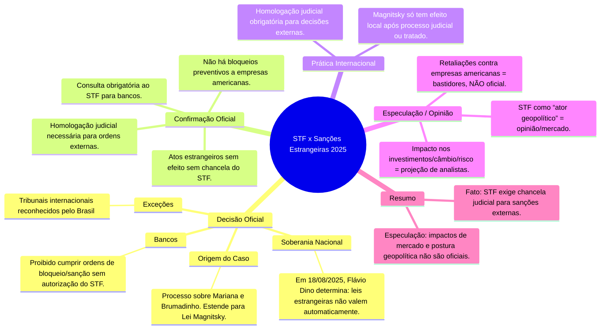

### 🇧🇷 Decisão oficial do STF

- 🏛️ **Soberania**: O STF determinou que leis, decisões judiciais e ordens executivas de governos estrangeiros não têm validade automática no Brasil.
- 🏦 **Bancos**: Instituições financeiras brasileiras devem consultar o STF antes de cumprir ordens de bloqueio de ativos ou sanções vindas do exterior.
- ⚖️ **Processo**: O cumprimento de medidas estrangeiras só será possível após homologação judicial ou previsão em tratado internacional.
- 🌐 **Tribunais internacionais**: A exceção são tribunais cuja jurisdição é reconhecida pelo Brasil.

### 💼 O que é oficial e documentado

- ✅ Proibição expressa de execução automática de ordens estrangeiras sem chancela do STF.
- ❌ Não há bloqueio prévio de ativos de empresas americanas nem retaliações financeiras em despacho oficial.
- 📄 Decisão baseada na Constituição e leis brasileiras (ex: LINDB, CPC).

### 🌍 Práticas internacionais comparadas

- 🌎 O Brasil segue o padrão global: decisões estrangeiras só têm efeito após processo judicial local, respeito à ordem pública e compatibilidade constitucional.
- ✍️ Sanções globais (como Magnitsky) só valem no Brasil após homologação judicial.

### 🤔 Especulação e opinião (não oficial)

- 🔥 A ideia de “retaliar” bloqueando ativos de empresas americanas no Brasil não aparece em despachos/decisões.
- 🌐 A crítica de que o STF age como órgão de política externa expressa análise/opinião política, não fundamento jurídico.
- 📉 Possíveis impactos em risco-país, investimentos e câmbio são projeções de analistas, não mencionados formalmente pelo STF.

***

### 🧠 Mapa Mental STF, Soberania Nacional e Sanções Estrangeiras

#### Referências

1. G1 — [Decisão de Dino impede execução automática de ordens estrangeiras](https://g1.globo.com/jornal-nacional/noticia/2025/08/18/dino-impede-bancos-de-executarem-ordens-de-governos-estrangeiros-sem-autorizacao-do-brasil.ghtml)
2. Agência Brasil — [Leis estrangeiras não valem automaticamente no Brasil, diz Dino](https://agenciabrasil.ebc.com.br/justica/noticia/2025-08/dino-decide-que-leis-estrangeiras-n%C3%A3o-valem-automaticamente-no-brasil)
3. Migalhas — [STF pode barrar efeitos da Lei Magnitsky](https://www.migalhas.com.br/quentes/437073/entenda-se-stf-pode-barrar-efeitos-da-lei-magnitsky-no-brasil)
4. CartaCapital — [Ação no STF sobre proteção contra Magnitsky](https://www.cartacapital.com.br/justica/a-outra-acao-no-stf-que-tenta-proteger-moraes-da-lei-magnitsky/)
5. Brasil de Fato — [STF proíbe restrições decorrentes de atos unilaterais estrangeiros](https://www.brasildefato.com.br/2025/08/18/em-defesa-da-soberania-nacional-stf-proibe-restricoes-decorrentes-de-atos-unilaterais-estrangeiros)
6. G1 — [Sem citar Magnitsky, Flávio Dino diz que lei de outros países não se aplica automaticamente](https://g1.globo.com/politica/blog/andreia-sadi/post/2025/08/18/dino-decisao-ibram-restricoes-atos-unilaterais-estrangeiros.ghtml)

