## MATRIZ DE INDULGÊNCIA

```mermaid
graph TD
    ROOT["🔴 MATRIZ DE INDULGÊNCIA SISTÊMICA\nP1–P10 Mapeados · 16 Operações · R$156B+"]

    ROOT --> UNIVA["🏛️ UNIVERSO A\nCleptocracia Política"]
    ROOT --> UNIVB["🎵 UNIVERSO B\nNarcocleptocracia Cultural"]
    ROOT --> P10["⚙️ P10 · INFRAESTRUTURA\nDE SERVIÇO COMPARTILHADA"]

    %% ──────── PADRÕES ────────
    subgraph PADROES["📋 10 PADRÕES SISTÊMICOS"]
        P1["P1 · Judicial\nAnulação via Defeito Processual"]
        P2["P2 · Inversão\nInvestigadores → Alvos"]
        P3["P3 · Judicial\nCaptura Judicial Emergencial"]
        P4["P4 · Midiático\nWeaponização da Narrativa"]
        P5["P5 · Financeiro\nRecursos Públicos como Vetor"]
        P6["P6 · Temporal\nEstratégia do Silêncio e Prescrição"]
        P7["P7 · Geracional\nCaptura Transgeracional"]
        P8["P8 · Tecnológico\nInfiltração em Fintechs e Cripto"]
        P9["P9 · Cultural · NOVO 2026\nCaptura Cultural e Legitimidade Simbólica"]
        P10C["P10 · Infra · NOVO 2026\nInfraestrutura Compartilhada"]
    end

    ROOT --> PADROES

    %% ──────── 5 NÓS DO GRAFO DUAL ────────
    subgraph NOS["🕸️ 5 NÓS DO GRAFO DUAL — P10"]
        N1["NÓ 1\nFundos em Camadas\nREAG · Aquilla · Sefer\nEstúdios · Gravadoras"]
        N2["NÓ 2\nAdvogado-Estruturador\nSintonia dos Gravatas\nEscrits. Reversão Custódia"]
        N3["NÓ 3\nFintech sem Rastreamento\nBK Bank · 2GO · InvBank\nApostas ilegais · Cripto"]
        N4["NÓ 4\nInfraestrutura Narrativa\nPortais · INQ 4781\nChoquei · 20M seguidores"]
        N5["NÓ 5\nOffshore Final\nDelaware · Cayman · Bahamas\nRemessas — destinos ocultos"]
    end

    UNIVA --> N1 & N2 & N3 & N4 & N5
    UNIVB --> N1 & N2 & N3 & N4 & N5

    %% ──────── OPERAÇÕES CHAVE ────────
    subgraph OPS["⚑ OPERAÇÕES DETALHADAS"]
        NF["🆕 NARCO FLUXO · Abr/2026\nR$1,6bi · 9 estados\nMC Poze · MC Ryan · Choquei"]
        CZ["COMPLIANCE ZERO\nBanco Master · R$12,2bi\nVorcaro · Toffoli · REAG"]
        CO["CARBONO OCULTO\nR$140bi estimado\nPCC → Faria Lima · BK Bank"]
        HY["HYDRA · 2024–2025\nR$6bi · 15 países\nGritzbach assassinado"]
        OO["OLIVER ORTIZ · 2009–2026\nCocaína → Master\nBotelho como nó central"]
        LJ["LAVA JATO · 2014–2021\n278 cond. revertidas\nP1+P2+P3+P4"]
        CA["CASTELO DE AREIA · 2009–2017\nAnulada por denúncia anônima\n6 anos invalidados"]
        SD["SEM DESCONTO · 2025\nFraude INSS · aposentados\ncomo laranjas involuntários"]
    end

    ROOT --> OPS

    %% ──────── ATORES TRANSVERSAIS ────────
    subgraph ATORES["👤 ATORES CHAVE MULTI-NÓ"]
        BOT["Benjamim Botelho\nEx-Banco Garantia · PT/BR\nNÓ 1✓ NÓ 3✓ NÓ 5✓"]
        AQU["Grupo Aquilla / Sefer\nFundo com Ortiz cotista\nNÓ 1✓ NÓ 5✓"]
        PCC["PCC como Ator Transversal\n14 sintonias · 13 setores\nNÓ 1✓ 2✓ 3✓ 4✓ 5✓"]
    end

    N1 --> BOT & AQU & PCC
    N5 --> BOT & AQU

    %% ──────── LIGAÇÕES OPERAÇÕES × NÓS ────────
    NF --> N3 & N4 & N5
    CZ --> N1 & N3
    CO --> N1 & N3 & N5
    HY --> N3 & N5
    OO --> N1 & N5

    %% ──────── LACUNAS CRÍTICAS ────────
    subgraph LACUNAS["⚠️ LACUNAS INVESTIGATIVAS"]
        L1["❓ Aquilla/Sefer × Narco Fluxo\nFecha o grafo?"]
        L2["❓ Destino remessas exterior\nNarco Fluxo — não divulgado"]
        L3["❓ Artistas presos × Lei Rouanet\nPatrocínio público ao tráfico?"]
    end

    NF -.-> L1 & L2 & L3
    AQU -.-> L1

    %% ──────── MECANISMOS DE PROTEÇÃO ────────
    subgraph MECPROT["🛡️ MECANISMOS DE PROTEÇÃO DO ESQUEMA"]
        MP1["Liminar Monocrática STF\nUm ministro paralisa investigação nacional"]
        MP2["Prescrição por Atraso\nCada liminar = meses de prescrição consumida"]
        MP3["Inversão do Vetor\nInvestigador vira réu · Delator vira alvo"]
        MP4["Escudo Narrativo\n'Questionar é preconceito'\nNarrativa progressista instrumentalizada"]
    end

    P1 --> MP1
    P3 --> MP1
    P6 --> MP2
    P2 --> MP3
    P9 --> MP4
    MP1 --> MP2

    %% ──────── ESTILOS ────────
    style ROOT fill:#1a1a2e,color:#ff4444,stroke:#ff4444,stroke-width:3px
    style P10 fill:#2d1b69,color:#c084fc,stroke:#c084fc
    style P9 fill:#1e3a5f,color:#60a5fa,stroke:#60a5fa
    style NF fill:#7f1d1d,color:#fca5a5,stroke:#ef4444
    style PCC fill:#4a1942,color:#f0abfc,stroke:#d946ef
    style L1 fill:#713f12,color:#fde68a,stroke:#f59e0b
    style L2 fill:#713f12,color:#fde68a,stroke:#f59e0b
    style L3 fill:#713f12,color:#fde68a,stroke:#f59e0b
    style LACUNAS fill:#292524,color:#fff
    style MECPROT fill:#1c1917,color:#fff
    style ATORES fill:#1a2e1a,color:#fff
    style NOS fill:#0f172a,color:#fff
    style PADROES fill:#1e1b4b,color:#fff
    style OPS fill:#1a1a1a,color:#fff

```

- [Mapeamento](https://mermaid.live/view#pako:eNqdWG1v29YV_isX6rp-iO2IFCVbBraCpiRHmUQqlOwtnvfhSryS2VK8Kl_cxEGAAANaoMNWdEkwbN2wBRswZEA_pcWKfBz_if_A9hP2nEtKFv3SGhUChvfynuece96Pn1Qm0hOV3cos4osTNmodhww_13FGvzyu_O-vL75mfXPkdo9Yq826duugt599Zltdkw27w1H2Wb9rmcfH4UA7f_Z8oFVZny8E92TM_vNvpjWYsxARz_6ZfSPUjvsjrd7Yu3Nc-dVxeMGIbW7-lB3Y3UNTsfz8y_9--7lat92hwwjeCsQikZOIT3zOBjLIvkr8CVcwV0D2FMjvvrlA2AOCzaOJnKzDWGmQpBEPrqLgHsA4_9MfSQ66FCTv2h3XbA9H7sHowCWRoI5h2z3sZp86zHL6A9MddXv3zJa5drl332XnL55d-48NzJabvWwPbzyRQ8TpOLcMnXfaQ3W5579hkGqFsLKEM1xdhn4DDacHGol_P_V8XDqA4GaYBmSSv0t2CjW0xFT4iWSDSE5EHKdrClEYOmHoSgXhqYhi0AGE3uPEn8HUEUx7_snvmRmcyrhMWyPa2iX-Fl-Q3ldbrD0X0UyE6nOJ3CByg8j7vudnr2Bz4v1zwRcy9M-KS3icwbgRT_xTXqavE32d6Dt-yMOJ8COid8UkjWK46CB7Ow6AGbOJnEt2KBIZlREahNAghJGYL2SkLtCOE3DLXs-gPU-yoR9k_4L0kgkoUcSTyFeClZG2CWmbkPYF-Z8MS8oYRTyMZxdfSrQ7RLuTSzEJ4f1vZrkmuuHUD5KoUISY0z0TMTmJIYoV-fD1MlCTgJoEtHR-eredQ4fpVb2xJs_qu2A9MfMTf-573BO47HycvQnWgy_3tKqlfC2PlXAKiEvIahM-E6U5Azlf8CjxgxPuXWCJ0LuSGArHv01M1ZmdPR-ylsP2XbPjsNaB2bttfNlOHlsvv6Wovx7p2Qu6aenmNsUYzjINd-ykIaU-GMLic9wrJm9rm_ukC_Oj1A8CpZYhQi7KHSl76_l5styP-ClFEy_HkK0X-DqFrncqKeQ220s9ggD7Q5gdEUHuGOdAieLdJmdM4i3miiJ0YVgwfeP5ZfvZtYJLjW6ROxGLcQ-Xg5PgcwEG-LT3M7bHww9JXn3fKZIC7ZBwCxmDLfMDMeO-utM1PmgbBSfjqk9chDEKioySAqVrP2DG9g4p2DqRH6XCV_yrfUg4S32Vgco86gWPOkic6TQ-wRGVAyjkWiLgH3NskID88ZyH9LbHT2AyZTAxRx7ERcjcHmW5EFqVE0TEWn5b81RVuZSr2hr7MSxGjxo9DHrUL07tfeep7_dvZ9B2zexTlfSte-Zh-7bO7QyGqqJ9UYJotUemKlnlsmF3VCB88pLZpms5rNM7-IWytTmO7hbRjEK-0RgrQzQZdEQlH9t9C9X5TKkWr-7jXLeF1UpMrCMwobrZ65q21WZHbdchB0Oalmgi4kRERcOgb-hjH58OZTThkVRpUE6nMlDcKbzKwA4Bm-6eYzvMsQ56IyeX16hCXjInIpN8eWBZqm51eITI6WFb-UHu4SXIew8Bee9hyzVzx9MNNDv4r66ACzVodbbg2VexID3sI-zOxhxBxMmVYrieV44Dh8R0etShMAetw1EOXW3m0CoXywkAQ66kzFVCGpKJCE5kXrLC7A2bIDajSyWjdx_oPRNued8cOTm0VkhNcaRv7wAg9LZYRJkh8fNcNdDuDPQ7g9qdgVHWqal0Ohy1ew71gabb7polgbXtZWeBcoxCicAJs7dU0xkPs69DaBcHGlgglvzwlAdUTy71C8MW2AzbfbAYWo69FFzpuRPxFPWnaw-HtIsOIMa9C7dTugg4augHXMHLIA2T7FXkXx-xq9qCuLhN3EGHLuJl5Jr2kFpKs3vrti0nVQH1xT-WQHns9uGb3U3kqZIS9lTjvSdwlbk_Z4W5KZk_2syjY58umvjKXQeju3sutbdUgc7__JypJL58qeOlBG4-OAD4fpQu5Kog3V3VI1W-yLGYA5c4w1viI7Qvw19BRSRR8Uc8KUOYaKPyhoaKjsq5msHiokblk0ENuTtRiXsNXKeHEt6gR4nPmvWQP8l2UBQSJ26EJ3gX3-rlb7exbq-7v8yI69kx-0PeA3y3oe1OntOv5HvraC3Z14o9Z31v7fC9h2soxZ6zfvhW5aFnWge2Cfdys9-OMJfd2kkLQlUi_kbtzxKpax9i5oF-Rihx5SrRo8bn_C_Pl350V3mR0hqNWqwTpI_IbTtoJTiTDJym8v0yhF5AtPIqi2RUlF7xCMnOV73NGpqqyKHq-f3TNJhdzqm92lKkSDluzBbwMCQcCNVD1-DKlIcioUTHE4w7SK7o2hfFFMC4ZEmUvZri_f1r_Q6m3oJFemSRHtXvXmFXcsLi023s1G9bpt0d9h0qwWzgOqM2fO7Xzm3NBXoiUknly1dkrxsR0cC2hw8O2n2zpKm-Gg1R81CYItaXIYZiNV9xNhx1oKCDOcM3KBEFF3060nXMKbHmQ18-b4TXDSv9fGBcm4NUOTBRomKpBgwUiKBg_BMGe2N8RGJfrFOgNMUpTRyXoMm-qymUZq98ZCuPo5hq0UtG2euUMg11e8lyk2NEvQRJ7Sja5BRgy_aTxHzvQUqAkqTMXpN0kGlCg_J7uU_mjSo-yBkkj8ndoB9qZalXhr7ObphrBnn2ggWKde3SulGs9WKtF-vC1zC_5WsjX_dXgPptfI_Cued8b2ZIHgciL5OYMIPddzSucV1sTGQgo913plMDvw3yjg_FpeXmx76XnOzWFo_WoWgyzJF0Txs3mkukSXXHmE5WSPmyRNhcSiBqvD5d0jWqWPAVXb5cp0Ow5nTbU83TvJXkE17n9RWdUJKX-KGK5YQG15qGviKs8vGaoF7TaIjpOiGyQsFQq021CzpPNHYuBJ3Wm6I6LtHpP5Cu9gPpitReWKOp13Xjwq6lKxV5ZmmAidbUtm84WjQ2S2fRhcZvOIk5uzhWnWrb-k3Hiql_ZXxtbIxvOIombs1LS4wrG5VZ5HuVXcSl2KjMRTTntKw8IYDjSnKCinNc2cWrxyN0_cfhU9AseHgk5XxJFsl0dlLZnfIgxipdeDwRLZ8jGV8cQYSLyJJoOyu79bqCqOw-qTyq7G7WtvWtnWZdr9aatZ1G1dCMjcrjyq7eaG4ZVWNb1426XtN2mk83KmeKq7al7xg1TduGaZv6jq7XNirCQ-6J-vnfatWfbJ_-HzJzoxU)
