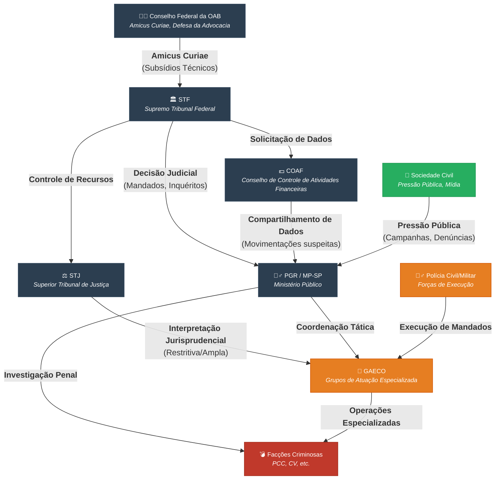

```mermaid
graph TD
  %% === NÓS (com emojis e rótulos claros) ===
  STF[🏛️ STF<br><i>Supremo Tribunal Federal</i>]
  STJ[⚖️ STJ<br><i>Superior Tribunal de Justiça</i>]
  CF[👩‍⚖️ Conselho Federal da OAB<br><i>Amicus Curiae, Defesa da Advocacia</i>]
  COAF[💵 COAF<br><i>Conselho de Controle de Atividades Financeiras</i>]
  MP[🕵️‍♂️ PGR / MP-SP<br><i>Ministério Público</i>]
  GAECO[🚨 GAECO<br><i>Grupos de Atuação Especializada</i>]
  Facções[💣 Facções Criminosas<br><i>PCC, CV, etc.</i>]
  Polícia[👮‍♂️ Polícia Civil/Militar<br><i>Forças de Execução</i>]
  Sociedade[👥 Sociedade Civil<br><i>Pressão Pública, Mídia</i>]

  %% === RELACIONAMENTOS ===
  STF -- <b>Decisão Judicial</b><br>(Mandados, Inquéritos) --> MP
  STF -- <b>Controle de Recursos</b> --> STJ
  STF -- <b>Solicitação de Dados</b> --> COAF
  STJ -- <b>Interpretação Jurisprudencial</b><br>(Restritiva/Ampla) --> GAECO
  CF -- <b>Amicus Curiae</b><br>(Subsídios Técnicos) --> STF
  COAF -- <b>Compartilhamento de Dados</b><br>(Movimentações suspeitas) --> MP
  MP -- <b>Investigação Penal</b> --> Facções
  MP -- <b>Coordenação Tática</b> --> GAECO
  GAECO -- <b>Operações Especializadas</b> --> Facções
  Polícia -- <b>Execução de Mandados</b> --> GAECO
  Sociedade -- <b>Pressão Pública</b><br>(Campanhas, Denúncias) --> MP

  %% === ESTILOS OPCIONAIS (para cor, se suportado) ===
  classDef instituicao fill:#2c3e50,stroke:#34495e,color:white,font-size:12px;
  classDef operacional fill:#e67e22,stroke:#d35400,color:white,font-size:12px;
  classDef ameaca fill:#c0392b,stroke:#a02c1b,color:white,font-size:12px;
  classDef sociedade fill:#27ae60,stroke:#219653,color:white,font-size:12px;

  class STF,STJ,CF,COAF,MP instituicao
  class GAECO,Polícia operacional
  class Facções ameaca
  class Sociedade sociedade
```  